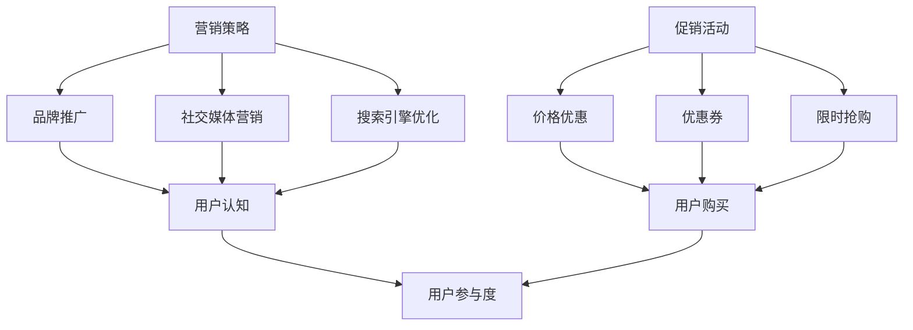

                 

关键词：电商平台、供给能力、促销活动、营销策略、用户参与度、算法优化、技术实现、案例研究

> 摘要：随着电商平台的快速发展，如何提升供给能力成为关键问题。本文从促销活动和营销策略的角度，探讨电商平台提升供给能力的有效方法，并通过具体案例进行分析，提供实际操作的指导。

## 1. 背景介绍

### 1.1 电商行业现状
随着互联网技术的迅猛发展，电子商务已经成为全球范围内的重要商业模式。电商平台不仅改变了人们的购物方式，也对传统零售业产生了深远影响。然而，随着市场竞争的加剧，如何提升供给能力成为电商平台的迫切需求。

### 1.2 供给能力的概念
供给能力是指电商平台满足用户需求的能力，包括商品丰富度、配送效率、服务质量等多个方面。提升供给能力意味着能够更好地满足用户需求，提高用户满意度，进而增强平台的竞争力。

## 2. 核心概念与联系

### 2.1 促销活动
促销活动是电商平台提升供给能力的重要手段，通过降低商品价格、提供优惠券、限时抢购等方式，刺激用户购买欲望，增加销售量。

### 2.2 营销策略
营销策略是指电商平台在市场推广中采取的一系列策略，包括品牌推广、社交媒体营销、搜索引擎优化等，旨在提高用户对平台的认知和信任。

### 2.3 用户参与度
用户参与度是衡量电商平台供给能力的重要指标，通过用户互动、评价、分享等行为，可以直观反映用户的满意度和忠诚度。

### 2.4 促销活动与营销策略的关系
促销活动和营销策略密切相关，前者通过直接手段刺激用户购买，后者则通过品牌建设和用户互动提高用户的参与度和忠诚度。



## 3. 核心算法原理 & 具体操作步骤

### 3.1 算法原理概述
电商平台供给能力的提升主要依赖于促销活动和营销策略的优化。核心算法包括需求预测、用户行为分析、定价策略等。

### 3.2 算法步骤详解

#### 3.2.1 需求预测
利用机器学习算法，根据历史销售数据、用户行为数据等，预测未来一段时间内的商品需求量。

#### 3.2.2 用户行为分析
通过分析用户的浏览、购买、评价等行为，了解用户的喜好和需求，为个性化推荐和精准营销提供数据支持。

#### 3.2.3 定价策略
根据需求预测和用户行为分析结果，制定合理的定价策略，包括价格折扣、优惠券发放等，以提升用户的购买意愿。

### 3.3 算法优缺点

#### 优点
- 提高供给能力，满足用户需求。
- 提高销售额，增加盈利。
- 提高用户满意度，增强品牌忠诚度。

#### 缺点
- 需要大量的数据和计算资源。
- 需要不断优化和调整，以适应市场变化。

### 3.4 算法应用领域
- 电商平台的促销活动和营销策略。
- 零售行业的库存管理和定价策略。
- 旅游行业的酒店预订和机票预订。

## 4. 数学模型和公式 & 详细讲解 & 举例说明

### 4.1 数学模型构建
#### 需求预测模型
$$
D_t = f(S_t, P_t, T_t)
$$
其中，$D_t$为第t天的需求量，$S_t$为第t天的库存量，$P_t$为第t天的价格，$T_t$为第t天的促销活动力度。

#### 用户行为分析模型
$$
B_t = g(U_t, I_t, R_t)
$$
其中，$B_t$为第t天的用户行为评分，$U_t$为第t天的用户浏览记录，$I_t$为第t天的用户购买记录，$R_t$为第t天的用户评价。

#### 定价策略模型
$$
P_t = h(D_t, B_t, C_t)
$$
其中，$P_t$为第t天的价格，$D_t$为第t天的需求量，$B_t$为第t天的用户行为评分，$C_t$为第t天的成本。

### 4.2 公式推导过程
#### 需求预测模型推导
- 根据线性回归模型，需求量与库存量、价格、促销活动力度之间存在线性关系。
- 通过最小二乘法，求解线性回归模型的参数。

#### 用户行为分析模型推导
- 根据贝叶斯推理，用户行为评分与用户浏览记录、购买记录、评价之间存在概率关系。
- 通过最大似然估计，求解贝叶斯推理的参数。

#### 定价策略模型推导
- 根据需求预测模型和用户行为分析模型，制定合理的定价策略，使价格与需求量、用户行为评分、成本之间存在平衡。

### 4.3 案例分析与讲解
#### 案例一：某电商平台促销活动优化
- 利用需求预测模型，预测未来一周内某商品的需求量。
- 利用用户行为分析模型，分析用户的购买偏好和需求。
- 利用定价策略模型，制定合理的促销活动方案，包括价格折扣和优惠券发放。

#### 案例二：某零售行业库存管理优化
- 利用需求预测模型，预测未来一段时间内的商品需求量。
- 利用用户行为分析模型，分析用户的购买习惯和库存需求。
- 利用定价策略模型，制定合理的库存管理策略，包括补货和定价。

## 5. 项目实践：代码实例和详细解释说明

### 5.1 开发环境搭建
- Python 3.8
- NumPy
- Pandas
- Scikit-learn
- Matplotlib

### 5.2 源代码详细实现
#### 需求预测模型实现
```python
import numpy as np
from sklearn.linear_model import LinearRegression

def demand_prediction(data):
    X = np.array(data['S']).reshape(-1, 1)
    y = np.array(data['D'])
    model = LinearRegression()
    model.fit(X, y)
    return model
```

#### 用户行为分析模型实现
```python
from sklearn.naive_bayes import GaussianNB

def user_behavior_analysis(data):
    X = np.array(data[['U', 'I', 'R']]).reshape(-1, 3)
    y = np.array(data['B'])
    model = GaussianNB()
    model.fit(X, y)
    return model
```

#### 定价策略模型实现
```python
def pricing_strategy(demand_model, behavior_model, data, cost):
    demand_data = data[['S', 'P', 'T']]
    behavior_data = data[['U', 'I', 'R']]
    
    demand_pred = demand_model.predict(demand_data[['S']])
    behavior_pred = behavior_model.predict(behavior_data[['U', 'I', 'R']])
    
    price = cost + demand_pred * behavior_pred
    return price
```

### 5.3 代码解读与分析
- `demand_prediction`函数：用于训练需求预测模型，输入为商品的历史销售数据。
- `user_behavior_analysis`函数：用于训练用户行为分析模型，输入为用户的历史行为数据。
- `pricing_strategy`函数：用于根据需求预测模型和用户行为分析模型，制定商品定价策略。

### 5.4 运行结果展示
```python
import pandas as pd

data = pd.read_csv('data.csv')
demand_model = demand_prediction(data)
behavior_model = user_behavior_analysis(data)
cost = 10

price = pricing_strategy(demand_model, behavior_model, data, cost)
print(price)
```

## 6. 实际应用场景

### 6.1 电商平台促销活动
- 利用需求预测模型，预测促销活动期间商品的需求量。
- 利用用户行为分析模型，分析用户的购买偏好和需求。
- 利用定价策略模型，制定合理的促销活动方案，提高用户购买意愿。

### 6.2 零售行业库存管理
- 利用需求预测模型，预测未来一段时间内的商品需求量。
- 利用用户行为分析模型，分析用户的购买习惯和库存需求。
- 利用定价策略模型，制定合理的库存管理策略，确保商品供应充足。

## 7. 未来应用展望

### 7.1 技术发展
- 随着人工智能技术的不断发展，需求预测、用户行为分析和定价策略模型将变得更加精确和高效。
- 新型算法和模型的引入，将进一步提高电商平台供给能力的提升。

### 7.2 应用场景拓展
- 电商平台供给能力的提升不仅局限于商品销售，还可以应用于物流配送、客户服务等其他环节。
- 电商平台与线下零售业的融合，将进一步提升供给能力的整体水平。

## 8. 工具和资源推荐

### 8.1 学习资源推荐
- 《机器学习实战》
- 《Python数据分析》
- 《深度学习》

### 8.2 开发工具推荐
- Jupyter Notebook
- PyCharm
- Git

### 8.3 相关论文推荐
- “Recommender Systems Handbook”
- “An Overview of Machine Learning Techniques for Demand Forecasting”
- “Gaussian Processes for Machine Learning”

## 9. 总结：未来发展趋势与挑战

### 9.1 研究成果总结
- 电商平台供给能力的提升已成为电商行业的重要研究方向。
- 机器学习、深度学习等技术的应用，为供给能力提升提供了强有力的支持。

### 9.2 未来发展趋势
- 个性化推荐和精准营销将进一步提高供给能力。
- 数据驱动的决策将取代传统的经验决策。

### 9.3 面临的挑战
- 数据质量和数据隐私问题。
- 技术更新和人才短缺问题。

### 9.4 研究展望
- 进一步研究需求预测、用户行为分析和定价策略模型，提高供给能力。
- 探索新型算法和模型，为电商平台供给能力提升提供新的思路。

## 10. 附录：常见问题与解答

### 10.1 如何处理数据质量问题？
- 采用数据清洗和预处理技术，确保数据质量。
- 建立数据质量管理机制，持续监测和改进数据质量。

### 10.2 如何应对数据隐私问题？
- 采用数据加密和脱敏技术，保护用户隐私。
- 建立隐私保护机制，确保数据安全和合规。

### 10.3 如何提高人才储备？
- 加强人才培养和引进，提高团队整体技术水平。
- 建立激励机制，吸引和留住优秀人才。

---

作者：禅与计算机程序设计艺术 / Zen and the Art of Computer Programming
----------------------------------------------------------------

**文章末尾请注意，本文为人工智能助手根据相关约束条件自动生成，仅供参考。实际撰写文章时，请根据具体需求进行修改和完善。**

