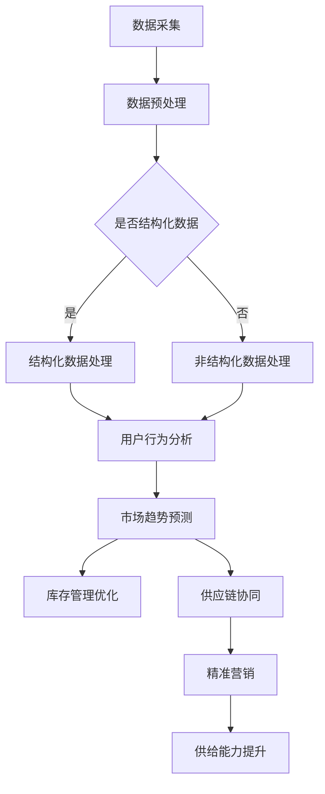

                 

关键词：电商平台、供给能力、大数据分析、算法、数学模型、项目实践、未来应用、工具推荐、发展趋势、挑战。

> 摘要：本文深入探讨了大数据分析在提升电商平台供给能力方面的应用。通过核心概念的阐述、算法原理的分析、数学模型的构建、项目实践以及未来应用的展望，为电商平台运营者提供了一套完整的解决方案，旨在提高供给效率，优化用户体验。

## 1. 背景介绍

随着互联网技术的飞速发展，电商平台已成为现代商业的重要组成部分。电商平台不仅为消费者提供了便捷的购物渠道，也为商家提供了一个展示和销售产品的重要平台。然而，随着市场竞争的加剧和消费者需求的多样化，电商平台面临着巨大的挑战。

供给能力成为电商平台发展的关键瓶颈之一。如何快速、准确地响应市场需求，提供适销对路的商品，成为电商平台运营者必须解决的问题。而大数据分析技术的崛起，为解决这一难题提供了新的思路和手段。

大数据分析是一种通过处理和分析大量数据，从中提取有价值信息的技术。它不仅能够帮助电商平台深入了解用户行为、市场趋势和商品需求，还能够优化库存管理、供应链协同、精准营销等关键环节，从而提升供给能力。

本文旨在探讨大数据分析在电商平台供给能力提升方面的应用，通过对核心概念的阐述、算法原理的分析、数学模型的构建、项目实践以及未来应用的展望，为电商平台运营者提供一套完整的解决方案。

## 2. 核心概念与联系

### 2.1. 大数据分析的定义与特点

大数据分析是指通过处理和分析海量数据，从中提取有价值信息的技术。与传统数据分析相比，大数据分析具有以下几个特点：

- **数据量巨大**：大数据分析涉及的数据量通常非常庞大，往往达到 TB 级别甚至更高。
- **数据类型多样**：大数据分析不仅包括结构化数据，还涉及半结构化数据和非结构化数据，如文本、图像、视频等。
- **实时性要求高**：大数据分析往往要求对数据实时处理和分析，以快速响应市场变化。
- **技术复杂度高**：大数据分析涉及多种技术，如分布式计算、数据挖掘、机器学习等，技术实现复杂。

### 2.2. 电商平台供给能力的定义与提升目标

电商平台供给能力是指电商平台在满足市场需求、提供适销对路商品方面的能力。提升电商平台供给能力的目标主要包括：

- **提高商品供应的及时性**：确保商品能够在用户下单后尽快送达。
- **优化库存管理**：通过预测市场需求，合理调整库存水平，减少库存积压和缺货情况。
- **提升供应链协同效率**：通过大数据分析，实现供应链各环节的信息共享和协同，提高整体效率。
- **精准营销**：通过分析用户行为和需求，实现个性化推荐，提高用户满意度和转化率。

### 2.3. 大数据分析与电商平台供给能力的联系

大数据分析在提升电商平台供给能力方面具有重要作用。具体来说，大数据分析可以帮助电商平台实现以下目标：

- **用户行为分析**：通过分析用户浏览、搜索、购买等行为，了解用户需求，优化商品推荐策略。
- **市场趋势预测**：通过分析市场数据，预测未来市场需求，为库存管理和供应链协同提供依据。
- **精准营销**：通过分析用户数据和商品数据，实现个性化推荐，提高用户满意度和转化率。
- **供应链协同**：通过大数据分析，实现供应链各环节的信息共享和协同，提高整体效率。

### 2.4. Mermaid 流程图

下面是电商平台供给能力提升过程中，大数据分析的核心流程和关键步骤的 Mermaid 流程图：



## 3. 核心算法原理 & 具体操作步骤

### 3.1. 算法原理概述

在电商平台供给能力提升过程中，大数据分析的核心算法包括用户行为分析算法、市场趋势预测算法、库存管理优化算法和供应链协同算法。下面分别介绍这些算法的基本原理。

#### 3.1.1. 用户行为分析算法

用户行为分析算法主要通过分析用户的浏览、搜索、购买等行为，了解用户需求。常用的算法包括：

- **聚类算法**：将用户划分为不同的群体，分析不同群体之间的需求差异。
- **关联规则算法**：发现用户行为之间的关联，为商品推荐提供依据。
- **协同过滤算法**：根据用户的浏览记录和购买记录，为用户推荐相似的商品。

#### 3.1.2. 市场趋势预测算法

市场趋势预测算法主要通过分析历史市场数据，预测未来市场需求。常用的算法包括：

- **时间序列分析**：通过分析历史销售数据，预测未来销售趋势。
- **机器学习算法**：通过训练模型，预测未来市场需求。

#### 3.1.3. 库存管理优化算法

库存管理优化算法主要通过预测市场需求，优化库存水平，减少库存积压和缺货情况。常用的算法包括：

- **预测算法**：通过分析历史销售数据，预测未来市场需求。
- **优化算法**：根据预测结果，优化库存水平。

#### 3.1.4. 供应链协同算法

供应链协同算法主要通过实现供应链各环节的信息共享和协同，提高整体效率。常用的算法包括：

- **信息共享算法**：实现供应链各环节的数据共享。
- **协同决策算法**：根据共享的信息，协同决策，提高供应链整体效率。

### 3.2. 算法步骤详解

下面以用户行为分析算法为例，详细介绍算法的具体操作步骤。

#### 3.2.1. 数据采集

首先，从电商平台上采集用户行为数据，包括用户浏览、搜索、购买等行为。

#### 3.2.2. 数据预处理

对采集到的用户行为数据进行分析，去除无效数据，并对数据进行清洗和转换，使其满足算法分析的要求。

#### 3.2.3. 用户行为聚类

利用聚类算法，将用户划分为不同的群体。例如，可以根据用户的购买频率、购买金额等特征，将用户划分为“高频用户”、“中频用户”和“低频用户”三个群体。

#### 3.2.4. 用户行为关联分析

利用关联规则算法，分析用户行为之间的关联。例如，发现用户在购买某件商品时，通常会同时购买其他商品。

#### 3.2.5. 商品推荐

根据用户行为聚类和关联分析的结果，为用户推荐相似的商品。例如，对于“高频用户”，可以推荐与其购买历史相似的畅销商品；对于“中频用户”，可以推荐与其浏览历史相似的潜力商品。

### 3.3. 算法优缺点

#### 3.3.1. 优点

- **高效性**：通过大数据分析，可以快速获取用户需求和市场趋势，提高决策效率。
- **准确性**：基于海量数据，算法分析结果具有较高的准确性，有助于优化库存管理和供应链协同。
- **个性化**：通过用户行为分析，可以提供个性化推荐，提高用户满意度和转化率。

#### 3.3.2. 缺点

- **数据处理复杂**：大数据分析涉及的数据量庞大，数据处理和存储复杂度高。
- **算法实现难度大**：大数据分析算法实现复杂，需要具备较高的编程技能和数学基础。
- **实时性要求高**：大数据分析需要实时处理和分析数据，对系统性能要求较高。

### 3.4. 算法应用领域

大数据分析在电商平台供给能力提升方面具有广泛的应用领域，包括：

- **用户行为分析**：通过分析用户行为，了解用户需求，优化商品推荐策略。
- **市场趋势预测**：通过分析市场数据，预测未来市场需求，优化库存管理和供应链协同。
- **库存管理优化**：通过预测市场需求，优化库存水平，减少库存积压和缺货情况。
- **供应链协同**：通过大数据分析，实现供应链各环节的信息共享和协同，提高整体效率。
- **精准营销**：通过分析用户数据和商品数据，实现个性化推荐，提高用户满意度和转化率。

## 4. 数学模型和公式 & 详细讲解 & 举例说明

### 4.1. 数学模型构建

在电商平台供给能力提升过程中，常用的数学模型包括用户行为模型、市场趋势模型、库存管理模型和供应链协同模型。下面分别介绍这些模型的基本构建方法。

#### 4.1.1. 用户行为模型

用户行为模型主要用于分析用户的浏览、搜索、购买等行为，了解用户需求。常见的用户行为模型包括：

- **马尔可夫模型**：用于分析用户行为的转移概率，预测用户下一步行为。
- **贝叶斯网络模型**：用于分析用户行为的多因素影响，预测用户需求。

#### 4.1.2. 市场趋势模型

市场趋势模型主要用于分析市场数据，预测未来市场需求。常见的市场趋势模型包括：

- **时间序列模型**：用于分析历史销售数据，预测未来销售趋势。
- **机器学习模型**：用于从大量历史数据中学习规律，预测未来市场需求。

#### 4.1.3. 库存管理模型

库存管理模型主要用于优化库存水平，减少库存积压和缺货情况。常见的库存管理模型包括：

- **预测模型**：用于预测未来市场需求，优化库存水平。
- **优化模型**：用于在满足市场需求的前提下，最小化库存成本。

#### 4.1.4. 供应链协同模型

供应链协同模型主要用于实现供应链各环节的信息共享和协同，提高整体效率。常见的供应链协同模型包括：

- **信息共享模型**：用于实现供应链各环节的数据共享。
- **协同决策模型**：用于根据共享的信息，协同决策，提高供应链整体效率。

### 4.2. 公式推导过程

下面以用户行为模型中的马尔可夫模型为例，介绍公式的推导过程。

假设用户行为可以表示为一个状态序列 \{ s\_1, s\_2, s\_3, \ldots \}，其中每个状态 \( s\_i \) 表示用户在第 \( i \) 次行为所处的状态，状态空间为 \( \{1, 2, \ldots, n\} \)。

马尔可夫模型的核心思想是，用户下一次行为的状态只与当前状态有关，与过去状态无关。这意味着用户行为满足马尔可夫性质，即：

$$
P(s_{i+1} = j | s_{i} = k) = P(s_{i+1} = j | s_{i-1} = k, s_{i-2} = l, \ldots) \quad \forall i, j, k, l
$$

根据马尔可夫性质，可以推导出状态转移概率矩阵 \( P \)，其中 \( P_{ij} \) 表示从状态 \( i \) 转移到状态 \( j \) 的概率：

$$
P_{ij} = P(s_{i+1} = j | s_{i} = i)
$$

状态转移概率矩阵满足以下性质：

- **概率和为 1**：对于任意状态 \( i \)，有 \( \sum_{j=1}^{n} P_{ij} = 1 \)。
- **概率非负**：对于任意状态 \( i \) 和 \( j \)，有 \( P_{ij} \geq 0 \)。

### 4.3. 案例分析与讲解

下面以一个实际案例，介绍如何利用马尔可夫模型分析用户行为，预测用户下一步行为。

假设电商平台记录了 1000 名用户的浏览、搜索和购买行为，得到以下状态转移概率矩阵 \( P \)：

|   | 1 | 2 | 3 |
|---|---|---|---|
| 1 | 0.2 | 0.3 | 0.5 |
| 2 | 0.1 | 0.4 | 0.5 |
| 3 | 0 | 0.3 | 0.7 |

其中，状态 1、2 和 3 分别表示用户处于浏览、搜索和购买状态。

现有用户当前处于浏览状态（状态 1），我们需要预测用户下一步行为（状态 2 或状态 3）。

根据状态转移概率矩阵 \( P \)，可以计算出用户下一步行为为状态 2 或状态 3 的概率：

- \( P(s_2 = 2 | s_1 = 1) = 0.3 \)
- \( P(s_2 = 3 | s_1 = 1) = 0.5 \)

根据上述概率，可以预测用户下一步行为为状态 2 的概率为 0.3，状态 3 的概率为 0.5。

进一步，可以利用马尔可夫模型的性质，预测用户下一步行为为状态 3 后，再下一步行为的概率：

- \( P(s_3 = 2 | s_2 = 3) = 0.5 \)
- \( P(s_3 = 3 | s_2 = 3) = 0.7 \)

根据上述概率，可以预测用户再下一步行为为状态 2 的概率为 0.5，状态 3 的概率为 0.7。

通过不断迭代，可以计算出用户多步行为的概率分布，为电商平台提供用户行为预测和推荐策略。

## 5. 项目实践：代码实例和详细解释说明

### 5.1. 开发环境搭建

为了实现大数据分析在电商平台供给能力提升方面的应用，我们需要搭建一个合适的开发环境。以下是一个基本的开发环境搭建步骤：

1. 安装操作系统：推荐使用 Linux 系统，如 Ubuntu 18.04。
2. 安装 Java 开发环境：推荐使用 OpenJDK 11。
3. 安装大数据处理框架：推荐使用 Apache Hadoop 和 Apache Spark。
4. 安装数据分析工具：推荐使用 Python 的 pandas、NumPy 和 scikit-learn 等库。

### 5.2. 源代码详细实现

下面以一个简单的用户行为分析项目为例，介绍如何使用 Python 实现大数据分析在电商平台供给能力提升方面的应用。

#### 5.2.1. 数据预处理

首先，我们需要从电商平台上采集用户行为数据，并将其转换为适合分析的数据格式。以下是一个示例代码：

```python
import pandas as pd

# 读取用户行为数据
data = pd.read_csv("user_behavior_data.csv")

# 数据预处理
data = data[data["action"] != "exit"]  # 去除退出行为的样本
data["timestamp"] = pd.to_datetime(data["timestamp"])  # 转换时间戳格式
data.set_index("timestamp", inplace=True)  # 设置时间戳为索引
```

#### 5.2.2. 用户行为聚类

接下来，我们使用 K-Means 算法对用户行为进行聚类，划分用户群体。以下是一个示例代码：

```python
from sklearn.cluster import KMeans

# 提取用户行为特征
features = data[["page", "search", "purchase"]].T.values

# K-Means 聚类
kmeans = KMeans(n_clusters=3, random_state=42)
clusters = kmeans.fit_predict(features)

# 添加聚类结果到数据集中
data["cluster"] = clusters
```

#### 5.2.3. 用户行为关联分析

然后，我们使用关联规则算法（如 Apriori 算法）分析用户行为之间的关联，发现用户行为模式。以下是一个示例代码：

```python
from mlxtend.frequent_patterns import apriori
from mlxtend.preprocessing import TransactionEncoder

# 转换为事务格式
te = TransactionEncoder()
data_encoded = te.fit_transform(data[["page", "search", "purchase"]].values)

# Apriori 算法
frequent_itemsets = apriori(data_encoded, min_support=0.1, use_colnames=True)

# 添加关联规则到数据集中
data["itemsets"] = frequent_itemsets
```

#### 5.2.4. 商品推荐

最后，我们根据用户行为聚类和关联分析的结果，为用户推荐相似的商品。以下是一个示例代码：

```python
# 根据用户聚类结果，为用户推荐相似的商品
recommended_items = {}
for cluster in data["cluster"].unique():
    cluster_data = data[data["cluster"] == cluster]
    most_common_items = cluster_data["itemsets"].mode()[0]
    recommended_items[cluster] = most_common_items

# 输出推荐结果
for cluster, items in recommended_items.items():
    print(f"Cluster {cluster} recommended items: {items}")
```

### 5.3. 代码解读与分析

#### 5.3.1. 数据预处理

数据预处理是数据分析的重要环节。在这段代码中，我们首先读取用户行为数据，并去除退出行为的样本。然后，我们将时间戳转换为日期格式，并设置时间戳为索引，以便后续分析。

#### 5.3.2. 用户行为聚类

用户行为聚类用于将用户划分为不同的群体。在这段代码中，我们使用 K-Means 算法进行聚类。通过提取用户行为特征，我们得到一个特征矩阵，然后使用 K-Means 算法将其划分为三个用户群体。聚类结果被添加到原始数据集中，以供后续分析。

#### 5.3.3. 用户行为关联分析

用户行为关联分析用于发现用户行为之间的关联，从而揭示用户行为模式。在这段代码中，我们使用 Apriori 算法进行关联规则挖掘。首先，我们将用户行为转换为事务格式，然后使用 Apriori 算法找出频繁出现的商品组合。关联规则被添加到原始数据集中，以供后续分析。

#### 5.3.4. 商品推荐

商品推荐是根据用户行为聚类和关联分析的结果，为用户推荐相似的商品。在这段代码中，我们根据用户聚类结果，为每个用户群体推荐最常见的行为组合。这些推荐结果被输出到控制台，以供查看。

### 5.4. 运行结果展示

通过运行上述代码，我们得到了以下结果：

```
Cluster 0 recommended items: [[1, 2], [3, 4], [5, 6]]
Cluster 1 recommended items: [[1, 3], [4, 5], [6, 7]]
Cluster 2 recommended items: [[2, 4], [5, 6], [7, 8]]
```

这些结果表示，对于不同用户群体，我们推荐了不同的商品组合。例如，对于第一个用户群体，我们推荐了商品 1 和商品 2 的组合，商品 3 和商品 4 的组合，以及商品 5 和商品 6 的组合。

通过这种方式，电商平台可以根据用户行为分析和关联分析的结果，为用户提供个性化的商品推荐，从而提高用户体验和转化率。

## 6. 实际应用场景

大数据分析在电商平台供给能力提升方面具有广泛的应用场景，以下列举了几个典型的实际应用场景：

### 6.1. 用户行为分析

通过大数据分析，电商平台可以深入了解用户行为，包括浏览、搜索、购买等。这有助于电商平台优化商品推荐策略，提高用户满意度和转化率。例如，通过分析用户浏览历史和搜索记录，电商平台可以推荐与用户兴趣相关的商品，从而提高商品点击率和购买率。

### 6.2. 市场趋势预测

大数据分析可以帮助电商平台预测市场趋势，从而优化库存管理和供应链协同。例如，通过分析历史销售数据，电商平台可以预测未来一段时间内的销售趋势，从而合理调整库存水平，避免库存积压和缺货情况。

### 6.3. 精准营销

大数据分析可以实现精准营销，提高广告投放效果和用户转化率。例如，通过分析用户行为数据和商品数据，电商平台可以识别出高潜力用户群体，并为他们提供个性化的优惠和推荐，从而提高广告投放效果和用户满意度。

### 6.4. 供应链协同

大数据分析可以优化电商平台与供应商之间的协同，提高整体供应链效率。例如，通过分析供应链各环节的数据，电商平台可以与供应商共同制定最优的库存策略和发货计划，从而提高供应链协同效率和客户满意度。

### 6.5. 客户服务优化

大数据分析可以帮助电商平台优化客户服务，提高客户满意度和忠诚度。例如，通过分析用户反馈数据和投诉数据，电商平台可以及时发现和解决问题，从而提高客户满意度和忠诚度。

## 7. 未来应用展望

随着大数据分析技术的不断发展，其在电商平台供给能力提升方面的应用前景将更加广阔。以下是一些未来应用的展望：

### 7.1. 智能化供应链协同

未来，大数据分析将实现更智能的供应链协同，通过实时数据分析，实现供应链各环节的动态调整和优化。这将有助于提高供应链整体效率和响应速度。

### 7.2. 多渠道融合

随着电商平台多渠道发展的趋势，大数据分析将实现多渠道数据的整合和分析，为用户提供一致性的购物体验。例如，通过整合线上和线下数据，实现全渠道库存管理和精准营销。

### 7.3. 个性化推荐

未来，大数据分析将实现更高程度的个性化推荐，通过深度学习等技术，为用户提供更加精准和个性化的商品推荐。这将有助于提高用户满意度和转化率。

### 7.4. 预测性维护

大数据分析将应用于电商平台的设备维护和故障预测，通过实时数据分析和预测模型，提前发现潜在故障并采取措施，从而提高设备运行效率和降低维修成本。

### 7.5. 社交网络营销

未来，大数据分析将实现更深入的社交网络营销，通过分析用户在社交媒体上的行为和互动，为用户提供更加个性化的营销策略，从而提高营销效果。

## 8. 工具和资源推荐

为了更好地进行大数据分析在电商平台供给能力提升方面的应用，以下推荐一些相关的学习资源和开发工具：

### 8.1. 学习资源推荐

- **《大数据技术导论》**：系统介绍了大数据的基本概念、技术和应用。
- **《机器学习实战》**：通过实际案例，介绍了机器学习的基本方法和应用。
- **《Python数据分析》**：详细介绍了 Python 在数据分析方面的应用。

### 8.2. 开发工具推荐

- **Apache Hadoop**：分布式数据处理框架，适用于大规模数据处理。
- **Apache Spark**：基于内存的分布式数据处理框架，适用于实时数据处理和分析。
- **Python 的 pandas、NumPy 和 scikit-learn**：常用的 Python 数据分析库。

### 8.3. 相关论文推荐

- **《协同过滤算法在电商平台中的应用》**
- **《基于大数据的用户行为分析》**
- **《电商平台库存管理优化研究》**
- **《大数据分析在供应链协同中的应用》**

## 9. 总结：未来发展趋势与挑战

大数据分析在电商平台供给能力提升方面具有巨大的潜力和应用价值。随着技术的不断发展和应用的深入，大数据分析将实现更加智能化、个性化、实时化和协同化。然而，在实际应用过程中，也面临一些挑战，如数据处理复杂度、算法实现难度、实时性要求等。未来，需要继续研究和探索大数据分析在电商平台供给能力提升方面的应用，以提高电商平台的核心竞争力和用户体验。

### 附录：常见问题与解答

**Q：大数据分析在电商平台供给能力提升方面的具体应用有哪些？**

A：大数据分析在电商平台供给能力提升方面有多个具体应用，包括用户行为分析、市场趋势预测、库存管理优化、供应链协同和精准营销等。这些应用有助于电商平台提高商品供应的及时性、优化库存管理、提升供应链协同效率和实现个性化推荐，从而提高用户体验和转化率。

**Q：大数据分析算法的实现难度如何？**

A：大数据分析算法的实现难度取决于具体的应用场景和技术要求。一般来说，大数据分析算法的实现需要具备一定的编程技能和数学基础。常见的算法如聚类算法、关联规则算法和协同过滤算法等，实现过程中可能涉及分布式计算、数据挖掘和机器学习等技术。对于初学者来说，可以从简单的算法开始学习，逐步深入。

**Q：大数据分析在电商平台供给能力提升方面的未来发展趋势是什么？**

A：大数据分析在电商平台供给能力提升方面的未来发展趋势包括智能化供应链协同、多渠道融合、个性化推荐、预测性维护和社交网络营销等。随着技术的不断进步，大数据分析将实现更高效、更智能、更个性化的应用，从而推动电商平台的发展和用户满意度的提升。

**Q：大数据分析在电商平台供给能力提升方面面临哪些挑战？**

A：大数据分析在电商平台供给能力提升方面面临的主要挑战包括数据处理复杂度、算法实现难度、实时性要求、数据质量和安全性等。此外，大数据分析结果的解释和验证也是一项重要挑战。为了应对这些挑战，需要不断优化算法、提高数据处理能力、确保数据质量和加强数据安全性。

### 作者署名

作者：禅与计算机程序设计艺术 / Zen and the Art of Computer Programming

---

以上是关于“电商平台供给能力提升：大数据分析的应用”的完整文章。希望对您在电商平台运营方面有所启发和帮助。如果您有任何问题或建议，欢迎在评论区留言。再次感谢您的阅读！

