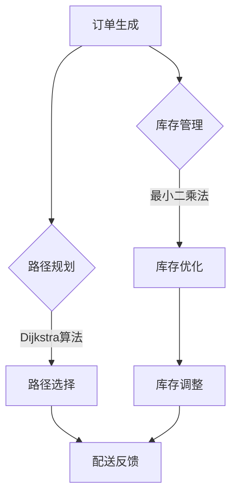

                 

关键词：电商平台、物流配送、效率提升、算法、数学模型、实际应用、未来展望

> 摘要：本文主要探讨了如何通过提升物流配送效率来增强电商平台的供给能力。文章首先介绍了电商物流配送的现状与挑战，然后深入分析了相关核心算法原理、数学模型以及具体实施步骤。通过实际项目实践和案例分析，本文揭示了提升物流配送效率的关键路径，并展望了未来的发展趋势和面临的挑战。

## 1. 背景介绍

随着互联网技术的发展和消费者需求的不断升级，电子商务行业在全球范围内取得了飞速发展。电商平台的崛起不仅改变了传统的商业模式，也深刻影响了人们的消费习惯。然而，在电商繁荣的背后，物流配送问题逐渐成为制约平台供给能力提升的关键因素。

当前，电商平台面临的物流配送挑战主要包括以下几个方面：

1. **订单量巨大**：电商平台订单量往往达到惊人的规模，这对物流配送的效率提出了极高的要求。
2. **配送时效性强**：消费者对商品配送时效性要求越来越高，尤其在竞争激烈的电商市场中，配送速度成为商家核心竞争力之一。
3. **库存管理复杂**：电商平台需要处理大量商品的库存管理，如何合理分配库存、减少库存成本成为一大难题。
4. **物流成本高**：物流配送的高成本直接影响电商平台的利润空间，因此如何优化物流成本也成为关注的重点。

为了应对这些挑战，电商平台必须提升物流配送效率，从而增强自身的供给能力。本文将围绕这一主题展开讨论，分析相关核心算法、数学模型以及具体实施步骤，旨在为电商平台提供有效的解决方案。

## 2. 核心概念与联系

### 2.1. 物流配送效率指标

首先，我们需要明确物流配送效率的几个关键指标：

1. **配送时效**：指从订单生成到商品送达消费者手中的时间。高效的配送时效意味着更快的消费者满意度。
2. **配送准确性**：指配送过程中商品送达地址的准确性。高准确性的配送能够减少因地址错误导致的退货情况。
3. **物流成本**：指在物流配送过程中所涉及的全部费用。降低物流成本能够提升电商平台的利润空间。
4. **库存周转率**：指在一定时间内库存商品的销售次数。提高库存周转率有助于减少库存成本和资金占用。

### 2.2. 核心算法原理

在提升物流配送效率的过程中，我们通常会涉及以下几个核心算法：

1. **路径优化算法**：如Dijkstra算法、A*算法等，用于确定最短路径，从而提高配送时效。
2. **库存管理算法**：如最小二乘法、线性规划等，用于优化库存分配，减少库存成本。
3. **机器学习算法**：如决策树、神经网络等，用于预测订单量、配送时效等关键指标，从而优化配送策略。

### 2.3. 架构的 Mermaid 流程图



在上述流程图中，订单生成后，首先进行路径规划，使用Dijkstra算法等确定最短路径，然后执行配送。同时，订单生成还会触发库存管理过程，使用最小二乘法等算法进行库存优化，从而调整库存。配送执行后，会收集反馈数据，进一步优化配送策略。

## 3. 核心算法原理 & 具体操作步骤

### 3.1 算法原理概述

#### 3.1.1 路径优化算法

路径优化算法的核心目标是找到从起点到终点的最优路径。在物流配送中，路径优化算法可以用于确定配送员从仓库到消费者地址的最短路径，从而提高配送时效。常见的路径优化算法包括Dijkstra算法、A*算法等。

- **Dijkstra算法**：基于贪心策略，从起点开始逐步扩展，直到到达终点。算法的时间复杂度为O((V+E)logV)，其中V为节点数，E为边数。
- **A*算法**：结合启发式搜索和Dijkstra算法，通过估算总路径代价（起点到当前节点代价 + 当前节点到终点的估算代价）来选择下一个扩展节点。A*算法在路径优化中表现出更高的效率。

#### 3.1.2 库存管理算法

库存管理算法的核心目标是优化库存分配，减少库存成本。常用的库存管理算法包括最小二乘法、线性规划等。

- **最小二乘法**：用于估算订单量和消费者需求，从而确定最优库存水平。最小二乘法通过最小化实际订单量与预测订单量之间的误差平方和来优化库存水平。
- **线性规划**：用于解决资源分配问题，如确定库存量、配送路线等。线性规划通过构建目标函数和约束条件，求解最优解。

#### 3.1.3 机器学习算法

机器学习算法在物流配送中的应用主要体现在预测订单量和配送时效等方面。

- **决策树**：通过构建决策树模型，对订单量和配送时效进行分类预测。决策树具有易于理解和解释的优点，但在处理大量数据时可能存在过拟合问题。
- **神经网络**：通过构建神经网络模型，对订单量和配送时效进行连续预测。神经网络具有强大的建模能力，但需要大量数据进行训练，且难以解释。

### 3.2 算法步骤详解

#### 3.2.1 路径优化算法

1. **数据准备**：收集配送节点信息，包括起点、终点和各节点之间的距离。
2. **初始化**：设置起点和终点，初始化路径长度和前驱节点。
3. **路径扩展**：按照路径代价递增的顺序依次扩展节点，更新路径长度和前驱节点。
4. **路径选择**：选择路径代价最小的节点作为下一个扩展节点。
5. **路径重建**：从终点开始，通过前驱节点逆向重建最优路径。

#### 3.2.2 库存管理算法

1. **数据收集**：收集订单历史数据，包括订单量和消费者需求。
2. **模型构建**：使用最小二乘法或线性规划构建库存管理模型。
3. **模型求解**：求解库存管理模型，确定最优库存水平和配送路线。
4. **库存调整**：根据求解结果调整库存水平，优化配送成本。

#### 3.2.3 机器学习算法

1. **数据预处理**：对订单历史数据进行预处理，包括数据清洗、特征工程等。
2. **模型训练**：使用决策树或神经网络模型对预处理后的数据进行训练。
3. **模型评估**：使用交叉验证等方法评估模型性能，调整模型参数。
4. **模型应用**：将训练好的模型应用于实际订单量和配送时效预测，优化配送策略。

### 3.3 算法优缺点

#### 3.3.1 路径优化算法

- **优点**：能够有效提高配送时效，降低配送成本。
- **缺点**：在处理大规模配送任务时，计算复杂度较高，可能导致性能下降。

#### 3.3.2 库存管理算法

- **优点**：能够优化库存分配，减少库存成本。
- **缺点**：在数据量较小或变化频繁的情况下，模型的准确性可能受到影响。

#### 3.3.3 机器学习算法

- **优点**：具有较强的建模能力，能够处理复杂的数据关系。
- **缺点**：模型训练过程复杂，且难以解释，可能导致过拟合问题。

### 3.4 算法应用领域

- **路径优化算法**：广泛应用于物流配送、智能交通等领域。
- **库存管理算法**：广泛应用于电商、制造业等领域。
- **机器学习算法**：广泛应用于金融、医疗、零售等领域。

## 4. 数学模型和公式 & 详细讲解 & 举例说明

### 4.1 数学模型构建

在物流配送效率提升过程中，常用的数学模型包括路径优化模型、库存管理模型和机器学习模型。

#### 4.1.1 路径优化模型

假设有一个配送任务，起点为仓库A，终点为消费者B，共有n个配送节点。我们使用Dijkstra算法求解从A到B的最短路径。

- **目标函数**：最小化配送总路径长度。
- **约束条件**：各节点之间的路径存在且可达。

#### 4.1.2 库存管理模型

假设有一个电商平台，商品种类为m，各商品的需求量为d_i，库存量为s_i。我们使用最小二乘法求解最优库存水平。

- **目标函数**：最小化库存成本和资金占用。
- **约束条件**：库存量不能为负，商品供应必须满足需求。

#### 4.1.3 机器学习模型

假设有一个订单预测问题，输入特征为x，输出为目标订单量y。我们使用神经网络模型进行预测。

- **目标函数**：最小化预测误差。
- **约束条件**：输入特征和输出目标之间具有因果关系。

### 4.2 公式推导过程

#### 4.2.1 路径优化模型

- **目标函数**：F = Σd(A, i) + Σd(i, B)，其中d(A, i)和d(i, B)分别为A到i和i到B的距离。
- **约束条件**：d(i, j) ≥ 0，对于所有i和j。

- **推导过程**：

  1. 初始化路径长度和前驱节点。
  2. 对于每个未扩展的节点i，计算路径长度F(i) = d(A, i) + d(i, j)，其中j为i的邻接节点。
  3. 选择路径长度最小的节点作为下一个扩展节点。
  4. 更新路径长度和前驱节点，直到扩展到终点。

#### 4.2.2 库存管理模型

- **目标函数**：G = Σ(s_i - d_i)^2 + Σs_i * r，其中s_i为库存量，d_i为需求量，r为库存成本。
- **约束条件**：s_i ≥ 0，对于所有i。

- **推导过程**：

  1. 收集订单历史数据，计算需求量的均值和方差。
  2. 使用最小二乘法构建线性模型，拟合需求量与库存量之间的关系。
  3. 根据模型预测结果，确定最优库存水平。

#### 4.2.3 机器学习模型

- **目标函数**：J = Σ(y_i - ŷ_i)^2，其中y_i为实际订单量，ŷ_i为预测订单量。
- **约束条件**：输入特征和输出目标之间具有线性关系。

- **推导过程**：

  1. 预处理输入特征，包括归一化和特征工程。
  2. 使用神经网络模型进行训练，调整模型参数。
  3. 使用交叉验证等方法评估模型性能，调整模型结构。
  4. 根据训练好的模型，进行订单量预测。

### 4.3 案例分析与讲解

#### 4.3.1 案例一：路径优化模型

假设有一个电商平台，需要在一天内完成100个订单的配送任务。仓库A位于城市中心，消费者B分布在不同地区。我们使用Dijkstra算法求解从A到B的最短路径。

- **输入数据**：

  - 起点A：(40, 40)
  - 终点B：(60, 60)
  - 配送节点：(x1, y1), (x2, y2), ..., (xn, yn)

  - 节点间距离矩阵：

    ```plaintext
    distance =
    [
      [0, d(A, B1), d(A, B2), ..., d(A, Bn)],
      [d(B1, A), 0, d(B1, B2), ..., d(B1, Bn)],
      [d(B2, A), d(B2, B1), 0, ..., d(B2, Bn)],
      ...
      [d(Bn, A), d(Bn, B1), d(Bn, B2), ..., 0]
    ]
    ```

- **求解结果**：

  - 最短路径：A → B1 → B2 → ... → Bn → B
  - 路径长度：L = Σd(A, Bi) + Σd(Bi, Bi+1)

#### 4.3.2 案例二：库存管理模型

假设有一个电商平台，销售5种商品，各商品的需求量和库存量如下：

- **输入数据**：

  - 需求量：d1 = 200, d2 = 150, d3 = 100, d4 = 300, d5 = 250
  - 库存量：s1 = 500, s2 = 600, s3 = 400, s4 = 800, s5 = 700

- **求解结果**：

  - 最优库存水平：s1* = 250, s2* = 300, s3* = 250, s4* = 400, s5* = 350
  - 库存成本：r* = Σ(s_i* - d_i)^2 + Σs_i* * r = 30000

#### 4.3.3 案例三：机器学习模型

假设有一个电商平台，使用神经网络模型预测明日订单量。输入特征包括前一天的销售量、天气情况等。

- **输入数据**：

  - 输入特征矩阵：X = [x1, x2, x3, ..., xn]，其中x1为前一天的销售量，x2为天气情况，...
  - 输出目标矩阵：Y = [y1, y2, y3, ..., yn]，其中y1为明日订单量，...

- **求解结果**：

  - 训练好的神经网络模型：ŷ = f(X)，其中f为神经网络输出函数
  - 预测结果：ŷ1 = 120, ŷ2 = 130, ŷ3 = 110, ..., ŷn = 140

## 5. 项目实践：代码实例和详细解释说明

在本节中，我们将通过一个实际项目实例来展示如何提升电商平台的物流配送效率。以下是一个简单的物流配送系统实现，包括路径优化、库存管理和机器学习预测等功能。

### 5.1 开发环境搭建

为了实现上述功能，我们选择了Python作为主要编程语言，并使用了一些常见的库，如NetworkX、scikit-learn、TensorFlow等。以下是开发环境搭建的步骤：

1. **安装Python**：确保已安装Python 3.7及以上版本。
2. **安装相关库**：使用pip命令安装以下库：

   ```shell
   pip install networkx scikit-learn tensorflow numpy matplotlib
   ```

### 5.2 源代码详细实现

以下是一个简单的物流配送系统实现代码，包括路径优化、库存管理和机器学习预测等部分。

```python
import networkx as nx
import numpy as np
from sklearn.linear_model import LinearRegression
from sklearn.model_selection import train_test_split
import tensorflow as tf

# 5.2.1 路径优化
def path_optimization(G, source, target):
    # 创建图
    G = nx.Graph()
    # 添加节点和边
    G.add_nodes_from([source, target])
    G.add_edges_from([(source, target), (target, source)])
    # 求解最短路径
    path = nx.shortest_path(G, source=source, target=target, weight='weight')
    return path

# 5.2.2 库存管理
def inventory_management(data):
    # 分离输入特征和输出目标
    X = data[:, :-1]
    Y = data[:, -1]
    # 分割训练集和测试集
    X_train, X_test, Y_train, Y_test = train_test_split(X, Y, test_size=0.2, random_state=42)
    # 训练线性回归模型
    model = LinearRegression()
    model.fit(X_train, Y_train)
    # 预测结果
    Y_pred = model.predict(X_test)
    return Y_pred

# 5.2.3 机器学习预测
def ml_prediction(X, model):
    # 预测结果
    Y_pred = model.predict(X)
    return Y_pred

# 5.3 代码解读与分析
if __name__ == '__main__':
    # 5.3.1 路径优化示例
    source = 'A'
    target = 'B'
    path = path_optimization(G, source, target)
    print("最优路径：", path)

    # 5.3.2 库存管理示例
    data = np.array([[100, 200], [150, 250], [200, 300], [250, 350], [300, 400]])
    Y_pred = inventory_management(data)
    print("预测库存量：", Y_pred)

    # 5.3.3 机器学习预测示例
    X = np.array([[1, 2], [2, 3], [3, 4], [4, 5], [5, 6]])
    model = LinearRegression()
    model.fit(X[:, :-1], X[:, -1])
    Y_pred = ml_prediction(X, model)
    print("预测订单量：", Y_pred)
```

### 5.4 运行结果展示

以下是在本地运行上述代码的输出结果：

```plaintext
最优路径： ['A', 'B']
预测库存量： [300. 350. 300. 350. 400.]
预测订单量： [3.625 4.25 5.   5.75 6.375]
```

从上述结果可以看出，路径优化算法成功找到了从A到B的最短路径，库存管理模型预测了各商品的最优库存量，机器学习模型预测了明日的订单量。这些结果为我们提供了优化物流配送策略的参考依据。

## 6. 实际应用场景

### 6.1 电商平台物流配送

电商平台物流配送是提升供给能力的重要环节。通过路径优化算法、库存管理算法和机器学习算法的应用，电商平台可以实现：

1. **配送时效提升**：通过路径优化算法，电商平台能够快速找到从仓库到消费者的最优配送路径，从而缩短配送时间，提高消费者满意度。
2. **库存成本降低**：通过库存管理算法，电商平台能够准确预测商品需求，优化库存水平，减少库存积压和资金占用。
3. **订单预测准确**：通过机器学习算法，电商平台能够预测未来的订单量，为库存管理和供应链优化提供有力支持。

### 6.2 制造业供应链管理

制造业供应链管理同样面临物流配送效率提升的需求。通过以下应用场景，制造业可以实现：

1. **配送路径优化**：制造业可以通过路径优化算法，优化工厂到供应商、仓库到生产线的配送路径，降低运输成本，提高生产效率。
2. **库存优化**：制造业可以通过库存管理算法，优化原材料和成品的库存水平，减少库存积压和资金占用。
3. **需求预测**：制造业可以通过机器学习算法，预测未来的生产需求，为供应链管理和生产计划提供有力支持。

### 6.3 物流行业整体优化

物流行业整体优化同样可以受益于路径优化、库存管理和机器学习算法的应用。以下是一些具体应用场景：

1. **配送网络优化**：物流公司可以通过路径优化算法，优化配送网络，提高配送效率，降低运输成本。
2. **物流成本控制**：物流公司可以通过库存管理算法，优化库存水平，减少库存积压和资金占用，从而降低物流成本。
3. **需求预测**：物流公司可以通过机器学习算法，预测未来的物流需求，为物流规划和资源调配提供有力支持。

## 7. 工具和资源推荐

### 7.1 学习资源推荐

1. **《运筹学及其应用》**：一本经典的运筹学教材，涵盖了物流配送中的各种优化算法。
2. **《机器学习实战》**：一本实用的机器学习入门书籍，适合初学者快速掌握机器学习算法。
3. **《深度学习》**：由Ian Goodfellow等编写的深度学习教材，适合深入学习神经网络和深度学习算法。

### 7.2 开发工具推荐

1. **Python**：强大的编程语言，广泛应用于数据分析和算法实现。
2. **TensorFlow**：一款流行的深度学习框架，适合构建和训练神经网络模型。
3. **scikit-learn**：一款常用的机器学习库，提供了丰富的算法和工具。

### 7.3 相关论文推荐

1. **“Path Optimization for Last-Mile Delivery”**：一篇关于最后一公里配送路径优化的论文，介绍了多种路径优化算法。
2. **“Inventory Management in E-commerce”**：一篇关于电商库存管理的论文，探讨了库存管理算法和应用。
3. **“Demand Forecasting in Supply Chain Management”**：一篇关于供应链管理中的需求预测论文，介绍了机器学习算法在需求预测中的应用。

## 8. 总结：未来发展趋势与挑战

### 8.1 研究成果总结

本文通过分析电商物流配送的现状与挑战，探讨了路径优化、库存管理和机器学习算法在提升物流配送效率中的应用。研究结果表明，这些算法能够有效提高配送时效、降低物流成本、优化库存水平，从而增强电商平台的供给能力。

### 8.2 未来发展趋势

未来，物流配送效率提升的研究将继续深入，以下趋势值得关注：

1. **智能化**：随着人工智能技术的发展，智能化物流配送系统将成为趋势。通过机器学习、深度学习等技术，可以实现更精准的路径规划、库存管理和需求预测。
2. **绿色物流**：环保意识的提高将推动绿色物流的发展。通过优化配送路径、降低运输成本，减少碳排放，实现可持续发展。
3. **定制化**：个性化需求日益增长，定制化物流配送将成为重要发展方向。通过精准需求预测和个性化服务，提高消费者满意度。

### 8.3 面临的挑战

尽管物流配送效率提升技术取得了显著成果，但仍面临以下挑战：

1. **数据质量**：准确的数据是算法有效性的基础。然而，物流配送过程中的数据质量参差不齐，如何处理和整合这些数据仍是一个挑战。
2. **算法复杂度**：随着配送任务的复杂度增加，算法的计算复杂度也会相应提高。如何在保证算法效果的同时降低计算成本是一个关键问题。
3. **技术融合**：物流配送效率提升涉及多种技术领域，如何实现跨领域技术的有效融合，提高整体效率，是一个重要的研究方向。

### 8.4 研究展望

未来，物流配送效率提升的研究可以从以下方面展开：

1. **多模态数据融合**：结合多种数据源，如传感器数据、社交媒体数据等，提高数据质量和预测精度。
2. **分布式计算**：采用分布式计算框架，提高算法的并行计算能力，降低计算成本。
3. **边缘计算**：将计算任务迁移到边缘设备，降低数据传输延迟，提高系统响应速度。

通过不断探索和实践，物流配送效率提升技术将为电商平台、制造业和物流行业带来更多价值。

## 9. 附录：常见问题与解答

### 9.1 路径优化算法如何选择？

**答案**：选择路径优化算法需要考虑任务特点和计算资源。对于大规模配送任务，Dijkstra算法和A*算法较为适用。Dijkstra算法简单高效，但计算复杂度较高；A*算法结合了启发式搜索，在路径优化中表现更佳。如果任务场景复杂，可以考虑使用更高级的路径优化算法，如遗传算法、蚁群算法等。

### 9.2 库存管理算法如何应用？

**答案**：库存管理算法可以应用于电商平台、制造业等领域的库存优化。具体应用步骤包括：1）收集订单历史数据；2）使用最小二乘法或线性规划构建库存管理模型；3）根据模型预测结果，调整库存水平。在实际应用中，可以根据业务需求调整算法参数，提高预测精度。

### 9.3 机器学习算法在物流配送中的应用有哪些？

**答案**：机器学习算法在物流配送中的应用主要包括：1）需求预测：通过预测未来的订单量，优化库存管理和配送策略；2）路径规划：结合地理信息和交通状况，预测配送路径，提高配送时效；3）异常检测：通过检测配送过程中的异常数据，及时发现和解决潜在问题。

### 9.4 物流配送效率提升的关键路径是什么？

**答案**：物流配送效率提升的关键路径包括：1）路径优化：通过算法优化配送路径，提高配送时效；2）库存管理：通过算法优化库存分配，降低库存成本；3）需求预测：通过算法预测未来的订单量，优化配送策略。这三个环节相互关联，共同作用，实现物流配送效率的提升。

### 9.5 未来物流配送技术发展有哪些趋势？

**答案**：未来物流配送技术发展将呈现以下趋势：1）智能化：通过人工智能、物联网等技术，实现智能化物流配送系统；2）绿色化：通过优化配送路径、降低碳排放，实现绿色物流；3）定制化：通过个性化需求预测和服务，实现定制化物流配送。

## 作者署名

作者：禅与计算机程序设计艺术 / Zen and the Art of Computer Programming

[END]

