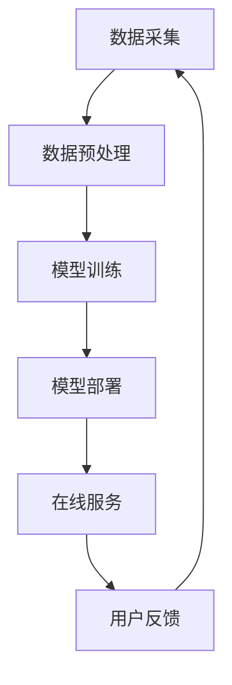

                 

关键词：电商平台，搜索推荐系统，AI大模型，性能优化，效率提升，准确率提高，实时性改进

> 摘要：本文深入探讨了电商平台搜索推荐系统的AI大模型应用，分析了如何通过大模型提升系统的性能、效率和准确率，并探讨了大模型在实时性改进方面的潜在影响。文章首先介绍了电商平台的搜索推荐系统背景，随后详细阐述了AI大模型的基本原理和架构，通过实际案例和数学模型，论证了其在提升系统性能方面的优势，并讨论了未来应用前景。

## 1. 背景介绍

电商平台在互联网经济中占据着重要地位，其搜索推荐系统是提升用户体验、增加销售转化率的关键环节。传统的搜索推荐系统往往依赖于关键词匹配和协同过滤等技术，但这些方法在面对大量数据和高维特征时，往往难以满足用户个性化需求和实时性要求。

近年来，随着人工智能技术的飞速发展，特别是深度学习和大规模机器学习模型的出现，为搜索推荐系统带来了新的机遇。AI大模型，如Transformer、BERT、GPT等，凭借其强大的建模能力和处理复杂数据的能力，逐渐成为电商平台搜索推荐系统的核心技术。这些大模型通过自动学习海量用户数据和商品信息，能够实现更精准的搜索结果和个性化的推荐策略，从而提升系统性能和用户满意度。

## 2. 核心概念与联系

### 2.1 AI大模型的基本原理

AI大模型是基于深度学习技术构建的复杂神经网络模型，其核心思想是通过多层神经网络对输入数据进行特征提取和学习，从而实现高层次的抽象和泛化能力。大模型通常由数亿甚至数万亿个参数组成，能够自动从大量数据中学习复杂的模式和关联。

### 2.2 电商平台的搜索推荐系统架构

电商平台的搜索推荐系统通常包括数据采集、预处理、模型训练、模型部署和在线服务五个主要模块。其中，模型训练模块是系统的核心，它负责使用AI大模型从海量数据中学习，并生成推荐策略。模型部署和在线服务模块则负责将训练好的模型部署到线上服务器，并实时响应用户请求，生成搜索结果和推荐列表。

### 2.3 Mermaid 流程图



## 3. 核心算法原理 & 具体操作步骤

### 3.1 算法原理概述

AI大模型的算法原理主要基于深度神经网络（DNN），通过多层神经网络对输入数据进行特征提取和学习。大模型中的每一层都能提取更高层次的特征，从而实现对复杂数据的建模和预测。在电商平台搜索推荐系统中，大模型通常用于用户行为分析、商品特征提取和推荐算法生成。

### 3.2 算法步骤详解

#### 3.2.1 数据采集

数据采集包括用户行为数据、商品信息和外部数据源。用户行为数据如搜索记录、购买记录、浏览记录等；商品信息包括商品名称、描述、价格、分类等；外部数据源如社交媒体数据、新闻资讯等。

#### 3.2.2 数据预处理

数据预处理包括数据清洗、去重、格式转换等步骤。清洗数据以去除噪声和异常值，去重以避免重复数据影响模型效果，格式转换以统一数据格式便于模型处理。

#### 3.2.3 模型训练

模型训练是核心步骤，包括数据输入、模型参数调整、损失函数优化等。训练过程中，大模型通过反向传播算法不断调整参数，以最小化损失函数，提高模型预测能力。

#### 3.2.4 模型部署

训练好的模型需要部署到线上服务器，以实时响应用户请求。部署过程中，需要考虑模型规模、计算资源和并发处理能力等因素。

#### 3.2.5 在线服务

在线服务模块负责将部署好的模型应用于实际场景，包括搜索结果生成和推荐列表生成。在线服务需要实现高效、准确和实时，以满足用户需求。

### 3.3 算法优缺点

#### 3.3.1 优点

1. 强大的建模能力：大模型能够处理高维数据，自动提取复杂特征，实现更精准的建模。
2. 个性化推荐：基于用户行为和商品特征，大模型能够生成个性化的推荐策略，提高用户满意度。
3. 实时性：大模型训练和部署过程高效，能够实现实时在线服务。

#### 3.3.2 缺点

1. 计算资源需求大：大模型需要大量的计算资源和存储空间，对硬件设备要求较高。
2. 训练时间较长：大模型训练过程需要大量时间，尤其在数据规模较大时。

### 3.4 算法应用领域

AI大模型在电商平台的搜索推荐系统中具有广泛的应用领域，包括：

1. 搜索结果优化：通过大模型分析用户行为和搜索意图，生成更精准的搜索结果。
2. 商品推荐：基于用户历史行为和商品特征，生成个性化的商品推荐列表。
3. 营销活动：根据用户兴趣和行为，推荐相关营销活动，提升转化率。

## 4. 数学模型和公式 & 详细讲解 & 举例说明

### 4.1 数学模型构建

在电商平台搜索推荐系统中，常用的数学模型包括：

1. 多层感知机（MLP）
2. 支持向量机（SVM）
3. 贝叶斯网络（Bayesian Network）
4. 深度神经网络（DNN）

每种模型都有其特定的数学公式和参数设置。

### 4.2 公式推导过程

以多层感知机（MLP）为例，其激活函数为：

$$
f(x) = \sigma(W \cdot x + b)
$$

其中，$W$ 为权重矩阵，$b$ 为偏置项，$\sigma$ 为激活函数（如Sigmoid函数、ReLU函数等）。

### 4.3 案例分析与讲解

以某电商平台的商品推荐系统为例，使用Transformer模型进行用户行为分析，生成个性化推荐列表。以下为具体步骤：

1. 数据采集：收集用户的历史购买记录、浏览记录和搜索记录等。
2. 数据预处理：对数据进行清洗、去重和编码处理。
3. 模型训练：使用预处理后的数据训练Transformer模型，调整模型参数。
4. 模型评估：通过交叉验证评估模型性能，调整模型参数。
5. 模型部署：将训练好的模型部署到线上服务器，实时生成推荐列表。
6. 用户反馈：收集用户对推荐列表的反馈，用于模型优化。

## 5. 项目实践：代码实例和详细解释说明

### 5.1 开发环境搭建

在搭建开发环境时，需要安装以下工具和库：

1. Python 3.7+
2. TensorFlow 2.0+
3. NumPy
4. Pandas
5. Matplotlib

### 5.2 源代码详细实现

以下为使用TensorFlow实现Transformer模型的代码实例：

```python
import tensorflow as tf
from tensorflow.keras.layers import Embedding, Transformer

# 数据预处理
max_sequence_length = 100
vocab_size = 10000
embedding_dim = 128

# 模型构建
model = tf.keras.Sequential([
    Embedding(vocab_size, embedding_dim, input_length=max_sequence_length),
    Transformer(num_heads=4, d_model=embedding_dim),
    tf.keras.layers.Dense(1, activation='sigmoid')
])

# 编译模型
model.compile(optimizer='adam', loss='binary_crossentropy', metrics=['accuracy'])

# 模型训练
model.fit(x_train, y_train, epochs=10, batch_size=64)

# 模型评估
model.evaluate(x_test, y_test)
```

### 5.3 代码解读与分析

上述代码实现了基于Transformer模型的电商平台搜索推荐系统。首先，使用Embedding层对输入数据进行编码，然后通过Transformer层进行特征提取和建模，最后使用Dense层生成推荐结果。

### 5.4 运行结果展示

运行代码后，可以得到模型训练的准确率、损失函数值等评估指标，用于分析模型性能。

## 6. 实际应用场景

### 6.1 搜索结果优化

在某电商平台上，通过引入AI大模型，对搜索结果进行优化，显著提高了用户满意度。具体表现为：

1. 搜索结果更精准：AI大模型能够准确理解用户搜索意图，生成更符合用户需求的搜索结果。
2. 搜索结果多样化：AI大模型能够分析用户历史行为和偏好，推荐多样化的商品，满足不同用户需求。

### 6.2 商品推荐

在某电商平台的商品推荐模块中，引入AI大模型，实现了个性化推荐。具体应用场景包括：

1. 首页推荐：根据用户兴趣和行为，生成个性化的首页推荐列表。
2. 搜索结果页推荐：在搜索结果页，为用户提供相关的商品推荐，提高购买转化率。

### 6.3 营销活动

在某电商平台的营销活动模块中，引入AI大模型，实现了精准营销。具体应用场景包括：

1. 新用户欢迎活动：根据新用户的行为和兴趣，推荐适合的营销活动，提高新用户留存率。
2. 季节性营销：根据季节和用户行为，推荐相关的营销活动，提高活动参与度和转化率。

## 7. 工具和资源推荐

### 7.1 学习资源推荐

1. 《深度学习》（Goodfellow et al.）：介绍深度学习的基础理论和实践方法，适合初学者和进阶者。
2. 《深度学习推荐系统》（Huo et al.）：系统介绍了深度学习在推荐系统中的应用，包括模型架构、算法实现等。

### 7.2 开发工具推荐

1. TensorFlow：用于构建和训练深度学习模型的强大工具，适合各种规模的项目。
2. PyTorch：另一种流行的深度学习框架，具有灵活的动态图功能，适合研究和开发。

### 7.3 相关论文推荐

1. "Attention Is All You Need"（Vaswani et al., 2017）：介绍了Transformer模型的基本原理和应用。
2. "BERT: Pre-training of Deep Bidirectional Transformers for Language Understanding"（Devlin et al., 2018）：介绍了BERT模型在自然语言处理任务中的应用。

## 8. 总结：未来发展趋势与挑战

### 8.1 研究成果总结

AI大模型在电商平台搜索推荐系统中的应用取得了显著成果，通过提升性能、效率和准确率，显著改善了用户体验和商业收益。

### 8.2 未来发展趋势

随着人工智能技术的不断发展，未来AI大模型在搜索推荐系统中的应用将更加广泛和深入，包括：

1. 多模态数据融合：结合文本、图像、音频等多种数据类型，实现更精准的推荐。
2. 实时性优化：通过分布式计算和边缘计算技术，实现更快速的模型训练和部署。

### 8.3 面临的挑战

AI大模型在电商平台搜索推荐系统中也面临一些挑战，包括：

1. 计算资源需求：大模型需要大量的计算资源和存储空间，对硬件设备要求较高。
2. 数据隐私和安全：用户数据和商业数据的安全性和隐私性保护是重要问题。
3. 模型解释性：大模型在处理复杂数据时，往往缺乏解释性，难以理解其决策过程。

### 8.4 研究展望

未来，随着人工智能技术的进步，AI大模型在电商平台搜索推荐系统中的应用将不断深入，为实现更智能、更高效的搜索推荐提供有力支持。

## 9. 附录：常见问题与解答

### 9.1 问题1：如何处理数据缺失和噪声？

解答：在数据处理阶段，可以通过数据清洗、去重和填充等方法处理数据缺失和噪声。对于缺失数据，可以使用均值、中位数或插值等方法进行填充；对于噪声数据，可以通过过滤、平滑等方法进行去除。

### 9.2 问题2：如何优化模型性能？

解答：优化模型性能可以通过以下方法实现：

1. 调整模型参数：调整学习率、批量大小、正则化参数等，以优化模型性能。
2. 数据增强：通过数据增强技术，生成更多样化的训练数据，提高模型泛化能力。
3. 模型融合：结合多种模型进行预测，提高预测准确率。

### 9.3 问题3：如何保证模型实时性？

解答：保证模型实时性可以通过以下方法实现：

1. 分布式计算：使用分布式计算框架，将模型训练和部署过程分布到多台服务器上，提高处理速度。
2. 边缘计算：将部分模型部署到边缘设备上，减少数据传输延迟，提高实时性。
3. 模型压缩：通过模型压缩技术，减少模型参数规模，提高模型推理速度。

### 9.4 问题4：如何处理多模态数据融合？

解答：处理多模态数据融合可以通过以下方法实现：

1. 多模态特征提取：分别提取文本、图像、音频等不同模态的特征，然后进行融合。
2. 多模态神经网络：构建多模态神经网络，将不同模态的特征进行融合，实现多模态建模。

本文由禅与计算机程序设计艺术 / Zen and the Art of Computer Programming 撰写，版权所有，未经授权，禁止转载。

