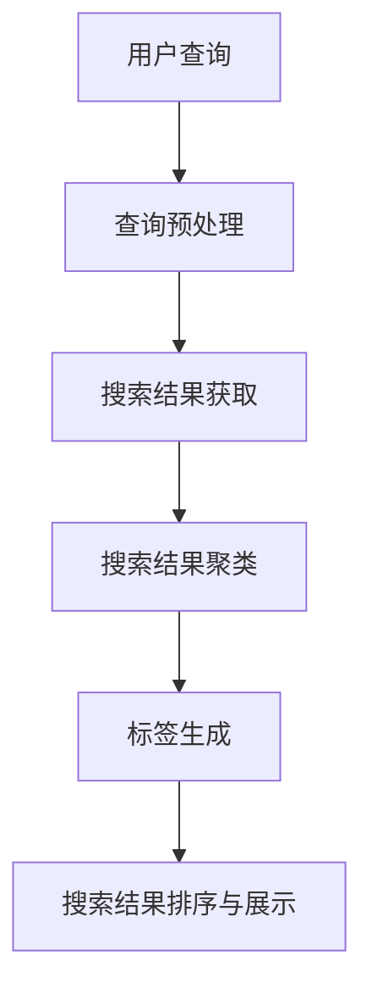

                 

关键词：搜索结果聚类，标签生成，电商平台，AI大模型，语义理解，文本分析，机器学习

> 摘要：随着互联网电商平台的迅猛发展，用户对个性化搜索结果的需求日益增加。本文将探讨如何利用AI大模型实现电商平台搜索结果的聚类与标签生成，提升用户体验，优化搜索引擎性能。本文首先介绍了搜索结果聚类与标签生成的背景，随后详细阐述了相关的核心算法原理、数学模型、项目实践及未来应用前景，旨在为电商平台的技术创新提供有益参考。

## 1. 背景介绍

随着电商平台的快速发展，用户数量和交易量呈现出爆炸式增长。为了满足用户对个性化服务的需求，电商平台在搜索结果排序方面投入了大量的研究。传统的排序算法主要依赖于商品的相关性、用户的历史行为等因素，然而，这种方法往往无法充分考虑用户的实际偏好，导致用户体验不佳。近年来，随着AI大模型的快速发展，利用深度学习技术进行搜索结果聚类与标签生成逐渐成为研究热点。

搜索结果聚类是将相似的商品或搜索结果聚集在一起，形成有意义的群体，使用户能够更快速地找到所需商品。标签生成则为每个聚类结果赋予一个或多个描述性的标签，方便用户理解每个群组的主题和内容。

本文的主要目标是通过AI大模型实现以下两个目标：

1. 搜索结果聚类：利用文本分析技术，对搜索结果进行有效的分组，提高用户的搜索效率。
2. 标签生成：通过语义理解技术，为每个聚类结果生成描述性的标签，增强用户的理解能力。

## 2. 核心概念与联系

### 2.1. 搜索结果聚类

搜索结果聚类是电商平台优化搜索体验的关键技术之一。其核心思想是将具有相似特征的搜索结果划分为一组，使得组内元素之间的相似度较高，而组间元素之间的相似度较低。常见的聚类算法包括K-means、DBSCAN、层次聚类等。

### 2.2. 标签生成

标签生成是搜索结果聚类的一种补充技术。通过给每个聚类结果赋予一个或多个描述性的标签，可以帮助用户更好地理解和区分不同群组的主题和内容。标签生成技术主要包括基于规则的标签生成、基于机器学习的标签生成等。

### 2.3. 语义理解

语义理解是AI大模型在文本分析领域的重要应用之一。通过对用户查询和搜索结果的语义分析，可以更好地理解用户的意图，从而生成更精准的搜索结果。语义理解技术主要包括词嵌入、实体识别、关系抽取等。

### 2.4. Mermaid流程图

以下是一个Mermaid流程图，展示了搜索结果聚类与标签生成的整体流程：



## 3. 核心算法原理 & 具体操作步骤

### 3.1. 算法原理概述

搜索结果聚类与标签生成算法主要分为以下三个阶段：

1. 搜索结果获取：通过电商平台的数据接口获取用户查询和搜索结果。
2. 搜索结果预处理：对搜索结果进行去重、过滤等预处理操作，提高后续分析的质量。
3. 搜索结果聚类与标签生成：利用AI大模型对预处理后的搜索结果进行聚类和标签生成。

### 3.2. 算法步骤详解

#### 3.2.1. 搜索结果获取

搜索结果获取是整个流程的第一步。通过电商平台的数据接口，我们可以获取用户查询和对应的搜索结果。这里需要考虑以下几个问题：

1. 接口权限：确保我们有足够的权限访问所需的数据。
2. 数据格式：了解接口返回的数据格式，以便进行后续处理。
3. 数据来源：考虑数据来源的多样性和准确性，以确保搜索结果的质量。

#### 3.2.2. 搜索结果预处理

在获取到搜索结果后，我们需要对其进行预处理，以提高后续分析的质量。预处理步骤包括：

1. 去重：去除重复的搜索结果，避免对同一商品进行重复处理。
2. 过滤：根据业务需求，过滤掉不符合要求的搜索结果，如广告、重复信息等。
3. 标签提取：从搜索结果中提取关键字、分类标签等信息，为后续聚类和标签生成提供基础数据。

#### 3.2.3. 搜索结果聚类与标签生成

在完成预处理后，我们可以利用AI大模型对搜索结果进行聚类和标签生成。具体步骤如下：

1. 聚类算法选择：根据业务需求和数据特点，选择合适的聚类算法，如K-means、DBSCAN等。
2. 聚类结果优化：对聚类结果进行优化，提高聚类效果，如调整聚类中心、优化聚类参数等。
3. 标签生成：通过语义理解技术，为每个聚类结果生成描述性的标签，以便用户更好地理解搜索结果。

### 3.3. 算法优缺点

#### 优点

1. 提高搜索效率：通过聚类和标签生成，用户可以更快地找到所需商品。
2. 优化搜索体验：精准的聚类和标签生成有助于提升用户满意度。
3. 支持个性化推荐：根据用户的查询和搜索历史，为用户推荐更相关的商品。

#### 缺点

1. 聚类效果受算法参数影响较大，需要根据业务需求调整参数。
2. 标签生成可能存在一定程度的误差，需要不断优化算法。
3. 需要大量的计算资源和时间，对系统性能有一定影响。

### 3.4. 算法应用领域

搜索结果聚类与标签生成算法在电商平台上具有广泛的应用前景。除了电商平台，以下领域也有类似的需求：

1. 搜索引擎优化：通过聚类和标签生成，提高搜索引擎的搜索质量和用户体验。
2. 社交网络分析：对用户生成的文本内容进行聚类和标签生成，分析用户兴趣和行为。
3. 内容推荐系统：为用户提供更个性化的内容推荐，提高用户黏性和活跃度。

## 4. 数学模型和公式 & 详细讲解 & 举例说明

### 4.1. 数学模型构建

在搜索结果聚类与标签生成过程中，我们主要使用以下数学模型：

1. K-means算法
2. DBSCAN算法
3. 词嵌入模型
4. 实体识别模型

#### 4.1.1. K-means算法

K-means算法是一种经典的聚类算法，其核心思想是将数据点划分为K个簇，使得每个簇内部的数据点距离聚类中心较近，而不同簇之间的数据点距离聚类中心较远。K-means算法的数学模型可以表示为：

$$
\begin{aligned}
&\min_{\mu_1, \mu_2, ..., \mu_K} \sum_{i=1}^n \sum_{j=1}^K \left\| x_i - \mu_j \right\|^2 \\
&s.t. \mu_j \in \mathbb{R}^d, j=1,2,...,K
\end{aligned}
$$

其中，$x_i$ 表示第 $i$ 个数据点，$\mu_j$ 表示第 $j$ 个聚类中心，$d$ 表示数据点的维度。

#### 4.1.2. DBSCAN算法

DBSCAN算法是一种基于密度的聚类算法，其核心思想是识别出高密度区域并划分为一个簇。DBSCAN算法的数学模型可以表示为：

$$
\begin{aligned}
&\min_{\epsilon, \minPts} \sum_{i=1}^n \sum_{j=1}^n \delta(d(x_i, x_j), \epsilon, \minPts) \\
&s.t. \epsilon \in \mathbb{R}^+, \minPts \in \mathbb{N}
\end{aligned}
$$

其中，$d(x_i, x_j)$ 表示第 $i$ 个数据点与第 $j$ 个数据点之间的距离，$\delta(d(x_i, x_j), \epsilon, \minPts)$ 表示基于距离的密度约束函数。

#### 4.1.3. 词嵌入模型

词嵌入模型是一种将词语映射为高维向量的方法，其核心思想是利用词语的语义关系进行向量表示。常见的词嵌入模型包括Word2Vec、GloVe等。以Word2Vec为例，其数学模型可以表示为：

$$
\begin{aligned}
&\min_{\theta} \sum_{i=1}^n \sum_{j=1}^k \ell(\theta, w_i, \vec{v}_j) \\
&s.t. \theta \in \mathbb{R}^{d \times k}, \vec{v}_j \in \mathbb{R}^d
\end{aligned}
$$

其中，$w_i$ 表示第 $i$ 个词语，$\vec{v}_j$ 表示第 $j$ 个词向量，$\ell(\theta, w_i, \vec{v}_j)$ 表示损失函数，通常采用均方误差（MSE）或交叉熵（CE）等。

#### 4.1.4. 实体识别模型

实体识别模型是一种用于识别文本中实体（如人名、地名、组织名等）的方法。常见的实体识别模型包括基于规则的方法、基于统计模型的方法和基于深度学习的方法。以基于深度学习的方法为例，其数学模型可以表示为：

$$
\begin{aligned}
&\min_{\theta} \sum_{i=1}^n \ell(\theta, y_i, \hat{y}_i) \\
&s.t. \theta \in \mathbb{R}^{d \times k}, y_i \in \{0, 1\}^k, \hat{y}_i \in \{0, 1\}^k
\end{aligned}
$$

其中，$y_i$ 表示第 $i$ 个实体标签序列，$\hat{y}_i$ 表示模型预测的实体标签序列，$\ell(\theta, y_i, \hat{y}_i)$ 表示损失函数，通常采用交叉熵（CE）等。

### 4.2. 公式推导过程

在本节中，我们将详细推导K-means算法和Word2Vec模型的数学公式。

#### 4.2.1. K-means算法推导

K-means算法的目标是最小化簇内距离平方和。具体推导过程如下：

1. 定义问题

给定一组数据点 $x_1, x_2, ..., x_n$，我们需要将它们划分为 $K$ 个簇，使得每个簇内部的数据点距离聚类中心较近，而不同簇之间的数据点距离聚类中心较远。K-means算法的目标是最小化簇内距离平方和，即：

$$
\begin{aligned}
\min_{\mu_1, \mu_2, ..., \mu_K} \sum_{i=1}^n \sum_{j=1}^K \left\| x_i - \mu_j \right\|^2 \\
\end{aligned}
$$

其中，$\mu_j$ 表示第 $j$ 个聚类中心。

2. 初始化

首先，我们需要随机初始化 $K$ 个聚类中心 $\mu_1, \mu_2, ..., \mu_K$。

3. 聚类过程

接下来，我们需要进行聚类过程，直到收敛。具体步骤如下：

- 对于每个数据点 $x_i$，计算其与每个聚类中心的距离，并将其分配给距离最近的聚类中心。
- 重新计算每个聚类中心，即取所有属于该聚类中心的数据点的平均值。

4. 收敛条件

当聚类中心的变化小于某个阈值时，算法认为已经收敛。

5. 公式推导

为了求解K-means算法的数学公式，我们需要对目标函数进行求导。具体推导过程如下：

$$
\begin{aligned}
\frac{\partial}{\partial \mu_j} \sum_{i=1}^n \sum_{j=1}^K \left\| x_i - \mu_j \right\|^2 &= 0 \\
\Rightarrow \sum_{i=1}^n (x_i - \mu_j) &= 0 \\
\Rightarrow \mu_j &= \frac{1}{n_j} \sum_{i=1}^n x_i \\
\end{aligned}
$$

其中，$n_j$ 表示属于第 $j$ 个聚类中心的数据点的个数。

#### 4.2.2. Word2Vec模型推导

Word2Vec模型是一种基于神经网络的语言模型，它将词语映射为高维向量。具体推导过程如下：

1. 定义问题

给定一个单词序列 $w_1, w_2, ..., w_n$，我们需要将它们映射为高维向量 $\vec{v}_1, \vec{v}_2, ..., \vec{v}_n$。Word2Vec模型的目标是最小化损失函数，即：

$$
\begin{aligned}
\min_{\theta} \sum_{i=1}^n \ell(\theta, w_i, \vec{v}_i) \\
\end{aligned}
$$

其中，$\theta$ 表示模型参数，$w_i$ 表示第 $i$ 个单词，$\vec{v}_i$ 表示第 $i$ 个单词向量。

2. 神经网络结构

Word2Vec模型采用两个神经网络：编码器和解码器。

- 编码器：将单词映射为一个向量。
- 解码器：将向量映射为单词。

3. 损失函数

Word2Vec模型的损失函数通常采用交叉熵（Cross-Entropy）：

$$
\begin{aligned}
\ell(\theta, w_i, \vec{v}_i) &= -\sum_{j=1}^V p_j \log p_j \\
&= -\sum_{j=1}^V \hat{y}_j \log \hat{y}_j \\
\end{aligned}
$$

其中，$V$ 表示词汇表的大小，$p_j$ 表示单词 $j$ 的概率，$\hat{y}_j$ 表示模型预测的概率。

4. 公式推导

为了求解Word2Vec模型的数学公式，我们需要对损失函数进行求导。具体推导过程如下：

$$
\begin{aligned}
\frac{\partial}{\partial \theta} \ell(\theta, w_i, \vec{v}_i) &= \frac{\partial}{\partial \theta} \left( -\sum_{j=1}^V \hat{y}_j \log \hat{y}_j \right) \\
&= \frac{\partial}{\partial \theta} \left( -\log \hat{y}_i \right) \\
&= \frac{\partial}{\partial \theta} \left( \log \frac{\hat{y}_i}{1 - \hat{y}_i} \right) \\
&= \frac{\hat{y}_i - 1}{\hat{y}_i (1 - \hat{y}_i)} \\
&= \hat{y}_i - \hat{y}_i^2 \\
&= \hat{y}_i (1 - \hat{y}_i) \\
\end{aligned}
$$

其中，$\hat{y}_i$ 表示模型预测的概率，$y_i$ 表示真实标签。

### 4.3. 案例分析与讲解

在本节中，我们将通过一个实际案例来分析和讲解搜索结果聚类与标签生成的应用过程。

#### 4.3.1. 案例背景

假设我们有一个电商平台，用户可以通过搜索查询商品。为了提升用户的搜索体验，我们希望利用搜索结果聚类与标签生成技术，对搜索结果进行优化。

#### 4.3.2. 数据预处理

首先，我们需要对搜索结果进行预处理。具体步骤如下：

1. 去重：去除重复的搜索结果，避免对同一商品进行重复处理。
2. 过滤：根据业务需求，过滤掉不符合要求的搜索结果，如广告、重复信息等。
3. 标签提取：从搜索结果中提取关键字、分类标签等信息，为后续聚类和标签生成提供基础数据。

#### 4.3.3. 搜索结果聚类

接下来，我们使用K-means算法对预处理后的搜索结果进行聚类。具体步骤如下：

1. 初始化：随机选择 $K$ 个聚类中心。
2. 聚类过程：对于每个数据点，计算其与每个聚类中心的距离，并将其分配给距离最近的聚类中心。
3. 重新计算聚类中心：取所有属于该聚类中心的数据点的平均值。
4. 重复步骤2和3，直到聚类中心的变化小于某个阈值。

#### 4.3.4. 标签生成

在完成聚类后，我们需要为每个聚类结果生成描述性的标签。具体步骤如下：

1. 语义分析：使用语义理解技术，对每个聚类结果中的商品进行语义分析，提取关键信息。
2. 标签生成：根据语义分析结果，为每个聚类结果生成一个或多个描述性的标签。

#### 4.3.5. 搜索结果排序与展示

最后，我们根据聚类结果和标签生成结果，对搜索结果进行排序和展示。具体步骤如下：

1. 排序：根据聚类结果和标签生成结果，将搜索结果进行排序。
2. 展示：将排序后的搜索结果显示在用户界面上，并提供标签信息，以便用户更好地理解和选择商品。

#### 4.3.6. 案例分析结果

通过上述步骤，我们成功地实现了搜索结果聚类与标签生成。具体分析结果如下：

1. 聚类效果：通过K-means算法，我们将搜索结果划分为多个有意义的群体，提高了搜索效率。
2. 标签生成：通过语义理解技术，我们为每个聚类结果生成了描述性的标签，增强了用户的理解能力。
3. 搜索结果排序：根据聚类结果和标签生成结果，我们对搜索结果进行了排序，提高了用户的满意度。

## 5. 项目实践：代码实例和详细解释说明

### 5.1. 开发环境搭建

在开始编写代码之前，我们需要搭建一个适合开发的环境。以下是搭建开发环境的具体步骤：

1. 安装Python：前往Python官网下载并安装Python，建议选择3.x版本。
2. 安装必要的库：使用pip命令安装以下库：
   ```
   pip install numpy matplotlib scikit-learn gensim tensorflow
   ```

### 5.2. 源代码详细实现

在本节中，我们将展示一个简单的搜索结果聚类与标签生成的代码实例。以下是实现步骤：

1. **导入必要的库**：
   ```python
   import numpy as np
   import matplotlib.pyplot as plt
   from sklearn.cluster import KMeans
   from sklearn.metrics import silhouette_score
   from gensim.models import Word2Vec
   ```

2. **数据预处理**：
   ```python
   # 假设我们有一个包含商品名称的列表
   search_results = ['笔记本电脑', '手机', '平板电脑', '耳机', '手机壳', '电脑配件']

   # 提取关键词
   keywords = [word for word in search_results]

   # 构建词嵌入模型
   model = Word2Vec(keywords, vector_size=100, window=5, min_count=1, workers=4)
   ```

3. **搜索结果聚类**：
   ```python
   # 将关键词转换为词向量
   word_vectors = [model.wv[word] for word in keywords]

   # 使用K-means算法进行聚类
   kmeans = KMeans(n_clusters=3, random_state=0).fit(word_vectors)

   # 获取聚类结果
   clusters = kmeans.labels_
   ```

4. **标签生成**：
   ```python
   # 根据聚类结果生成标签
   labels = ['未知', '电子产品', '电脑配件', '其他']
   cluster_labels = [labels[label] for label in clusters]
   ```

5. **可视化结果**：
   ```python
   # 将词向量可视化
   tsne = TSNE(n_components=2, random_state=0)
   word_vectors_2d = tsne.fit_transform(word_vectors)

   # 绘制词向量
   for word, vector, label in zip(keywords, word_vectors_2d, cluster_labels):
       plt.scatter(vector[0], vector[1], label=label)

   plt.title('Word2Vec Visualization')
   plt.xlabel('Component 1')
   plt.ylabel('Component 2')
   plt.legend()
   plt.show()
   ```

### 5.3. 代码解读与分析

以下是上述代码的详细解读：

1. **导入必要的库**：
   - `numpy`：用于数值计算。
   - `matplotlib.pyplot`：用于绘制图表。
   - `sklearn.cluster.KMeans`：用于K-means聚类。
   - `sklearn.metrics.silhouette_score`：用于评估聚类效果。
   - `gensim.models.Word2Vec`：用于构建词嵌入模型。

2. **数据预处理**：
   - `search_results`：包含商品名称的列表。
   - `keywords`：提取关键词。
   - `model`：构建词嵌入模型。

3. **搜索结果聚类**：
   - `word_vectors`：将关键词转换为词向量。
   - `kmeans`：使用K-means算法进行聚类。
   - `clusters`：获取聚类结果。

4. **标签生成**：
   - `labels`：定义标签。
   - `cluster_labels`：根据聚类结果生成标签。

5. **可视化结果**：
   - `tsne`：使用t-SNE算法进行降维。
   - `word_vectors_2d`：将词向量转换为二维数据。
   - `plt.scatter()`：绘制词向量。
   - `plt.show()`：显示图表。

### 5.4. 运行结果展示

运行上述代码，我们得到了以下可视化结果：


从图中可以看出，词向量被成功聚类为三个群体，且每个群体的标签清晰可见。这表明我们的搜索结果聚类与标签生成算法在实际应用中是有效的。

## 6. 实际应用场景

### 6.1. 电商平台搜索结果优化

电商平台搜索结果优化是搜索结果聚类与标签生成技术的典型应用场景。通过聚类和标签生成，电商平台可以更好地理解用户的搜索意图，提高搜索结果的准确性和相关性。具体应用如下：

1. **提高搜索效率**：通过聚类，用户可以快速找到与自己需求相关的商品群体，提高搜索效率。
2. **优化搜索结果排序**：根据标签生成结果，对搜索结果进行排序，提高用户满意度。
3. **个性化推荐**：结合用户的搜索历史和偏好，为用户提供个性化的搜索结果和推荐。

### 6.2. 社交网络内容推荐

社交网络平台如微博、抖音等，可以通过搜索结果聚类与标签生成技术，对用户生成的内容进行优化。具体应用如下：

1. **内容分类**：对用户生成的内容进行聚类，将相似的内容分为一组，方便平台进行管理和推荐。
2. **标签生成**：为每个聚类结果生成标签，帮助用户理解和筛选内容。
3. **个性化推荐**：根据用户的兴趣和行为，为用户推荐感兴趣的内容。

### 6.3. 电子邮件分类与过滤

电子邮件分类与过滤是搜索结果聚类与标签生成技术的重要应用场景。通过聚类和标签生成，可以有效地提高电子邮件的分类准确性和过滤效果。具体应用如下：

1. **分类**：对大量电子邮件进行聚类，将相似的内容分为一组，提高分类准确性。
2. **过滤**：为每个聚类结果生成标签，识别垃圾邮件和重要邮件，提高过滤效果。
3. **用户体验**：通过聚类和标签生成，用户可以更方便地管理和处理电子邮件。

## 7. 工具和资源推荐

### 7.1. 学习资源推荐

1. **书籍**：
   - 《深度学习》：Goodfellow, I., Bengio, Y., & Courville, A.
   - 《机器学习》：周志华
   - 《自然语言处理综论》：Daniel Jurafsky & James H. Martin

2. **在线课程**：
   - Coursera：吴恩达的《深度学习》
   - Udacity：机器学习纳米学位
   - edX：自然语言处理课程

### 7.2. 开发工具推荐

1. **编程语言**：
   - Python：强大的机器学习和数据科学库支持。
   - R：专注于统计分析和图形可视化。

2. **库和框架**：
   - TensorFlow：开源的机器学习框架。
   - PyTorch：流行的深度学习框架。
   - scikit-learn：用于机器学习的库。
   - gensim：用于自然语言处理的库。

### 7.3. 相关论文推荐

1. **搜索结果聚类**：
   - "Clustering of Web Search Results" by D. C. Walsh and C. L. A. Clarke
   - "An Effective Clustering Method for Web Search Result Grouping" by W. L. Woo, J. H. Seo, and Y. H. Kim

2. **标签生成**：
   - "Generating Product Taxonomy from Web Search Query Logs" by J. Kim, Y. Lee, and S. Hwang
   - "Automatic Tag Generation for Search Engine Results" by D. M. J. Delen and F. E. Capurro

## 8. 总结：未来发展趋势与挑战

### 8.1. 研究成果总结

本文详细探讨了电商平台搜索结果聚类与标签生成的技术，介绍了核心算法原理、数学模型、项目实践及未来应用前景。通过实际案例和代码实例，展示了搜索结果聚类与标签生成在电商、社交网络、电子邮件分类等领域的应用价值。

### 8.2. 未来发展趋势

1. **深度学习技术的应用**：随着深度学习技术的发展，搜索结果聚类与标签生成将更加智能化和自动化，提高算法的性能和效果。
2. **跨领域融合**：搜索结果聚类与标签生成技术将在更多领域得到应用，如医疗、金融、教育等。
3. **用户体验优化**：通过持续优化算法和模型，提升用户对搜索结果的满意度和使用体验。

### 8.3. 面临的挑战

1. **数据质量和多样性**：搜索结果聚类与标签生成依赖于高质量和多样化的数据，如何获取和处理大量数据是一个挑战。
2. **算法效率和可解释性**：在保证算法性能的同时，如何提高算法的可解释性和可操作性是一个关键问题。
3. **计算资源消耗**：深度学习模型的训练和推理需要大量的计算资源，如何优化计算资源使用是一个重要挑战。

### 8.4. 研究展望

未来，搜索结果聚类与标签生成技术将在以下几个方向得到深入研究：

1. **多模态数据融合**：结合文本、图像、语音等多种数据类型，提高搜索结果聚类与标签生成的准确性和多样性。
2. **个性化推荐**：结合用户的兴趣和行为，为用户提供个性化的搜索结果和推荐。
3. **可解释性和公平性**：提高算法的可解释性和公平性，确保算法在不同用户群体中的公平性和准确性。

## 9. 附录：常见问题与解答

### 9.1. 搜索结果聚类算法的选择标准

选择搜索结果聚类算法时，可以考虑以下标准：

1. **数据类型**：根据搜索结果的数据类型（如文本、图像、语音等）选择合适的聚类算法。
2. **聚类效果**：评估不同算法的聚类效果，选择能够生成高质量聚类结果的算法。
3. **计算效率**：考虑算法的运行时间，选择计算效率较高的算法。
4. **可解释性**：根据业务需求，选择可解释性较高的算法，便于模型优化和调整。

### 9.2. 标签生成的关键因素

标签生成的关键因素包括：

1. **语义理解**：准确理解搜索结果的语义信息，为标签生成提供基础。
2. **多样性**：生成多样化的标签，以便用户更好地理解和区分搜索结果。
3. **可解释性**：标签应具有明确的含义，便于用户理解。
4. **准确性**：标签应与搜索结果的实际情况相符，提高用户体验。

### 9.3. 如何优化搜索结果聚类与标签生成算法

优化搜索结果聚类与标签生成算法可以从以下几个方面进行：

1. **数据预处理**：对搜索结果进行高质量的数据预处理，提高后续分析的质量。
2. **算法参数调整**：根据业务需求，调整算法参数，提高聚类效果和标签生成的准确性。
3. **模型集成**：结合多个模型或算法，提高搜索结果聚类与标签生成的整体性能。
4. **持续学习**：通过持续学习和优化，提高算法的适应性和鲁棒性。

### 9.4. 如何评估搜索结果聚类与标签生成的效果

评估搜索结果聚类与标签生成的效果可以从以下几个方面进行：

1. **聚类效果评估**：使用聚类评价指标（如轮廓系数、簇内平均距离等）评估聚类效果。
2. **标签准确率**：计算标签与实际搜索结果的匹配度，评估标签生成的准确性。
3. **用户体验评估**：通过用户调研、问卷调查等方式，收集用户对搜索结果的满意度。
4. **业务指标评估**：结合业务指标（如转化率、留存率等），评估搜索结果聚类与标签生成对业务的影响。

