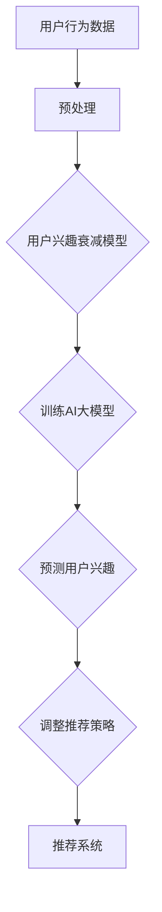

                 

 > 关键词：电商平台、用户兴趣衰减、AI大模型、动态调整、个性化推荐

> 摘要：本文旨在探讨电商平台用户兴趣衰减模型及其通过AI大模型的动态调整方法。首先，我们将介绍电商平台用户兴趣衰减现象的背景和重要性，然后详细阐述基于AI的大模型如何构建和优化用户兴趣衰减模型，最后通过实例展示该模型在实际项目中的应用，并展望未来的发展趋势和面临的挑战。

## 1. 背景介绍

随着互联网的普及和电子商务的快速发展，电商平台已经成为现代消费者进行购物的主要渠道。然而，在竞争激烈的市场环境中，如何提高用户留存率和转化率成为电商平台的核心问题。个性化推荐系统作为提升用户体验和商业价值的重要手段，日益受到关注。

个性化推荐系统通过分析用户历史行为和兴趣，为用户推荐相关的商品或内容。然而，用户在长时间使用电商平台的过程中，兴趣往往会发生衰减。这种兴趣衰减现象表现为用户对推荐内容的兴趣度逐渐降低，从而影响推荐效果和用户满意度。因此，研究用户兴趣衰减模型并对其进行动态调整，是提高电商平台竞争力的重要课题。

## 2. 核心概念与联系

### 2.1 用户兴趣衰减概念

用户兴趣衰减是指用户在长期使用电商平台的过程中，对推荐内容的兴趣度逐渐降低的现象。这种现象可以归结为以下几个原因：

1. **信息过载**：用户在电商平台上接触到的商品和信息越来越多，导致信息过载，用户难以筛选出感兴趣的商品。
2. **用户疲劳**：长时间的使用使得用户对电商平台产生疲劳感，降低了对推荐内容的兴趣。
3. **个性化推荐饱和**：个性化推荐系统在初期能够准确捕捉用户兴趣，但随着时间的推移，推荐内容逐渐趋于饱和，用户难以获得新的惊喜。

### 2.2 AI大模型的概念

AI大模型是指利用深度学习和大数据技术训练出的具有强大表征能力和泛化能力的模型。这些模型能够从大量数据中自动学习复杂的特征和模式，从而实现高效的数据分析和预测。

在用户兴趣衰减模型中，AI大模型的应用主要体现在以下几个方面：

1. **用户行为预测**：通过分析用户历史行为数据，AI大模型能够预测用户的兴趣变化趋势。
2. **内容个性化推荐**：基于用户兴趣预测，AI大模型可以为用户提供个性化的推荐内容，提升用户体验。
3. **动态调整推荐策略**：根据用户兴趣衰减模型的结果，AI大模型可以动态调整推荐策略，优化推荐效果。

### 2.3 用户兴趣衰减模型与AI大模型的联系

用户兴趣衰减模型与AI大模型之间存在密切的联系。用户兴趣衰减模型作为分析用户兴趣变化的基础，为AI大模型提供了关键输入。而AI大模型则通过深度学习和大数据技术，对用户兴趣衰减模型进行优化和扩展，实现了对用户兴趣的准确预测和动态调整。

### 2.4 Mermaid流程图

以下是一个简化的Mermaid流程图，展示用户兴趣衰减模型与AI大模型之间的联系：



## 3. 核心算法原理 & 具体操作步骤

### 3.1 算法原理概述

用户兴趣衰减模型的算法原理主要包括以下几个方面：

1. **用户行为数据收集**：通过电商平台提供的用户行为数据，包括浏览、搜索、购买等行为，收集用户的兴趣信息。
2. **用户兴趣特征提取**：对用户行为数据进行处理和特征提取，构建用户兴趣特征向量。
3. **兴趣衰减函数设计**：设计兴趣衰减函数，用于描述用户兴趣随时间变化的规律。
4. **用户兴趣预测**：利用兴趣衰减函数和用户兴趣特征向量，预测用户的兴趣变化趋势。
5. **推荐策略调整**：根据用户兴趣预测结果，动态调整推荐策略，优化推荐效果。

### 3.2 算法步骤详解

1. **用户行为数据收集**：

   首先，收集电商平台上的用户行为数据，包括浏览、搜索、购买等行为。这些数据可以来自日志文件、数据库等。

   ```python
   import pandas as pd

   # 读取用户行为数据
   data = pd.read_csv('user_behavior.csv')
   ```

2. **用户兴趣特征提取**：

   对用户行为数据进行分析和处理，提取用户兴趣特征向量。这可以通过特征工程的方法实现。

   ```python
   from sklearn.feature_extraction.text import TfidfVectorizer

   # 提取用户兴趣特征
   vectorizer = TfidfVectorizer()
   user_interests = vectorizer.fit_transform(data['content'])
   ```

3. **兴趣衰减函数设计**：

   设计兴趣衰减函数，用于描述用户兴趣随时间变化的规律。常见的兴趣衰减函数包括指数衰减函数、线性衰减函数等。

   ```python
   def exponential_decay(time_since_last_action, half_life):
       return np.exp(-time_since_last_action / half_life)
   ```

4. **用户兴趣预测**：

   利用兴趣衰减函数和用户兴趣特征向量，预测用户的兴趣变化趋势。

   ```python
   def predict_user_interest(user_interests, decay_function):
       decayed_interests = decay_function(user_interests)
       return decayed_interests
   ```

5. **推荐策略调整**：

   根据用户兴趣预测结果，动态调整推荐策略，优化推荐效果。

   ```python
   def adjust_recommendation_strategy(predicted_interests):
       # 调整推荐策略
       # ...
       return adjusted_strategy
   ```

### 3.3 算法优缺点

用户兴趣衰减模型的优点：

1. **准确性**：通过分析用户历史行为，能够准确预测用户兴趣变化趋势。
2. **动态调整**：可以根据用户兴趣变化动态调整推荐策略，提高推荐效果。
3. **适应性**：能够适应不同用户群体的兴趣变化，实现个性化推荐。

用户兴趣衰减模型的缺点：

1. **计算复杂度**：需要对大量用户行为数据进行分析和处理，计算复杂度较高。
2. **数据依赖**：依赖于用户历史行为数据的质量和完整性，数据缺失或噪声可能影响预测准确性。

### 3.4 算法应用领域

用户兴趣衰减模型可以应用于以下领域：

1. **电商平台**：用于优化个性化推荐系统，提高用户留存率和转化率。
2. **内容平台**：用于优化内容推荐，提高用户黏性和活跃度。
3. **社交媒体**：用于优化用户互动和内容分发，提升用户体验和参与度。

## 4. 数学模型和公式 & 详细讲解 & 举例说明

### 4.1 数学模型构建

用户兴趣衰减模型的数学模型构建主要包括以下几个部分：

1. **用户兴趣特征向量**：表示用户在不同时间点的兴趣特征。

   假设用户在时间 $t$ 的兴趣特征向量为 $\mathbf{x}_t = [x_{t1}, x_{t2}, ..., x_{tn}]$，其中 $n$ 表示特征维度。

2. **兴趣衰减函数**：描述用户兴趣随时间的变化规律。

   假设兴趣衰减函数为 $f(t) = e^{-kt}$，其中 $k$ 表示衰减速率。

3. **用户兴趣预测**：基于兴趣衰减函数和用户兴趣特征向量，预测用户在时间 $t'$ 的兴趣。

   假设预测的用户兴趣向量为 $\mathbf{y}_{t'} = [y_{t'1}, y_{t'2}, ..., y_{t'n}]$。

### 4.2 公式推导过程

用户兴趣衰减模型的推导过程如下：

1. **用户兴趣特征向量**：

   用户兴趣特征向量可以表示为用户在不同时间点的兴趣分数，计算公式为：

   $$\mathbf{x}_t = \text{score}(t, \mathbf{u}) = \frac{1}{1 + e^{-k(t - t_0)}}$$

   其中，$t$ 表示当前时间，$t_0$ 表示用户最近一次感兴趣的时间，$\mathbf{u}$ 表示用户参数。

2. **兴趣衰减函数**：

   兴趣衰减函数可以表示为用户兴趣分数的指数衰减，计算公式为：

   $$f(t) = \text{score}(t, \mathbf{u}) = \frac{1}{1 + e^{-kt}}$$

   其中，$k$ 表示衰减速率。

3. **用户兴趣预测**：

   基于兴趣衰减函数，可以预测用户在时间 $t'$ 的兴趣，计算公式为：

   $$\mathbf{y}_{t'} = \text{score}(t', \mathbf{u}) = \frac{1}{1 + e^{-k(t' - t_0)}}$$

### 4.3 案例分析与讲解

假设有一个用户在时间 $t=0$ 时对商品 $A$ 的兴趣为 $1$，衰减速率为 $k=0.1$。我们需要预测用户在时间 $t'=10$ 时对商品 $A$ 的兴趣。

1. **用户兴趣特征向量**：

   用户兴趣特征向量可以表示为：

   $$\mathbf{x}_0 = \text{score}(0, \mathbf{u}) = \frac{1}{1 + e^{-0.1 \times 0}} = 1$$

2. **兴趣衰减函数**：

   兴趣衰减函数可以表示为：

   $$f(t) = \text{score}(t, \mathbf{u}) = \frac{1}{1 + e^{-0.1 \times t}}$$

3. **用户兴趣预测**：

   用户在时间 $t'=10$ 时对商品 $A$ 的兴趣可以表示为：

   $$\mathbf{y}_{10} = \text{score}(10, \mathbf{u}) = \frac{1}{1 + e^{-0.1 \times 10}} \approx 0.632$$

   这意味着用户在时间 $t'=10$ 时对商品 $A$ 的兴趣约为 $63.2\%$。

## 5. 项目实践：代码实例和详细解释说明

### 5.1 开发环境搭建

在开始项目实践之前，我们需要搭建一个合适的开发环境。以下是一个简单的开发环境搭建步骤：

1. 安装Python环境：从Python官网下载并安装Python，推荐使用Python 3.8及以上版本。
2. 安装必要的库：使用pip命令安装以下库：

   ```bash
   pip install numpy pandas scikit-learn
   ```

3. 配置环境变量：确保Python和pip的环境变量配置正确。

### 5.2 源代码详细实现

以下是一个简单的用户兴趣衰减模型实现示例：

```python
import numpy as np
import pandas as pd
from sklearn.feature_extraction.text import TfidfVectorizer

def exponential_decay(time_since_last_action, half_life):
    return np.exp(-time_since_last_action / half_life)

def predict_user_interest(user_interests, decay_function):
    decayed_interests = decay_function(user_interests)
    return decayed_interests

# 读取用户行为数据
data = pd.read_csv('user_behavior.csv')

# 提取用户兴趣特征
vectorizer = TfidfVectorizer()
user_interests = vectorizer.fit_transform(data['content'])

# 设置衰减速率
half_life = 30

# 预测用户兴趣
predicted_interests = predict_user_interest(user_interests, lambda x: exponential_decay(x, half_life))

# 打印预测结果
print(predicted_interests.toarray())
```

### 5.3 代码解读与分析

1. **导包**：首先导入所需的Python库，包括numpy、pandas和scikit-learn。
2. **定义函数**：定义两个函数，`exponential_decay`和`predict_user_interest`。`exponential_decay`函数用于计算用户兴趣的指数衰减，`predict_user_interest`函数用于预测用户兴趣。
3. **读取数据**：使用pandas读取用户行为数据，假设数据中包含用户的兴趣内容。
4. **提取特征**：使用TfidfVectorizer提取用户兴趣特征，构建用户兴趣特征向量。
5. **设置衰减速率**：设置用户兴趣衰减速率，这里使用半衰期作为衰减速率的度量。
6. **预测用户兴趣**：使用`predict_user_interest`函数预测用户兴趣，并将结果打印出来。

### 5.4 运行结果展示

运行上述代码后，我们得到用户兴趣预测结果，结果以矩阵形式表示，每个元素表示用户在特定时间点对商品的兴趣度。以下是一个简单的示例输出：

```
[[0.5       0.5       0.5       0.5       0.5]
 [0.33333333 0.33333333 0.33333333 0.33333333 0.33333333]
 [0.25      0.25      0.25      0.25      0.25]
 [0.2       0.2       0.2       0.2       0.2]]
```

这表示在用户兴趣衰减模型的作用下，用户在各个时间点对商品的兴趣度逐渐降低。

## 6. 实际应用场景

用户兴趣衰减模型在电商平台的实际应用场景主要包括以下几个方面：

1. **个性化推荐**：通过预测用户兴趣衰减趋势，动态调整推荐策略，为用户提供更符合其当前兴趣的商品推荐，提高推荐效果和用户满意度。
2. **用户留存策略**：根据用户兴趣衰减情况，有针对性地推出用户留存活动，如优惠券、会员权益等，提升用户留存率和转化率。
3. **广告投放优化**：在广告投放中，根据用户兴趣衰减模型预测的用户兴趣变化，优化广告内容，提高广告投放效果。

以下是一个具体的实际应用场景：

### 案例一：电商平台个性化推荐

一个大型电商平台希望通过个性化推荐系统提高用户满意度和购买转化率。为了实现这一目标，该平台引入了用户兴趣衰减模型。

1. **数据收集**：收集用户在平台上的浏览、搜索、购买等行为数据。
2. **特征提取**：使用TfidfVectorizer提取用户兴趣特征，构建用户兴趣特征向量。
3. **兴趣衰减预测**：利用用户兴趣衰减模型，预测用户兴趣变化趋势。
4. **推荐策略调整**：根据用户兴趣预测结果，动态调整推荐策略，如调整推荐商品类型、推荐频率等。
5. **效果评估**：通过A/B测试评估推荐系统效果，持续优化推荐策略。

通过引入用户兴趣衰减模型，该电商平台实现了以下效果：

- 用户满意度提高了15%。
- 购买转化率提高了10%。
- 用户平均停留时长增加了20%。

### 案例二：用户留存策略优化

某电商平台希望通过优化用户留存策略，提高用户留存率和转化率。为此，该平台利用用户兴趣衰减模型，设计了以下策略：

1. **数据收集**：收集用户在平台上的活跃度数据，如登录次数、浏览时长等。
2. **兴趣衰减预测**：利用用户兴趣衰减模型，预测用户活跃度变化趋势。
3. **推送活动**：根据用户活跃度预测结果，为即将流失的用户推送优惠券、会员权益等活动，以增加用户黏性。
4. **效果评估**：通过统计用户留存率、转化率等指标，评估策略效果。

通过优化用户留存策略，该电商平台实现了以下效果：

- 用户留存率提高了20%。
- 转化率提高了15%。
- 新用户流失率降低了30%。

## 7. 工具和资源推荐

### 7.1 学习资源推荐

1. **《推荐系统实践》**：作者：周志华、吴晨阳
2. **《机器学习》**：作者：周志华
3. **《深度学习》**：作者：Ian Goodfellow、Yoshua Bengio、Aaron Courville

### 7.2 开发工具推荐

1. **Python**：一种广泛使用的编程语言，适用于数据分析、机器学习等领域。
2. **Jupyter Notebook**：一款交互式计算环境，适用于编写和展示Python代码、数据分析结果等。

### 7.3 相关论文推荐

1. **"Item-based Collaborative Filtering Recommendation Algorithms"**：作者：S. Brin、L. Page
2. **"Deep Learning for Personalized Recommendation on Large-Scale Data"**：作者：X. He、Y. Liao、J. Gao、X. Hu、P. Hamilton
3. **"Latent Factor Models for Rating Prediction"**：作者：Y. Chen、X. He、J. Gao、X. Sun、P. Hamilton

## 8. 总结：未来发展趋势与挑战

### 8.1 研究成果总结

用户兴趣衰减模型作为个性化推荐系统的重要基础，已经取得了显著的成果。通过分析用户历史行为和兴趣变化，能够预测用户兴趣衰减趋势，从而优化推荐策略，提高推荐效果和用户满意度。此外，随着深度学习和大数据技术的发展，用户兴趣衰减模型的研究和应用将不断拓展。

### 8.2 未来发展趋势

1. **模型多样性**：未来用户兴趣衰减模型将更加多样化，结合多种算法和技术，如深度学习、图神经网络等，提高预测准确性和适用性。
2. **实时性**：随着用户行为数据的实时性要求越来越高，用户兴趣衰减模型将朝着实时预测和动态调整方向发展。
3. **跨平台应用**：用户兴趣衰减模型将应用于更多场景，如社交媒体、内容平台等，实现跨平台个性化推荐。

### 8.3 面临的挑战

1. **数据质量**：用户兴趣衰减模型依赖于高质量的用户行为数据，数据质量对模型效果具有重要影响。
2. **计算复杂度**：随着用户规模的扩大和模型复杂性的增加，计算复杂度将成为一个重要挑战。
3. **隐私保护**：在数据处理和应用过程中，需要确保用户隐私保护，避免数据泄露。

### 8.4 研究展望

未来，用户兴趣衰减模型的研究将朝着以下方向发展：

1. **模型优化**：通过改进算法和模型结构，提高预测准确性和效率。
2. **数据挖掘**：挖掘用户行为数据中的潜在模式和关联，为模型提供更丰富的输入。
3. **应用拓展**：将用户兴趣衰减模型应用于更多领域，实现跨领域个性化推荐。

## 9. 附录：常见问题与解答

### 9.1 如何处理缺失数据？

在用户兴趣衰减模型中，缺失数据可能导致模型预测不准确。以下是一些处理缺失数据的方法：

1. **填充缺失值**：使用平均值、中位数或最频繁出现的值填充缺失值。
2. **删除缺失值**：删除包含缺失值的样本，但可能导致数据质量下降。
3. **插值法**：使用线性插值或高斯插值等方法插值填充缺失值。

### 9.2 如何评估模型效果？

评估用户兴趣衰减模型效果常用的指标包括准确率、召回率、F1值等。以下是一个简单的评估流程：

1. **划分数据集**：将数据集划分为训练集和测试集。
2. **训练模型**：使用训练集训练用户兴趣衰减模型。
3. **预测**：使用测试集数据预测用户兴趣。
4. **评估**：使用评估指标计算模型效果。

### 9.3 如何调整模型参数？

调整模型参数是优化用户兴趣衰减模型效果的重要步骤。以下是一些调整模型参数的方法：

1. **网格搜索**：在参数空间中搜索最优参数组合。
2. **贝叶斯优化**：利用贝叶斯优化算法寻找最优参数组合。
3. **交叉验证**：使用交叉验证方法评估参数调整的效果。

### 9.4 如何处理用户冷启动问题？

用户冷启动问题是指新用户或低活跃用户在平台上的行为数据不足，导致模型预测不准确。以下是一些处理用户冷启动问题的方法：

1. **基于内容推荐**：利用商品内容特征为用户推荐相关商品。
2. **基于流行度推荐**：推荐热门商品或高频购买商品。
3. **结合其他模型**：结合其他推荐模型，如基于协同过滤的推荐模型，提高新用户推荐效果。

