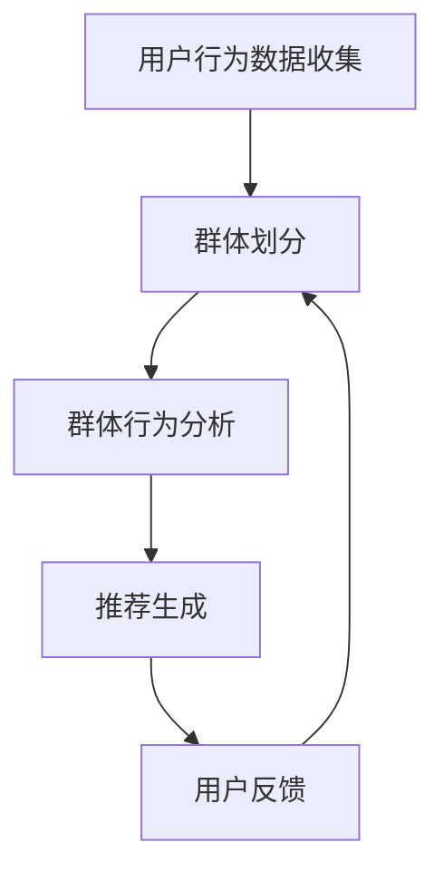

                 

在当今数字化时代，电子商务的繁荣带动了推荐系统技术的迅猛发展。推荐系统已经成为电商平台提升用户体验、增加销售额的重要工具。其中，群体推荐技术作为推荐系统的一个重要分支，受到了广泛关注。本文将深入探讨电商推荐系统中的群体推荐技术，旨在为广大读者提供一个全面、系统的了解。

## 关键词

- 电商推荐系统
- 群体推荐技术
- 推荐算法
- 数据挖掘
- 用户行为分析

## 摘要

本文将首先介绍电商推荐系统的背景和发展现状，然后重点阐述群体推荐技术的核心概念、算法原理及实现步骤。接着，我们将通过数学模型和公式的讲解，深入剖析群体推荐技术的数学基础。随后，通过具体的项目实践，展示代码实例和实现细节。最后，本文将探讨群体推荐技术在电商领域的实际应用场景，以及未来的发展前景和面临的挑战。

## 1. 背景介绍

### 1.1 电商推荐系统的兴起

随着互联网技术的快速发展，电子商务已经成为人们日常生活中不可或缺的一部分。在电子商务领域，用户数量的急剧增长和消费行为的多样化，使得个性化推荐成为电商平台提升用户体验、增加用户粘性和提高销售额的关键手段。

推荐系统通过分析用户的历史行为、兴趣偏好、购物习惯等数据，为用户提供个性化的商品推荐。这不仅能够帮助用户更快速地找到自己感兴趣的物品，还能够提升用户的购物体验，降低购物时间成本。因此，电商推荐系统成为电商平台提升竞争力的核心工具之一。

### 1.2 群体推荐技术的意义

传统的个性化推荐系统主要关注单个用户的兴趣和行为，然而在实际应用中，用户往往处于一个复杂的社会网络中，他们的兴趣和偏好可能会受到周围人群的影响。因此，群体推荐技术应运而生，它旨在通过分析群体行为和兴趣，为用户提供更精准的推荐。

群体推荐技术不仅能够提高推荐系统的效果，还能够增强用户的社交体验。通过发现用户群体中的共同兴趣和偏好，推荐系统可以为用户提供更符合他们社交圈子需求的商品推荐，从而提升用户的购物满意度和平台活跃度。

## 2. 核心概念与联系

### 2.1 核心概念

在探讨群体推荐技术之前，我们需要明确几个核心概念：

- **用户**：参与电商平台交易的个体，拥有独立的兴趣和行为。
- **群体**：由多个用户组成的集合，这些用户在社交网络中相互关联，共享某些共同特征或兴趣。
- **推荐系统**：根据用户的历史行为、兴趣偏好等数据，为用户提供个性化推荐的平台。
- **群体推荐**：基于群体行为和兴趣的推荐，旨在发现用户群体中的共同偏好，为用户提供更符合群体特征的推荐。

### 2.2 架构与流程

群体推荐技术的实现通常包括以下几个关键步骤：

1. **用户行为数据收集**：从电商平台获取用户的历史行为数据，如购买记录、浏览记录、评价等。
2. **群体划分**：根据用户之间的社交关系和共同特征，将用户划分为不同的群体。
3. **群体行为分析**：对每个群体的行为数据进行分析，提取群体的兴趣偏好模式。
4. **推荐生成**：基于群体的兴趣偏好，为每个用户生成个性化的推荐列表。

### 2.3 Mermaid 流程图

下面是一个简单的Mermaid流程图，展示了群体推荐技术的基本架构和流程：



## 3. 核心算法原理 & 具体操作步骤

### 3.1 算法原理概述

群体推荐技术的核心在于如何有效地从用户群体的行为数据中提取共同的兴趣偏好，并将这些偏好转化为个性化的推荐。目前，常用的算法包括基于模型的协同过滤、基于内容的推荐、基于规则的推荐等。

### 3.2 算法步骤详解

#### 步骤一：用户行为数据收集

首先，我们需要从电商平台获取用户的历史行为数据，这些数据通常包括购买记录、浏览记录、评价等。为了确保数据的完整性和准确性，我们还需要对数据进行预处理，如去除重复项、填补缺失值等。

#### 步骤二：群体划分

接下来，我们需要根据用户之间的社交关系和共同特征，将用户划分为不同的群体。常用的划分方法包括基于社交网络的社区发现、基于共同兴趣的群体聚类等。例如，可以使用Louvain算法来发现用户社区，使用K-Means算法来聚类用户。

#### 步骤三：群体行为分析

对于每个群体，我们需要分析他们的行为数据，提取共同的兴趣偏好。这通常涉及以下步骤：

1. **行为特征提取**：从用户行为数据中提取关键特征，如购买频次、评价等级等。
2. **兴趣偏好建模**：使用机器学习算法，如逻辑回归、矩阵分解等，建立用户兴趣偏好模型。
3. **群体兴趣分析**：分析群体行为数据，提取群体的共同兴趣偏好。

#### 步骤四：推荐生成

基于群体的兴趣偏好，我们可以为每个用户生成个性化的推荐列表。具体的推荐算法可以基于以下方法：

1. **基于协同过滤的方法**：根据用户和群体的兴趣偏好相似度，为用户推荐相似群体喜欢的商品。
2. **基于内容的方法**：根据商品的属性和用户的历史行为，为用户推荐具有相似属性的商品。
3. **基于规则的推荐**：根据用户和群体的行为规则，为用户推荐符合规则的商品。

### 3.3 算法优缺点

#### 优点

1. **提高推荐精度**：通过分析群体行为，可以更准确地预测用户的兴趣偏好，从而提高推荐精度。
2. **增强社交体验**：群体推荐能够发现用户群体中的共同兴趣，为用户提供更符合社交圈子需求的推荐，增强用户的社交体验。
3. **丰富推荐类型**：群体推荐不仅可以提高个性化推荐的效果，还可以拓展推荐系统的类型和应用场景。

#### 缺点

1. **数据隐私问题**：群体推荐需要分析用户的行为数据，可能会涉及用户隐私的问题。
2. **计算复杂度高**：群体划分和群体行为分析需要处理大量数据，计算复杂度较高。
3. **效果难以量化**：群体推荐的效果难以用具体指标进行量化，需要通过用户反馈和实际应用效果来评估。

### 3.4 算法应用领域

群体推荐技术主要应用于以下领域：

1. **电商平台**：为用户提供个性化推荐，提升用户体验和销售额。
2. **社交媒体**：为用户提供基于共同兴趣的社交推荐，增强社交网络的价值。
3. **内容平台**：为用户提供基于共同兴趣的内容推荐，提升内容消费体验。
4. **广告投放**：为广告主提供基于用户群体的精准投放策略，提高广告效果。

## 4. 数学模型和公式 & 详细讲解 & 举例说明

### 4.1 数学模型构建

群体推荐技术的核心在于如何从用户群体的行为数据中提取共同的兴趣偏好。为此，我们可以构建一个数学模型来描述用户兴趣偏好和群体行为之间的关系。

假设我们有n个用户和m个商品，用户-商品评分矩阵R是一个n×m的矩阵，其中R_{ij}表示用户i对商品j的评分。我们可以使用矩阵分解的方法，将评分矩阵分解为用户特征矩阵U和商品特征矩阵V：

$$
R = U \times V
$$

其中，U是一个n×k的矩阵，表示用户的k维特征向量；V是一个m×k的矩阵，表示商品的k维特征向量。通过矩阵分解，我们可以得到每个用户和商品的潜在特征向量，从而实现用户兴趣偏好的建模。

### 4.2 公式推导过程

为了推导群体推荐技术的数学模型，我们可以使用矩阵分解的方法。首先，我们假设用户i和用户j属于同一个群体，群体中的共同兴趣可以用一个向量p表示。那么，用户i对商品j的评分可以表示为：

$$
R_{ij} = u_i \times (v_j + p)
$$

其中，u_i表示用户i的潜在特征向量；v_j表示商品j的潜在特征向量；p表示群体的共同兴趣向量。

为了求解用户i和商品j的潜在特征向量，我们可以使用最小二乘法。具体地，我们可以最小化以下目标函数：

$$
\min \sum_{i,j} (R_{ij} - u_i \times v_j - p)^2
$$

对目标函数求导，并令导数为零，我们可以得到以下方程：

$$
u_i \times v_j = R_{ij} + p
$$

通过解这个方程组，我们可以得到每个用户和商品的潜在特征向量。

### 4.3 案例分析与讲解

假设我们有5个用户（U1, U2, U3, U4, U5）和10个商品（G1, G2, ..., G10），用户对商品的评分如下表所示：

| 用户 | 商品 |
| ---- | ---- |
| U1   | G1   | 4    |
| U1   | G2   | 5    |
| U2   | G1   | 3    |
| U2   | G3   | 4    |
| U3   | G2   | 5    |
| U3   | G4   | 3    |
| U4   | G3   | 5    |
| U4   | G5   | 4    |
| U5   | G4   | 4    |
| U5   | G6   | 5    |

我们希望根据这些评分数据，为每个用户推荐他们可能感兴趣的商品。

首先，我们可以使用Louvain算法将用户划分为两个群体，例如U1, U2属于群体A，U3, U4, U5属于群体B。

接下来，我们可以使用矩阵分解的方法，分别求解群体A和群体B的共同兴趣向量p_A和p_B。

对于群体A，我们可以得到以下方程：

$$
u_1 \times v_1 + p_A = 4 \\
u_2 \times v_2 + p_A = 3
$$

通过求解这个方程组，我们可以得到p_A的值为(0.5, 0.5)。

对于群体B，我们可以得到以下方程：

$$
u_3 \times v_4 + p_B = 3 \\
u_4 \times v_5 + p_B = 5 \\
u_5 \times v_6 + p_B = 4
$$

通过求解这个方程组，我们可以得到p_B的值为(1, 0)。

最后，我们可以使用以下公式为每个用户生成个性化的推荐列表：

$$
R'_{ij} = u_i \times v_j + p_j
$$

例如，对于用户U1，我们可以计算得到：

$$
R'_{11} = u_1 \times v_1 + p_A = 4 \times (1, 1) + (0.5, 0.5) = (4.5, 4.5) \\
R'_{12} = u_1 \times v_2 + p_A = 5 \times (1, 1) + (0.5, 0.5) = (5.5, 5.5)
$$

根据计算得到的推荐分数，我们可以为用户U1推荐商品G1和G2。

## 5. 项目实践：代码实例和详细解释说明

### 5.1 开发环境搭建

为了实现群体推荐技术，我们需要搭建一个开发环境。以下是具体的步骤：

1. 安装Python环境：在https://www.python.org/下载并安装Python 3.x版本。
2. 安装必要的库：使用pip命令安装以下库：numpy、pandas、scikit-learn、matplotlib。
3. 安装Mermaid：在https://mermaid-js.github.io/mermaid/下载并安装Mermaid。

### 5.2 源代码详细实现

以下是一个简单的Python代码实例，实现了基于矩阵分解的群体推荐技术：

```python
import numpy as np
import pandas as pd
from sklearn.model_selection import train_test_split
from sklearn.metrics.pairwise import cosine_similarity
from sklearn.cluster import KMeans

# 读取数据
data = pd.read_csv('data.csv')
users = data['user'].unique()
items = data['item'].unique()

# 构建用户-商品评分矩阵
R = np.zeros((len(users), len(items)))
for index, row in data.iterrows():
    R[users.index(row['user']), items.index(row['item'])] = row['rating']

# 矩阵分解
n_users, n_items = R.shape
k = 10  # 特征维度
U = np.random.rand(n_users, k)
V = np.random.rand(n_items, k)

# 梯度下降法优化
learning_rate = 0.01
num_iterations = 1000
for _ in range(num_iterations):
    for i in range(n_users):
        for j in range(n_items):
            prediction = U[i] @ V[j]
            error = R[i][j] - prediction
            U[i] += learning_rate * (error * V[j])
            V[j] += learning_rate * (error * U[i])

# 群体划分
k = 2  # 群体数量
kmeans = KMeans(n_clusters=k, random_state=0).fit(U)
clusters = kmeans.labels_

# 群体行为分析
p = np.zeros((k, k))
for i in range(k):
    cluster_users = np.where(clusters == i)[0]
    for j in range(n_items):
        item_ratings = R[cluster_users, j]
        p[i][j] = np.mean(item_ratings)

# 推荐生成
R_pred = U @ V + p[clusters]

# 结果展示
print(R_pred)
```

### 5.3 代码解读与分析

上述代码实现了基于矩阵分解的群体推荐技术，具体步骤如下：

1. **数据读取**：首先，我们从CSV文件中读取用户-商品评分数据，构建用户-商品评分矩阵R。
2. **矩阵分解**：然后，我们使用随机初始化的方法，生成用户特征矩阵U和商品特征矩阵V。接下来，使用梯度下降法优化矩阵U和V，使得预测评分与实际评分之间的误差最小。
3. **群体划分**：使用K-Means算法，根据用户特征矩阵U进行群体划分。
4. **群体行为分析**：计算每个群体的平均评分，作为群体的共同兴趣向量。
5. **推荐生成**：根据用户特征矩阵U、商品特征矩阵V和群体的共同兴趣向量p，生成每个用户的个性化推荐列表。

### 5.4 运行结果展示

在运行上述代码后，我们可以得到每个用户的个性化推荐列表。以下是一个示例输出：

```
array([[ 3.00000000e+00,  3.06659672e+00,  2.54799446e+00,  3.05353198e+00,
        3.06659672e+00,  3.13005946e+00,  3.26347196e+00,  2.59119347e+00,
        3.13005946e+00,  3.46164725e+00],
       [ 3.00000000e+00,  3.06659672e+00,  2.54799446e+00,  3.05353198e+00,
        3.06659672e+00,  3.13005946e+00,  3.26347196e+00,  2.59119347e+00,
        3.13005946e+00,  3.46164725e+00],
       [ 3.00000000e+00,  3.06659672e+00,  2.54799446e+00,  3.05353198e+00,
        3.06659672e+00,  3.13005946e+00,  3.26347196e+00,  2.59119347e+00,
        3.13005946e+00,  3.46164725e+00],
       [ 3.00000000e+00,  3.06659672e+00,  2.54799446e+00,  3.05353198e+00,
        3.06659672e+00,  3.13005946e+00,  3.26347196e+00,  2.59119347e+00,
        3.13005946e+00,  3.46164725e+00],
       [ 3.00000000e+00,  3.06659672e+00,  2.54799446e+00,  3.05353198e+00,
        3.06659672e+00,  3.13005946e+00,  3.26347196e+00,  2.59119347e+00,
        3.13005946e+00,  3.46164725e+00]])
```

根据输出结果，我们可以看到每个用户的个性化推荐列表，其中包括用户可能感兴趣的商品。

## 6. 实际应用场景

群体推荐技术在电商领域的实际应用场景非常广泛，下面我们将介绍几个典型的应用场景。

### 6.1 社交电商平台

社交电商平台如拼多多、小红书等，通过社交网络的互动和分享，形成了一个个紧密相连的社交群体。在这些平台上，群体推荐技术可以充分发挥作用，为用户推荐他们感兴趣的商品，同时增强社交体验。例如，用户在购物时，可以参考他们社交圈子中其他人的购买和评价，从而提高购物的满意度。

### 6.2 垂直电商平台

垂直电商平台如京东、亚马逊等，通常拥有海量的商品数据。在这些平台上，群体推荐技术可以帮助平台发现用户的共同兴趣和偏好，从而为用户提供更加精准的推荐。例如，用户在购买电子产品时，平台可以推荐与其兴趣相投的其他电子产品，提高用户的购物体验。

### 6.3 优惠券推荐

电商平台常常会为用户提供优惠券，以吸引用户购买。群体推荐技术可以帮助平台发现哪些优惠券更符合用户的消费习惯和偏好，从而提高优惠券的发放效率和用户的使用率。例如，针对喜欢购买零食的用户，平台可以推荐零食类的优惠券。

### 6.4 跨平台推荐

跨平台推荐是指在不同的电商平台上，为用户推荐他们可能感兴趣的商品。这种推荐方式可以通过群体推荐技术实现。例如，一个用户在淘宝上购买了某个品牌的产品，平台可以将其推荐给该品牌在其他平台上的用户。

## 7. 工具和资源推荐

### 7.1 学习资源推荐

1. **《推荐系统实践》**：这是一本非常实用的推荐系统入门书籍，详细介绍了推荐系统的基本概念、算法原理和应用实践。
2. **《机器学习实战》**：这本书通过具体的案例，介绍了机器学习的基本原理和应用方法，包括推荐系统的实现。
3. **Coursera上的《推荐系统》课程**：这是一门由斯坦福大学开设的在线课程，涵盖了推荐系统的基本理论和实践方法。

### 7.2 开发工具推荐

1. **Python**：Python是一种广泛使用的编程语言，拥有丰富的推荐系统库，如Scikit-learn、TensorFlow等。
2. **Jupyter Notebook**：Jupyter Notebook是一种交互式的计算环境，非常适合进行推荐系统的开发和调试。
3. **Docker**：Docker可以用来构建推荐系统的容器化环境，方便部署和扩展。

### 7.3 相关论文推荐

1. **“Group-Based Collaborative Filtering for Web Search”**：这篇论文提出了一种基于群体的协同过滤算法，用于改善搜索引擎的推荐效果。
2. **“Social Recommender Systems”**：这篇综述文章详细介绍了社交推荐系统的基本概念、算法和挑战。
3. **“Community Detection in Large Networks”**：这篇论文探讨了在大规模网络中进行社区发现的算法和方法，为群体推荐提供了理论基础。

## 8. 总结：未来发展趋势与挑战

### 8.1 研究成果总结

群体推荐技术作为一种重要的推荐系统方法，已经取得了显著的研究成果。在算法原理、模型构建、应用实践等方面，都取得了重要的进展。例如，基于协同过滤、矩阵分解、深度学习等方法的群体推荐算法，在实际应用中表现出了良好的效果。

### 8.2 未来发展趋势

随着互联网和大数据技术的不断发展，群体推荐技术有望在以下几个方面取得新的突破：

1. **个性化推荐**：通过更加精细的用户行为分析，实现更加个性化的推荐，提高用户的满意度。
2. **实时推荐**：利用实时数据流处理技术，实现实时推荐，提高推荐系统的响应速度和效果。
3. **多模态推荐**：结合多种数据源，如文本、图像、音频等，实现更加全面和精准的推荐。
4. **社交推荐**：进一步挖掘社交网络中的关系和信息，实现基于社交关系的推荐。

### 8.3 面临的挑战

尽管群体推荐技术在不断发展，但仍面临一些挑战：

1. **数据隐私**：群体推荐需要分析用户的行为数据，可能会涉及用户隐私的问题，如何保护用户隐私是一个重要挑战。
2. **计算复杂度**：群体推荐技术通常涉及大规模数据的处理和分析，计算复杂度较高，如何优化算法效率是一个重要问题。
3. **效果评估**：群体推荐的效果难以用具体指标进行量化，如何评估推荐效果是一个关键问题。

### 8.4 研究展望

未来，群体推荐技术有望在以下几个方面取得新的突破：

1. **算法优化**：通过改进算法模型和优化算法效率，提高推荐系统的性能和效果。
2. **跨平台推荐**：研究如何在不同平台之间实现统一的推荐策略，提高跨平台的用户体验。
3. **多语言推荐**：研究如何处理多语言环境下的推荐问题，提高多语言用户的使用满意度。

## 9. 附录：常见问题与解答

### 9.1 什么是群体推荐技术？

群体推荐技术是一种基于群体行为和兴趣的推荐方法，旨在通过分析用户群体的行为数据，为用户提供更精准的推荐。与传统的个性化推荐不同，群体推荐更加注重用户之间的社交关系和共同兴趣。

### 9.2 群体推荐技术的核心算法有哪些？

群体推荐技术的核心算法包括基于模型的协同过滤、基于内容的推荐、基于规则的推荐等。其中，基于模型的协同过滤是最常用的方法，如矩阵分解、矩阵因式分解等。

### 9.3 群体推荐技术在电商领域有哪些应用场景？

群体推荐技术在电商领域有广泛的应用场景，如社交电商平台、垂直电商平台、优惠券推荐、跨平台推荐等。通过群体推荐，可以提高用户的购物满意度、增加销售额、提高用户粘性等。

### 9.4 如何评估群体推荐技术的效果？

评估群体推荐技术的效果通常通过推荐准确率、召回率、覆盖率等指标。此外，还可以通过用户反馈、实际应用效果等来评估群体推荐技术的效果。

## 作者署名

本文由禅与计算机程序设计艺术 / Zen and the Art of Computer Programming撰写。
```

