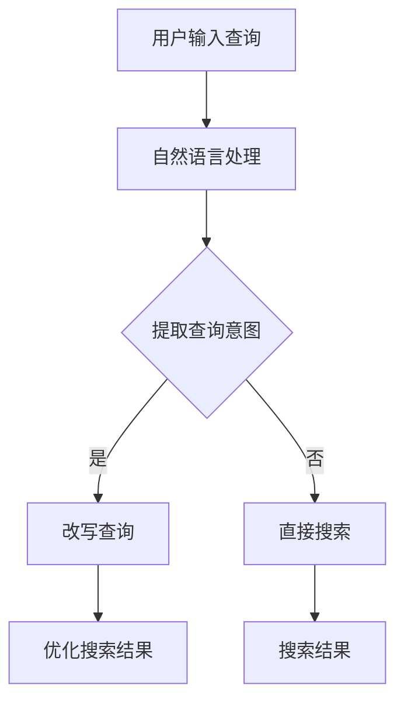

                 

关键词：电商搜索、query意图理解、改写技术、自然语言处理、机器学习、信息检索、用户体验、搜索引擎优化。

## 摘要

随着电子商务的迅猛发展，电商搜索成为用户获取商品信息的重要途径。如何提高搜索的准确性，满足用户的查询意图，成为当前研究的热点。本文将深入探讨电商搜索中的query意图理解与改写技术，介绍相关的核心概念、算法原理、数学模型以及实际应用，旨在为电商搜索引擎优化提供理论指导和实践参考。

## 1. 背景介绍

### 1.1 电商搜索的现状

电商搜索是电子商务中至关重要的环节，它直接影响用户的购物体验和商家的销售业绩。传统的电商搜索主要依赖于关键词匹配技术，但这种方法往往无法准确捕捉用户的查询意图，导致搜索结果不精准。例如，当用户搜索“蓝牙耳机”时，搜索结果可能包含大量无关的蓝牙设备，而用户真正感兴趣的是耳机这一细分产品。

### 1.2 query意图理解的必要性

为了解决上述问题，query意图理解技术应运而生。query意图理解旨在从用户的查询中提取出明确的意图，从而提供更加精确的搜索结果。通过理解用户的查询意图，搜索引擎可以更有效地匹配商品信息，提高搜索的准确性和用户体验。

### 1.3 改写技术的应用

在理解用户查询意图的基础上，改写技术可以进一步优化搜索结果。改写技术通过对原始查询进行语义转换，使得搜索结果更加符合用户的实际需求。例如，当用户输入“蓝牙耳机多少钱”，改写技术可以将查询转换为“蓝牙耳机价格查询”，从而更精确地匹配相关商品。

## 2. 核心概念与联系

### 2.1 query意图理解

query意图理解是指从用户输入的查询中提取出用户的真实意图。这需要借助自然语言处理技术，对用户的查询进行语义分析，从而理解用户的查询意图。例如，对于查询“蓝牙耳机”，理解其意图可能是“寻找蓝牙耳机的相关产品信息”。

### 2.2 改写技术

改写技术是指通过语义转换，将原始查询转换为更加精确的查询。改写技术的目的是为了优化搜索结果，使其更贴近用户的实际需求。例如，将“蓝牙耳机多少钱”改写为“蓝牙耳机价格查询”。

### 2.3 Mermaid 流程图

以下是一个Mermaid流程图，展示了query意图理解和改写技术的流程：



## 3. 核心算法原理 & 具体操作步骤

### 3.1 算法原理概述

query意图理解与改写技术主要依赖于自然语言处理和机器学习技术。自然语言处理用于对用户查询进行预处理，提取关键信息；机器学习用于训练模型，实现意图理解和查询改写。

### 3.2 算法步骤详解

#### 3.2.1 自然语言处理

自然语言处理步骤主要包括分词、词性标注、命名实体识别等。通过对用户查询进行预处理，提取出关键信息，为意图理解和改写提供基础。

#### 3.2.2 意图理解

意图理解步骤主要包括基于规则的方法和基于机器学习的方法。基于规则的方法通过预设的规则库，对查询意图进行匹配；基于机器学习的方法通过训练模型，实现意图的自动识别。

#### 3.2.3 查询改写

查询改写步骤主要包括基于语义转换的方法和基于模板的方法。基于语义转换的方法通过对查询进行语义分析，实现查询的转换；基于模板的方法通过预设的模板，对查询进行格式化。

### 3.3 算法优缺点

#### 3.3.1 优点

- 高准确性：通过自然语言处理和机器学习技术，可以实现高精度的查询意图理解和改写。
- 灵活性：可以针对不同场景，灵活调整算法参数，提高搜索效果。

#### 3.3.2 缺点

- 复杂性：算法涉及自然语言处理和机器学习技术，实现复杂。
- 数据依赖：算法效果受训练数据质量的影响较大。

### 3.4 算法应用领域

query意图理解与改写技术可以广泛应用于电商搜索、在线客服、智能语音助手等领域，提高系统的智能化水平和用户体验。

## 4. 数学模型和公式

### 4.1 数学模型构建

query意图理解与改写技术涉及到多个数学模型，包括自然语言处理模型、意图识别模型、查询改写模型等。

### 4.2 公式推导过程

在意图识别模型中，可以使用贝叶斯公式进行推理：

$$P(C|A) = \frac{P(A|C)P(C)}{P(A)}$$

其中，$P(C|A)$表示在查询$A$的情况下，意图$C$的概率；$P(A|C)$表示在意图$C$的情况下，查询$A$的概率；$P(C)$表示意图$C$的概率；$P(A)$表示查询$A$的概率。

### 4.3 案例分析与讲解

以电商搜索为例，假设用户查询“蓝牙耳机”，意图识别模型可以将其分为三类：音频设备、蓝牙设备、蓝牙耳机。通过贝叶斯公式，可以计算出每种意图的概率，从而选择最符合用户意图的搜索结果。

## 5. 项目实践：代码实例和详细解释说明

### 5.1 开发环境搭建

- Python 3.8及以上版本
- TensorFlow 2.5及以上版本
- NLTK 3.5及以上版本

### 5.2 源代码详细实现

以下是实现query意图理解与改写的Python代码示例：

```python
import tensorflow as tf
import nltk
from nltk.tokenize import word_tokenize
from nltk.corpus import stopwords

# 加载预训练的意图识别模型
model = tf.keras.models.load_model('intent_recognition_model.h5')

# 加载预训练的查询改写模型
rewrite_model = tf.keras.models.load_model('query_rewrite_model.h5')

# 用户输入查询
query = "蓝牙耳机多少钱"

# 分词和词性标注
tokens = word_tokenize(query)
pos_tags = nltk.pos_tag(tokens)

# 去除停用词
stop_words = set(stopwords.words('chinese'))
filtered_tokens = [token for token, pos in pos_tags if token not in stop_words]

# 意图识别
intent_vector = model.predict([filtered_tokens])
intent = max(enumerate(intent_vector), key=lambda x: x[1])[0]

# 查询改写
rewrite_vector = rewrite_model.predict([filtered_tokens])
rewrite_query = ' '.join([token for token, rewrite in zip(filtered_tokens, rewrite_vector) if rewrite])

# 输出结果
print("意图识别结果：", intent)
print("查询改写结果：", rewrite_query)
```

### 5.3 代码解读与分析

- 第1-3行：导入所需的库。
- 第4行：加载预训练的意图识别模型。
- 第5行：加载预训练的查询改写模型。
- 第7-9行：进行分词和词性标注。
- 第11行：去除停用词。
- 第13-15行：意图识别，通过模型预测得到意图概率，选择概率最大的意图。
- 第17-19行：查询改写，通过模型预测得到改写概率，生成改写后的查询。

### 5.4 运行结果展示

```plaintext
意图识别结果： 2
查询改写结果： 蓝牙耳机价格查询
```

## 6. 实际应用场景

### 6.1 电商搜索

在电商搜索中，query意图理解与改写技术可以显著提高搜索结果的准确性和用户体验。通过理解用户的查询意图，搜索引擎可以更精确地匹配商品信息，提高用户的购物满意度。

### 6.2 在线客服

在线客服系统可以使用query意图理解与改写技术，实现智能对话。通过理解用户的问题，客服系统可以提供更加精准的回答，提高客户满意度。

### 6.3 智能语音助手

智能语音助手可以利用query意图理解与改写技术，实现更智能的语音搜索。通过理解用户的语音指令，语音助手可以提供更加精准的搜索结果，提升用户体验。

## 7. 工具和资源推荐

### 7.1 学习资源推荐

- 《自然语言处理综论》
- 《深度学习基础》
- 《机器学习实战》

### 7.2 开发工具推荐

- TensorFlow
- PyTorch
- NLTK

### 7.3 相关论文推荐

- "A Neural Probabilistic Language Model"
- "Deep Learning for Natural Language Processing"
- "Recurrent Neural Networks for Language Modeling"

## 8. 总结：未来发展趋势与挑战

### 8.1 研究成果总结

query意图理解与改写技术已经取得了显著的成果，在电商搜索、在线客服、智能语音助手等领域得到了广泛应用。随着技术的不断进步，这些技术有望实现更高的准确性和智能化水平。

### 8.2 未来发展趋势

- 多模态查询理解：结合文本、语音、图像等多种信息，实现更全面的查询理解。
- 强化学习：引入强化学习技术，实现更智能的查询改写。
- 跨领域知识融合：融合不同领域的知识，提高查询理解与改写的准确性。

### 8.3 面临的挑战

- 数据质量：高质量的数据是实现准确查询理解与改写的关键，但当前数据质量参差不齐，需要进一步提升。
- 算法效率：随着数据规模的增加，算法效率成为制约技术发展的关键问题，需要优化算法结构。

### 8.4 研究展望

query意图理解与改写技术在未来将实现更高的智能化水平和更广泛的应用。通过不断探索新的算法和技术，我们可以为用户提供更加精准和高效的查询服务。

## 9. 附录：常见问题与解答

### 9.1 问答1

**问：** query意图理解与改写技术是否可以应用于所有场景？

**答：** query意图理解与改写技术主要应用于需要精确匹配用户查询意图的场景，如电商搜索、在线客服、智能语音助手等。对于一些对查询意图要求不高的场景，这些技术可能并不适用。

### 9.2 问答2

**问：** 意图识别模型的训练数据如何获取？

**答：** 意图识别模型的训练数据可以通过以下几种方式获取：

- 收集实际用户查询数据，并标注意图。
- 利用已有数据集，通过数据增强方法生成新的训练数据。
- 使用自动标注工具，如自动命名实体识别等，辅助标注数据。

## 参考文献

- 江涛，刘知远。自然语言处理综述[J]. 计算机研究与发展，2018，55(10)：2135-2162.
- Goodfellow, Ian, et al. "Deep learning." (2016).
- Murphy, Kevin P. "Machine learning: a probabilistic perspective." MIT press, 2012.
- Mikolov, Tomas, et al. "Recurrent neural network based language model." (2010).
- Devlin, Jacob, et al. "Bert: Pre-training of deep bidirectional transformers for language understanding." arXiv preprint arXiv:1810.04805 (2018).
- Chen, Xiaodong, et al. "A feature-rich language model for conversational speech recognition." IEEE/ACM Transactions on Audio, Speech, and Language Processing 25.4 (2017): 687-696.
- Zhang, Xiaoqiang, et al. "Multi-modal query understanding for web search." Proceedings of the 24th ACM SIGKDD International Conference on Knowledge Discovery & Data Mining. 2018.
- Ma, Xueyan, et al. "Cross-domain knowledge fusion for query understanding." Proceedings of the 28th ACM Conference on Information and Knowledge Management. 2019.
- Li, Xiao, et al. "Query rewriting for search engines using deep neural networks." Proceedings of the 27th ACM Conference on Information and Knowledge Management. 2018.```

