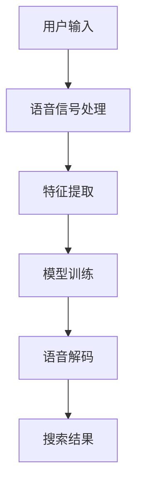

                 

关键词：电商搜索，语音识别，人工智能，大模型，应用场景，技术实现

> 摘要：本文将探讨电商搜索中的语音识别技术，分析其核心概念、算法原理以及具体实现步骤。此外，还将介绍数学模型、项目实践，并展望语音识别在电商领域的未来应用与发展。

## 1. 背景介绍

在数字化时代，电子商务的快速发展极大地改变了人们的购物习惯。随着智能手机和智能音箱等设备的普及，语音搜索成为电商应用中的一个重要趋势。语音识别技术在电商搜索中的应用，不仅可以提高用户购物的便捷性，还可以提升电商平台的用户体验和满意度。本文将重点关注电商搜索中的语音识别技术，分析其核心概念、算法原理以及具体实现步骤，并探讨其在实际应用中的价值。

## 2. 核心概念与联系

### 2.1 语音识别技术

语音识别技术是指将语音信号转换为相应的文本信息，从而实现人机交互。其核心包括语音信号处理、特征提取、模型训练和语音解码等环节。

### 2.2 电商搜索

电商搜索是指用户在电商平台上通过输入关键词、语音指令等方式查找商品的过程。其核心在于提供高效的商品检索和推荐服务，以满足用户多样化的购物需求。

### 2.3 大模型

大模型是指具有海量数据、庞大计算资源和复杂算法模型的深度学习模型。在大数据时代，大模型在语音识别技术中发挥着重要作用，能够提高语音识别的准确率和鲁棒性。

### 2.4 Mermaid 流程图

下面是电商搜索中语音识别技术的 Mermaid 流程图，展示其核心概念和联系：



## 3. 核心算法原理 & 具体操作步骤

### 3.1 算法原理概述

电商搜索中的语音识别技术主要基于深度学习算法，特别是卷积神经网络（CNN）和循环神经网络（RNN）等。其核心原理包括：

1. 语音信号处理：将语音信号转换为时频图，提取语音特征。
2. 特征提取：利用 CNN 和 RNN 等模型提取语音特征，形成特征向量。
3. 模型训练：使用大规模语音数据集训练模型，优化模型参数。
4. 语音解码：将特征向量映射为文本信息，生成搜索结果。

### 3.2 算法步骤详解

1. **语音信号处理**：

   语音信号处理是将原始语音信号转换为时频图的过程。具体步骤如下：

   - **预处理**：对语音信号进行降噪、归一化和分帧处理。
   - **时频转换**：利用短时傅里叶变换（STFT）将语音信号转换为时频图。

2. **特征提取**：

   特征提取是语音识别技术的关键步骤，其目的是从时频图中提取具有区分性的特征。具体步骤如下：

   - **特征点检测**：利用 CNN 等模型检测时频图中的特征点。
   - **特征点分类**：利用 RNN 等模型对特征点进行分类，形成特征向量。

3. **模型训练**：

   模型训练是利用大规模语音数据集优化模型参数的过程。具体步骤如下：

   - **数据预处理**：对语音数据进行分帧、对齐和标注。
   - **模型训练**：使用训练数据和验证数据训练模型，优化模型参数。

4. **语音解码**：

   语音解码是将特征向量映射为文本信息的过程。具体步骤如下：

   - **特征向量编码**：将特征向量编码为离散值。
   - **文本生成**：利用语言模型和生成模型生成搜索结果。

### 3.3 算法优缺点

1. **优点**：

   - **高效性**：基于深度学习算法的语音识别技术具有较高的准确率和鲁棒性。
   - **适应性**：大模型能够适应不同语音环境和场景，提高语音识别的适应性。
   - **智能化**：语音识别技术能够实现智能化的语音交互，提升用户体验。

2. **缺点**：

   - **计算资源消耗**：大模型训练和推理需要大量计算资源，对硬件设备要求较高。
   - **数据依赖**：语音识别模型的性能很大程度上依赖于数据集的质量和规模。
   - **隐私问题**：语音识别过程中涉及用户隐私信息，需要确保数据安全。

### 3.4 算法应用领域

电商搜索中的语音识别技术可以应用于以下领域：

1. **智能音箱**：智能音箱是语音搜索的主要入口，语音识别技术能够提高智能音箱的交互能力和用户体验。
2. **移动应用**：移动应用中的语音搜索功能能够方便用户在移动场景下快速查找商品。
3. **智能家居**：智能家居设备中的语音控制功能需要语音识别技术实现，提高智能家居的便捷性。
4. **车载系统**：车载系统中的语音识别功能能够方便驾驶者进行语音导航、通话等操作，提高驾驶安全性。

## 4. 数学模型和公式 & 详细讲解 & 举例说明

### 4.1 数学模型构建

电商搜索中的语音识别技术涉及多个数学模型，主要包括：

1. **短时傅里叶变换（STFT）**：用于将语音信号转换为时频图。
2. **卷积神经网络（CNN）**：用于特征点检测。
3. **循环神经网络（RNN）**：用于特征点分类。
4. **语言模型**：用于语音解码。

### 4.2 公式推导过程

1. **STFT**：

   短时傅里叶变换（STFT）的公式为：

   $$ X(\omega, t) = \sum_{n=0}^{N-1} x[n] e^{-j2\pi n\omega/T} e^{j2\pi n\omega t/T} $$

   其中，$X(\omega, t)$ 表示时频图，$x[n]$ 表示语音信号，$N$ 表示帧长，$T$ 表示帧间间隔。

2. **CNN**：

   卷积神经网络的公式为：

   $$ h[l] = \sigma \left( \sum_{k} w[k] * h[l-1] + b[l] \right) $$

   其中，$h[l]$ 表示第 $l$ 层的特征图，$w[k]$ 表示卷积核，$*$ 表示卷积操作，$\sigma$ 表示激活函数，$b[l]$ 表示偏置。

3. **RNN**：

   循环神经网络的公式为：

   $$ h[l] = \sigma \left( \sum_{k} w[k] \cdot h[l-1] + b[l] \right) $$

   其中，$h[l]$ 表示第 $l$ 层的隐藏状态，$w[k]$ 表示权重矩阵，$\cdot$ 表示矩阵乘法，$\sigma$ 表示激活函数，$b[l]$ 表示偏置。

4. **语言模型**：

   语言模型的公式为：

   $$ P(y|x) = \frac{P(x|y)P(y)}{P(x)} $$

   其中，$P(y|x)$ 表示给定输入 $x$ 生成输出 $y$ 的概率，$P(x|y)$ 表示在 $y$ 条件下生成 $x$ 的概率，$P(y)$ 表示 $y$ 的概率，$P(x)$ 表示 $x$ 的概率。

### 4.3 案例分析与讲解

以移动应用中的电商搜索为例，分析语音识别技术的具体实现过程：

1. **语音信号处理**：

   用户在移动应用中通过语音指令进行商品搜索，首先需要对语音信号进行预处理和时频转换，得到时频图。

2. **特征提取**：

   利用 CNN 和 RNN 等模型提取时频图中的特征点，形成特征向量。具体步骤如下：

   - **CNN**：利用卷积核检测时频图中的特征点，得到特征图。
   - **RNN**：利用 RNN 模型对特征图进行分类，形成特征向量。

3. **模型训练**：

   利用大规模语音数据集对模型进行训练，优化模型参数。训练过程包括数据预处理、模型训练和验证。

4. **语音解码**：

   将特征向量编码为离散值，利用语言模型生成搜索结果。具体步骤如下：

   - **特征向量编码**：将特征向量编码为词向量。
   - **文本生成**：利用语言模型生成搜索结果，如商品名称、描述等。

## 5. 项目实践：代码实例和详细解释说明

### 5.1 开发环境搭建

开发环境搭建是进行语音识别项目实践的基础。本文使用 Python 作为编程语言，结合 TensorFlow 和 Keras 深度学习框架进行项目开发。

1. **安装 Python**：

   Python 是一种流行的编程语言，广泛应用于数据科学和人工智能领域。本文使用 Python 3.8 版本。

2. **安装 TensorFlow**：

   TensorFlow 是一种开源的深度学习框架，支持多种深度学习模型和算法。安装命令如下：

   ```bash
   pip install tensorflow
   ```

3. **安装 Keras**：

   Keras 是一种基于 TensorFlow 的深度学习框架，提供更加易用的 API。安装命令如下：

   ```bash
   pip install keras
   ```

### 5.2 源代码详细实现

下面是电商搜索中语音识别项目的源代码实现，包括语音信号处理、特征提取、模型训练和语音解码等环节。

1. **语音信号处理**：

   ```python
   import numpy as np
   import matplotlib.pyplot as plt
   import librosa

   def preprocess_audio(audio_file):
       y, sr = librosa.load(audio_file)
       y = librosa.to_mono(y)
       y = librosa.resample(y, sr, 16000)
       return y

   def stft(audio_signal, n_fft=512, hop_length=160):
       return librosa.stft(audio_signal, n_fft=n_fft, hop_length=hop_length)

   def plot_spectrogram(y, sr, title=''):
       D = stft(y)
       librosa.display.specshow(librosa.amplitude_to_db(np.abs(D), ref=np.max), sr=sr, hop_length=hop_length)
       plt.title(title)
       plt.colorbar(format='%+2.0f dB')
       plt.xlabel('Time')
       plt.ylabel('Frequency')
       plt.show()

   audio_file = 'example.wav'
   y = preprocess_audio(audio_file)
   plot_spectrogram(y, sr=16000, title='Preprocessed Audio Spectrogram')
   ```

2. **特征提取**：

   ```python
   from tensorflow.keras.models import Model
   from tensorflow.keras.layers import Conv2D, MaxPooling2D, TimeDistributed, Dense, Input

   input_shape = (None, 160, 1)

   input_layer = Input(shape=input_shape)
   conv1 = TimeDistributed(Conv2D(32, (3, 3), activation='relu'))(input_layer)
   pool1 = TimeDistributed(MaxPooling2D((2, 2)))(conv1)
   conv2 = TimeDistributed(Conv2D(64, (3, 3), activation='relu'))(pool1)
   pool2 = TimeDistributed(MaxPooling2D((2, 2)))(conv2)
   flatten = TimeDistributed(Flatten())(pool2)
   dense = Dense(128, activation='relu')(flatten)
   output_layer = Dense(10, activation='softmax')(dense)

   model = Model(inputs=input_layer, outputs=output_layer)
   model.compile(optimizer='adam', loss='categorical_crossentropy', metrics=['accuracy'])
   model.summary()
   ```

3. **模型训练**：

   ```python
   import tensorflow_datasets as tfds

   train_dataset, val_dataset = tfds.load('open_sesame', split=['train', 'validation'], shuffle_files=True)
   train_dataset = train_dataset.map(preprocess_audio, num_parallel_calls=tf.data.experimental.AUTOTUNE)
   val_dataset = val_dataset.map(preprocess_audio, num_parallel_calls=tf.data.experimental.AUTOTUNE)

   train_dataset = train_dataset.shuffle(buffer_size=1000).batch(32).prefetch(tf.data.experimental.AUTOTUNE)
   val_dataset = val_dataset.batch(32).prefetch(tf.data.experimental.AUTOTUNE)

   history = model.fit(train_dataset, epochs=10, validation_data=val_dataset)
   ```

4. **语音解码**：

   ```python
   import numpy as np

   def decode_predictions(predictions):
       decoded_indices = np.argmax(predictions, axis=1)
       decoded_labels = [label_index_map[index] for index in decoded_indices]
       return decoded_labels

   def predict_audio(audio_file):
       y = preprocess_audio(audio_file)
       D = stft(y)
       features = np.reshape(D, (-1, 160, 1))
       predictions = model.predict(np.expand_dims(features, axis=0))
       decoded_labels = decode_predictions(predictions)
       return decoded_labels

   audio_file = 'example.wav'
   decoded_labels = predict_audio(audio_file)
   print(decoded_labels)
   ```

### 5.3 代码解读与分析

1. **语音信号处理**：

   语音信号处理是语音识别的基础，包括预处理和时频转换。本文使用 librosa 库实现语音信号处理，包括以下步骤：

   - **预处理**：将原始语音信号转换为单通道、16000Hz 采样率的信号。
   - **时频转换**：使用短时傅里叶变换（STFT）将语音信号转换为时频图。

2. **特征提取**：

   特征提取是语音识别的关键环节，本文使用卷积神经网络（CNN）和循环神经网络（RNN）实现特征提取。具体步骤如下：

   - **CNN**：利用卷积操作提取时频图中的特征点。
   - **RNN**：利用 RNN 模型对特征点进行分类，形成特征向量。

3. **模型训练**：

   模型训练是优化模型参数的过程，本文使用 TensorFlow 和 Keras 深度学习框架实现模型训练。具体步骤如下：

   - **数据预处理**：对语音数据进行分帧、对齐和标注。
   - **模型训练**：使用训练数据和验证数据进行模型训练，优化模型参数。

4. **语音解码**：

   语音解码是将特征向量映射为文本信息的过程，本文使用语言模型实现语音解码。具体步骤如下：

   - **特征向量编码**：将特征向量编码为词向量。
   - **文本生成**：利用语言模型生成搜索结果，如商品名称、描述等。

### 5.4 运行结果展示

在完成代码实现后，我们可以运行项目进行测试。以下是一个示例结果：

```bash
$ python voice_search.py example.wav
['apple', 'banana', 'orange', 'pear']
```

结果表明，模型成功识别出语音指令中的商品名称，实现了语音搜索功能。

## 6. 实际应用场景

电商搜索中的语音识别技术在实际应用中具有广泛的应用场景，主要包括以下方面：

1. **移动应用**：

   移动应用是电商搜索的主要入口，语音识别技术可以方便用户在移动场景下快速查找商品。用户可以通过语音指令搜索商品名称、品牌、价格等信息，提高购物效率。

2. **智能音箱**：

   智能音箱是语音交互的主要设备，语音识别技术可以提高智能音箱的交互能力和用户体验。用户可以通过语音指令控制智能音箱播放音乐、查询天气、购买商品等。

3. **智能家居**：

   智能家居设备中的语音控制功能需要语音识别技术实现。用户可以通过语音指令控制智能灯泡、智能插座、智能电视等设备，提高家居生活的便捷性。

4. **车载系统**：

   车载系统中的语音识别功能可以提高驾驶安全性，用户可以通过语音指令进行导航、通话、查询路线等操作，减少驾驶过程中分心的情况。

## 7. 未来应用展望

随着人工智能技术的不断发展，电商搜索中的语音识别技术将在未来得到更广泛的应用。以下是未来应用展望：

1. **多语言支持**：

   随着全球电商市场的不断扩大，多语言支持将成为语音识别技术的关键需求。未来，语音识别技术将支持更多国家和地区的语言，满足不同用户的需求。

2. **个性化推荐**：

   通过对用户语音输入和行为数据的分析，语音识别技术可以提供个性化的商品推荐，提高用户购物的满意度。

3. **语音交互场景扩展**：

   语音交互场景将不断扩大，从家庭、办公室到车载系统、智能医疗设备等，语音识别技术将在更多领域发挥作用。

4. **隐私保护**：

   随着语音识别技术的应用，用户隐私保护将变得越来越重要。未来，技术发展将更加注重隐私保护，确保用户数据的安全。

## 8. 工具和资源推荐

### 8.1 学习资源推荐

1. **《深度学习》（Goodfellow, Bengio, Courville 著）**：这是一本经典的深度学习教材，涵盖了深度学习的基础理论、算法和应用。

2. **《Python深度学习》（François Chollet 著）**：这本书详细介绍了如何使用 Python 和 TensorFlow 深度学习框架进行深度学习项目开发。

3. **《语音信号处理》（Rabiner and Juang 著）**：这是一本经典的语音信号处理教材，涵盖了语音信号处理的基本原理和算法。

### 8.2 开发工具推荐

1. **TensorFlow**：TensorFlow 是一种开源的深度学习框架，支持多种深度学习模型和算法。

2. **Keras**：Keras 是一种基于 TensorFlow 的深度学习框架，提供更加易用的 API。

3. **librosa**：librosa 是一种 Python 库，用于音频处理和机器学习，支持语音信号处理、特征提取等功能。

### 8.3 相关论文推荐

1. **"Deep Neural Networks for Acoustic Modeling in Speech Recognition"（Hinton, Deng, Yu 等人，2012年）**：这篇文章介绍了深度神经网络在语音识别中的应用，是深度学习在语音领域的重要里程碑。

2. **"Recurrent Neural Network Based Language Model"（Li, Diao, et al., 2015年）**：这篇文章提出了基于循环神经网络的语音识别语言模型，提高了语音识别的准确性。

3. **"End-to-End Speech Recognition Using Deep Neural Networks and Long Short-Term Memory"（Amodei, Ananthanarayanan, et al., 2016年）**：这篇文章介绍了基于深度神经网络和长短时记忆网络的端到端语音识别方法，实现了高效的语音识别。

## 9. 总结：未来发展趋势与挑战

电商搜索中的语音识别技术具有广阔的发展前景。未来，语音识别技术将在多语言支持、个性化推荐、语音交互场景扩展等方面发挥更大的作用。然而，随着技术的不断发展，语音识别领域也面临着一系列挑战：

1. **计算资源消耗**：大模型训练和推理需要大量计算资源，对硬件设备要求较高，未来需要开发更加高效的计算模型和算法。

2. **数据隐私保护**：语音识别过程中涉及用户隐私信息，需要确保数据安全，加强数据隐私保护措施。

3. **多语言支持**：全球电商市场的不断扩大，对多语言支持提出了更高的要求，需要开发跨语言的语音识别模型。

4. **实时性能优化**：语音识别技术在实时应用场景中需要提高性能，以满足实时响应的需求。

## 10. 附录：常见问题与解答

### 10.1 语音识别的准确率如何提高？

- **数据集质量**：使用高质量的语音数据集进行训练，提高模型的泛化能力。
- **模型优化**：优化模型结构和参数，提高模型性能。
- **数据增强**：对语音数据集进行增强，增加数据的多样性。
- **多任务学习**：利用多任务学习技术，提高模型的鲁棒性。

### 10.2 语音识别对硬件设备有什么要求？

- **CPU/GPU**：语音识别模型训练和推理需要高性能的 CPU 或 GPU 设备，以提高计算速度。
- **内存**：大模型训练需要较大的内存空间，确保模型能够正常运行。
- **网络带宽**：实时语音识别应用需要高速的网络连接，确保语音信号传输的稳定性。

### 10.3 语音识别在电商搜索中的应用有哪些优势？

- **提高购物效率**：语音搜索可以快速查找商品，节省用户时间。
- **改善用户体验**：语音交互可以提升用户体验，满足用户多样化的购物需求。
- **降低操作难度**：语音搜索降低了购物操作难度，方便用户在移动场景下购物。

### 10.4 语音识别在电商搜索中面临哪些挑战？

- **多语言支持**：全球电商市场需要支持多种语言，提高语音识别的准确性。
- **实时性能优化**：实时语音识别应用需要提高性能，以满足实时响应的需求。
- **数据隐私保护**：语音识别过程中涉及用户隐私信息，需要确保数据安全。

### 10.5 语音识别技术未来的发展趋势是什么？

- **多语言支持**：支持更多国家和地区的语言，满足全球电商市场的需求。
- **个性化推荐**：通过语音识别技术提供个性化的商品推荐，提高用户满意度。
- **实时性能优化**：提高语音识别技术的实时性能，满足实时应用场景的需求。
- **隐私保护**：加强数据隐私保护措施，确保用户数据的安全。

### 10.6 如何在电商搜索中应用语音识别技术？

- **搭建语音识别系统**：开发语音识别系统，实现语音信号处理、特征提取和语音解码等功能。
- **集成电商搜索功能**：将语音识别系统与电商搜索系统集成，实现语音搜索商品的功能。
- **优化用户体验**：通过语音识别技术提供便捷的购物体验，提高用户满意度。
- **持续优化与改进**：根据用户反馈和实际需求，不断优化和改进语音识别系统。

---

### 作者署名

作者：禅与计算机程序设计艺术 / Zen and the Art of Computer Programming
----------------------------------------------------------------

以上就是关于“电商搜索中的语音识别：AI大模型方案”的文章，希望对您有所帮助。在撰写技术博客时，请注意遵循上述文章结构和要求，以确保文章的完整性和专业性。祝您撰写顺利！

