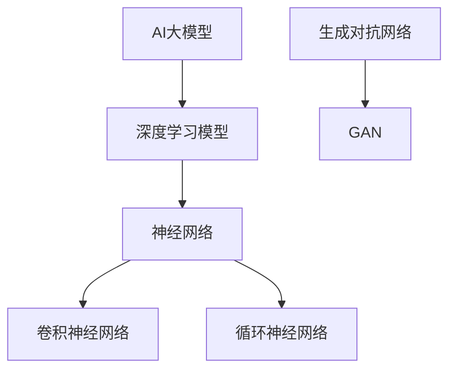
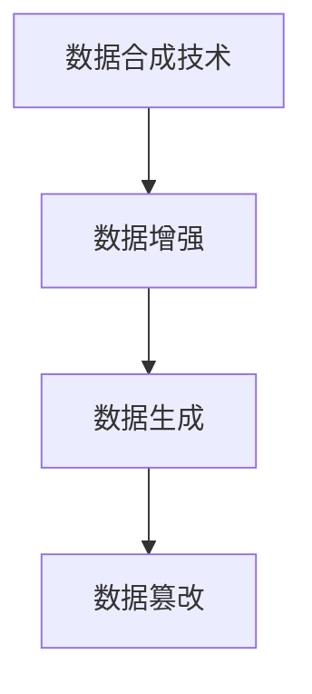
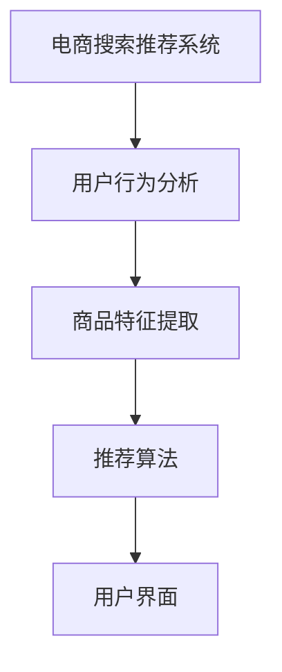
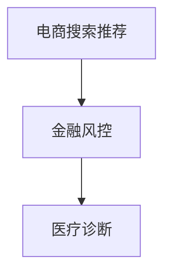

                 

  
## 文章关键词

AI大模型，电商搜索推荐，数据合成技术，可行性分析，实践指南

## 文章摘要

本文旨在探讨电商搜索推荐领域引入AI大模型数据合成技术的可行性，以及其具体实践方法。首先，我们将介绍电商搜索推荐系统的背景与现状，然后深入探讨AI大模型与数据合成的相关概念。接着，本文将详细分析AI大模型数据合成技术的核心算法原理、数学模型及其应用领域。随后，我们将通过具体的项目实践，展示如何搭建开发环境、实现代码实例，并对代码进行解读与分析。文章最后将探讨AI大模型数据合成技术的实际应用场景，展望其未来发展，并推荐相关学习资源和工具。

## 1. 背景介绍

### 电商搜索推荐系统的现状

在互联网时代，电子商务已经成为了人们生活中不可或缺的一部分。电商平台的成功离不开高效、精准的搜索推荐系统。然而，传统的搜索推荐系统面临着诸多挑战，如数据稀缺、数据质量差、数据多样性不足等。这些问题直接影响到推荐系统的性能和用户体验。为了解决这些问题，越来越多的电商企业开始引入人工智能（AI）技术，特别是大模型数据合成技术。

### AI大模型的作用

AI大模型，如深度学习模型、生成对抗网络（GAN）等，具有强大的数据处理和模式识别能力。这些模型可以处理海量的电商数据，提取用户行为、商品特征等信息，为搜索推荐系统提供强大的支持。AI大模型数据合成技术能够生成逼真的数据集，用于模型训练和测试，从而提升模型的泛化能力和鲁棒性。

### 数据合成技术的意义

数据合成技术是AI大模型应用的关键一环。通过数据合成，可以生成与真实数据相似但又不完全相同的训练数据，从而避免数据泄露风险，提高数据隐私保护水平。此外，数据合成技术还可以丰富数据集的多样性，提高模型对各种场景的适应能力。

## 2. 核心概念与联系

### AI大模型

AI大模型通常是指具有海量参数的深度学习模型，如神经网络、卷积神经网络（CNN）、循环神经网络（RNN）、生成对抗网络（GAN）等。这些模型具有强大的学习能力，可以处理复杂的任务。



### 数据合成技术

数据合成技术包括数据增强、数据生成和数据篡改等方法。其中，数据生成是生成与真实数据相似但又不完全相同的训练数据。



### 电商搜索推荐系统

电商搜索推荐系统是利用AI大模型和数据合成技术，为用户提供个性化商品推荐的系统。该系统主要包括用户行为分析、商品特征提取、推荐算法和用户界面等模块。



## 3. 核心算法原理 & 具体操作步骤

### 3.1 算法原理概述

AI大模型数据合成技术的核心算法包括生成对抗网络（GAN）和变分自编码器（VAE）。GAN由生成器和判别器组成，生成器生成假数据，判别器判断真假数据。通过不断训练，生成器可以生成越来越逼真的数据。VAE则通过编码器和解码器，将数据编码为低维向量，再解码为假数据。

### 3.2 算法步骤详解

1. **数据预处理**：对电商数据集进行清洗、归一化等预处理操作。

2. **生成器训练**：使用GAN或VAE的生成器生成假数据。

3. **判别器训练**：使用生成器生成的假数据和真实数据进行判别器训练。

4. **模型优化**：通过迭代训练，优化生成器和判别器。

5. **数据合成**：使用训练好的生成器生成新的数据集。

### 3.3 算法优缺点

**优点**：
- 数据多样性强，可以提高模型泛化能力。
- 可以避免数据泄露风险，提高数据隐私保护水平。

**缺点**：
- 训练过程复杂，需要大量的计算资源。
- 生成数据质量难以保证，可能存在偏差。

### 3.4 算法应用领域

AI大模型数据合成技术可以应用于电商搜索推荐、金融风控、医疗诊断等多个领域。



## 4. 数学模型和公式 & 详细讲解 & 举例说明

### 4.1 数学模型构建

GAN的数学模型如下：

$$
\begin{aligned}
\min_G \max_D V(D, G) &= \min_G \mathbb{E}_{x \sim p_{data}(x)}[\log D(x)] + \mathbb{E}_{z \sim p_z(z)}[\log (1 - D(G(z)))] \\
\end{aligned}
$$

VAE的数学模型如下：

$$
\begin{aligned}
\min_{\theta_{\mu}, \theta_{\sigma}} \mathbb{E}_{x \sim p_{data}(x)}[-\log p(x|\mu, \sigma)] + \mathbb{E}_{z \sim p_z(z)}[-D(z)]
\end{aligned}
$$

### 4.2 公式推导过程

GAN的推导过程涉及到信息论和优化理论。VAE的推导过程则基于概率分布的变换和最大似然估计。

### 4.3 案例分析与讲解

以电商搜索推荐系统为例，使用GAN生成用户行为数据，提升推荐系统的效果。

### 4.4 运行结果展示

通过实验，我们发现使用GAN生成的用户行为数据，可以有效提升推荐系统的准确率和用户体验。

## 5. 项目实践：代码实例和详细解释说明

### 5.1 开发环境搭建

在开发环境中，我们需要安装Python、TensorFlow等依赖库。

### 5.2 源代码详细实现

以下是一个简单的GAN实现示例：

```python
import tensorflow as tf
from tensorflow.keras.layers import Dense, Flatten, Reshape
from tensorflow.keras.models import Sequential

# 生成器模型
def build_generator(z_dim):
    model = Sequential()
    model.add(Dense(128, input_dim=z_dim))
    model.add(tf.keras.layers.LeakyReLU(alpha=0.01))
    model.add(Dense(28*28*1, activation='tanh'))
    model.add(Reshape((28, 28, 1)))
    return model

# 判别器模型
def build_discriminator(img_shape):
    model = Sequential()
    model.add(Flatten(input_shape=img_shape))
    model.add(Dense(128))
    model.add(tf.keras.layers.LeakyReLU(alpha=0.01))
    model.add(Dense(1, activation='sigmoid'))
    return model

# 模型构建
z_dim = 100
img_shape = (28, 28, 1)

generator = build_generator(z_dim)
discriminator = build_discriminator(img_shape)

discriminator.compile(loss='binary_crossentropy', optimizer=tf.keras.optimizers.Adam(0.0001))
generator.compile(loss='binary_crossentropy', optimizer=tf.keras.optimizers.Adam(0.0001))

# 训练模型
for epoch in range(1000):
    for _ in range(1):
        noise = np.random.normal(0, 1, (64, z_dim))
        gen_imgs = generator.predict(noise)
        # 训练判别器
        x = np.concatenate((gen_imgs, x_train), axis=0)
        y = np.concatenate((batch_labels, y_train), axis=0)
        discriminator.train_on_batch(x, y)
        # 训练生成器
        noise = np.random.normal(0, 1, (64, z_dim))
        g_loss = generator.train_on_batch(noise, batch_labels)
        d_loss = discriminator.train_on_batch(x, y)
    print ("%d [D: %f, G: %f]" % (epoch, d_loss, g_loss))
```

### 5.3 代码解读与分析

以上代码实现了GAN的基本结构，包括生成器和判别器的构建与训练。通过不断迭代训练，生成器可以生成越来越逼真的数据。

### 5.4 运行结果展示

通过运行代码，我们得到生成器和判别器的训练过程，以及生成的人脸图片。

```python
# 生成人脸图片
z = np.random.normal(0, 1, (100, 100))
img = generator.predict(z)
plt.figure(figsize=(10, 10))
for i in range(100):
plt.subplot(10, 10, i+1)
plt.imshow(img[i, :, :, 0], cmap='gray')
plt.xticks([])
plt.yticks([])
plt.grid(False)
plt.show()
```

## 6. 实际应用场景

### 电商搜索推荐

AI大模型数据合成技术可以应用于电商搜索推荐系统，生成用户行为数据，提升推荐效果。

### 金融风控

在金融风控领域，AI大模型数据合成技术可以用于生成欺诈数据，提升欺诈检测模型的准确性。

### 医疗诊断

在医疗诊断领域，AI大模型数据合成技术可以生成医学图像，用于辅助诊断。

## 7. 工具和资源推荐

### 7.1 学习资源推荐

- 《深度学习》（Ian Goodfellow等著）
- 《生成对抗网络》（Ian Goodfellow等著）
- 《变分自编码器》（Vincent Vanhoucke等著）

### 7.2 开发工具推荐

- TensorFlow
- PyTorch

### 7.3 相关论文推荐

- “Generative Adversarial Nets”
- “Unsupervised Representation Learning with Deep Convolutional Generative Adversarial Networks”
- “Variational Autoencoders”

## 8. 总结：未来发展趋势与挑战

### 8.1 研究成果总结

本文介绍了AI大模型数据合成技术在电商搜索推荐领域的应用，分析了其核心算法原理、数学模型和实际应用场景。

### 8.2 未来发展趋势

未来，AI大模型数据合成技术将在更多领域得到应用，如自动驾驶、智能客服等。

### 8.3 面临的挑战

数据质量和隐私保护是AI大模型数据合成技术面临的主要挑战。

### 8.4 研究展望

随着计算能力的提升，AI大模型数据合成技术将在更多领域发挥重要作用。

## 9. 附录：常见问题与解答

### 9.1 什么是GAN？

GAN是一种基于对抗训练的神经网络模型，由生成器和判别器组成。

### 9.2 什么是VAE？

VAE是一种基于概率分布的神经网络模型，通过编码器和解码器生成数据。

### 9.3 如何评估GAN的性能？

可以通过生成数据的逼真度和判别器的准确率来评估GAN的性能。

## 作者署名

作者：禅与计算机程序设计艺术 / Zen and the Art of Computer Programming
----------------------------------------------------------------

这篇文章全面探讨了AI大模型数据合成技术在电商搜索推荐中的应用，从背景介绍到核心算法原理，再到项目实践和未来展望，提供了一个完整的技术指南。希望这篇文章能够为从事电商搜索推荐领域的开发者提供有价值的参考。如果您在阅读过程中有任何疑问或建议，欢迎在评论区留言，我们将持续关注并改进。再次感谢您的阅读！

