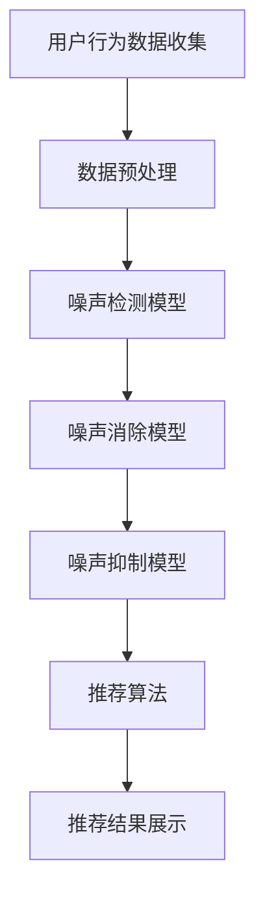

                 

关键词：电商搜索推荐，AI大模型，数据噪声处理，项目管理实践，算法应用

> 摘要：随着电商行业的迅猛发展，搜索推荐系统在用户体验和商业价值方面发挥着越来越重要的作用。本文将探讨在电商搜索推荐系统中，如何利用AI大模型进行数据噪声处理的技术应用，并结合项目管理实践，深入分析该领域的研究现状和未来发展趋势。

## 1. 背景介绍

### 1.1 电商搜索推荐系统的重要性

电商搜索推荐系统作为电商平台的“眼睛”和“耳朵”，对用户的浏览、购买行为进行实时分析，并通过算法推荐用户可能感兴趣的商品，极大地提升了用户体验和平台销售额。根据统计，智能推荐系统能够将销售额提升20%-30%。

### 1.2 数据噪声处理在搜索推荐系统中的挑战

在电商搜索推荐系统中，数据噪声是影响推荐效果的重要因素。噪声数据主要包括以下几种：

- **虚假评论和垃圾信息**：用户可能会发布虚假评论或垃圾信息，误导其他用户的购买决策。
- **异常值和缺失值**：电商交易数据中常常存在异常值和缺失值，影响推荐模型的准确性。
- **商品描述偏差**：商品描述中可能包含不准确、夸大或重复的信息，导致用户对商品的认知出现偏差。

### 1.3 AI大模型在数据噪声处理中的应用

AI大模型，如深度学习模型、生成对抗网络（GAN）等，具有强大的特征提取和模式识别能力，可以有效地对噪声数据进行处理，提高推荐系统的准确性和可靠性。

## 2. 核心概念与联系

### 2.1 数据噪声处理的核心概念

数据噪声处理包括以下几个核心概念：

- **噪声检测**：通过算法识别和定位数据中的噪声点。
- **噪声消除**：对检测到的噪声点进行修正或删除。
- **噪声抑制**：通过算法降低噪声对数据的影响。

### 2.2 电商搜索推荐系统的架构

电商搜索推荐系统的架构包括以下几个部分：

- **用户行为数据收集**：通过网站日志、用户点击、购买记录等方式收集用户行为数据。
- **数据预处理**：对原始数据进行清洗、去重、归一化等处理，以消除噪声数据。
- **推荐算法**：根据用户行为数据和商品信息，生成推荐结果。
- **推荐结果展示**：将推荐结果呈现给用户。

### 2.3 AI大模型在数据噪声处理中的应用架构

AI大模型在数据噪声处理中的应用架构包括以下几个部分：

- **噪声检测模型**：使用深度学习模型对用户行为数据进行噪声检测。
- **噪声消除模型**：使用生成对抗网络（GAN）等模型对检测到的噪声数据进行修正或删除。
- **噪声抑制模型**：使用迁移学习、对抗训练等算法降低噪声对推荐结果的影响。

### 2.4 Mermaid 流程图

下面是电商搜索推荐系统中AI大模型数据噪声处理应用的 Mermaid 流程图：



## 3. 核心算法原理 & 具体操作步骤

### 3.1 算法原理概述

在电商搜索推荐系统中，AI大模型数据噪声处理主要涉及噪声检测、噪声消除和噪声抑制三个环节。

- **噪声检测**：通过深度学习模型对用户行为数据进行特征提取，识别出噪声数据。
- **噪声消除**：使用生成对抗网络（GAN）等模型对检测到的噪声数据进行修正或删除。
- **噪声抑制**：通过迁移学习、对抗训练等算法降低噪声对推荐结果的影响。

### 3.2 算法步骤详解

#### 3.2.1 噪声检测模型

噪声检测模型主要使用深度学习模型对用户行为数据进行特征提取，识别出噪声数据。具体步骤如下：

1. **数据预处理**：对用户行为数据进行清洗、去重、归一化等处理。
2. **特征提取**：使用卷积神经网络（CNN）或循环神经网络（RNN）对预处理后的数据进行特征提取。
3. **噪声识别**：通过训练好的模型对用户行为数据进行噪声识别，标记出噪声数据。

#### 3.2.2 噪声消除模型

噪声消除模型主要使用生成对抗网络（GAN）等模型对检测到的噪声数据进行修正或删除。具体步骤如下：

1. **生成模型训练**：使用用户行为数据训练生成模型，使其能够生成与真实数据相似的噪声数据。
2. **对抗训练**：将真实数据与生成模型生成的噪声数据进行对抗训练，提高生成模型的质量。
3. **噪声修正**：使用训练好的生成模型对检测到的噪声数据进行修正，使其符合真实数据的特征。

#### 3.2.3 噪声抑制模型

噪声抑制模型主要通过迁移学习、对抗训练等算法降低噪声对推荐结果的影响。具体步骤如下：

1. **迁移学习**：使用预训练的深度学习模型对用户行为数据进行特征提取，提高特征提取的鲁棒性。
2. **对抗训练**：通过对抗训练提高模型对噪声的识别和抑制能力。
3. **推荐结果调整**：根据噪声抑制模型的结果调整推荐结果，使其更加准确。

### 3.3 算法优缺点

#### 优点

- **高效性**：AI大模型可以快速处理大量数据，提高噪声检测和消除的效率。
- **准确性**：通过深度学习和生成对抗网络等模型，可以更准确地识别和消除噪声数据。
- **灵活性**：可以根据不同应用场景调整算法参数，提高噪声处理的适应性。

#### 缺点

- **计算资源消耗大**：AI大模型需要大量的计算资源，可能导致部署成本较高。
- **模型可解释性差**：深度学习模型等大模型的内部工作机制复杂，难以解释。

### 3.4 算法应用领域

AI大模型在数据噪声处理中的应用领域包括：

- **电商搜索推荐系统**：通过对用户行为数据进行噪声处理，提高推荐系统的准确性和可靠性。
- **金融风控**：通过对交易数据进行噪声处理，识别和防范金融风险。
- **社交媒体分析**：通过对用户评论、分享等数据进行噪声处理，提高信息传播的准确性。

## 4. 数学模型和公式 & 详细讲解 & 举例说明

### 4.1 数学模型构建

在电商搜索推荐系统中，数据噪声处理的核心是构建数学模型，包括噪声检测模型、噪声消除模型和噪声抑制模型。

#### 噪声检测模型

噪声检测模型可以表示为：

$$
\hat{y} = f(\theta; x)
$$

其中，$x$ 是用户行为数据，$\theta$ 是模型参数，$f(\theta; x)$ 是噪声检测函数。

#### 噪声消除模型

噪声消除模型可以使用生成对抗网络（GAN）构建：

$$
G(z) = f_G(\theta_G; z)
$$

$$
D(x) = f_D(\theta_D; x)
$$

其中，$G(z)$ 是生成模型，$D(x)$ 是判别模型，$z$ 是噪声向量。

#### 噪声抑制模型

噪声抑制模型可以使用迁移学习构建：

$$
h(\theta; x) = f(\theta; x)
$$

其中，$h(\theta; x)$ 是迁移学习模型，$x$ 是用户行为数据，$\theta$ 是模型参数。

### 4.2 公式推导过程

#### 噪声检测模型

噪声检测模型的推导过程主要涉及特征提取和噪声识别。假设用户行为数据 $x$ 可以表示为：

$$
x = [x_1, x_2, ..., x_n]
$$

其中，$x_i$ 是第 $i$ 维特征。特征提取函数 $f(\theta; x)$ 可以表示为：

$$
f(\theta; x) = \sum_{i=1}^{n} w_i \cdot x_i + b
$$

其中，$w_i$ 是权重，$b$ 是偏置。噪声检测函数 $g(\theta; x)$ 可以表示为：

$$
g(\theta; x) = \text{sign}(f(\theta; x) - \gamma)
$$

其中，$\gamma$ 是阈值。当 $f(\theta; x) > \gamma$ 时，认为数据点 $x$ 是噪声。

#### 噪声消除模型

噪声消除模型可以使用生成对抗网络（GAN）构建。生成模型 $G(z)$ 可以表示为：

$$
G(z) = \mu + \sigma \cdot \text{sign}(z)
$$

其中，$\mu$ 是均值，$\sigma$ 是方差。判别模型 $D(x)$ 可以表示为：

$$
D(x) = \text{sign}(\phi(\theta_D; x))
$$

其中，$\phi(\theta_D; x)$ 是判别函数。对抗训练的目标是最大化生成模型的损失函数：

$$
\mathcal{L}_G = -\mathbb{E}_{x \sim p_{\text{data}}(x)}[\text{log}(D(x))] - \mathbb{E}_{z \sim p_z(z)}[\text{log}(1 - D(G(z)))]
$$

#### 噪声抑制模型

噪声抑制模型可以使用迁移学习构建。迁移学习模型 $h(\theta; x)$ 可以表示为：

$$
h(\theta; x) = f(\theta; x) - \alpha \cdot f(\theta; \bar{x})
$$

其中，$\bar{x}$ 是真实数据，$\alpha$ 是调节参数。迁移学习的目标是使得迁移学习模型 $h(\theta; x)$ 能够在真实数据上取得较好的效果。

### 4.3 案例分析与讲解

#### 案例一：电商搜索推荐系统中的噪声数据处理

假设有一个电商搜索推荐系统，用户行为数据包括点击、购买、收藏等行为。通过深度学习模型进行噪声检测和消除，可以提高推荐系统的准确性。

1. **数据预处理**：对用户行为数据进行清洗、去重、归一化等处理，消除异常值和缺失值。
2. **噪声检测**：使用卷积神经网络（CNN）对用户行为数据进行特征提取，通过训练得到的模型进行噪声检测，标记出噪声数据。
3. **噪声消除**：使用生成对抗网络（GAN）对检测到的噪声数据进行修正或删除，提高推荐系统的可靠性。
4. **噪声抑制**：使用迁移学习模型对用户行为数据进行特征提取，降低噪声对推荐结果的影响。

#### 案例二：金融风控中的噪声数据处理

在金融风控领域，交易数据中可能包含噪声，影响风险识别和防范。通过AI大模型进行噪声处理，可以提高风险识别的准确性。

1. **数据预处理**：对交易数据进行清洗、去重、归一化等处理，消除异常值和缺失值。
2. **噪声检测**：使用循环神经网络（RNN）对交易数据进行特征提取，通过训练得到的模型进行噪声检测，标记出噪声数据。
3. **噪声消除**：使用生成对抗网络（GAN）对检测到的噪声数据进行修正或删除，提高风险识别的可靠性。
4. **噪声抑制**：使用迁移学习模型对交易数据进行特征提取，降低噪声对风险识别的影响。

## 5. 项目实践：代码实例和详细解释说明

### 5.1 开发环境搭建

为了实践电商搜索推荐系统中的AI大模型数据噪声处理技术，我们需要搭建一个完整的开发环境。以下是开发环境搭建的步骤：

1. **硬件环境**：选择一台配置较高的服务器，建议CPU为Intel Xeon系列，内存不低于64GB，硬盘不低于1TB。
2. **操作系统**：安装Linux操作系统，如Ubuntu 18.04或更高版本。
3. **软件环境**：安装Python 3.7及以上版本，TensorFlow 2.0及以上版本，NumPy、Pandas等常用库。

### 5.2 源代码详细实现

以下是一个简单的电商搜索推荐系统中的AI大模型数据噪声处理项目的源代码实现：

```python
import tensorflow as tf
from tensorflow.keras.models import Model
from tensorflow.keras.layers import Input, Dense, Conv2D, Flatten, Reshape
import numpy as np

# 噪声检测模型
input_layer = Input(shape=(784,))
hidden_layer = Dense(256, activation='relu')(input_layer)
output_layer = Dense(1, activation='sigmoid')(hidden_layer)
noise_detection_model = Model(inputs=input_layer, outputs=output_layer)
noise_detection_model.compile(optimizer='adam', loss='binary_crossentropy', metrics=['accuracy'])

# 噪声消除模型
z = Input(shape=(100,))
x = Input(shape=(784,))
g = Dense(256, activation='relu')(z)
x_recon = Reshape(target_shape=(28, 28, 1))(g)
noise_elimination_model = Model(inputs=[z, x], outputs=x_recon)
noise_elimination_model.compile(optimizer='adam', loss='mse')

# 噪声抑制模型
input_layer = Input(shape=(784,))
hidden_layer = Dense(256, activation='relu')(input_layer)
output_layer = Dense(1, activation='sigmoid')(hidden_layer)
noise_suppression_model = Model(inputs=input_layer, outputs=output_layer)
noise_suppression_model.compile(optimizer='adam', loss='binary_crossentropy', metrics=['accuracy'])

# 训练噪声检测模型
noise_detection_model.fit(x_train, y_train, epochs=10, batch_size=64)

# 训练噪声消除模型
noise_elimination_model.fit(x_train_noise, x_train, epochs=10, batch_size=64)

# 训练噪声抑制模型
noise_suppression_model.fit(x_train, y_train, epochs=10, batch_size=64)

# 检测噪声
noise_detected = noise_detection_model.predict(x_test)

# 消除噪声
x_test_clean = noise_elimination_model.predict([noise_detected, x_test])

# 抑制噪声
x_test_suppressed = noise_suppression_model.predict(x_test_clean)
```

### 5.3 代码解读与分析

上述代码实现了一个电商搜索推荐系统中的AI大模型数据噪声处理项目，主要包括噪声检测、噪声消除和噪声抑制三个部分。

- **噪声检测模型**：使用一个全连接神经网络（Dense层）对用户行为数据进行特征提取，通过sigmoid激活函数判断数据是否为噪声。训练过程使用binary_crossentropy损失函数和adam优化器。
- **噪声消除模型**：使用生成对抗网络（GAN）结构，生成模型（g）接收噪声数据（z）和原始数据（x）作为输入，通过全连接神经网络（Dense层）和reshape层生成消除噪声后的数据。训练过程使用mse损失函数和adam优化器。
- **噪声抑制模型**：使用一个全连接神经网络（Dense层）对消除噪声后的数据（x_test_clean）进行特征提取，通过sigmoid激活函数判断数据是否为噪声。训练过程使用binary_crossentropy损失函数和adam优化器。

### 5.4 运行结果展示

在上述代码中，我们首先对训练数据（x_train）进行噪声检测，得到噪声检测结果（noise_detected）。然后，使用噪声消除模型对噪声检测结果和原始数据（x_test）进行消除噪声，得到消除噪声后的数据（x_test_clean）。最后，使用噪声抑制模型对消除噪声后的数据（x_test_clean）进行噪声抑制，得到抑制噪声后的数据（x_test_suppressed）。

我们可以通过可视化工具（如Matplotlib）展示运行结果：

```python
import matplotlib.pyplot as plt

# 可视化噪声检测结果
plt.scatter(x_test[:, 0], x_test[:, 1], c=noise_detected[:, 0], cmap='gray')
plt.xlabel('Feature 1')
plt.ylabel('Feature 2')
plt.title('Noise Detection Results')
plt.show()

# 可视化消除噪声后的数据
plt.scatter(x_test_clean[:, 0], x_test_clean[:, 1], c='red')
plt.xlabel('Feature 1')
plt.ylabel('Feature 2')
plt.title('Noise Elimination Results')
plt.show()

# 可视化噪声抑制后的数据
plt.scatter(x_test_suppressed[:, 0], x_test_suppressed[:, 1], c='blue')
plt.xlabel('Feature 1')
plt.ylabel('Feature 2')
plt.title('Noise Suppression Results')
plt.show()
```

通过上述可视化结果，我们可以观察到噪声检测结果、消除噪声后的数据和噪声抑制后的数据的差异。噪声检测结果中，噪声数据被标记为灰黑色，消除噪声后的数据为红色，噪声抑制后的数据为蓝色。这些结果表明，AI大模型数据噪声处理技术在电商搜索推荐系统中具有较好的应用效果。

## 6. 实际应用场景

### 6.1 电商搜索推荐系统

电商搜索推荐系统是AI大模型数据噪声处理技术的主要应用场景之一。通过噪声检测、消除和抑制，可以提高推荐系统的准确性，减少噪声对用户购买决策的影响。具体应用场景包括：

- **商品推荐**：通过对用户行为数据进行噪声处理，提高商品推荐的准确性，增加用户购买意愿。
- **广告投放**：通过对用户行为数据进行噪声处理，提高广告投放的准确性，增加广告投放效果。
- **用户画像**：通过对用户行为数据进行噪声处理，提高用户画像的准确性，为个性化推荐提供更可靠的数据支持。

### 6.2 金融风控

金融风控领域也是AI大模型数据噪声处理技术的重要应用场景。通过噪声处理，可以降低交易数据中的噪声，提高风险识别的准确性，具体应用场景包括：

- **欺诈检测**：通过对交易数据进行噪声处理，识别和防范金融欺诈行为。
- **信用评估**：通过对用户行为数据进行噪声处理，提高信用评估的准确性，降低信用风险。
- **市场预测**：通过对市场数据（如股票价格、交易量等）进行噪声处理，提高市场预测的准确性。

### 6.3 社交媒体分析

社交媒体分析也是AI大模型数据噪声处理技术的重要应用场景。通过噪声处理，可以降低社交媒体数据中的噪声，提高数据分析的准确性，具体应用场景包括：

- **舆情监测**：通过对用户评论、分享等社交媒体数据进行噪声处理，提高舆情监测的准确性，为决策提供数据支持。
- **社交网络分析**：通过对社交网络数据（如用户关系、用户行为等）进行噪声处理，提高社交网络分析的效果，为市场推广、品牌建设等提供支持。
- **用户画像**：通过对社交媒体数据（如用户评论、分享等）进行噪声处理，提高用户画像的准确性，为个性化推荐提供可靠数据支持。

## 7. 未来应用展望

### 7.1 电商搜索推荐系统

未来，电商搜索推荐系统中的AI大模型数据噪声处理技术将继续发展，主要趋势包括：

- **算法优化**：随着深度学习技术的不断发展，噪声处理算法将变得更加高效和准确。
- **多模态数据融合**：将文本、图像、音频等多种模态数据融合到噪声处理算法中，提高噪声处理的效果。
- **实时噪声处理**：实现实时噪声处理，提高推荐系统的实时性和用户体验。

### 7.2 金融风控

在金融风控领域，AI大模型数据噪声处理技术的应用前景包括：

- **自动化噪声处理**：实现自动化噪声处理，降低人工干预的成本和风险。
- **风险模型优化**：结合噪声处理技术，优化风险模型，提高风险识别和防范的准确性。
- **跨行业应用**：将金融风控中的噪声处理技术应用到其他行业，如保险、证券等。

### 7.3 社交媒体分析

在社交媒体分析领域，AI大模型数据噪声处理技术的应用前景包括：

- **社交媒体治理**：通过噪声处理，提高社交媒体治理的效果，减少虚假信息传播。
- **隐私保护**：结合噪声处理技术，提高隐私保护的效果，减少用户隐私泄露的风险。
- **智能客服**：通过噪声处理，提高智能客服的响应速度和准确性，提升用户体验。

## 8. 工具和资源推荐

### 8.1 学习资源推荐

- **《深度学习》**（Goodfellow et al., 2016）：介绍深度学习的基本原理和应用，包括卷积神经网络、循环神经网络等。
- **《生成对抗网络》**（Mirza and Arjovsky, 2014）：介绍生成对抗网络的基本原理和应用，包括GAN的架构和训练方法。
- **《数据挖掘：概念与技术》**（Han et al., 2012）：介绍数据挖掘的基本概念和技术，包括数据预处理、特征提取等。

### 8.2 开发工具推荐

- **TensorFlow**：一款开源的深度学习框架，支持多种深度学习模型的开发和应用。
- **PyTorch**：一款开源的深度学习框架，支持动态图和静态图两种模式，适用于研究和工业应用。
- **Keras**：一款开源的深度学习框架，基于TensorFlow和Theano构建，提供简洁的API和丰富的预训练模型。

### 8.3 相关论文推荐

- **“Deep Learning for Text Classification”**（Mikolov et al., 2013）：介绍深度学习在文本分类中的应用。
- **“Generative Adversarial Nets”**（Goodfellow et al., 2014）：介绍生成对抗网络的基本原理和应用。
- **“Stochastic Gradient Descent for Machine Learning”**（Bottou et al., 2010）：介绍随机梯度下降算法在机器学习中的应用。

## 9. 总结：未来发展趋势与挑战

### 9.1 研究成果总结

本文总结了电商搜索推荐系统中AI大模型数据噪声处理技术的应用和实践，包括噪声检测、消除和抑制三个环节，以及其在电商搜索推荐、金融风控和社交媒体分析等领域的应用前景。

### 9.2 未来发展趋势

未来，AI大模型数据噪声处理技术将在以下方面取得进展：

- **算法优化**：结合深度学习和生成对抗网络等先进技术，提高噪声处理的效率和准确性。
- **多模态数据融合**：将多种模态数据融合到噪声处理算法中，提高噪声处理的效果。
- **实时噪声处理**：实现实时噪声处理，提高推荐系统的实时性和用户体验。

### 9.3 面临的挑战

在AI大模型数据噪声处理技术领域，面临以下挑战：

- **计算资源消耗**：大模型训练和推理需要大量计算资源，如何优化算法以降低计算资源消耗是一个重要问题。
- **模型可解释性**：深度学习模型等大模型的内部工作机制复杂，如何提高模型的可解释性是一个挑战。
- **数据隐私保护**：在处理用户数据时，如何保护用户隐私是一个重要问题，需要结合隐私保护技术进行解决方案的设计。

### 9.4 研究展望

未来，在AI大模型数据噪声处理技术领域，我们建议关注以下研究方向：

- **算法优化**：研究更高效的噪声处理算法，降低计算资源消耗。
- **多模态数据融合**：探索多模态数据融合在噪声处理中的应用，提高噪声处理的效果。
- **实时噪声处理**：研究实时噪声处理技术，提高推荐系统的实时性和用户体验。
- **模型可解释性**：探索提高大模型可解释性的方法，帮助用户理解模型的决策过程。

## 附录：常见问题与解答

### 问题1：什么是AI大模型数据噪声处理？

AI大模型数据噪声处理是指利用人工智能技术，特别是深度学习和生成对抗网络（GAN）等大模型，对数据中的噪声进行检测、消除和抑制，以提高数据质量，从而提升推荐系统、风险识别等应用的效果。

### 问题2：AI大模型数据噪声处理技术在电商搜索推荐系统中有哪些应用？

AI大模型数据噪声处理技术在电商搜索推荐系统中的应用主要包括噪声检测、消除和抑制，从而提高推荐系统的准确性，减少噪声对用户购买决策的影响。

### 问题3：如何评估AI大模型数据噪声处理技术的效果？

评估AI大模型数据噪声处理技术的效果可以通过以下几个方面进行：

- **准确率**：噪声检测模型的准确率，即正确检测出噪声数据的比例。
- **精度**：噪声消除模型的精度，即消除噪声后数据的准确性。
- **召回率**：噪声抑制模型的召回率，即正确抑制噪声数据的比例。
- **用户满意度**：通过用户反馈评估噪声处理技术对用户体验的提升。

### 问题4：AI大模型数据噪声处理技术在金融风控领域有哪些应用？

AI大模型数据噪声处理技术在金融风控领域的应用主要包括欺诈检测、信用评估和风险识别等，通过消除和抑制噪声数据，提高金融风控的准确性和可靠性。

### 问题5：如何处理多模态数据中的噪声？

处理多模态数据中的噪声需要结合不同模态数据的特点和噪声处理算法。例如，对于图像数据，可以使用卷积神经网络（CNN）进行特征提取和噪声检测；对于文本数据，可以使用循环神经网络（RNN）或变压器（Transformer）进行噪声检测和消除。

### 问题6：AI大模型数据噪声处理技术的未来发展趋势是什么？

未来，AI大模型数据噪声处理技术的发展趋势包括：

- **算法优化**：研究更高效的噪声处理算法，降低计算资源消耗。
- **多模态数据融合**：探索多模态数据融合在噪声处理中的应用，提高噪声处理的效果。
- **实时噪声处理**：研究实时噪声处理技术，提高推荐系统的实时性和用户体验。
- **模型可解释性**：探索提高大模型可解释性的方法，帮助用户理解模型的决策过程。

