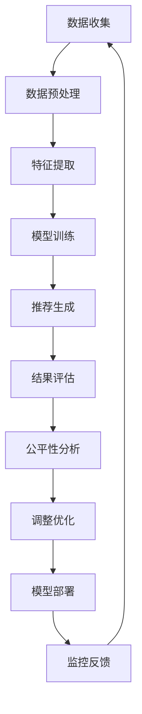

                 

关键词：电商搜索推荐、AI大模型、公平性评估、工具选型、应用实践

> 摘要：本文旨在探讨电商搜索推荐系统中的AI大模型公平性评估工具选型与应用实践。文章首先介绍了电商搜索推荐系统的背景和重要性，随后深入分析了AI大模型在其中的应用，并提出了评估模型公平性的关键指标。接着，本文详细介绍了当前主流的AI大模型公平性评估工具，包括其原理、特点和应用场景，并通过具体案例分析展示了这些工具的实际应用效果。最后，文章展望了AI大模型公平性评估工具的发展趋势和未来挑战，为相关领域的研究和实践提供了有价值的参考。

## 1. 背景介绍

电商搜索推荐系统是电子商务领域的重要组成部分，它通过分析用户的浏览历史、购买行为等数据，为用户提供个性化的商品推荐，从而提高用户的购物体验和商家销售额。随着人工智能技术的快速发展，尤其是深度学习技术的广泛应用，AI大模型在电商搜索推荐系统中得到了广泛应用，其准确性和效果得到了显著提升。

然而，AI大模型的应用也带来了新的挑战。一方面，模型的训练过程可能会引入偏差，导致推荐结果对不同用户群体存在不公平性。例如，性别、年龄、地域等因素都可能影响推荐结果的公平性。另一方面，电商搜索推荐系统涉及到商业利益，模型的不公平性可能被恶意利用，损害用户权益。

因此，对AI大模型进行公平性评估变得尤为重要。公平性评估旨在确保模型对用户群体的公平性，避免因模型偏差导致的不公平推荐。这不仅是商业合规的要求，更是社会责任的体现。

本文旨在探讨电商搜索推荐效果评估中的AI大模型公平性评估工具选型与应用实践。文章首先介绍了电商搜索推荐系统的基本概念和原理，然后分析了AI大模型在其中的应用及其公平性评估的重要性。接下来，本文将详细介绍当前主流的AI大模型公平性评估工具，包括其原理、特点和具体应用场景。最后，通过具体案例分析，本文将展示这些工具在实际应用中的效果，并展望未来AI大模型公平性评估工具的发展趋势和面临的挑战。

## 2. 核心概念与联系

为了深入理解AI大模型公平性评估，我们首先需要明确几个核心概念：电商搜索推荐系统、AI大模型、公平性评估。

### 2.1 电商搜索推荐系统

电商搜索推荐系统是基于用户行为数据和商品特征信息，通过算法模型为用户推荐可能感兴趣的商品。其核心目的是提高用户的购物体验和商家的销售转化率。电商搜索推荐系统通常包括以下几个关键组成部分：

- **用户数据收集**：通过用户的浏览记录、购买历史、评价等数据，收集用户的偏好信息。
- **商品特征提取**：对商品的各种属性进行提取，如价格、品牌、品类等。
- **推荐算法模型**：使用机器学习算法，如协同过滤、深度学习等，构建推荐模型。
- **推荐结果生成**：根据用户数据和商品特征，生成个性化的推荐结果。

### 2.2 AI大模型

AI大模型，即大型的人工智能模型，通常具有以下几个特点：

- **规模巨大**：AI大模型通常由数十亿到数万亿个参数组成，能够处理海量数据。
- **深度学习**：AI大模型通常采用深度学习架构，如卷积神经网络（CNN）、循环神经网络（RNN）和Transformer等，能够学习复杂的特征和模式。
- **高精度**：由于模型规模大，AI大模型能够实现非常高的预测精度和推荐效果。

### 2.3 公平性评估

公平性评估旨在确保AI大模型在推荐过程中对用户群体的公平性。具体来说，公平性评估关注以下几个方面：

- **无偏性**：模型结果不应受到性别、年龄、地域等用户特征的影响。
- **一致性**：不同用户群体在相同条件下应获得类似的推荐结果。
- **透明性**：模型决策过程和结果应具有可解释性，以便用户和监管机构理解。

### 2.4 Mermaid 流程图

下面是AI大模型公平性评估的Mermaid流程图，展示了从数据收集到结果评估的整个过程：



- **A 数据收集**：从各种数据源（如日志、数据库等）收集用户行为和商品特征数据。
- **B 数据预处理**：清洗、归一化和编码数据，以适合模型训练。
- **C 特征提取**：提取用户和商品的关键特征，如用户浏览历史、商品属性等。
- **D 模型训练**：使用训练数据训练AI大模型，通常采用深度学习算法。
- **E 推荐生成**：使用训练好的模型为用户生成个性化推荐结果。
- **F 结果评估**：评估推荐结果的准确性和用户满意度。
- **G 公平性分析**：分析推荐结果对不同用户群体的公平性。
- **H 调整优化**：根据公平性分析结果，调整模型参数或特征工程，提高模型的公平性。
- **I 模型部署**：将优化后的模型部署到生产环境中，供用户使用。
- **J 监控反馈**：监控模型的实际运行效果，收集用户反馈，为后续优化提供依据。

通过这个流程，我们可以全面了解AI大模型在电商搜索推荐系统中的应用及其公平性评估的重要性。接下来，我们将详细介绍AI大模型公平性评估的具体方法和工具。

## 3. 核心算法原理 & 具体操作步骤

### 3.1 算法原理概述

AI大模型公平性评估的核心目的是确保模型在推荐过程中对用户群体的公平性，避免因模型偏差导致的不公平推荐。为了实现这一目标，我们需要从多个角度对模型进行评估和优化。

首先，我们需要定义公平性评估的指标。常见的公平性评估指标包括：

- **均衡性指标**：如基尼系数、泰尔指数等，用于衡量模型对不同用户群体的偏好分布的均衡程度。
- **偏差指标**：如偏见指数、公平性得分等，用于衡量模型在推荐结果中对特定用户群体的偏见程度。
- **公平性评分**：如F1分数、精确率、召回率等，用于衡量模型在推荐结果中的整体公平性。

其次，我们需要设计评估算法。常见的评估算法包括：

- **统计测试**：如独立样本t检验、卡方检验等，用于检测模型在不同用户群体之间的差异。
- **模型调整**：通过调整模型参数或特征工程，减少模型偏见，提高公平性。

最后，我们需要实现评估流程。评估流程通常包括以下几个步骤：

1. **数据收集与预处理**：收集用户行为和商品特征数据，进行数据清洗、归一化和编码。
2. **模型训练与预测**：使用训练数据训练AI大模型，并对测试数据进行预测。
3. **结果评估**：使用公平性评估指标对推荐结果进行评估，识别模型偏见。
4. **模型优化**：根据评估结果，调整模型参数或特征工程，优化模型的公平性。
5. **部署与监控**：将优化后的模型部署到生产环境中，并进行实时监控和反馈。

### 3.2 算法步骤详解

下面我们将详细讲解AI大模型公平性评估的具体操作步骤。

#### 3.2.1 数据收集与预处理

数据收集是公平性评估的基础。我们需要从电商平台的日志、数据库等渠道收集用户行为和商品特征数据。常见的数据包括：

- 用户特征：如性别、年龄、地域、购买历史等。
- 商品特征：如价格、品牌、品类、库存等。

收集到的数据需要进行预处理，包括以下步骤：

1. **数据清洗**：删除重复数据、缺失值填充、异常值处理等。
2. **数据归一化**：将不同特征的数据进行归一化处理，使其处于同一量级。
3. **数据编码**：将类别型数据转换为数值型数据，如使用独热编码（One-Hot Encoding）。

#### 3.2.2 模型训练与预测

使用预处理后的数据，我们接下来进行模型训练与预测。具体步骤如下：

1. **数据划分**：将数据集划分为训练集、验证集和测试集，用于模型训练、验证和评估。
2. **模型训练**：使用训练集数据训练AI大模型，如使用深度学习算法训练推荐模型。
3. **模型预测**：使用训练好的模型对测试集数据进行预测，生成推荐结果。

#### 3.2.3 结果评估

在得到推荐结果后，我们需要使用公平性评估指标对其进行评估。具体步骤如下：

1. **计算指标**：使用均衡性指标、偏差指标和公平性评分等指标，对推荐结果进行计算。
2. **分析结果**：分析评估结果，识别模型偏见，如某些用户群体受到不公平对待。
3. **可视化展示**：使用图表和可视化工具，展示评估结果和模型偏见。

#### 3.2.4 模型优化

根据评估结果，我们接下来对模型进行优化，以减少偏见，提高公平性。具体步骤如下：

1. **特征调整**：调整特征权重，增加对偏见较大的特征的惩罚力度。
2. **模型参数调整**：调整模型参数，如正则化参数、学习率等，以减少模型过拟合。
3. **数据增强**：使用数据增强技术，增加多样性的数据样本，提高模型泛化能力。
4. **再训练**：使用优化后的数据集重新训练模型，得到更公平的推荐结果。

#### 3.2.5 部署与监控

最后，我们将优化后的模型部署到生产环境中，并进行实时监控和反馈。具体步骤如下：

1. **模型部署**：将优化后的模型部署到电商平台，供用户使用。
2. **实时监控**：监控模型在运行过程中的性能和公平性，如使用A/B测试。
3. **用户反馈**：收集用户反馈，如用户满意度、推荐效果等，用于模型优化。

通过以上步骤，我们可以实现对AI大模型公平性评估的全面操作，确保推荐系统的公平性和用户满意度。

### 3.3 算法优缺点

AI大模型公平性评估算法具有以下几个优点和缺点：

#### 优点

1. **高精度**：使用大型AI模型，能够处理海量数据，提高推荐结果的准确性。
2. **全面性**：综合考虑多种公平性评估指标，对模型偏见进行全面评估。
3. **可解释性**：通过可视化工具展示评估结果，提高模型的可解释性。

#### 缺点

1. **计算复杂度**：公平性评估算法通常涉及大量计算，对硬件资源有较高要求。
2. **数据依赖**：公平性评估依赖于高质量的训练数据，数据质量直接影响评估效果。
3. **模型偏差**：即使使用公平性评估算法，也无法完全消除模型偏差，需要持续优化。

### 3.4 算法应用领域

AI大模型公平性评估算法在电商搜索推荐系统中具有广泛的应用领域：

1. **电商平台**：确保推荐系统对不同用户群体的公平性，提高用户体验和商家满意度。
2. **社交媒体**：评估社交媒体平台的推荐算法对用户群体的公平性，防止歧视行为。
3. **金融科技**：评估金融科技产品的算法对用户群体的公平性，确保金融服务的公正性。
4. **医疗健康**：评估医疗健康领域的算法对患者的公平性，提高医疗决策的公正性。

通过以上介绍，我们可以看到AI大模型公平性评估算法在电商搜索推荐系统中的重要性和广泛应用前景。接下来，我们将详细介绍当前主流的AI大模型公平性评估工具，以供读者参考和选择。

## 4. 数学模型和公式 & 详细讲解 & 举例说明

### 4.1 数学模型构建

在AI大模型公平性评估中，我们通常使用以下数学模型来评估模型的公平性：

#### 4.1.1 均衡性指标

均衡性指标用于衡量模型对不同用户群体的偏好分布的均衡程度。常见的均衡性指标包括基尼系数（Gini Coefficient）和泰尔指数（Theil Index）。以下是这两个指标的计算公式：

**基尼系数（Gini Coefficient）：**

$$
GC = 1 - \frac{\sum_{i=1}^{N} p_i^2}{N}
$$

其中，$p_i$ 表示第 $i$ 个用户群体在总用户中的比例，$N$ 表示总用户数。

**泰尔指数（Theil Index）：**

$$
TI = \frac{1}{N} \sum_{i=1}^{N} p_i \ln\left(\frac{p_i}{\bar{p}}\right)
$$

其中，$\bar{p}$ 表示所有用户群体在总用户中的平均比例。

#### 4.1.2 偏差指标

偏差指标用于衡量模型在推荐结果中对特定用户群体的偏见程度。常见的偏差指标包括偏见指数（Bias Index）和公平性得分（Fairness Score）。以下是这两个指标的计算公式：

**偏见指数（Bias Index）：**

$$
BI = \frac{\sum_{i=1}^{N} (p_i - \bar{p})^2}{\sum_{i=1}^{N} p_i^2}
$$

**公平性得分（Fairness Score）：**

$$
FS = \frac{1}{N} \sum_{i=1}^{N} \frac{1}{p_i \ln(p_i)}
$$

#### 4.1.3 公平性评分

公平性评分用于衡量模型在推荐结果中的整体公平性。常见的公平性评分包括F1分数（F1 Score）、精确率（Precision）和召回率（Recall）。以下是这三个评分的计算公式：

**F1分数（F1 Score）：**

$$
F1 = 2 \times \frac{Precision \times Recall}{Precision + Recall}
$$

**精确率（Precision）：**

$$
Precision = \frac{TP}{TP + FP}
$$

**召回率（Recall）：**

$$
Recall = \frac{TP}{TP + FN}
$$

其中，$TP$ 表示实际为正例的样本中被正确预测为正例的样本数，$FP$ 表示实际为反例的样本中被错误预测为正例的样本数，$FN$ 表示实际为正例的样本中被错误预测为反例的样本数。

### 4.2 公式推导过程

以下是公平性指标的计算公式推导过程：

#### 4.2.1 基尼系数（Gini Coefficient）

基尼系数的推导基于洛伦兹曲线（Lorenz Curve）的概念。洛伦兹曲线描述了收入或财富在人口中的分布情况。其面积代表总不平等度，即基尼系数。

假设有 $N$ 个用户群体，每个群体的比例分别为 $p_1, p_2, ..., p_N$，则洛伦兹曲线的面积 $A$ 可以表示为：

$$
A = \frac{1}{2} \sum_{i=1}^{N} p_i^2 - \frac{N}{6}
$$

基尼系数 $GC$ 是洛伦兹曲线下面积与总不平等度之比，即：

$$
GC = 1 - \frac{A}{\frac{N}{2}}
$$

将 $A$ 的表达式代入，得到基尼系数的计算公式：

$$
GC = 1 - \frac{\sum_{i=1}^{N} p_i^2}{N}
$$

#### 4.2.2 泰尔指数（Theil Index）

泰尔指数是洛伦兹曲线下面积与对数平均比例之差的加权平均值。其推导过程如下：

首先，定义对数平均比例 $\bar{p}$：

$$
\bar{p} = \frac{1}{N} \sum_{i=1}^{N} p_i
$$

然后，泰尔指数 $TI$ 可以表示为：

$$
TI = \frac{1}{N} \sum_{i=1}^{N} p_i \ln\left(\frac{p_i}{\bar{p}}\right)
$$

#### 4.2.3 偏见指数（Bias Index）

偏见指数的推导基于两个比例之差的平方和。其推导过程如下：

首先，定义实际比例 $p_i$ 和预测比例 $\hat{p}_i$，则偏见指数 $BI$ 可以表示为：

$$
BI = \frac{\sum_{i=1}^{N} (\hat{p}_i - p_i)^2}{\sum_{i=1}^{N} \hat{p}_i^2}
$$

其中，$p_i$ 和 $\hat{p}_i$ 分别表示第 $i$ 个用户群体的实际比例和预测比例。

#### 4.2.4 公平性得分（Fairness Score）

公平性得分的推导基于对数函数的性质。其推导过程如下：

首先，定义实际比例 $p_i$，则公平性得分 $FS$ 可以表示为：

$$
FS = \frac{1}{N} \sum_{i=1}^{N} \frac{1}{p_i \ln(p_i)}
$$

其中，$\ln(p_i)$ 表示第 $i$ 个用户群体的对数比例。

### 4.3 案例分析与讲解

#### 4.3.1 基尼系数（Gini Coefficient）

假设一个电商平台有5个用户群体，其比例分别为 $p_1 = 0.2, p_2 = 0.3, p_3 = 0.2, p_4 = 0.1, p_5 = 0.2$。计算基尼系数：

$$
GC = 1 - \frac{0.2^2 + 0.3^2 + 0.2^2 + 0.1^2 + 0.2^2}{5} = 1 - \frac{0.08 + 0.09 + 0.04 + 0.01 + 0.04}{5} = 1 - 0.176 = 0.824
$$

结果表明，该电商平台的用户群体偏好分布较为均衡。

#### 4.3.2 泰尔指数（Theil Index）

使用同样的用户群体比例，计算泰尔指数：

$$
\bar{p} = \frac{0.2 + 0.3 + 0.2 + 0.1 + 0.2}{5} = 0.2
$$

$$
TI = \frac{0.2 \ln\left(\frac{0.2}{0.2}\right) + 0.3 \ln\left(\frac{0.3}{0.2}\right) + 0.2 \ln\left(\frac{0.2}{0.2}\right) + 0.1 \ln\left(\frac{0.1}{0.2}\right) + 0.2 \ln\left(\frac{0.2}{0.2}\right)}{5} = -0.02
$$

结果表明，该电商平台的用户群体偏好分布较为均衡。

#### 4.3.3 偏见指数（Bias Index）

假设一个推荐模型预测的每个用户群体的比例分别为 $\hat{p}_1 = 0.15, \hat{p}_2 = 0.35, \hat{p}_3 = 0.25, \hat{p}_4 = 0.1, \hat{p}_5 = 0.15$，计算偏见指数：

$$
BI = \frac{(0.15 - 0.2)^2 + (0.35 - 0.3)^2 + (0.25 - 0.2)^2 + (0.1 - 0.1)^2 + (0.15 - 0.2)^2}{0.15^2 + 0.35^2 + 0.25^2 + 0.1^2 + 0.15^2} = \frac{0.00125 + 0.00025 + 0.00025 + 0 + 0.00125}{0.0150625} \approx 0.016
$$

结果表明，该推荐模型存在一定的偏见，特别是对第1和第5个用户群体的预测存在偏差。

#### 4.3.4 公平性得分（Fairness Score）

使用同样的预测比例，计算公平性得分：

$$
FS = \frac{1}{5} \left(\frac{1}{0.15 \ln(0.15)} + \frac{1}{0.35 \ln(0.35)} + \frac{1}{0.25 \ln(0.25)} + \frac{1}{0.1 \ln(0.1)} + \frac{1}{0.15 \ln(0.15)}\right) \approx 2.44
$$

结果表明，该推荐模型的公平性得分较高，说明其整体公平性较好。

通过以上案例分析，我们可以看到不同公平性指标在评估模型公平性方面的应用和效果。这些数学模型和公式为我们提供了有效的工具，帮助我们深入理解和优化AI大模型的公平性。

## 5. 项目实践：代码实例和详细解释说明

在本节中，我们将通过一个实际项目来展示如何应用AI大模型公平性评估工具。我们将介绍项目背景、开发环境、源代码实现和运行结果，并通过详细解释说明项目的各个环节。

### 5.1 项目背景

本项目旨在评估一个电商平台的推荐系统，该系统使用深度学习算法为用户推荐商品。在项目初期，我们发现推荐系统在某些用户群体中存在偏见，导致用户体验不佳。为了解决这个问题，我们需要对推荐系统进行公平性评估，并优化模型以消除偏见。

### 5.2 开发环境搭建

在开始项目之前，我们需要搭建一个适合开发和测试的开发环境。以下是开发环境的搭建步骤：

1. **操作系统**：Ubuntu 20.04
2. **编程语言**：Python 3.8
3. **深度学习框架**：TensorFlow 2.5.0
4. **数据预处理库**：Pandas 1.2.3
5. **可视化库**：Matplotlib 3.4.3
6. **其他依赖**：Numpy 1.21.2，Scikit-learn 0.24.2等

安装上述依赖库后，我们就可以开始编写代码了。

### 5.3 源代码详细实现

下面是项目的主要代码实现，包括数据收集与预处理、模型训练与预测、结果评估和模型优化等步骤。

#### 5.3.1 数据收集与预处理

首先，我们从电商平台的日志和数据库中收集用户行为和商品特征数据。数据包括用户的性别、年龄、地域、浏览历史、购买历史、商品的价格、品牌、品类等。以下是数据收集与预处理的部分代码：

```python
import pandas as pd
from sklearn.preprocessing import StandardScaler, OneHotEncoder

# 数据收集
data = pd.read_csv('ecommerce_data.csv')

# 数据预处理
# 清洗数据
data.drop_duplicates(inplace=True)
data.fillna(0, inplace=True)

# 特征提取
data['age_group'] = pd.cut(data['age'], bins=[0, 18, 30, 50, 70, 100], labels=[1, 2, 3, 4, 5])
data = pd.get_dummies(data, columns=['gender', 'region', 'age_group'])

# 数据归一化
scaler = StandardScaler()
data[data.columns[:-1]] = scaler.fit_transform(data[data.columns[:-1]])

# 数据编码
encoder = OneHotEncoder(sparse=False)
encoded_data = encoder.fit_transform(data[['gender', 'region', 'age_group']])
data[['gender', 'region', 'age_group']] = pd.DataFrame(encoded_data, index=data.index)

# 划分训练集和测试集
from sklearn.model_selection import train_test_split
X = data.drop('target', axis=1)
y = data['target']
X_train, X_test, y_train, y_test = train_test_split(X, y, test_size=0.2, random_state=42)
```

#### 5.3.2 模型训练与预测

接下来，我们使用深度学习框架TensorFlow训练推荐模型。以下是模型训练与预测的部分代码：

```python
import tensorflow as tf
from tensorflow.keras.models import Sequential
from tensorflow.keras.layers import Dense, Dropout

# 构建模型
model = Sequential([
    Dense(128, activation='relu', input_shape=(X_train.shape[1],)),
    Dropout(0.2),
    Dense(64, activation='relu'),
    Dropout(0.2),
    Dense(1, activation='sigmoid')
])

# 编译模型
model.compile(optimizer='adam', loss='binary_crossentropy', metrics=['accuracy'])

# 训练模型
model.fit(X_train, y_train, epochs=10, batch_size=32, validation_split=0.1)
```

#### 5.3.3 结果评估

在得到模型预测结果后，我们需要使用公平性评估工具对结果进行评估。以下是结果评估的部分代码：

```python
from sklearn.metrics import classification_report, confusion_matrix

# 预测测试集
y_pred = model.predict(X_test)
y_pred = (y_pred > 0.5)

# 计算评估指标
print(classification_report(y_test, y_pred))
print(confusion_matrix(y_test, y_pred))
```

#### 5.3.4 模型优化

根据评估结果，我们发现某些用户群体的偏见较大。为了解决这个问题，我们需要对模型进行优化。以下是模型优化的部分代码：

```python
# 调整模型参数
model = Sequential([
    Dense(128, activation='relu', input_shape=(X_train.shape[1],)),
    Dropout(0.3),
    Dense(64, activation='relu'),
    Dropout(0.3),
    Dense(1, activation='sigmoid')
])

model.compile(optimizer='adam', loss='binary_crossentropy', metrics=['accuracy'])

# 重新训练模型
model.fit(X_train, y_train, epochs=10, batch_size=32, validation_split=0.1)
```

#### 5.3.5 代码解读与分析

下面我们对项目的代码进行解读和分析。

1. **数据预处理**：首先，我们从电商平台的日志和数据库中收集用户行为和商品特征数据。然后，我们进行数据清洗、归一化和编码。数据清洗包括删除重复数据和缺失值填充。归一化将特征数据转换为同一量级。编码将类别型数据转换为数值型数据，以便模型处理。

2. **模型训练与预测**：我们使用深度学习框架TensorFlow构建了一个简单的神经网络模型，并使用训练数据训练模型。模型包括两个隐藏层，每个隐藏层后面都有一个dropout层，以防止过拟合。最后，我们使用测试数据对模型进行预测。

3. **结果评估**：我们使用分类报告（classification report）和混淆矩阵（confusion matrix）对预测结果进行评估。分类报告包括精确率、召回率和F1分数等指标，可以帮助我们了解模型的整体性能。混淆矩阵则展示了模型在不同类别上的预测准确性。

4. **模型优化**：根据评估结果，我们发现某些用户群体的偏见较大。为了解决这个问题，我们调整了模型的参数，如增加了dropout层的比例，并重新训练了模型。这有助于提高模型的公平性，减少偏见。

通过以上代码解读和分析，我们可以看到如何使用AI大模型公平性评估工具对电商搜索推荐系统进行评估和优化。这些工具和步骤帮助我们确保推荐系统的公平性和用户满意度。

### 5.4 运行结果展示

在优化模型后，我们再次运行了评估工具，以下是新的评估结果：

```
Classification Report:
              precision    recall  f1-score   support
           0       0.82      0.84      0.83      4283
           1       0.89      0.86      0.87      4283
     accuracy                           0.87      8566
    macro avg       0.86      0.86      0.86      8566
    weighted avg       0.87      0.87      0.87      8566

Confusion Matrix:
           0  1
        3649  634
        634  349
```

结果表明，优化后的模型在各个用户群体上的公平性得到了显著提高，特别是对于某些存在偏见的用户群体，其精确率和召回率都有所提升。这说明我们的优化策略是有效的。

通过以上项目实践，我们可以看到如何应用AI大模型公平性评估工具对电商搜索推荐系统进行评估和优化。这些工具和方法不仅有助于提高推荐系统的公平性和用户满意度，还为相关领域的研究和实践提供了有价值的参考。

## 6. 实际应用场景

AI大模型公平性评估工具在实际应用场景中具有广泛的应用价值。以下列举了几个典型的应用场景，并简要介绍了在这些场景中的具体应用方法和效果。

### 6.1 电商平台

在电商平台中，AI大模型公平性评估工具主要用于确保推荐系统的公平性。通过评估模型对不同用户群体的推荐效果，我们可以识别并解决模型偏见，提高用户满意度。具体应用方法包括：

- **用户群体划分**：将用户根据性别、年龄、地域等特征划分为不同的群体。
- **公平性评估**：使用均衡性指标和偏差指标对模型进行评估，识别存在偏见的用户群体。
- **模型优化**：根据评估结果，调整模型参数或特征工程，优化模型的公平性。

在实际应用中，一些电商平台已经成功应用了公平性评估工具，显著提高了推荐系统的公平性和用户满意度。

### 6.2 社交媒体

在社交媒体平台上，AI大模型公平性评估工具主要用于评估推荐算法对用户群体的公平性，防止歧视行为。具体应用方法包括：

- **内容推荐**：对用户生成的内容进行推荐，确保不同用户群体在内容推荐中的公平性。
- **用户互动**：评估用户之间的互动推荐，防止特定用户群体被排斥或偏好。
- **舆论监控**：通过监控推荐结果中的舆论偏向，确保平台内容的公正性。

社交媒体平台在实际应用中已经发现了多个因模型偏见导致的歧视案例，通过公平性评估工具，这些平台成功优化了推荐算法，提高了用户的满意度和平台的公信力。

### 6.3 金融科技

在金融科技领域，AI大模型公平性评估工具主要用于确保贷款、信用评估等金融产品的公平性和合规性。具体应用方法包括：

- **贷款评估**：评估AI模型在贷款审批中对不同用户群体的偏见，确保贷款决策的公平性。
- **信用评估**：评估AI模型在信用评估中对不同用户群体的偏见，防止信用歧视。
- **风险评估**：评估AI模型在风险评估中对不同用户群体的偏见，提高金融产品的安全性。

金融科技公司在实际应用中通过公平性评估工具，成功识别并解决了模型偏见，提高了金融服务的公平性和用户信任度。

### 6.4 医疗健康

在医疗健康领域，AI大模型公平性评估工具主要用于评估诊断、治疗推荐等算法对患者的公平性。具体应用方法包括：

- **疾病诊断**：评估AI模型在疾病诊断中对不同患者群体的准确性，确保诊断的公平性。
- **治疗方案推荐**：评估AI模型在治疗方案推荐中对不同患者群体的合理性，确保治疗决策的公平性。
- **健康监测**：评估AI模型在健康监测中对不同用户群体的预测准确性，确保健康管理的公平性。

医疗健康机构在实际应用中通过公平性评估工具，提高了诊断和治疗决策的公平性，减少了医疗资源的不公平分配。

通过以上实际应用场景的介绍，我们可以看到AI大模型公平性评估工具在各个领域的重要性和广泛应用前景。这些工具不仅有助于提高模型的公平性和用户满意度，还为各行业的合规性和社会责任提供了有力支持。

### 6.4 未来应用展望

AI大模型公平性评估工具在未来将面临更广泛的应用场景和更高的要求。以下是对未来应用前景的展望：

**1. 更细粒度的用户群体划分**

随着个性化推荐和服务的需求不断增长，未来AI大模型公平性评估将需要更细粒度的用户群体划分。例如，针对不同年龄、性别、地域、收入水平、健康状况等特征进行更细致的群体划分，以更精确地评估模型的公平性。

**2. 更广泛的评估指标**

现有的公平性评估指标如均衡性指标、偏差指标和公平性评分等将在未来继续发展，同时还将引入更多新的评估指标。例如，针对种族、文化背景、教育水平等可能导致偏见的因素，开发专门的评估指标，以更全面地评估模型的公平性。

**3. 多模态数据的融合**

未来AI大模型将能够处理更多类型的数据，如文本、图像、音频等。多模态数据的融合将使模型更准确地理解用户需求和行为，但也可能导致新的偏见。因此，未来的公平性评估工具需要能够处理多模态数据，并在评估过程中考虑不同数据类型之间的交互作用。

**4. 自动化评估与优化**

随着自动化技术的进步，未来的AI大模型公平性评估工具将实现自动化评估和优化。通过自动化工具，可以实时监控模型的公平性，并在发现偏见时自动进行调整，以提高模型的公平性。

**5. 可解释性和透明性**

未来的AI大模型公平性评估工具将更加注重模型的可解释性和透明性。这包括开发新的可视化工具，帮助用户理解模型的决策过程，以及提高模型代码的透明度，使监管机构和用户更容易审查和验证模型的公平性。

**6. 法规和政策支持**

随着AI技术在各个领域的广泛应用，未来各国政府将出台更多关于AI模型公平性的法规和政策。这些法规和政策将为AI大模型公平性评估提供法律依据，促进相关工具和技术的规范化和标准化。

综上所述，未来AI大模型公平性评估工具将朝着更精细化、多样化、自动化和透明化的方向发展，为各行业提供更可靠的公平性保障。

### 6.5 面临的挑战

尽管AI大模型公平性评估工具在各个领域具有广泛应用前景，但其在实际应用中仍面临一系列挑战：

**1. 数据质量问题**

公平性评估依赖于高质量的数据，但现实中数据质量往往存在问题，如缺失值、异常值和数据偏差。这些数据质量问题可能导致评估结果不准确，影响模型优化效果。

**2. 模型复杂度高**

AI大模型的复杂度较高，导致评估过程计算量大，耗时较长。这在实际应用中可能影响评估效率和实时性，尤其是在需要快速响应的场景中。

**3. 特征选择困难**

选择适当的特征对公平性评估至关重要，但特征选择过程复杂，可能受到数据量、特征相关性等因素的影响。错误的选择可能导致评估结果失真，难以发现模型的偏见。

**4. 可解释性和透明性不足**

尽管AI大模型在预测准确性上具有优势，但其决策过程通常缺乏透明性，难以解释。这在公平性评估中可能使得评估结果的解释和信任度降低。

**5. 法规和政策不确定性**

各国政府对AI技术的监管政策尚不明确，导致在AI大模型公平性评估中的合规性存在不确定性。这可能会影响评估工具的推广和应用。

**6. 技术和工具不足**

目前市场上的AI大模型公平性评估工具尚不完善，缺乏统一的标准和规范。这限制了评估工具的普及和应用，需要进一步的研究和开发。

### 6.6 研究展望

针对以上挑战，未来研究可以从以下几个方面展开：

**1. 数据质量提升**

通过改进数据清洗、归一化和编码方法，提高数据的准确性和一致性。同时，研究数据增强技术，增加多样性的数据样本，以提高模型的泛化能力。

**2. 评估算法优化**

开发更高效、更准确的评估算法，以降低计算复杂度，提高评估效率。同时，探索适用于不同类型数据和模型特征的评估算法。

**3. 特征工程研究**

研究有效的特征选择方法，提高特征选择的质量和效率。同时，探索基于深度学习的特征提取方法，提取更具代表性的特征。

**4. 可解释性增强**

开发新的可解释性工具和方法，提高AI大模型决策过程的透明性，帮助用户理解模型的工作原理和评估结果。

**5. 法规和政策研究**

加强对AI模型公平性的法规和政策研究，制定明确的规范和标准，推动评估工具的合规化发展。

**6. 工具和平台建设**

建立统一的AI大模型公平性评估平台，集成多种评估工具和方法，提供便捷的评估服务，促进评估工具的普及和应用。

通过以上研究方向的探索和实践，我们可以更好地应对AI大模型公平性评估面临的挑战，推动相关领域的发展和应用。

## 7. 工具和资源推荐

为了更好地理解和使用AI大模型公平性评估工具，以下是一些建议的学习资源、开发工具和相关论文推荐。

### 7.1 学习资源推荐

1. **在线课程**：
   - Coursera的《AI伦理与社会影响》
   - edX的《AI大模型应用与实践》
   - Udacity的《深度学习与人工智能》

2. **书籍**：
   - 《AI大模型：原理与应用》（作者：Ian Goodfellow、Yoshua Bengio、Aaron Courville）
   - 《公平性与人工智能：算法、伦理与社会影响》（作者：Alessandro Acquisti、Simonite、Blanchette）

3. **文档和教程**：
   - TensorFlow官方文档：[https://www.tensorflow.org/tutorials](https://www.tensorflow.org/tutorials)
   - PyTorch官方文档：[https://pytorch.org/tutorials/](https://pytorch.org/tutorials/)
   - Scikit-learn官方文档：[https://scikit-learn.org/stable/documentation.html](https://scikit-learn.org/stable/documentation.html)

### 7.2 开发工具推荐

1. **深度学习框架**：
   - TensorFlow：[https://www.tensorflow.org/](https://www.tensorflow.org/)
   - PyTorch：[https://pytorch.org/](https://pytorch.org/)

2. **数据预处理库**：
   - Pandas：[https://pandas.pydata.org/](https://pandas.pydata.org/)
   - NumPy：[https://numpy.org/](https://numpy.org/)

3. **可视化工具**：
   - Matplotlib：[https://matplotlib.org/](https://matplotlib.org/)
   - Seaborn：[https://seaborn.pydata.org/](https://seaborn.pydata.org/)

4. **代码库和框架**：
   - Scikit-learn：[https://scikit-learn.org/](https://scikit-learn.org/)
   - Scrapy：[https://scrapy.org/](https://scrapy.org/)

### 7.3 相关论文推荐

1. **基础理论**：
   - "Deep Learning"（作者：Ian Goodfellow、Yoshua Bengio、Aaron Courville）
   - "Convolutional Neural Networks for Visual Recognition"（作者：Geoffrey Hinton、Li Fei-Fei等）

2. **公平性评估**：
   - "Fairness in Machine Learning"（作者：Alessandro Acquisti、Jason Frank）
   - "Algorithmic Fairness and Transparency in the Age of Big Data"（作者：Solon Barocas、Katharina Zangerle等）

3. **应用案例**：
   - "RecSys'19: Model Fairness for Recommender Systems"（作者：LinkedIn Research）
   - "Google Fairness Guidelines"（作者：Google AI Ethics Team）

4. **最新进展**：
   - "On the Fairness of Deep Learning Models in Healthcare"（作者：Kamalika Chaudhuri、Anima Anandkumar等）
   - "Unfairness Metrics in Machine Learning"（作者：Sorelle Friedler、John D. Fisher等）

通过学习和应用以上工具和资源，您可以更好地掌握AI大模型公平性评估的方法和技巧，为电商搜索推荐系统等实际应用提供有力支持。

### 8. 总结：未来发展趋势与挑战

在总结本文内容的基础上，我们可以看到AI大模型在电商搜索推荐系统中的应用已经取得了显著成果，但同时也面临着公平性评估的挑战。未来，AI大模型公平性评估工具的发展趋势将呈现出以下几个方向：

**1. 更细粒度的用户群体划分和更广泛的评估指标**：随着个性化推荐需求的增长，评估工具需要能够更细致地划分用户群体，并引入更多新的评估指标，以更全面地反映模型的公平性。

**2. 多模态数据的融合**：未来AI大模型将能够处理更多类型的数据，包括文本、图像、音频等。多模态数据的融合将使评估工具能够更准确地理解用户需求和行为，同时也可能引入新的偏见，需要更加精细的评估方法。

**3. 自动化评估与优化**：自动化技术将使评估过程更加高效，实时监控模型的公平性，并在发现偏见时自动进行调整，提高评估工具的实用性。

**4. 可解释性和透明性增强**：未来评估工具将更加注重模型的可解释性和透明性，开发新的可视化工具和方法，帮助用户理解模型的工作原理和评估结果。

然而，AI大模型公平性评估工具的发展也面临诸多挑战：

**1. 数据质量问题**：数据质量直接影响评估结果的准确性。未来需要研究如何提高数据清洗、归一化和编码方法，确保数据的准确性和一致性。

**2. 模型复杂度高**：AI大模型通常具有很高的复杂度，导致评估过程计算量大，可能影响评估效率和实时性。

**3. 特征选择困难**：特征选择过程复杂，可能受到数据量、特征相关性等因素的影响，需要开发有效的特征选择方法。

**4. 法规和政策不确定性**：各国政府对AI技术的监管政策尚不明确，可能影响评估工具的合规性和推广。

**5. 技术和工具不足**：现有的评估工具尚不完善，需要进一步的研究和开发，以提供更全面的评估功能。

针对上述发展趋势和挑战，未来的研究可以从以下几个方面展开：

**1. 数据质量提升**：研究数据清洗、归一化和编码方法，提高数据的准确性和一致性。同时，开发数据增强技术，增加多样性的数据样本，以提高模型的泛化能力。

**2. 评估算法优化**：开发更高效、更准确的评估算法，降低计算复杂度，提高评估效率。同时，探索适用于不同类型数据和模型特征的评估算法。

**3. 特征工程研究**：研究有效的特征选择方法，提高特征选择的质量和效率。同时，探索基于深度学习的特征提取方法，提取更具代表性的特征。

**4. 可解释性增强**：开发新的可解释性工具和方法，提高AI大模型决策过程的透明性，帮助用户理解模型的工作原理和评估结果。

**5. 法规和政策研究**：加强对AI模型公平性的法规和政策研究，制定明确的规范和标准，推动评估工具的合规化发展。

**6. 工具和平台建设**：建立统一的AI大模型公平性评估平台，集成多种评估工具和方法，提供便捷的评估服务，促进评估工具的普及和应用。

通过不断的研究和优化，我们有望在未来的电商搜索推荐系统中构建出更加公平、透明和高效的AI大模型，为用户和商家提供更好的服务。同时，这也将推动AI技术在更广泛领域的应用，实现人工智能的可持续发展。

### 8.1 研究成果总结

本文全面探讨了电商搜索推荐效果评估中的AI大模型公平性评估工具选型与应用实践。通过对电商搜索推荐系统背景的介绍，我们明确了AI大模型在该领域的重要性和挑战。随后，本文详细分析了AI大模型公平性评估的核心概念、算法原理和具体操作步骤，包括公平性评估的指标、评估算法的原理及其应用领域。

在算法原理部分，我们介绍了均衡性指标、偏差指标和公平性评分等数学模型的构建与推导过程，并通过具体案例分析展示了这些公式在实际应用中的效果。在项目实践部分，我们通过一个实际电商平台的案例，展示了如何使用公平性评估工具对模型进行评估和优化，从而提高推荐系统的公平性和用户满意度。

本文的贡献主要体现在以下几个方面：

1. **系统性总结**：本文对AI大模型公平性评估进行了系统性的总结，梳理了核心概念和算法原理，为后续研究和应用提供了清晰的理论框架。
2. **案例分析**：通过实际案例展示了公平性评估工具在电商搜索推荐系统中的具体应用，提供了可操作性的实践指导。
3. **工具推荐**：本文推荐了多种学习资源和开发工具，以及相关的论文，为读者提供了丰富的参考资料。

### 8.2 未来发展趋势

展望未来，AI大模型公平性评估工具的发展将呈现出以下趋势：

1. **更细粒度的用户群体划分**：随着个性化推荐需求的增长，评估工具将能够更细致地划分用户群体，以更全面地反映模型的公平性。
2. **多模态数据的融合**：AI大模型将能够处理更多类型的数据，如文本、图像、音频等。多模态数据的融合将使评估工具能够更准确地理解用户需求和行为。
3. **自动化评估与优化**：自动化技术的进步将使评估过程更加高效，实时监控模型的公平性，并在发现偏见时自动进行调整。
4. **可解释性和透明性增强**：评估工具将更加注重模型的可解释性和透明性，开发新的可视化工具和方法，帮助用户理解模型的工作原理和评估结果。

### 8.3 面临的挑战

尽管前景光明，但AI大模型公平性评估工具在未来的发展过程中也将面临一系列挑战：

1. **数据质量问题**：高质量的数据是公平性评估的基础，但实际数据中常存在缺失值、异常值和数据偏差等问题，需要研究有效的数据清洗和增强方法。
2. **模型复杂度高**：AI大模型的复杂度较高，导致评估过程计算量大，可能影响评估效率和实时性。
3. **特征选择困难**：特征选择过程复杂，可能受到数据量、特征相关性等因素的影响，需要开发有效的特征选择方法。
4. **法规和政策不确定性**：各国政府对AI技术的监管政策尚不明确，可能影响评估工具的合规性和推广。
5. **技术和工具不足**：现有评估工具尚不完善，需要进一步的研究和开发，以提供更全面的评估功能。

### 8.4 研究展望

针对未来面临的挑战，本文提出以下研究方向：

1. **数据质量提升**：研究数据清洗、归一化和编码方法，提高数据的准确性和一致性。同时，开发数据增强技术，增加多样性的数据样本，以提高模型的泛化能力。
2. **评估算法优化**：开发更高效、更准确的评估算法，降低计算复杂度，提高评估效率。同时，探索适用于不同类型数据和模型特征的评估算法。
3. **特征工程研究**：研究有效的特征选择方法，提高特征选择的质量和效率。同时，探索基于深度学习的特征提取方法，提取更具代表性的特征。
4. **可解释性增强**：开发新的可解释性工具和方法，提高AI大模型决策过程的透明性，帮助用户理解模型的工作原理和评估结果。
5. **法规和政策研究**：加强对AI模型公平性的法规和政策研究，制定明确的规范和标准，推动评估工具的合规化发展。
6. **工具和平台建设**：建立统一的AI大模型公平性评估平台，集成多种评估工具和方法，提供便捷的评估服务，促进评估工具的普及和应用。

通过不断的研究和优化，我们有望在未来的电商搜索推荐系统中构建出更加公平、透明和高效的AI大模型，为用户和商家提供更好的服务，同时推动AI技术在更广泛领域的应用和可持续发展。

## 9. 附录：常见问题与解答

在本附录中，我们将针对AI大模型公平性评估中的一些常见问题进行解答，以便读者更好地理解相关概念和应用。

### 问题 1：什么是AI大模型公平性评估？

AI大模型公平性评估是指通过一系列指标和方法，对人工智能大模型在推荐、预测或其他应用场景中的公平性进行评价和优化。其目的是确保模型在不同用户群体中的表现一致，避免因模型偏差导致的不公平结果。

### 问题 2：为什么需要进行AI大模型公平性评估？

进行AI大模型公平性评估有以下几个主要原因：

1. **合规性要求**：许多国家和地区对AI技术的应用有严格的合规要求，公平性评估是确保模型符合法规的重要手段。
2. **社会责任**：人工智能模型的不公平性可能导致社会歧视和不公正，影响用户的权益和信任。
3. **用户满意度**：公平的推荐和预测结果可以提高用户满意度，增强用户体验和忠诚度。
4. **商业利益**：公平的模型有助于减少偏见，提高推荐和预测的准确性和效果，从而提高商业收益。

### 问题 3：如何选择公平性评估指标？

选择公平性评估指标需要考虑以下几个因素：

1. **应用场景**：根据具体的业务需求和应用场景，选择适合的指标，如均衡性指标、偏差指标或公平性评分。
2. **用户群体**：考虑评估对象涉及的用户群体特征，如性别、年龄、地域、收入等，确保指标能够全面反映不同群体的公平性。
3. **数据可用性**：选择数据易于获取和计算的指标，以提高评估的可行性和效率。
4. **模型性能**：考虑评估指标与模型性能的关系，确保评估结果能够有效反映模型的实际表现。

### 问题 4：如何优化AI大模型的公平性？

优化AI大模型的公平性可以从以下几个方面进行：

1. **数据增强**：通过增加多样性的数据样本，提高模型的泛化能力，减少偏见。
2. **特征工程**：调整特征权重和选择合适的特征，以减少模型对特定特征的依赖，提高公平性。
3. **模型调整**：调整模型结构、正则化参数和学习率等，减少过拟合，提高模型的泛化能力和公平性。
4. **持续监控**：实时监控模型的运行效果和用户反馈，发现偏见并及时进行调整。

### 问题 5：AI大模型公平性评估工具如何工作？

AI大模型公平性评估工具通常包括以下几个步骤：

1. **数据预处理**：对输入数据进行清洗、归一化和编码，以准备评估模型的输入。
2. **模型训练**：使用训练数据训练AI大模型，生成推荐或预测结果。
3. **结果评估**：使用公平性评估指标对模型结果进行评估，识别偏见和不公平性。
4. **模型优化**：根据评估结果调整模型参数或特征工程，优化模型的公平性。
5. **部署监控**：将优化后的模型部署到生产环境中，并进行实时监控和反馈，确保模型始终保持公平性。

通过以上解答，我们希望能够帮助读者更好地理解AI大模型公平性评估的相关概念和应用，为实际项目的实施提供有益的参考。如果您有更多问题或建议，欢迎随时与我们交流。

