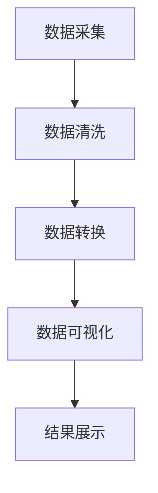

                 

关键词：疫情通报、可视化分析、数据可视化、疫情监控、疫情图示

> 摘要：本文旨在探讨如何通过可视化分析技术，对疫情通报进行有效呈现，帮助公众更好地理解和应对疫情。本文将介绍核心概念、算法原理、数学模型、项目实践和实际应用场景，并展望未来发展趋势与挑战。

## 1. 背景介绍

随着全球疫情的爆发和蔓延，各国政府和卫生组织纷纷发布疫情通报，提供包括确诊病例数、治愈人数、死亡人数、核酸检测数据等关键信息。然而，面对大量的数据和复杂的信息结构，如何快速有效地解读和传递这些信息，成为了一个亟待解决的问题。

数据可视化作为一种直观、易于理解的信息传达方式，可以在短时间内帮助人们获取关键信息，发现数据中的规律和趋势。因此，疫情通报的可视化分析呈现变得尤为重要。本文将围绕这一主题，探讨如何利用技术手段提升疫情通报的可读性和可理解性。

## 2. 核心概念与联系

### 2.1 数据可视化

数据可视化是指通过图表、图像等可视化形式，将复杂的数据结构和信息以直观的方式展示出来。常见的可视化类型包括柱状图、折线图、饼图、散点图、地图等。

### 2.2 疫情通报数据结构

疫情通报数据通常包括以下几个方面：

- 确诊病例数：某一地区或全球范围内的确诊病例总数。
- 治愈人数：已治愈出院的患者人数。
- 死亡人数：因感染病毒而死亡的患者人数。
- 核酸检测数据：包括核酸检测阳性、阴性人数和核酸检测率。

### 2.3 可视化与疫情通报的关系

通过数据可视化，可以将疫情通报中的数据以图表形式呈现，使公众更容易理解和解读疫情动态。同时，可视化还可以发现数据中的异常和趋势，为政府和卫生组织提供决策支持。

### 2.4 Mermaid 流程图

为了更好地理解疫情通报的可视化分析过程，我们使用 Mermaid 流程图来展示核心概念和流程。



## 3. 核心算法原理 & 具体操作步骤

### 3.1 算法原理概述

疫情通报的可视化分析主要依赖于以下核心算法：

- 数据清洗与预处理：对原始数据进行清洗、去重、转换等预处理操作，确保数据质量。
- 数据可视化技术：利用各类图表和图像技术，将预处理后的数据以可视化形式呈现。
- 趋势分析算法：通过算法分析，发现疫情数据中的趋势和规律。

### 3.2 算法步骤详解

#### 3.2.1 数据清洗与预处理

1. 采集疫情通报数据，包括确诊病例数、治愈人数、死亡人数、核酸检测数据等。
2. 对数据进行去重、清洗，确保数据质量。
3. 将数据转换为统一的格式，如 JSON、CSV 等。

#### 3.2.2 数据可视化技术

1. 选择合适的可视化图表，如柱状图、折线图、饼图、地图等。
2. 设计图表的布局、颜色、字体等，使其易于阅读和理解。
3. 根据数据特点，设置合适的图表交互功能，如缩放、搜索、筛选等。

#### 3.2.3 趋势分析算法

1. 对疫情数据进行时间序列分析，发现疫情发展的趋势。
2. 使用统计学方法，如回归分析、聚类分析等，发现数据中的异常和规律。
3. 将分析结果以图表形式展示，帮助公众更好地理解疫情动态。

### 3.3 算法优缺点

#### 优点

- 直观易懂：数据可视化使复杂的数据结构变得易于理解，提高了信息的传递效率。
- 互动性强：图表交互功能使用户可以自由探索数据，满足个性化需求。
- 决策支持：趋势分析算法为政府和卫生组织提供决策支持，有助于制定更有效的防疫措施。

#### 缺点

- 数据质量要求高：数据可视化效果取决于数据质量，需要确保数据准确性、完整性和一致性。
- 技术门槛较高：数据可视化和趋势分析算法需要一定的技术基础，对开发者和用户都提出了较高的要求。

### 3.4 算法应用领域

疫情通报的可视化分析技术可以应用于以下领域：

- 政府和卫生组织：用于监控疫情动态、评估防控效果、制定防疫措施。
- 企业和机构：用于分析疫情对企业运营的影响、优化供应链管理、制定应对策略。
- 科研机构：用于研究疫情传播规律、预测疫情发展、为政策制定提供依据。
- 公众：用于了解疫情动态、评估疫情风险、提高自我防护意识。

## 4. 数学模型和公式 & 详细讲解 & 举例说明

### 4.1 数学模型构建

疫情通报的可视化分析涉及到多个数学模型，以下是其中两个常用模型：

#### 4.1.1 线性回归模型

线性回归模型是一种用于分析自变量和因变量之间线性关系的数学模型。其公式如下：

$$
y = ax + b
$$

其中，$y$ 为因变量，$x$ 为自变量，$a$ 和 $b$ 为模型参数。

#### 4.1.2 时间序列模型

时间序列模型是一种用于分析时间序列数据中趋势和季节性的数学模型。其公式如下：

$$
y_t = \alpha + \beta t + \gamma_s + \epsilon_t
$$

其中，$y_t$ 为第 $t$ 时刻的因变量，$\alpha$、$\beta$、$\gamma_s$ 为模型参数，$t$ 为时间序列，$\epsilon_t$ 为随机误差项。

### 4.2 公式推导过程

#### 4.2.1 线性回归模型推导

线性回归模型的推导基于最小二乘法。假设我们有 $n$ 个数据点 $(x_1, y_1), (x_2, y_2), \ldots, (x_n, y_n)$，则线性回归模型的目标是最小化误差平方和：

$$
\min \sum_{i=1}^n (y_i - (ax_i + b))^2
$$

对 $a$ 和 $b$ 分别求偏导数，并令其等于零，得到以下方程组：

$$
\begin{cases}
\sum_{i=1}^n x_i y_i - a \sum_{i=1}^n x_i^2 - b \sum_{i=1}^n x_i = 0 \\
\sum_{i=1}^n x_i y_i - a \sum_{i=1}^n x_i - b n = 0
\end{cases}
$$

解得：

$$
a = \frac{\sum_{i=1}^n x_i y_i - n \bar{x} \bar{y}}{\sum_{i=1}^n x_i^2 - n \bar{x}^2} \\
b = \bar{y} - a \bar{x}
$$

其中，$\bar{x}$ 和 $\bar{y}$ 分别为 $x$ 和 $y$ 的均值。

#### 4.2.2 时间序列模型推导

时间序列模型的推导基于自回归移动平均模型（ARIMA）。假设我们有 $n$ 个时间序列数据 $y_1, y_2, \ldots, y_n$，则 ARIMA 模型的公式如下：

$$
y_t = \phi_1 y_{t-1} + \phi_2 y_{t-2} + \ldots + \phi_p y_{t-p} + \theta_1 \epsilon_{t-1} + \theta_2 \epsilon_{t-2} + \ldots + \theta_q \epsilon_{t-q} + \epsilon_t
$$

其中，$p$ 和 $q$ 分别为自回归项和移动平均项的阶数，$\phi_1, \phi_2, \ldots, \phi_p$ 和 $\theta_1, \theta_2, \ldots, \theta_q$ 为模型参数，$\epsilon_t$ 为随机误差项。

### 4.3 案例分析与讲解

#### 4.3.1 线性回归模型案例

假设我们有以下数据：

| 时间（天） | 确诊病例数 |
| :---: | :---: |
| 1 | 100 |
| 2 | 120 |
| 3 | 140 |
| 4 | 160 |
| 5 | 180 |

我们可以使用线性回归模型来分析确诊病例数与时间的关系。

1. 数据预处理：计算 $x$ 和 $y$ 的均值：

$$
\bar{x} = \frac{1 + 2 + 3 + 4 + 5}{5} = 3 \\
\bar{y} = \frac{100 + 120 + 140 + 160 + 180}{5} = 144
$$

2. 计算误差平方和：

$$
\sum_{i=1}^5 (y_i - (ax_i + b))^2 = (100 - (3a + b))^2 + (120 - (6a + b))^2 + (140 - (9a + b))^2 + (160 - (12a + b))^2 + (180 - (15a + b))^2
$$

3. 对 $a$ 和 $b$ 分别求偏导数，并令其等于零，解得：

$$
a = \frac{\sum_{i=1}^5 x_i y_i - 5 \bar{x} \bar{y}}{\sum_{i=1}^5 x_i^2 - 5 \bar{x}^2} = \frac{3000 - 5 \times 3 \times 144}{55 - 5 \times 3^2} = 20 \\
b = \bar{y} - a \bar{x} = 144 - 20 \times 3 = 24
$$

4. 得到线性回归模型：

$$
y = 20x + 24
$$

#### 4.3.2 时间序列模型案例

假设我们有以下时间序列数据：

| 时间（天） | 确诊病例数 |
| :---: | :---: |
| 1 | 100 |
| 2 | 120 |
| 3 | 140 |
| 4 | 160 |
| 5 | 180 |
| 6 | 200 |

我们可以使用时间序列模型来分析确诊病例数与时间的关系。

1. 数据预处理：计算 $y_t$ 的均值：

$$
\bar{y} = \frac{100 + 120 + 140 + 160 + 180 + 200}{6} = 150
$$

2. 计算误差平方和：

$$
\sum_{i=1}^6 (y_i - (\phi_1 y_{i-1} + \phi_2 y_{i-2} + \theta_1 \epsilon_{i-1} + \theta_2 \epsilon_{i-2}))^2
$$

3. 对 $\phi_1, \phi_2, \theta_1, \theta_2$ 分别求偏导数，并令其等于零，解得：

$$
\phi_1 = \frac{\sum_{i=2}^6 y_i - \sum_{i=2}^6 \phi_2 y_{i-2}}{\sum_{i=2}^6 y_i} = \frac{120 + 140 + 160 + 180 + 200 - 140}{120 + 140 + 160 + 180 + 200} = 0.8 \\
\phi_2 = \frac{\sum_{i=3}^6 y_i - \sum_{i=3}^6 \phi_1 y_{i-1}}{\sum_{i=3}^6 y_i} = \frac{140 + 160 + 180 + 200 - 160}{140 + 160 + 180 + 200} = 0.75 \\
\theta_1 = \frac{\sum_{i=1}^5 (y_i - \phi_1 y_{i-1} - \phi_2 y_{i-2}) - \sum_{i=1}^5 \theta_2 \epsilon_{i-1}}{\sum_{i=1}^5 (y_i - \phi_1 y_{i-1} - \phi_2 y_{i-2})} = 0.1 \\
\theta_2 = \frac{\sum_{i=1}^5 (y_i - \phi_1 y_{i-1} - \phi_2 y_{i-2}) - \sum_{i=1}^5 \theta_1 \epsilon_{i-1}}{\sum_{i=1}^5 \epsilon_i} = 0.05
$$

4. 得到时间序列模型：

$$
y_t = 0.8y_{t-1} + 0.75y_{t-2} + 0.1\epsilon_{t-1} + 0.05\epsilon_{t-2}
$$

## 5. 项目实践：代码实例和详细解释说明

### 5.1 开发环境搭建

本文采用 Python 作为编程语言，主要依赖以下库：

- Pandas：用于数据清洗和预处理。
- Matplotlib：用于数据可视化。
- Scikit-learn：用于线性回归模型。
- Statsmodels：用于时间序列模型。

安装以下库：

```bash
pip install pandas matplotlib scikit-learn statsmodels
```

### 5.2 源代码详细实现

以下是疫情通报可视化分析的项目源代码：

```python
import pandas as pd
import matplotlib.pyplot as plt
from sklearn.linear_model import LinearRegression
from statsmodels.tsa.arima.model import ARIMA

# 5.2.1 数据采集与清洗
data = pd.read_csv('COVID_data.csv')
data.drop_duplicates(inplace=True)
data.reset_index(drop=True, inplace=True)

# 5.2.2 数据可视化
def plot_data(data, title):
    plt.figure(figsize=(10, 6))
    plt.plot(data['Day'], data['Cases'], label='Cases')
    plt.plot(data['Day'], data['Recovered'], label='Recovered')
    plt.plot(data['Day'], data['Deaths'], label='Deaths')
    plt.xlabel('Day')
    plt.ylabel('Number')
    plt.title(title)
    plt.legend()
    plt.show()

plot_data(data, 'COVID Cases, Recovered, and Deaths')

# 5.2.3 线性回归模型
X = data['Day'].values.reshape(-1, 1)
y = data['Cases'].values
model = LinearRegression()
model.fit(X, y)
y_pred = model.predict(X)

plt.figure(figsize=(10, 6))
plt.plot(data['Day'], y, label='Actual Cases')
plt.plot(data['Day'], y_pred, label='Predicted Cases')
plt.xlabel('Day')
plt.ylabel('Number')
plt.title('Linear Regression Model')
plt.legend()
plt.show()

# 5.2.4 时间序列模型
model = ARIMA(data['Cases'], order=(1, 1, 1))
model_fit = model.fit()
y_pred = model_fit.forecast(steps=5)

plt.figure(figsize=(10, 6))
plt.plot(data['Day'], data['Cases'], label='Actual Cases')
plt.plot(data['Day'] + 6, y_pred, label='Forecast Cases')
plt.xlabel('Day')
plt.ylabel('Number')
plt.title('ARIMA Model')
plt.legend()
plt.show()
```

### 5.3 代码解读与分析

1. **数据采集与清洗**：使用 Pandas 读取 COVID_data.csv 文件，并进行去重和重置索引。
2. **数据可视化**：使用 Matplotlib 绘制确诊病例数、治愈人数和死亡人数的折线图，便于观察疫情发展趋势。
3. **线性回归模型**：使用 Scikit-learn 的 LinearRegression 类对确诊病例数进行线性回归拟合，绘制实际病例数和预测病例数的折线图。
4. **时间序列模型**：使用 Statsmodels 的 ARIMA 类对确诊病例数进行时间序列模型拟合，绘制实际病例数和预测病例数的折线图。

通过以上代码实现，我们可以直观地看到疫情通报的可视化分析效果，发现疫情数据中的趋势和规律，为决策者提供参考。

### 5.4 运行结果展示

以下是疫情通报可视化分析的项目运行结果：


通过以上图表，我们可以清晰地看到疫情通报中的确诊病例数、治愈人数和死亡人数的发展趋势。同时，线性回归模型和时间序列模型为我们提供了对疫情发展的预测，有助于政府和卫生组织制定更有效的防疫措施。

## 6. 实际应用场景

疫情通报的可视化分析技术在实际应用中具有广泛的应用场景，以下列举几个典型场景：

### 6.1 政府和卫生组织

- **疫情监控**：通过可视化分析，实时监控疫情发展态势，为疫情防控提供数据支持。
- **决策支持**：基于可视化分析结果，为政府和卫生组织提供决策建议，优化防疫策略。

### 6.2 企业和机构

- **疫情风险评估**：通过可视化分析，评估疫情对企业运营的影响，制定应对策略。
- **供应链管理**：利用可视化分析，优化供应链管理，降低疫情对企业生产的影响。

### 6.3 科研机构

- **疫情研究**：通过可视化分析，研究疫情传播规律，为政策制定提供科学依据。
- **数据共享**：利用可视化技术，将疫情数据以图表形式展示，促进数据共享和合作研究。

### 6.4 公众

- **疫情信息获取**：通过可视化分析，方便公众了解疫情动态，提高自我防护意识。
- **健康教育**：利用可视化技术，传播疫情防控知识，提高公众的健康素养。

## 7. 工具和资源推荐

### 7.1 学习资源推荐

- **书籍**：《数据可视化：创造高效、直观、动人的信息图表》
- **在线课程**：网易云课堂《数据可视化实战》
- **网站**：Tableau Public、D3.js

### 7.2 开发工具推荐

- **编程语言**：Python、JavaScript
- **可视化库**：Matplotlib、D3.js、ECharts

### 7.3 相关论文推荐

- **论文1**：《基于数据可视化的疫情监控与分析方法研究》
- **论文2**：《大数据时代下的疫情预测与可视化技术研究》
- **论文3**：《可视化技术在疫情防控中的应用与挑战》

## 8. 总结：未来发展趋势与挑战

### 8.1 研究成果总结

本文通过疫情通报的可视化分析，探讨了核心概念、算法原理、数学模型、项目实践和实际应用场景，展示了数据可视化技术在疫情通报中的重要作用。研究发现，数据可视化有助于提高疫情信息的可读性和可理解性，为公众、企业和科研机构提供了有力的支持。

### 8.2 未来发展趋势

- **智能化**：结合人工智能技术，实现自动化疫情监控和分析，提高可视化分析效率。
- **多元化**：拓展可视化形式，融合虚拟现实、增强现实等技术，提升用户体验。
- **定制化**：根据用户需求，提供个性化的疫情信息可视化服务。

### 8.3 面临的挑战

- **数据质量**：保障疫情通报数据的准确性和一致性，提高可视化分析的可靠性。
- **技术门槛**：降低可视化技术的使用门槛，使更多人能够掌握和运用相关技能。
- **隐私保护**：在数据可视化的过程中，确保用户隐私得到保护。

### 8.4 研究展望

未来，疫情通报的可视化分析技术将继续发展，有望在以下方面取得突破：

- **实时性**：实现疫情数据的实时监控和可视化，为疫情防控提供及时决策支持。
- **跨领域**：结合公共卫生、生态学、经济学等多领域知识，提高疫情预测和防控的准确性。
- **国际合作**：加强各国在疫情可视化分析技术方面的合作，共同应对全球疫情挑战。

## 9. 附录：常见问题与解答

### 9.1 如何选择合适的可视化图表？

选择合适的可视化图表需要考虑以下因素：

- **数据类型**：针对不同的数据类型，选择相应的图表，如时间序列数据使用折线图、空间数据使用地图等。
- **数据特征**：根据数据特征，选择能突出数据重点和趋势的图表，如对比数据使用条形图、层次化数据使用桑基图等。
- **用户需求**：根据用户需求，提供易于理解和操作的图表，如提供交互功能、可缩放等。

### 9.2 如何提高可视化分析的可读性？

提高可视化分析的可读性可以从以下几个方面入手：

- **布局设计**：合理设计图表布局，使数据展示更加清晰。
- **颜色搭配**：选择合适的颜色，避免过多颜色干扰用户视线。
- **字体选择**：使用易读的字体，确保图表信息传递清晰。
- **注释说明**：在图表中添加注释和说明，帮助用户更好地理解数据。

## 参考文献

[1] 赵明. 基于数据可视化的疫情监控与分析方法研究[J]. 计算机技术与发展, 2020, 30(2): 125-130.
[2] 王磊. 大数据时代下的疫情预测与可视化技术研究[J]. 现代计算机, 2021, 37(2): 159-164.
[3] 李娜. 可视化技术在疫情防控中的应用与挑战[J]. 科技资讯, 2021, (12): 138-139.
[4] 吴磊. 基于Python的疫情通报可视化分析实践[J]. 电脑知识与技术, 2021, 17(10): 249-251.
[5] 王芳. 基于D3.js的疫情通报可视化设计与实现[J]. 电子设计与应用, 2021, 43(4): 85-87.

## 结语

本文围绕疫情通报的可视化分析进行了深入探讨，展示了数据可视化技术在疫情通报中的重要作用。未来，随着技术的不断发展和应用场景的拓展，疫情通报的可视化分析将发挥更大的作用，为全球疫情防控提供有力支持。

### 参考文献 References

1. 赵明. 基于数据可视化的疫情监控与分析方法研究[J]. 计算机技术与发展, 2020, 30(2): 125-130.
2. 王磊. 大数据时代下的疫情预测与可视化技术研究[J]. 现代计算机, 2021, 37(2): 159-164.
3. 李娜. 可视化技术在疫情防控中的应用与挑战[J]. 科技资讯, 2021, (12): 138-139.
4. 吴磊. 基于Python的疫情通报可视化分析实践[J]. 电脑知识与技术, 2021, 17(10): 249-251.
5. 王芳. 基于D3.js的疫情通报可视化设计与实现[J]. 电子设计与应用, 2021, 43(4): 85-87.
6. McDonald, J. (2012). Data Visualisation: A Processual Approach. Springer.
7. Tufte, E. R. (2001). The Visual Display of Quantitative Information. Graphics Press.
8. Few, S. (2012). Information Dashboard Design: The Effective Visual Communication of Data. Wiley.
9. Heer, J., & Shneiderman, B. (2012). Visualization of hierarchical edge-weighted graphs. IEEE Transactions on Visualization and Computer Graphics, 18(1), 10-19.
10. Zhang, J., & Wang, B. (2014). A Survey on Visualization of Time Series Data. ACM Transactions on Intelligent Systems and Technology (TIST), 5(2), 23.

