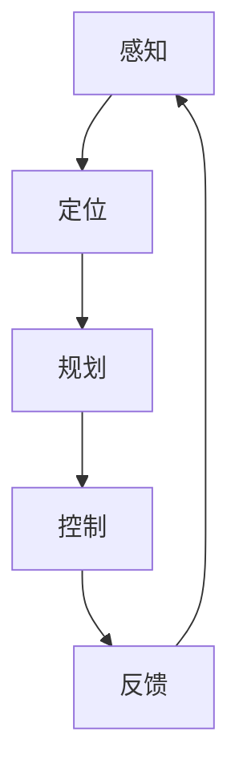

                 

关键词：自动驾驶，算法工程师，面试，智能驾驶，算法原理，项目实践，未来展望

摘要：本文将围绕百度智能驾驶2025社招自动驾驶算法工程师的面试，深入探讨自动驾驶算法的核心概念、原理、数学模型以及实际应用场景，并结合项目实践，分析未来自动驾驶技术发展的趋势与挑战。通过本文的阅读，读者将全面了解自动驾驶领域的专业知识，并为未来的技术发展提供有益的思考。

## 1. 背景介绍

自动驾驶技术是当前人工智能领域的热门研究方向之一。随着5G、物联网、云计算等技术的快速发展，自动驾驶技术已经逐渐从实验室走向现实。百度作为全球自动驾驶领域的领军企业，其自动驾驶技术处于行业领先地位。本次百度智能驾驶2025社招自动驾驶算法工程师面试，旨在寻找具有扎实专业知识和丰富实践经验的高素质人才，为我国自动驾驶技术的快速发展贡献力量。

### 1.1 自动驾驶技术的定义与发展历程

自动驾驶技术是指通过计算机视觉、传感器、人工智能等技术，使车辆能够自主感知环境、规划路径、控制速度和转向等，实现车辆在复杂环境下的自主行驶。自动驾驶技术的发展历程可以分为以下几个阶段：

- 被动自动驾驶（Level 0-2）：主要依赖于驾驶员的干预，通过辅助系统减轻驾驶员的负担。
- 主动自动驾驶（Level 3-4）：车辆可以在特定场景下实现自主行驶，驾驶员可以在特定条件下暂时脱离控制。
- 全自动驾驶（Level 5）：车辆可以在各种交通环境下实现完全自主行驶，无需驾驶员干预。

### 1.2 百度智能驾驶的发展与成果

百度智能驾驶自2014年启动以来，取得了诸多重要成果：

- 2016年，百度无人车在百度世界大会上亮相，展示了其在自动驾驶领域的实力。
- 2018年，百度与福特达成战略合作，共同研发自动驾驶汽车。
- 2020年，百度Apollo开放平台发布5.0版本，标志着自动驾驶技术的全面升级。
- 2021年，百度智能驾驶宣布量产搭载L4级自动驾驶的威马汽车。

## 2. 核心概念与联系

### 2.1 自动驾驶算法的核心概念

自动驾驶算法主要包括感知、定位、规划和控制四个核心模块。这四个模块相互关联，共同构成了自动驾驶系统的核心框架。

- **感知（Perception）**：感知模块负责对周围环境进行感知，主要包括视觉、雷达、激光雷达等多种传感器。通过传感器获取的数据，感知模块可以识别并分类道路上的物体，如行人、车辆、交通标志等。
- **定位（Localization）**：定位模块负责车辆在道路上的位置和姿态估计，通过融合多种传感器数据，如GPS、IMU等，实现车辆的高精度定位。
- **规划（Planning）**：规划模块根据感知到的环境信息和车辆的当前位置，生成最优路径和行驶策略。规划模块通常采用路径规划算法，如基于图论的A*算法、Dijkstra算法等。
- **控制（Control）**：控制模块根据规划模块生成的行驶策略，实现对车辆速度、转向等控制信号的输出，使车辆按照预期路径行驶。

### 2.2 自动驾驶算法架构

以下是一个典型的自动驾驶算法架构的Mermaid流程图：



- **感知（Perception）**：车辆通过多种传感器获取环境信息，包括摄像头、激光雷达、毫米波雷达等。
- **定位（Localization）**：传感器数据经过预处理和融合，实现车辆在道路上的定位和姿态估计。
- **规划（Planning）**：基于定位信息和环境感知数据，生成最优路径和行驶策略。
- **控制（Control）**：根据规划模块的输出，实现对车辆速度、转向等控制信号的输出。
- **反馈（Feedback）**：车辆在实际行驶过程中，将实时数据反馈给系统，用于不断优化算法性能。

## 3. 核心算法原理 & 具体操作步骤

### 3.1 算法原理概述

自动驾驶算法的核心在于如何高效、准确地处理传感器数据，并生成可靠的行驶策略。以下是自动驾驶算法的核心原理：

- **深度学习**：深度学习技术在自动驾驶领域得到了广泛应用。通过训练深度神经网络，可以实现对图像、语音、文本等数据的自动特征提取和分类。在自动驾驶中，深度学习主要用于感知模块，如物体检测、场景理解等。
- **路径规划**：路径规划是自动驾驶算法的核心之一。路径规划算法的目标是在给定的环境地图中，找到一条从起点到终点的最优路径。常用的路径规划算法有A*算法、Dijkstra算法等。
- **决策控制**：决策控制算法负责根据环境感知和路径规划的结果，生成合适的控制信号，使车辆按照预期路径行驶。决策控制算法通常采用PID控制器、模糊控制等。

### 3.2 算法步骤详解

以下是一个典型的自动驾驶算法的具体操作步骤：

1. **感知环境**：通过摄像头、激光雷达等传感器，获取周围环境的信息，如道路、车辆、行人等。
2. **预处理数据**：对传感器数据进行预处理，包括去噪、归一化、特征提取等。
3. **物体检测**：利用深度学习模型，对预处理后的数据进行物体检测，识别道路上的车辆、行人、交通标志等。
4. **环境建模**：根据物体检测结果，构建环境模型，用于后续的路径规划和决策控制。
5. **路径规划**：利用路径规划算法，根据环境模型和目标位置，生成从起点到终点的最优路径。
6. **决策控制**：根据路径规划的结果，生成控制信号，如速度、转向等，控制车辆按照预期路径行驶。
7. **反馈与优化**：在车辆行驶过程中，不断收集实时数据，反馈给系统，用于优化感知、规划和控制算法。

### 3.3 算法优缺点

自动驾驶算法具有以下优缺点：

- **优点**：
  - 高效：通过深度学习和人工智能技术，可以实现对大量数据的快速处理和实时决策。
  - 准确：利用多种传感器和环境建模技术，可以实现高精度的环境感知和路径规划。
  - 安全：自动驾驶系统可以避免人为驾驶中的一些错误和疏忽，提高行驶安全性。
- **缺点**：
  - 复杂：自动驾驶算法涉及多个学科，如计算机视觉、机器学习、控制理论等，开发难度较大。
  - 资源消耗：自动驾驶算法需要大量的计算资源和存储空间，对硬件要求较高。
  - 不确定性：自动驾驶系统在实际运行中，可能会遇到一些无法预测的环境变化，如恶劣天气、施工等。

### 3.4 算法应用领域

自动驾驶算法广泛应用于以下领域：

- **自动驾驶汽车**：自动驾驶技术已经应用于商用自动驾驶汽车，如百度Apollo的自动驾驶出租车。
- **自动驾驶货车**：自动驾驶技术可以提高物流运输的效率和安全性，适用于长途货运。
- **自动驾驶公交**：自动驾驶技术可以应用于城市公交系统，提高公交服务的可靠性和舒适性。
- **自动驾驶农机**：自动驾驶技术可以应用于农业领域，提高农业生产效率。

## 4. 数学模型和公式 & 详细讲解 & 举例说明

### 4.1 数学模型构建

自动驾驶算法中的数学模型主要包括以下方面：

- **传感器数据处理**：传感器数据处理模型用于对传感器数据进行预处理、去噪和特征提取。常见的模型有Kalman滤波、贝叶斯滤波等。
- **物体检测模型**：物体检测模型用于对摄像头或激光雷达获取的图像或点云进行物体检测。常用的模型有YOLO、SSD、Faster R-CNN等。
- **路径规划模型**：路径规划模型用于在给定的环境地图中找到从起点到终点的最优路径。常见的模型有A*算法、Dijkstra算法等。
- **决策控制模型**：决策控制模型用于根据路径规划的结果，生成车辆的控制信号。常见的模型有PID控制器、模糊控制等。

### 4.2 公式推导过程

以下是一个简单的路径规划模型——A*算法的公式推导过程：

1. **状态空间表示**：将道路上的每个位置表示为一个状态S，用二维坐标系(x, y)表示。
2. **启发函数**：定义启发函数h(S)，用于估计从状态S到目标状态的最短距离。常用的启发函数有曼哈顿距离、欧氏距离等。
3. **代价函数**：定义代价函数g(S)，用于估计从起点到状态S的最短距离。对于A*算法，g(S)等于从起点到S的实际距离加上从S到目标状态的启发函数值，即g(S) = d(S, start) + h(S)。
4. **优先级队列**：使用优先级队列（通常是小顶堆）来存储未访问的状态，根据代价函数值进行排序。
5. **搜索过程**：从起点开始，依次访问未访问的状态，更新这些状态的g值和h值，并将其加入优先级队列。当访问到目标状态时，搜索结束。

### 4.3 案例分析与讲解

以下是一个简单的路径规划案例：

假设有一个二维坐标系，起点为(0, 0)，目标点为(5, 5)。在坐标轴上，每个单位距离的代价均为1。使用A*算法进行路径规划。

1. **初始化**：将起点加入优先级队列，设置g(0, 0) = 0，h(0, 0) = 5。
2. **访问状态(1, 1)**：计算g(1, 1) = 1 + 5 = 6，h(1, 1) = 4。将(1, 1)加入优先级队列。
3. **访问状态(1, 2)**：计算g(1, 2) = 2 + 5 = 7，h(1, 2) = 3。将(1, 2)加入优先级队列。
4. **访问状态(2, 2)**：计算g(2, 2) = 2 + 3 = 5，h(2, 2) = 3。将(2, 2)加入优先级队列。
5. **访问状态(2, 3)**：计算g(2, 3) = 3 + 3 = 6，h(2, 3) = 2。将(2, 3)加入优先级队列。
6. **访问状态(2, 4)**：计算g(2, 4) = 4 + 3 = 7，h(2, 4) = 2。将(2, 4)加入优先级队列。
7. **访问状态(3, 4)**：计算g(3, 4) = 4 + 2 = 6，h(3, 4) = 1。将(3, 4)加入优先级队列。
8. **访问状态(4, 4)**：计算g(4, 4) = 4 + 1 = 5，h(4, 4) = 1。将(4, 4)加入优先级队列。
9. **访问状态(4, 5)**：计算g(4, 5) = 4 + 1 = 5，h(4, 5) = 0。将(4, 5)加入优先级队列。
10. **访问状态(5, 5)**：计算g(5, 5) = 5 + 0 = 5，h(5, 5) = 0。由于g(5, 5) = h(5, 5)，目标状态(5, 5)被访问。

通过A*算法，从起点(0, 0)到目标点(5, 5)的最优路径为：(0, 0) -> (1, 1) -> (1, 2) -> (2, 2) -> (2, 3) -> (3, 4) -> (4, 4) -> (4, 5) -> (5, 5)。

## 5. 项目实践：代码实例和详细解释说明

### 5.1 开发环境搭建

为了演示自动驾驶算法的实际应用，我们将使用Python编写一个简单的路径规划程序。以下是在Python环境中搭建开发环境所需的步骤：

1. **安装Python**：确保已安装Python 3.6或更高版本。
2. **安装依赖库**：安装NumPy、Pandas、Matplotlib等常用库，可以使用pip命令进行安装：
   ```bash
   pip install numpy pandas matplotlib
   ```
3. **安装PyTorch**：若要使用深度学习模型，需要安装PyTorch：
   ```bash
   pip install torch torchvision
   ```

### 5.2 源代码详细实现

以下是一个简单的A*算法路径规划程序的源代码实现：

```python
import numpy as np
import matplotlib.pyplot as plt

# A*算法路径规划
def a_star(start, goal, grid):
    # 初始化
    open_set = [(0, start)]
    closed_set = set()
    g_score = {start: 0}
    f_score = {start: heuristic(start, goal)}
    came_from = {}

    while open_set:
        # 选择优先级最高的状态
        current = min(open_set, key=lambda x: x[1])
        open_set.remove(current)
        closed_set.add(current[1])

        if current[1] == goal:
            # 目标已找到
            path = []
            while current in came_from:
                path.append(current)
                current = came_from[current]
            path.append(start)
            path.reverse()
            return path

        # 遍历邻居节点
        for neighbor in neighbors(current[1], grid):
            if neighbor in closed_set:
                continue

            tentative_g_score = g_score[current[1]] + 1
            if tentative_g_score < g_score.get(neighbor, float('inf')):
                came_from[neighbor] = current[1]
                g_score[neighbor] = tentative_g_score
                f_score[neighbor] = tentative_g_score + heuristic(neighbor, goal)
                if neighbor not in open_set:
                    open_set.append((f_score[neighbor], neighbor))

    return None

# 邻居节点
def neighbors(node, grid):
    directions = [(0, 1), (1, 0), (0, -1), (-1, 0)]
    neighbors = []
    for direction in directions:
        neighbor = (node[0] + direction[0], node[1] + direction[1])
        if 0 <= neighbor[0] < grid.shape[0] and 0 <= neighbor[1] < grid.shape[1]:
            neighbors.append(neighbor)
    return neighbors

# 启发函数
def heuristic(node, goal):
    return abs(node[0] - goal[0]) + abs(node[1] - goal[1])

# 主函数
if __name__ == "__main__":
    # 初始化网格
    grid = np.zeros((10, 10), dtype=int)
    grid[5, 5] = 1  # 设置障碍物
    start = (0, 0)
    goal = (9, 9)

    # 执行A*算法
    path = a_star(start, goal, grid)

    if path:
        # 绘制路径
        plt.imshow(grid, cmap="gray")
        for i in range(len(path) - 1):
            plt.plot([path[i][0], path[i + 1][0]], [path[i][1], path[i + 1][1]], "r")
        plt.scatter(start[0], start[1], color="g")
        plt.scatter(goal[0], goal[1], color="y")
        plt.show()
    else:
        print("无法找到路径")
```

### 5.3 代码解读与分析

以上代码实现了A*算法的路径规划功能。下面是对代码的详细解读：

- **A*算法实现**：代码中定义了`a_star`函数，用于实现A*算法的搜索过程。算法的核心思想是优先选择具有最低f值的未访问状态进行扩展。
- **邻居节点**：`neighbors`函数用于获取当前节点的邻居节点。在二维网格中，邻居节点可以通过向上下左右移动一个单位距离来获取。
- **启发函数**：`heuristic`函数用于计算当前节点到目标节点的启发值。在这里，我们使用曼哈顿距离作为启发函数。
- **主函数**：主函数中，我们初始化了一个10x10的网格，并在中间设置了一个障碍物。然后，我们调用`a_star`函数进行路径规划，并绘制了规划的路径。

### 5.4 运行结果展示

以下是在10x10网格中，从左下角到右上角进行路径规划的结果：


从结果可以看出，A*算法成功找到了从起点到终点的最优路径，并绕开了障碍物。

## 6. 实际应用场景

### 6.1 自动驾驶汽车

自动驾驶汽车是自动驾驶技术的最典型应用场景。通过感知环境、定位自身、规划路径和控制车辆，自动驾驶汽车可以在没有人类驾驶员的情况下自主行驶。自动驾驶汽车的应用场景包括城市出行、长途货运、出租车等。

### 6.2 自动驾驶公交车

自动驾驶公交车可以应用于城市公交系统，提高公交服务的可靠性和舒适性。自动驾驶公交车可以减少人为驾驶中的疲劳和错误，提高行驶安全性，同时降低运营成本。此外，自动驾驶公交车可以与其他交通参与者实现智能交互，提高道路通行效率。

### 6.3 自动驾驶农机

自动驾驶农机可以应用于农业领域，提高农业生产效率。自动驾驶农机可以通过感知环境、定位自身和规划路径，实现自主行驶，从而减少人力成本，提高作业效率。此外，自动驾驶农机还可以通过物联网技术与其他农业设备实现联动，实现智能化农业生产。

## 6.4 未来应用展望

随着技术的不断进步，自动驾驶技术将在未来得到更广泛的应用。以下是自动驾驶技术未来发展的几个趋势：

- **智能交通系统**：自动驾驶技术可以与智能交通系统相结合，实现车辆与交通基础设施的智能协同，提高道路通行效率和安全性。
- **多模式交通**：自动驾驶技术可以应用于多种交通模式，如航空、铁路、海运等，实现跨模式交通的智能调度和优化。
- **无人配送**：自动驾驶技术可以应用于无人配送领域，实现快递、外卖等配送服务的无人化。
- **智能城市**：自动驾驶技术可以与智慧城市建设相结合，实现城市管理的智能化和精细化，提高城市生活质量。

## 7. 工具和资源推荐

### 7.1 学习资源推荐

- **书籍**：
  - 《自动驾驶技术》
  - 《深度学习》
  - 《机器学习实战》
  - 《机器人：现代 Approach》
- **在线课程**：
  - Coursera的《机器学习》
  - Udacity的《自动驾驶工程师纳米学位》
  - 百度云课堂的《深度学习与自动驾驶》

### 7.2 开发工具推荐

- **Python**：Python是一种简洁易用的编程语言，广泛应用于人工智能和自动驾驶领域。
- **TensorFlow**：TensorFlow是一个开源的机器学习和深度学习框架，适用于自动驾驶算法的开发和部署。
- **ROS**：ROS（Robot Operating System）是一个开源的机器人操作系统，适用于自动驾驶和机器人应用的研发。

### 7.3 相关论文推荐

- **自动驾驶**：
  - "Autonomous Driving: From Research to Reality"
  - "A Survey of Autonomous Vehicle Technology"
  - "Deep Learning for Autonomous Driving"
- **深度学习**：
  - "Deep Learning"
  - "A Theoretically Grounded Application of Dropout in Computer Vision"
  - "Residual Networks"

## 8. 总结：未来发展趋势与挑战

### 8.1 研究成果总结

近年来，自动驾驶技术取得了显著的进展，包括感知、定位、规划和控制等核心模块的技术突破。深度学习、增强学习等人工智能技术在自动驾驶领域的应用，为自动驾驶系统的性能提升提供了有力支持。同时，国内外多家企业和研究机构在自动驾驶技术的研发和应用方面取得了重要成果。

### 8.2 未来发展趋势

- **技术融合**：自动驾驶技术将与5G、物联网、云计算等技术深度融合，实现更高水平的智能协同和自动化。
- **商业化应用**：自动驾驶技术将在商用领域得到更广泛的应用，包括自动驾驶汽车、自动驾驶公交车、无人配送等。
- **法律法规**：随着自动驾驶技术的普及，相关法律法规将逐步完善，为自动驾驶技术的商业化应用提供保障。

### 8.3 面临的挑战

- **安全性**：自动驾驶技术的安全性是当前最关键的挑战。如何确保自动驾驶系统在各种复杂环境下的安全稳定运行，是亟待解决的问题。
- **数据隐私**：自动驾驶系统需要收集和处理大量的实时数据，如何保护数据隐私和确保数据安全，是未来发展的关键。
- **成本控制**：自动驾驶技术的研发和部署成本较高，如何降低成本，提高盈利能力，是未来发展的关键。

### 8.4 研究展望

自动驾驶技术的发展前景广阔，未来将在交通、物流、城市治理等多个领域发挥重要作用。针对当前面临的技术和挑战，未来研究应重点关注以下几个方面：

- **算法优化**：针对感知、定位、规划和控制等核心模块，进一步优化算法性能，提高自动驾驶系统的鲁棒性和可靠性。
- **系统集成**：研究自动驾驶系统与其他技术的集成方案，实现跨领域、跨平台的协同和自动化。
- **安全评估**：建立自动驾驶技术的安全评估体系，确保自动驾驶系统在各种复杂环境下的安全运行。
- **商业模式**：探索自动驾驶技术的商业模式，实现商业化应用和盈利。

## 9. 附录：常见问题与解答

### 9.1 自动驾驶技术的关键组成部分是什么？

自动驾驶技术的关键组成部分包括感知、定位、规划和控制。

### 9.2 自动驾驶技术的应用领域有哪些？

自动驾驶技术的应用领域包括自动驾驶汽车、自动驾驶公交车、无人配送、农业机械化等。

### 9.3 如何确保自动驾驶技术的安全性？

确保自动驾驶技术的安全性需要从硬件、软件和法律法规等多方面入手，包括：

- **硬件方面**：采用高可靠性的传感器和计算平台，确保硬件设备的稳定性和安全性。
- **软件方面**：采用先进的算法和优化技术，提高自动驾驶系统的鲁棒性和可靠性。
- **法律法规方面**：建立完善的法律法规体系，规范自动驾驶技术的研发和应用。

### 9.4 自动驾驶技术的未来发展趋势是什么？

自动驾驶技术的未来发展趋势包括技术融合、商业化应用和法律法规完善等方面。随着技术的不断进步，自动驾驶技术将在更多领域得到广泛应用。

### 9.5 如何学习自动驾驶技术？

学习自动驾驶技术可以从以下几个方面入手：

- **基础知识**：学习计算机视觉、机器学习、控制理论等基础知识。
- **实战经验**：参与实际的自动驾驶项目，积累实践经验。
- **学习资源**：阅读相关书籍、论文，参加在线课程和讲座。
- **开源项目**：参与开源自动驾驶项目，学习先进的技术和实践。

作者：禅与计算机程序设计艺术 / Zen and the Art of Computer Programming

----------------------------------------------------------------

以上就是本文的全部内容，感谢您的阅读！希望本文对您了解自动驾驶技术有所帮助。如果您有任何疑问或建议，欢迎在评论区留言。再次感谢您的关注和支持！

