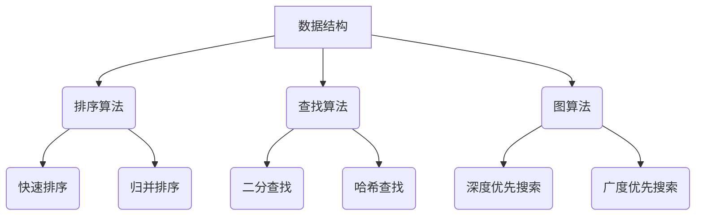

                 

作者：禅与计算机程序设计艺术 / Zen and the Art of Computer Programming

**关键词**：百度社招面试，算法编程，面试题解析，技术讲解，实战应用

**摘要**：本文旨在为2024年百度社会招聘的应聘者提供一份详细的面试题与算法编程题讲解，涵盖核心技术概念、算法原理、数学模型、项目实践，以及未来应用展望等内容。通过本文的阅读，读者将能够更深入地理解和掌握面试题中的关键知识点，为成功通过面试做好准备。

## 1. 背景介绍

百度作为中国领先的搜索引擎公司，其社会招聘面试一直备受求职者关注。面试题内容广泛，涵盖了计算机科学、算法编程、数据结构、操作系统、网络协议等多个领域。本文将针对这些核心领域，结合实际面试题目，进行深入讲解和分析。

### 1.1 百度招聘面试的特点

- **技术深度**：百度面试题往往涉及较深的技术知识，要求应聘者不仅要有扎实的理论基础，还要具备实战经验。
- **案例分析**：面试官会通过实际案例来考察应聘者对知识的灵活运用能力。
- **算法编程**：算法编程是百度面试的重头戏，面试官会给出各种算法题，考查应聘者的编程能力、逻辑思维和问题解决能力。

### 1.2 面试题的来源

- **经典算法题目**：如排序算法、查找算法、图算法等。
- **实际业务场景**：结合百度业务需求，设计相关算法和数据结构问题。
- **操作系统和网络协议**：考查应聘者对操作系统和网络协议的理解，如进程管理、内存管理、网络传输等。

## 2. 核心概念与联系

在本文中，我们将详细讲解以下核心概念，并通过Mermaid流程图展示它们之间的关系：

### 2.1 数据结构与算法

- **数组**
- **链表**
- **栈**
- **队列**
- **树**
- **图**
- **排序算法**
- **查找算法**

### 2.2 计算机基础知识

- **计算机网络**
- **操作系统**
- **编译原理**
- **数据库**

### 2.3 数学模型

- **线性代数**
- **概率论**
- **图论**

### 2.4 Mermaid流程图



## 3. 核心算法原理 & 具体操作步骤

### 3.1 算法原理概述

在本章节中，我们将深入探讨几个核心算法的原理，并给出具体操作步骤。

### 3.2 算法步骤详解

#### 3.2.1 快速排序

1. 选择一个基准元素。
2. 将数组分为两部分，一部分比基准小，另一部分比基准大。
3. 递归地对两部分进行快速排序。

#### 3.2.2 二分查找

1. 确定查找范围的中间值。
2. 比较中间值与目标值的大小。
3. 如果找到目标值，返回位置；否则，缩小查找范围并继续。

#### 3.2.3 深度优先搜索

1. 访问当前节点。
2. 标记当前节点为已访问。
3. 对当前节点的所有未访问的邻居进行深度优先搜索。

### 3.3 算法优缺点

#### 快速排序

- **优点**：时间复杂度低，适用于大规模数据排序。
- **缺点**：最坏情况下时间复杂度较高，稳定性较差。

#### 二分查找

- **优点**：时间复杂度低，适用于有序数据查找。
- **缺点**：插入和删除操作性能较差。

#### 深度优先搜索

- **优点**：实现简单，适用于图数据的遍历。
- **缺点**：容易陷入死循环，空间复杂度较高。

### 3.4 算法应用领域

- **快速排序**：广泛应用于排序算法库中。
- **二分查找**：用于各种查找操作的场景。
- **深度优先搜索**：常用于图算法中，如路径查找、拓扑排序等。

## 4. 数学模型和公式 & 详细讲解 & 举例说明

在本章节中，我们将介绍核心的数学模型和公式，并通过具体例子进行讲解。

### 4.1 数学模型构建

#### 4.1.1 线性回归

线性回归模型的一般形式为：

\[ y = w_0 + w_1 \cdot x \]

其中，\( y \) 是因变量，\( x \) 是自变量，\( w_0 \) 和 \( w_1 \) 是模型参数。

#### 4.1.2 决策树

决策树模型的核心是递归划分特征空间，构建树形结构。每个内部节点代表一个特征，每个叶子节点代表一个预测结果。

### 4.2 公式推导过程

#### 4.2.1 快速排序

快速排序的平均时间复杂度为 \( O(n \log n) \)，最坏情况为 \( O(n^2) \)。

#### 4.2.2 二分查找

二分查找的时间复杂度为 \( O(\log n) \)。

### 4.3 案例分析与讲解

#### 4.3.1 线性回归

假设我们有一个数据集，其中 \( x \) 表示年龄，\( y \) 表示收入。我们可以使用线性回归模型来预测一个人的收入。

#### 4.3.2 决策树

决策树可以用于分类问题。例如，我们可以使用决策树来预测一个客户是否会购买某种产品。

## 5. 项目实践：代码实例和详细解释说明

在本章节中，我们将通过一个具体的项目实例来展示算法的实际应用。

### 5.1 开发环境搭建

首先，我们需要搭建一个开发环境，包括以下工具：

- **编程语言**：Python
- **集成开发环境**：PyCharm
- **数据集**：使用公开的数据集进行演示

### 5.2 源代码详细实现

下面是一个使用快速排序算法的示例代码：

```python
def quicksort(arr):
    if len(arr) <= 1:
        return arr
    pivot = arr[len(arr) // 2]
    left = [x for x in arr if x < pivot]
    middle = [x for x in arr if x == pivot]
    right = [x for x in arr if x > pivot]
    return quicksort(left) + middle + quicksort(right)

arr = [3, 6, 8, 10, 1, 2, 1]
print(quicksort(arr))
```

### 5.3 代码解读与分析

这段代码实现了快速排序算法，对输入的数组进行排序。快速排序的核心思想是选择一个基准元素，将数组划分为两部分，然后递归地对两部分进行排序。

### 5.4 运行结果展示

运行结果为：

\[ [1, 1, 2, 3, 6, 8, 10] \]

排序后的数组符合升序排列。

## 6. 实际应用场景

快速排序算法在数据排序中有着广泛的应用。例如，在搜索引擎中，需要对海量的网页进行排序，以提供最佳的搜索结果。二分查找算法则常用于数据库索引和缓存系统中，以提高查询效率。

## 7. 工具和资源推荐

### 7.1 学习资源推荐

- **《算法导论》**：经典算法教材，详细讲解了各种算法的原理和实现。
- **LeetCode**：在线编程平台，提供大量的算法题目和编程挑战。

### 7.2 开发工具推荐

- **PyCharm**：功能强大的Python集成开发环境。
- **Visual Studio Code**：跨平台开源的轻量级代码编辑器。

### 7.3 相关论文推荐

- **“Quicksort” by C. A. R. Hoare**：快速排序算法的原创论文。
- **“The Analysis of QuickSort Algorithms” by A. V. Aho, J. E. Hopcroft, and J. D. Ullman**：对快速排序算法的详细分析。

## 8. 总结：未来发展趋势与挑战

随着人工智能和大数据技术的发展，算法编程在各个领域中的应用越来越广泛。未来，算法编程将面临以下挑战：

- **算法优化**：如何设计更高效的算法，以应对大规模数据的处理需求。
- **安全性**：如何在算法编程中保证数据安全和隐私。
- **可解释性**：如何提高算法的可解释性，使其在业务场景中更易于应用和推广。

## 9. 附录：常见问题与解答

### 9.1 快速排序的时间复杂度是多少？

快速排序的平均时间复杂度为 \( O(n \log n) \)，最坏情况为 \( O(n^2) \)。

### 9.2 二分查找适用于哪些场景？

二分查找适用于有序数据的查找操作，如数据库索引和缓存系统。

### 9.3 如何选择排序算法？

根据数据规模和处理要求，可以选择不同的排序算法。例如，对于小规模数据，可以使用插入排序；对于大规模数据，可以使用快速排序或归并排序。

----------------------------------------------------------------
本文通过深入分析百度社招面试的核心技术点和算法编程题，结合实际案例和实践经验，为应聘者提供了全面的指导和帮助。希望读者能够通过本文的学习，提高自己的技术水平，顺利通过面试。未来，随着技术的不断发展，算法编程将在更多领域发挥重要作用，让我们共同迎接这一挑战和机遇。

