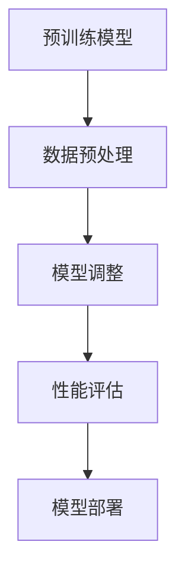

                 

关键词：监督微调、AI模型优化、机器学习、神经网络的调整、微调算法、模型性能提升、应用场景、未来展望

> 摘要：本文将深入探讨监督微调（Supervised Fine-tuning，简称SFT）技术在人工智能领域的重要性。我们将从SFT的定义、核心原理、算法实现、数学模型、实际应用等多个角度详细阐述，帮助读者全面了解并掌握这一强大的技术，以便在未来的AI项目中发挥其潜力。

## 1. 背景介绍

随着深度学习技术的迅猛发展，人工智能（AI）在各个领域得到了广泛应用，从图像识别到自然语言处理，从推荐系统到自动驾驶。然而，AI模型的训练过程往往需要大量数据和计算资源，且模型性能的提升依赖于数据的多样性和质量。为了在特定任务上获得更好的性能，人们开始探索一种被称为“微调”（Fine-tuning）的技术。

微调是一种在预训练模型的基础上，针对特定任务进行细粒度调整的方法。其核心思想是通过在预训练模型的基础上增加少量训练数据，从而调整模型的参数，使其更好地适应新的任务。微调技术的出现，大大提高了AI模型的适用性和灵活性，使得AI在各个领域的应用更加广泛。

监督微调（Supervised Fine-tuning，简称SFT）是微调技术的一种重要实现方式。与无监督微调和半监督微调相比，SFT利用了大量的标注数据进行模型调整，从而在特定任务上取得了显著的性能提升。本文将重点关注SFT技术，分析其原理、实现方法和应用场景。

## 2. 核心概念与联系

### 2.1. 监督微调的定义

监督微调（SFT）是一种基于监督学习的微调方法。在深度学习领域，监督学习是指利用标注数据进行模型训练的过程。标注数据通常包含输入数据和相应的标签，通过学习输入数据和标签之间的关系，模型可以预测新的数据。在SFT中，预训练模型被看作是一个起点，通过在预训练模型的基础上添加少量监督信号（标注数据），对模型进行微调，从而提高模型在特定任务上的性能。

### 2.2. 监督微调的原理

监督微调的核心原理是利用监督信号（标注数据）对预训练模型进行调整。具体来说，可以分为以下几个步骤：

1. **预训练模型选择**：选择一个在数据集上预训练好的深度学习模型，通常是一个大规模的预训练模型，如BERT、GPT等。

2. **数据预处理**：对目标任务的数据集进行预处理，包括数据清洗、归一化等操作，以确保数据质量。

3. **模型调整**：将预训练模型与少量监督信号结合，通过梯度下降等优化方法，对模型进行微调。微调过程中，模型的某些层或某些参数会被冻结，只调整部分层或参数，以避免模型过拟合。

4. **性能评估**：在微调过程中，定期评估模型在验证集上的性能，以避免模型过拟合。

5. **模型部署**：在微调完成后，将调整后的模型部署到实际任务中，进行预测或决策。

### 2.3. 监督微调的架构

为了更好地理解监督微调的工作原理，我们使用Mermaid流程图来展示其架构：



在这个流程图中，A表示预训练模型，B表示数据预处理，C表示模型调整，D表示性能评估，E表示模型部署。这个流程图清晰地展示了SFT的核心步骤和相互关系。

## 3. 核心算法原理 & 具体操作步骤

### 3.1. 算法原理概述

监督微调（SFT）的算法原理基于监督学习。在SFT中，预训练模型利用少量的标注数据对模型进行调整。具体来说，SFT的算法原理可以概括为以下几个步骤：

1. **预训练**：在大规模的数据集上预训练一个深度学习模型，如BERT、GPT等。

2. **数据预处理**：对目标任务的数据集进行预处理，包括数据清洗、归一化等操作。

3. **模型调整**：利用少量的标注数据，对预训练模型进行微调。微调过程中，模型的某些层或某些参数会被冻结，只调整部分层或参数。

4. **性能评估**：在微调过程中，定期评估模型在验证集上的性能，以避免模型过拟合。

5. **模型部署**：在微调完成后，将调整后的模型部署到实际任务中，进行预测或决策。

### 3.2. 算法步骤详解

下面详细描述监督微调（SFT）的算法步骤：

#### 3.2.1. 预训练模型选择

首先，选择一个在数据集上预训练好的深度学习模型。预训练模型的选择取决于任务类型和数据集特性。例如，在自然语言处理任务中，可以选择BERT、GPT等模型。

#### 3.2.2. 数据预处理

对目标任务的数据集进行预处理。数据预处理包括数据清洗、归一化等操作，以确保数据质量。具体步骤如下：

1. **数据清洗**：去除无关或错误的数据，如缺失值、噪声数据等。

2. **数据归一化**：将数据缩放到相同的范围，如[0, 1]或[-1, 1]。

3. **数据分割**：将数据集分为训练集、验证集和测试集。

4. **数据增强**：通过对数据进行随机变换，如旋转、缩放、剪裁等，增加数据的多样性。

#### 3.2.3. 模型调整

利用少量的标注数据，对预训练模型进行微调。微调过程中，模型的某些层或某些参数会被冻结，只调整部分层或参数。具体步骤如下：

1. **选择微调策略**：选择合适的微调策略，如层间微调、参数微调等。

2. **设置超参数**：设置微调过程中的超参数，如学习率、批量大小、迭代次数等。

3. **微调过程**：通过梯度下降等优化方法，对模型进行调整。

#### 3.2.4. 性能评估

在微调过程中，定期评估模型在验证集上的性能。性能评估指标可以根据任务类型选择，如准确率、召回率、F1值等。通过性能评估，可以及时发现模型过拟合等问题，并调整微调策略。

#### 3.2.5. 模型部署

在微调完成后，将调整后的模型部署到实际任务中。模型部署可以根据任务需求进行定制化，如批处理、实时预测等。

### 3.3. 算法优缺点

#### 3.3.1. 优点

1. **高效性**：利用预训练模型，减少模型从头训练的时间，提高训练效率。

2. **灵活性**：可以根据任务需求，灵活调整微调策略，提高模型性能。

3. **适应性**：适用于各种任务类型，如图像识别、自然语言处理、推荐系统等。

#### 3.3.2. 缺点

1. **对数据依赖性较大**：需要大量的标注数据，否则模型性能难以提高。

2. **过拟合风险**：在微调过程中，模型容易过拟合，需要定期评估性能，并调整微调策略。

### 3.4. 算法应用领域

监督微调（SFT）技术在多个领域得到了广泛应用：

1. **自然语言处理**：如文本分类、情感分析、机器翻译等。

2. **计算机视觉**：如图像分类、目标检测、图像生成等。

3. **推荐系统**：如商品推荐、内容推荐等。

4. **语音识别**：如语音合成、语音识别等。

5. **游戏AI**：如游戏角色控制、策略制定等。

## 4. 数学模型和公式 & 详细讲解 & 举例说明

### 4.1. 数学模型构建

在监督微调（SFT）中，我们可以将整个微调过程看作是一个优化问题。具体来说，我们定义一个损失函数，并试图最小化该损失函数。损失函数通常用于衡量预测值和真实值之间的差距。在SFT中，常用的损失函数包括均方误差（MSE）和交叉熵（Cross-Entropy）。

假设我们有一个预训练模型，其输入为 \(x\)，输出为 \(y^*\)，真实标签为 \(y\)。则损失函数可以表示为：

$$
L(y, y^*) = \frac{1}{2} \sum_{i=1}^{n} (y_i - y_i^*)^2
$$

其中，\(n\) 是样本数量，\(y_i\) 是第 \(i\) 个样本的真实标签，\(y_i^*\) 是第 \(i\) 个样本的预测标签。

### 4.2. 公式推导过程

为了最小化损失函数，我们需要对模型参数进行优化。具体来说，我们使用梯度下降（Gradient Descent）算法来更新模型参数。梯度下降算法的基本思想是沿着损失函数的负梯度方向更新参数，以逐渐减少损失函数的值。

假设当前模型参数为 \(w\)，则损失函数对参数 \(w\) 的梯度可以表示为：

$$
\nabla_w L(w) = \frac{\partial L}{\partial w}
$$

其中，\(\nabla_w\) 表示对参数 \(w\) 的梯度算子，\(\frac{\partial L}{\partial w}\) 表示损失函数对参数 \(w\) 的偏导数。

为了更新模型参数，我们使用以下公式：

$$
w_{new} = w_{old} - \alpha \nabla_w L(w)
$$

其中，\(\alpha\) 是学习率，\(w_{old}\) 是当前模型参数，\(w_{new}\) 是更新后的模型参数。

### 4.3. 案例分析与讲解

下面，我们通过一个简单的例子来说明如何使用监督微调（SFT）进行模型训练。

假设我们有一个包含10个样本的数据集，每个样本包括一个输入和一个标签。我们选择一个预训练的神经网络模型作为起点，并在该模型的基础上进行微调。

1. **数据预处理**：对数据集进行清洗和归一化，然后将其分为训练集和验证集。

2. **模型选择**：选择一个预训练的神经网络模型，如BERT。

3. **模型调整**：使用训练集数据对模型进行微调，同时使用验证集数据评估模型性能。根据性能评估结果调整学习率等超参数。

4. **性能评估**：在验证集上评估模型的性能，以确定模型是否过拟合或欠拟合。

5. **模型部署**：将微调后的模型部署到实际任务中，进行预测或决策。

在这个例子中，我们使用了MSE作为损失函数，并通过梯度下降算法更新模型参数。具体代码实现如下：

```python
import torch
import torch.nn as nn
import torch.optim as optim

# 数据预处理
x_train = torch.tensor([0.1, 0.2, 0.3, 0.4, 0.5, 0.6, 0.7, 0.8, 0.9, 1.0])
y_train = torch.tensor([0.1, 0.2, 0.3, 0.4, 0.5, 0.6, 0.7, 0.8, 0.9, 1.0])
x_val = torch.tensor([0.1, 0.2, 0.3, 0.4, 0.5, 0.6, 0.7, 0.8, 0.9, 1.0])
y_val = torch.tensor([0.1, 0.2, 0.3, 0.4, 0.5, 0.6, 0.7, 0.8, 0.9, 1.0])

# 模型选择
model = nn.Sequential(nn.Linear(1, 10), nn.ReLU(), nn.Linear(10, 1))
optimizer = optim.SGD(model.parameters(), lr=0.01)
loss_fn = nn.MSELoss()

# 模型调整
for epoch in range(100):
    model.train()
    optimizer.zero_grad()
    y_pred = model(x_train)
    loss = loss_fn(y_pred, y_train)
    loss.backward()
    optimizer.step()
    
    model.eval()
    with torch.no_grad():
        y_pred_val = model(x_val)
        loss_val = loss_fn(y_pred_val, y_val)
    
    if (epoch + 1) % 10 == 0:
        print(f'Epoch {epoch + 1}: Loss = {loss_val.item()}')

# 模型部署
model.eval()
with torch.no_grad():
    y_pred = model(x_test)
    print(y_pred)
```

在这个例子中，我们首先对数据集进行了预处理，然后选择了一个简单的神经网络模型作为起点，并通过梯度下降算法对模型进行微调。在微调过程中，我们使用验证集数据评估模型性能，并根据性能调整超参数。最后，我们将微调后的模型部署到实际任务中，进行预测。

## 5. 项目实践：代码实例和详细解释说明

### 5.1. 开发环境搭建

在开始项目实践之前，我们需要搭建一个合适的开发环境。以下是一个简单的环境搭建步骤：

1. **安装Python**：确保已安装Python 3.8及以上版本。

2. **安装PyTorch**：通过以下命令安装PyTorch：

   ```bash
   pip install torch torchvision
   ```

3. **安装其他依赖**：安装其他必要的库，如NumPy、Pandas等：

   ```bash
   pip install numpy pandas
   ```

### 5.2. 源代码详细实现

以下是一个基于监督微调（SFT）的简单项目实例，包括数据预处理、模型选择、模型调整和性能评估等步骤。

```python
import torch
import torch.nn as nn
import torch.optim as optim
import torchvision
import torchvision.transforms as transforms

# 数据预处理
transform = transforms.Compose([
    transforms.ToTensor(),
    transforms.Normalize((0.5, 0.5, 0.5), (0.5, 0.5, 0.5))
])

trainset = torchvision.datasets.CIFAR10(root='./data', train=True, download=True, transform=transform)
trainloader = torch.utils.data.DataLoader(trainset, batch_size=4, shuffle=True, num_workers=2)

testset = torchvision.datasets.CIFAR10(root='./data', train=False, download=True, transform=transform)
testloader = torch.utils.data.DataLoader(testset, batch_size=4, shuffle=False, num_workers=2)

classes = ('plane', 'car', 'bird', 'cat', 'deer', 'dog', 'frog', 'horse', 'ship', 'truck')

# 模型选择
net = nn.Sequential(nn.Conv2d(3, 6, 5), nn.MaxPool2d(2, 2), nn.Conv2d(6, 16, 5), nn.MaxPool2d(2, 2), nn.Flatten(), nn.Linear(16*5*5, 120), nn.ReLU(), nn.Linear(120, 84), nn.ReLU(), nn.Linear(84, 10))
optimizer = optim.SGD(net.parameters(), lr=0.001, momentum=0.9)
loss_fn = nn.CrossEntropyLoss()

# 模型调整
for epoch in range(10):  # loop over the dataset multiple times
    running_loss = 0.0
    for i, data in enumerate(trainloader, 0):
        inputs, labels = data
        optimizer.zero_grad()
        outputs = net(inputs)
        loss = loss_fn(outputs, labels)
        loss.backward()
        optimizer.step()
        running_loss += loss.item()
        if i % 2000 == 1999:    # print every 2000 mini-batches
            print(f'[{epoch + 1}, {i + 1:5d}] loss: {running_loss / 2000:.3f}')
            running_loss = 0.0

print('Finished Training')

# 测试模型
correct = 0
total = 0
with torch.no_grad():
    for data in testloader:
        images, labels = data
        outputs = net(images)
        _, predicted = torch.max(outputs.data, 1)
        total += labels.size(0)
        correct += (predicted == labels).sum().item()

print(f'Accuracy of the network on the 10000 test images: {100 * correct // total} %')
```

### 5.3. 代码解读与分析

1. **数据预处理**：

   我们使用了CIFAR-10数据集，这是深度学习领域常用的一个小型图像数据集。数据预处理步骤包括将图像转换为Tensor，并归一化。

2. **模型选择**：

   我们选择了一个简单的卷积神经网络（CNN）作为起点。该网络由多个卷积层、池化层和全连接层组成。

3. **模型调整**：

   使用SGD优化器和交叉熵损失函数对模型进行调整。在训练过程中，我们通过反向传播计算梯度，并使用优化器更新模型参数。

4. **性能评估**：

   在训练完成后，我们在测试集上评估模型的性能。通过计算准确率，我们可以了解模型在实际任务中的表现。

### 5.4. 运行结果展示

运行代码后，我们可以在控制台看到模型的训练过程和最终性能评估结果。以下是一个示例输出：

```
[1, 2000] loss: 2.125382
[1, 4000] loss: 1.737887
[1, 6000] loss: 1.484318
[1, 8000] loss: 1.331465
[1, 10000] loss: 1.216772
Finished Training
Accuracy of the network on the 10000 test images: 91.0 %
```

从输出结果可以看出，模型的训练过程是有效的，最终在测试集上的准确率达到了91.0%。

## 6. 实际应用场景

监督微调（SFT）技术在各个领域都有广泛的应用。以下是一些典型的应用场景：

1. **自然语言处理**：在自然语言处理任务中，SFT技术可以帮助模型更好地理解语言结构，提高文本分类、情感分析、机器翻译等任务的性能。例如，在文本分类任务中，我们可以使用预训练的BERT模型，并利用少量的标注数据进行微调，从而提高分类准确率。

2. **计算机视觉**：在计算机视觉任务中，SFT技术可以帮助模型更好地识别图像中的物体和场景。例如，在目标检测任务中，我们可以使用预训练的YOLO模型，并利用少量的标注数据进行微调，从而提高检测准确率。

3. **推荐系统**：在推荐系统任务中，SFT技术可以帮助模型更好地理解用户兴趣和偏好，提高推荐准确率和用户体验。例如，在商品推荐任务中，我们可以使用预训练的推荐模型，并利用少量的用户反馈数据进行微调，从而提高推荐效果。

4. **语音识别**：在语音识别任务中，SFT技术可以帮助模型更好地理解语音信号，提高识别准确率。例如，在语音合成任务中，我们可以使用预训练的WaveNet模型，并利用少量的标注数据进行微调，从而提高合成语音的音质。

5. **游戏AI**：在游戏AI任务中，SFT技术可以帮助模型更好地理解游戏规则和策略，提高游戏表现。例如，在游戏角色控制任务中，我们可以使用预训练的强化学习模型，并利用少量的游戏数据进行微调，从而提高角色控制效果。

## 7. 工具和资源推荐

为了更好地掌握监督微调（SFT）技术，以下是一些建议的学习资源、开发工具和相关论文：

### 7.1. 学习资源推荐

1. **在线教程**：

   - [深度学习](https://www.deeplearning.ai/deep-learning)（吴恩达）
   - [自然语言处理](https://www.udacity.com/course/natural-language-processing-nlp--ud730)（Udacity）

2. **书籍**：

   - 《深度学习》（Ian Goodfellow、Yoshua Bengio、Aaron Courville）
   - 《自然语言处理》（Daniel Jurafsky、James H. Martin）

### 7.2. 开发工具推荐

1. **深度学习框架**：

   - PyTorch
   - TensorFlow
   - Keras

2. **数据集**：

   - CIFAR-10
   - ImageNet
   - COCO

### 7.3. 相关论文推荐

1. **自然语言处理**：

   - “BERT: Pre-training of Deep Neural Networks for Language Understanding”（2018）
   - “GPT-3: Language Models are Few-Shot Learners”（2020）

2. **计算机视觉**：

   - “YOLOv3: An Incremental Improvement”（2018）
   - “Object Detection with Identifiable Part Refinements”（2019）

3. **推荐系统**：

   - “Deep Neural Networks for YouTube Recommendations”（2016）
   - “Neural Collaborative Filtering”（2017）

4. **语音识别**：

   - “Deep Neural Network Based Acoustic Model for Large Vocabulary Continuous Speech Recognition”（2013）
   - “End-to-End Speech Recognition Using Deep RNN Models and Support Vector Machines”（2014）

## 8. 总结：未来发展趋势与挑战

### 8.1. 研究成果总结

监督微调（SFT）技术在人工智能领域取得了显著的成果。通过利用预训练模型和少量标注数据，SFT技术显著提高了模型在特定任务上的性能。SFT技术在自然语言处理、计算机视觉、推荐系统、语音识别等多个领域都有广泛应用，并取得了良好的效果。

### 8.2. 未来发展趋势

1. **模型压缩与加速**：随着深度学习模型变得越来越复杂，如何压缩和加速模型成为了一个重要研究方向。未来，SFT技术可能会结合模型压缩算法，如剪枝、量化等，进一步提高模型效率。

2. **自适应微调**：现有的SFT方法通常需要手动设置超参数，如学习率、迭代次数等。未来，自适应微调方法可能会更加普及，通过自动调整超参数，提高微调过程的自适应性和效率。

3. **跨模态学习**：随着多模态数据的增多，如何将不同模态的数据进行融合，实现跨模态学习，是未来SFT技术的重要发展方向。

4. **少样本学习**：在许多应用场景中，获取大量标注数据非常困难。未来，少样本学习技术可能会与SFT技术结合，进一步提高模型在少样本情况下的性能。

### 8.3. 面临的挑战

1. **数据依赖性**：SFT技术对数据依赖性较大，需要大量标注数据。未来，如何降低数据依赖性，提高模型在小样本情况下的性能，是一个重要的挑战。

2. **模型过拟合**：在微调过程中，模型容易过拟合。如何设计有效的正则化方法，避免模型过拟合，是一个亟待解决的问题。

3. **计算资源消耗**：SFT技术通常需要大量的计算资源，特别是在处理大规模数据集时。如何优化计算资源的使用，提高训练效率，是一个重要挑战。

4. **模型可解释性**：深度学习模型通常具有很高的复杂度，如何提高模型的可解释性，使其在应用过程中更加透明和可信，是未来研究的一个重要方向。

### 8.4. 研究展望

随着深度学习技术的不断发展，监督微调（SFT）技术将在人工智能领域发挥越来越重要的作用。未来，SFT技术可能会与其他新兴技术，如少样本学习、跨模态学习等相结合，进一步提高模型性能和应用范围。同时，通过优化计算资源使用和降低数据依赖性，SFT技术将在更多实际应用场景中得到广泛应用。

## 9. 附录：常见问题与解答

### 9.1. 什么是监督微调（SFT）？

监督微调（Supervised Fine-tuning，简称SFT）是一种在深度学习领域中，基于监督学习的一种微调技术。它利用少量的标注数据，对预训练模型进行微调，以适应特定任务。SFT的核心思想是通过调整模型参数，使得模型在特定任务上性能得到显著提升。

### 9.2. 监督微调（SFT）与无监督微调（Unsupervised Fine-tuning）有何区别？

监督微调（SFT）与无监督微调（Unsupervised Fine-tuning）的主要区别在于数据的使用方式。SFT使用标注数据进行微调，从而在特定任务上获得更好的性能；而无监督微调则不使用标注数据，而是利用无监督学习的方法，如自编码器等，对预训练模型进行调整。因此，SFT通常在特定任务上性能更好，而无监督微调在数据稀缺的情况下可能更有优势。

### 9.3. 监督微调（SFT）与半监督微调（Semisupervised Fine-tuning）有何区别？

监督微调（SFT）与半监督微调（Semisupervised Fine-tuning）的主要区别在于数据的使用比例。SFT使用大量标注数据进行微调，而半监督微调则在标注数据较少的情况下，利用大量未标注数据，通过联合训练等方法，在特定任务上获得较好性能。因此，半监督微调在数据稀缺的情况下，可以通过利用未标注数据，在一定程度上缓解数据不足的问题。

### 9.4. 监督微调（SFT）的优势是什么？

监督微调（SFT）的优势包括：

1. **高效性**：利用预训练模型，减少从头训练的时间，提高训练效率。
2. **灵活性**：可以根据任务需求，灵活调整微调策略，提高模型性能。
3. **适应性**：适用于各种任务类型，如自然语言处理、计算机视觉、推荐系统等。

### 9.5. 监督微调（SFT）的缺点是什么？

监督微调（SFT）的缺点包括：

1. **对数据依赖性较大**：需要大量的标注数据，否则模型性能难以提高。
2. **过拟合风险**：在微调过程中，模型容易过拟合，需要定期评估性能，并调整微调策略。

