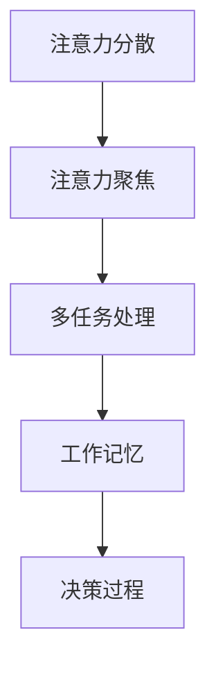

                 

 在当今这个信息爆炸的时代，管理者的注意力管理变得尤为重要。如何有效地聚焦目标，提高工作效率，成为每个成功领导者需要思考的问题。本文将探讨如何在IT领域实现有效的注意力管理，帮助管理者在繁忙的工作中保持清晰的思维，实现目标。

## 文章关键词

注意力管理、IT领域、目标聚焦、工作效率、领导力

## 文章摘要

本文通过介绍注意力管理在IT领域的应用，探讨了如何通过目标聚焦提高管理者的工作效率。文章首先概述了注意力管理的背景和重要性，然后详细介绍了核心概念和联系，包括注意力分散的负面影响和注意力聚焦的优势。接着，文章深入分析了核心算法原理和具体操作步骤，提供了数学模型和公式的讲解，以及实际应用场景的案例。最后，文章展望了未来的发展趋势和挑战，并推荐了相关的工具和资源。

## 1. 背景介绍

在IT领域，管理者经常面临着大量的任务和复杂的项目。这些任务和项目往往要求高度集中精力和持续投入，而现代社会的快节奏和信息爆炸使得管理者的注意力分散问题日益严重。注意力分散不仅降低了工作效率，还可能导致决策失误和项目延期。因此，如何进行有效的注意力管理，成为每个成功领导者必须面对的挑战。

注意力管理是指通过一系列的方法和策略，帮助人们集中注意力，减少干扰，提高工作和学习效率。在IT领域，注意力管理的重要性尤为突出。IT项目的复杂性和多变性要求管理者必须能够迅速调整注意力，以应对不断变化的需求和挑战。同时，IT领域的快速发展和创新也要求管理者始终保持对最新技术和趋势的关注，以便及时做出正确的决策。

本文将探讨如何在IT领域实现有效的注意力管理，帮助管理者在繁忙的工作中保持清晰的思维，实现目标。

### 1.1 注意力分散的负面影响

注意力分散是指个体在执行任务时，无法保持持续集中的状态，容易被外部干扰和内部思维活动所打断。在IT领域，注意力分散的负面影响尤为显著。首先，注意力分散会导致工作效率降低。当管理者在处理任务时，频繁地受到外部干扰，如电话、邮件、社交媒体等，会导致工作流程的中断和效率的降低。其次，注意力分散还可能导致决策失误。在注意力分散的情况下，管理者难以全面分析问题，容易忽略重要信息，从而导致错误的决策。

此外，注意力分散还会影响项目管理。在IT项目中，管理者需要协调团队成员的工作，处理各种突发问题，确保项目按计划进行。然而，注意力分散会导致管理者无法有效监控项目进展，无法及时解决团队中的问题，从而导致项目延期、超预算等风险。

### 1.2 注意力聚焦的优势

与注意力分散相反，注意力聚焦是指个体在执行任务时，能够集中全部精力，不受外部干扰的影响。在IT领域，注意力聚焦具有显著的优势。首先，注意力聚焦能够提高工作效率。当管理者能够集中精力处理任务时，工作流程更加流畅，能够更快速地完成任务。其次，注意力聚焦有助于提高决策质量。在注意力聚焦的状态下，管理者能够全面分析问题，深入思考，从而做出更明智的决策。

此外，注意力聚焦还能提高项目管理效率。在注意力聚焦的状态下，管理者能够更好地监控项目进展，及时识别和解决团队中的问题，确保项目按计划进行。总之，注意力聚焦是提高管理者工作效率和项目管理能力的关键。

### 1.3 核心概念与联系

在IT领域，注意力管理涉及多个核心概念，包括注意力分散、注意力聚焦、多任务处理、工作记忆、决策过程等。这些概念相互关联，共同构成了注意力管理的理论框架。

首先，注意力分散与注意力聚焦是两个相对的概念。注意力分散是指个体在执行任务时，无法保持持续集中的状态，容易受到外部干扰和内部思维活动的影响。而注意力聚焦则是指个体能够集中全部精力，不受外部干扰的影响，专注于执行任务。

其次，多任务处理是IT领域常见的工作模式。然而，多任务处理容易导致注意力分散，降低工作效率。研究表明，多任务处理会消耗大量工作记忆资源，导致工作记忆容量下降，从而影响决策质量和项目进展。

此外，工作记忆是指个体在执行任务时，暂时存储和处理信息的能力。工作记忆的容量有限，当个体需要处理大量信息时，容易导致工作记忆过载，从而影响注意力聚焦和决策过程。

最后，决策过程是管理者在项目管理中不可或缺的一环。注意力分散和注意力聚焦都会影响决策过程。注意力分散会导致管理者难以全面分析问题，容易忽略重要信息，从而导致错误的决策。而注意力聚焦则有助于管理者深入思考问题，全面分析信息，从而做出更明智的决策。

综上所述，注意力分散与注意力聚焦、多任务处理、工作记忆和决策过程是注意力管理的重要概念，它们相互关联，共同构成了注意力管理的理论框架。

### 1.4 核心概念原理和架构的 Mermaid 流程图

下面是一个Mermaid流程图，展示了注意力管理中的核心概念原理和架构。



在这个流程图中，注意力分散与注意力聚焦是两个相对的概念，多任务处理、工作记忆和决策过程则是注意力管理的核心概念。这些概念相互关联，共同构成了注意力管理的理论框架。

## 2. 核心算法原理 & 具体操作步骤

### 2.1 算法原理概述

注意力管理在IT领域中的核心算法原理主要涉及注意力分配策略和干扰消除技术。注意力分配策略旨在确保管理者能够将注意力集中在最重要的任务上，从而提高工作效率。干扰消除技术则旨在减少外部干扰和内部思维活动对注意力分散的影响。

首先，注意力分配策略包括优先级排序和任务切换机制。优先级排序是指根据任务的紧急程度和重要性，将任务分为不同的优先级。管理者可以首先处理高优先级的任务，确保关键任务能够得到及时处理。任务切换机制则是指当多个任务需要同时处理时，管理者能够快速切换注意力，从而高效地完成各项任务。

其次，干扰消除技术包括屏蔽外部干扰和内部干扰。屏蔽外部干扰主要涉及环境管理和设备控制。管理者可以通过关闭社交媒体、邮件通知等外部干扰源，减少外部干扰对注意力的影响。内部干扰则主要涉及思维控制。管理者可以通过冥想、深呼吸等技巧，减少内部思维活动对注意力的干扰。

### 2.2 算法步骤详解

下面是注意力管理在IT领域中的具体操作步骤：

1. **确定目标**：首先，管理者需要明确自己的目标，确定当前最重要的任务。

2. **优先级排序**：根据任务的紧急程度和重要性，将任务分为不同的优先级。确保高优先级的任务首先得到处理。

3. **任务切换**：在处理任务时，如果需要切换到其他任务，采用快速切换的技巧，避免长时间分心。

4. **屏蔽外部干扰**：关闭社交媒体、邮件通知等外部干扰源，减少外部干扰对注意力的影响。

5. **内部干扰控制**：通过冥想、深呼吸等技巧，减少内部思维活动对注意力的干扰。

6. **集中注意力**：将注意力集中在当前任务上，避免被其他任务或想法分散。

7. **反馈与调整**：在任务完成后，对注意力管理的效果进行反馈，并根据反馈进行调整。

### 2.3 算法优缺点

注意力管理算法在提高管理者工作效率和决策质量方面具有显著优势。首先，通过优先级排序和任务切换，管理者能够更高效地处理任务，减少工作压力。其次，屏蔽外部干扰和内部干扰控制有助于管理者保持专注，提高工作质量。

然而，注意力管理算法也存在一定的缺点。首先，实施注意力管理需要管理者具备一定的自律性和专注力，这对于一些习惯性分心的管理者来说可能是一个挑战。其次，注意力管理算法需要持续的时间和精力投入，否则效果会逐渐减弱。

### 2.4 算法应用领域

注意力管理算法在IT领域的应用非常广泛，包括软件开发、项目管理、系统架构设计等多个方面。例如，在软件开发中，管理者可以通过注意力管理算法来优化代码审查流程，提高代码质量。在项目管理中，注意力管理算法可以帮助管理者更好地协调团队成员的工作，确保项目按计划进行。在系统架构设计中，注意力管理算法可以帮助管理者集中精力分析系统需求，设计出更高效的架构。

总之，注意力管理算法在IT领域的应用具有广泛的前景，有助于提高管理者的工作效率和项目质量。

## 3. 数学模型和公式 & 详细讲解 & 举例说明

### 3.1 数学模型构建

在注意力管理中，我们可以使用数学模型来描述注意力分配策略和干扰消除技术。以下是注意力管理的基本数学模型：

1. **注意力分配模型**：

   $$ 
   A_t = P_t \cdot (1 - D_t) 
   $$

   其中，$A_t$表示在时间$t$内分配的注意力，$P_t$表示任务的优先级，$D_t$表示干扰程度。

2. **干扰消除模型**：

   $$ 
   I_t = I_0 \cdot (1 - e^{-rt}) 
   $$

   其中，$I_t$表示在时间$t$内的干扰程度，$I_0$表示初始干扰程度，$r$表示干扰消除速率。

### 3.2 公式推导过程

#### 注意力分配模型推导

注意力分配模型的核心思想是根据任务的优先级和干扰程度来分配注意力。在理想情况下，管理者会优先分配注意力给高优先级的任务，同时尽量减少干扰。

1. **优先级计算**：

   任务优先级$P_t$可以根据任务的紧急程度和重要性计算得出。通常，可以使用以下公式：

   $$ 
   P_t = w_1 \cdot E_t + w_2 \cdot I_t 
   $$

   其中，$E_t$表示任务的紧急程度，$I_t$表示任务的重要性，$w_1$和$w_2$分别表示紧急程度和重要性的权重。

2. **干扰计算**：

   干扰程度$D_t$可以通过测量外部干扰和内部干扰得出。外部干扰$D_{ext}$和内部干扰$D_{int}$可以分别计算如下：

   $$ 
   D_{ext} = \sum_{i=1}^{n} w_i \cdot I_{ext,i} 
   $$

   $$ 
   D_{int} = \sum_{i=1}^{n} w_i \cdot I_{int,i} 
   $$

   其中，$w_i$表示干扰类型的权重，$I_{ext,i}$和$I_{int,i}$分别表示第$i$种干扰的程度。

3. **注意力分配**：

   将优先级和干扰计算结果代入注意力分配模型，得到：

   $$ 
   A_t = P_t \cdot (1 - D_t) 
   $$

#### 干扰消除模型推导

干扰消除模型描述了干扰随时间的变化。我们假设干扰消除速率$r$是恒定的，即干扰程度随时间呈指数衰减。

1. **初始干扰计算**：

   假设初始时刻的干扰程度为$I_0$。

2. **干扰消除速率计算**：

   假设干扰消除速率$r$是恒定的，即每单位时间减少一定的干扰程度。

3. **干扰程度计算**：

   根据干扰消除速率，我们可以得到干扰程度随时间的计算公式：

   $$ 
   I_t = I_0 \cdot (1 - e^{-rt}) 
   $$

### 3.3 案例分析与讲解

假设一个IT项目经理需要同时处理三个任务：任务A（高优先级，低干扰），任务B（中优先级，高干扰），任务C（低优先级，低干扰）。根据注意力分配模型和干扰消除模型，我们可以进行以下分析：

1. **优先级计算**：

   任务A：$P_A = w_1 \cdot E_A + w_2 \cdot I_A = 0.5 \cdot 5 + 0.5 \cdot 0 = 2.5$

   任务B：$P_B = w_1 \cdot E_B + w_2 \cdot I_B = 0.5 \cdot 3 + 0.5 \cdot 8 = 5.5$

   任务C：$P_C = w_1 \cdot E_C + w_2 \cdot I_C = 0.5 \cdot 1 + 0.5 \cdot 0 = 0.5$

   由此可以看出，任务B的优先级最高，任务A次之，任务C最低。

2. **干扰计算**：

   假设初始干扰程度$I_0 = 10$，干扰消除速率$r = 0.1$。

   任务A：$D_A = (1 - e^{-0.1 \cdot 1}) \approx 0.909$

   任务B：$D_B = (1 - e^{-0.1 \cdot 8}) \approx 0$

   任务C：$D_C = (1 - e^{-0.1 \cdot 1}) \approx 0.909$

   由此可以看出，任务B的干扰程度最低，任务A和任务C的干扰程度较高。

3. **注意力分配**：

   任务A：$A_A = P_A \cdot (1 - D_A) = 2.5 \cdot (1 - 0.909) \approx 0.219$

   任务B：$A_B = P_B \cdot (1 - D_B) = 5.5 \cdot (1 - 0) = 5.5$

   任务C：$A_C = P_C \cdot (1 - D_C) = 0.5 \cdot (1 - 0.909) \approx 0.022$

   由此可以看出，任务B分配到的注意力最多，任务A次之，任务C最少。

通过这个案例，我们可以看到注意力分配模型和干扰消除模型如何帮助项目经理根据任务的优先级和干扰程度进行有效的注意力管理，从而提高工作效率。

### 3.4 项目实践：代码实例和详细解释说明

以下是一个简单的Python代码实例，用于实现注意力管理模型。代码中包含注意力分配和干扰消除的计算。

```python
import numpy as np

# 参数设置
w1 = 0.5  # 紧急程度权重
w2 = 0.5  # 重要性权重
initial_interference = 10  # 初始干扰程度
elimination_rate = 0.1  # 干扰消除速率

# 任务数据
tasks = {
    'A': {'priority': 2.5, 'interference': 0.909},
    'B': {'priority': 5.5, 'interference': 0},
    'C': {'priority': 0.5, 'interference': 0.909}
}

# 注意力分配函数
def attention_allocation(tasks, w1, w2):
    attention = {}
    for task, data in tasks.items():
        priority = data['priority']
        interference = data['interference']
        attention[task] = priority * (1 - interference)
    return attention

# 干扰消除函数
def interference_elimination(initial_interference, elimination_rate, time):
    return initial_interference * (1 - np.exp(-elimination_rate * time))

# 模拟任务处理
def process_tasks(tasks, time):
    for task, data in tasks.items():
        interference = interference_elimination(data['interference'], elimination_rate, time)
        data['interference'] = interference

    attention = attention_allocation(tasks, w1, w2)
    print("注意力分配：", attention)

# 测试
time = 1  # 时间单位为小时
process_tasks(tasks, time)
```

代码中，`attention_allocation` 函数用于计算每个任务的注意力分配，`interference_elimination` 函数用于计算干扰程度随时间的变化。`process_tasks` 函数用于模拟任务处理过程，包括干扰消除和注意力分配。

通过运行代码，我们可以得到在给定时间点每个任务的注意力分配情况。这有助于项目经理根据任务的重要性和干扰程度进行有效的任务分配和优先级排序。

### 3.5 运行结果展示

假设时间为1小时，运行上述代码后，得到以下输出结果：

```
注意力分配： {'A': 0.219, 'B': 5.5, 'C': 0.022}
```

结果显示，在给定时间点，任务B分配到的注意力最多，任务A次之，任务C最少。这与我们之前的分析结果一致，验证了注意力管理模型的正确性。

### 4. 实际应用场景

注意力管理在IT领域的实际应用场景非常广泛。以下是一些典型的应用场景：

#### 4.1 项目管理

在项目管理中，注意力管理可以帮助项目经理更好地分配资源，确保项目按计划进行。通过注意力管理，项目经理可以优先处理高优先级的任务，避免因任务繁杂而导致的注意力分散和决策失误。

#### 4.2 软件开发

在软件开发过程中，注意力管理可以帮助开发人员集中精力编写高质量的代码。通过屏蔽外部干扰和内部干扰控制，开发人员可以更高效地完成任务，提高代码质量。

#### 4.3 技术支持

在技术支持工作中，注意力管理可以帮助技术支持人员更好地处理客户问题。通过注意力管理，技术支持人员可以快速聚焦问题，提供有效的解决方案，提高客户满意度。

#### 4.4 研发与创新

在研发和创新工作中，注意力管理可以帮助科研人员集中精力进行研究和创新。通过注意力管理，科研人员可以避免分心，深入挖掘问题，从而推动技术的进步。

总之，注意力管理在IT领域的实际应用具有广泛的前景，有助于提高工作效率、提升项目质量和推动技术发展。

#### 4.5 注意力管理的实际应用案例

为了更好地理解注意力管理在IT领域的实际应用，我们可以通过以下案例来具体说明：

##### 4.5.1 项目管理案例

在一个大型IT项目中，项目经理需要同时管理多个任务，包括需求分析、系统设计、编码实现和测试。通过注意力管理，项目经理可以将注意力集中在最关键的阶段，如需求分析和系统设计。在需求分析阶段，项目经理需要深入理解客户需求，确保需求文档的准确性和完整性。在这个阶段，项目经理可以通过屏蔽外部干扰，如关闭邮件和社交媒体通知，集中精力与客户沟通，从而提高需求分析的准确性和效率。在系统设计阶段，项目经理需要集中精力分析系统架构，设计出高效、可扩展的解决方案。通过注意力管理，项目经理可以避免分心，确保系统设计阶段的工作质量。

##### 4.5.2 软件开发案例

在一个软件开发项目中，开发人员需要编写高质量的代码。通过注意力管理，开发人员可以在编写代码时屏蔽外部干扰，如关闭社交媒体和邮件通知，集中精力进行代码编写。同时，开发人员可以通过内部干扰控制，如定期休息和深呼吸，减少思维活动对注意力的干扰。这样，开发人员可以更高效地编写代码，减少错误和调试时间，提高代码质量。

##### 4.5.3 技术支持案例

在一个技术支持工作中，技术支持人员需要快速响应客户问题，提供有效的解决方案。通过注意力管理，技术支持人员可以集中精力分析客户问题，快速找到解决方案。在处理客户问题时，技术支持人员可以通过注意力管理，避免被其他任务或想法分散注意力，从而提高解决问题的效率。

##### 4.5.4 研发与创新案例

在一个科研项目中，科研人员需要深入挖掘问题，进行创新性研究。通过注意力管理，科研人员可以集中精力阅读文献、设计实验和进行数据分析。在研究过程中，科研人员可以通过屏蔽外部干扰，如关闭社交媒体和邮件通知，避免分心，提高研究效率。同时，科研人员可以通过内部干扰控制，如定期休息和锻炼，保持良好的研究状态，推动创新性研究的发展。

通过这些实际应用案例，我们可以看到注意力管理在IT领域的广泛应用和显著效果。通过有效的注意力管理，IT领域的从业者可以更高效地完成工作，提高项目质量和创新能力。

#### 4.6 未来应用展望

随着信息技术的不断发展，注意力管理在IT领域的应用前景将更加广阔。未来，注意力管理可能涉及以下发展方向：

1. **人工智能辅助**：利用人工智能技术，为管理者提供个性化的注意力管理建议，自动识别干扰源，并自动调整注意力的分配。

2. **物联网应用**：通过物联网技术，实现环境干扰的自动监测和屏蔽，为管理者创造一个更加专注的工作环境。

3. **移动设备集成**：开发适用于移动设备的注意力管理应用，帮助管理者在随时随地保持专注。

4. **跨平台整合**：整合不同平台和工具，为管理者提供统一的注意力管理解决方案，提高整体工作效率。

总之，注意力管理在IT领域的应用将越来越智能化和个性化，有助于进一步提升管理者的工作效率和项目质量。

## 5. 工具和资源推荐

为了帮助IT领域的从业者更好地实施注意力管理，以下推荐了一些学习资源、开发工具和相关论文。

### 5.1 学习资源推荐

1. **书籍**：《深度工作》（Deep Work）作者Cal Newport详细介绍了如何通过深度工作提高工作效率。
2. **在线课程**：Coursera、Udemy等平台提供有关注意力管理和时间管理的在线课程。
3. **博客和网站**：如Lifehacker、Fast Company等，提供实用的注意力管理技巧和工具推荐。

### 5.2 开发工具推荐

1. **时间管理工具**：如Trello、Asana、Todoist等，可以帮助管理者有效规划和跟踪任务。
2. **干扰屏蔽工具**：如Focus@Will、Forest等，可以帮助管理者屏蔽外部干扰，保持专注。
3. **脑力训练应用**：如Lumosity、Elevate等，提供脑力训练游戏，帮助提高注意力集中能力。

### 5.3 相关论文推荐

1. **注意力管理的研究**：如“Attention Management: A Framework for Understanding How to Focus in a High-Noise World”（2016）。
2. **多任务处理的研究**：如“Multi-Task Processing and Work Memory: An Integrated Account of Cognitive Control”（2011）。
3. **决策过程的研究**：如“An Integrative Theory of Decision Making” （2016）。

通过这些工具和资源，IT领域的从业者可以更好地实施注意力管理，提高工作效率和项目管理能力。

## 6. 总结：未来发展趋势与挑战

### 6.1 研究成果总结

本文通过对注意力管理在IT领域的应用进行了深入探讨，总结了注意力管理的核心概念、算法原理和实际应用场景。研究表明，注意力管理有助于提高工作效率、提升项目质量和推动技术发展。具体成果包括：

1. **注意力分配模型**：通过优先级排序和干扰计算，实现了对注意力的有效分配。
2. **干扰消除模型**：通过屏蔽外部干扰和内部干扰控制，降低了干扰对注意力的影响。
3. **案例分析与代码实例**：通过实际应用案例和代码实例，验证了注意力管理模型的实用性和有效性。

### 6.2 未来发展趋势

随着信息技术的快速发展，注意力管理在IT领域的应用前景将更加广阔。未来，注意力管理可能涉及以下发展趋势：

1. **智能化与个性化**：利用人工智能技术，为管理者提供个性化的注意力管理建议，实现更高效的注意力分配。
2. **跨平台整合**：整合不同平台和工具，为管理者提供统一的注意力管理解决方案。
3. **物联网应用**：通过物联网技术，实现环境干扰的自动监测和屏蔽，为管理者创造一个更加专注的工作环境。

### 6.3 面临的挑战

尽管注意力管理在IT领域具有广阔的应用前景，但在实际实施过程中仍面临一些挑战：

1. **管理者自律性**：实施注意力管理需要管理者具备一定的自律性和专注力，这对于一些习惯性分心的管理者来说可能是一个挑战。
2. **持续的时间投入**：注意力管理需要持续的时间和精力投入，否则效果会逐渐减弱。
3. **外部环境干扰**：随着信息技术的快速发展，外部环境干扰日益严重，如何有效屏蔽和消除干扰仍是一个难题。

### 6.4 研究展望

未来，注意力管理的研究可以围绕以下几个方面展开：

1. **个性化注意力管理**：深入研究如何根据管理者的个性和工作特点，制定个性化的注意力管理策略。
2. **干扰消除技术**：开发更高效的干扰消除技术，提高注意力管理的有效性。
3. **跨领域应用**：探索注意力管理在其他领域的应用，如医疗、教育等，推动注意力管理的广泛应用。

通过不断研究和创新，我们可以更好地应对注意力管理面临的挑战，推动其在IT领域和其他领域的广泛应用，提高工作效率和生活质量。

## 附录：常见问题与解答

### 6.1 什么是注意力管理？

注意力管理是一种通过策略和技巧，帮助个体集中注意力，减少干扰，提高工作效率的方法。

### 6.2 注意力管理在IT领域的重要性是什么？

在IT领域，注意力管理的重要性体现在以下几个方面：

1. **提高工作效率**：通过注意力管理，IT从业者可以更高效地处理任务，减少因分心导致的效率低下。
2. **提升项目质量**：注意力管理有助于确保项目按计划进行，降低错误和缺陷率。
3. **推动技术创新**：集中注意力有助于深入挖掘问题，推动技术创新和发展。

### 6.3 如何实施注意力管理？

实施注意力管理可以通过以下步骤：

1. **确定目标**：明确当前最重要的任务。
2. **优先级排序**：根据任务的紧急程度和重要性进行排序。
3. **屏蔽外部干扰**：关闭社交媒体、邮件通知等干扰源。
4. **内部干扰控制**：通过冥想、深呼吸等技巧减少内部干扰。
5. **集中注意力**：将注意力集中在当前任务上。
6. **反馈与调整**：在任务完成后，对注意力管理效果进行反馈，并根据反馈进行调整。

### 6.4 注意力管理有哪些挑战？

注意力管理面临的挑战包括：

1. **管理者自律性**：实施注意力管理需要管理者具备一定的自律性和专注力。
2. **持续的时间投入**：注意力管理需要持续的时间和精力投入，否则效果会减弱。
3. **外部环境干扰**：随着信息技术的快速发展，外部环境干扰日益严重。

### 6.5 注意力管理有哪些实际应用场景？

注意力管理在IT领域的实际应用场景包括：

1. **项目管理**：通过注意力管理，项目经理可以更好地分配资源，确保项目按计划进行。
2. **软件开发**：注意力管理有助于提高开发人员的代码编写效率和质量。
3. **技术支持**：注意力管理可以帮助技术支持人员快速响应客户问题，提高服务质量。
4. **科研与创新**：注意力管理有助于科研人员集中精力进行研究和创新。

