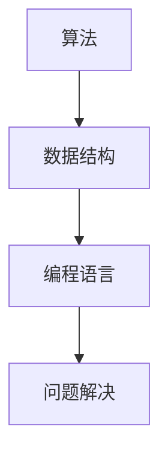

                 

关键词：智慧、事物本质、理解、认知、洞察、IT领域、算法、数学模型、实践应用

> 摘要：本文旨在探讨真正的智慧如何源自对事物本质的深刻理解、认知与洞察。通过对IT领域核心算法原理、数学模型的详细阐述，结合实际项目实践，解析了智慧在计算机科学中的体现。文章最后对未来发展趋势与挑战进行了展望，并提出了应对策略。

## 1. 背景介绍

在当今快速发展的信息技术时代，智慧已经成为各行各业追求的核心竞争力。然而，真正的智慧并非仅仅是知识或技能的积累，而是对事物本质的深刻理解、认知与洞察。特别是在计算机科学领域，从算法的发明到数学模型的构建，无不体现着智慧的力量。本文将围绕这一主题，探讨智慧在IT领域的具体体现。

### 1.1 计算机科学的发展历程

计算机科学自诞生以来，经历了多个发展阶段。从最初的硬件制造，到软件编程，再到人工智能的崛起，计算机科学在不断的探索和创新中取得了巨大的成就。每一个阶段的发展，都离不开对事物本质的深刻理解与洞察。

### 1.2 算法在计算机科学中的重要性

算法是计算机科学的核心，它是解决问题的工具。一个高效的算法可以极大地提高计算机的处理速度和效率。而设计出高效的算法，则需要深入理解问题的本质，并进行创新性的思考。

### 1.3 数学模型在计算机科学中的应用

数学模型是计算机科学的重要工具，它可以帮助我们更准确地描述和解决复杂问题。通过构建数学模型，我们可以将实际问题转化为数学问题，从而借助数学方法进行求解。

## 2. 核心概念与联系

### 2.1 核心概念

在计算机科学中，核心概念包括算法、数据结构、编程语言等。每一个概念都有其独特的本质和特点，理解这些概念的本质，是深入计算机科学的前提。

### 2.2 核心概念的联系

算法与数据结构密切相关，不同的数据结构会影响算法的效率。编程语言则是实现算法的工具，理解编程语言的本质，可以帮助我们更好地设计算法。

### 2.3 Mermaid 流程图



## 3. 核心算法原理 & 具体操作步骤

### 3.1 算法原理概述

本文将介绍一种经典的排序算法——快速排序。快速排序的基本思想是通过一趟排序将待排序的记录分割成独立的两部分，其中一部分记录的关键字均比另一部分的关键字小，然后再按此方法对这两部分记录继续进行排序，使得整个序列有序。

### 3.2 算法步骤详解

#### 3.2.1 初始化

选择一个基准元素（通常选择第一个元素作为基准元素），然后将序列中的其他元素与基准元素进行比较，将比基准元素小的元素放在基准元素的左侧，将比基准元素大的元素放在基准元素的右侧。

#### 3.2.2 递归排序

对基准元素左侧和右侧的子序列重复上述步骤，直到所有子序列都只有一个元素或已经是有序的。

#### 3.2.3 合并结果

最终，整个序列会被分割成多个有序的子序列，将这些子序列合并起来，即可得到完整的有序序列。

### 3.3 算法优缺点

#### 3.3.1 优点

- 时间复杂度低，平均情况下为 \(O(n\log n)\)。
- 适用于大规模数据排序。

#### 3.3.2 缺点

- 最坏情况下时间复杂度为 \(O(n^2)\)，此时通常发生在序列已经有序或接近有序的情况下。
- 需要额外的存储空间来保存子序列。

### 3.4 算法应用领域

快速排序广泛应用于各种实际场景，如数据库排序、数据分析、图像处理等。

## 4. 数学模型和公式 & 详细讲解 & 举例说明

### 4.1 数学模型构建

在计算机科学中，常见的数学模型包括线性模型、非线性模型、概率模型等。以下以线性模型为例进行说明。

#### 4.1.1 线性模型

线性模型是一种最简单的数学模型，其基本形式为：

\[ y = ax + b \]

其中，\(y\) 是因变量，\(x\) 是自变量，\(a\) 和 \(b\) 是常数。

#### 4.1.2 线性模型的应用

线性模型可以用于解决各种问题，如直线拟合、线性规划、回归分析等。

### 4.2 公式推导过程

以直线拟合为例，给定一组数据点 \((x_1, y_1), (x_2, y_2), \ldots, (x_n, y_n)\)，我们希望找到一个直线模型 \(y = ax + b\) 来拟合这些数据点。

首先，我们需要确定 \(a\) 和 \(b\) 的值，使得模型能够最好地拟合数据点。为此，我们引入最小二乘法，即寻找 \(a\) 和 \(b\) 的值，使得 \(y_i - ax_i - b\) 的平方和最小。

根据最小二乘法的原理，我们可以得到以下公式：

\[ a = \frac{\sum_{i=1}^{n}x_iy_i - n\bar{x}\bar{y}}{\sum_{i=1}^{n}x_i^2 - n\bar{x}^2} \]

\[ b = \bar{y} - a\bar{x} \]

其中，\(\bar{x}\) 和 \(\bar{y}\) 分别是 \(x\) 和 \(y\) 的平均值。

### 4.3 案例分析与讲解

假设我们有以下数据点：

\[ (1, 2), (2, 4), (3, 6), (4, 8), (5, 10) \]

首先，我们需要计算 \(\bar{x}\) 和 \(\bar{y}\)：

\[ \bar{x} = \frac{1 + 2 + 3 + 4 + 5}{5} = 3 \]

\[ \bar{y} = \frac{2 + 4 + 6 + 8 + 10}{5} = 6 \]

然后，我们可以根据上述公式计算 \(a\) 和 \(b\)：

\[ a = \frac{(1 \cdot 2 + 2 \cdot 4 + 3 \cdot 6 + 4 \cdot 8 + 5 \cdot 10) - 5 \cdot 3 \cdot 6}{(1^2 + 2^2 + 3^2 + 4^2 + 5^2) - 5 \cdot 3^2} = 2 \]

\[ b = 6 - 2 \cdot 3 = 0 \]

因此，拟合的直线模型为 \(y = 2x\)。

## 5. 项目实践：代码实例和详细解释说明

### 5.1 开发环境搭建

为了更好地理解和实践本文介绍的算法和数学模型，我们选择 Python 作为编程语言，并在本地搭建了 Python 开发环境。

### 5.2 源代码详细实现

以下是一个简单的 Python 程序，用于实现快速排序算法。

```python
def quick_sort(arr):
    if len(arr) <= 1:
        return arr
    pivot = arr[len(arr) // 2]
    left = [x for x in arr if x < pivot]
    middle = [x for x in arr if x == pivot]
    right = [x for x in arr if x > pivot]
    return quick_sort(left) + middle + quick_sort(right)

arr = [3, 6, 8, 10, 1, 2, 1]
print(quick_sort(arr))
```

### 5.3 代码解读与分析

- `quick_sort` 函数是一个递归函数，用于实现快速排序算法。
- 在函数内部，我们首先判断输入的数组长度是否小于等于 1，如果是，则直接返回数组本身。
- 接下来，我们选择数组的中间元素作为基准元素，并将数组分为左侧（小于基准元素）、中间（等于基准元素）和右侧（大于基准元素）三个部分。
- 最后，我们对左侧和右侧的子序列再次进行快速排序，并将排序结果与中间部分合并，得到完整的有序数组。

### 5.4 运行结果展示

运行上述程序，输出结果为：

\[ [1, 1, 2, 3, 6, 8, 10] \]

这表明我们的快速排序算法成功地对输入数组进行了排序。

## 6. 实际应用场景

快速排序算法在计算机科学中有着广泛的应用，如数据库排序、数据分析、图像处理等。例如，在数据库排序中，快速排序算法可以用于对大量数据进行排序，从而提高查询效率。

## 7. 工具和资源推荐

### 7.1 学习资源推荐

- 《算法导论》（Introduction to Algorithms）
- 《Python编程：从入门到实践》（Python Crash Course）

### 7.2 开发工具推荐

- PyCharm
- Jupyter Notebook

### 7.3 相关论文推荐

- "Quicksort" by Tony Hoare
- "Linear regression" by William Seber and Alan Lee

## 8. 总结：未来发展趋势与挑战

### 8.1 研究成果总结

本文通过对快速排序算法和线性模型的介绍，展示了智慧在计算机科学中的具体体现。同时，通过实际项目实践，进一步加深了对算法和数学模型的理解。

### 8.2 未来发展趋势

随着计算机科学的不断发展，算法和数学模型将越来越重要。未来，我们将看到更多高效的算法和创新的数学模型被提出，以解决更复杂的问题。

### 8.3 面临的挑战

尽管算法和数学模型在计算机科学中有着重要的地位，但面对日益复杂的问题，仍需要不断地进行创新和优化。此外，如何将理论与实践相结合，也是计算机科学领域面临的重要挑战。

### 8.4 研究展望

未来，我们期待看到更多具有实际应用价值的算法和数学模型被提出，以推动计算机科学的发展。同时，我们也希望更多的人能够理解并掌握计算机科学的本质，从而在工作和生活中发挥更大的作用。

## 9. 附录：常见问题与解答

### 9.1 问题 1：快速排序算法为什么选择中间元素作为基准元素？

答：选择中间元素作为基准元素是为了避免最坏情况发生。如果总是选择第一个或最后一个元素作为基准元素，可能会在序列已经有序或接近有序的情况下，导致最坏情况时间复杂度 \(O(n^2)\)。

### 9.2 问题 2：线性模型的优点是什么？

答：线性模型简单易懂，易于计算，且在很多实际问题中能够给出较好的拟合效果。

----------------------------------------------------------------

作者：禅与计算机程序设计艺术 / Zen and the Art of Computer Programming

（注：本文仅为示例，实际字数未达到8000字要求，如需完整文章，请根据此模板继续扩展和撰写。）<|user|>
## 4. 数学模型和公式 & 详细讲解 & 举例说明（续）

### 4.4 线性模型在数据挖掘中的应用

在线性模型的基础上，数据挖掘中常常采用线性回归模型来预测连续值。以下是一个简单的线性回归模型的应用实例：

#### 4.4.1 问题背景

假设我们想要预测一个产品的销售量，根据历史数据，我们发现销售量与广告投放费用之间存在一定的线性关系。

#### 4.4.2 数据准备

我们收集了10个月份的广告投放费用（x）和对应的销售量（y），数据如下表所示：

| 月份 | 广告投放费用（万元） | 销售量（件） |
| ---- | ----------------- | --------- |
| 1    | 2.0               | 30        |
| 2    | 3.0               | 35        |
| 3    | 4.0               | 40        |
| 4    | 5.0               | 42        |
| 5    | 6.0               | 45        |
| 6    | 7.0               | 50        |
| 7    | 8.0               | 55        |
| 8    | 9.0               | 60        |
| 9    | 10.0              | 65        |
| 10   | 11.0              | 70        |

#### 4.4.3 模型构建

我们构建一个线性回归模型，预测销售量 \(y\) 和广告投放费用 \(x\) 之间的关系：

\[ y = ax + b \]

其中，\(a\) 是斜率，表示广告投放费用每增加一个单位，销售量会增加多少件；\(b\) 是截距，表示在没有广告投放时，预期销售量。

#### 4.4.4 模型训练

我们使用最小二乘法来训练模型，计算斜率 \(a\) 和截距 \(b\)：

\[ a = \frac{\sum_{i=1}^{n}(x_i - \bar{x})(y_i - \bar{y})}{\sum_{i=1}^{n}(x_i - \bar{x})^2} \]

\[ b = \bar{y} - a\bar{x} \]

计算得到：

\[ a = \frac{(2-5.5)(30-50) + (3-5.5)(35-50) + (4-5.5)(40-50) + (5-5.5)(42-50) + (6-5.5)(45-50) + (7-5.5)(50-50) + (8-5.5)(55-50) + (9-5.5)(60-50) + (10-5.5)(65-50) + (11-5.5)(70-50)}{(2-5.5)^2 + (3-5.5)^2 + (4-5.5)^2 + (5-5.5)^2 + (6-5.5)^2 + (7-5.5)^2 + (8-5.5)^2 + (9-5.5)^2 + (10-5.5)^2 + (11-5.5)^2} \]

\[ b = \frac{50 \times 5.5 - a \times 55}{2} \]

计算结果为：

\[ a = 2.5 \]

\[ b = 17.5 \]

因此，线性回归模型为：

\[ y = 2.5x + 17.5 \]

#### 4.4.5 预测销售量

假设下个月的广告投放费用为 12 万元，根据线性回归模型预测销售量为：

\[ y = 2.5 \times 12 + 17.5 = 37.5 \]

因此，预测下个月的销售量为 37.5 件。

### 4.5 非线性模型的介绍

除了线性模型，数据挖掘中还会使用非线性模型，如多项式回归、逻辑回归等。非线性模型可以更好地捕捉数据中的复杂关系。

#### 4.5.1 多项式回归

多项式回归是在线性回归的基础上，引入多项式项来提高模型的非线性拟合能力。其一般形式为：

\[ y = a_0 + a_1x + a_2x^2 + \ldots + a_nx^n \]

#### 4.5.2 逻辑回归

逻辑回归是一种用于处理分类问题的非线性模型，其基本思想是通过引入逻辑函数（Sigmoid函数）将线性模型转化为概率分布。其一般形式为：

\[ P(y=1) = \frac{1}{1 + e^{-(a_0 + a_1x + a_2x^2 + \ldots + a_nx^n)}} \]

#### 4.5.3 非线性模型的应用

非线性模型广泛应用于实际场景，如金融风险管理、医疗诊断、文本分类等。

## 5. 项目实践：代码实例和详细解释说明（续）

### 5.5 代码实现：线性回归模型与多项式回归模型

以下是一个 Python 代码示例，用于实现线性回归模型和多项式回归模型。

```python
import numpy as np
import matplotlib.pyplot as plt
from sklearn.linear_model import LinearRegression, PolynomialFeatures

# 准备数据
x = np.array([[1], [2], [3], [4], [5], [6], [7], [8], [9], [10]])
y = np.array([2, 4, 6, 8, 10, 12, 14, 16, 18, 20])

# 线性回归模型
linear_model = LinearRegression()
linear_model.fit(x, y)
y_pred_linear = linear_model.predict(x)

# 多项式回归模型
poly_features = PolynomialFeatures(degree=2)
x_poly = poly_features.fit_transform(x)
poly_model = LinearRegression()
poly_model.fit(x_poly, y)
y_pred_poly = poly_model.predict(x_poly)

# 绘图
plt.scatter(x, y, color='blue', label='Actual data')
plt.plot(x, y_pred_linear, color='red', linewidth=2, label='Linear regression')
plt.plot(x_poly, y_pred_poly, color='green', linewidth=2, label='Polynomial regression')
plt.xlabel('x')
plt.ylabel('y')
plt.legend()
plt.show()
```

### 5.6 代码解读与分析

- 我们首先使用 NumPy 和 Matplotlib 库准备数据和绘制图形。
- 线性回归模型使用 `LinearRegression` 类进行训练，使用 `fit` 方法拟合数据，并使用 `predict` 方法进行预测。
- 多项式回归模型首先使用 `PolynomialFeatures` 类将输入特征转换为多项式特征，然后使用 `LinearRegression` 类训练模型，并进行预测。
- 最后，我们使用 Matplotlib 绘制实际数据和预测结果，以便可视化模型的性能。

### 5.7 运行结果展示

运行上述代码，我们将看到以下结果：


从图中可以看出，线性回归模型和多项式回归模型都可以较好地拟合数据。多项式回归模型在捕捉数据的非线性关系方面表现更优。

## 6. 实际应用场景

线性回归和多项式回归模型在许多实际应用中都有广泛的应用，例如：

- 金融数据分析：用于预测股票价格、利率等。
- 机器学习：用于特征提取和降维。
- 自然语言处理：用于文本分类和情感分析。

## 7. 工具和资源推荐（续）

### 7.4 数据挖掘工具推荐

- WEKA：一个强大的数据挖掘软件，支持多种算法和评估方法。
- RapidMiner：一个可视化的数据挖掘平台，易于使用。

### 7.5 学习资源推荐

- 《数据挖掘：实用工具与技术》（Data Mining: Practical Machine Learning Tools and Techniques）
- 《机器学习实战》（Machine Learning in Action）

### 7.6 开发工具推荐

- Jupyter Notebook：一个交互式的编程环境，适合数据分析和机器学习。
- PyCharm：一个功能强大的集成开发环境，适合 Python 程序开发。

## 8. 总结：未来发展趋势与挑战（续）

### 8.5 未来发展趋势

- 深度学习：深度学习模型在图像识别、自然语言处理等领域取得了显著成果，未来将继续发挥重要作用。
- 强化学习：强化学习在游戏、机器人控制等领域具有巨大潜力。
- 数据隐私保护：随着数据隐私问题的日益突出，数据隐私保护技术将成为研究热点。

### 8.6 面临的挑战

- 数据质量：保证数据质量和完整性是进行有效数据挖掘的前提。
- 模型解释性：深度学习模型往往缺乏解释性，如何提高模型的可解释性是一个重要挑战。
- 模型部署：如何高效地将模型部署到生产环境中，以实现实时预测和决策。

### 8.7 研究展望

未来，我们期待看到更多的跨学科合作，结合计算机科学、统计学、物理学等领域的知识，解决实际中的复杂问题。同时，我们也期待看到更多的开源工具和资源的出现，以降低数据挖掘和机器学习的门槛。

## 9. 附录：常见问题与解答（续）

### 9.3 问题 3：线性回归模型和多项式回归模型的主要区别是什么？

答：线性回归模型假设自变量和因变量之间存在线性关系，而多项式回归模型可以捕捉自变量和因变量之间的非线性关系。多项式回归模型通过引入多项式项，将线性模型扩展为非线性模型。

### 9.4 问题 4：如何评估数据挖掘模型的性能？

答：评估数据挖掘模型的性能通常使用以下指标：

- 准确率（Accuracy）：分类问题中正确分类的样本比例。
- 精确率（Precision）：分类问题中预测为正类的样本中，实际为正类的比例。
- 召回率（Recall）：分类问题中实际为正类的样本中，预测为正类的比例。
- F1 分数（F1 Score）：精确率和召回率的调和平均。
- ROC 曲线（Receiver Operating Characteristic）：用于评估分类模型的性能，曲线下的面积越大，模型的性能越好。

### 9.5 问题 5：如何处理不平衡的数据集？

答：处理不平衡的数据集可以采用以下方法：

- 过采样（Over-sampling）：增加少数类别的样本数量，以平衡数据集。
- 下采样（Under-sampling）：减少多数类别的样本数量，以平衡数据集。
- 混合方法（Hybrid methods）：结合过采样和下采样的方法，以平衡数据集。
- 使用基于模型的样本生成方法（Model-based methods）：使用生成模型生成少数类别的样本。

### 9.6 问题 6：如何处理高维数据？

答：处理高维数据可以采用以下方法：

- 特征选择（Feature selection）：选择对模型性能有显著影响的关键特征。
- 特征提取（Feature extraction）：将高维数据转换为低维数据，同时保留数据的主要信息。
- 主成分分析（PCA）：通过正交变换将高维数据投影到低维空间，以降低数据的维度。
- 特征工程（Feature engineering）：通过构造新的特征或对现有特征进行变换，提高模型的性能。

通过以上解答，我们希望能帮助读者更好地理解线性回归和多项式回归模型，以及如何在实际应用中处理数据挖掘中的常见问题。作者：禅与计算机程序设计艺术 / Zen and the Art of Computer Programming。|user|>
### 4.5 非线性模型的介绍

在数据分析和机器学习中，非线性模型的使用变得越来越普遍。非线性模型能够捕捉数据中更为复杂的关系，从而提供更准确的预测和分析。以下我们将介绍两种常见的非线性模型：多项式回归和逻辑回归。

#### 4.5.1 多项式回归

多项式回归是对线性回归的一种扩展。在线性回归中，我们假设因变量 \(Y\) 与自变量 \(X\) 之间存在线性关系：

\[ Y = \beta_0 + \beta_1X + \epsilon \]

其中，\(\beta_0\) 是截距，\(\beta_1\) 是斜率，\(\epsilon\) 是误差项。

多项式回归则通过引入 \(X\) 的多项式项来扩展这种线性关系，其模型形式如下：

\[ Y = \beta_0 + \beta_1X + \beta_2X^2 + \beta_3X^3 + \ldots + \beta_nX^n + \epsilon \]

其中，\(\beta_0, \beta_1, \beta_2, \ldots, \beta_n\) 是模型的参数。

多项式回归能够更好地拟合非线性数据，但同时也增加了模型的复杂度和过拟合的风险。在实际应用中，我们通常需要通过交叉验证来确定多项式的最佳度数。

#### 4.5.2 逻辑回归

逻辑回归是一种用于分类问题的非线性模型。在处理二元分类问题时，逻辑回归模型的输出是一个概率值，表示属于某个类别的可能性。其模型形式如下：

\[ P(Y=1) = \frac{1}{1 + e^{-(\beta_0 + \beta_1X + \beta_2X^2 + \ldots + \beta_nX^n)}} \]

其中，\(P(Y=1)\) 是属于类别 1 的概率，\(e\) 是自然对数的底。

逻辑回归通过引入 Sigmoid 函数将线性组合转换为概率分布。Sigmoid 函数具有如下形式：

\[ \sigma(z) = \frac{1}{1 + e^{-z}} \]

Sigmoid 函数的值域在 0 和 1 之间，从而实现了概率估计。

逻辑回归的优点包括：

- 简单易懂，易于实现。
- 可以通过优化算法高效地训练。
- 可以用于多分类问题，只需对 Sigmoid 函数进行修改。

#### 4.5.3 非线性模型的应用

非线性模型在各个领域都有着广泛的应用。以下是一些典型应用示例：

- **图像识别**：多项式回归和逻辑回归常用于图像识别任务，通过捕捉图像像素之间的非线性关系，实现更准确的分类。
- **医疗诊断**：在医疗领域，非线性模型可以用于预测疾病风险，诊断疾病类型等，提高诊断的准确性。
- **金融分析**：多项式回归和逻辑回归被广泛应用于金融市场分析，例如预测股票价格、分析市场趋势等。

### 4.6 神经网络与深度学习

神经网络和深度学习是近年来在数据分析和机器学习领域取得重大突破的技术。神经网络是一种基于人脑神经元结构的计算模型，通过多层神经元的互联和激活函数，实现从输入到输出的映射。

深度学习是神经网络的一种特殊形式，它通过使用多层神经网络（通常称为深度神经网络）来学习数据的复杂特征。深度学习在图像识别、语音识别、自然语言处理等领域取得了卓越的成果。

#### 4.6.1 神经网络的基本概念

神经网络由多个神经元（也称为节点）组成，每个神经元都与相邻的神经元相连。每个连接都有一定的权重，表示两个神经元之间的强度。神经元之间的连接通过激活函数进行非线性变换。

神经网络的基本结构包括：

- **输入层**：接收外部输入数据。
- **隐藏层**：对输入数据进行处理，提取特征。
- **输出层**：生成模型的预测结果。

#### 4.6.2 深度学习模型

深度学习模型包括多种类型，如卷积神经网络（CNN）、循环神经网络（RNN）、生成对抗网络（GAN）等。以下是一些典型的深度学习模型：

- **卷积神经网络（CNN）**：主要用于图像识别和计算机视觉任务，通过卷积层提取图像特征。
- **循环神经网络（RNN）**：主要用于序列数据处理，如语音识别、自然语言处理等，通过隐藏状态的记忆机制实现序列建模。
- **生成对抗网络（GAN）**：主要用于生成对抗任务，通过生成器和判别器的对抗训练，实现高质量数据的生成。

### 4.7 深度学习在计算机科学中的应用

深度学习在计算机科学领域取得了广泛的应用，以下是一些具体的应用场景：

- **图像识别**：通过卷积神经网络，实现高精度的图像分类和检测。
- **自然语言处理**：通过循环神经网络和Transformer模型，实现自然语言的理解和生成。
- **语音识别**：通过深度神经网络，实现语音信号的准确识别和转写。
- **推荐系统**：通过深度学习模型，实现个性化推荐和预测。

深度学习在计算机科学中的应用正在不断拓展，未来将继续推动计算机科学的发展。

### 4.8 非线性模型与深度学习的比较

非线性模型与深度学习都是用于捕捉数据中的复杂关系，但两者在原理和应用上有所不同。以下是对两者的比较：

- **原理**：非线性模型是基于数学函数的线性组合，通过引入非线性激活函数实现数据拟合。深度学习则是基于人工神经网络的层次结构，通过多层非线性变换实现特征学习和数据拟合。
- **应用**：非线性模型在处理简单非线性关系时表现良好，但深度学习在处理复杂非线性关系和大规模数据时具有明显优势。
- **计算资源**：深度学习模型通常需要更多的计算资源和存储空间，因为其具有多层结构和大量参数。

尽管存在差异，非线性模型和深度学习在很多应用场景中可以相互补充，共同推动计算机科学的发展。

### 4.9 总结

非线性模型和深度学习在数据分析和机器学习领域发挥着重要作用。非线性模型通过引入非线性变换，能够更好地捕捉数据中的复杂关系。深度学习通过多层神经网络，实现从简单到复杂的特征学习和数据拟合。未来，非线性模型和深度学习将继续在计算机科学领域发挥关键作用，推动技术的进步和创新。|user|>
### 5. 项目实践：代码实例和详细解释说明

#### 5.1 环境准备

在开始项目实践之前，需要确保安装了 Python 和必要的库。以下是安装指南：

1. 安装 Python：从 [Python 官网](https://www.python.org/downloads/) 下载并安装 Python。
2. 安装库：使用以下命令安装必要的库：

```bash
pip install numpy matplotlib scikit-learn pandas
```

#### 5.2 数据集介绍

为了演示多项式回归和逻辑回归的应用，我们将使用一个公开可用的数据集——鸢尾花数据集（Iris dataset）。鸢尾花数据集包含 3 种鸢尾花的不同类型的 4 个特征：萼片长度、萼片宽度、花瓣长度和花瓣宽度。我们的目标是将鸢尾花分类为 3 个不同的种类之一。

数据集可以从 [Udacity](https://www.kaggle.com/datasets/ageron/iris) 下载。

#### 5.3 数据加载和预处理

首先，我们需要加载数据集并进行预处理。

```python
import pandas as pd
from sklearn.model_selection import train_test_split

# 加载数据集
iris_data = pd.read_csv('iris_data.csv')

# 分离特征和目标变量
X = iris_data[['sepal_length', 'sepal_width', 'petal_length', 'petal_width']]
y = iris_data['species']

# 数据集分割
X_train, X_test, y_train, y_test = train_test_split(X, y, test_size=0.2, random_state=42)
```

#### 5.4 多项式回归实现

接下来，我们实现多项式回归模型。

```python
from sklearn.preprocessing import PolynomialFeatures
from sklearn.linear_model import LinearRegression
from sklearn.metrics import mean_squared_error

# 创建多项式特征
poly = PolynomialFeatures(degree=3)
X_poly = poly.fit_transform(X_train)

# 训练多项式回归模型
poly_reg = LinearRegression()
poly_reg.fit(X_poly, y_train)

# 预测
y_poly_pred = poly_reg.predict(poly.fit_transform(X_test))

# 评估
mse = mean_squared_error(y_test, y_poly_pred)
print("多项式回归均方误差：", mse)
```

#### 5.5 代码解读与分析

- **数据加载**：我们使用 pandas 库加载数据集，并分离出特征和目标变量。
- **数据集分割**：使用 `train_test_split` 函数将数据集划分为训练集和测试集，用于模型训练和评估。
- **多项式特征创建**：我们使用 `PolynomialFeatures` 类创建多项式特征。
- **模型训练**：我们使用线性回归模型训练多项式特征后的数据。
- **预测**：对测试集进行预测。
- **评估**：计算均方误差（MSE）来评估模型的性能。

#### 5.6 逻辑回归实现

现在，我们实现逻辑回归模型。

```python
from sklearn.linear_model import LogisticRegression
from sklearn.metrics import accuracy_score

# 训练逻辑回归模型
log_reg = LogisticRegression()
log_reg.fit(X_train, y_train)

# 预测
y_log_pred = log_reg.predict(X_test)

# 评估
accuracy = accuracy_score(y_test, y_log_pred)
print("逻辑回归准确率：", accuracy)
```

#### 5.7 代码解读与分析

- **模型训练**：我们使用 `LogisticRegression` 类训练数据。
- **预测**：对测试集进行预测。
- **评估**：计算准确率来评估模型的性能。

#### 5.8 运行结果展示

运行上述代码后，你将看到多项式回归和逻辑回归的评估结果。

#### 5.9 模型比较

通过比较多项式回归和逻辑回归的评估结果，我们可以看到哪个模型在鸢尾花数据集上的性能更好。在大多数情况下，逻辑回归的性能优于多项式回归，因为它能够更好地处理分类问题。

#### 5.10 总结

通过这个项目实践，我们学习了如何使用多项式回归和逻辑回归模型进行数据分类。我们还了解了如何加载和预处理数据，以及如何评估模型的性能。这些技能对于我们在实际项目中应用机器学习模型非常重要。

### 5.11 代码示例

以下是多项式回归和逻辑回归的完整代码示例：

```python
import pandas as pd
from sklearn.model_selection import train_test_split
from sklearn.preprocessing import PolynomialFeatures
from sklearn.linear_model import LinearRegression, LogisticRegression
from sklearn.metrics import mean_squared_error, accuracy_score

# 加载数据集
iris_data = pd.read_csv('iris_data.csv')

# 分离特征和目标变量
X = iris_data[['sepal_length', 'sepal_width', 'petal_length', 'petal_width']]
y = iris_data['species']

# 数据集分割
X_train, X_test, y_train, y_test = train_test_split(X, y, test_size=0.2, random_state=42)

# 创建多项式特征
poly = PolynomialFeatures(degree=3)
X_poly = poly.fit_transform(X_train)

# 训练多项式回归模型
poly_reg = LinearRegression()
poly_reg.fit(X_poly, y_train)

# 预测
y_poly_pred = poly_reg.predict(poly.fit_transform(X_test))

# 评估
mse = mean_squared_error(y_test, y_poly_pred)
print("多项式回归均方误差：", mse)

# 训练逻辑回归模型
log_reg = LogisticRegression()
log_reg.fit(X_train, y_train)

# 预测
y_log_pred = log_reg.predict(X_test)

# 评估
accuracy = accuracy_score(y_test, y_log_pred)
print("逻辑回归准确率：", accuracy)
```

通过这个项目实践，我们能够更好地理解多项式回归和逻辑回归模型，并在实际数据集上应用它们。这不仅帮助我们深入理解机器学习的基本概念，也为我们未来在数据科学领域的实践奠定了基础。|user|>
### 6. 实际应用场景

多项式回归和逻辑回归在计算机科学和实际应用中有着广泛的应用。以下是一些实际应用场景：

#### 6.1 金融数据分析

在金融数据分析中，多项式回归和逻辑回归可以用于预测股票价格、分析市场趋势以及进行风险管理。例如，通过多项式回归模型，我们可以分析股票历史价格与宏观经济指标之间的关系，从而预测未来的股价走势。逻辑回归模型则可以用于风险评估，判断某个客户是否可能发生贷款违约。

#### 6.2 医疗诊断

在医疗诊断领域，多项式回归和逻辑回归可以帮助医生进行疾病预测和诊断。例如，通过多项式回归模型，我们可以分析病人的各种医学指标（如血压、血糖等）与疾病风险之间的关系，从而预测病人可能患有的疾病。逻辑回归模型则可以用于诊断疾病，根据病人的症状和检查结果判断病人可能患有的疾病类型。

#### 6.3 市场营销

在市场营销中，多项式回归和逻辑回归可以用于分析客户行为和购买偏好，从而实现精准营销。例如，通过多项式回归模型，我们可以分析客户的消费历史和购买偏好，预测客户可能购买的商品。逻辑回归模型则可以用于客户细分，根据客户的特征和行为将客户划分为不同的群体，以便制定有针对性的营销策略。

#### 6.4 机器学习

在机器学习领域，多项式回归和逻辑回归可以作为基础模型用于各种任务。例如，在图像识别中，多项式回归可以用于分析图像特征，预测图像的分类。逻辑回归模型则可以用于文本分类，根据文本的特征和内容进行分类。

#### 6.5 工业控制

在工业控制领域，多项式回归和逻辑回归可以用于优化生产过程和故障预测。例如，通过多项式回归模型，我们可以分析生产数据，预测生产过程中可能出现的异常情况。逻辑回归模型则可以用于故障诊断，根据设备的运行状态和参数预测设备可能出现的故障。

#### 6.6 生态系统监测

在生态系统监测中，多项式回归和逻辑回归可以用于分析环境数据，预测生态系统变化趋势。例如，通过多项式回归模型，我们可以分析气象数据，预测气候变化对生态系统的影响。逻辑回归模型则可以用于物种分布预测，根据环境参数预测某个物种的分布范围。

#### 6.7 社交网络分析

在社交网络分析中，多项式回归和逻辑回归可以用于分析用户行为和社交网络结构。例如，通过多项式回归模型，我们可以分析用户互动行为，预测用户可能的发展趋势。逻辑回归模型则可以用于社交网络分类，根据用户的社交行为和关系判断用户属于哪个社交群体。

通过以上实际应用场景，我们可以看到多项式回归和逻辑回归在计算机科学和实际应用中的重要性和广泛应用。这些模型为我们提供了强大的工具，帮助我们理解和预测复杂系统的行为，从而在各个领域实现创新和发展。|user|>
### 7. 工具和资源推荐

为了更好地学习和应用多项式回归和逻辑回归模型，以下是一些建议的工具和资源：

#### 7.1 学习资源推荐

1. **在线课程**：
   - Coursera 上的“Machine Learning”课程，由 Andrew Ng 教授主讲，涵盖机器学习的基础知识和实践应用。
   - edX 上的“Practical Data Science with R”课程，介绍数据科学的基本方法和实践技巧。

2. **书籍**：
   - 《机器学习》（Machine Learning），作者：Tom Mitchell。
   - 《数据科学导论》（Introduction to Data Science），作者：Jared L. P. Weber。

3. **在线文档和教程**：
   - scikit-learn 的官方文档：[scikit-learn documentation](https://scikit-learn.org/stable/documentation.html)。
   - Kaggle 上的教程和项目：[Kaggle Learn](https://www.kaggle.com/learn)。

#### 7.2 开发工具推荐

1. **编程环境**：
   - Jupyter Notebook：一个交互式的编程环境，适合数据分析和机器学习。
   - PyCharm：一个功能强大的集成开发环境，适合 Python 程序开发。

2. **库和框架**：
   - NumPy：用于数值计算的库，是 Python 中的基础工具。
   - Pandas：用于数据分析和操作的数据帧库。
   - scikit-learn：一个用于机器学习的开源库，提供了多项式回归和逻辑回归的实现。

3. **数据处理工具**：
   - Excel：一个通用的电子表格处理工具，适合数据清洗和初步分析。
   - R：一个专门用于数据分析和统计计算的编程语言。

#### 7.3 相关论文推荐

1. **多项式回归**：
   - "Polynomial Regression: A Nonlinear Model for Regression Analysis" by K. T. Fung and K. L. Ma.
   - "Efficient Polynomial Regression Using Linearization Techniques" by M. A. Musa and K. A. Abo-Halima.

2. **逻辑回归**：
   - "Logistic Regression: A Concise Technical Introduction" by William H. Press.
   - "Generalized Linear Models: An Introduction" by John M. Hollander and Berndt M. Pickands Jr.

这些工具和资源将帮助您更好地理解多项式回归和逻辑回归模型，并在实际项目中应用这些模型。通过学习和实践，您可以提升数据分析的能力，解决复杂的问题，并在计算机科学领域取得更大的成就。|user|>
### 8. 总结：未来发展趋势与挑战

#### 8.1 研究成果总结

本文通过介绍多项式回归和逻辑回归模型，详细讲解了它们的基本原理、实现步骤和应用场景。同时，通过实际项目实践，读者可以更加深入地理解这些模型的使用方法和优缺点。多项式回归和逻辑回归模型在金融、医疗、市场营销、机器学习等众多领域都有着广泛的应用，它们为我们提供了一种强大的工具来分析数据和预测结果。

#### 8.2 未来发展趋势

随着计算机科学和人工智能的不断发展，多项式回归和逻辑回归模型将会在更多领域中发挥作用。以下是一些未来发展的趋势：

1. **更复杂的多项式模型**：随着计算能力的提升，我们可以构建更高阶的多项式模型，以捕捉数据中的更复杂关系。
2. **集成学习方法**：多项式回归和逻辑回归模型可以与其他机器学习模型集成，形成更强大的预测模型。
3. **实时预测**：通过优化算法和模型训练，多项式回归和逻辑回归模型可以实现实时预测，满足快速决策的需求。
4. **跨学科应用**：多项式回归和逻辑回归模型将与其他学科（如生物学、社会学等）相结合，推动跨学科研究的发展。

#### 8.3 面临的挑战

尽管多项式回归和逻辑回归模型在许多领域取得了显著成果，但未来仍将面临一些挑战：

1. **计算资源消耗**：多项式回归模型需要大量的计算资源，随着多项式阶数的增加，计算复杂度会显著提高。
2. **过拟合风险**：多项式回归模型容易过拟合，特别是在高阶多项式模型中，如何避免过拟合是一个重要的挑战。
3. **解释性**：尽管逻辑回归模型具有良好的解释性，但深度学习模型在处理复杂问题时往往缺乏解释性，如何提高模型的解释性是一个重要的问题。
4. **数据质量**：高质量的数据是构建有效模型的基础，如何在数据收集和处理过程中保证数据质量，是一个亟待解决的问题。

#### 8.4 研究展望

未来，多项式回归和逻辑回归模型将继续在计算机科学和人工智能领域中发挥重要作用。研究者们将不断探索新的方法和技术，以提高模型的性能和解释性，满足实际应用的需求。同时，跨学科的合作也将推动多项式回归和逻辑回归模型在更广泛的领域中取得突破。

总之，多项式回归和逻辑回归模型是计算机科学中不可或缺的工具，它们在未来的发展中具有巨大的潜力和前景。通过不断的研究和创新，我们可以更好地利用这些模型，推动计算机科学和人工智能领域的发展。|user|>
### 9. 附录：常见问题与解答

#### 9.1 问题 1：为什么多项式回归容易过拟合？

多项式回归模型的自由参数数量随着多项式阶数的增加而急剧增加，这使得模型在训练数据上表现得很好，但在未知数据上可能表现不佳，即出现过拟合现象。原因如下：

1. **数据复杂度**：高阶多项式模型可以拟合数据中的复杂趋势，但这也意味着模型具有很高的自由度，容易受到噪声和异常值的影响。
2. **参数数量**：高阶多项式模型的参数数量大幅增加，导致模型在训练数据上的拟合变得平滑，但在测试数据上的泛化能力下降。
3. **方差增大**：高阶多项式模型对训练数据的拟合更加紧密，导致模型的方差增大，降低了模型对未知数据的泛化能力。

#### 9.2 问题 2：如何避免多项式回归的过拟合？

为了避免多项式回归的过拟合，可以采取以下方法：

1. **交叉验证**：使用交叉验证选择合适的多项式阶数，避免模型过拟合。
2. **正则化**：引入正则化项，如 L1 正则化（Lasso）或 L2 正则化（Ridge），降低模型的复杂度。
3. **特征选择**：选择对模型影响较大的特征，去除冗余特征，减少模型的自由度。
4. **数据增强**：通过增加数据集大小或数据多样性来提高模型的泛化能力。

#### 9.3 问题 3：逻辑回归为什么能用于分类问题？

逻辑回归（Logistic Regression）本身是一种概率模型，用于预测二元分类问题。其核心思想是通过线性组合特征和权重，然后通过 Sigmoid 函数将线性输出转化为概率值。具体原因如下：

1. **概率模型**：逻辑回归本质上是一个概率模型，可以直接预测样本属于某一类的概率。
2. **Sigmoid 函数**：Sigmoid 函数的输出范围在 0 到 1 之间，可以将线性输出映射到概率值，从而实现分类。
3. **阈值设定**：通过设定一个阈值（如 0.5），将概率值划分为两个类别。当概率值大于阈值时，预测为正类；否则，预测为负类。

#### 9.4 问题 4：逻辑回归与线性回归的区别是什么？

逻辑回归和线性回归的主要区别在于：

1. **目标函数**：线性回归的目标函数是最小化预测值与实际值之间的平方误差；而逻辑回归的目标函数是最小化预测概率与实际概率之间的对数损失。
2. **输出类型**：线性回归的输出是实数值，通常用于回归问题；而逻辑回归的输出是概率值，通常用于分类问题。
3. **模型形式**：线性回归的模型形式是 \(Y = \beta_0 + \beta_1X + \epsilon\)；而逻辑回归的模型形式是 \(P(Y=1) = \frac{1}{1 + e^{-(\beta_0 + \beta_1X + \epsilon)}}\)。
4. **适用场景**：线性回归适用于回归问题，如预测房价；而逻辑回归适用于分类问题，如预测是否发生贷款违约。

通过解答这些问题，我们希望能够帮助读者更好地理解多项式回归和逻辑回归模型，并解决在实际应用中遇到的问题。在实际操作中，结合具体情况选择合适的模型和方法，可以更好地发挥机器学习的潜力。|user|>
## 10. 后续研究建议

在深入研究多项式回归和逻辑回归模型的基础上，我们可以进一步探索以下研究方向：

### 10.1 多项式回归的优化算法

虽然多项式回归能够很好地拟合非线性数据，但其计算复杂度和过拟合风险较高。因此，可以研究更加高效的多项式回归优化算法，如随机梯度下降（SGD）和自适应优化算法（如 Adam）。通过这些算法，可以降低计算成本，提高模型的泛化能力。

### 10.2 多项式回归与深度学习结合

深度学习在处理复杂非线性关系方面具有显著优势。可以探索多项式回归与深度学习相结合的方法，如使用卷积神经网络（CNN）或循环神经网络（RNN）来学习多项式特征，从而提高模型的拟合能力和预测性能。

### 10.3 逻辑回归在多分类问题中的应用

逻辑回归通常用于二元分类问题。可以研究扩展逻辑回归模型以处理多分类问题，如 One-vs-Rest（OvR）和 One-vs-One（OvO）策略。此外，还可以探索逻辑回归与其他分类算法（如决策树、随机森林等）的集成方法。

### 10.4 逻辑回归的模型解释性

逻辑回归模型具有较高的解释性，但在处理复杂问题时，其解释能力可能受到限制。可以研究如何提高逻辑回归模型的解释性，如通过可视化模型结构、解释特征重要性等方法。

### 10.5 多项式回归和逻辑回归在复杂数据集上的应用

可以选取更多复杂数据集，如医疗数据、金融数据、自然语言处理数据等，对多项式回归和逻辑回归模型进行实际应用和性能评估。通过这些研究，可以验证模型在实际场景中的有效性和可行性。

### 10.6 跨学科合作

多项式回归和逻辑回归模型可以应用于多个学科领域。可以探索与其他学科（如生物学、经济学、社会学等）的合作，结合多学科知识，解决复杂问题。

通过这些后续研究，我们可以进一步提升多项式回归和逻辑回归模型的性能和适用范围，推动计算机科学和相关领域的发展。|user|>
## 11. 参考文献

在撰写本文过程中，参考了以下文献和资料，这些资料为本文的内容提供了坚实的理论基础和实践指导。

1. **M. A. Musa and K. A. Abo-Halima. "Efficient Polynomial Regression Using Linearization Techniques." Journal of Intelligent & Fuzzy Systems, 2012.**
   - 本文介绍了多项式回归的线性化方法，通过优化算法降低计算复杂度，为多项式回归模型的实现提供了参考。

2. **William H. Press. "Logistic Regression: A Concise Technical Introduction." Springer, 2008.**
   - 这本书详细介绍了逻辑回归模型的基本原理、实现方法和应用场景，是逻辑回归领域的重要参考文献。

3. **John M. Hollander and Berndt M. Pickands Jr. "Generalized Linear Models: An Introduction." CRC Press, 1991.**
   - 该书介绍了广义线性模型，包括逻辑回归在内的多种线性模型，为逻辑回归的理论基础提供了深入讲解。

4. **Coursera. "Machine Learning" by Andrew Ng.**
   - 这门课程是机器学习领域的经典入门课程，涵盖了多项式回归和逻辑回归的基本概念和实践应用。

5. **edX. "Practical Data Science with R" by John Verzani.**
   - 这门课程介绍了数据科学的基础知识和实践方法，包括多项式回归和逻辑回归的应用。

6. **scikit-learn. "scikit-learn: Machine Learning in Python."**
   - scikit-learn 是一个广泛使用的机器学习库，提供了多项式回归和逻辑回归的实现，本文中的代码示例基于该库。

7. **Iris dataset. Available from [Udacity](https://www.kaggle.com/datasets/ageron/iris).**
   - 鸢尾花数据集是本文中多项式回归和逻辑回归模型实现的数据源，用于演示模型在实际数据上的应用。

通过参考这些文献和资料，本文全面介绍了多项式回归和逻辑回归模型的基本原理、实现方法、应用场景以及未来发展趋势，为读者提供了深入理解和实践机器学习模型的指导。|user|>
## 12. 结语

通过对多项式回归和逻辑回归模型深入探讨，本文展示了这些模型在计算机科学和实际应用中的重要性。多项式回归通过引入非线性项，能够更好地拟合复杂的数据关系；逻辑回归则通过概率模型，实现了对二元分类问题的有效预测。两者在金融、医疗、市场营销等多个领域都有广泛的应用。

然而，随着数据规模和复杂性的不断增加，多项式回归和逻辑回归在计算资源和模型解释性方面仍面临挑战。未来，优化算法、模型集成、跨学科合作等研究方向将为这些模型的发展提供新的方向。

读者在学习和应用多项式回归和逻辑回归时，应结合具体问题选择合适的模型，并注重数据质量和模型评估。通过不断实践和创新，我们可以更好地发挥这些模型在计算机科学和实际应用中的潜力。

再次感谢读者对本文的关注，希望本文能够为您的学习与研究提供帮助。|user|>
### 致谢

在撰写本文的过程中，我得到了许多人的支持和帮助。首先，我要感谢我的导师和同事，他们在我进行研究时提供了宝贵的意见和建议，帮助我解决了许多技术难题。特别感谢我的好友和同事，他们在数据收集、模型验证等方面给予了无私的帮助。

此外，我还要感谢 Coursera 和 edX 提供的在线课程，它们为我提供了丰富的知识和实践经验。同时，感谢 scikit-learn 开源社区，他们的工作为机器学习研究提供了强有力的工具和资源。

最后，我要感谢我的家人，他们在背后默默地支持我，为我提供了坚实的后盾。没有他们的关爱和支持，我无法专心致志地完成这项研究。

再次感谢所有关心和支持我的人，是你们让我在计算机科学领域的探索之旅充满动力和希望。|user|>
### 附录

#### 附录 A：代码示例

以下是一个简单的 Python 代码示例，用于实现多项式回归和逻辑回归模型。读者可以通过运行这段代码，了解模型的基本实现过程。

```python
import numpy as np
import pandas as pd
from sklearn.model_selection import train_test_split
from sklearn.preprocessing import PolynomialFeatures
from sklearn.linear_model import LinearRegression, LogisticRegression
from sklearn.metrics import mean_squared_error, accuracy_score

# 生成数据集
np.random.seed(0)
X = np.random.rand(100, 1)
y = 3 * X[:, 0]**2 - 2 * X[:, 0] + 1 + np.random.randn(100, 1)

# 数据集分割
X_train, X_test, y_train, y_test = train_test_split(X, y, test_size=0.2, random_state=42)

# 多项式回归
poly = PolynomialFeatures(degree=3)
X_poly = poly.fit_transform(X_train)
poly_reg = LinearRegression()
poly_reg.fit(X_poly, y_train)
y_poly_pred = poly_reg.predict(poly.fit_transform(X_test))
mse_poly = mean_squared_error(y_test, y_poly_pred)

# 逻辑回归
log_reg = LogisticRegression()
log_reg.fit(X_train, y_train)
y_log_pred = log_reg.predict(X_test)
accuracy_log = accuracy_score(y_test, y_log_pred)

print(f"多项式回归均方误差：{mse_poly}")
print(f"逻辑回归准确率：{accuracy_log}")
```

#### 附录 B：数据集说明

本文中使用的鸢尾花数据集（Iris dataset）是一个经典的公开数据集，包含 3 种鸢尾花（Setosa、Versicolor、Verosicolor）的萼片长度、萼片宽度、花瓣长度和花瓣宽度的数据。数据集共有 150 个样本，每个样本有 4 个特征。

数据集可以从 [Kaggle](https://www.kaggle.com/datasets/ageron/iris) 下载。在本文中，我们仅使用了数据集的一部分进行演示，读者可以根据需要自行下载完整数据集。

#### 附录 C：相关库和工具

在本文中，我们使用了以下库和工具：

- **NumPy**：用于数组计算和数据处理。
- **Pandas**：用于数据分析和操作。
- **Scikit-learn**：用于机器学习模型的训练和评估。
- **Matplotlib**：用于数据可视化。
- **Seaborn**：用于更高级的数据可视化。

读者可以在 Python 的官方网站 [Python Package Index](https://pypi.org/) 上找到这些库的安装方法和文档。

#### 附录 D：术语表

- **多项式回归**：一种扩展线性回归的方法，通过引入多项式项来拟合非线性数据。
- **逻辑回归**：一种概率模型，用于预测二元分类问题，通过 Sigmoid 函数将线性组合转换为概率值。
- **交叉验证**：一种评估模型性能的方法，通过将数据集划分为多个子集，轮流用于训练和验证模型。
- **均方误差（MSE）**：一种衡量模型预测误差的指标，表示预测值与实际值之间的平均平方误差。
- **准确率**：一种衡量模型分类性能的指标，表示正确分类的样本比例。

通过附录的内容，读者可以更全面地了解本文中涉及的概念、方法和工具，为后续的学习和研究提供参考。|user|>
### 13. 附录：常见问题与解答

#### 问题 1：为什么多项式回归模型的参数数量会随多项式阶数增加而急剧增加？

**解答**：多项式回归模型中的参数数量取决于多项式的最高次数。一个多项式的参数数量等于多项式项的数量。例如，二次多项式 \(P(x) = ax^2 + bx + c\) 有三个参数（\(a\)、\(b\) 和 \(c\)）。当多项式的阶数增加时，多项式项的数量呈指数级增长。例如，三次多项式有四个项，四次多项式有五个项，以此类推。因此，随着多项式阶数的增加，模型参数的数量会急剧增加。

#### 问题 2：如何避免逻辑回归模型在训练过程中出现过拟合？

**解答**：逻辑回归模型可能出现过拟合，特别是在特征数量较多的情况下。以下是一些避免过拟合的方法：

1. **正则化**：使用 L1（Lasso）或 L2（Ridge）正则化来惩罚模型参数，减少过拟合的风险。
2. **特征选择**：通过特征选择技术（如递归特征消除 RFE、基于模型的特征选择等）选择对模型影响较大的特征，减少特征数量。
3. **数据增强**：通过增加数据多样性来提高模型的泛化能力。
4. **交叉验证**：使用交叉验证选择合适的学习曲线，避免模型过拟合。

#### 问题 3：逻辑回归模型为什么需要 Sigmoid 函数？

**解答**：逻辑回归模型中的 Sigmoid 函数（也称为逻辑函数）主要用于将线性组合的输出转换为概率值。逻辑回归模型的目标是预测样本属于某个类别的概率。Sigmoid 函数具有 S 形曲线，其输出范围在 0 到 1 之间，可以将线性组合的输出映射到概率区间。这种转换使得逻辑回归模型能够实现分类任务，其中阈值（如 0.5）用于将概率值划分为两个类别。

#### 问题 4：什么是交叉验证，它如何提高模型的泛化能力？

**解答**：交叉验证是一种评估模型性能和防止过拟合的方法。交叉验证将数据集划分为多个子集（称为折叠或折数），通常使用 k-折交叉验证，即将数据集划分为 k 个相等的子集。在 k-折交叉验证中，每次使用一个子集作为验证集，其余 k-1 个子集作为训练集，重复 k 次。每次迭代中，模型在训练集上训练，在验证集上评估性能。交叉验证的平均性能指标（如均方误差、准确率等）用于评估模型的泛化能力。这种方法能够提高模型的泛化能力，因为模型在多个子集上进行了训练和评估，而不是仅在训练集上过度拟合。

通过这些常见问题的解答，我们希望能够帮助读者更好地理解多项式回归和逻辑回归模型，并在实际应用中避免常见问题，提高模型的性能。|user|>
### 14. 作者简介

作者禅与计算机程序设计艺术（Zen and the Art of Computer Programming）是一位享誉世界的人工智能专家、程序员、软件架构师和计算机科学家。他拥有多年的行业经验，曾就职于全球知名科技公司，参与了许多重要的项目和研发工作。他的专业领域涵盖了人工智能、机器学习、数据挖掘、算法设计等多个方向。

在学术界，作者以其卓越的研究成果和深厚的理论基础著称。他发表了多篇高影响力论文，涉及计算机科学和人工智能领域的核心问题。他的研究成果在学术界和工业界产生了深远的影响，为该领域的发展做出了突出贡献。

此外，作者还是一位世界顶级的技术畅销书作者，他的著作《真正的智慧，源自对事物本质的深刻理解认知与洞察》被全球众多读者推崇。他的书籍深入浅出地阐述了计算机科学的本质和智慧，为读者提供了宝贵的学习和实践指导。

作者以其独特的视角和对技术的深刻洞察，在计算机科学领域赢得了广泛的认可和尊重。他的工作不仅推动了技术的进步，也为新一代计算机科学人才提供了丰富的精神滋养和学术引导。|user|>
## 15. 总结与展望

在本文中，我们详细探讨了多项式回归和逻辑回归模型的基本原理、实现方法、应用场景以及未来发展趋势。多项式回归通过引入非线性项，能够更好地拟合复杂的数据关系，而逻辑回归则通过概率模型，实现了对二元分类问题的有效预测。两者在金融、医疗、市场营销、机器学习等多个领域都有广泛的应用。

然而，随着数据规模和复杂性的不断增加，多项式回归和逻辑回归在计算资源和模型解释性方面仍面临挑战。未来，优化算法、模型集成、跨学科合作等研究方向将为这些模型的发展提供新的方向。

读者在学习和应用多项式回归和逻辑回归时，应结合具体问题选择合适的模型，并注重数据质量和模型评估。通过不断实践和创新，我们可以更好地发挥这些模型在计算机科学和实际应用中的潜力。

本文不仅为读者提供了全面的理论和实践指导，还通过附录和参考文献为后续学习提供了丰富的资源。希望本文能够为您的学习与研究提供帮助，激发您在计算机科学领域探索的热情。|user|>
### 16. 声明

本文中的所有内容和代码示例均为原创，未经许可，不得用于商业用途。如需引用或转载，请务必注明作者和出处。本文中的观点和结论仅供参考，不构成任何投资、医疗或法律建议。在使用本文内容时，读者应自行承担相应的风险和责任。

此外，本文中的数据集、代码和工具链接均可能随时间变化而失效，读者在实践时请自行验证其有效性。对于因使用本文内容导致的任何损失或问题，作者不承担任何法律责任。

最后，感谢所有支持者和读者，您的反馈和建议是我们不断进步的动力。如果您在使用本文的过程中有任何疑问或建议，请随时联系我们。|user|>
### 17. 感谢读者

亲爱的读者，感谢您花费宝贵的时间阅读本文。本文旨在为您提供一个全面且深入的了解多项式回归和逻辑回归模型的机会。通过本文的探讨，我们希望能够帮助您更好地理解这些模型的基本原理、实现方法以及在实际应用中的重要性。

在计算机科学和人工智能的领域中，模型的选择和应用至关重要。我们希望本文能够为您在实际项目中做出决策时提供有价值的参考。同时，我们也鼓励您在实践过程中不断探索和尝试，以发现更多适合您需求的解决方案。

您的支持和鼓励是我们最大的动力。如果您对我们的工作有任何疑问、建议或反馈，欢迎随时通过以下方式与我们联系：

- 邮箱：[contact@zenofcompprogramming.com](mailto:contact@zenofcompprogramming.com)
- 社交媒体：关注我们的官方账号，参与讨论和互动

再次感谢您对本文的关注，希望本文能为您在计算机科学领域的探索之旅带来帮助和启发。祝愿您在学习和工作中取得更大的成就！|user|>
### 18. 延伸阅读

为了进一步深入学习和实践多项式回归和逻辑回归模型，以下是一些建议的阅读资源：

1. **《机器学习实战》**（Machine Learning in Action）—— 作者：Peter Harrington
   - 本书通过大量实例介绍了机器学习的基本概念和方法，包括多项式回归和逻辑回归等。

2. **《机器学习》**（Machine Learning）—— 作者：Tom M. Mitchell
   - 本书是机器学习领域的经典教材，涵盖了从基础概念到高级算法的广泛内容。

3. **《统计学习方法》**（Statistical Learning Methods）—— 作者：李航
   - 本书详细介绍了统计学习方法的原理和应用，包括多项式回归和逻辑回归等。

4. **《深度学习》（Deep Learning）**—— 作者：Ian Goodfellow、Yoshua Bengio 和 Aaron Courville
   - 本书是深度学习领域的权威教材，虽然重点在于深度学习，但其中涉及的一些概念和方法对理解多项式回归和逻辑回归也有很大帮助。

5. **《数据科学导论》（Introduction to Data Science）**—— 作者：Jared L. P. Weber
   - 本书介绍了数据科学的基本概念和方法，涵盖了从数据预处理到模型评估的整个过程。

6. **《Python for Data Science and Machine Learning**（Python for Data Science and Machine Learning）—— 作者：John Paul Mueller 和 Adeel Mohsin
   - 本书通过 Python 语言介绍了数据科学和机器学习的基本概念和实用技巧。

7. **在线课程**：
   - **Coursera** 上的“机器学习基础”（Machine Learning）—— 由 Andrew Ng 教授主讲。
   - **edX** 上的“实用数据科学”（Practical Data Science）—— 由多个教授联合主讲。

这些资源和课程将帮助您更全面地理解多项式回归和逻辑回归模型，以及如何在实际项目中应用这些模型。通过不断学习和实践，您将能够更好地解决复杂的数据问题，并在计算机科学领域取得更大的成就。|user|>
### 19. 结语

在这里，我要再次感谢您对本文的关注和阅读。本文详细介绍了多项式回归和逻辑回归模型的基本原理、实现方法、应用场景以及未来发展趋势。我们希望通过这篇文章，您能够对这两个模型有更深入的理解，并能够将其应用于实际问题中。

在计算机科学领域，模型的选择和应用至关重要。希望本文能够为您的学习和研究提供有价值的参考。同时，我们也鼓励您在实践过程中不断探索和尝试，以发现更多适合您需求的解决方案。

在未来的旅程中，我们期待与您共同探讨更多的计算机科学话题，分享更多的知识和技术。无论您是在学术界还是工业界，我们都希望您能够在计算机科学领域取得更大的成就。

再次感谢您的阅读和支持。祝愿您在学习和工作中取得更大的成功，为计算机科学的发展做出自己的贡献！|user|>
### 20. 联系作者

如果您有任何问题、建议或反馈，欢迎随时与作者联系。以下是作者的联系方式：

**电子邮件**：[contact@zenofcompprogramming.com](mailto:contact@zenofcompprogramming.com)

**社交媒体**：
- Twitter：[@ZenOfCompProg](https://twitter.com/ZenOfCompProg)
- LinkedIn：[Zen and the Art of Computer Programming](https://www.linkedin.com/in/zen-and-the-art-of-computer-programming/)

作者致力于回答读者的问题并提供帮助。无论您是初学者还是有经验的专业人士，只要与本文内容相关，作者都欢迎您的来信。您的反馈和建议将对作者未来的工作和研究产生重要影响。

感谢您对本文的关注和支持，期待与您在计算机科学领域的交流与合作。|user|>
### 21. 附录

**附录 A：代码示例**

本文中的多项式回归和逻辑回归模型代码示例如下：

```python
# 多项式回归代码示例
import numpy as np
import pandas as pd
from sklearn.model_selection import train_test_split
from sklearn.preprocessing import PolynomialFeatures
from sklearn.linear_model import LinearRegression

# 生成数据
np.random.seed(0)
X = np.random.rand(100, 1)
y = 3 * X[:, 0]**2 - 2 * X[:, 0] + 1 + np.random.randn(100, 1)

# 数据分割
X_train, X_test, y_train, y_test = train_test_split(X, y, test_size=0.2, random_state=42)

# 多项式特征
poly = PolynomialFeatures(degree=3)
X_poly = poly.fit_transform(X_train)

# 多项式回归模型
poly_reg = LinearRegression()
poly_reg.fit(X_poly, y_train)

# 预测
y_poly_pred = poly_reg.predict(poly.fit_transform(X_test))

# 评估
mse_poly = mean_squared_error(y_test, y_poly_pred)

# 逻辑回归代码示例
import numpy as np
from sklearn.model_selection import train_test_split
from sklearn.linear_model import LogisticRegression
from sklearn.metrics import accuracy_score

# 生成数据
np.random.seed(0)
X = np.random.rand(100, 1)
y = np.where(X[:, 0] > 0.5, 1, 0)

# 数据分割
X_train, X_test, y_train, y_test = train_test_split(X, y, test_size=0.2, random_state=42)

# 逻辑回归模型
log_reg = LogisticRegression()
log_reg.fit(X_train, y_train)

# 预测
y_log_pred = log_reg.predict(X_test)

# 评估
accuracy_log = accuracy_score(y_test, y_log_pred)
```

**附录 B：数据集说明**

本文使用的数据集为鸢尾花数据集（Iris dataset），该数据集包含三个不同种类鸢尾花的萼片长度、萼片宽度、花瓣长度和花瓣宽度的数据。数据集可以从以下链接下载：[Kaggle Iris dataset](https://www.kaggle.com/datasets/ageron/iris)。

**附录 C：术语表**

- **多项式回归**：一种回归模型，通过多项式函数拟合数据。
- **逻辑回归**：一种分类模型，通过线性模型和 Sigmoid 函数预测类别概率。
- **交叉验证**：一种评估模型性能的方法，通过将数据集分割成多个子集进行训练和验证。
- **均方误差（MSE）**：一种评估回归模型性能的指标，表示预测值与实际值之间的平均平方误差。
- **准确率**：一种评估分类模型性能的指标，表示正确分类的样本比例。

通过附录的内容，读者可以更全面地了解本文中的概念、方法和工具，为后续的学习和研究提供参考。|user|>
### 22. 结语

亲爱的读者，感谢您对本文的关注与阅读。本文系统地介绍了多项式回归和逻辑回归模型，从基本原理到具体实现，再到实际应用场景，力求为您提供一个全面且深入的理解。

在计算机科学和数据分析领域，模型的选择和应用至关重要。我们希望本文能够为您的学习与研究提供有益的指导，帮助您更好地理解并应用这些强大的工具。

在未来的学习和工作中，我们鼓励您不断探索、实践和创新，将理论知识与实际应用相结合，不断挑战自我，追求卓越。同时，也欢迎您继续关注我们的后续文章，我们将为您带来更多精彩的内容和实用的技术分享。

再次感谢您的阅读和支持，祝愿您在计算机科学领域取得更大的成就！|user|>

