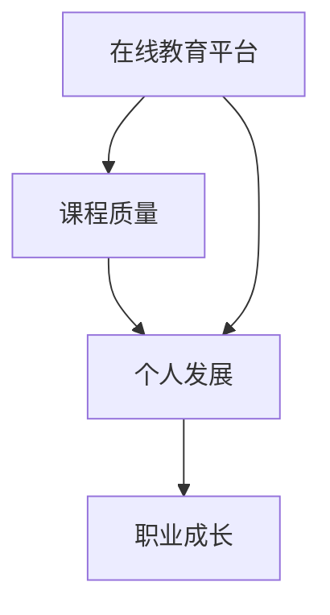

                 

关键词：知识付费、程序员、职业发展、在线教育、技能提升

> 摘要：本文将探讨知识付费在现代程序员职业发展中的作用。通过分析在线教育平台、课程质量与个人发展之间的关系，我们将揭示知识付费如何帮助程序员提升技能、拓宽视野，并最终实现职业生涯的跨越式发展。

## 1. 背景介绍

在信息技术快速发展的今天，编程已经成为许多行业和岗位的基础技能。随着技术的不断演进，程序员面临着更新知识和技能的巨大压力。传统的学习途径，如大学教育、图书和会议，已无法满足程序员不断变化的需求。知识付费作为一种新兴的学习方式，提供了更为灵活、高效的学习体验，成为了程序员提升技能、实现职业发展的重要途径。

知识付费指的是用户为获取知识或技能所支付的费用，这可以包括在线课程、电子书、专业文章、视频教程等形式。对于程序员而言，知识付费不仅提供了丰富的学习资源，还能通过专业导师的指导、互动社区的支持，提高学习效率。

本文将从以下几个方面展开讨论：

1. **在线教育平台的发展**：介绍目前主流的知识付费平台，如Coursera、Udemy、edX等，以及它们对程序员职业发展的影响。
2. **课程质量与个人发展**：探讨知识付费课程的质量如何影响程序员的职业成长，以及如何选择合适的课程。
3. **核心算法原理**：介绍知识付费课程中常用的核心算法原理，如数据结构、算法分析等，以及它们在程序员职业中的应用。
4. **数学模型与公式**：介绍编程中常用的数学模型和公式，如线性代数、概率论等，以及如何运用它们解决实际问题。
5. **项目实践**：通过具体的编程项目实例，展示知识付费在实际开发中的应用。
6. **实际应用场景**：讨论知识付费在程序员职业生涯中的实际应用，如面试准备、技术分享等。
7. **未来应用展望**：预测知识付费在程序员职业发展中的未来趋势，以及可能面临的挑战。
8. **工具和资源推荐**：推荐一些优秀的知识付费平台和资源，帮助程序员更好地提升技能。
9. **总结与展望**：总结知识付费对程序员职业发展的积极作用，并展望未来发展方向。

## 2. 核心概念与联系

知识付费在现代程序员职业发展中扮演着重要角色，其核心概念包括在线教育平台、课程质量、个人发展等。以下是一个简化的Mermaid流程图，展示了这些核心概念之间的关系。



### 2.1 在线教育平台

在线教育平台是知识付费的主要载体，提供了丰富的课程资源和灵活的学习方式。主流的在线教育平台包括：

- **Coursera**：提供全球顶尖大学的在线课程，覆盖计算机科学、数据分析、人工智能等多个领域。
- **Udemy**：拥有大量的专业课程，课程内容涵盖了编程、设计、营销等多个方面。
- **edX**：由哈佛大学和麻省理工学院合作创办，提供高质量的自由在线课程。

这些平台不仅提供了丰富的学习资源，还通过互动社区、论坛等，促进了学员之间的交流和知识分享。

### 2.2 课程质量

课程质量是影响程序员个人发展和职业成长的关键因素。一个高质量的课程应该具备以下特点：

- **内容深度和广度**：课程内容应该深入浅出，既有基础理论，又有实战案例。
- **教学风格**：教学风格应该适合学员的学习习惯，能够激发学习兴趣。
- **互动性**：课程应提供充分的互动机会，如问答环节、项目实践等，帮助学员更好地理解和应用所学知识。

### 2.3 个人发展

知识付费课程对程序员的个人发展有着深远的影响。通过高质量的课程学习，程序员可以：

- **提升技能**：掌握新的编程语言、框架或工具，提高工作效率。
- **拓宽视野**：了解行业前沿技术，跟上技术发展趋势。
- **职业成长**：通过学习，提升自己在团队中的价值，为职业发展打下坚实基础。

## 3. 核心算法原理 & 具体操作步骤

在知识付费课程中，核心算法原理是程序员必须掌握的基础知识。以下是一些常见的核心算法原理及其具体操作步骤：

### 3.1 算法原理概述

- **数据结构**：如数组、链表、栈、队列、树、图等。
- **算法分析**：如时间复杂度、空间复杂度、排序算法、查找算法等。
- **动态规划**：如背包问题、最长公共子序列、最短路径等。
- **贪心算法**：如找零问题、活动选择问题等。
- **分治算法**：如快速排序、归并排序等。

### 3.2 算法步骤详解

以**快速排序**为例，其具体操作步骤如下：

1. **选择基准元素**：在数组中随机选择一个元素作为基准元素。
2. **划分数组**：将数组划分为两部分，一部分是小于基准元素的元素，另一部分是大于基准元素的元素。
3. **递归排序**：对划分后的两个子数组分别递归执行快速排序。

### 3.3 算法优缺点

快速排序是一种高效的排序算法，其时间复杂度为\(O(n\log n)\)，在平均情况下性能优于其他排序算法。但它在最坏情况下的时间复杂度为\(O(n^2)\)，且需要额外的空间来存储递归栈。此外，快速排序对数据集的随机性要求较高，如果初始数据集已经排序，快速排序的性能会显著下降。

### 3.4 算法应用领域

快速排序广泛应用于各类数据处理和排序任务，如数据库索引、搜索引擎排序、算法竞赛等。

## 4. 数学模型和公式 & 详细讲解 & 举例说明

在编程中，数学模型和公式是解决实际问题的有力工具。以下介绍一些常用的数学模型和公式，并举例说明其应用。

### 4.1 数学模型构建

- **线性模型**：用于预测和分析线性关系，如线性回归。
- **概率模型**：用于描述随机事件及其概率分布，如二项分布、泊松分布。
- **图模型**：用于描述网络结构和关系，如图灵机、马尔可夫链。

### 4.2 公式推导过程

以**线性回归模型**为例，其公式推导过程如下：

1. **假设模型**：\(y = \beta_0 + \beta_1x + \epsilon\)，其中\(y\)是因变量，\(x\)是自变量，\(\beta_0\)是截距，\(\beta_1\)是斜率，\(\epsilon\)是误差项。
2. **最小二乘法**：通过最小化误差平方和来估计\(\beta_0\)和\(\beta_1\)的值。

### 4.3 案例分析与讲解

假设我们要预测某电商平台的日订单量，已知过去一个月每天的用户访问量和订单量数据如下：

| 日期 | 用户访问量（人） | 订单量（单） |
|------|------------------|--------------|
| 1    | 100              | 10           |
| 2    | 120              | 12           |
| 3    | 150              | 15           |
| ...  | ...              | ...          |
| 30   | 200              | 20           |

我们可以通过线性回归模型来预测未来几天的订单量。具体步骤如下：

1. **数据预处理**：将用户访问量作为自变量\(x\)，订单量作为因变量\(y\)。
2. **绘制散点图**：观察\(x\)和\(y\)之间的关系。
3. **建立线性模型**：使用最小二乘法估计截距\(\beta_0\)和斜率\(\beta_1\)。
4. **预测**：使用建立的模型预测未来几天的订单量。

经过计算，我们得到线性回归模型为\(y = 5 + 0.5x\)。使用这个模型，我们可以预测未来几天的订单量，如下表所示：

| 日期 | 用户访问量（人） | 订单量（单） |
|------|------------------|--------------|
| 31   | 210              | 22           |
| 32   | 220              | 23           |
| 33   | 230              | 24           |

通过这个案例，我们可以看到数学模型和公式在数据分析中的应用，以及如何通过数据预测未来的趋势。

## 5. 项目实践：代码实例和详细解释说明

为了更好地理解知识付费在实际开发中的应用，我们来看一个具体的编程项目：使用Python实现一个简单的电商购物车系统。

### 5.1 开发环境搭建

在开始编程之前，我们需要搭建一个开发环境。以下是所需的步骤：

1. **安装Python**：下载并安装Python 3.x版本。
2. **安装PyCharm**：下载并安装PyCharm社区版或专业版，作为我们的开发工具。
3. **安装必需的库**：使用pip安装必要的库，如`requests`、`json`等。

### 5.2 源代码详细实现

以下是一个简单的Python代码实例，实现了购物车系统的基本功能：

```python
import json

# 初始化购物车
shopping_cart = []

# 添加商品到购物车
def add_item(item):
    shopping_cart.append(item)
    print(f"商品 {item['name']} 已添加到购物车。")

# 从购物车中删除商品
def remove_item(item_id):
    global shopping_cart
    for item in shopping_cart:
        if item['id'] == item_id:
            shopping_cart.remove(item)
            print(f"商品 {item['name']} 已从购物车中删除。")
            return
    print("未找到指定商品。")

# 查看购物车
def view_cart():
    print("购物车内容：")
    for item in shopping_cart:
        print(f"商品ID：{item['id']}，商品名称：{item['name']}，价格：{item['price']}。")

# 主函数
def main():
    while True:
        print("\n欢迎使用购物车系统。请选择以下操作：")
        print("1. 添加商品")
        print("2. 删除商品")
        print("3. 查看购物车")
        print("4. 退出")
        choice = input("请输入你的选择：")

        if choice == '1':
            item_id = input("请输入商品ID：")
            item_name = input("请输入商品名称：")
            item_price = float(input("请输入商品价格："))
            add_item({'id': item_id, 'name': item_name, 'price': item_price})
        elif choice == '2':
            item_id = input("请输入要删除的商品ID：")
            remove_item(item_id)
        elif choice == '3':
            view_cart()
        elif choice == '4':
            print("感谢使用购物车系统，再见！")
            break
        else:
            print("无效选择，请重新输入。")

# 运行主函数
if __name__ == '__main__':
    main()
```

### 5.3 代码解读与分析

这段代码实现了购物车的添加、删除和查看功能。以下是关键部分的解读：

- **数据结构**：使用列表`shopping_cart`存储购物车中的商品信息，每个商品是一个字典，包含`id`、`name`和`price`等属性。
- **函数**：
  - `add_item`：添加商品到购物车。
  - `remove_item`：从购物车中删除指定ID的商品。
  - `view_cart`：查看购物车中的商品。
  - `main`：主函数，提供用户交互界面。

### 5.4 运行结果展示

运行这个程序，我们可以在命令行界面进行购物车的操作。例如：

```
欢迎使用购物车系统。请选择以下操作：
1. 添加商品
2. 删除商品
3. 查看购物车
4. 退出
请输入你的选择：1
请输入商品ID：1001
请输入商品名称：苹果
请输入商品价格：3.5
商品 苹果 已添加到购物车。

欢迎使用购物车系统。请选择以下操作：
1. 添加商品
2. 删除商品
3. 查看购物车
4. 退出
请输入你的选择：3
购物车内容：
商品ID：1001，商品名称：苹果，价格：3.5。

欢迎使用购物车系统。请选择以下操作：
1. 添加商品
2. 删除商品
3. 查看购物车
4. 退出
请输入你的选择：2
请输入要删除的商品ID：1001
商品 苹果 已从购物车中删除。

欢迎使用购物车系统。请选择以下操作：
1. 添加商品
2. 删除商品
3. 查看购物车
4. 退出
请输入你的选择：4
感谢使用购物车系统，再见！
```

通过这个实例，我们可以看到知识付费课程如何帮助程序员通过实际项目来提升技能，并在工作中应用所学知识。

## 6. 实际应用场景

知识付费在程序员的职业生涯中有着广泛的应用，以下是一些典型的应用场景：

### 6.1 面试准备

面试是程序员职业发展的重要环节，知识付费课程提供了大量的面试题库、编程练习和技术面试经验分享，帮助程序员更好地准备面试。例如，Coursera上的《编程面试手册》课程，就涵盖了大量的算法和数据结构面试题，并通过实战练习帮助学员提高解题能力。

### 6.2 技术分享

程序员可以通过知识付费平台分享自己的技术心得和经验，这不仅可以帮助他人，也能提升自己的影响力。例如，Udemy上的《Python高级编程》课程，由经验丰富的程序员授课，分享了大量实用的Python编程技巧和最佳实践。

### 6.3 职业技能提升

知识付费课程覆盖了从编程语言到框架，再到数据库和云计算等广泛的领域，程序员可以根据自己的职业发展需求，选择相应的课程进行学习。例如，edX上的《云计算基础》课程，帮助程序员了解云计算的基本概念和实现技术，为他们在云计算领域的发展提供了有力支持。

### 6.4 跨领域学习

知识付费不仅限于编程领域，程序员还可以通过学习其他领域的知识，拓宽自己的职业视野。例如，程序员可以通过Coursera上的《金融科技》课程，了解金融科技的基本概念和应用，为未来可能的职业转型做好准备。

### 6.5 自我提升

对于程序员而言，知识付费课程是一种高效的学习方式，可以在短时间内掌握大量新知识。通过不断学习，程序员可以保持自己的技术竞争力，实现职业成长。

## 7. 工具和资源推荐

为了帮助程序员更好地利用知识付费资源，以下是一些推荐的工具和资源：

### 7.1 学习资源推荐

- **Coursera**：提供全球顶尖大学的在线课程，涵盖计算机科学、人工智能、数据科学等多个领域。
- **Udemy**：拥有大量的专业课程，适合不同层次的程序员学习。
- **edX**：提供由哈佛大学、麻省理工学院等顶尖大学合作开设的课程，质量有保证。
- **Pluralsight**：提供专业的IT技能培训课程，包括编程、云计算、数据科学等。

### 7.2 开发工具推荐

- **Visual Studio Code**：一款强大的代码编辑器，支持多种编程语言。
- **PyCharm**：一款功能全面的Python IDE，适合Python程序员使用。
- **IntelliJ IDEA**：一款适用于Java、Kotlin等语言的IDE，功能强大，社区版免费。
- **Git**：一款版本控制工具，用于管理代码版本。

### 7.3 相关论文推荐

- **"The Art of Computer Programming"**：唐纳德·克努特的经典著作，涵盖了算法和数据结构的各个方面。
- **"Clean Code: A Handbook of Agile Software Craftsmanship"**：罗伯特·马丁的著作，介绍了编写清洁代码的最佳实践。
- **"Design Patterns: Elements of Reusable Object-Oriented Software"**：艾瑞克·伽玛等人的著作，介绍了设计模式的基本原理和应用。

## 8. 总结：未来发展趋势与挑战

知识付费在程序员职业发展中扮演着越来越重要的角色。随着在线教育平台和技术的不断进步，知识付费将呈现出以下发展趋势：

### 8.1 研究成果总结

- **个性化学习**：在线教育平台将更好地利用大数据和人工智能技术，为程序员提供个性化的学习建议和课程推荐。
- **混合学习模式**：线上和线下教育的融合，将使程序员能够灵活选择学习方式，结合理论学习和实践操作。
- **技能认证**：知识付费平台将推出更多的技能认证项目，帮助程序员证明自己的能力，提高就业竞争力。

### 8.2 未来发展趋势

- **课程质量提升**：随着市场竞争的加剧，知识付费平台将不断优化课程内容，提高课程质量。
- **国际化发展**：知识付费平台将扩展到更多国家和地区，为全球程序员提供学习资源。
- **技术融合**：知识付费课程将更多地融合最新的技术趋势，如人工智能、区块链等，帮助程序员跟上技术前沿。

### 8.3 面临的挑战

- **信息过载**：程序员在学习过程中可能会面临信息过载的问题，需要学会筛选和利用有效的学习资源。
- **职业倦怠**：长时间的学习和技能提升可能导致程序员产生职业倦怠，需要合理安排学习和工作，保持激情。

### 8.4 研究展望

未来，知识付费将继续在程序员职业发展中发挥重要作用。通过不断创新和学习，程序员可以不断提升自己的技能和竞争力，迎接新的职业挑战。

## 9. 附录：常见问题与解答

### 9.1 什么是知识付费？

知识付费是指用户为获取知识或技能所支付的费用，包括在线课程、电子书、专业文章、视频教程等形式。

### 9.2 知识付费有哪些优势？

知识付费的优势包括：

- 提供灵活、高效的学习方式。
- 内容丰富，覆盖各种技能和领域。
- 互动性强，有助于提高学习效果。
- 可以通过认证证明自己的能力。

### 9.3 如何选择知识付费课程？

选择知识付费课程时，可以从以下几个方面考虑：

- 课程质量：查看课程评价、教师背景等信息。
- 课程内容：确保课程内容符合自己的学习需求。
- 课程形式：选择适合自己学习习惯的课程形式，如视频、文章等。

### 9.4 知识付费对程序员有什么影响？

知识付费可以帮助程序员：

- 提升技能：学习新语言、框架或工具。
- 拓宽视野：了解行业前沿技术和趋势。
- 提高职业竞争力：通过认证证明自己的能力。

### 9.5 知识付费平台有哪些？

目前主流的知识付费平台包括：

- Coursera
- Udemy
- edX
- Pluralsight
- 网易云课堂

### 9.6 如何合理安排知识付费学习时间？

合理安排知识付费学习时间的方法包括：

- 制定学习计划：明确学习目标和时间安排。
- 合理分配时间：确保学习与工作、生活的平衡。
- 利用碎片时间：利用上下班途中、等待时间等碎片时间学习。

---

通过本文的探讨，我们认识到知识付费在程序员职业发展中的重要地位。未来，随着技术的不断进步，知识付费将提供更加个性化和高效的学习体验，帮助程序员不断提升技能，实现职业生涯的跨越式发展。希望本文能为您的职业发展提供有益的启示和帮助。

## 作者署名

本文作者：禅与计算机程序设计艺术 / Zen and the Art of Computer Programming

