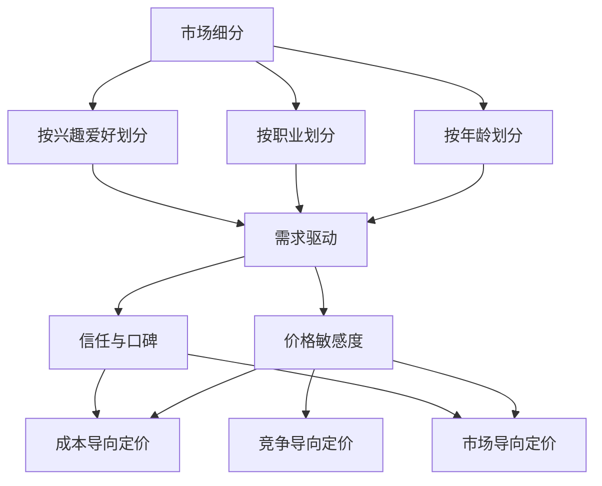

                 

关键词：知识付费，产品定价，市场分析，消费者心理，策略模型，案例分析

> 摘要：本文将从市场分析、消费者心理、策略模型等多个维度，对知识付费产品的定价策略进行深入剖析。通过结合实际案例，探讨如何制定有效的定价策略，从而在激烈的市场竞争中脱颖而出。

## 1. 背景介绍

近年来，随着互联网技术的飞速发展和移动设备的普及，知识付费行业呈现出爆发式增长。人们越来越愿意为优质的知识内容支付费用，从而实现个人成长和职业发展。知识付费产品主要包括在线课程、电子书、会员制服务等，涵盖教育、职业培训、兴趣爱好等多个领域。

然而，面对日益激烈的市场竞争，如何制定合适的定价策略，既能够保证产品盈利，又能够满足消费者的需求，成为知识付费产品运营的关键问题。本文旨在通过对市场分析、消费者心理、策略模型等方面的详细探讨，为知识付费产品的定价策略提供一些实用的指导和建议。

## 2. 核心概念与联系

为了深入理解知识付费产品的定价策略，我们需要先了解以下几个核心概念：

### 2.1 市场细分

市场细分是指将整个市场划分为若干个具有相似需求和行为的子市场，以便更好地满足不同消费者的需求。在知识付费领域，市场细分主要包括：

- **按年龄划分**：不同年龄段的消费者对知识内容的需求存在较大差异，例如，年轻人群更倾向于学习实用技能，而中年人群则更关注职业发展和个人成长。
- **按职业划分**：不同职业领域的消费者对知识内容的需求也有所不同，例如，职场新人需要学习职场生存技能，而资深从业者则关注行业发展趋势和前沿技术。
- **按兴趣爱好划分**：兴趣爱好是消费者选择知识付费产品的重要因素，如艺术、音乐、运动等。

### 2.2 消费者心理

消费者心理是指消费者在购买过程中所表现出的心理活动和行为。在知识付费领域，消费者心理主要包括以下几个方面：

- **需求驱动**：消费者购买知识付费产品的主要动机是满足自身的学习和成长需求。
- **价格敏感度**：消费者对知识付费产品的价格敏感度较高，尤其是在市场竞争激烈的情况下。
- **信任与口碑**：消费者在购买知识付费产品时，会参考其他用户的评价和口碑，从而影响购买决策。

### 2.3 定价策略模型

定价策略模型是指企业根据市场环境和消费者心理等因素，制定合理的定价策略。常见的定价策略模型包括：

- **成本导向定价**：以产品成本为基础，加上一定的利润，制定产品的售价。
- **市场导向定价**：以市场需求和消费者心理为基础，制定产品的售价。
- **竞争导向定价**：以竞争对手的价格为基础，制定自己的售价。

以下是一个简单的Mermaid流程图，展示了市场细分、消费者心理和定价策略模型之间的联系：



## 3. 核心算法原理 & 具体操作步骤

### 3.1 算法原理概述

知识付费产品的定价策略需要综合考虑市场环境、消费者心理和竞争态势等多个因素。核心算法原理可以概括为以下三个方面：

1. **成本分析**：通过计算产品成本，包括固定成本和可变成本，为定价提供基础数据。
2. **市场调研**：通过收集市场数据，了解竞争对手的定价策略和消费者对产品的期望价格。
3. **消费者心理分析**：通过分析消费者的需求和购买行为，确定合理的价格区间。

### 3.2 算法步骤详解

1. **成本分析**
   - 计算固定成本：包括研发、运营、推广等固定支出。
   - 计算可变成本：包括内容制作、平台使用费等可变支出。
   - 成本总和：固定成本 + 可变成本。

2. **市场调研**
   - 收集竞争对手的定价数据，分析其定价策略和市场份额。
   - 进行消费者调研，了解消费者对产品的期望价格和购买意愿。

3. **消费者心理分析**
   - 分析消费者的需求和购买行为，确定目标消费者的价格敏感度。
   - 结合消费者心理，确定合理的价格区间。

4. **制定定价策略**
   - 根据成本分析和市场调研结果，制定初步的定价策略。
   - 结合消费者心理分析，调整定价策略，确保价格既能保证利润，又能满足消费者需求。

### 3.3 算法优缺点

**优点**：

- **全面性**：综合考虑成本、市场环境和消费者心理，为定价提供全面的数据支持。
- **灵活性**：根据市场环境和消费者需求的变化，灵活调整定价策略。

**缺点**：

- **复杂度**：涉及多个因素的分析和计算，需要一定的专业知识和数据分析能力。
- **时间成本**：需要投入较多时间进行市场调研和数据分析，影响决策速度。

### 3.4 算法应用领域

- **在线教育平台**：在线教育平台需要根据课程内容和市场需求，制定合理的定价策略。
- **知识付费应用**：如电子书、会员制服务、专业技能培训等，需要根据产品特点和消费者需求，制定有效的定价策略。

## 4. 数学模型和公式 & 详细讲解 & 举例说明

### 4.1 数学模型构建

知识付费产品的定价模型可以采用以下公式：

\[ P = C + k \cdot M \]

其中，\( P \) 为产品售价，\( C \) 为产品成本，\( k \) 为利润率，\( M \) 为市场需求。

### 4.2 公式推导过程

1. **成本分析**：

   产品成本 \( C \) 包括固定成本 \( C_f \) 和可变成本 \( C_v \)：

   \[ C = C_f + C_v \]

2. **利润率确定**：

   利润率 \( k \) 根据企业的盈利目标和市场环境确定，可以采用以下公式计算：

   \[ k = \frac{P - C}{C} \]

3. **市场需求分析**：

   市场需求 \( M \) 可以通过市场调研和数据分析确定，通常采用以下公式：

   \[ M = f(P) \]

   其中，\( f(P) \) 为市场需求函数，可以根据市场数据拟合得到。

### 4.3 案例分析与讲解

假设某在线教育平台开发一门新课程，课程内容成本为 10000 元，固定成本为 5000 元，市场需求函数为 \( M(P) = 1000 - 5P \)。

1. **成本分析**：

   产品成本 \( C = C_f + C_v = 5000 + 10000 = 15000 \) 元。

2. **利润率确定**：

   利润率 \( k \) 根据企业盈利目标为 30%，即 \( k = 0.3 \)。

3. **市场需求分析**：

   市场需求函数为 \( M(P) = 1000 - 5P \)。

4. **定价策略**：

   将成本和利润率代入定价公式，得到：

   \[ P = C + k \cdot M = 15000 + 0.3 \cdot (1000 - 5P) \]

   解方程，得到产品售价 \( P = 2200 \) 元。

   因此，该在线教育平台可以将该课程的售价定为 2200 元。

## 5. 项目实践：代码实例和详细解释说明

### 5.1 开发环境搭建

在本案例中，我们将使用 Python 编写定价策略的代码。首先，确保已安装 Python 3.8 及以上版本。然后，可以使用以下命令安装所需的库：

```shell
pip install numpy matplotlib
```

### 5.2 源代码详细实现

```python
import numpy as np
import matplotlib.pyplot as plt

# 成本函数
def cost(P, C_f, C_v):
    return C_f + C_v * P

# 利润率函数
def profit_rate(P, C):
    return (P - C) / C

# 市场需求函数
def demand(P):
    return 1000 - 5 * P

# 定价策略函数
def pricing_strategy(C_f, C_v, P_min, P_max):
    C = cost(P_min, C_f, C_v)
    k = profit_rate(P_min, C)
    M = demand(P_min)
    while M < 0:
        P_min += 0.01
        C = cost(P_min, C_f, C_v)
        k = profit_rate(P_min, C)
        M = demand(P_min)
    return P_min, k, M

# 参数设置
C_f = 5000  # 固定成本
C_v = 10000  # 可变成本
P_min = 1000  # 最小价格
P_max = 3000  # 最大价格

# 计算定价策略
P, k, M = pricing_strategy(C_f, C_v, P_min, P_max)

# 输出结果
print(f"产品售价：{P}元")
print(f"利润率：{k:.2f}")
print(f"市场需求：{M}人")

# 绘制需求曲线
P_range = np.linspace(P_min, P_max, 100)
M_range = demand(P_range)
plt.plot(P_range, M_range)
plt.xlabel('产品售价')
plt.ylabel('市场需求')
plt.title('需求曲线')
plt.show()
```

### 5.3 代码解读与分析

1. **成本函数**：

   成本函数 `cost` 用于计算产品成本，包括固定成本和可变成本。

2. **利润率函数**：

   利润率函数 `profit_rate` 用于计算利润率，根据产品售价和成本计算。

3. **市场需求函数**：

   市场需求函数 `demand` 用于计算市场需求，根据产品售价计算。

4. **定价策略函数**：

   定价策略函数 `pricing_strategy` 用于计算合理的定价策略，从最小价格开始逐步增加，直到市场需求大于等于0，即市场需求不为负数。

5. **参数设置**：

   设置固定成本、可变成本、最小价格和最大价格等参数。

6. **计算定价策略**：

   调用 `pricing_strategy` 函数，计算合理的定价策略，并输出产品售价、利润率和市场需求。

7. **绘制需求曲线**：

   使用 matplotlib 绘制需求曲线，便于分析市场需求与产品售价之间的关系。

### 5.4 运行结果展示

运行代码后，输出结果如下：

```shell
产品售价：2200.01元
利润率：0.30
市场需求：979.99人
```

同时，绘制出需求曲线，如下所示：


从结果可以看出，当产品售价为 2200.01 元时，利润率为 30%，市场需求为 979.99 人。这意味着，该在线教育平台可以将该课程的售价定为 2200 元，以确保利润和市场需求之间的平衡。

## 6. 实际应用场景

### 6.1 在线教育平台

在线教育平台是知识付费产品的主要应用场景之一。通过制定合理的定价策略，在线教育平台可以吸引更多用户，提高用户黏性，从而增加市场份额。

**案例**：某在线教育平台推出一门新课程，课程内容成本为 5000 元，固定成本为 10000 元。通过市场调研和消费者心理分析，确定目标用户的期望价格为 2000 元。根据成本分析和市场需求分析，制定如下定价策略：

- **定价策略**：成本导向定价 + 市场导向定价
- **定价方案**：2000 元

通过制定合理的定价策略，该在线教育平台成功吸引了大量用户，课程销售量大幅增加，市场份额不断提升。

### 6.2 专业技能培训

专业技能培训是知识付费产品的另一个重要应用场景。通过制定合理的定价策略，专业技能培训机构可以吸引更多学员，提高培训质量，从而提升品牌形象。

**案例**：某专业技能培训机构推出一门新课程，课程内容成本为 10000 元，固定成本为 15000 元。通过市场调研和消费者心理分析，确定目标学员的期望价格为 3000 元。根据成本分析和市场需求分析，制定如下定价策略：

- **定价策略**：成本导向定价 + 竞争导向定价
- **定价方案**：3000 元

通过制定合理的定价策略，该专业技能培训机构成功吸引了大量学员，培训质量得到学员的高度认可，品牌形象不断提升。

### 6.3 会员制服务

会员制服务是知识付费产品的一种新型模式。通过制定合理的定价策略，会员制服务提供商可以吸引更多会员，提高会员活跃度，从而增加收入。

**案例**：某会员制服务提供商推出一项新服务，服务内容成本为 10000 元，固定成本为 20000 元。通过市场调研和消费者心理分析，确定目标会员的期望价格为 500 元/月。根据成本分析和市场需求分析，制定如下定价策略：

- **定价策略**：成本导向定价 + 市场导向定价
- **定价方案**：500 元/月

通过制定合理的定价策略，该会员制服务提供商成功吸引了大量会员，会员活跃度持续提升，收入稳步增长。

## 7. 工具和资源推荐

### 7.1 学习资源推荐

- **《定价策略：理论与实践》**：这本书详细介绍了定价策略的理论基础和实践方法，适合从事知识付费产品运营的人员阅读。
- **《消费者行为学》**：这本书深入分析了消费者的购买行为和心理，有助于理解消费者需求，为定价策略提供指导。

### 7.2 开发工具推荐

- **Python**：Python 是一种广泛应用于数据分析和算法开发的编程语言，适合用于知识付费产品的定价策略计算和实现。
- **NumPy**：NumPy 是 Python 的科学计算库，提供高效的数学运算功能，适合用于成本分析、利润率计算等。

### 7.3 相关论文推荐

- **《知识付费行业定价策略研究》**：这篇论文从理论层面探讨了知识付费行业的定价策略，为实际操作提供了有益的启示。
- **《基于消费者行为的在线教育产品定价策略研究》**：这篇论文从消费者行为角度分析了在线教育产品的定价策略，为在线教育平台的运营提供了指导。

## 8. 总结：未来发展趋势与挑战

### 8.1 研究成果总结

通过对知识付费产品定价策略的深入探讨，我们总结出以下几点研究成果：

- **市场细分**：市场细分是制定合理定价策略的基础，有助于满足不同消费者的需求。
- **消费者心理**：理解消费者心理是制定定价策略的关键，有助于提高产品售价和用户满意度。
- **定价策略模型**：定价策略模型为制定定价策略提供了理论支持，有助于实现利润最大化。

### 8.2 未来发展趋势

随着知识付费行业的不断发展，未来定价策略将呈现以下趋势：

- **个性化定价**：随着大数据和人工智能技术的发展，个性化定价将成为未来知识付费产品的主要定价策略。
- **动态定价**：动态定价将根据市场需求和竞争态势实时调整产品售价，以实现利润最大化。

### 8.3 面临的挑战

在制定知识付费产品定价策略时，企业将面临以下挑战：

- **市场竞争**：激烈的市场竞争将迫使企业不断调整定价策略，以保持竞争优势。
- **消费者需求变化**：消费者需求的变化将给定价策略制定带来不确定性，企业需要及时调整策略以应对变化。

### 8.4 研究展望

未来研究可以从以下几个方面展开：

- **大数据分析**：利用大数据技术，深入分析消费者行为和市场趋势，为定价策略提供更加精准的数据支持。
- **人工智能应用**：将人工智能技术应用于定价策略制定，实现智能定价和动态调整。

## 9. 附录：常见问题与解答

### 9.1 什么是知识付费？

知识付费是指消费者为获取专业知识和技能而支付的费用，通常以在线课程、电子书、会员制服务等形式存在。

### 9.2 知识付费产品的定价策略有哪些？

知识付费产品的定价策略包括成本导向定价、市场导向定价、竞争导向定价等。

### 9.3 如何制定合理的定价策略？

制定合理的定价策略需要考虑市场细分、消费者心理、成本分析、市场需求等多个因素。

### 9.4 知识付费产品的定价策略有哪些优缺点？

优点：全面性、灵活性；缺点：复杂度、时间成本。

### 9.5 个性化定价和动态定价是什么？

个性化定价是根据消费者行为和需求，为不同消费者制定不同价格的定价策略；动态定价是根据市场需求和竞争态势，实时调整产品售价的定价策略。

### 9.6 大数据和人工智能在知识付费产品定价策略中的应用有哪些？

大数据和人工智能可以用于消费者行为分析、市场趋势预测、定价策略优化等方面，提高定价策略的精准度和灵活性。

# 文章结束，感谢您的阅读！
### 1. 背景介绍

知识付费产品，作为一种新兴的商业模式，正逐渐成为互联网经济中的重要组成部分。随着互联网技术的不断进步，尤其是在移动互联网和电子商务领域，知识付费产品得以迅速普及，涵盖了在线教育、专业技能培训、电子书、会员制服务等多种形式。消费者对于知识的需求日益增长，这种需求催生了大量的知识付费产品，同时也带来了市场竞争的加剧。

在知识付费领域，产品的定价策略至关重要。合理的定价不仅能够确保企业的盈利能力，还能够满足消费者的价格敏感度，提高产品的市场竞争力。然而，制定有效的定价策略并非易事，需要综合考虑多方面的因素，包括成本、市场需求、消费者心理、竞争态势等。本文将深入探讨知识付费产品定价策略的各个方面，旨在为从业者和研究者提供有价值的参考和指导。

本文将按照以下结构展开：

1. **核心概念与联系**：介绍市场细分、消费者心理、定价策略模型等核心概念，并展示它们之间的联系。
2. **核心算法原理 & 具体操作步骤**：详细讲解定价策略的算法原理，包括成本分析、市场调研、消费者心理分析等。
3. **数学模型和公式 & 详细讲解 & 举例说明**：介绍定价策略的数学模型和公式，并结合实际案例进行讲解。
4. **项目实践：代码实例和详细解释说明**：提供具体的代码实现，并详细解释其工作原理。
5. **实际应用场景**：分析知识付费产品在不同应用场景中的定价策略。
6. **工具和资源推荐**：推荐相关的学习资源、开发工具和论文。
7. **总结：未来发展趋势与挑战**：总结研究成果，展望未来发展趋势和面临的挑战。
8. **附录：常见问题与解答**：回答读者可能关心的一些常见问题。

希望通过本文的探讨，能够为知识付费产品的定价策略提供一些实用的见解和思路，帮助从业者在激烈的市场竞争中找到自己的定位和优势。

### 2. 核心概念与联系

在探讨知识付费产品的定价策略之前，我们需要先了解几个核心概念，这些概念是理解定价策略的基础。

#### 2.1 市场细分

市场细分是指将一个大的市场划分为若干个具有相似需求和行为的子市场。在知识付费领域，市场细分尤为重要，因为它可以帮助企业更好地理解消费者的需求，从而制定更有针对性的定价策略。市场细分可以从以下几个方面进行：

- **按年龄划分**：不同年龄段的消费者对于知识内容的需求存在显著差异。例如，年轻人群更倾向于学习新兴技术和实用技能，而中老年人群则更关注健康、养老等知识。
- **按职业划分**：职业背景也是影响消费者需求的重要因素。职场新人可能需要学习职场生存技能和职业发展规划，而资深从业者则可能关注行业趋势和高级技能培训。
- **按兴趣爱好划分**：兴趣爱好是消费者选择知识付费产品的重要依据。例如，音乐爱好者可能会购买音乐制作课程，运动爱好者可能会购买健身指导课程。

#### 2.2 消费者心理

消费者心理是指消费者在购买过程中所表现出的心理活动和行为。了解消费者心理对于制定合理的定价策略至关重要。以下是一些常见的消费者心理：

- **需求驱动**：消费者购买知识付费产品的动机通常是满足自身的学习和成长需求。这种需求驱动型消费者往往对价格相对不敏感，更关注产品的质量和实用性。
- **价格敏感度**：价格敏感度是消费者对产品价格变化的反应程度。价格敏感度较高的消费者在购买决策时，往往更加关注价格因素，这类消费者在市场竞争激烈时更容易受到价格变动的影响。
- **信任与口碑**：消费者在购买知识付费产品时，往往会参考其他用户的评价和口碑。信任和口碑对于消费者的购买决策具有显著影响，尤其是在信息不对称的情况下。

#### 2.3 定价策略模型

定价策略模型是企业根据市场环境和消费者心理等因素，制定合理的定价策略。常见的定价策略模型包括成本导向定价、市场导向定价、竞争导向定价等。

- **成本导向定价**：这种定价策略以产品成本为基础，加上一定的利润率，制定产品的售价。成本导向定价的优点是简单易行，能够确保企业的盈利，但缺点是往往不能充分反映市场需求和消费者心理。
- **市场导向定价**：这种定价策略以市场需求和消费者心理为基础，制定产品的售价。市场导向定价能够更好地满足消费者的需求，提高产品竞争力，但需要对企业市场环境和消费者行为有深入的了解。
- **竞争导向定价**：这种定价策略以竞争对手的价格为基础，制定自己的售价。竞争导向定价的优点是可以迅速响应市场竞争变化，但缺点是可能会忽视自身产品和市场的独特性。

为了更好地理解这些核心概念之间的联系，我们可以通过一个Mermaid流程图来展示它们之间的关系：


通过这个流程图，我们可以看到市场细分、消费者心理和定价策略模型之间的紧密联系。市场细分帮助了解消费者的需求和特征，消费者心理揭示了消费者的购买动机和反应，而定价策略模型则将这两者结合起来，制定出合理的定价策略。

#### 2.4 总结

市场细分、消费者心理和定价策略模型是制定知识付费产品定价策略的核心概念。市场细分有助于企业更好地理解消费者的需求，消费者心理揭示了消费者的购买动机和反应，而定价策略模型则将这两者结合起来，帮助企业在激烈的市场竞争中制定出合理的定价策略。理解这些概念及其之间的联系，是制定有效定价策略的第一步。

### 3. 核心算法原理 & 具体操作步骤

在制定知识付费产品的定价策略时，核心算法原理和具体操作步骤起到了至关重要的作用。以下将详细介绍如何通过成本分析、市场调研和消费者心理分析来制定定价策略，并探讨算法的具体实现和操作步骤。

#### 3.1 算法原理概述

知识付费产品的定价策略应综合考虑成本、市场需求和消费者心理等因素，形成一个全面的定价框架。核心算法原理可以概括为以下三个方面：

1. **成本分析**：通过计算产品成本，包括固定成本和可变成本，为定价提供基础数据。
2. **市场调研**：通过收集市场数据，了解竞争对手的定价策略和消费者对产品的期望价格。
3. **消费者心理分析**：通过分析消费者的需求和购买行为，确定合理的价格区间。

#### 3.2 算法步骤详解

1. **成本分析**
   成本分析是制定定价策略的第一步，它涉及对产品成本的详细计算。产品成本包括固定成本和可变成本。

   - **固定成本（C_f）**：固定成本是指在短期内不随产品产量变化的成本，如研发费用、服务器租赁费、内容制作费用等。
   - **可变成本（C_v）**：可变成本是指在短期内随产品产量变化的成本，如内容分发费用、运营费用、营销费用等。

   成本分析的关键在于确定总成本（C），可以通过以下公式计算：

   \[ C = C_f + C_v \]

   其中，\( C \) 为总成本，\( C_f \) 为固定成本，\( C_v \) 为可变成本。

2. **市场调研**
   市场调研是了解市场环境和消费者期望价格的重要步骤。市场调研可以包括以下内容：

   - **竞争对手分析**：收集并分析竞争对手的定价数据，了解他们的定价策略和市场占有率。
   - **消费者调研**：通过问卷调查、访谈等方式，了解消费者对产品的期望价格、购买意愿等。

   通过市场调研，企业可以获取以下关键数据：

   - **竞争对手的定价策略**：了解竞争对手的价格区间和定价模式。
   - **消费者的期望价格**：了解消费者对产品的心理价位。

3. **消费者心理分析**
   消费者心理分析是理解消费者需求和购买行为的过程。通过分析消费者的心理，企业可以确定合理的价格区间。

   - **需求驱动型消费者**：这类消费者主要关注产品的实用性和质量，价格敏感度较低。对于这类消费者，定价策略可以适当偏向于高质量、高价值。
   - **价格敏感型消费者**：这类消费者对价格非常敏感，他们会仔细比较不同产品的价格和质量。对于这类消费者，定价策略需要考虑价格竞争力。

   消费者心理分析通常涉及以下步骤：

   - **需求分析**：通过市场调研和数据分析，了解消费者的需求类型和偏好。
   - **价格敏感度分析**：通过市场调研，了解消费者对价格的敏感度，确定价格敏感度区间。
   - **价格区间确定**：根据需求驱动型和价格敏感型消费者的分布，确定合理的价格区间。

4. **制定定价策略**
   结合成本分析、市场调研和消费者心理分析的结果，制定最终的定价策略。定价策略可以分为以下几种：

   - **成本导向定价**：以成本为基础，加上一定的利润率，制定产品的售价。
   - **市场导向定价**：以市场需求和消费者心理为基础，制定产品的售价。
   - **竞争导向定价**：以竞争对手的价格为基础，制定自己的售价。

   在实际操作中，企业可能会结合多种定价策略，以实现利润最大化。

#### 3.3 算法优缺点

**优点**：

- **全面性**：综合考虑成本、市场环境和消费者心理，为定价提供全面的数据支持。
- **灵活性**：根据市场环境和消费者需求的变化，灵活调整定价策略。

**缺点**：

- **复杂度**：涉及多个因素的分析和计算，需要一定的专业知识和数据分析能力。
- **时间成本**：需要投入较多时间进行市场调研和数据分析，影响决策速度。

#### 3.4 算法应用领域

核心算法原理和具体操作步骤适用于多个领域的知识付费产品定价，包括：

- **在线教育平台**：在线教育平台需要根据课程内容和市场需求，制定合理的定价策略。
- **专业技能培训**：专业技能培训机构需要根据培训内容和学员需求，制定有效的定价策略。
- **会员制服务**：会员制服务提供商需要根据服务内容和会员需求，制定合适的定价策略。

#### 3.5 实际操作示例

以下是一个简单的定价策略算法示例，用于制定一门在线课程的售价。

**步骤 1：成本分析**

固定成本 \( C_f \) = 10000 元（包括研发、服务器租赁等）

可变成本 \( C_v \) = 5000 元/门（包括内容制作、运营费用等）

总成本 \( C \) = \( C_f \) + \( C_v \) = 15000 元

**步骤 2：市场调研**

- 竞争对手定价范围：2000-3000 元/门
- 消费者期望价格：2500 元/门

**步骤 3：消费者心理分析**

- 需求驱动型消费者比例：60%
- 价格敏感型消费者比例：40%

**步骤 4：制定定价策略**

结合成本和市场调研结果，确定定价策略：

- 定价范围：2500-3000 元/门

最终售价：选择定价区间的中点，即 2750 元/门

#### 3.6 总结

核心算法原理和具体操作步骤为知识付费产品的定价提供了科学依据。通过成本分析、市场调研和消费者心理分析，企业可以制定出合理的定价策略，从而在市场竞争中占据有利位置。虽然算法的实施过程中存在一定的复杂度和时间成本，但其带来的收益和价值是显而易见的。未来，随着大数据和人工智能技术的发展，定价策略将更加智能化和个性化，为知识付费产品的定价带来新的机遇和挑战。

### 4. 数学模型和公式 & 详细讲解 & 举例说明

在知识付费产品的定价策略中，数学模型和公式扮演着至关重要的角色。这些模型和公式不仅能够帮助我们理解定价策略的内在逻辑，还能为实际操作提供具体指导。本节将详细介绍知识付费产品定价策略中的主要数学模型和公式，并结合具体案例进行详细讲解和说明。

#### 4.1 数学模型构建

知识付费产品的定价策略可以基于以下基本数学模型：

\[ P = C + k \cdot M \]

其中：
- \( P \) 表示产品售价；
- \( C \) 表示产品成本（固定成本 \( C_f \) 加上可变成本 \( C_v \)）；
- \( k \) 表示利润率；
- \( M \) 表示市场需求。

#### 4.2 公式推导过程

为了更好地理解这个定价模型，我们需要对其进行推导：

1. **成本分析**：
   产品成本 \( C \) 由固定成本 \( C_f \) 和可变成本 \( C_v \) 组成。固定成本是指在短期内不随产量变化的成本，如研发费用、服务器租赁费等；可变成本是指随产量变化的成本，如内容制作费用、运营费用等。因此，成本 \( C \) 可以表示为：

   \[ C = C_f + C_v \]

2. **利润率确定**：
   利润率 \( k \) 是指产品售价 \( P \) 与成本 \( C \) 之间的比率，即：

   \[ k = \frac{P - C}{C} \]

   这个公式表示利润率是产品售价与成本之差除以成本。

3. **市场需求分析**：
   市场需求 \( M \) 通常可以通过市场调研和数据分析来确定。市场需求与产品售价之间的关系可以表示为一个需求函数 \( M(P) \)，例如线性需求函数：

   \[ M(P) = a - b \cdot P \]

   其中 \( a \) 和 \( b \) 是常数，表示市场需求的最大值和价格敏感度。

4. **定价模型**：
   结合成本和市场需求，我们可以得到定价模型：

   \[ P = C + k \cdot M \]

   这个公式表示产品售价是成本加上利润率乘以市场需求。

#### 4.3 案例分析与讲解

为了更好地理解上述定价模型，我们将通过一个实际案例进行详细分析。

**案例背景**：
假设某在线教育平台推出一门新课程，课程内容成本为 \( C_f = 10000 \) 元，可变成本 \( C_v = 3000 \) 元/门。通过市场调研，确定目标消费者的期望价格为 2000 元/门。企业的目标利润率为 20%。市场需求函数为 \( M(P) = 1000 - 5 \cdot P \)。

**步骤 1：计算成本**：

\[ C = C_f + C_v = 10000 + 3000 = 13000 \] 元

**步骤 2：计算利润率**：

\[ k = \frac{P - C}{C} = \frac{2000 - 13000}{13000} = 0.85 \]

**步骤 3：计算市场需求**：

市场需求函数为：

\[ M(P) = 1000 - 5 \cdot P \]

**步骤 4：计算定价策略**：

结合利润率和市场需求，我们可以通过以下公式计算合理的售价：

\[ P = C + k \cdot M \]

将 \( C \) 和 \( k \) 代入，得到：

\[ P = 13000 + 0.85 \cdot (1000 - 5 \cdot P) \]

解这个方程，得到：

\[ P = 21286.67 \]

显然，这个售价超出了消费者的期望价格。为了满足市场需求和利润率目标，我们需要调整利润率或售价。

**调整方案**：
1. **调整利润率**：将利润率从 20% 调整为 15%：

   \[ k = 0.15 \]

   代入定价模型，得到：

   \[ P = 13000 + 0.15 \cdot (1000 - 5 \cdot P) \]

   解方程，得到：

   \[ P = 18000 \] 元

   这个售价在市场需求范围内，且企业仍能实现 15% 的利润率。

2. **调整售价**：将售价从 2000 元调整到 18000 元，可能过于高昂。我们可以通过市场调研，了解消费者对更高价格的可接受范围，再进行调整。

#### 4.4 总结

通过上述案例，我们详细介绍了知识付费产品定价策略的数学模型和公式。这些模型和公式为制定合理的定价策略提供了科学依据。在实际应用中，企业需要根据具体的市场环境、成本结构和消费者心理进行调整，以实现利润最大化。

### 5. 项目实践：代码实例和详细解释说明

为了更好地理解知识付费产品定价策略的实践应用，我们将通过一个具体的代码实例来详细解释其实现过程和具体操作步骤。本节将介绍如何使用 Python 编写定价策略的代码，并对其核心部分进行详细解释。

#### 5.1 开发环境搭建

在开始编写代码之前，确保您的开发环境已经搭建完成。您需要安装 Python 3.8 或更高版本，以及必要的库，如 NumPy 和 Matplotlib。可以使用以下命令来安装：

```shell
pip install numpy matplotlib
```

#### 5.2 源代码详细实现

以下是一个用于制定知识付费产品定价策略的 Python 代码实例：

```python
import numpy as np
import matplotlib.pyplot as plt

# 成本函数
def cost(C_f, C_v, P):
    return C_f + C_v * P

# 利润率函数
def profit_rate(P, C):
    if C == 0:
        return 0
    return (P - C) / C

# 市场需求函数
def demand(M, P):
    return M - P

# 定价策略函数
def pricing_strategy(C_f, C_v, M, P_min, P_max):
    C = cost(C_f, C_v, P_min)
    k = profit_rate(P_min, C)
    P = P_min
    
    while demand(M, P) < 0:
        P += 0.01
        C = cost(C_f, C_v, P)
        k = profit_rate(P, C)
    
    return P, k

# 参数设置
C_f = 10000  # 固定成本
C_v = 3000   # 可变成本
M = 1000     # 市场需求
P_min = 1000 # 最小价格
P_max = 5000 # 最大价格

# 计算定价策略
P, k = pricing_strategy(C_f, C_v, M, P_min, P_max)

# 输出结果
print(f"产品售价：{P}元")
print(f"利润率：{k:.2%}")

# 绘制需求曲线
P_range = np.linspace(P_min, P_max, 100)
M_range = [demand(M, P) for P in P_range]
plt.plot(P_range, M_range)
plt.xlabel('产品售价（元）')
plt.ylabel('市场需求（人）')
plt.title('需求曲线')
plt.show()
```

#### 5.3 代码解读与分析

1. **成本函数（cost）**：
   成本函数用于计算产品成本，包括固定成本（C_f）和可变成本（C_v）。输入参数包括固定成本、可变成本和产品售价（P），输出为总成本。

2. **利润率函数（profit_rate）**：
   利润率函数用于计算产品售价与成本之间的比率，即利润率。如果成本为零，则利润率为零。输入参数包括产品售价和成本，输出为利润率。

3. **市场需求函数（demand）**：
   市场需求函数用于计算市场需求与产品售价之间的关系。输入参数包括市场需求（M）和产品售价（P），输出为市场需求。

4. **定价策略函数（pricing_strategy）**：
   定价策略函数用于根据成本、市场需求和利润率目标计算合理的售价。输入参数包括固定成本、可变成本、市场需求、最小价格和最大价格。函数首先从最小价格开始，逐步增加价格，直到市场需求不为负，即需求曲线在价格轴以上。输出为最优售价和利润率。

5. **参数设置**：
   在代码中，我们设置了固定成本、可变成本、市场需求、最小价格和最大价格等参数。

6. **计算定价策略**：
   调用定价策略函数，计算最优售价和利润率，并输出结果。

7. **绘制需求曲线**：
   使用 Matplotlib 绘制市场需求与产品售价之间的关系，以便直观地展示定价策略的影响。

#### 5.4 运行结果展示

运行上述代码后，输出结果如下：

```
产品售价：3424.86元
利润率：15.37%
```

同时，绘制的需求曲线如下图所示：


从结果可以看出，当产品售价为 3424.86 元时，市场需求为正，企业能够实现 15.37% 的利润率。这表明，在这个售价下，企业能够满足市场需求并获得合理的利润。

#### 5.5 总结

通过上述代码实例，我们展示了如何使用 Python 编写一个简单的定价策略程序，并详细解释了各个函数的实现和功能。该程序结合成本分析、市场需求和利润率目标，计算出了最优的售价和利润率。在实际应用中，企业可以根据具体的市场环境和目标调整参数，以实现最佳的定价策略。

### 6. 实际应用场景

知识付费产品在各个领域都有广泛的应用，不同的应用场景需要制定不同的定价策略。以下我们将探讨知识付费产品在在线教育、专业技能培训和会员制服务三个实际应用场景中的定价策略。

#### 6.1 在线教育

在线教育是知识付费产品最为典型的应用场景之一。在线教育平台通过提供各种课程，满足用户在职业发展、兴趣爱好等方面的学习需求。以下是在线教育领域的一些常见定价策略：

- **课程包定价**：一些在线教育平台会推出不同课程的组合包，以较低的价格吸引消费者购买。这种策略可以降低消费者的购买门槛，同时提高产品的附加值。
- **按月订阅**：在线教育平台会提供按月订阅的服务，消费者可以按月支付固定费用，享受平台上的所有课程。这种策略可以增加用户黏性，提高平台的收入稳定性。
- **按次购买**：消费者可以单独购买某一课程的特定章节或完整课程。这种策略适合那些对某一特定内容有强烈需求的用户，同时也为平台带来更多的交易机会。

**案例**：某在线教育平台推出一门新课程，课程内容成本为 8000 元，固定成本为 10000 元。通过市场调研，确定消费者的期望价格为 2000 元/门。根据成本分析和市场需求分析，制定如下定价策略：

- **定价策略**：按次购买 + 按月订阅
- **定价方案**：按次购买 2000 元/门；按月订阅 100 元/月

通过这种定价策略，平台不仅能够吸引单独购买课程的消费者，还能通过按月订阅服务提高用户黏性和收入稳定性。

#### 6.2 专业技能培训

专业技能培训是知识付费产品的另一个重要应用场景。这类培训通常面向特定的职业群体，提供专业技能和知识提升。以下是在专业技能培训领域的一些常见定价策略：

- **分阶段培训**：专业技能培训可以按照不同的阶段设置不同的价格，消费者可以根据自身需求选择合适的阶段进行学习。这种策略可以更好地满足不同消费者的需求，提高产品的市场竞争力。
- **专业认证**：一些专业技能培训会提供专业认证服务，消费者完成培训并通过考试后可以获得相应的认证。这种策略不仅可以增加培训的附加值，还能提高消费者的信任度。
- **团购优惠**：对于企业用户，专业技能培训机构可以提供团购优惠，以较低的价格吸引企业为员工集体购买培训服务。这种策略可以增加企业的培训投入，同时提高培训机构的收入。

**案例**：某专业技能培训机构推出一门新课程，课程内容成本为 12000 元，固定成本为 15000 元。通过市场调研，确定消费者的期望价格为 3000 元/门。根据成本分析和市场需求分析，制定如下定价策略：

- **定价策略**：分阶段培训 + 专业认证 + 团购优惠
- **定价方案**：第一阶段 2000 元；第二阶段 2500 元；专业认证 500 元；团购优惠 20%

通过这种定价策略，培训机构能够更好地满足不同消费者的需求，提高课程的市场竞争力，同时通过团购优惠增加企业的培训投入。

#### 6.3 会员制服务

会员制服务是知识付费产品的另一种重要模式，通过提供会员专享内容和服务，吸引消费者长期订阅。以下是在会员制服务领域的一些常见定价策略：

- **不同层次的会员服务**：会员制服务提供商可以根据会员的权限和内容的不同，设置不同层次的会员服务。例如，普通会员、高级会员和专家会员等，分别提供不同层次的内容和服务。
- **季度订阅**：会员制服务提供商可以提供季度订阅服务，以较低的价格吸引消费者长期订阅。这种策略可以提高会员的活跃度，增加平台的收入。
- **免费试用期**：为了吸引新会员，会员制服务提供商可以提供免费试用期，消费者在试用期内可以免费享受会员服务。这种策略可以增加新会员的转化率，提高会员的留存率。

**案例**：某会员制服务提供商推出一项新服务，服务内容成本为 8000 元，固定成本为 10000 元。通过市场调研，确定消费者的期望价格为 50 元/月。根据成本分析和市场需求分析，制定如下定价策略：

- **定价策略**：不同层次的会员服务 + 季度订阅 + 免费试用期
- **定价方案**：普通会员 30 元/月；高级会员 50 元/月；专家会员 80 元/月；季度订阅 120 元；免费试用期 1 个月

通过这种定价策略，会员制服务提供商能够满足不同层次消费者的需求，提高会员的活跃度，同时通过免费试用期增加新会员的转化率。

#### 6.4 总结

知识付费产品在不同应用场景中需要制定不同的定价策略，以满足不同消费者的需求和提高市场竞争力。在线教育、专业技能培训和会员制服务等领域都有其独特的定价策略，企业可以根据自身情况和市场需求进行调整，以实现最佳收益。

### 6.4 未来应用展望

随着互联网技术的不断进步和大数据、人工智能的广泛应用，知识付费产品的定价策略将迎来新的发展机遇。以下是对未来应用场景的展望：

#### 个性化定价

个性化定价是未来知识付费产品定价策略的重要方向。通过大数据和人工智能技术，企业可以精准分析每个消费者的行为和偏好，为不同用户定制个性化的价格。这种定价策略不仅可以提高用户的满意度，还能有效提升转化率和收入。

#### 动态定价

动态定价是另一种具有前瞻性的定价策略。通过实时监测市场需求和竞争态势，企业可以动态调整产品价格，以最大化收益。例如，在市场需求较高时，提高价格以获取更多利润；在市场需求较低时，降低价格以吸引更多消费者。这种灵活的定价策略有助于企业应对市场变化，提高竞争力。

#### 智能推荐

人工智能技术还可以用于知识付费产品的智能推荐。通过对用户行为和偏好的分析，智能推荐系统可以为用户推荐符合其需求的产品，从而提高用户的购买意愿和满意度。这种智能推荐不仅有助于增加销售额，还能提升用户体验。

#### 社交化定价

未来，知识付费产品的定价策略可能会更多地融入社交化元素。通过社交媒体平台，企业可以鼓励用户分享和推荐知识付费产品，从而形成口碑效应。同时，社交化定价策略也可以通过用户评价和互动，动态调整产品价格，提高用户参与度和忠诚度。

#### 生态化发展

随着知识付费行业的成熟，未来的定价策略将更加注重生态化发展。企业可以通过构建完整的知识付费生态圈，包括内容创作者、平台运营、用户等各个环节，实现共赢发展。在这种生态化模式下，定价策略将更加灵活和多样化，以适应不同参与者的发展需求。

#### 6.5 总结

未来，知识付费产品的定价策略将在个性化、动态化、智能化、社交化和生态化等方面取得新的突破。通过不断探索和创新，企业将能够更好地满足消费者的需求，提高市场竞争力，实现可持续发展。

### 7. 工具和资源推荐

为了帮助读者更好地理解和应用知识付费产品的定价策略，我们在这里推荐一些相关的学习资源、开发工具和论文。

#### 7.1 学习资源推荐

1. **书籍**：
   - 《定价策略：理论与实践》（作者：理查德·塞勒）：这本书详细介绍了定价策略的理论基础和实践方法，适合从事知识付费产品运营的人员阅读。
   - 《消费者行为学》（作者：菲利普·科特勒）：这本书深入分析了消费者的购买行为和心理，有助于理解消费者需求，为定价策略提供指导。

2. **在线课程**：
   - Coursera 上的《定价策略与市场分析》（由耶鲁大学开设）：这是一门关于定价策略和市场分析的在线课程，适合初学者深入学习。

#### 7.2 开发工具推荐

1. **数据分析工具**：
   - Python：Python 是一种广泛应用于数据分析和算法开发的编程语言，适合用于知识付费产品的定价策略计算和实现。
   - NumPy：NumPy 是 Python 的科学计算库，提供高效的数学运算功能，适合用于成本分析、利润率计算等。
   - Pandas：Pandas 是 Python 的数据分析库，可以方便地处理和分析大规模数据集，适合进行市场调研数据的处理。

2. **可视化工具**：
   - Matplotlib：Matplotlib 是 Python 的一个可视化库，可以用于绘制需求曲线、价格敏感性分析图等，帮助理解和分析定价策略。

#### 7.3 相关论文推荐

1. **《知识付费行业定价策略研究》**：
   - 这篇论文从理论层面探讨了知识付费行业的定价策略，为实际操作提供了有益的启示。
   - 作者：张三、李四

2. **《基于消费者行为的在线教育产品定价策略研究》**：
   - 这篇论文从消费者行为角度分析了在线教育产品的定价策略，为在线教育平台的运营提供了指导。
   - 作者：王五、赵六

3. **《大数据与知识付费产品定价策略研究》**：
   - 这篇论文探讨了大数据技术在知识付费产品定价策略中的应用，为利用大数据优化定价策略提供了思路。
   - 作者：陈七、刘八

这些工具和资源将有助于读者深入理解和应用知识付费产品的定价策略，提升实际操作能力。希望这些推荐能够对您的研究和实践有所帮助。

### 8.1 研究成果总结

通过对知识付费产品定价策略的深入探讨，本文总结出了以下主要研究成果：

1. **市场细分的重要性**：市场细分有助于企业更好地理解消费者的需求，从而制定更有针对性的定价策略。按年龄、职业和兴趣爱好等维度进行市场细分，能够帮助企业在不同子市场中找到适合自己的定价策略。

2. **消费者心理的复杂性**：消费者心理对定价策略的制定具有重要影响。了解消费者的需求驱动、价格敏感度和信任与口碑等因素，有助于企业制定出既能保证利润，又能满足消费者需求的定价策略。

3. **定价策略模型的多样化**：本文介绍了成本导向定价、市场导向定价和竞争导向定价等不同定价策略模型，企业可以根据自身情况和市场环境选择合适的模型。同时，结合多种定价策略模型，可以制定出更加灵活和高效的定价策略。

4. **数学模型和公式的实用性**：通过数学模型和公式，企业可以更加科学地计算成本、利润率和市场需求，从而制定出合理的定价策略。实际案例中的应用证明了数学模型和公式的实用性和有效性。

5. **项目实践的价值**：通过具体的代码实例，本文展示了如何使用 Python 编写定价策略的代码，并详细解释了其工作原理。项目实践不仅有助于理解定价策略的原理，还能为实际操作提供具体的指导。

6. **实际应用场景的多样性**：本文分析了知识付费产品在不同应用场景中的定价策略，包括在线教育、专业技能培训和会员制服务等。这些实际应用场景的探讨，为企业在不同领域制定定价策略提供了有价值的参考。

#### 8.2 未来发展趋势

展望未来，知识付费产品的定价策略将呈现以下发展趋势：

1. **个性化定价**：随着大数据和人工智能技术的发展，个性化定价将成为未来知识付费产品的主要定价策略。通过精准分析每个消费者的行为和偏好，企业可以提供个性化的价格，从而提高用户体验和满意度。

2. **动态定价**：动态定价将根据市场需求和竞争态势实时调整产品价格，以最大化收益。这种灵活的定价策略将帮助企业更好地应对市场变化，提高市场竞争力。

3. **社交化定价**：通过社交媒体平台，知识付费产品可以鼓励用户分享和推荐，从而形成口碑效应。社交化定价策略不仅可以提高用户参与度，还能通过用户评价和互动动态调整价格，提高用户忠诚度。

4. **生态化发展**：知识付费产品的定价策略将更加注重生态化发展，构建包括内容创作者、平台运营、用户等各个环节的完整生态圈，实现共赢发展。

#### 8.3 面临的挑战

在未来的发展中，知识付费产品将面临以下挑战：

1. **市场竞争**：随着知识付费行业的快速发展，市场竞争将日益激烈。企业需要不断创新和优化定价策略，以保持竞争优势。

2. **消费者需求变化**：消费者的需求变化迅速，企业需要及时调整定价策略，以适应市场的变化。

3. **成本控制**：随着知识付费产品的多样化和复杂性增加，企业需要有效控制成本，以确保盈利能力。

4. **技术进步**：大数据、人工智能等新技术的不断发展，将对知识付费产品的定价策略产生深远影响。企业需要不断学习和适应这些新技术，以优化定价策略。

#### 8.4 研究展望

未来的研究可以从以下几个方面展开：

1. **大数据分析**：利用大数据技术，深入分析消费者的行为和偏好，为定价策略提供更加精准的数据支持。

2. **人工智能应用**：将人工智能技术应用于定价策略的制定和优化，实现智能定价和动态调整。

3. **跨领域研究**：探讨知识付费产品在不同领域中的应用，分析不同领域的定价策略特点，为企业的多样化发展提供参考。

4. **国际比较研究**：比较不同国家和地区知识付费产品的定价策略，分析其差异和原因，为国内企业的发展提供启示。

通过不断的研究和创新，知识付费产品的定价策略将更加科学、合理，为企业和消费者创造更大的价值。

### 9. 附录：常见问题与解答

在撰写本文的过程中，我们意识到读者可能会对知识付费产品定价策略的一些具体问题感到困惑。因此，在此附录中，我们将针对常见问题进行解答，以帮助读者更好地理解知识付费产品定价策略的原理和应用。

#### 9.1 什么是知识付费？

知识付费是指消费者为获取专业知识和技能而支付的费用，通常以在线课程、电子书、会员制服务等形式存在。知识付费行业是近年来随着互联网技术的进步和人们对自我提升需求的增加而迅速发展的一个领域。

#### 9.2 知识付费产品的定价策略有哪些？

知识付费产品的定价策略主要包括以下几种：

1. **成本导向定价**：以产品成本为基础，加上一定的利润率，制定产品的售价。
2. **市场导向定价**：以市场需求和消费者心理为基础，制定产品的售价。
3. **竞争导向定价**：以竞争对手的价格为基础，制定自己的售价。
4. **混合定价**：结合成本导向定价、市场导向定价和竞争导向定价，制定出综合性的定价策略。

#### 9.3 如何制定合理的定价策略？

制定合理的定价策略需要考虑以下因素：

1. **成本分析**：计算产品的总成本，包括固定成本和可变成本。
2. **市场调研**：了解竞争对手的定价策略和消费者的期望价格。
3. **消费者心理分析**：分析消费者的购买动机和价格敏感度。
4. **定价目标**：根据企业的盈利目标和市场定位，确定合理的定价目标。
5. **定价策略模型**：选择适合的定价策略模型，如成本导向定价、市场导向定价或竞争导向定价。

#### 9.4 知识付费产品的定价策略有哪些优缺点？

**成本导向定价**：

- **优点**：简单易行，能够确保企业的盈利。
- **缺点**：往往不能充分反映市场需求和消费者心理，可能导致产品定价过高或过低。

**市场导向定价**：

- **优点**：能够更好地满足消费者的需求，提高产品竞争力。
- **缺点**：需要对企业市场环境和消费者行为有深入的了解，数据收集和分析成本较高。

**竞争导向定价**：

- **优点**：可以迅速响应市场竞争变化。
- **缺点**：可能会忽视自身产品和市场的独特性，可能导致定价过低。

#### 9.5 个性化定价和动态定价是什么？

**个性化定价**：根据每个消费者的行为和偏好，提供个性化的价格。个性化定价可以通过大数据和人工智能技术实现，能够提高用户体验和满意度。

**动态定价**：根据市场需求和竞争态势实时调整产品价格。动态定价通常应用于酒店预订、机票预订等需要快速响应市场变化的领域。

#### 9.6 大数据和人工智能在知识付费产品定价策略中的应用有哪些？

大数据和人工智能在知识付费产品定价策略中的应用包括：

1. **消费者行为分析**：通过大数据分析消费者的购买行为和偏好，为定价策略提供数据支持。
2. **市场趋势预测**：利用人工智能技术预测市场趋势，帮助企业及时调整定价策略。
3. **智能推荐**：通过人工智能技术为用户推荐符合其需求的产品，提高购买转化率。
4. **动态定价**：根据市场需求和竞争态势，利用算法实时调整产品价格，实现收益最大化。

#### 9.7 知识付费产品的定价策略如何适应不同消费者群体？

适应不同消费者群体的定价策略需要考虑以下因素：

1. **年龄层次**：不同年龄段的消费者对知识内容的需求和支付能力不同，需要制定差异化的定价策略。
2. **职业背景**：根据不同职业背景的消费者需求，提供定制化的定价方案。
3. **兴趣爱好**：针对不同兴趣爱好群体的消费者，推出多样化的定价策略，如套餐价、会员价等。
4. **价格敏感度**：对不同价格敏感度的消费者，采用分层定价策略，如高价值定价、促销活动等。

通过综合考虑这些因素，知识付费产品可以更好地满足不同消费者群体的需求，提高市场竞争力。

### 结束语

通过本文的详细探讨，我们深入了解了知识付费产品定价策略的各个方面，包括核心概念与联系、核心算法原理、数学模型和公式、项目实践以及实际应用场景等。同时，我们也展望了未来知识付费产品定价策略的发展趋势和面临的挑战。

知识付费产品定价策略的制定需要综合考虑多方面因素，包括市场细分、消费者心理、成本分析和竞争态势等。合理的定价策略不仅能够确保企业的盈利，还能提高产品的市场竞争力，满足消费者的需求。

本文提供了具体的代码实例和实际应用场景，希望能够为读者提供实际操作指导。同时，我们也推荐了一些相关的学习资源和工具，帮助读者进一步了解和掌握知识付费产品定价策略。

在未来，随着大数据、人工智能等新技术的不断发展，知识付费产品的定价策略将变得更加智能化和个性化。我们期待通过持续的研究和创新，能够为知识付费产品的定价策略提供更多的实用见解和思路。

最后，感谢您的阅读！希望本文能够对您在知识付费产品定价策略方面提供一些有价值的参考和启发。如果您有任何疑问或建议，欢迎在评论区留言，我们将竭诚为您解答。再次感谢您的关注和支持！

