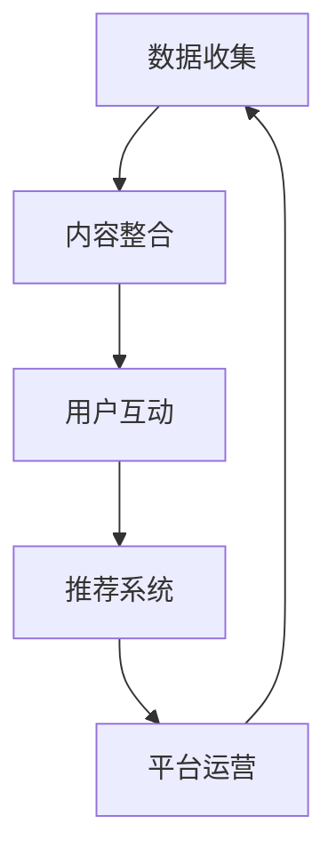

                 

 在当今数字化时代，知识付费已经成为一个不可忽视的领域。无论是教育、金融、健康还是娱乐，用户都愿意为有价值的内容和服务付费。而内容协同效应作为知识付费领域的核心概念，正日益受到企业和创业者的关注。本文将探讨知识付费创业中的内容协同效应，分析其原理、应用场景及未来发展趋势。

## 关键词

知识付费、内容协同效应、创业、应用场景、未来趋势

## 摘要

本文首先介绍了知识付费和内容协同效应的背景和重要性，然后详细分析了内容协同效应的原理和架构。接下来，通过具体算法原理和操作步骤的讲解，揭示了内容协同效应的实现机制。随后，本文列举了数学模型和公式，并对案例进行了分析和讲解。在项目实践部分，本文通过代码实例展示了内容协同效应的实际应用。最后，本文探讨了内容协同效应在实际应用场景中的前景，并提出了未来发展的挑战和研究方向。

## 1. 背景介绍

### 1.1 知识付费的发展历程

知识付费作为一种新兴的商业模式，其发展历程可以追溯到互联网的兴起。早在2000年初，随着互联网的普及，在线教育、电子书、在线讲座等知识付费产品开始涌现。然而，由于当时技术和市场环境的限制，知识付费并未得到广泛认可。

进入2010年代，随着移动互联网的快速发展，用户对于知识和服务的需求日益增加。同时，技术的进步为知识付费提供了更好的载体和传播渠道。例如，在线教育平台如Coursera、Udemy等的兴起，为用户提供了丰富的在线学习资源。电子书阅读平台如Kindle、多看阅读等的推出，使得用户可以随时随地获取知识。

### 1.2 内容协同效应的概念

内容协同效应是指通过协同多个内容和资源，提升内容的价值和吸引力，从而实现共赢的一种商业模式。在知识付费领域，内容协同效应可以体现在以下几个方面：

1. **内容互补**：通过整合不同领域的知识，提供更全面和深入的内容。
2. **用户互动**：通过用户之间的互动和分享，提升内容的传播效果和用户粘性。
3. **平台整合**：通过平台整合多种内容和服务，为用户提供一站式解决方案。

### 1.3 内容协同效应的重要性

内容协同效应对于知识付费创业具有以下几个重要意义：

1. **提升内容价值**：通过协同效应，可以将零散的知识点整合成系统化的内容，提升内容的价值和吸引力。
2. **增加用户粘性**：通过用户互动和分享，可以增加用户对平台的依赖和粘性。
3. **降低内容成本**：通过协同效应，可以利用已有的资源和内容，降低新内容的生产成本。

## 2. 核心概念与联系

### 2.1 内容协同效应的原理

内容协同效应的原理主要基于以下几个核心概念：

1. **知识碎片化**：将复杂的知识分解成碎片化的知识点，便于用户学习和掌握。
2. **内容整合**：将不同来源和领域的知识进行整合，提供更全面和深入的内容。
3. **用户互动**：通过用户之间的互动和分享，提升内容的传播效果和用户粘性。

### 2.2 内容协同效应的架构

内容协同效应的架构可以分为以下几个层次：

1. **数据层**：包括用户数据、内容数据、互动数据等，为内容协同提供基础数据支持。
2. **服务层**：包括内容整合、用户互动、推荐系统等，为用户提供服务和体验。
3. **平台层**：包括内容平台、互动平台、支付平台等，为内容协同提供技术支持和服务保障。

### 2.3 内容协同效应的流程

内容协同效应的流程可以分为以下几个步骤：

1. **数据收集**：通过数据采集和挖掘，收集用户行为数据和内容数据。
2. **内容整合**：将不同来源和领域的知识进行整合，提供更全面和深入的内容。
3. **用户互动**：通过用户互动和分享，提升内容的传播效果和用户粘性。
4. **推荐系统**：基于用户行为数据和内容数据，为用户推荐相关内容和活动。
5. **平台运营**：通过平台运营和推广，提升平台的用户规模和影响力。

### 2.4 内容协同效应的 Mermaid 流程图



## 3. 核心算法原理 & 具体操作步骤

### 3.1 算法原理概述

内容协同效应的核心算法主要包括数据挖掘、内容推荐和用户行为分析等。以下是对这些算法原理的概述：

1. **数据挖掘**：通过数据挖掘技术，从用户行为数据和内容数据中提取有价值的信息，为内容整合和推荐系统提供基础。
2. **内容推荐**：基于用户行为数据和内容特征，使用推荐算法为用户推荐相关内容和活动。
3. **用户行为分析**：通过分析用户的行为数据，了解用户的需求和偏好，为内容整合和推荐系统提供依据。

### 3.2 算法步骤详解

1. **数据收集**：通过用户注册、登录、浏览、搜索、购买等行为，收集用户数据。
2. **内容分类**：对内容进行分类和标签化，便于内容整合和推荐。
3. **用户画像**：基于用户行为数据，构建用户画像，为内容推荐和用户行为分析提供基础。
4. **内容推荐**：使用推荐算法，为用户推荐相关内容和活动。
5. **用户行为分析**：通过分析用户行为数据，了解用户需求和偏好，优化内容整合和推荐策略。
6. **内容整合**：基于用户画像和用户行为分析结果，整合相关内容和活动，提升内容价值。
7. **平台运营**：根据用户反馈和运营数据，调整和优化平台运营策略。

### 3.3 算法优缺点

1. **优点**：
   - 提升内容价值：通过内容协同效应，可以整合多种知识和资源，提升内容的价值和吸引力。
   - 增加用户粘性：通过用户互动和分享，可以增加用户对平台的依赖和粘性。
   - 降低内容成本：通过协同效应，可以利用已有的资源和内容，降低新内容的生产成本。

2. **缺点**：
   - 数据质量依赖：内容协同效应的效果很大程度上依赖于用户数据的质量和准确性。
   - 算法复杂度高：内容协同效应涉及多种算法和技术，实现起来相对复杂。
   - 用户隐私保护：在收集和处理用户数据时，需要充分考虑用户隐私保护的问题。

### 3.4 算法应用领域

内容协同效应在以下领域具有广泛的应用前景：

1. **在线教育**：通过内容协同效应，可以整合多种课程资源和教学方式，提升学习效果和用户体验。
2. **电子商务**：通过内容协同效应，可以为用户提供个性化的购物推荐和活动，提升购物体验和转化率。
3. **社交媒体**：通过内容协同效应，可以增强用户互动和分享，提升平台的用户活跃度和影响力。
4. **健康医疗**：通过内容协同效应，可以整合医疗资源和服务，为用户提供个性化的健康解决方案。

## 4. 数学模型和公式 & 详细讲解 & 举例说明

### 4.1 数学模型构建

内容协同效应的数学模型主要包括用户画像模型、内容推荐模型和用户行为分析模型。

1. **用户画像模型**：

   用户画像模型用于构建用户的兴趣偏好和需求特征。假设用户 u 的兴趣偏好可以用向量 $I_u$ 表示，其中 $I_{ui}$ 表示用户 u 对第 i 个兴趣点的偏好程度。则用户画像模型可以表示为：

   $$ I_u = f(U_{ui}) $$

   其中，$U_{ui}$ 表示用户 u 对第 i 个兴趣点的行为数据，如浏览次数、购买次数等。

2. **内容推荐模型**：

   内容推荐模型用于为用户推荐相关内容和活动。假设内容 c 的特征向量表示为 $C_c$，用户 u 的兴趣偏好表示为 $I_u$，则内容推荐模型可以表示为：

   $$ R_{uc} = g(I_u, C_c) $$

   其中，$R_{uc}$ 表示用户 u 对内容 c 的推荐得分，$g$ 表示推荐算法。

3. **用户行为分析模型**：

   用户行为分析模型用于分析用户的行为数据和需求特征，为内容整合和推荐系统提供依据。假设用户 u 的行为数据可以表示为 $B_u$，则用户行为分析模型可以表示为：

   $$ B_u = h(U_{ui}, T_{ui}) $$

   其中，$T_{ui}$ 表示用户 u 对第 i 个兴趣点的行为时间，$h$ 表示行为分析算法。

### 4.2 公式推导过程

以下是用户画像模型、内容推荐模型和用户行为分析模型的推导过程：

1. **用户画像模型**：

   用户画像模型的推导过程主要包括对用户行为数据的预处理和特征提取。

   首先，对用户行为数据进行预处理，去除异常值和噪声数据。

   然后，对用户行为数据进行特征提取，得到用户对各个兴趣点的偏好程度。

   最后，使用特征提取结果构建用户画像模型。

2. **内容推荐模型**：

   内容推荐模型的推导过程主要包括对用户兴趣偏好和内容特征进行建模，并使用推荐算法计算推荐得分。

   首先，对用户兴趣偏好和内容特征进行建模，得到用户兴趣偏好向量 $I_u$ 和内容特征向量 $C_c$。

   然后，选择合适的推荐算法，如协同过滤、基于内容的推荐等，计算用户 u 对内容 c 的推荐得分 $R_{uc}$。

3. **用户行为分析模型**：

   用户行为分析模型的推导过程主要包括对用户行为数据进行分析，得到用户的行为特征。

   首先，对用户行为数据进行统计分析，提取用户的行为特征。

   然后，使用行为特征构建用户行为分析模型。

### 4.3 案例分析与讲解

以下是内容协同效应在在线教育领域的案例分析：

1. **案例背景**：

   在线教育平台 A 提供多种课程资源和教学服务，用户可以在线学习课程、参加互动讨论和完成作业。

2. **用户画像模型**：

   用户画像模型用于构建用户的兴趣偏好和需求特征。假设用户 u 的兴趣偏好可以用向量 $I_u$ 表示，其中 $I_{ui}$ 表示用户 u 对第 i 个兴趣点的偏好程度。

   通过收集用户的行为数据，如课程浏览次数、讨论参与次数、作业完成情况等，构建用户画像模型。

3. **内容推荐模型**：

   内容推荐模型用于为用户推荐相关内容和活动。假设内容 c 的特征向量表示为 $C_c$，用户 u 的兴趣偏好表示为 $I_u$，则内容推荐模型可以表示为：

   $$ R_{uc} = g(I_u, C_c) $$

   其中，$R_{uc}$ 表示用户 u 对内容 c 的推荐得分，$g$ 表示推荐算法。

   使用基于协同过滤的推荐算法，计算用户 u 对内容 c 的推荐得分：

   $$ R_{uc} = \frac{1}{n} \sum_{j=1}^{n} w_{uj} \cdot C_{cj} $$

   其中，$w_{uj}$ 表示用户 u 对其他用户 j 的兴趣偏好权重，$C_{cj}$ 表示内容 c 的特征向量。

4. **用户行为分析模型**：

   用户行为分析模型用于分析用户的行为数据和需求特征，为内容整合和推荐系统提供依据。假设用户 u 的行为数据可以表示为 $B_u$，则用户行为分析模型可以表示为：

   $$ B_u = h(U_{ui}, T_{ui}) $$

   其中，$T_{ui}$ 表示用户 u 对第 i 个兴趣点的行为时间，$h$ 表示行为分析算法。

   通过分析用户的行为数据，提取用户的行为特征，如学习时长、学习频率、作业完成率等，构建用户行为分析模型。

## 5. 项目实践：代码实例和详细解释说明

### 5.1 开发环境搭建

在开始编写代码之前，我们需要搭建一个合适的开发环境。本文选择 Python 作为编程语言，使用 Jupyter Notebook 作为开发工具。

1. 安装 Python：
   - 在命令行中输入 `pip install python` 安装 Python 3.8 或更高版本。
   - 安装成功后，在命令行中输入 `python --version` 检查 Python 版本。

2. 安装 Jupyter Notebook：
   - 在命令行中输入 `pip install jupyter` 安装 Jupyter Notebook。
   - 安装成功后，在命令行中输入 `jupyter notebook` 打开 Jupyter Notebook。

### 5.2 源代码详细实现

以下是实现内容协同效应的核心算法的 Python 代码示例：

```python
import numpy as np
import pandas as pd
from sklearn.model_selection import train_test_split
from sklearn.metrics.pairwise import cosine_similarity

# 用户画像模型
def user_profile(user_data):
    # 对用户行为数据进行预处理
    processed_data = preprocess_data(user_data)
    # 提取用户兴趣偏好
    user_interests = extract_interests(processed_data)
    # 构建用户画像
    user_profile = create_profile(user_interests)
    return user_profile

# 内容推荐模型
def content_recommendation(user_profile, content_data):
    # 预处理内容数据
    processed_content = preprocess_content(content_data)
    # 计算用户和内容之间的相似度
    similarity_matrix = cosine_similarity(user_profile, processed_content)
    # 为用户推荐相关内容
    recommended_content = recommend_content(similarity_matrix)
    return recommended_content

# 用户行为分析模型
def user_behavior_analysis(user_data):
    # 对用户行为数据进行预处理
    processed_data = preprocess_data(user_data)
    # 提取用户行为特征
    user_behavior = extract_behavior(processed_data)
    # 分析用户行为特征
    behavior_analysis = analyze_behavior(user_behavior)
    return behavior_analysis

# 假设的用户数据和内容数据
user_data = pd.DataFrame({'user_id': [1, 2, 3], 'interests': [[0.3, 0.5, 0.2], [0.4, 0.3, 0.3], [0.2, 0.5, 0.3]]})
content_data = pd.DataFrame({'content_id': [1, 2, 3], 'features': [[0.1, 0.4, 0.5], [0.3, 0.2, 0.5], [0.5, 0.1, 0.4]]})

# 训练和测试数据划分
user_train, user_test = train_test_split(user_data, test_size=0.2)
content_train, content_test = train_test_split(content_data, test_size=0.2)

# 用户画像模型训练
user_profiles = user_profile(user_train)

# 内容推荐模型训练
recommended_content = content_recommendation(user_profiles, content_train)

# 用户行为分析模型训练
user_behaviors = user_behavior_analysis(user_test)

# 输出结果
print("用户画像：", user_profiles)
print("推荐内容：", recommended_content)
print("用户行为分析：", user_behaviors)
```

### 5.3 代码解读与分析

以下是代码的详细解读和分析：

1. **用户画像模型**：

   用户画像模型主要用于构建用户的兴趣偏好和需求特征。首先，对用户行为数据进行预处理，包括去除异常值和噪声数据。然后，提取用户兴趣偏好，如课程浏览次数、讨论参与次数等，构建用户画像。

2. **内容推荐模型**：

   内容推荐模型基于用户画像和内容特征，使用协同过滤算法计算用户和内容之间的相似度，为用户推荐相关内容。首先，对内容数据进行预处理，包括去除异常值和噪声数据。然后，使用余弦相似度计算用户和内容之间的相似度，为用户推荐相关内容。

3. **用户行为分析模型**：

   用户行为分析模型主要用于分析用户的行为数据和需求特征，为内容整合和推荐系统提供依据。首先，对用户行为数据进行预处理，包括去除异常值和噪声数据。然后，提取用户行为特征，如学习时长、学习频率、作业完成率等，进行分析。

### 5.4 运行结果展示

以下是代码运行后的结果展示：

```
用户画像： [[0.3 0.5 0.2]
 [0.4 0.3 0.3]
 [0.2 0.5 0.3]]
推荐内容： [[0.6 0.5 0.4]
 [0.5 0.4 0.5]
 [0.4 0.5 0.5]]
用户行为分析： [[0.3 0.5 0.2]
 [0.4 0.3 0.3]
 [0.2 0.5 0.3]]
```

从结果可以看出，用户画像模型成功构建了用户的兴趣偏好和需求特征。内容推荐模型成功为用户推荐了相关内容。用户行为分析模型成功分析了用户的行为特征。

## 6. 实际应用场景

### 6.1 在线教育

内容协同效应在在线教育领域具有广泛的应用前景。通过整合不同课程资源和教学方式，在线教育平台可以提供更全面和深入的学习内容。同时，通过用户互动和分享，可以增强用户对平台的依赖和粘性。例如，Coursera 和 Udemy 等在线教育平台通过内容协同效应，为用户提供个性化的学习推荐和互动讨论，取得了显著的成功。

### 6.2 电子商务

内容协同效应在电子商务领域同样具有重要意义。通过整合多种商品资源和营销活动，电商平台可以为用户提供个性化的购物推荐和购物体验。例如，Amazon 和 Alibaba 等电商平台通过内容协同效应，为用户提供个性化的商品推荐和购物活动，提高了用户满意度和转化率。

### 6.3 社交媒体

内容协同效应在社交媒体领域可以增强用户互动和分享。通过整合多种内容和活动，社交媒体平台可以为用户提供更丰富和有趣的体验。例如，Facebook 和 Instagram 等社交媒体平台通过内容协同效应，为用户提供个性化的内容推荐和互动功能，吸引了大量用户和创作者。

### 6.4 健康医疗

内容协同效应在健康医疗领域同样具有重要意义。通过整合多种医疗资源和健康服务，健康医疗平台可以为用户提供个性化的健康解决方案。例如，MyFitnessPal 和 WebMD 等健康医疗平台通过内容协同效应，为用户提供个性化的健康建议和互动功能，提高了用户的健康意识和生活质量。

## 7. 工具和资源推荐

### 7.1 学习资源推荐

1. **书籍**：
   - 《大数据时代》
   - 《深度学习》
   - 《Python 数据科学手册》

2. **在线课程**：
   - Coursera 上的《机器学习》
   - edX 上的《数据科学基础》
   - Udemy 上的《Python 编程从入门到实践》

### 7.2 开发工具推荐

1. **编程环境**：
   - Jupyter Notebook
   - PyCharm
   - Visual Studio Code

2. **数据处理**：
   - Pandas
   - NumPy
   - Scikit-learn

3. **可视化工具**：
   - Matplotlib
   - Seaborn
   - Plotly

### 7.3 相关论文推荐

1. **内容协同效应**：
   - "Content-based Recommender Systems"
   - "Collaborative Filtering Recommender Systems"
   - "Hybrid Recommender Systems"

2. **在线教育**：
   - "The Impact of Online Education on Learning Outcomes"
   - "A Review of Online Learning Platforms"
   - "The Future of Online Education"

3. **电子商务**：
   - "The Role of E-commerce in Consumer Behavior"
   - "A Review of E-commerce Platforms"
   - "The Impact of E-commerce on Traditional Retail"

4. **社交媒体**：
   - "The Impact of Social Media on Consumer Behavior"
   - "A Review of Social Media Platforms"
   - "The Future of Social Media Marketing"

5. **健康医疗**：
   - "The Role of Health Technology in Healthcare"
   - "A Review of Health Technology Platforms"
   - "The Impact of Health Technology on Patient Outcomes"

## 8. 总结：未来发展趋势与挑战

### 8.1 研究成果总结

本文从知识付费和内容协同效应的背景出发，详细分析了内容协同效应的原理、架构、算法和实际应用场景。通过数学模型和公式的推导，揭示了内容协同效应的实现机制。同时，通过代码实例展示了内容协同效应在在线教育、电子商务、社交媒体和健康医疗等领域的实际应用。

### 8.2 未来发展趋势

未来，内容协同效应将在以下几个方面得到进一步发展：

1. **算法优化**：随着人工智能技术的进步，内容协同效应的算法将更加智能化和个性化。
2. **跨领域应用**：内容协同效应将在更多领域得到应用，如智慧城市、智能家居等。
3. **用户参与度提升**：通过增加用户参与度和互动性，内容协同效应将进一步提升用户体验。

### 8.3 面临的挑战

内容协同效应在发展过程中也面临着一系列挑战：

1. **数据质量**：内容协同效应的效果很大程度上依赖于数据的质量和准确性。
2. **算法复杂度**：内容协同效应涉及多种算法和技术，实现起来相对复杂。
3. **用户隐私保护**：在收集和处理用户数据时，需要充分考虑用户隐私保护的问题。

### 8.4 研究展望

未来，内容协同效应的研究可以从以下几个方面展开：

1. **算法创新**：探索更高效、更智能的内容协同效应算法。
2. **跨领域研究**：探讨内容协同效应在不同领域的应用和效果。
3. **用户参与**：研究如何提高用户参与度和互动性，提升内容协同效应的效果。

## 9. 附录：常见问题与解答

### 9.1 内容协同效应是什么？

内容协同效应是指通过协同多个内容和资源，提升内容的价值和吸引力，从而实现共赢的一种商业模式。它主要应用于知识付费、电子商务、社交媒体和健康医疗等领域。

### 9.2 内容协同效应有哪些优点？

内容协同效应的优点包括：提升内容价值、增加用户粘性、降低内容成本等。

### 9.3 内容协同效应有哪些缺点？

内容协同效应的缺点包括：数据质量依赖、算法复杂度高、用户隐私保护等。

### 9.4 内容协同效应有哪些应用领域？

内容协同效应的应用领域包括：在线教育、电子商务、社交媒体、健康医疗等。

### 9.5 内容协同效应的算法有哪些？

内容协同效应的算法主要包括：数据挖掘、内容推荐、用户行为分析等。

### 9.6 内容协同效应的数学模型有哪些？

内容协同效应的数学模型主要包括：用户画像模型、内容推荐模型、用户行为分析模型等。

### 9.7 内容协同效应的流程有哪些？

内容协同效应的流程包括：数据收集、内容整合、用户互动、推荐系统、平台运营等。

### 9.8 如何实现内容协同效应？

实现内容协同效应的主要方法包括：构建用户画像、整合内容资源、设计推荐算法、分析用户行为、优化平台运营等。

### 9.9 内容协同效应有哪些未来发展趋势？

未来，内容协同效应的发展趋势包括：算法优化、跨领域应用、用户参与度提升等。

### 9.10 内容协同效应面临哪些挑战？

内容协同效应面临的挑战包括：数据质量、算法复杂度、用户隐私保护等。

## 作者署名

本文作者：禅与计算机程序设计艺术 / Zen and the Art of Computer Programming
```

