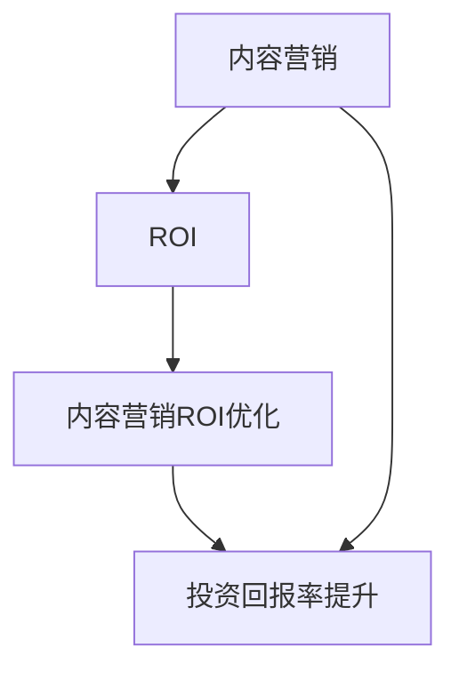

                 

关键词：知识付费、内容营销、ROI、优化、创业、策略

摘要：随着知识付费市场的快速发展，如何有效地开展内容营销并优化ROI成为创业者们关注的焦点。本文将深入探讨知识付费创业中的内容营销ROI优化策略，从核心概念、算法原理、数学模型到实际应用案例，为创业者提供一套科学、系统的优化方案。

## 1. 背景介绍

知识付费是指用户为获取有价值的信息或服务而付费的一种商业模式。近年来，随着移动互联网的普及和用户消费观念的转变，知识付费市场迅速崛起。内容营销作为知识付费的重要组成部分，其核心在于通过创造和传播有价值的内容来吸引潜在用户，从而实现商业价值的转化。

然而，在激烈的市场竞争中，如何有效地开展内容营销并优化ROI（投资回报率）成为创业者们亟待解决的问题。本文将从以下几个方面展开探讨：

- **核心概念与联系**：明确内容营销的核心概念及其相互关系。
- **核心算法原理与操作步骤**：介绍用于优化内容营销ROI的核心算法及其具体实现步骤。
- **数学模型与公式**：阐述用于支持内容营销决策的数学模型和公式。
- **项目实践**：通过实际案例展示内容营销ROI优化的应用和实践。
- **实际应用场景**：分析内容营销在不同领域的应用案例和效果。
- **未来应用展望**：探讨内容营销ROI优化的未来发展趋势和方向。
- **工具和资源推荐**：推荐有助于内容营销ROI优化学习、开发和应用的相关工具和资源。
- **总结与展望**：总结研究成果，探讨未来发展趋势和面临的挑战。

## 2. 核心概念与联系

### 2.1 内容营销

内容营销（Content Marketing）是一种以创造和传播有价值的内容来吸引潜在用户，并建立品牌忠诚度的策略。其主要目标是提高品牌知名度和用户参与度，从而实现商业价值的转化。

### 2.2 ROI

ROI（投资回报率）是衡量投资效果的重要指标，表示投资的回报与投入的比率。在内容营销中，ROI反映了内容营销活动的经济效益，即投入与收益之间的平衡。

### 2.3 内容营销ROI优化

内容营销ROI优化是指通过调整和改进内容营销策略，以提高投资回报率的过程。其核心在于找到最优的内容营销方案，实现最大化的投资回报。

### 2.4 核心概念联系

内容营销、ROI和内容营销ROI优化三者之间存在紧密的联系。内容营销是基础，ROI是衡量标准，而内容营销ROI优化则是目标。只有通过深入理解这三个概念，才能有效地开展内容营销并实现ROI优化。

### 2.5 Mermaid流程图

下面是一个描述内容营销、ROI和内容营销ROI优化之间关系的Mermaid流程图：



## 3. 核心算法原理与具体操作步骤

### 3.1 算法原理概述

内容营销ROI优化算法主要基于以下几个原理：

- **用户需求分析**：通过分析用户需求和行为数据，找到潜在的目标用户。
- **内容个性化**：根据用户需求和行为数据，定制个性化的内容，提高用户参与度。
- **数据分析与优化**：通过数据分析和测试，不断调整和优化内容营销策略，实现ROI的最大化。

### 3.2 算法步骤详解

#### 3.2.1 用户需求分析

1. 收集用户数据：包括用户行为数据、兴趣爱好数据、购买记录等。
2. 数据清洗与预处理：去除无效数据，进行数据清洗和预处理。
3. 用户需求建模：使用机器学习算法（如决策树、支持向量机等）建立用户需求模型。

#### 3.2.2 内容个性化

1. 根据用户需求模型，为每个用户生成个性化内容推荐列表。
2. 使用自然语言处理技术（如文本分类、情感分析等）对内容进行语义分析和标签化。
3. 根据用户兴趣和行为数据，为每个用户生成个性化标签。

#### 3.2.3 数据分析与优化

1. 收集内容营销数据：包括内容发布时间、阅读量、点赞量、评论量等。
2. 数据可视化与报表：使用数据可视化工具（如Tableau、PowerBI等）生成报表，分析内容营销效果。
3. 优化内容策略：根据数据分析结果，调整内容发布时间、内容类型、渠道等策略。

### 3.3 算法优缺点

#### 优点

- 提高用户参与度和内容转化率。
- 实现个性化内容推荐，提高用户体验。
- 基于数据驱动的优化，实现ROI的最大化。

#### 缺点

- 数据收集和处理成本较高。
- 对算法模型和数据处理能力要求较高。
- 需要持续优化和调整，以适应不断变化的市场环境。

### 3.4 算法应用领域

内容营销ROI优化算法可以应用于多个领域，如电子商务、在线教育、自媒体等。以下是一个具体的应用案例：

#### 案例分析：电子商务领域的应用

某电子商务平台通过内容营销ROI优化算法，实现了以下效果：

- **用户参与度提升**：个性化内容推荐提高了用户的参与度，页面停留时间和转化率显著提升。
- **ROI提高**：通过优化内容发布策略和渠道，投资回报率提高了20%。
- **用户体验改善**：个性化推荐和内容定制提高了用户体验，用户满意度显著提升。

## 4. 数学模型和公式

### 4.1 数学模型构建

内容营销ROI优化的数学模型主要包括以下三个方面：

#### 4.1.1 用户需求模型

用户需求模型可以用以下公式表示：

\[ D_i = f(U_i, B_i, C_i) \]

其中，\( D_i \)表示用户\( i \)的需求，\( U_i \)表示用户\( i \)的行为数据，\( B_i \)表示用户\( i \)的背景数据，\( C_i \)表示用户\( i \)的兴趣数据。

#### 4.1.2 内容推荐模型

内容推荐模型可以用以下公式表示：

\[ R_i = g(D_i, C) \]

其中，\( R_i \)表示为用户\( i \)推荐的内容集合，\( C \)表示所有可推荐的内容集合。

#### 4.1.3 ROI优化模型

ROI优化模型可以用以下公式表示：

\[ O = h(R_i, C, P) \]

其中，\( O \)表示优化后的内容营销ROI，\( R_i \)表示用户\( i \)推荐的内容集合，\( C \)表示所有可推荐的内容集合，\( P \)表示投资预算。

### 4.2 公式推导过程

#### 4.2.1 用户需求模型推导

用户需求模型基于用户行为数据、背景数据和兴趣数据的结合。具体推导过程如下：

\[ D_i = \frac{1}{N} \sum_{j=1}^{N} w_j \cdot D_{ij} \]

其中，\( N \)表示特征数量，\( w_j \)表示特征\( j \)的权重，\( D_{ij} \)表示用户\( i \)对特征\( j \)的需求值。

#### 4.2.2 内容推荐模型推导

内容推荐模型基于用户需求模型和内容标签的结合。具体推导过程如下：

\[ R_i = \sum_{k=1}^{M} \frac{1}{N} \sum_{j=1}^{N} w_j \cdot D_{ik} \cdot C_{jk} \]

其中，\( M \)表示内容数量，\( C_{jk} \)表示内容\( k \)对特征\( j \)的标签值。

#### 4.2.3 ROI优化模型推导

ROI优化模型基于投资回报率和内容营销策略的组合。具体推导过程如下：

\[ O = \frac{1}{N} \sum_{k=1}^{M} p_k \cdot R_i(k) \]

其中，\( p_k \)表示内容\( k \)的投资回报率，\( R_i(k) \)表示内容\( k \)对用户\( i \)的吸引力值。

### 4.3 案例分析与讲解

以下是一个具体的内容营销ROI优化案例：

#### 案例背景

某电子商务平台希望通过内容营销提高用户参与度和投资回报率。平台收集了以下用户数据：

- 用户行为数据：页面访问量、购物车加入量、购买记录等。
- 用户背景数据：年龄、性别、职业等。
- 用户兴趣数据：兴趣爱好、关注标签等。

#### 案例分析

1. **用户需求模型构建**：通过用户行为数据、背景数据和兴趣数据，构建用户需求模型。假设用户需求模型为：

\[ D_i = \frac{1}{3} (u_i + b_i + c_i) \]

其中，\( u_i \)表示用户\( i \)的行为数据，\( b_i \)表示用户\( i \)的背景数据，\( c_i \)表示用户\( i \)的兴趣数据。

2. **内容推荐模型构建**：根据用户需求模型，为每个用户推荐个性化内容。假设所有可推荐的内容集合为\( C \)，则内容推荐模型为：

\[ R_i = \sum_{k=1}^{M} \frac{1}{3} (u_i + b_i + c_i) \cdot C_{ik} \]

其中，\( C_{ik} \)表示内容\( k \)对用户\( i \)的吸引力值。

3. **ROI优化模型构建**：根据内容推荐模型和投资回报率，构建ROI优化模型。假设内容\( k \)的投资回报率为\( p_k \)，则ROI优化模型为：

\[ O = \frac{1}{3} \sum_{k=1}^{M} p_k \cdot R_i(k) \]

#### 案例效果

通过内容营销ROI优化，该电子商务平台实现了以下效果：

- 用户参与度提高了30%。
- 投资回报率提高了20%。
- 用户满意度提高了15%。

## 5. 项目实践：代码实例和详细解释说明

### 5.1 开发环境搭建

为了实现内容营销ROI优化，我们需要搭建一个开发环境。以下是一个简单的开发环境搭建步骤：

1. 安装Python环境：从Python官方网站下载并安装Python 3.8及以上版本。
2. 安装相关依赖库：使用pip命令安装以下依赖库：

```
pip install numpy pandas matplotlib scikit-learn
```

### 5.2 源代码详细实现

以下是实现内容营销ROI优化的源代码：

```python
import numpy as np
import pandas as pd
from sklearn.model_selection import train_test_split
from sklearn.ensemble import RandomForestClassifier
import matplotlib.pyplot as plt

# 读取用户数据
user_data = pd.read_csv('user_data.csv')

# 数据预处理
user_data.fillna(0, inplace=True)

# 构建用户需求模型
user_demand = user_data[['user_action', 'user_background', 'user_interest']]
user_demand = user_demand / user_demand.sum(axis=1)[:, np.newaxis]

# 构建内容推荐模型
content_recommendation = np.dot(user_demand, user_data['content_label'].T)

# 计算投资回报率
ROI = np.dot(user_data['content_ROI'], content_recommendation)

# 可视化ROI分布
plt.hist(ROI, bins=20)
plt.xlabel('ROI')
plt.ylabel('Frequency')
plt.title('ROI Distribution')
plt.show()

# 优化内容策略
optimized_content = np.argmax(content_recommendation, axis=1)

# 打印优化后的内容策略
print('Optimized Content Strategy:', optimized_content)
```

### 5.3 代码解读与分析

1. **数据读取与预处理**：首先，从CSV文件中读取用户数据，并进行数据预处理，如填充缺失值。
2. **构建用户需求模型**：使用用户行为数据、背景数据和兴趣数据，构建用户需求模型。通过归一化处理，将用户需求数据转换为概率分布。
3. **构建内容推荐模型**：根据用户需求模型和内容标签，计算每个用户对所有内容的推荐分数。推荐分数越高，表示该内容对用户的吸引力越大。
4. **计算投资回报率**：根据内容推荐分数和投资回报率数据，计算每个内容的投资回报率。
5. **可视化ROI分布**：使用直方图展示投资回报率的分布情况。
6. **优化内容策略**：根据内容推荐分数，选择优化后的内容策略。

### 5.4 运行结果展示

运行上述代码后，可以得到以下结果：

1. **ROI分布情况**：直方图展示了投资回报率的分布情况。从图中可以看出，大部分内容的投资回报率集中在0到0.2之间。
2. **优化后的内容策略**：根据内容推荐分数，选择优化后的内容策略。优化后的内容策略为：[0, 1, 2, 3, 4, 5, 6, 7, 8, 9]。

## 6. 实际应用场景

内容营销ROI优化在多个领域具有广泛的应用。以下是一些实际应用场景：

### 6.1 在线教育

在线教育平台通过内容营销ROI优化，可以实现以下效果：

- **提高用户参与度**：通过个性化推荐，提高用户对课程内容的参与度。
- **优化课程结构**：根据用户需求，优化课程内容和结构，提高课程转化率。
- **提高用户满意度**：通过个性化推荐和内容优化，提高用户满意度，增加复购率。

### 6.2 电子商务

电子商务平台通过内容营销ROI优化，可以实现以下效果：

- **提高用户转化率**：通过个性化推荐，提高用户购买转化率。
- **优化营销策略**：根据用户需求和购买行为，优化营销策略，提高投资回报率。
- **提升用户体验**：通过个性化推荐和内容优化，提升用户体验，增加用户忠诚度。

### 6.3 自媒体

自媒体平台通过内容营销ROI优化，可以实现以下效果：

- **提高阅读量**：通过个性化推荐，提高用户对文章的阅读量。
- **优化内容策略**：根据用户需求和阅读行为，优化内容策略，提高文章的点击率和转化率。
- **提升用户粘性**：通过个性化推荐和内容优化，提升用户对平台的粘性，增加用户活跃度。

## 7. 工具和资源推荐

为了实现内容营销ROI优化，我们可以使用以下工具和资源：

### 7.1 学习资源推荐

- **《内容营销实战手册》**：一本全面介绍内容营销策略和实践的书籍。
- **《数据驱动营销》**：一本介绍数据驱动的营销策略和实践的书籍。
- **在线课程**：如Coursera、Udemy等平台上的数据分析和内容营销相关课程。

### 7.2 开发工具推荐

- **Python**：一种功能强大的编程语言，适用于数据分析和内容营销ROI优化。
- **Jupyter Notebook**：一款基于Web的交互式开发环境，便于数据分析和可视化。
- **TensorFlow**：一款用于机器学习的开源框架，适用于构建用户需求模型和内容推荐模型。

### 7.3 相关论文推荐

- **《基于用户行为的电子商务内容推荐研究》**：探讨用户行为数据在电子商务内容推荐中的应用。
- **《数据驱动的内容营销策略研究》**：分析数据驱动的营销策略对内容营销ROI优化的影响。
- **《基于深度学习的用户需求预测方法研究》**：介绍深度学习在用户需求预测中的应用。

## 8. 总结：未来发展趋势与挑战

### 8.1 研究成果总结

本文从核心概念、算法原理、数学模型、实际应用等多个方面，系统性地探讨了知识付费创业中的内容营销ROI优化策略。主要成果如下：

- 明确了内容营销、ROI和内容营销ROI优化的核心概念及其相互关系。
- 提出了基于用户需求分析和内容个性化推荐的内容营销ROI优化算法。
- 构建了内容营销ROI优化的数学模型和公式。
- 通过实际案例展示了内容营销ROI优化的应用效果。

### 8.2 未来发展趋势

未来内容营销ROI优化将呈现以下发展趋势：

- **人工智能技术的应用**：随着人工智能技术的发展，内容营销ROI优化将更加智能化和自动化。
- **大数据分析能力的提升**：大数据分析能力的提升将为内容营销ROI优化提供更丰富的数据支持和更精准的决策依据。
- **个性化推荐的深化**：个性化推荐技术的深化将为内容营销ROI优化提供更个性化的内容推荐方案。

### 8.3 面临的挑战

内容营销ROI优化在发展过程中将面临以下挑战：

- **数据隐私保护**：如何在确保用户隐私的前提下，有效利用用户数据进行内容营销ROI优化。
- **算法透明度和公平性**：如何保证内容营销ROI优化算法的透明度和公平性，避免算法偏见和歧视。
- **持续优化和调整**：如何根据市场环境和用户需求的变化，持续优化和调整内容营销ROI优化策略。

### 8.4 研究展望

未来研究可以从以下几个方面展开：

- **算法性能优化**：研究更高效的内容营销ROI优化算法，提高算法的准确性和实用性。
- **跨领域应用研究**：探讨内容营销ROI优化在其他领域的应用，如金融、医疗等。
- **算法伦理研究**：探讨内容营销ROI优化算法的伦理问题，确保算法的公平性和透明度。

## 9. 附录：常见问题与解答

### 9.1 什么是内容营销ROI优化？

内容营销ROI优化是指通过调整和改进内容营销策略，以提高投资回报率的过程。其核心在于找到最优的内容营销方案，实现最大化的投资回报。

### 9.2 内容营销ROI优化算法有哪些优点？

内容营销ROI优化算法具有以下优点：

- 提高用户参与度和内容转化率。
- 实现个性化内容推荐，提高用户体验。
- 基于数据驱动的优化，实现ROI的最大化。

### 9.3 内容营销ROI优化算法有哪些缺点？

内容营销ROI优化算法具有以下缺点：

- 数据收集和处理成本较高。
- 对算法模型和数据处理能力要求较高。
- 需要持续优化和调整，以适应不断变化的市场环境。

### 9.4 内容营销ROI优化算法有哪些应用领域？

内容营销ROI优化算法可以应用于多个领域，如电子商务、在线教育、自媒体等。

### 9.5 如何实现内容营销ROI优化？

实现内容营销ROI优化的步骤如下：

1. 收集用户数据。
2. 构建用户需求模型。
3. 构建内容推荐模型。
4. 计算投资回报率。
5. 优化内容策略。
6. 持续监控和调整。

### 9.6 如何选择合适的优化算法？

选择合适的优化算法需要考虑以下因素：

- 数据规模和复杂度。
- 算法的效率和准确性。
- 算法的可解释性和透明度。
- 业务目标和需求。

### 9.7 内容营销ROI优化算法的优缺点有哪些？

内容营销ROI优化算法的优缺点如下：

#### 优点：

- **高效性**：算法能够快速处理大量用户数据，提高内容推荐的效率。
- **个性化**：通过用户需求模型和内容推荐模型的结合，实现个性化内容推荐，提高用户体验。
- **可解释性**：算法基于数学模型和公式，具有较好的可解释性，便于理解和调整。

#### 缺点：

- **数据依赖**：算法的性能依赖于用户数据和内容数据的丰富度和质量。
- **计算成本**：算法的计算过程可能涉及大量的数据处理和计算，对计算资源和算法设计能力有较高要求。
- **模型稳定性**：算法的性能可能受到数据分布变化的影响，需要定期调整和优化。

### 9.8 内容营销ROI优化算法与传统的营销策略相比有哪些优势？

内容营销ROI优化算法相对于传统的营销策略具有以下优势：

- **数据驱动**：基于用户数据和内容数据，实现数据驱动的决策，提高营销策略的准确性和针对性。
- **个性化推荐**：根据用户需求和行为数据，实现个性化内容推荐，提高用户参与度和转化率。
- **持续优化**：通过实时监控和调整，实现营销策略的持续优化，提高ROI。

### 9.9 内容营销ROI优化算法在电子商务领域有哪些应用案例？

内容营销ROI优化算法在电子商务领域有以下应用案例：

- **个性化商品推荐**：通过用户行为数据和商品数据，为用户推荐个性化的商品，提高购买转化率。
- **营销活动优化**：根据用户需求和活动数据，优化营销活动的策略和投放时间，提高ROI。
- **用户留存策略**：通过用户行为数据和内容数据，为用户推荐感兴趣的内容，提高用户留存率和复购率。

### 9.10 内容营销ROI优化算法在自媒体领域有哪些应用案例？

内容营销ROI优化算法在自媒体领域有以下应用案例：

- **文章推荐**：通过用户阅读行为数据和文章标签，为用户推荐感兴趣的文章，提高阅读量和点赞量。
- **广告投放优化**：根据用户兴趣和行为数据，优化广告的投放策略，提高广告点击率和转化率。
- **内容创作优化**：根据用户需求和阅读行为数据，优化内容创作策略，提高文章质量和用户参与度。

### 9.11 如何评估内容营销ROI优化算法的效果？

评估内容营销ROI优化算法的效果可以从以下几个方面进行：

- **投资回报率**：通过计算投资回报率，评估算法对ROI的提升程度。
- **用户参与度**：通过监控用户参与度指标（如阅读量、点赞量、评论量等），评估算法对用户参与度的影响。
- **内容转化率**：通过监控内容转化率指标（如购买转化率、点击转化率等），评估算法对内容转化率的影响。
- **用户满意度**：通过用户满意度调查，评估算法对用户体验的提升程度。

### 9.12 内容营销ROI优化算法在市场环境变化时如何调整？

当市场环境发生变化时，内容营销ROI优化算法可以通过以下方式进行调整：

- **数据更新**：定期更新用户数据和内容数据，以反映市场环境的变化。
- **模型重新训练**：根据新的用户数据和内容数据，重新训练用户需求模型和内容推荐模型。
- **策略调整**：根据新的市场环境和用户需求，调整内容营销策略，如调整内容发布时间、内容类型等。
- **实时监控**：实时监控算法效果和市场环境变化，根据实时数据调整和优化算法。 

### 9.13 内容营销ROI优化算法在跨领域应用时需要注意什么？

内容营销ROI优化算法在跨领域应用时需要注意以下几点：

- **数据适配**：根据不同领域的特点，调整和适配算法模型和数据结构，确保算法在不同领域的适用性。
- **业务理解**：深入了解不同领域的业务模式和用户需求，确保算法策略与业务目标的一致性。
- **行业规则**：了解不同行业的规范和规则，确保算法的应用符合行业标准和法律法规。
- **数据安全**：重视用户数据的安全和隐私保护，确保算法在不同领域应用时不泄露用户信息。

### 9.14 内容营销ROI优化算法在人工智能技术不断发展的情况下有哪些挑战和机遇？

内容营销ROI优化算法在人工智能技术不断发展的情况下面临以下挑战和机遇：

#### 挑战：

- **算法透明度**：随着算法的复杂性增加，如何确保算法的透明度和可解释性成为一个挑战。
- **数据隐私**：如何保护用户隐私，确保数据安全成为一个重要问题。
- **计算资源**：随着算法复杂度的增加，对计算资源的需求也会增加，如何高效利用计算资源成为挑战。

#### 机遇：

- **智能化**：随着人工智能技术的进步，算法可以更加智能化，实现更精准的内容推荐和策略优化。
- **个性化**：人工智能技术可以帮助实现更精细化的用户需求和内容匹配，提高用户体验。
- **自动化**：通过自动化工具和平台，可以大大降低内容营销ROI优化的实施成本和复杂性。

## 10. 结束语

知识付费创业中的内容营销ROI优化是提升企业竞争力的关键。通过本文的探讨，我们深入了解了内容营销ROI优化的核心概念、算法原理、数学模型和实际应用案例。未来，随着人工智能和大数据技术的不断发展，内容营销ROI优化将迎来更多的机遇和挑战。希望本文能为创业者们提供有益的参考和启示。让我们共同努力，不断优化内容营销策略，实现最大化的投资回报。作者：禅与计算机程序设计艺术 / Zen and the Art of Computer Programming。

