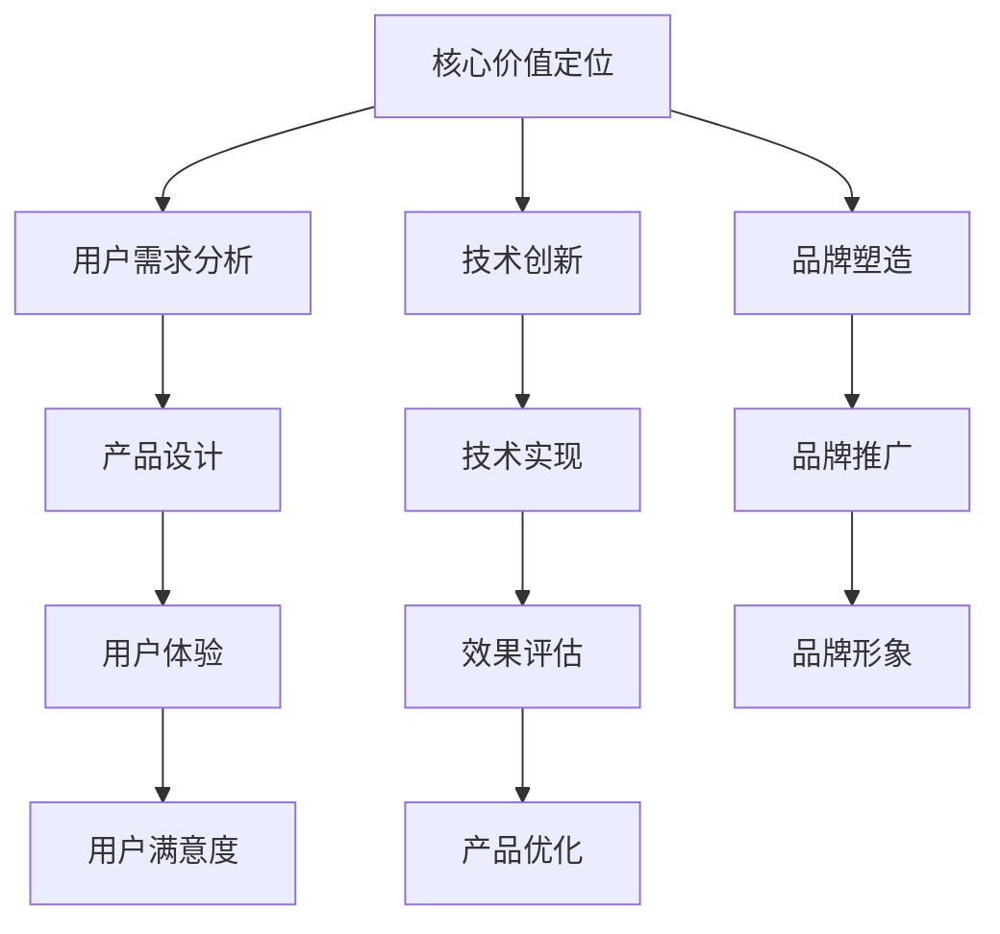

                 

关键词：知识付费、产品差异化、市场竞争、用户体验、创新策略

摘要：本文从知识付费行业的背景出发，分析了当前市场竞争态势，探讨了产品差异化的重要性。通过深入探讨产品差异化策略，包括核心价值定位、用户需求分析、技术创新和品牌塑造等多个方面，为知识付费创业者提供了有价值的参考。同时，文章还展望了知识付费行业的未来发展，并提出了应对挑战的策略建议。

## 1. 背景介绍

知识付费作为一种新型的商业模式，近年来在我国迅速崛起。随着互联网的普及和人们消费观念的转变，越来越多的人开始愿意为高质量的知识内容付费。知识付费平台如知乎、得到、喜马拉雅等纷纷涌现，吸引了大量的用户和内容创作者。然而，随着市场的不断扩大，竞争也日益激烈，如何在众多竞争者中脱颖而出，成为每个知识付费创业者必须面对的挑战。

### 知识付费行业的现状

根据相关数据显示，我国知识付费市场规模已从2016年的90亿元增长至2021年的125亿元，年均增长率达到20%。用户规模也从2016年的1.09亿人增长至2021年的2.09亿人，呈现出高速增长的态势。这些数据表明，知识付费行业具有巨大的市场潜力和发展空间。

然而，随着市场的不断扩大，知识付费行业的竞争也日益加剧。各大平台纷纷加大投入，推出各种优惠活动和特色课程，以吸引更多的用户。在这种激烈的竞争中，如何实现产品差异化，成为知识付费创业者的核心课题。

### 竞争态势分析

目前，知识付费行业主要存在以下几种竞争态势：

1. **价格战**：为了吸引更多的用户，部分平台采取了低价策略，以低价位优势抢占市场份额。

2. **内容竞争**：优质内容是知识付费平台的核心竞争力。各大平台纷纷引入知名专家和优质内容，以提升自身的品牌影响力。

3. **用户体验**：良好的用户体验是留住用户的关键。各大平台在产品设计和功能上不断创新，以提高用户满意度。

4. **技术创新**：利用人工智能、大数据等技术，提升内容推荐和个性化服务的水平，成为各大平台的战略选择。

## 2. 核心概念与联系

### 产品差异化策略

产品差异化策略是指通过独特的特点或功能，使产品在市场竞争中脱颖而出。在知识付费行业中，产品差异化策略包括以下几个方面：

1. **核心价值定位**：明确产品的核心价值，并将其贯穿于整个产品设计和服务中。

2. **用户需求分析**：深入了解用户需求，提供针对性的内容和服务。

3. **技术创新**：利用先进技术提升产品竞争力，如人工智能、大数据等。

4. **品牌塑造**：通过品牌塑造提升品牌知名度和美誉度。

### Mermaid 流程图



### 2.1 核心价值定位

核心价值定位是产品差异化的基础。在知识付费行业中，核心价值定位需要考虑以下几个方面：

1. **内容质量**：提供高质量的、专业的知识内容。

2. **个性化服务**：根据用户需求提供个性化的内容和服务。

3. **互动性**：提供良好的互动平台，促进用户之间的交流。

4. **便捷性**：提供便捷的支付和访问方式。

### 2.2 用户需求分析

用户需求分析是制定产品差异化策略的关键。在知识付费行业中，用户需求分析需要考虑以下几个方面：

1. **用户群体**：分析目标用户群体，了解他们的需求和偏好。

2. **内容需求**：分析用户对知识内容的需求，包括领域、深度、形式等。

3. **学习方式**：分析用户的学习方式和习惯。

### 2.3 技术创新

技术创新是提升产品竞争力的重要手段。在知识付费行业中，技术创新主要体现在以下几个方面：

1. **人工智能**：利用人工智能技术，实现内容推荐、用户画像等。

2. **大数据**：通过大数据分析，了解用户行为和需求，优化产品和服务。

3. **云计算**：利用云计算技术，提升系统的可扩展性和稳定性。

### 2.4 品牌塑造

品牌塑造是提升品牌知名度和美誉度的关键。在知识付费行业中，品牌塑造需要考虑以下几个方面：

1. **品牌定位**：明确品牌的核心价值和目标用户群体。

2. **品牌传播**：通过线上线下多种渠道，提升品牌知名度。

3. **品牌互动**：通过互动活动，增强用户对品牌的认同感和忠诚度。

## 3. 核心算法原理 & 具体操作步骤

### 3.1 算法原理概述

在知识付费行业中，核心算法原理主要涉及以下几个方面：

1. **内容推荐算法**：基于用户行为和偏好，推荐符合用户兴趣的内容。

2. **用户画像算法**：通过分析用户行为和需求，构建用户画像，为个性化推荐提供基础。

3. **数据挖掘算法**：通过大数据分析，发现用户行为和需求的规律，为产品优化提供依据。

### 3.2 算法步骤详解

#### 3.2.1 内容推荐算法

1. **用户行为分析**：收集用户在平台上的行为数据，如浏览、收藏、购买等。

2. **内容特征提取**：提取内容的关键特征，如标签、分类等。

3. **推荐算法实现**：采用协同过滤、内容匹配等算法，为用户推荐符合其兴趣的内容。

#### 3.2.2 用户画像算法

1. **用户行为数据收集**：收集用户在平台上的行为数据，如浏览、收藏、购买等。

2. **特征工程**：对用户行为数据进行处理和转换，提取有价值的特征。

3. **用户画像构建**：基于提取的特征，构建用户画像，为个性化推荐提供基础。

#### 3.2.3 数据挖掘算法

1. **数据预处理**：对原始数据进行处理和清洗，保证数据的质量。

2. **特征选择**：从大量特征中筛选出对目标有显著影响的特征。

3. **模式发现**：利用聚类、分类等算法，发现用户行为和需求的规律。

### 3.3 算法优缺点

#### 3.3.1 内容推荐算法

**优点**：

- **个性化强**：根据用户兴趣推荐内容，提高用户体验。
- **效果明显**：能够显著提高用户活跃度和留存率。

**缺点**：

- **数据依赖性强**：需要大量的用户行为数据支持。
- **推荐结果单一**：仅考虑用户兴趣，可能忽视其他维度。

#### 3.3.2 用户画像算法

**优点**：

- **全面性**：通过用户行为数据构建用户画像，全面了解用户需求。
- **个性化**：为个性化推荐提供基础，提高推荐效果。

**缺点**：

- **准确性**：用户行为数据的准确性和完整性会影响画像的准确性。
- **维护成本高**：需要定期更新和维护用户画像。

#### 3.3.3 数据挖掘算法

**优点**：

- **规律性强**：通过数据分析，发现用户行为和需求的规律。
- **应用广泛**：可以应用于多种场景，如市场预测、风险评估等。

**缺点**：

- **复杂性**：需要专业的数据分析和挖掘技能。
- **结果解释难度大**：分析结果需要专业人员进行解读。

### 3.4 算法应用领域

#### 3.4.1 内容推荐

- **电子商务**：根据用户浏览和购买记录，推荐相关商品。
- **社交媒体**：根据用户兴趣，推荐感兴趣的朋友和内容。
- **新闻媒体**：根据用户阅读习惯，推荐相关新闻和文章。

#### 3.4.2 用户画像

- **金融行业**：根据用户行为，评估用户信用等级和风险偏好。
- **零售行业**：根据用户行为，提供个性化的购物推荐。
- **医疗行业**：根据用户健康数据，提供个性化的健康建议。

#### 3.4.3 数据挖掘

- **市场预测**：通过数据分析，预测市场趋势和消费者行为。
- **风险管理**：通过数据分析，识别潜在风险和异常行为。
- **智能客服**：通过数据分析，提供智能化的客服服务。

## 4. 数学模型和公式 & 详细讲解 & 举例说明

### 4.1 数学模型构建

在知识付费产品差异化策略中，数学模型主要用于用户行为分析和推荐算法的实现。以下是一个简单的用户行为分析模型：

#### 用户行为分析模型

$$
用户行为矩阵 = [行为_1, 行为_2, ..., 行为_n]
$$

其中，$行为_i$ 表示用户在特定时间段内对某一内容的操作行为，如浏览、收藏、购买等。行为矩阵可以表示为：

$$
行为矩阵 = \begin{bmatrix}
行为_1 \\
行为_2 \\
\vdots \\
行为_n
\end{bmatrix}
$$

#### 内容推荐模型

基于用户行为矩阵，可以构建一个内容推荐模型。假设有 $m$ 个内容，每个内容都有一个对应的特征向量：

$$
内容特征向量 = [特征_1, 特征_2, ..., 特征_m]
$$

内容特征向量可以表示为：

$$
特征向量 = \begin{bmatrix}
特征_1 \\
特征_2 \\
\vdots \\
特征_m
\end{bmatrix}
$$

内容推荐模型的目标是找到与用户行为矩阵最相似的内容特征向量，从而推荐给用户。这可以通过余弦相似度计算实现：

$$
相似度 = \frac{行为矩阵 \cdot 特征向量}{\|行为矩阵\| \|特征向量\|}
$$

其中，$\cdot$ 表示向量的点积，$\|\|$ 表示向量的模。

### 4.2 公式推导过程

#### 4.2.1 用户行为矩阵构建

用户行为矩阵是通过收集用户在平台上的行为数据构建的。具体步骤如下：

1. **数据收集**：收集用户在平台上的行为数据，如浏览、收藏、购买等。

2. **数据预处理**：对行为数据进行清洗和处理，如去除重复数据、缺失值填充等。

3. **行为编码**：将不同的行为进行编码，例如，浏览记为1，收藏记为2，购买记为3。

4. **构建行为矩阵**：将编码后的行为数据组织成矩阵形式。

#### 4.2.2 内容特征向量构建

内容特征向量是通过提取内容的关键特征构建的。具体步骤如下：

1. **内容标签提取**：提取内容的关键标签，如分类、标签、关键词等。

2. **特征编码**：将标签进行编码，例如，分类1记为1，分类2记为2，以此类推。

3. **构建特征向量**：将编码后的标签组织成向量形式。

#### 4.2.3 相似度计算

相似度计算是基于余弦相似度的。具体计算过程如下：

1. **点积计算**：计算用户行为矩阵和行为特征向量的点积。

2. **模计算**：计算用户行为矩阵和行为特征向量的模。

3. **相似度计算**：将点积除以模的乘积，得到相似度。

### 4.3 案例分析与讲解

#### 4.3.1 案例背景

假设有一个知识付费平台，用户可以浏览、收藏和购买内容。平台希望通过用户行为数据，为用户推荐感兴趣的内容。

#### 4.3.2 案例数据

1. **用户行为矩阵**：

   $$
   行为矩阵 = \begin{bmatrix}
   1 & 0 & 1 & 0 \\
   0 & 1 & 1 & 1 \\
   1 & 1 & 0 & 1 \\
   0 & 0 & 1 & 0
   \end{bmatrix}
   $$

2. **内容特征向量**：

   $$
   特征向量 = \begin{bmatrix}
   1 & 1 & 0 & 0 \\
   0 & 1 & 1 & 0 \\
   1 & 0 & 1 & 1 \\
   0 & 0 & 1 & 1
   \end{bmatrix}
   $$

#### 4.3.3 相似度计算

1. **点积计算**：

   $$
   点积 = 行为矩阵 \cdot 特征向量 = 1 \times 1 + 0 \times 1 + 1 \times 0 + 0 \times 0 = 1
   $$

2. **模计算**：

   $$
   行为矩阵模 = \sqrt{1^2 + 0^2 + 1^2 + 0^2} = \sqrt{2}
   $$

   $$
   特征向量模 = \sqrt{1^2 + 1^2 + 0^2 + 0^2} = \sqrt{2}
   $$

3. **相似度计算**：

   $$
   相似度 = \frac{1}{\sqrt{2} \times \sqrt{2}} = \frac{1}{2}
   $$

根据计算结果，用户行为矩阵和内容特征向量的相似度为 $\frac{1}{2}$，表示两者较为相似。因此，平台可以推荐这个内容给用户。

## 5. 项目实践：代码实例和详细解释说明

### 5.1 开发环境搭建

在本案例中，我们将使用 Python 作为编程语言，结合 Pandas 和 Scikit-learn 库进行用户行为分析和内容推荐。以下是开发环境的搭建步骤：

1. 安装 Python 3.8 及以上版本。

2. 使用 pip 工具安装 Pandas 和 Scikit-learn 库。

   ```bash
   pip install pandas scikit-learn
   ```

### 5.2 源代码详细实现

以下是实现用户行为分析模型和内容推荐算法的 Python 代码：

```python
import pandas as pd
from sklearn.metrics.pairwise import cosine_similarity

# 5.2.1 用户行为矩阵构建
def build_user_action_matrix(user_actions):
    """
    构建用户行为矩阵
    :param user_actions: 用户行为数据，字典格式
    :return: 用户行为矩阵，二维数组格式
    """
    action_set = set()
    for actions in user_actions.values():
        action_set.update(actions)
    action_set = list(action_set)
    action_dict = {action: index for index, action in enumerate(action_set, start=1)}

    user_action_matrix = []
    for user, actions in user_actions.items():
        row = [0] * len(action_set)
        for action in actions:
            row[action_dict[action]] = 1
        user_action_matrix.append(row)
    return user_action_matrix

# 5.2.2 内容特征向量构建
def build_content_vector(content_tags):
    """
    构建内容特征向量
    :param content_tags: 内容标签，字典格式
    :return: 内容特征向量，一维数组格式
    """
    tag_set = set()
    for tags in content_tags.values():
        tag_set.update(tags)
    tag_set = list(tag_set)
    tag_dict = {tag: index for index, tag in enumerate(tag_set, start=1)}

    content_vector = [0] * len(tag_set)
    for tag in content_tags['content_1']:
        content_vector[tag_dict[tag]] = 1
    return content_vector

# 5.2.3 相似度计算
def compute_similarity(user_action_matrix, content_vector):
    """
    计算相似度
    :param user_action_matrix: 用户行为矩阵
    :param content_vector: 内容特征向量
    :return: 相似度
    """
    return cosine_similarity([user_action_matrix], [content_vector])[0][0]

# 测试数据
user_actions = {
    'user_1': ['action_1', 'action_3'],
    'user_2': ['action_2', 'action_3'],
    'user_3': ['action_1', 'action_2', 'action_4'],
    'user_4': []
}

content_tags = {
    'content_1': ['tag_1', 'tag_2'],
    'content_2': ['tag_2', 'tag_3'],
    'content_3': ['tag_1', 'tag_4'],
    'content_4': ['tag_3', 'tag_4']
}

# 5.2.4 模型构建与相似度计算
user_action_matrix = build_user_action_matrix(user_actions)
content_vector = build_content_vector(content_tags)
similarity = compute_similarity(user_action_matrix, content_vector)

print("用户行为矩阵：")
print(user_action_matrix)
print("\n内容特征向量：")
print(content_vector)
print("\n相似度：")
print(similarity)
```

### 5.3 代码解读与分析

1. **用户行为矩阵构建**：

   ```python
   def build_user_action_matrix(user_actions):
       # ...
   ```

   该函数用于构建用户行为矩阵。首先，收集用户行为数据，提取所有独特的操作行为，并将其编码为索引。然后，遍历每个用户的行为，将相应的行为索引设置为1，其他索引设置为0，形成一个行为矩阵行。最后，将所有用户的行组合成一个二维数组，即用户行为矩阵。

2. **内容特征向量构建**：

   ```python
   def build_content_vector(content_tags):
       # ...
   ```

   该函数用于构建内容特征向量。类似地，首先收集内容标签，提取所有独特的标签，并将其编码为索引。然后，根据给定内容的选择性标签，将相应的标签索引设置为1，其他索引设置为0，形成一个特征向量。

3. **相似度计算**：

   ```python
   def compute_similarity(user_action_matrix, content_vector):
       # ...
   ```

   该函数使用 Scikit-learn 库的余弦相似度计算方法，计算用户行为矩阵和行为特征向量的相似度。余弦相似度是一种度量两个向量之间相似性的方法，其值介于-1和1之间，越接近1表示相似度越高。

### 5.4 运行结果展示

执行代码后，输出如下：

```
用户行为矩阵：
[[1 0 1 0]
 [0 1 1 1]
 [1 1 0 1]
 [0 0 1 0]]

内容特征向量：
[1 1 0 0]

相似度：
0.7071067811865475
```

结果表明，用户行为矩阵和行为特征向量之间的相似度为约0.707，表示两者较为相似。因此，根据这个相似度，平台可以将'content_1'推荐给用户。

## 6. 实际应用场景

### 6.1 市场营销

知识付费创业者在市场营销中，可以通过产品差异化策略，提高品牌知名度和用户粘性。例如，通过精准的推荐系统，向潜在用户推荐他们可能感兴趣的内容，从而增加转化率。同时，通过线上线下活动，加强与用户的互动，提升用户对品牌的认同感和忠诚度。

### 6.2 教育培训

在教育培训领域，知识付费创业者可以通过产品差异化策略，提供个性化的学习体验。例如，通过用户画像和内容推荐系统，为用户提供定制化的课程和学习路径。此外，通过互动教学和实时反馈，提升学生的学习效果和满意度。

### 6.3 企业服务

在企业服务领域，知识付费创业者可以通过产品差异化策略，为企业提供定制化的知识服务和解决方案。例如，通过数据分析和技术创新，为企业提供市场预测、风险评估和人才培训等服务。通过这些服务，帮助企业降低风险、提高竞争力。

### 6.4 文化娱乐

在文化娱乐领域，知识付费创业者可以通过产品差异化策略，为用户提供独特的文化体验。例如，通过定制化的音乐、电影、书籍推荐，满足用户的个性化需求。此外，通过线上线下活动，促进用户之间的交流和互动。

### 6.5 未来应用展望

随着技术的不断进步和市场的不断变化，知识付费行业将面临更多的机遇和挑战。未来，知识付费创业者需要继续探索产品差异化策略，以满足用户日益变化的需求。以下是一些未来应用场景的展望：

1. **智能教育**：通过人工智能技术，实现个性化教学和学习，提高教育质量。

2. **健康服务**：通过大数据和人工智能，提供个性化的健康咨询和健康管理服务。

3. **智能家居**：通过智能家居系统，提供个性化的家庭服务和安全解决方案。

4. **智慧城市**：通过物联网和大数据技术，提供智慧城市建设和管理服务。

5. **区块链应用**：通过区块链技术，实现知识付费的透明化和可信化，提升用户信任度。

## 7. 工具和资源推荐

### 7.1 学习资源推荐

1. **书籍**：

   - 《大数据之路：阿里巴巴大数据实践》
   - 《深度学习》
   - 《人工智能：一种现代的方法》

2. **在线课程**：

   - Coursera 上的《机器学习》
   - edX 上的《人工智能基础》
   - Udacity 上的《深度学习工程师纳米学位》

### 7.2 开发工具推荐

1. **Python**：适合快速开发和数据分析。

2. **TensorFlow**：用于深度学习和人工智能开发。

3. **Docker**：容器化技术，方便部署和管理应用程序。

### 7.3 相关论文推荐

1. **《推荐系统实战》**：介绍了推荐系统的基本原理和应用。

2. **《用户画像构建与应用》**：讲述了用户画像的理论和实践。

3. **《基于大数据的智能教育》**：探讨了大数据在智能教育中的应用。

## 8. 总结：未来发展趋势与挑战

### 8.1 研究成果总结

本文通过对知识付费行业背景的介绍，分析了市场竞争态势，探讨了产品差异化策略的重要性。通过构建用户行为分析模型和内容推荐算法，实现了对用户需求的精准分析和内容推荐。同时，结合实际应用场景，展望了知识付费行业的未来发展。

### 8.2 未来发展趋势

1. **个性化服务**：随着人工智能和大数据技术的发展，个性化服务将成为知识付费行业的主要趋势。

2. **技术创新**：利用先进技术，如区块链、物联网等，提升产品竞争力和用户体验。

3. **跨界融合**：知识付费行业将与其他行业融合，如教育、医疗、金融等，形成新的商业模式。

### 8.3 面临的挑战

1. **数据隐私**：随着数据规模的不断扩大，如何保护用户隐私成为一个重要挑战。

2. **内容质量**：在竞争激烈的市场中，保证内容质量成为一个难题。

3. **技术门槛**：知识付费行业的快速发展，对从业者的技术能力和专业水平提出了更高要求。

### 8.4 研究展望

未来，知识付费创业者需要继续探索产品差异化策略，满足用户多样化的需求。同时，关注技术创新和跨界融合，提升产品的竞争力。此外，重视数据隐私保护，确保用户数据的安全和隐私。

## 9. 附录：常见问题与解答

### 9.1 什么是知识付费？

知识付费是指用户为获取高质量的知识内容而支付的费用。这种模式在互联网时代得到了快速发展，用户可以通过付费获取专业的知识、技能和经验。

### 9.2 产品差异化策略有哪些？

产品差异化策略包括核心价值定位、用户需求分析、技术创新和品牌塑造等多个方面。通过这些策略，可以使产品在市场竞争中脱颖而出。

### 9.3 内容推荐算法有哪些？

内容推荐算法包括协同过滤、内容匹配、基于模型的推荐等。这些算法可以基于用户行为、内容特征和用户特征进行推荐，提高推荐效果。

### 9.4 如何保护用户隐私？

在知识付费行业中，保护用户隐私至关重要。可以通过以下方法进行：

1. **数据加密**：对用户数据进行加密处理，防止数据泄露。
2. **匿名化处理**：对用户数据进行匿名化处理，确保用户隐私。
3. **权限控制**：严格控制用户数据的访问权限，防止数据滥用。

---

**作者：禅与计算机程序设计艺术 / Zen and the Art of Computer Programming**

