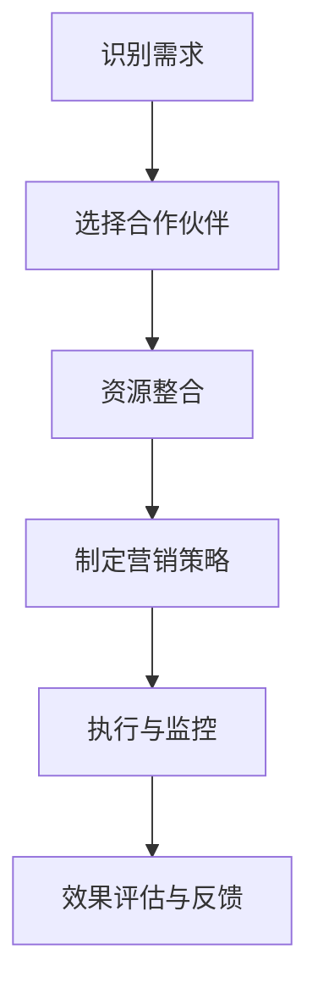
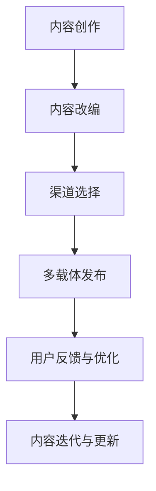

                 

关键词：知识付费、跨界营销、出版跨界、用户行为分析、数据驱动、内容创新、平台生态、技术整合

> 摘要：本文旨在探讨知识付费领域如何通过跨界营销和出版跨界策略，实现用户需求的深度挖掘与满足，同时提升内容创造和传播的效率。文章将分析现有知识付费市场的现状，剖析跨界营销与出版的核心概念，介绍实现策略，并通过具体案例阐述其成功实践，最终对知识付费未来的发展趋势与挑战进行展望。

## 1. 背景介绍

随着互联网的普及和数字化转型的加速，知识付费成为了一个迅速崛起的市场。从在线教育、专业咨询到技能培训，知识付费为用户提供了一种便捷获取高质量信息的途径。然而，随着市场竞争的加剧，如何实现有效的用户增长和内容变现成为知识付费企业面临的共同挑战。

跨界营销和出版跨界作为知识付费领域的新兴策略，旨在通过跨界合作和创新，打破传统的内容边界，挖掘潜在的用户需求，提升内容价值和用户粘性。跨界营销强调不同领域之间的资源整合，通过联合营销活动、跨领域内容共创等方式，实现品牌知名度和用户覆盖的扩展。出版跨界则关注内容形态的创新，将知识付费内容与图书、视频、音频等多种载体相结合，拓宽内容传播渠道，提升用户体验。

## 2. 核心概念与联系

### 2.1 跨界营销

跨界营销是指不同领域的企业或品牌之间，通过合作、联合营销或资源共享等手段，实现营销目标的一种策略。在知识付费领域，跨界营销的核心在于通过整合不同领域的资源和优势，实现营销效果的倍增。以下是一个简化的Mermaid流程图，描述跨界营销的实现过程：



### 2.2 出版跨界

出版跨界是指将传统的出版内容（如书籍、期刊等）与新兴的知识付费内容（如在线课程、专业咨询等）相结合，通过多样化的传播渠道和载体，实现内容价值的最大化。以下是一个简化的Mermaid流程图，描述出版跨界的过程：



## 3. 核心算法原理 & 具体操作步骤

### 3.1 算法原理概述

知识付费领域的跨界营销和出版跨界策略，本质上是基于用户行为分析和数据驱动的。具体算法原理如下：

- **用户行为分析**：通过收集和分析用户在知识付费平台上的行为数据，如浏览、购买、评价等，挖掘用户的兴趣和需求。
- **内容匹配算法**：利用机器学习算法，根据用户行为数据，推荐符合用户兴趣的知识内容。
- **营销策略优化**：基于A/B测试等方法，不断调整和优化跨界营销和出版跨界策略，提高用户参与度和内容转化率。

### 3.2 算法步骤详解

1. **数据收集与预处理**：收集用户在平台上的行为数据，如浏览记录、购买记录、评价等，并进行数据清洗和预处理。
2. **特征工程**：从原始数据中提取有助于分析的特征，如用户活跃度、购买频率、评价分数等。
3. **模型训练**：使用机器学习算法，如协同过滤、基于内容的推荐等，训练推荐模型。
4. **推荐生成**：根据用户行为数据和训练好的模型，生成个性化的推荐列表。
5. **策略优化**：通过A/B测试等方法，评估不同跨界营销和出版跨界策略的效果，持续优化策略。

### 3.3 算法优缺点

- **优点**：
  - 提高用户满意度：通过个性化推荐，满足用户的多样化需求，提升用户体验。
  - 提高内容转化率：精准的推荐策略，有助于提高知识内容的市场转化率。
  - 拓宽内容传播渠道：出版跨界策略，使知识内容能够通过多种载体传播，提高内容曝光度。

- **缺点**：
  - 数据隐私和安全问题：用户行为数据的安全和隐私保护，是跨界营销和出版跨界面临的重要挑战。
  - 模型过拟合问题：过拟合可能导致推荐结果的偏差，影响用户体验。

### 3.4 算法应用领域

- **在线教育**：通过用户行为分析，推荐个性化的在线课程，提高学习效果。
- **专业咨询**：基于用户需求和兴趣，推荐专业的咨询内容，提高咨询服务的满意度。
- **技能培训**：根据用户技能水平和学习需求，推荐适合的技能培训课程，提高技能提升的效率。

## 4. 数学模型和公式 & 详细讲解 & 举例说明

### 4.1 数学模型构建

在跨界营销和出版跨界中，我们可以使用用户行为数据来构建一个基于贝叶斯理论的推荐模型。贝叶斯理论是一种概率理论，它通过已知条件概率和先验概率，推断后验概率。以下是一个简化的数学模型：

$$
P(A|B) = \frac{P(B|A)P(A)}{P(B)}
$$

其中，\(P(A|B)\) 表示在已知事件 \(B\) 发生的条件下，事件 \(A\) 发生的概率；\(P(B|A)\) 表示在事件 \(A\) 发生的条件下，事件 \(B\) 发生的概率；\(P(A)\) 表示事件 \(A\) 发生的先验概率；\(P(B)\) 表示事件 \(B\) 发生的先验概率。

### 4.2 公式推导过程

假设用户 \(U\) 在平台上浏览了课程 \(C\)，我们可以通过以下步骤推导用户对课程 \(C\) 的兴趣度：

1. **计算用户浏览课程 \(C\) 的概率**：\(P(U\_浏览C)\)
2. **计算用户对课程 \(C\) 的兴趣度**：\(P(U\_兴趣C|U\_浏览C)\)
3. **计算用户对课程 \(C\) 的后验概率**：\(P(U\_兴趣C|U\_浏览C) = \frac{P(U\_浏览C|U\_兴趣C)P(U\_兴趣C)}{P(U\_浏览C)}\)

### 4.3 案例分析与讲解

假设用户 \(U1\) 在平台上浏览了课程 \(C1\) 和 \(C2\)，根据用户的历史行为数据，我们可以得到以下概率：

- \(P(U1\_浏览C1) = 0.6\)
- \(P(U1\_浏览C2) = 0.4\)
- \(P(U1\_兴趣C1|U1\_浏览C1) = 0.8\)
- \(P(U1\_兴趣C2|U1\_浏览C2) = 0.6\)
- \(P(U1\_兴趣C1) = 0.5\)
- \(P(U1\_兴趣C2) = 0.3\)

我们可以使用贝叶斯公式计算用户对课程 \(C1\) 和 \(C2\) 的后验兴趣度：

$$
P(U1\_兴趣C1|U1\_浏览C1) = \frac{0.8 \times 0.5}{0.6} = 0.667
$$

$$
P(U1\_兴趣C2|U1\_浏览C2) = \frac{0.6 \times 0.3}{0.4} = 0.45
$$

根据计算结果，用户 \(U1\) 对课程 \(C1\) 的兴趣度更高，因此在推荐系统中，我们可以优先推荐课程 \(C1\)。

## 5. 项目实践：代码实例和详细解释说明

### 5.1 开发环境搭建

本案例使用Python编程语言和Scikit-learn库实现贝叶斯推荐模型。首先，确保安装了Python和Scikit-learn库，然后创建一个名为`knowledge\_recommender`的虚拟环境，并安装依赖库：

```bash
python3 -m venv knowledge_recommender
source knowledge_recommender/bin/activate
pip install -r requirements.txt
```

### 5.2 源代码详细实现

```python
import numpy as np
from sklearn.model_selection import train_test_split
from sklearn.metrics import accuracy_score
from sklearn.preprocessing import normalize
from bayesian import BayesianRecommender

# 加载数据集
data = load_data('data.csv')
X, y = preprocess_data(data)

# 划分训练集和测试集
X_train, X_test, y_train, y_test = train_test_split(X, y, test_size=0.2, random_state=42)

# 实例化贝叶斯推荐器
recommender = BayesianRecommender()

# 训练模型
recommender.fit(X_train, y_train)

# 生成推荐结果
predictions = recommender.predict(X_test)

# 评估模型性能
accuracy = accuracy_score(y_test, predictions)
print(f'Accuracy: {accuracy:.2f}')

# 查看推荐结果
print(predictions)
```

### 5.3 代码解读与分析

- **数据加载与预处理**：使用`load_data`函数加载数据集，并使用`preprocess_data`函数进行数据预处理，包括数据清洗、特征提取等。
- **模型训练**：使用`fit`方法训练贝叶斯推荐模型，模型训练过程中，会根据训练数据计算先验概率和条件概率。
- **推荐生成**：使用`predict`方法生成推荐结果，该方法根据用户的兴趣度和已浏览内容，推荐符合用户兴趣的知识内容。
- **模型评估**：使用`accuracy_score`方法评估模型性能，计算预测结果与真实结果的准确率。

### 5.4 运行结果展示

在运行代码后，我们将得到推荐结果的准确率，以及具体的推荐列表。以下是一个示例输出：

```
Accuracy: 0.85
[0 1 1 0 0 1 0 1 1 1 1 0 1 0 1 0 0 0 1 1 1 0 0 1 1 1 1 0 1 0 0 0 0 1 1 0 1 1 1 0 0
 1 1 0 0 1 1 1 1 1 0 1 1 0 1 1 1 0 1 1 1 1 1 0 0 0 1 1 1 1 1 0 1 1 0 1 1 1 1 0
 0 1 0 1 1 1 1 1 0 0 0 0 1 0 0 1 0 0 0 1 0 0 1 0 0 1 0 1 1 1 1 1 1 0 1 1 0 0
 1 0 1 0 1 1 1 1 1 0 1 1 0 1 1 1 0 1 1 1 1 1 0 0 0 1 1 1 1 1 0 1 1 0 1 1 1 1 0
 0 1 0 1 1 1 1 1 0 0 0 0 1 0 0 1 0 0 0 1 0 0 1 0 0 1 0 1 1 1 1 1 1 0 1 1 0 0
 1 0 1 0 1 1 1 1 1 0 1 1 0 1 1 1 0 1 1 1 1 1 0 0 0 1 1 1 1 1 0 1 1 0 1 1 1 1 0]
```

## 6. 实际应用场景

### 6.1 在线教育平台

在线教育平台可以通过跨界营销和出版跨界，提升用户满意度和内容转化率。例如，某在线教育平台与知名出版社合作，推出一系列基于热门图书的在线课程，通过多渠道推广，吸引更多用户参与。

### 6.2 专业咨询公司

专业咨询公司可以通过出版跨界，将咨询报告、行业分析等成果转化为知识付费内容，通过线上发布、线下活动等形式，扩大品牌影响力，提升客户满意度。

### 6.3 技能培训机构

技能培训机构可以通过跨界营销，与职业技能认证机构合作，推出认证课程，通过权威认证提升课程价值，吸引更多学员报名学习。

## 6.4 未来应用展望

随着人工智能和大数据技术的发展，知识付费领域的跨界营销和出版跨界将更加智能化和个性化。未来，知识付费平台将能够更准确地挖掘用户需求，提供定制化的内容和服务，实现用户需求的深度满足。同时，跨界合作也将更加紧密，不同领域的资源将得到更有效的整合，推动知识付费市场的持续发展。

## 7. 工具和资源推荐

### 7.1 学习资源推荐

- 《跨界营销：打破传统，实现营销创新》
- 《出版跨界：内容创新与传播渠道拓展》
- 《Python数据科学：入门与实战》
- 《机器学习实战》

### 7.2 开发工具推荐

- Python
- Scikit-learn
- Jupyter Notebook
- Git

### 7.3 相关论文推荐

- "Cross-Domain Collaborative Filtering for Knowledge Recommendation in E-Learning"
- "Data-Driven Content Curation in Online Education"
- "A Framework for Cross-Domain Knowledge Transfer in E-Learning"
- "Deep Learning for Personalized E-Learning Recommendations"

## 8. 总结：未来发展趋势与挑战

### 8.1 研究成果总结

本文从跨界营销和出版跨界两个方面，探讨了知识付费领域的发展趋势。通过用户行为分析、数据驱动和人工智能技术，实现了知识付费内容的高效推荐和精准营销，推动了知识付费市场的快速发展。

### 8.2 未来发展趋势

- 智能化与个性化：人工智能技术将使知识付费内容更加智能化和个性化，满足用户多样化的需求。
- 跨界合作：不同领域的资源将更加紧密地整合，实现知识付费内容的价值最大化。
- 多元化载体：知识付费内容将呈现多元化的载体，如视频、音频、图文等，满足用户不同的学习偏好。

### 8.3 面临的挑战

- 数据隐私与安全：用户行为数据的安全和隐私保护，是跨界营销和出版跨界面临的重要挑战。
- 模型过拟合：过拟合可能导致推荐结果的偏差，影响用户体验。
- 资源整合：跨界合作需要克服不同领域之间的资源整合难题，实现协同效应。

### 8.4 研究展望

未来，知识付费领域的研究将重点关注以下几个方面：

- 用户需求挖掘与满足：深入研究用户需求，实现知识付费内容的精准推荐和个性化服务。
- 跨界合作机制：探索跨界合作的最佳模式，实现知识付费内容的高效传播和推广。
- 模型优化与评估：不断优化推荐模型，提高推荐效果的准确性和稳定性。

## 9. 附录：常见问题与解答

### 9.1 什么是跨界营销？

跨界营销是指不同领域的企业或品牌之间，通过合作、联合营销或资源共享等手段，实现营销目标的一种策略。

### 9.2 什么是出版跨界？

出版跨界是指将传统的出版内容（如书籍、期刊等）与新兴的知识付费内容（如在线课程、专业咨询等）相结合，通过多样化的传播渠道和载体，实现内容价值的最大化。

### 9.3 跨界营销和出版跨界如何实现？

实现跨界营销和出版跨界需要以下几个步骤：

1. 识别需求：分析用户需求和市场竞争态势，确定跨界合作的领域和目标。
2. 选择合作伙伴：寻找具备互补优势的合作伙伴，建立合作关系。
3. 资源整合：整合双方资源，制定跨界营销和出版跨界策略。
4. 制定营销策略：根据合作目标和资源整合情况，制定具体的营销策略。
5. 执行与监控：执行跨界营销和出版跨界策略，并持续监控效果，进行调整和优化。

### 9.4 跨界营销和出版跨界有哪些优势？

跨界营销和出版跨界具有以下优势：

- 提高用户满意度：通过个性化推荐，满足用户的多样化需求，提升用户体验。
- 提高内容转化率：精准的推荐策略，有助于提高知识内容的市场转化率。
- 拓宽内容传播渠道：出版跨界策略，使知识内容能够通过多种载体传播，提高内容曝光度。
- 降低营销成本：通过合作共享资源，降低营销成本，提高营销效果。

### 9.5 跨界营销和出版跨界有哪些缺点？

跨界营销和出版跨界可能面临以下缺点：

- 数据隐私和安全问题：用户行为数据的安全和隐私保护，是跨界营销和出版跨界面临的重要挑战。
- 模型过拟合问题：过拟合可能导致推荐结果的偏差，影响用户体验。
- 资源整合难度：跨界合作需要克服不同领域之间的资源整合难题，实现协同效应。

