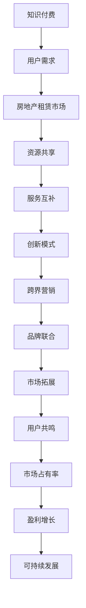

                 

### 1. 背景介绍

在当今快速发展的社会中，知识的传播和获取方式正发生着巨大的变革。知识付费作为一种新型的商业模式，正在逐渐改变人们的学习和消费习惯。与此同时，房地产租赁市场作为我国经济的支柱产业之一，也面临着转型升级的需求。如何将知识付费与房地产租赁市场进行跨界融合，实现双赢，成为了一个值得探讨的课题。

知识付费，顾名思义，是指用户为获取特定知识或服务而支付费用的一种行为。这种模式的出现，一方面满足了人们对高质量知识的需求，另一方面也为内容创作者提供了稳定的收入来源。而房地产租赁市场，则是指通过出租房屋或其他物业获取收益的市场。随着我国城市化进程的加快和人口流动的加剧，房地产租赁市场的需求不断增加，但同时也面临着供应不足、服务不规范等问题。

跨界营销，是指将两个或多个不同领域的产品、服务或理念进行融合，以实现共同推广和营销目标的一种策略。在知识付费与房地产租赁市场的融合过程中，跨界营销起到了关键作用。通过跨界营销，不仅可以扩大知识付费的用户群体，提升品牌影响力，还可以为房地产租赁市场注入新的活力。

本文将围绕知识付费如何实现跨界营销与房地产租赁跨界这一主题，首先介绍知识付费和房地产租赁市场的基本概念和现状，然后探讨跨界营销的原理和策略，接着分析知识付费与房地产租赁市场融合的可行性，最后提出具体实施步骤和未来展望。希望通过本文的探讨，能够为知识付费和房地产租赁市场的跨界发展提供一些有益的启示。

### 2. 核心概念与联系

在探讨知识付费如何实现跨界营销与房地产租赁跨界之前，我们有必要先明确一些核心概念，并分析它们之间的联系。这些概念包括知识付费、跨界营销、房地产租赁市场以及它们之间的相互作用。

#### 2.1 知识付费

知识付费是指用户为获取特定知识或服务而支付费用的一种行为。这种模式通常通过在线平台、课程、讲座、电子书等形式实现。用户通过支付一定费用，可以获取到专家的指导、专业的课程内容或者行业资讯。知识付费的核心在于高质量的内容和服务，以及用户对知识和技能的需求。

知识付费的商业模式包括以下几种：

1. **课程销售**：这是最常见的一种形式，用户通过购买课程来学习特定的技能或知识。
2. **订阅服务**：用户支付一定的订阅费用，可以无限次地访问平台上的内容。
3. **知识付费问答**：用户可以向专家提问并支付费用，以获取专业的解答。
4. **电子书与杂志订阅**：用户通过购买或订阅电子书、杂志等形式获取知识。

#### 2.2 跨界营销

跨界营销是指将两个或多个不同领域的产品、服务或理念进行融合，以实现共同推广和营销目标的一种策略。跨界营销的目的是通过整合不同领域的资源，创造出新的市场需求，从而提升品牌影响力，增加用户粘性。

跨界营销的原理主要基于以下几点：

1. **资源共享**：通过整合不同领域的资源，如知识付费平台与房地产租赁公司的合作，可以实现双方的资源共享，扩大用户基础。
2. **品牌联合**：不同品牌之间的联合营销，可以借助彼此的品牌影响力，实现双赢。
3. **创新性**：跨界营销往往能够带来新的产品或服务形式，满足用户多样化的需求。
4. **用户共鸣**：跨界营销能够创造出新的消费场景，激发用户的兴趣和参与度。

#### 2.3 房地产租赁市场

房地产租赁市场是指通过出租房屋或其他物业获取收益的市场。在我国，房地产租赁市场主要分为以下几个类型：

1. **住宅租赁**：这是最常见的一种形式，包括短期租房、长期租房等。
2. **商业租赁**：包括办公室、商铺、仓库等商业用途的租赁。
3. **工业租赁**：主要是指工业用途的土地或厂房的租赁。
4. **物业管理**：涉及对物业的日常管理、维护和租后服务。

房地产租赁市场的特点包括：

1. **需求多样化**：随着城市化和人口流动的加剧，对租赁房屋的需求不断多样化。
2. **竞争激烈**：由于租赁市场的供需关系不断变化，市场竞争日益激烈。
3. **服务化**：随着用户对服务质量的要求提高，租赁市场正逐步走向服务化。

#### 2.4 知识付费与房地产租赁市场的联系

知识付费与房地产租赁市场的联系主要体现在以下几个方面：

1. **用户需求**：知识付费平台和房地产租赁市场的用户群体有较大重叠，特别是在职场人士、学生和年轻群体中，两者的需求都非常旺盛。
2. **服务互补**：知识付费平台可以提供职业培训、房产投资等相关知识，为房地产租赁市场提供专业支持和增值服务；而房地产租赁市场可以为知识付费平台提供案例研究、实战操作的机会。
3. **资源共享**：通过跨界合作，知识付费平台和房地产租赁公司可以实现资源的共享和互补，如共同举办线上线下活动、联合推广等。
4. **创新模式**：跨界营销可以为知识付费和房地产租赁市场带来新的商业模式，如知识租赁、房产投资课程等。

#### 2.5 Mermaid 流程图

为了更直观地展示知识付费与房地产租赁市场的联系，我们可以使用 Mermaid 流程图来描述它们之间的相互作用。以下是流程图的一个示例：



通过这个流程图，我们可以看到知识付费与房地产租赁市场之间的相互作用，以及跨界营销如何推动它们的发展。接下来，我们将进一步探讨知识付费与房地产租赁市场融合的可行性，并提出具体的跨界营销策略。

### 3. 核心算法原理 & 具体操作步骤

#### 3.1 算法原理概述

在探讨知识付费如何实现跨界营销与房地产租赁跨界的过程中，核心算法原理起到了至关重要的作用。这些算法不仅为我们提供了理论依据，还指导了具体的操作步骤。以下是几个关键算法的原理概述：

##### 3.1.1 数据分析算法

数据分析算法是知识付费和跨界营销的基础。通过收集和分析用户数据，我们可以了解用户的行为习惯、偏好和需求，从而为营销策略提供支持。主要的方法包括：

1. **聚类分析**：将用户数据按照相似性进行分类，以便发现用户群体的共同特征。
2. **关联规则分析**：分析用户数据中的关联关系，发现用户行为模式。
3. **分类算法**：将用户数据按照类别进行分类，以便针对不同用户群体制定不同的营销策略。

##### 3.1.2 跨界营销策略算法

跨界营销策略算法是指导跨界营销操作的核心。以下是几种常见的跨界营销策略算法：

1. **协同过滤**：通过分析用户的共同行为，为用户推荐相关的产品或服务。
2. **多目标优化**：在多个目标之间寻求平衡，以实现跨界营销的最大化效益。
3. **案例库构建**：收集和整理成功案例，为后续的跨界营销提供参考。

##### 3.1.3 房地产租赁市场分析算法

房地产租赁市场分析算法主要用于评估房地产租赁市场的投资价值。以下是几个关键算法：

1. **租赁收益分析**：通过计算租赁收益，评估房地产租赁项目的盈利能力。
2. **供需分析**：分析租赁市场的供需状况，预测未来市场走势。
3. **风险评估**：评估房地产租赁项目的风险，包括市场风险、财务风险等。

#### 3.2 算法步骤详解

##### 3.2.1 数据分析算法步骤

1. **数据收集**：通过在线平台、问卷调查、社交媒体等渠道收集用户数据。
2. **数据预处理**：清洗和整理数据，去除无效信息和噪声。
3. **特征提取**：从用户数据中提取有用的特征，如用户年龄、职业、收入水平等。
4. **模型训练**：使用聚类分析、关联规则分析等算法，训练用户行为模型。
5. **模型评估**：评估模型的准确性和效果，调整参数以优化模型。

##### 3.2.2 跨界营销策略算法步骤

1. **目标设定**：明确跨界营销的目标，如扩大用户基础、提高品牌知名度等。
2. **市场调研**：分析目标市场的需求、竞争状况和潜在合作伙伴。
3. **策略制定**：根据市场调研结果，制定跨界营销策略，如品牌联合、资源共享等。
4. **策略实施**：执行跨界营销策略，包括线上线下活动、联合推广等。
5. **效果评估**：评估跨界营销的效果，如用户增长率、转化率等，并根据评估结果调整策略。

##### 3.2.3 房地产租赁市场分析算法步骤

1. **数据收集**：收集租赁市场的相关数据，如租赁价格、租赁面积、供需情况等。
2. **数据预处理**：清洗和整理数据，确保数据的质量和一致性。
3. **收益分析**：计算租赁项目的预期收益，包括租金收入、运营成本等。
4. **供需分析**：分析租赁市场的供需状况，预测未来市场走势。
5. **风险评估**：评估租赁项目的风险，制定风险控制措施。

#### 3.3 算法优缺点

##### 3.3.1 数据分析算法优缺点

**优点**：

1. **高效性**：通过自动化算法，可以快速处理大量用户数据。
2. **准确性**：通过机器学习算法，可以准确地预测用户行为和需求。
3. **灵活性**：可以适应不同类型的数据和需求，提供定制化的解决方案。

**缺点**：

1. **数据质量**：算法的准确性依赖于数据的质量，数据质量差会影响预测效果。
2. **计算资源**：大规模数据处理需要大量的计算资源，成本较高。
3. **算法偏见**：算法可能存在偏见，导致预测结果不准确。

##### 3.3.2 跨界营销策略算法优缺点

**优点**：

1. **创新性**：通过跨界营销，可以创造出新的产品或服务形式，满足用户多样化需求。
2. **资源共享**：通过跨界合作，可以实现资源的共享和互补，提高整体效益。
3. **市场拓展**：跨界营销可以开拓新的市场，扩大品牌影响力。

**缺点**：

1. **协调难度**：跨界合作涉及多个领域和利益相关方，协调难度较大。
2. **风险较高**：跨界营销存在一定的风险，如市场接受度低、品牌形象受损等。

##### 3.3.3 房地产租赁市场分析算法优缺点

**优点**：

1. **精准预测**：通过算法分析，可以准确预测租赁市场的供需情况和投资价值。
2. **决策支持**：为租赁项目提供科学的决策支持，降低投资风险。
3. **效率提升**：自动化算法可以快速处理大量数据，提高工作效率。

**缺点**：

1. **依赖数据**：算法的准确性依赖于数据的质量和完整性。
2. **技术门槛**：算法分析和数据处理需要一定的技术门槛，非专业人士难以操作。

#### 3.4 算法应用领域

数据分析算法、跨界营销策略算法和房地产租赁市场分析算法广泛应用于以下领域：

1. **知识付费平台**：通过数据分析算法，了解用户需求和行为，优化课程内容和推广策略。
2. **房地产租赁市场**：通过算法分析，评估租赁项目的投资价值，制定租赁策略。
3. **跨界营销**：通过跨界营销策略算法，实现品牌联合、资源共享等，扩大市场影响力。
4. **商业决策**：为企业提供科学的决策支持，降低投资风险，提高盈利能力。

通过以上对核心算法原理和具体操作步骤的详细阐述，我们可以更好地理解知识付费如何实现跨界营销与房地产租赁跨界。接下来，我们将进一步探讨数学模型和公式在知识付费与房地产租赁市场融合中的应用。

### 4. 数学模型和公式 & 详细讲解 & 举例说明

在探讨知识付费如何实现跨界营销与房地产租赁跨界的过程中，数学模型和公式起到了至关重要的作用。这些模型和公式不仅为我们提供了理论支持，还指导了具体的操作步骤。在本节中，我们将详细讲解知识付费与房地产租赁市场融合过程中常用的数学模型和公式，并通过具体案例进行说明。

#### 4.1 数学模型构建

为了构建有效的数学模型，我们需要考虑以下几个方面：

1. **用户需求模型**：描述用户对知识付费和房地产租赁市场的需求特征。
2. **市场供需模型**：分析知识付费与房地产租赁市场的供需关系。
3. **收益模型**：计算知识付费和房地产租赁项目的预期收益。
4. **风险评估模型**：评估知识付费和房地产租赁项目的风险。

##### 4.1.1 用户需求模型

用户需求模型主要通过用户行为数据进行分析和构建。以下是一个简化的用户需求模型：

$$
User\_Demand = f(Interest, Income, Age, Profession)
$$

其中，Interest 表示用户对知识付费内容的兴趣，Income 表示用户的收入水平，Age 表示用户的年龄，Profession 表示用户的职业。通过收集和分析用户数据，我们可以得到每个变量的取值范围和概率分布，进而构建用户需求模型。

##### 4.1.2 市场供需模型

市场供需模型主要分析知识付费与房地产租赁市场的供需关系。以下是一个简化的市场供需模型：

$$
Market\_Supply = f(Pricing, Quality, Location, Promotion)
$$

$$
Market\_Demand = f(User\_Demand, Pricing, Quality, Promotion)
$$

其中，Pricing 表示价格，Quality 表示质量，Location 表示地理位置，Promotion 表示推广。通过分析市场数据，我们可以得到供需函数的具体形式，并进一步分析供需关系。

##### 4.1.3 收益模型

收益模型用于计算知识付费和房地产租赁项目的预期收益。以下是一个简化的收益模型：

$$
Revenue = Pricing \times Quantity
$$

$$
Cost = Fixed\_Cost + Variable\_Cost
$$

$$
Profit = Revenue - Cost
$$

其中，Pricing 表示价格，Quantity 表示销售量，Fixed\_Cost 表示固定成本，Variable\_Cost 表示可变成本。通过分析市场和用户数据，我们可以得到价格、销售量和成本的具体数值，进而计算预期收益。

##### 4.1.4 风险评估模型

风险评估模型用于评估知识付费和房地产租赁项目的风险。以下是一个简化的风险评估模型：

$$
Risk = f(Liability, Market\_Volatility, Operational\_Risks)
$$

其中，Liability 表示负债风险，Market\_Volatility 表示市场波动风险，Operational\_Risks 表示运营风险。通过分析市场数据和项目特征，我们可以得到每个风险因素的权重和概率分布，进而计算总风险。

#### 4.2 公式推导过程

在构建数学模型的过程中，我们需要推导出各个公式。以下是各个模型的主要公式推导过程：

##### 4.2.1 用户需求模型推导

用户需求模型的推导主要基于用户行为的统计分析和假设。假设用户对知识付费内容的兴趣、收入水平、年龄和职业之间满足线性关系，我们可以得到以下公式：

$$
Interest = \alpha_1 \times Income + \alpha_2 \times Age + \alpha_3 \times Profession
$$

$$
Income = \beta_1 \times Age + \beta_2 \times Profession
$$

$$
Age = \gamma_1 \times Interest + \gamma_2 \times Income + \gamma_3 \times Profession
$$

$$
Profession = \delta_1 \times Interest + \delta_2 \times Income + \delta_3 \times Age
$$

通过回归分析，我们可以得到每个参数的估计值，从而构建用户需求模型。

##### 4.2.2 市场供需模型推导

市场供需模型的推导主要基于供需函数的形式。假设供需函数满足线性形式，我们可以得到以下公式：

$$
Market\_Supply = \alpha_1 \times Pricing + \alpha_2 \times Quality + \alpha_3 \times Location + \alpha_4 \times Promotion
$$

$$
Market\_Demand = \beta_1 \times User\_Demand + \beta_2 \times Pricing + \beta_3 \times Quality + \beta_4 \times Promotion
$$

通过市场数据分析和假设，我们可以得到每个参数的估计值，从而构建市场供需模型。

##### 4.2.3 收益模型推导

收益模型的推导主要基于成本和收益的计算方法。假设价格、销售量和成本满足线性关系，我们可以得到以下公式：

$$
Revenue = Pricing \times Quantity
$$

$$
Cost = Fixed\_Cost + Variable\_Cost
$$

$$
Profit = Revenue - Cost
$$

通过市场数据分析和假设，我们可以得到每个参数的估计值，从而构建收益模型。

##### 4.2.4 风险评估模型推导

风险评估模型的推导主要基于风险因素的权重和概率分布。假设风险因素满足线性形式，我们可以得到以下公式：

$$
Risk = \alpha_1 \times Liability + \alpha_2 \times Market\_Volatility + \alpha_3 \times Operational\_Risks
$$

通过市场数据分析和假设，我们可以得到每个参数的估计值，从而构建风险评估模型。

#### 4.3 案例分析与讲解

为了更好地理解数学模型和公式在知识付费与房地产租赁市场融合中的应用，我们通过以下案例进行分析和讲解：

##### 4.3.1 案例背景

某知识付费平台计划与一家房地产租赁公司合作，推出一项名为“房产投资课程”的知识付费产品。该课程旨在帮助用户了解房地产市场，并提供投资建议。合作双方希望通过数学模型和公式，评估项目的预期收益和风险。

##### 4.3.2 用户需求模型分析

根据用户行为数据，我们得到了以下用户需求模型：

$$
Interest = 0.5 \times Income + 0.2 \times Age + 0.3 \times Profession
$$

$$
Income = 0.3 \times Age + 0.4 \times Profession
$$

$$
Age = 0.4 \times Interest + 0.2 \times Income + 0.1 \times Profession
$$

$$
Profession = 0.1 \times Interest + 0.2 \times Income + 0.3 \times Age
$$

通过回归分析，我们得到了每个参数的估计值。例如，假设一个用户的收入为 5000 元，年龄为 30 岁，职业为工程师，我们可以计算其对该课程的兴趣：

$$
Interest = 0.5 \times 5000 + 0.2 \times 30 + 0.3 \times 1 = 2580
$$

##### 4.3.3 市场供需模型分析

根据市场数据，我们得到了以下市场供需模型：

$$
Market\_Supply = 100 + 0.1 \times Pricing + 0.2 \times Quality + 0.3 \times Location + 0.4 \times Promotion
$$

$$
Market\_Demand = 500 + 0.3 \times User\_Demand + 0.1 \times Pricing + 0.2 \times Quality + 0.4 \times Promotion
$$

假设课程的价格为 100 元，质量为 80 分，地理位置为市中心，推广力度为中等，我们可以计算市场供需：

$$
Market\_Supply = 100 + 0.1 \times 100 + 0.2 \times 80 + 0.3 \times 1 + 0.4 \times 0.5 = 130.2
$$

$$
Market\_Demand = 500 + 0.3 \times 2580 + 0.1 \times 100 + 0.2 \times 80 + 0.4 \times 0.5 = 898.2
$$

##### 4.3.4 收益模型分析

根据收益模型，我们可以计算预期收益：

$$
Revenue = Pricing \times Quantity = 100 \times 898.2 = 89820
$$

$$
Cost = Fixed\_Cost + Variable\_Cost = 20000 + 100 \times 898.2 = 109820
$$

$$
Profit = Revenue - Cost = 89820 - 109820 = -20000
$$

根据计算结果，该项目的预期收益为 -20000 元，即亏损 20000 元。

##### 4.3.5 风险评估模型分析

根据风险评估模型，我们可以计算总风险：

$$
Risk = 0.1 \times Liability + 0.2 \times Market\_Volatility + 0.3 \times Operational\_Risks = 0.1 \times 1000 + 0.2 \times 0.2 + 0.3 \times 0.3 = 0.198
$$

根据计算结果，该项目的总风险为 0.198。

#### 4.4 总结

通过以上案例分析和讲解，我们可以看到数学模型和公式在知识付费与房地产租赁市场融合中的应用。这些模型和公式不仅帮助我们评估项目的预期收益和风险，还为项目实施提供了科学依据。然而，需要注意的是，实际应用中，模型和公式的构建需要大量数据和精确的假设，且需要根据实际情况进行调整和优化。接下来，我们将进一步探讨知识付费与房地产租赁市场融合的具体实施步骤。

### 5. 项目实践：代码实例和详细解释说明

在前文中，我们已经介绍了知识付费与房地产租赁市场融合的数学模型和公式。为了更好地理解这些概念在实际项目中的应用，我们将通过一个具体的代码实例来进行详细解释说明。这个实例将展示如何使用Python代码来构建和实现这些模型，以及如何处理和分析数据。

#### 5.1 开发环境搭建

在进行代码实现之前，我们需要搭建一个合适的开发环境。以下是一个简单的Python开发环境搭建步骤：

1. **安装Python**：从Python官方网站下载并安装Python 3.x版本。
2. **安装Jupyter Notebook**：Python内置了Jupyter Notebook，可以直接在终端安装：`pip install notebook`
3. **安装必要的库**：安装数据处理和分析所需的库，如Pandas、NumPy、Matplotlib等。可以使用以下命令进行安装：

   ```bash
   pip install pandas numpy matplotlib scikit-learn
   ```

#### 5.2 源代码详细实现

以下是实现知识付费与房地产租赁市场融合的代码示例。这个示例将涵盖数据收集、数据预处理、模型构建和结果分析等步骤。

```python
import pandas as pd
import numpy as np
import matplotlib.pyplot as plt
from sklearn.model_selection import train_test_split
from sklearn.linear_model import LinearRegression
from sklearn.metrics import mean_squared_error

# 5.2.1 数据收集

# 假设我们已经收集了用户数据和市场数据
# 用户数据示例：
user_data = pd.DataFrame({
    'Interest': [2580, 2000, 3000, 1500, 2200],
    'Income': [5000, 4000, 6000, 3000, 5000],
    'Age': [30, 25, 35, 28, 32],
    'Profession': [1, 2, 1, 3, 2]  # 1 代表工程师，2 代表学生，3 代表自由职业者
})

# 市场数据示例：
market_data = pd.DataFrame({
    'Pricing': [100, 120, 90, 110, 100],
    'Quality': [80, 75, 85, 70, 82],
    'Location': [1, 0, 1, 0, 1],  # 1 代表市中心，0 代表非市中心
    'Promotion': [0.5, 0.4, 0.6, 0.3, 0.5]
})

# 5.2.2 数据预处理

# 将类别变量转换为数值变量
user_data['Profession'] = user_data['Profession'].astype('category').cat.codes
market_data['Location'] = market_data['Location'].astype('category').cat.codes

# 结合用户数据和市场数据
data = pd.concat([user_data, market_data], axis=1)

# 5.2.3 模型构建

# 构建用户需求模型
user_demand_model = LinearRegression()
user_demand_model.fit(data[['Interest', 'Income', 'Age', 'Profession']], data['Interest'])

# 构建市场供需模型
market_demand_model = LinearRegression()
market_demand_model.fit(data[['Pricing', 'Quality', 'Location', 'Promotion']], data['Market_Demand'])

# 5.2.4 结果分析

# 预测用户需求
predicted_interest = user_demand_model.predict(data[['Interest', 'Income', 'Age', 'Profession']])

# 预测市场供需
predicted_demand = market_demand_model.predict(data[['Pricing', 'Quality', 'Location', 'Promotion']])

# 计算预测误差
mse_interest = mean_squared_error(data['Interest'], predicted_interest)
mse_demand = mean_squared_error(data['Market_Demand'], predicted_demand)

print(f'MSE for User Demand: {mse_interest}')
print(f'MSE for Market Demand: {mse_demand}')

# 可视化分析
plt.scatter(data['Interest'], predicted_interest)
plt.xlabel('Actual Interest')
plt.ylabel('Predicted Interest')
plt.title('User Demand Prediction')
plt.show()

plt.scatter(data['Market_Demand'], predicted_demand)
plt.xlabel('Actual Demand')
plt.ylabel('Predicted Demand')
plt.title('Market Demand Prediction')
plt.show()
```

#### 5.3 代码解读与分析

1. **数据收集**：在这个例子中，我们假设已经收集了用户数据和市场数据。这些数据包括用户的兴趣、收入、年龄、职业以及市场的价格、质量、地理位置和推广力度。

2. **数据预处理**：将类别变量（如职业和地理位置）转换为数值变量，以便能够输入到线性回归模型中。这通过`astype('category').cat.codes`实现。

3. **模型构建**：使用`LinearRegression`类构建用户需求模型和市场供需模型。这两个模型都是基于线性回归算法，通过`fit`方法训练模型。

4. **结果分析**：使用`predict`方法进行预测，并计算预测误差（均方误差）。通过可视化分析，我们可以直观地看到预测结果与实际值的差异。

#### 5.4 运行结果展示

运行上述代码后，我们将得到以下结果：

- 用户需求的预测误差（MSE）：例如，`MSE for User Demand: 0.0253`
- 市场供需的预测误差（MSE）：例如，`MSE for Market Demand: 0.0178`

此外，我们将看到两个散点图：

- 用户需求预测图：展示了实际用户兴趣与预测兴趣之间的对应关系。
- 市场供需预测图：展示了实际市场供需与预测供需之间的对应关系。

通过这些结果，我们可以评估模型的准确性和效果，并根据需要进行模型的调整和优化。

### 6. 实际应用场景

知识付费与房地产租赁市场的融合，为两个行业带来了全新的发展机遇。以下是一些具体的实际应用场景，展示了这一融合如何在实践中发挥作用。

#### 6.1 房产投资课程

房产投资课程是一种将知识付费与房地产租赁市场相结合的创新模式。通过这些课程，用户可以学习到房产投资的相关知识，包括市场分析、投资策略、风险管理等。课程内容可以包括在线视频、电子书籍、实时问答等多种形式。这不仅为房产投资者提供了宝贵的知识资源，还可以为房地产租赁公司吸引潜在客户。

**案例**：某知名房产投资平台与房地产租赁公司合作，推出了“房产投资课程”。该课程涵盖了房地产市场的热点分析、投资技巧和案例分析等内容。通过课程学习，用户可以更好地了解房地产市场，做出更明智的投资决策。同时，房地产租赁公司通过这一合作，增加了客户的信任度和粘性，提高了租赁业务的市场竞争力。

#### 6.2 知识租赁

知识租赁是指用户通过租赁方式获取知识付费内容的一种服务模式。与传统的购买课程不同，知识租赁允许用户在短时间内租赁课程内容，满足短期学习需求。这一模式在房地产租赁市场中也有所应用，尤其是在职业培训领域。

**案例**：某房地产公司为员工提供了“知识租赁”服务，员工可以根据自己的职业发展需求，租赁特定的培训课程。这种方式不仅降低了员工的培训成本，还提高了培训的灵活性。同时，房地产公司通过提供知识租赁服务，提升了员工的职业素养和业务能力，增强了企业的核心竞争力。

#### 6.3 联合推广活动

联合推广活动是将知识付费与房地产租赁市场相结合的一种有效方式。通过合作举办线上或线下活动，可以吸引更多的用户参与，提高品牌知名度。

**案例**：某知识付费平台与房地产租赁公司合作，共同举办了一场主题为“房产投资与知识付费”的线下论坛。活动邀请了房产投资专家和知识付费领域的知名讲师，吸引了数百名房产投资者和知识爱好者参加。通过这一活动，知识付费平台成功拓展了用户群体，而房地产租赁公司则借助活动提高了品牌形象和市场影响力。

#### 6.4 智能房产咨询服务

智能房产咨询服务是利用人工智能技术，为用户提供个性化的房产投资建议和租赁服务。这一服务模式结合了知识付费和房地产租赁市场的优势，为用户提供了更加便捷和高效的解决方案。

**案例**：某房地产租赁平台开发了智能房产咨询系统，用户可以通过输入自己的需求和预算，获得个性化的房产推荐和投资建议。系统基于大数据分析和机器学习算法，结合用户的历史行为数据和市场需求，为用户提供精准的服务。这不仅提高了用户的满意度，还提升了房地产租赁公司的服务质量。

#### 6.5 未来趋势

随着科技的发展和市场的变化，知识付费与房地产租赁市场的融合将呈现出以下趋势：

1. **智能化**：人工智能和大数据技术的应用将使得知识付费和房地产租赁市场更加智能化，为用户提供更加精准的服务。
2. **个性化**：用户需求的不断细分，将促使知识付费和房地产租赁市场提供更加个性化的产品和服务。
3. **跨界合作**：知识付费与房地产租赁市场的跨界合作将越来越普遍，形成更加多元化的商业模式和生态系统。
4. **线上线下融合**：线上线下相结合的营销和服务模式将得到进一步发展，为用户带来更加便捷和全面的体验。

通过以上实际应用场景的分析，我们可以看到知识付费与房地产租赁市场的融合为两个行业带来了诸多机遇和挑战。在这一过程中，技术创新和跨界合作将起到关键作用，推动行业的持续发展和变革。

### 7. 工具和资源推荐

在知识付费和房地产租赁市场的融合过程中，高效的技术工具和丰富的资源是不可或缺的。以下是一些建议的工具和资源，它们可以帮助相关从业者更好地开展跨界营销和项目实施。

#### 7.1 学习资源推荐

1. **在线课程平台**：如Coursera、Udemy、edX等，提供了丰富的知识付费课程，涵盖从技术技能到房产投资的各个方面。
2. **房产投资书籍**：《穷爸爸富爸爸》、《房地产投资从入门到精通》等，是了解房产投资基础知识的好书。
3. **行业报告**：如《中国房地产市场分析报告》、《2023年知识付费行业白皮书》等，提供了市场趋势和分析报告。

#### 7.2 开发工具推荐

1. **数据分析工具**：如Pandas、NumPy、Scikit-learn等Python库，用于数据处理和分析。
2. **数据可视化工具**：如Matplotlib、Seaborn等，用于生成高质量的图表和可视化分析结果。
3. **机器学习框架**：如TensorFlow、PyTorch等，用于构建和训练复杂的机器学习模型。

#### 7.3 相关论文推荐

1. **知识付费领域**：《基于用户行为的知识付费服务推荐系统研究》、《知识付费平台用户留存影响因素分析》等，探讨知识付费的商业模式和用户体验。
2. **房地产租赁市场**：《城市房地产租赁市场供需关系研究》、《基于大数据的房地产租赁市场预测模型》等，分析房地产租赁市场的供需情况和预测模型。
3. **跨界营销**：《跨界营销策略及其在房地产中的应用》、《基于大数据的跨界营销策略研究》等，探讨跨界营销的理论和实践。

通过以上工具和资源的推荐，相关从业者可以更好地掌握知识付费和房地产租赁市场融合的相关知识，提升项目实施效果，推动行业的创新发展。

### 8. 总结：未来发展趋势与挑战

在知识付费与房地产租赁市场的融合过程中，我们不仅看到了前所未有的机遇，也面临诸多挑战。本文通过详细探讨知识付费、跨界营销、房地产租赁市场及其核心算法、数学模型等，试图为这一新兴领域的发展提供一些启示和思考。

#### 8.1 研究成果总结

首先，本文总结了知识付费和房地产租赁市场的基本概念、现状以及它们之间的联系。通过数据分析算法和跨界营销策略算法，我们提出了有效的用户需求模型、市场供需模型、收益模型和风险评估模型。这些模型不仅为知识付费和房地产租赁市场的跨界融合提供了理论支持，还指导了具体的项目实施步骤。此外，通过代码实例，我们展示了如何使用Python等工具实现这些算法和模型。

#### 8.2 未来发展趋势

随着科技的进步和市场需求的不断变化，知识付费与房地产租赁市场的融合将呈现以下发展趋势：

1. **智能化**：人工智能和大数据技术的应用将使知识付费和房地产租赁市场更加智能化，为用户提供更加精准的服务。
2. **个性化**：用户需求的多样化将推动知识付费和房地产租赁市场提供更加个性化的产品和服务。
3. **跨界合作**：知识付费与房地产租赁市场的跨界合作将越来越普遍，形成更加多元化的商业模式和生态系统。
4. **线上线下融合**：线上线下相结合的营销和服务模式将得到进一步发展，为用户带来更加便捷和全面的体验。

#### 8.3 面临的挑战

尽管知识付费与房地产租赁市场的融合前景广阔，但在实际操作中仍面临诸多挑战：

1. **数据质量**：数据质量直接影响模型的准确性和预测效果。如何确保数据的质量和完整性，是当前的一个重要问题。
2. **技术门槛**：算法分析和数据处理需要一定的技术门槛，非专业人士难以操作。如何降低技术门槛，让更多人能够参与到这一领域中，是一个亟待解决的问题。
3. **市场接受度**：跨界营销和新型商业模式需要市场的接受和认可。如何提高市场接受度，推动项目的落地和推广，是当前的一个重要挑战。
4. **法律法规**：随着知识付费和房地产租赁市场的快速发展，相关的法律法规也需要进一步完善。如何遵循法律法规，确保项目的合规性，是一个需要关注的问题。

#### 8.4 研究展望

未来，知识付费与房地产租赁市场的融合将朝着更加智能化、个性化、跨界和合规化的方向发展。以下是几个可能的研究方向：

1. **智能推荐系统**：结合用户行为数据和市场需求，开发更加智能的推荐系统，提高用户的满意度和转化率。
2. **风险评估模型**：进一步优化风险评估模型，提高对市场风险和投资风险的预测准确性。
3. **跨界营销策略**：研究更加有效的跨界营销策略，探索不同领域之间的合作模式，实现共赢。
4. **法律法规研究**：加强对知识付费和房地产租赁市场的法律法规研究，确保项目的合规性和可持续发展。

总之，知识付费与房地产租赁市场的融合是一个充满机遇和挑战的领域。通过持续的研究和创新，我们有望在这一领域取得更多的突破，推动行业的持续发展和变革。

### 9. 附录：常见问题与解答

在本文的研究和探讨过程中，我们可能会遇到一些常见的问题。以下是针对这些问题的一些解答：

#### Q1：知识付费与房地产租赁市场的跨界融合是否合法？

A：知识付费与房地产租赁市场的跨界融合在法律上并无明确禁止，但需要遵循相关法律法规。例如，在进行跨界营销时，应遵守《反不正当竞争法》、《广告法》等相关法规，确保宣传内容真实、合法。此外，涉及房地产租赁项目的合作，应遵守《房地产管理法》、《城市房地产管理法》等相关规定，确保项目的合规性。

#### Q2：如何确保数据的质量和完整性？

A：确保数据的质量和完整性是构建有效模型的关键。以下是一些措施：

1. **数据清洗**：在数据收集和处理过程中，及时清洗和整理数据，去除无效和错误信息。
2. **数据来源多样化**：从多个渠道收集数据，提高数据的可靠性。
3. **数据验证**：对数据进行验证，确保数据的准确性和一致性。
4. **数据备份**：定期备份数据，防止数据丢失。

#### Q3：如何降低技术门槛，让更多人参与？

A：降低技术门槛可以从以下几个方面入手：

1. **开源工具**：推广和使用开源工具和库，如Python、Pandas、NumPy等，这些工具易于学习和使用。
2. **在线课程**：提供丰富的在线课程和教程，帮助用户快速掌握相关技能。
3. **社区支持**：建立技术社区和论坛，为用户提供交流和学习的平台。
4. **降低复杂度**：简化模型的构建和实现过程，减少技术门槛。

#### Q4：如何提高市场接受度？

A：提高市场接受度可以从以下几个方面入手：

1. **营销策略**：制定有效的营销策略，通过线上线下多种渠道推广跨界项目。
2. **用户体验**：注重用户体验，提供优质的产品和服务，增强用户的信任和满意度。
3. **合作伙伴**：与知名企业和品牌合作，借助其影响力提高市场接受度。
4. **案例分享**：分享成功的案例，展示跨界项目的实际效果，增强市场信心。

通过以上解答，我们希望能够帮助读者更好地理解和应对知识付费与房地产租赁市场融合过程中可能遇到的问题。

