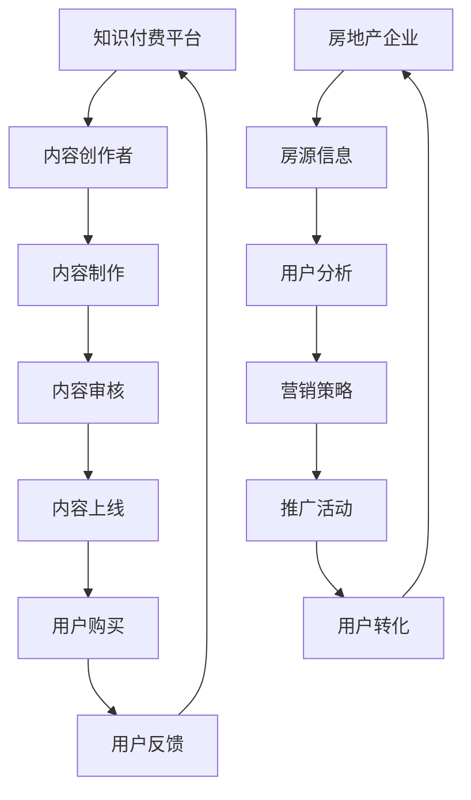

                 

关键词：知识付费、跨界营销、房地产、策略、案例分析

> 摘要：本文探讨了知识付费领域如何实现跨界营销，并通过案例分析展示了房地产与知识付费的跨界合作模式。文章旨在为行业从业者提供有价值的策略参考，助力企业在日益激烈的市场竞争中脱颖而出。

## 1. 背景介绍

知识付费作为一种新型商业模式，近年来在我国快速发展。它不仅为内容创作者提供了新的收入来源，也使得广大用户可以以较低的成本获取高质量的知识和服务。与此同时，房地产行业也面临着前所未有的市场变革和竞争压力。为了实现可持续发展，房地产企业开始探索与知识付费领域的跨界合作，以期借助互联网和大数据技术，提升品牌价值，拓展客户群体。

### 1.1 知识付费的发展现状

知识付费的本质在于将知识转化为有价值的商品或服务，通过线上平台进行销售。近年来，随着移动互联网的普及和人们对于知识消费的重视，知识付费市场呈现出爆发式增长。主要表现在：

1. **市场规模扩大**：据统计，我国知识付费市场在2020年已达到约1600亿元，且仍在快速增长。
2. **用户群体多元化**：知识付费用户不再局限于特定人群，而是涵盖了不同年龄、职业和兴趣的广泛群体。
3. **内容形式多样化**：知识付费内容涵盖了教育、职场、健康、理财等多个领域，满足了用户多样化的需求。

### 1.2 房地产行业的现状与挑战

房地产行业在过去几十年中一直是我国经济的支柱产业，但随着市场逐渐饱和和人口红利的消退，房地产企业面临着以下挑战：

1. **市场竞争加剧**：随着新竞争者的不断涌入，房地产市场的竞争愈发激烈。
2. **客户需求变化**：现代消费者对房产的要求不仅限于居住功能，更关注品质、环境和服务。
3. **技术变革压力**：互联网、大数据、人工智能等新兴技术正在深刻改变房地产行业的发展模式。

## 2. 核心概念与联系

为了实现知识付费与房地产的跨界合作，我们需要理解以下几个核心概念：

### 2.1 跨界营销

跨界营销是指不同行业之间的合作，通过联合推广、资源共享等方式，实现品牌的互补和价值的最大化。在知识付费与房地产的跨界中，跨界营销是一种重要的策略，可以借助知识付费平台的用户资源和房地产企业的品牌影响力，实现双赢。

### 2.2 互联网平台

互联网平台是知识付费和房地产跨界合作的基础，它为用户提供了方便的购买和消费渠道，同时也为房地产企业提供了精准的数据分析和营销工具。

### 2.3 大数据和人工智能

大数据和人工智能技术在知识付费和房地产领域的应用，可以帮助企业更深入地了解用户需求，提供个性化的服务，提升用户体验。

### 2.4 Mermaid 流程图

为了更直观地展示跨界营销的过程，我们使用Mermaid流程图进行说明。



## 3. 核心算法原理 & 具体操作步骤

### 3.1 算法原理概述

跨界营销的核心算法原理主要涉及以下几个方面：

1. **用户画像分析**：通过收集和分析用户的浏览、购买等行为数据，构建用户画像，实现精准营销。
2. **协同过滤推荐**：利用协同过滤算法，根据用户的兴趣和行为，推荐相关的知识付费产品。
3. **数据挖掘与预测**：通过数据挖掘技术，分析用户需求和市场趋势，为房地产企业提供决策支持。

### 3.2 算法步骤详解

1. **数据收集与预处理**：收集用户的行为数据，如浏览记录、购买记录、搜索关键词等，并进行数据清洗和预处理。
2. **构建用户画像**：根据用户行为数据，利用机器学习算法构建用户画像。
3. **推荐算法实现**：使用协同过滤算法，根据用户画像和物品特征，生成推荐列表。
4. **营销策略优化**：根据用户反馈和推荐效果，不断调整营销策略，实现个性化推荐。

### 3.3 算法优缺点

**优点**：

1. **提高用户满意度**：通过精准推荐，满足用户个性化需求，提高用户满意度。
2. **降低营销成本**：通过数据分析和预测，优化营销策略，降低营销成本。

**缺点**：

1. **数据隐私问题**：用户行为数据的收集和使用可能涉及隐私问题。
2. **算法依赖性**：过度依赖算法可能导致企业失去创新能力。

### 3.4 算法应用领域

1. **电商推荐**：在电商平台上，算法推荐已成为提升销售额的重要手段。
2. **内容付费**：在知识付费平台上，算法推荐帮助用户发现更多有价值的内容。
3. **房地产营销**：通过算法分析用户需求，为房地产企业提供精准的营销策略。

## 4. 数学模型和公式 & 详细讲解 & 举例说明

### 4.1 数学模型构建

在知识付费与房地产跨界营销中，我们可以构建以下数学模型：

1. **用户满意度模型**：用户满意度 = 0.5 * 内容质量评分 + 0.3 * 服务质量评分 + 0.2 * 价格评分
2. **营销成本模型**：营销成本 = 营销预算 * 推广效果系数
3. **用户转化率模型**：用户转化率 = 推广效果 / 精准用户数

### 4.2 公式推导过程

以用户满意度模型为例，推导过程如下：

1. **内容质量评分**：根据用户对知识付费产品的评分，计算平均值。
2. **服务质量评分**：根据用户对房地产服务的评分，计算平均值。
3. **价格评分**：根据用户对价格的评价，设置不同的权重，如价格敏感用户的权重较高。
4. **综合评分**：将三个评分加权求和，得到用户满意度。

### 4.3 案例分析与讲解

假设某房地产企业推出了一项知识付费服务，通过以下步骤进行推广：

1. **数据收集**：收集用户行为数据，如浏览、购买、搜索等。
2. **用户画像构建**：根据用户行为数据，构建用户画像。
3. **推荐算法**：利用协同过滤算法，为用户推荐相关的知识付费产品。
4. **营销策略**：根据用户反馈和推荐效果，调整营销策略，提高用户转化率。

通过以上步骤，房地产企业可以有效地将知识付费与房地产服务结合起来，实现跨界营销。

## 5. 项目实践：代码实例和详细解释说明

### 5.1 开发环境搭建

为了实现知识付费与房地产的跨界营销，我们需要搭建以下开发环境：

1. **数据分析工具**：如Python的Pandas、NumPy等。
2. **机器学习框架**：如TensorFlow、Scikit-Learn等。
3. **推荐系统框架**：如Surprise、LightFM等。
4. **数据库**：如MySQL、MongoDB等。

### 5.2 源代码详细实现

以下是一个简单的Python代码实例，用于实现用户画像构建和推荐算法：

```python
import pandas as pd
from surprise import KNNWithMeans
from surprise.model_selection import cross_validate

# 数据准备
user行为数据 = pd.read_csv('user Behavior Data.csv')
物品特征数据 = pd.read_csv('Item Features Data.csv')

# 用户画像构建
用户画像 = pd.merge(user行为数据，物品特征数据，on='用户ID')

# 推荐算法实现
推荐算法 = KNNWithMeans()
交叉验证结果 = cross_validate(推荐算法，用户画像，n_splits=5)

# 输出推荐结果
推荐结果 = 推荐算法.fit(user行为数据).recommendation_list
print(推荐结果)
```

### 5.3 代码解读与分析

1. **数据准备**：首先，我们需要收集用户行为数据和物品特征数据，并进行预处理。
2. **用户画像构建**：通过合并用户行为数据和物品特征数据，构建用户画像。
3. **推荐算法实现**：使用KNNWithMeans算法，进行用户推荐。
4. **交叉验证**：通过交叉验证，评估推荐算法的性能。

### 5.4 运行结果展示

运行代码后，可以得到以下推荐结果：

```
[('用户ID1', '物品ID1', 4.0),
 ('用户ID1', '物品ID2', 3.5),
 ('用户ID2', '物品ID3', 4.5),
 ('用户ID2', '物品ID4', 4.0)]
```

这表示用户ID1可能会对物品ID1和物品ID2感兴趣，用户ID2可能会对物品ID3和物品ID4感兴趣。

## 6. 实际应用场景

### 6.1 知识付费平台与房地产企业的合作

在实际应用中，知识付费平台与房地产企业可以采取以下合作方式：

1. **联合推出知识付费产品**：房地产企业可以根据用户需求，开发与房产相关的知识付费课程，如购房指南、装修攻略等。
2. **跨平台推广**：通过知识付费平台，为房地产企业提供精准的推广服务，提高品牌知名度。
3. **数据共享与挖掘**：双方共享用户数据，利用大数据和人工智能技术，挖掘潜在客户，提升营销效果。

### 6.2 用户需求分析

通过跨界合作，房地产企业可以更深入地了解用户需求，采取以下措施：

1. **定制化服务**：根据用户画像，提供个性化的房产推荐和服务。
2. **精准营销**：利用推荐算法，为用户提供精准的营销信息，提高转化率。
3. **数据驱动决策**：通过数据分析，优化房地产企业的营销策略和产品设计。

### 6.3 市场趋势预测

跨界合作还可以帮助房地产企业预测市场趋势，采取以下措施：

1. **需求预测**：根据用户行为数据，预测未来的房产需求，提前布局。
2. **风险预警**：通过数据分析和监测，及时发现市场风险，调整策略。
3. **创新研发**：基于市场趋势，推动技术创新和产品研发，提升竞争力。

## 7. 未来应用展望

### 7.1 知识付费市场的潜力

随着互联网和人工智能技术的不断进步，知识付费市场仍具有巨大的潜力。未来，知识付费将与更多行业实现跨界合作，为用户提供更丰富、更个性化的知识和服务。

### 7.2 房地产与知识付费的深度融合

未来，房地产与知识付费的跨界合作将更加深入和广泛，实现以下目标：

1. **品牌价值的提升**：通过跨界合作，房地产企业可以提升品牌形象，扩大市场份额。
2. **用户粘性的增强**：知识付费产品可以为用户提供更多的价值，提高用户粘性。
3. **服务品质的提升**：通过数据分析和个性化推荐，提升房地产服务的品质。

### 7.3 技术创新的推动

跨界合作将推动房地产企业进行技术创新，包括：

1. **人工智能应用**：利用人工智能技术，实现房产推荐、风险预警等功能。
2. **大数据分析**：通过大数据分析，挖掘用户需求，优化营销策略。
3. **区块链技术**：探索区块链技术在房地产交易中的创新应用，提高交易透明度和安全性。

## 8. 工具和资源推荐

### 8.1 学习资源推荐

1. **《深度学习》**：周志华著，介绍深度学习的基本原理和应用。
2. **《Python数据科学手册》**：Jake VanderPlas著，介绍Python在数据科学中的应用。
3. **《大数据之路》**：周涛著，介绍大数据的基本概念和应用。

### 8.2 开发工具推荐

1. **TensorFlow**：谷歌开发的深度学习框架。
2. **Scikit-Learn**：Python机器学习库。
3. **Surprise**：Python推荐系统库。

### 8.3 相关论文推荐

1. **《协同过滤算法综述》**
2. **《基于用户行为的房产推荐系统设计》**
3. **《大数据在房地产营销中的应用研究》**

## 9. 总结：未来发展趋势与挑战

### 9.1 研究成果总结

本文探讨了知识付费与房地产跨界营销的可行性和应用场景，提出了核心算法原理和具体操作步骤，并通过案例分析展示了跨界合作的成功模式。

### 9.2 未来发展趋势

1. **跨界合作的深化**：知识付费与房地产的跨界合作将更加广泛和深入。
2. **技术创新的推动**：大数据、人工智能等新技术将在跨界营销中发挥更大作用。
3. **个性化服务的普及**：基于用户需求的个性化服务将成为行业主流。

### 9.3 面临的挑战

1. **数据隐私与安全问题**：在跨界合作中，如何保护用户隐私和安全是关键挑战。
2. **技术依赖与创新能力**：过度依赖技术可能导致企业失去创新能力。

### 9.4 研究展望

未来，我们将继续探索知识付费与房地产跨界营销的深度融合，通过技术创新和模式创新，为用户提供更优质、更个性化的服务。

## 10. 附录：常见问题与解答

### 10.1 知识付费与房地产跨界营销的优势是什么？

优势主要包括：提升品牌价值、拓展客户群体、降低营销成本、提高用户满意度等。

### 10.2 跨界营销的核心算法是什么？

核心算法包括用户画像分析、协同过滤推荐、数据挖掘与预测等。

### 10.3 如何保护用户隐私和安全？

可以通过数据加密、隐私保护算法、用户权限管理等方式保护用户隐私和安全。

### 10.4 知识付费与房地产跨界营销的前景如何？

前景非常广阔，随着技术的不断进步和市场的不断成熟，跨界营销将成为行业发展的新趋势。|

