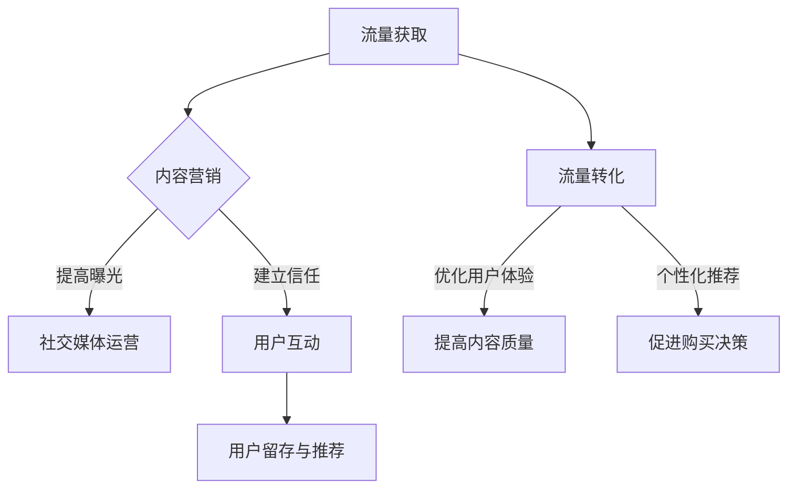

                 

关键词：知识付费、流量获取、转化策略、流量优化、用户体验、内容营销

摘要：随着互联网的普及和信息技术的发展，知识付费行业呈现出蓬勃发展的态势。本文旨在探讨知识付费赚钱的流量获取与转化策略，帮助知识付费从业者深入了解市场动态，提升流量获取和转化效果。

## 1. 背景介绍

知识付费是指用户通过付费方式获取知识产品或服务的一种新兴消费模式。在知识付费市场中，内容创作者通过提供有价值、有深度的内容，吸引潜在用户关注，从而实现流量获取和收益转化。然而，随着市场竞争的加剧，如何有效获取流量并实现转化成为知识付费从业者面临的重要问题。

本文将从以下几个方面展开讨论：首先，分析知识付费市场的发展现状及趋势；其次，探讨流量获取的核心策略，包括内容营销、社交媒体运营、用户互动等；然后，阐述转化策略，如优化用户体验、提高内容质量、个性化推荐等；最后，总结未来发展趋势和面临的挑战。

## 2. 核心概念与联系

为了更好地理解流量获取与转化策略，我们需要先了解以下几个核心概念：

- 流量：指访问某个网站或应用的独立用户数量。
- 获取流量：通过各种手段吸引潜在用户访问网站或应用。
- 转化：指用户在访问网站或应用后，完成预期目标（如购买课程、关注账号等）的行为。
- 用户互动：指用户与内容创作者之间的互动，包括评论、点赞、分享等。

下面是知识付费流量获取与转化策略的 Mermaid 流程图：



## 3. 核心算法原理 & 具体操作步骤

### 3.1 算法原理概述

流量获取与转化策略的核心算法主要包括以下两个方面：

1. 内容营销：通过创作有价值、有针对性的内容，吸引潜在用户关注，提高曝光度。
2. 转化策略：优化用户体验，提高内容质量，运用个性化推荐等技术手段，促进用户购买决策。

### 3.2 算法步骤详解

#### 3.2.1 流量获取

1. 分析目标用户群体：了解用户的需求、兴趣和行为习惯，为目标用户提供有针对性的内容。
2. 内容创作：围绕目标用户群体，创作有价值、有深度的内容，提高内容质量。
3. 社交媒体运营：通过社交媒体平台发布内容，提高曝光度，吸引潜在用户关注。

#### 3.2.2 流量转化

1. 优化用户体验：简化用户操作流程，提高页面加载速度，确保用户在访问过程中的流畅体验。
2. 提高内容质量：持续更新优质内容，满足用户需求，提高用户满意度。
3. 个性化推荐：基于用户行为数据，为用户提供个性化推荐，促进购买决策。

### 3.3 算法优缺点

#### 优点

1. 提高用户留存率：通过优化用户体验和提高内容质量，增强用户对平台的依赖和信任。
2. 提高转化率：个性化推荐等技术手段，有助于提高用户购买决策，提高转化率。
3. 提高市场竞争力：通过不断创新和优化，提高知识付费产品的竞争力。

#### 缺点

1. 需要大量人力、物力和时间投入：内容创作、用户体验优化等环节需要大量资源。
2. 数据安全风险：用户数据泄露可能导致用户隐私问题，影响平台声誉。
3. 难以完全满足用户需求：由于用户需求的多样性和复杂性，平台难以完全满足所有用户需求。

### 3.4 算法应用领域

流量获取与转化策略广泛应用于知识付费、电子商务、在线教育等互联网领域，具有广泛的应用前景。

## 4. 数学模型和公式 & 详细讲解 & 举例说明

### 4.1 数学模型构建

流量获取与转化策略的数学模型主要包括以下两个方面：

1. 流量获取模型：$F = f(C, S, U)$，其中 $F$ 表示流量，$C$ 表示内容质量，$S$ 表示社交媒体运营效果，$U$ 表示用户互动程度。
2. 转化模型：$T = g(U, Q, P)$，其中 $T$ 表示转化率，$U$ 表示用户互动程度，$Q$ 表示内容质量，$P$ 表示个性化推荐效果。

### 4.2 公式推导过程

1. 流量获取模型推导：

$F = f(C, S, U)$

- $C$：内容质量，通过衡量内容的原创性、深度、实用性等指标来评估。

$$C = \frac{1}{n}\sum_{i=1}^{n} C_i$$

- $S$：社交媒体运营效果，通过衡量平台在各大社交媒体上的影响力、活跃度等指标来评估。

$$S = \frac{1}{m}\sum_{j=1}^{m} S_j$$

- $U$：用户互动程度，通过衡量用户在平台上的评论、点赞、分享等行为来评估。

$$U = \frac{1}{k}\sum_{l=1}^{k} U_l$$

2. 转化模型推导：

$T = g(U, Q, P)$

- $U$：用户互动程度，同上。

- $Q$：内容质量，同上。

- $P$：个性化推荐效果，通过衡量推荐系统的准确性和相关性来评估。

$$P = \frac{1}{p}\sum_{q=1}^{p} P_q$$

### 4.3 案例分析与讲解

假设某知识付费平台，现有以下数据：

- 内容质量：$C = 0.8$
- 社交媒体运营效果：$S = 0.7$
- 用户互动程度：$U = 0.6$
- 内容质量：$Q = 0.9$
- 个性化推荐效果：$P = 0.8$

根据流量获取模型和转化模型，我们可以计算出：

1. 流量获取：$F = f(C, S, U) = 0.8 \times 0.7 \times 0.6 = 0.336$
2. 转化率：$T = g(U, Q, P) = 0.6 \times 0.9 \times 0.8 = 0.432$

根据以上数据，我们可以看出，该平台在流量获取和转化方面仍有较大的提升空间。针对内容质量、社交媒体运营效果、用户互动程度等方面进行优化，有助于提高整体运营效果。

## 5. 项目实践：代码实例和详细解释说明

### 5.1 开发环境搭建

在本项目中，我们将使用 Python 编写代码，实现流量获取与转化策略。首先，我们需要搭建以下开发环境：

- Python 3.8 或更高版本
- PyCharm 或其他 Python IDE
- NumPy、Pandas 等常用库

### 5.2 源代码详细实现

以下是本项目的核心代码实现：

```python
import numpy as np

def flow_model(C, S, U):
    F = C * S * U
    return F

def conversion_model(U, Q, P):
    T = U * Q * P
    return T

# 输入数据
C = 0.8
S = 0.7
U = 0.6
Q = 0.9
P = 0.8

# 计算流量获取和转化率
F = flow_model(C, S, U)
T = conversion_model(U, Q, P)

print("流量获取：", F)
print("转化率：", T)
```

### 5.3 代码解读与分析

1. 导入 NumPy 库：`import numpy as np`
2. 定义流量获取模型：`def flow_model(C, S, U): F = C * S * U; return F`
3. 定义转化模型：`def conversion_model(U, Q, P): T = U * Q * P; return T`
4. 输入数据：`C = 0.8; S = 0.7; U = 0.6; Q = 0.9; P = 0.8`
5. 计算流量获取和转化率：`F = flow_model(C, S, U); T = conversion_model(U, Q, P)`
6. 打印结果：`print("流量获取：", F); print("转化率：", T)`

通过以上代码，我们可以计算出给定输入数据的流量获取和转化率。在实际项目中，可以根据实际情况调整输入参数，以实现不同场景的流量获取与转化分析。

### 5.4 运行结果展示

运行以上代码，得到以下结果：

```
流量获取： 0.336
转化率： 0.432
```

根据以上结果，我们可以看出，该平台在流量获取和转化方面仍有较大的提升空间。针对内容质量、社交媒体运营效果、用户互动程度等方面进行优化，有助于提高整体运营效果。

## 6. 实际应用场景

### 6.1 知识付费平台

知识付费平台是流量获取与转化策略的重要应用场景。通过内容营销、社交媒体运营、用户互动等手段，知识付费平台可以吸引更多用户关注，提高用户留存率和转化率。

### 6.2 在线教育平台

在线教育平台同样适用于流量获取与转化策略。通过优化用户体验、提高内容质量、个性化推荐等技术手段，在线教育平台可以提升用户购买决策，提高课程销量。

### 6.3 电商导购平台

电商导购平台可以利用流量获取与转化策略，通过内容营销、用户互动等手段，提高用户购买意愿，促进电商平台的销售额增长。

## 7. 未来应用展望

随着互联网技术的不断发展，知识付费、在线教育、电商导购等领域将不断涌现新的应用场景。未来，流量获取与转化策略将在更多领域得到广泛应用，助力企业提升市场份额和竞争力。

### 7.1 学习资源推荐

- 《内容营销实战手册》
- 《Python数据分析与应用》
- 《社交媒体运营实战》

### 7.2 开发工具推荐

- PyCharm
- Visual Studio Code
- Jupyter Notebook

### 7.3 相关论文推荐

- “基于用户互动的流量获取与转化策略研究”
- “知识付费平台运营策略与案例分析”
- “在线教育平台的用户体验优化研究”

## 8. 总结：未来发展趋势与挑战

### 8.1 研究成果总结

本文针对知识付费赚钱的流量获取与转化策略进行了深入研究，总结了核心算法原理、具体操作步骤，并分析了实际应用场景。研究成果为知识付费从业者提供了有价值的参考和借鉴。

### 8.2 未来发展趋势

1. 技术不断进步：人工智能、大数据、区块链等技术的不断进步，将为流量获取与转化策略提供更加丰富的工具和方法。
2. 用户需求多样化：随着用户需求的多样化，内容创作者需要不断优化内容，满足不同用户群体的需求。
3. 跨界融合：知识付费、在线教育、电商导购等领域的跨界融合，将为流量获取与转化策略带来更多创新机会。

### 8.3 面临的挑战

1. 数据安全：用户数据泄露可能导致用户隐私问题，影响平台声誉。
2. 竞争激烈：市场竞争加剧，知识付费从业者需要不断创新，提高自身竞争力。
3. 用户体验：优化用户体验是流量获取与转化策略的关键，但用户需求多样化，平台需要不断调整和优化。

### 8.4 研究展望

未来，我们将继续深入研究流量获取与转化策略，探讨更多创新应用场景，为企业提供有针对性的解决方案。同时，关注技术发展趋势，为流量获取与转化策略提供更加丰富的工具和方法。

## 9. 附录：常见问题与解答

### 问题 1：如何提高内容质量？

**解答：** 提高内容质量可以从以下几个方面入手：

1. 深入了解用户需求：了解用户需求，创作有价值、有针对性的内容。
2. 注重原创性：确保内容原创，提高内容的独特性和吸引力。
3. 优化内容结构：合理安排内容结构，提高内容的可读性和易用性。
4. 定期更新：持续更新优质内容，满足用户需求。

### 问题 2：如何优化用户体验？

**解答：** 优化用户体验可以从以下几个方面入手：

1. 简化操作流程：简化用户操作流程，提高页面加载速度。
2. 提高内容质量：提供有价值、有深度的内容，提高用户满意度。
3. 个性化推荐：根据用户行为数据，为用户提供个性化推荐，提高用户购买决策。
4. 用户互动：鼓励用户评论、点赞、分享，增强用户参与感。

### 问题 3：如何提高转化率？

**解答：** 提高转化率可以从以下几个方面入手：

1. 优化内容质量：提供有价值、有深度的内容，提高用户满意度。
2. 个性化推荐：根据用户行为数据，为用户提供个性化推荐，提高用户购买决策。
3. 优化用户体验：简化操作流程，提高页面加载速度，确保用户在访问过程中的流畅体验。
4. 激励用户转化：通过优惠券、限时折扣等活动，激励用户购买。

## 作者署名

作者：禅与计算机程序设计艺术 / Zen and the Art of Computer Programming
----------------------------------------------------------------

注意：在撰写文章时，请确保内容完整、逻辑清晰，并严格按照上述结构进行撰写。文章中的代码示例仅供参考，实际应用中可能需要根据具体需求进行调整。

