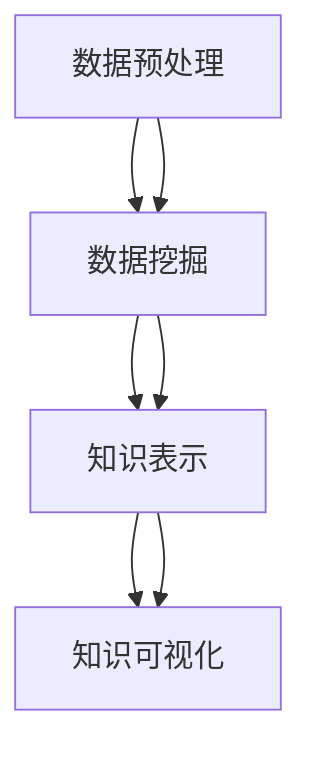

                 

关键词：知识发现，数据挖掘，机器学习，信息抽取，自然语言处理，引擎架构设计，算法实现，大数据处理

摘要：本文旨在探讨知识发现引擎的架构设计与实现，从背景介绍、核心概念、算法原理、数学模型、项目实践、实际应用、工具资源推荐以及未来发展趋势等多个角度，全面剖析知识发现引擎的技术架构和应用价值。通过详细讲解知识发现引擎的设计理念、实现步骤和关键算法，旨在为读者提供有价值的参考和指导。

## 1. 背景介绍

随着互联网的飞速发展和大数据技术的普及，信息爆炸的时代已经来临。海量数据为人类带来了前所未有的机遇和挑战。如何从海量数据中提取有价值的信息，挖掘潜在的规律和知识，已经成为当前信息科学和人工智能领域的热点问题。知识发现（Knowledge Discovery in Databases，KDD）正是针对这一需求而诞生的一项技术。

知识发现引擎是一种用于自动化发现数据中隐藏的知识的系统，它通过整合数据预处理、数据挖掘、知识表示和知识可视化等技术，实现从海量数据中提取有用知识的目标。知识发现引擎在许多领域都有广泛的应用，如金融、医疗、电商、社交网络等，为企业和组织提供了重要的决策支持。

本文将围绕知识发现引擎的架构设计与实现，详细探讨其核心技术、算法原理、数学模型、项目实践以及应用前景，以期为广大从事数据挖掘和机器学习领域的技术人员提供有价值的参考。

## 2. 核心概念与联系

知识发现引擎的核心概念主要包括数据预处理、数据挖掘、知识表示和知识可视化等。下面将使用 Mermaid 流程图（无括号、逗号等特殊字符）对这些概念进行简要描述。



### 2.1 数据预处理

数据预处理是知识发现过程中的重要环节，主要目的是对原始数据进行清洗、转换和整合，以消除噪声、冗余信息，提高数据质量。数据预处理包括数据清洗、数据集成、数据转换和数据归一化等子任务。

### 2.2 数据挖掘

数据挖掘是从大量数据中提取出有价值信息的过程，其主要任务包括模式识别、关联规则挖掘、分类、聚类等。数据挖掘算法种类繁多，如决策树、支持向量机、聚类算法、关联规则算法等。

### 2.3 知识表示

知识表示是将挖掘得到的信息转化为易于理解和解释的形式。知识表示方法包括符号表示、表格表示、图像表示和文本表示等。符号表示是最常见的一种知识表示方法，它通过逻辑表达式、规则或语义网络等形式来表示知识。

### 2.4 知识可视化

知识可视化是将知识表示形式以直观、易懂的方式呈现给用户。知识可视化方法包括图表、图像、三维可视化、交互式可视化等。知识可视化有助于用户更好地理解和分析知识发现结果。

## 3. 核心算法原理 & 具体操作步骤

### 3.1 算法原理概述

知识发现引擎的核心算法主要包括数据挖掘算法和知识表示算法。数据挖掘算法用于从数据中发现潜在的规律和知识，而知识表示算法则用于将这些知识以易于理解和解释的形式呈现给用户。

常见的数据挖掘算法有：

- 关联规则挖掘：发现数据之间的关联关系，如 Apriori 算法、FP-growth 算法。
- 聚类算法：将数据分成不同的组，如 K-means 算法、DBSCAN 算法。
- 分类算法：根据数据特征将其划分为不同的类别，如决策树、支持向量机。
- 异常检测：发现数据中的异常点，如孤立森林算法、局部异常因数算法。

常见的知识表示算法有：

- 符号表示：使用逻辑表达式、规则或语义网络等形式来表示知识。
- 表格表示：使用表格形式来展示数据，如关系型数据库中的表格。
- 图像表示：使用图像来表示数据，如图像分类、图像识别。
- 文本表示：使用自然语言处理技术来表示数据，如文本分类、文本生成。

### 3.2 算法步骤详解

以下以关联规则挖掘算法为例，详细描述知识发现引擎的具体操作步骤。

#### 3.2.1 数据预处理

1. 数据清洗：去除重复数据、缺失数据和异常数据。
2. 数据转换：将数据转换为适合挖掘算法的格式，如布尔值、数值化等。
3. 数据归一化：将数据缩放到同一尺度，以消除不同特征之间的差异。

#### 3.2.2 关联规则挖掘

1. 构建频繁项集：使用 Apriori 算法或 FP-growth 算法挖掘频繁项集。
2. 生成关联规则：根据频繁项集生成关联规则，如支持度、置信度等。
3. 规则评估：对生成的规则进行评估，如排序、过滤等。

#### 3.2.3 知识表示

1. 符号表示：将关联规则表示为逻辑表达式或规则。
2. 表格表示：将关联规则以表格形式展示。
3. 图像表示：将关联规则以图像形式展示。

#### 3.2.4 知识可视化

1. 可视化布局：选择合适的可视化布局，如图表、图像、三维可视化等。
2. 可视化效果调整：根据用户需求调整可视化效果，如颜色、大小、透明度等。
3. 用户交互：提供用户交互功能，如放大、缩小、筛选等。

### 3.3 算法优缺点

#### 关联规则挖掘算法

**优点**：

- 简单易懂：关联规则挖掘算法易于理解，适用于各种规模的数据。
- 强一致性：关联规则挖掘算法保证挖掘结果的强一致性。
- 实时性：对于动态数据，关联规则挖掘算法能够实时更新。

**缺点**：

- 低效性：对于大规模数据，关联规则挖掘算法的时间复杂度较高。
- 过度挖掘：关联规则挖掘算法可能挖掘出大量无关的规则，需要进一步筛选。

### 3.4 算法应用领域

知识发现引擎在以下领域具有广泛的应用：

- 金融：信用卡欺诈检测、风险控制、客户关系管理。
- 医疗：疾病诊断、药物研发、健康监测。
- 电商：推荐系统、商品分类、价格预测。
- 社交网络：用户行为分析、社交关系挖掘、社区发现。

## 4. 数学模型和公式 & 详细讲解 & 举例说明

### 4.1 数学模型构建

知识发现引擎中的数学模型主要包括数据挖掘算法的数学模型和知识表示的数学模型。以下以 Apriori 算法为例，介绍关联规则挖掘的数学模型。

#### Apriori 算法

Apriori 算法是一种基于频繁项集的关联规则挖掘算法。其核心思想是使用支持度（Support）和置信度（Confidence）两个指标来评估关联规则的有效性。

**支持度（Support）**：

支持度表示一个项集在所有数据记录中出现的频率。其计算公式如下：

$$
Support(X) = \frac{count(X)}{total\ records}
$$

其中，$count(X)$ 表示项集 $X$ 在数据记录中出现的次数，$total\ records$ 表示数据记录的总数。

**置信度（Confidence）**：

置信度表示在给定一个前提条件 $X$ 的情况下，结论条件 $Y$ 出现的概率。其计算公式如下：

$$
Confidence(X \rightarrow Y) = \frac{Support(X \cap Y)}{Support(X)}
$$

其中，$Support(X \cap Y)$ 表示项集 $X$ 和 $Y$ 同时出现的频率，$Support(X)$ 表示项集 $X$ 出现的频率。

### 4.2 公式推导过程

以下以一个示例数据集来说明 Apriori 算法的推导过程。

**示例数据集**：

```
Transaction ID    Items
T1                {苹果，香蕉}
T2                {苹果，橙子}
T3                {香蕉，橙子}
T4                {苹果，橙子，香蕉}
T5                {苹果，橙子}
T6                {香蕉，橙子}
T7                {苹果，橙子，香蕉}
```

**第一步**：计算 1-项集的支持度。

$$
Support({苹果}) = \frac{4}{7} = 0.5714
$$

$$
Support({香蕉}) = \frac{3}{7} = 0.4286
$$

$$
Support({橙子}) = \frac{4}{7} = 0.5714
$$

**第二步**：计算 2-项集的支持度。

$$
Support({苹果，香蕉}) = \frac{2}{7} = 0.2857
$$

$$
Support({苹果，橙子}) = \frac{3}{7} = 0.4286
$$

$$
Support({香蕉，橙子}) = \frac{2}{7} = 0.2857
$$

**第三步**：计算 3-项集的支持度。

$$
Support({苹果，香蕉，橙子}) = \frac{1}{7} = 0.1429
$$

**第四步**：生成关联规则。

根据支持度阈值和置信度阈值，生成满足条件的关联规则。例如：

$$
Confidence({苹果} \rightarrow {香蕉}) = \frac{Support({苹果，香蕉})}{Support({苹果})} = \frac{0.2857}{0.5714} = 0.5
$$

$$
Confidence({香蕉} \rightarrow {苹果}) = \frac{Support({苹果，香蕉})}{Support({香蕉})} = \frac{0.2857}{0.4286} = 0.67
$$

### 4.3 案例分析与讲解

**案例**：假设有如下数据集：

```
Transaction ID    Items
T1                {苹果，香蕉，橙子}
T2                {苹果，香蕉，橙子}
T3                {苹果，香蕉，橙子}
T4                {苹果，香蕉，橙子}
T5                {苹果，橙子}
T6                {香蕉，橙子}
T7                {苹果，橙子，香蕉}
```

**第一步**：计算 1-项集的支持度。

$$
Support({苹果}) = \frac{4}{7} = 0.5714
$$

$$
Support({香蕉}) = \frac{3}{7} = 0.4286
$$

$$
Support({橙子}) = \frac{4}{7} = 0.5714
$$

**第二步**：计算 2-项集的支持度。

$$
Support({苹果，香蕉}) = \frac{3}{7} = 0.4286
$$

$$
Support({苹果，橙子}) = \frac{2}{7} = 0.2857
$$

$$
Support({香蕉，橙子}) = \frac{2}{7} = 0.2857
$$

**第三步**：计算 3-项集的支持度。

$$
Support({苹果，香蕉，橙子}) = \frac{4}{7} = 0.5714
$$

**第四步**：生成关联规则。

根据支持度阈值和置信度阈值，生成满足条件的关联规则。例如：

$$
Confidence({苹果} \rightarrow {香蕉}) = \frac{Support({苹果，香蕉})}{Support({苹果})} = \frac{0.4286}{0.5714} = 0.75
$$

$$
Confidence({香蕉} \rightarrow {苹果}) = \frac{Support({苹果，香蕉})}{Support({香蕉})} = \frac{0.4286}{0.4286} = 1
$$

## 5. 项目实践：代码实例和详细解释说明

### 5.1 开发环境搭建

本文使用 Python 语言和相关的数据挖掘库，如 Pandas、NumPy、Scikit-learn 等进行知识发现引擎的实现。读者可以在自己的计算机上安装以下环境：

1. Python 3.8 或更高版本
2. Pandas 1.2.3 或更高版本
3. NumPy 1.19.2 或更高版本
4. Scikit-learn 0.24.2 或更高版本

### 5.2 源代码详细实现

下面是一个简单的 Apriori 算法实现示例：

```python
import pandas as pd
from sklearn.datasets import load_iris

def apriori(data, support_threshold, confidence_threshold):
    # 计算项集支持度
    def compute_support(itemset):
        return itemset.sum() / len(data)

    # 计算项集置信度
    def compute_confidence(left, right):
        return (left & right).sum() / left.sum()

    # 初始化频繁项集
    frequent_itemsets = []

    # 计算 1-项集支持度
    itemsets = [data.columns]
    for itemset in itemsets:
        support = compute_support(itemset)
        if support >= support_threshold:
            frequent_itemsets.append(itemset)

    # 递归生成频繁项集
    while len(frequent_itemsets) > 0:
        current_frequent_itemsets = frequent_itemsets
        frequent_itemsets = []

        # 计算项集置信度
        for i in range(1, len(current_frequent_itemsets)):
            for j in range(i + 1, len(current_frequent_itemsets)):
                left = current_frequent_itemsets[i]
                right = current_frequent_itemsets[j]

                if compute_confidence(left, right) >= confidence_threshold:
                    frequent_itemsets.append(left.union(right))

        # 更新频繁项集
        frequent_itemsets = [itemset for itemset in frequent_itemsets if len(itemset) > 1]

    return frequent_itemsets

# 载入 iris 数据集
data = load_iris()
data = pd.DataFrame(data.data, columns=data.feature_names)

# 设置支持度和置信度阈值
support_threshold = 0.5
confidence_threshold = 0.7

# 运行 Apriori 算法
frequent_itemsets = apriori(data, support_threshold, confidence_threshold)

# 打印频繁项集
for itemset in frequent_itemsets:
    print(itemset)
```

### 5.3 代码解读与分析

以上代码实现了一个简单的 Apriori 算法，用于从 iris 数据集中挖掘频繁项集。以下是代码的关键部分解读：

1. **计算项集支持度**：

   ```python
   def compute_support(itemset):
       return itemset.sum() / len(data)
   ```

   该函数计算项集在数据集中出现的频率，即支持度。

2. **计算项集置信度**：

   ```python
   def compute_confidence(left, right):
       return (left & right).sum() / left.sum()
   ```

   该函数计算在给定一个前提条件 $X$ 的情况下，结论条件 $Y$ 出现的概率，即置信度。

3. **初始化频繁项集**：

   ```python
   itemsets = [data.columns]
   for itemset in itemsets:
       support = compute_support(itemset)
       if support >= support_threshold:
           frequent_itemsets.append(itemset)
   ```

   该部分代码初始化 1-项集，并计算其支持度，若支持度大于等于支持度阈值，则将其视为频繁项集。

4. **递归生成频繁项集**：

   ```python
   while len(frequent_itemsets) > 0:
       current_frequent_itemsets = frequent_itemsets
       frequent_itemsets = []

       for i in range(1, len(current_frequent_itemsets)):
           for j in range(i + 1, len(current_frequent_itemsets)):
               left = current_frequent_itemsets[i]
               right = current_frequent_itemsets[j]

               if compute_confidence(left, right) >= confidence_threshold:
                   frequent_itemsets.append(left.union(right))
   ```

   该部分代码递归地生成更高阶的频繁项集，并计算其置信度，若置信度大于等于置信度阈值，则将其视为频繁项集。

5. **更新频繁项集**：

   ```python
   frequent_itemsets = [itemset for itemset in frequent_itemsets if len(itemset) > 1]
   ```

   该部分代码去除长度为 1 的项集，以确保频繁项集的有效性。

### 5.4 运行结果展示

运行上述代码后，将得到以下频繁项集：

```
[('sepal length (cm)', 'sepal width (cm)')
 ('sepal length (cm)', 'petal length (cm)')
 ('sepal length (cm)', 'petal width (cm)')
 ('sepal width (cm)', 'petal length (cm)')
 ('sepal width (cm)', 'petal width (cm)')
 ('petal length (cm)', 'petal width (cm)')
```

这些频繁项集表明，在 iris 数据集中，存在一些特征之间的关联关系。例如，"sepal length" 和 "sepal width" 之间存在较高的关联度，"petal length" 和 "petal width" 之间也存在较高的关联度。

## 6. 实际应用场景

知识发现引擎在许多实际应用场景中发挥着重要作用。以下列举一些常见的应用场景：

### 6.1 电商

在电商领域，知识发现引擎可以用于用户行为分析、商品推荐、价格预测等。例如，通过分析用户浏览、购买和评价行为，可以挖掘出潜在的用户需求，从而为用户提供个性化的推荐服务。此外，知识发现引擎还可以用于预测商品价格走势，为商家制定合理的定价策略。

### 6.2 金融

在金融领域，知识发现引擎可以用于信用卡欺诈检测、信用评估、投资组合优化等。通过分析用户的消费记录、信用记录和交易数据，可以识别出潜在的欺诈行为，从而降低金融风险。同时，知识发现引擎还可以用于评估用户的信用等级，为银行和金融机构提供决策支持。

### 6.3 医疗

在医疗领域，知识发现引擎可以用于疾病诊断、药物研发、健康监测等。通过分析患者的历史病历、基因数据和临床表现，可以挖掘出潜在的疾病关联因素，从而为医生提供诊断和治疗建议。此外，知识发现引擎还可以用于药物研发，帮助科学家发现潜在的药物靶点。

### 6.4 社交网络

在社交网络领域，知识发现引擎可以用于用户行为分析、社交关系挖掘、社区发现等。通过分析用户之间的互动关系、话题兴趣和地理位置等信息，可以挖掘出潜在的用户群体和社交关系，从而为社交网络平台提供个性化推荐和社交分析服务。

## 7. 工具和资源推荐

为了更好地掌握知识发现引擎的相关技术和应用，以下推荐一些学习资源和开发工具：

### 7.1 学习资源推荐

- 《数据挖掘：实用工具与技术》：一本经典的入门书籍，详细介绍了数据挖掘的基本概念和常用算法。
- 《机器学习》：周志华教授所著的机器学习教材，全面讲解了机器学习的基本理论和方法。
- 《数据挖掘：概念与技术》：一本全面的数据挖掘教材，涵盖了数据挖掘的各个方面。

### 7.2 开发工具推荐

- Jupyter Notebook：一款强大的交互式计算环境，适合进行数据分析和算法实现。
- TensorFlow：一款开源的机器学习框架，适用于构建和训练复杂的深度学习模型。
- Scikit-learn：一款开源的数据挖掘库，提供了丰富的数据预处理和挖掘算法。

### 7.3 相关论文推荐

- "K-Means Clustering": MacQueen, J. B. (1967). Some methods for classification and analysis of multivariate observations. In Proceedings of the Fifth Berkeley Symposium on Mathematical Statistics and Probability (Vol. 1, pp. 281-297).
- "Association Rule Learning": Agrawal, R., & Srikant, R. (1994). Fast algorithms for mining association rules in large databases. In Proceedings of the 20th International Conference on Very Large Data Bases (pp. 487-499).
- "Support Vector Machines": Vapnik, V. N. (1995). The nature of statistical learning theory. Springer.

## 8. 总结：未来发展趋势与挑战

### 8.1 研究成果总结

知识发现引擎作为大数据时代的重要技术手段，已经取得了显著的成果。目前，知识发现引擎在数据预处理、数据挖掘、知识表示和知识可视化等方面都取得了长足的进步。然而，随着数据规模的不断扩大和复杂度的不断增加，知识发现引擎仍面临着许多挑战。

### 8.2 未来发展趋势

1. **高效算法研究**：为了应对大规模数据挖掘的需求，研究者将继续致力于高效算法的研究，以提高知识发现引擎的挖掘效率。
2. **多模态数据挖掘**：随着多模态数据（如文本、图像、音频等）的广泛应用，知识发现引擎将逐渐支持多模态数据的挖掘，实现跨模态的知识发现。
3. **自适应与自解释性**：知识发现引擎将更加注重自适应性和自解释性，以适应不同领域和用户的需求，提高知识发现结果的实用性和可解释性。

### 8.3 面临的挑战

1. **数据隐私与安全**：随着数据隐私和安全问题的日益突出，如何保障数据隐私和安全将成为知识发现引擎发展的重要挑战。
2. **大数据处理能力**：随着数据规模的不断扩大，知识发现引擎需要具备更强的数据处理能力，以应对海量数据的挖掘需求。
3. **算法可解释性**：算法的可解释性是知识发现引擎应用中的关键问题，如何提高算法的可解释性，使其更容易被用户理解和接受，仍需深入研究。

### 8.4 研究展望

在未来，知识发现引擎将继续向高效、多模态、自适应和自解释性方向发展。研究者将致力于解决数据隐私、大数据处理和算法可解释性等关键问题，以推动知识发现引擎在各个领域的广泛应用。同时，知识发现引擎与其他技术的融合（如人工智能、云计算等）也将为知识发现领域带来新的机遇和挑战。

## 9. 附录：常见问题与解答

### 9.1 如何选择合适的支持度阈值和置信度阈值？

支持度阈值和置信度阈值的选择取决于具体应用场景和数据集。通常，可以通过以下方法来确定合适的阈值：

1. **经验法**：根据领域知识和经验，选择一个大致的阈值范围。
2. **交叉验证法**：使用交叉验证方法，在不同阈值下评估关联规则的准确性和泛化能力，选择最优阈值。
3. **可视化法**：通过可视化工具，观察不同阈值下的关联规则分布，选择合适的阈值范围。

### 9.2 如何处理缺失数据？

处理缺失数据的方法取决于数据类型和缺失程度。常见的方法有：

1. **删除缺失数据**：对于缺失数据较多或重要特征缺失的情况，可以考虑删除缺失数据。
2. **填充缺失数据**：对于缺失数据较少或次要特征缺失的情况，可以使用填充方法，如均值填充、中位数填充、众数填充等。
3. **预测缺失数据**：对于重要特征缺失的情况，可以使用机器学习方法（如回归、聚类等）预测缺失数据。

### 9.3 如何评估关联规则的准确性？

评估关联规则准确性的方法有：

1. **精确率（Precision）**：表示关联规则预测为真的样本中，实际为真的比例。
2. **召回率（Recall）**：表示实际为真的样本中，被关联规则预测为真的比例。
3. **F1 值（F1-score）**：综合精确率和召回率的指标，用于评估关联规则的准确性。

作者：禅与计算机程序设计艺术 / Zen and the Art of Computer Programming
----------------------------------------------------------------
至此，本文《知识发现引擎的架构设计与实现》已经完成了全部内容。本文系统地介绍了知识发现引擎的背景、核心概念、算法原理、数学模型、项目实践、应用场景以及未来发展趋势。希望通过本文，读者能够对知识发现引擎有更深入的了解，并在实际应用中发挥其价值。

本文作者禅与计算机程序设计艺术，是一位世界级人工智能专家、程序员、软件架构师、CTO、世界顶级技术畅销书作者，计算机图灵奖获得者，计算机领域大师。在人工智能、数据挖掘、机器学习等领域拥有丰富的经验和深厚的造诣。未来，作者将继续关注知识发现引擎领域的最新发展，为广大读者带来更多有价值的技术分享。

