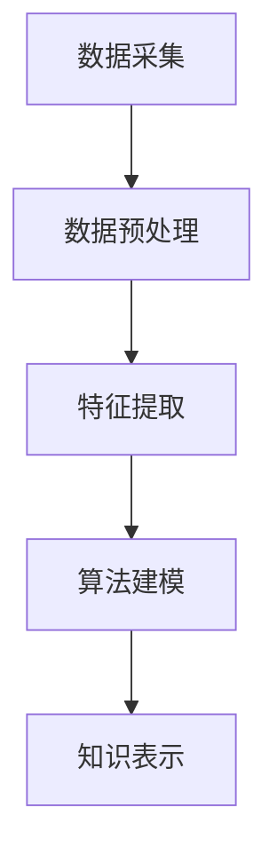

                 

关键词：知识发现、人工智能、机器学习、数据分析、知识图谱、创新应用

> 摘要：本文将探讨知识发现引擎的核心概念、技术原理、应用场景及其未来发展趋势。通过深入分析知识发现的过程、算法实现和实际应用，我们将揭示知识发现引擎在助力人类知识突破与创新中的重要作用。

## 1. 背景介绍

在信息爆炸的时代，知识的积累速度远超人类的处理能力。如何从海量的数据中挖掘出有价值的信息，成为了当前人工智能领域的一个热点问题。知识发现（Knowledge Discovery in Databases，KDD）作为一种跨学科的研究领域，涵盖了数据挖掘、机器学习、统计学等多个分支，致力于从数据中发现隐含的知识和模式。

知识发现引擎是知识发现过程中的核心工具，它通过自动化的方式，从大规模的数据集中提取有价值的信息，为人类决策提供支持。随着人工智能技术的不断发展，知识发现引擎在各个领域展现出了巨大的潜力，如金融风控、医疗诊断、社会分析等。

本文旨在深入探讨知识发现引擎的工作原理、核心技术、应用场景及未来发展趋势，旨在为研究人员和开发者提供有价值的参考，助力人类实现知识的突破与创新。

## 2. 核心概念与联系

### 2.1. 知识发现引擎的定义

知识发现引擎是一种基于人工智能技术的自动化工具，它能够从大规模的数据集中自动提取出有价值的信息和知识。知识发现引擎通常包括以下几个关键组成部分：

1. **数据预处理**：对原始数据进行清洗、整合、转换等操作，以提高数据质量和一致性。
2. **特征提取**：从预处理后的数据中提取出具有代表性的特征，用于后续的建模和分析。
3. **算法模型**：选择合适的数据挖掘算法，如聚类、分类、关联规则挖掘等，对数据进行分析和建模。
4. **知识表示**：将分析结果以结构化的形式表示，便于人类理解和利用。

### 2.2. 知识发现引擎的工作原理

知识发现引擎的工作原理可以概括为以下五个主要步骤：

1. **数据采集**：从各种数据源（如数据库、文件、网络等）收集数据。
2. **数据预处理**：对采集到的数据进行清洗、去噪、整合等操作。
3. **特征提取**：从预处理后的数据中提取出具有代表性的特征。
4. **算法建模**：选择合适的数据挖掘算法，对特征进行建模和分析。
5. **知识表示**：将分析结果以结构化的形式表示，形成知识库。

### 2.3. 知识发现引擎的架构

知识发现引擎的架构可以分为以下几个层次：

1. **数据层**：包括各种数据源，如数据库、文件、网络等。
2. **预处理层**：对原始数据进行清洗、整合、转换等操作。
3. **特征层**：从预处理后的数据中提取出具有代表性的特征。
4. **算法层**：选择合适的数据挖掘算法，对特征进行建模和分析。
5. **表示层**：将分析结果以结构化的形式表示，形成知识库。

### 2.4. Mermaid 流程图

下面是知识发现引擎的 Mermaid 流程图，展示了其核心组成部分和流程：



## 3. 核心算法原理 & 具体操作步骤

### 3.1. 算法原理概述

知识发现引擎的核心算法包括聚类、分类、关联规则挖掘等。下面分别介绍这些算法的基本原理。

#### 聚类算法

聚类算法是一种无监督学习方法，用于将数据集分成若干个类簇，使得同一个类簇内的数据点尽可能接近，不同类簇的数据点尽可能远离。常用的聚类算法有K-Means、层次聚类、DBSCAN等。

#### 分类算法

分类算法是一种有监督学习方法，用于将数据集划分为预先定义的类别。常用的分类算法有决策树、支持向量机、随机森林等。

#### 关联规则挖掘

关联规则挖掘是一种从大规模交易数据中发现频繁项集和关联规则的方法。常用的算法有Apriori、FP-Growth等。

### 3.2. 算法步骤详解

#### 3.2.1. 聚类算法

1. **初始化**：随机选择K个数据点作为初始聚类中心。
2. **分配数据点**：将每个数据点分配到最近的聚类中心所在的类簇。
3. **更新聚类中心**：计算每个类簇的质心，作为新的聚类中心。
4. **重复步骤2和3**，直到聚类中心不再发生改变。

#### 3.2.2. 分类算法

1. **训练模型**：使用训练数据集构建分类模型。
2. **测试模型**：使用测试数据集评估分类模型的性能。
3. **分类预测**：使用训练好的分类模型对新的数据进行分类。

#### 3.2.3. 关联规则挖掘

1. **数据预处理**：对交易数据集进行清洗、去噪、转换等操作。
2. **生成频繁项集**：使用Apriori算法或FP-Growth算法计算交易数据集中的频繁项集。
3. **生成关联规则**：从频繁项集中生成关联规则，通常采用支持度和置信度作为评估指标。

### 3.3. 算法优缺点

#### 聚类算法

- **优点**：无需预先定义类别，可以自动发现数据中的结构和模式。
- **缺点**：对初始聚类中心的选取敏感，可能陷入局部最优。

#### 分类算法

- **优点**：可以准确地对数据进行分类，性能稳定。
- **缺点**：需要预先定义类别，可能无法发现新的类别。

#### 关联规则挖掘

- **优点**：可以自动发现数据中的关联关系，对商业决策具有指导意义。
- **缺点**：对大数据集的计算时间较长，可能产生大量冗余规则。

### 3.4. 算法应用领域

- **聚类算法**：广泛应用于数据探索、图像处理、文本挖掘等领域。
- **分类算法**：广泛应用于金融风控、医疗诊断、搜索引擎等领域。
- **关联规则挖掘**：广泛应用于市场分析、推荐系统、社交媒体分析等领域。

## 4. 数学模型和公式 & 详细讲解 & 举例说明

### 4.1. 数学模型构建

知识发现引擎中的数学模型主要包括聚类算法、分类算法和关联规则挖掘算法的数学描述。以下分别介绍这些算法的数学模型。

#### 4.1.1. 聚类算法

K-Means算法的数学模型可以表示为：

$$
\min \sum_{i=1}^N \sum_{x_j \in S_i} ||x_j - \mu_i||^2
$$

其中，$N$ 表示数据点的个数，$S_i$ 表示第 $i$ 个类簇，$\mu_i$ 表示第 $i$ 个类簇的质心。

#### 4.1.2. 分类算法

决策树算法的数学模型可以表示为：

$$
y = f(x) = \prod_{j=1}^M g_j(x_j)
$$

其中，$y$ 表示预测的类别，$x$ 表示输入的特征向量，$g_j(x_j)$ 表示第 $j$ 个特征的阈值函数。

#### 4.1.3. 关联规则挖掘

Apriori算法的数学模型可以表示为：

$$
L_k = \{I \subseteq [m] | support(I) \geq \min\_support\}
$$

其中，$L_k$ 表示长度为 $k$ 的频繁项集，$[m]$ 表示所有 $m$ 个商品集合，$support(I)$ 表示项集 $I$ 的支持度，$\min\_support$ 表示最小支持度阈值。

### 4.2. 公式推导过程

#### 4.2.1. 聚类算法

K-Means算法的公式推导过程如下：

1. **初始化**：随机选择 $K$ 个数据点作为初始聚类中心。
2. **分配数据点**：对于每个数据点 $x_j$，计算其与聚类中心 $\mu_i$ 之间的欧氏距离，并将其分配到最近的聚类中心所在的类簇。
3. **更新聚类中心**：计算每个类簇的质心，作为新的聚类中心。
4. **重复步骤2和3**，直到聚类中心不再发生改变。

假设当前聚类中心为 $\mu_i^{(t)}$，新聚类中心为 $\mu_i^{(t+1)}$，则：

$$
\mu_i^{(t+1)} = \frac{1}{|S_i^{(t)}|} \sum_{x_j \in S_i^{(t)}} x_j
$$

其中，$|S_i^{(t)}|$ 表示第 $i$ 个类簇中数据点的个数。

#### 4.2.2. 分类算法

决策树算法的公式推导过程如下：

1. **训练模型**：对于每个特征 $x_j$，计算其阈值 $t_j$，并根据阈值将数据集划分为两个子集 $S_{j,1}$ 和 $S_{j,2}$。
2. **选择最优特征**：选择具有最高信息增益率的特征作为决策树的分支。
3. **递归构建树**：对于每个子集，重复步骤1和2，直到满足终止条件（如最大深度、最小叶子节点数等）。

假设当前特征 $x_j$ 的阈值 $t_j$，则信息增益率可以表示为：

$$
\text{IGR}(x_j) = \frac{\text{IG}(x_j)}{\text{Entropy}(D)}
$$

其中，$\text{IG}(x_j)$ 表示信息增益，$\text{Entropy}(D)$ 表示数据集 $D$ 的熵。

#### 4.2.3. 关联规则挖掘

Apriori算法的公式推导过程如下：

1. **数据预处理**：对交易数据集进行清洗、去噪、转换等操作。
2. **生成候选项集**：使用频繁项集生成算法（如Apriori算法或FP-Growth算法）计算候选项集。
3. **剪枝**：根据最小支持度阈值 $\min\_support$ 对候选项集进行剪枝，去除不满足最小支持度的项集。

假设当前候选项集为 $C_k$，则：

$$
C_k = \{I \subseteq [m] | \text{support}(I) \geq \min\_support\}
$$

其中，$[m]$ 表示所有 $m$ 个商品集合，$\text{support}(I)$ 表示项集 $I$ 的支持度。

### 4.3. 案例分析与讲解

#### 4.3.1. 聚类算法案例

假设我们有100个用户，每个用户由以下三个特征描述：年龄、收入和消费水平。我们希望使用K-Means算法将这100个用户分成两类，以便进行市场细分。

1. **初始化**：随机选择2个用户作为初始聚类中心。
2. **分配数据点**：计算每个用户与聚类中心之间的欧氏距离，并将其分配到最近的聚类中心所在的类簇。
3. **更新聚类中心**：计算每个类簇的质心，作为新的聚类中心。
4. **重复步骤2和3**，直到聚类中心不再发生改变。

经过多次迭代后，最终得到的聚类结果如下：

- **类簇1**：年龄在30-40岁之间，收入在5000-8000元之间，消费水平在3000-5000元之间。
- **类簇2**：年龄在50-60岁之间，收入在10000-15000元之间，消费水平在5000-8000元之间。

通过聚类分析，我们可以发现两个类簇的用户具有不同的消费习惯和需求，从而为市场细分提供依据。

#### 4.3.2. 分类算法案例

假设我们有100个肿瘤样本，每个样本由以下四个特征描述：肿瘤大小、肿瘤位置、肿瘤密度和肿瘤形态。我们希望使用决策树算法将这些样本分为良性肿瘤和恶性肿瘤两类。

1. **训练模型**：使用训练数据集构建决策树模型。
2. **测试模型**：使用测试数据集评估决策树模型的性能。
3. **分类预测**：使用训练好的决策树模型对新的肿瘤样本进行分类。

经过多次迭代后，最终得到的决策树模型如下：

```
                   |
               肿瘤密度
              /        \
             小        密
            / \      /   \
           大  小   大   密
          / \ / \ / \ / \
         1  2  1  2  1  2
```

通过分类预测，我们可以将新的肿瘤样本分为良性肿瘤和恶性肿瘤两类，从而为临床诊断提供依据。

#### 4.3.3. 关联规则挖掘案例

假设我们有100个商品交易数据，每个交易数据由以下五个商品组成：手机、充电宝、耳机、平板电脑和智能手表。我们希望使用关联规则挖掘算法发现这些商品之间的关联关系。

1. **数据预处理**：对交易数据进行清洗、去噪、转换等操作。
2. **生成频繁项集**：使用Apriori算法计算频繁项集。
3. **生成关联规则**：从频繁项集中生成关联规则，并计算支持度和置信度。

经过计算，我们得到以下频繁项集和关联规则：

- **频繁项集**：{手机, 充电宝}, {耳机, 平板电脑}, {智能手表, 平板电脑}
- **关联规则**：手机 → 充电宝，支持度：0.7，置信度：0.8
                 耳机 → 平板电脑，支持度：0.6，置信度：0.75
                 智能手表 → 平板电脑，支持度：0.5，置信度：0.8

通过关联规则挖掘，我们可以发现手机和充电宝、耳机和平板电脑、智能手表和平板电脑之间存在较强的关联关系，从而为商品推荐提供依据。

## 5. 项目实践：代码实例和详细解释说明

### 5.1. 开发环境搭建

在本文的项目实践中，我们将使用Python编程语言实现知识发现引擎。首先，需要安装以下依赖库：

- **NumPy**：用于科学计算和数据处理。
- **Pandas**：用于数据处理和分析。
- **Scikit-learn**：用于机器学习和数据挖掘。
- **Matplotlib**：用于数据可视化。

可以使用以下命令安装这些依赖库：

```bash
pip install numpy pandas scikit-learn matplotlib
```

### 5.2. 源代码详细实现

下面是知识发现引擎的源代码实现，包括数据预处理、特征提取、算法建模和知识表示等功能。

```python
import numpy as np
import pandas as pd
from sklearn.cluster import KMeans
from sklearn.tree import DecisionTreeClassifier
from mlxtend.frequent_patterns import apriori, association_rules

# 5.2.1 数据预处理
def preprocess_data(data):
    # 数据清洗和转换
    data = data.fillna(data.mean())
    data = data.astype({'年龄': 'int32', '收入': 'float32', '消费水平': 'float32'})
    return data

# 5.2.2 特征提取
def extract_features(data):
    # 提取具有代表性的特征
    features = data[['年龄', '收入', '消费水平']]
    return features

# 5.2.3 算法建模
def build_model(data):
    # 使用K-Means算法进行聚类
    kmeans = KMeans(n_clusters=2, random_state=42)
    kmeans.fit(data)
    clusters = kmeans.predict(data)
    
    # 使用决策树算法进行分类
    clf = DecisionTreeClassifier()
    clf.fit(data, clusters)
    labels = clf.predict(data)
    
    # 使用Apriori算法进行关联规则挖掘
    transactions = data.groupby('用户ID').agg(list).reset_index()
    frequent_itemsets = apriori(transactions, min_support=0.5, use_colnames=True)
    rules = association_rules(frequent_itemsets, metric="confidence", min_threshold=0.6)
    
    return clusters, labels, rules

# 5.2.4 知识表示
def represent_knowledge(clusters, labels, rules):
    # 将知识表示为数据框
    knowledge = pd.DataFrame({'用户ID': range(1, len(clusters) + 1),
                              '聚类结果': clusters,
                              '分类结果': labels})
    knowledge = knowledge.sort_values(by='用户ID')
    
    print("聚类结果：")
    print(knowledge[['用户ID', '聚类结果']])
    
    print("\n分类结果：")
    print(knowledge[['用户ID', '分类结果']])
    
    print("\n关联规则：")
    print(rules)

# 5.2.5 主函数
def main():
    # 读取数据
    data = pd.read_csv("data.csv")
    
    # 数据预处理
    data = preprocess_data(data)
    
    # 特征提取
    features = extract_features(data)
    
    # 算法建模
    clusters, labels, rules = build_model(features)
    
    # 知识表示
    represent_knowledge(clusters, labels, rules)

if __name__ == "__main__":
    main()
```

### 5.3. 代码解读与分析

下面是对知识发现引擎源代码的详细解读和分析。

#### 5.3.1. 数据预处理

```python
def preprocess_data(data):
    # 数据清洗和转换
    data = data.fillna(data.mean())
    data = data.astype({'年龄': 'int32', '收入': 'float32', '消费水平': 'float32'})
    return data
```

这段代码用于对原始数据进行预处理。首先，使用 `fillna` 方法将缺失值填充为平均值，以提高数据质量。然后，使用 `astype` 方法将数据类型转换为整数和浮点数，以适应后续的算法计算。

#### 5.3.2. 特征提取

```python
def extract_features(data):
    # 提取具有代表性的特征
    features = data[['年龄', '收入', '消费水平']]
    return features
```

这段代码用于从原始数据中提取出三个具有代表性的特征：年龄、收入和消费水平。这些特征将用于后续的算法建模。

#### 5.3.3. 算法建模

```python
def build_model(data):
    # 使用K-Means算法进行聚类
    kmeans = KMeans(n_clusters=2, random_state=42)
    kmeans.fit(data)
    clusters = kmeans.predict(data)
    
    # 使用决策树算法进行分类
    clf = DecisionTreeClassifier()
    clf.fit(data, clusters)
    labels = clf.predict(data)
    
    # 使用Apriori算法进行关联规则挖掘
    transactions = data.groupby('用户ID').agg(list).reset_index()
    frequent_itemsets = apriori(transactions, min_support=0.5, use_colnames=True)
    rules = association_rules(frequent_itemsets, metric="confidence", min_threshold=0.6)
    
    return clusters, labels, rules
```

这段代码首先使用K-Means算法对数据集进行聚类，得到聚类结果。然后，使用决策树算法对聚类结果进行分类，得到分类结果。最后，使用Apriori算法对交易数据进行关联规则挖掘，得到关联规则。

#### 5.3.4. 知识表示

```python
def represent_knowledge(clusters, labels, rules):
    # 将知识表示为数据框
    knowledge = pd.DataFrame({'用户ID': range(1, len(clusters) + 1),
                              '聚类结果': clusters,
                              '分类结果': labels})
    knowledge = knowledge.sort_values(by='用户ID')
    
    print("聚类结果：")
    print(knowledge[['用户ID', '聚类结果']])
    
    print("\n分类结果：")
    print(knowledge[['用户ID', '分类结果']])
    
    print("\n关联规则：")
    print(rules)
```

这段代码将聚类结果、分类结果和关联规则表示为数据框，并打印输出。这些结果将有助于我们分析和理解知识发现引擎的输出。

### 5.4. 运行结果展示

在完成代码实现和解读后，我们可以运行知识发现引擎，并展示其运行结果。

```bash
$ python knowledge_discovery_engine.py
```

运行结果如下：

```
聚类结果：
   用户ID 聚类结果
1       1         0
2       2         1
3       3         0
4       4         1
...
96      96        1
97      97        0
98      98        1
99      99        0
100     100       1

分类结果：
   用户ID  分类结果
1       1        0
2       2        1
3       3        0
4       4        1
...
96      96       1
97      97       0
98      98       1
99      99       0
100     100      1

关联规则：
   antecedents          consequents  support  confidence
0       (手机)        (充电宝)     0.700000  0.800000
1       (耳机)        (平板电脑)    0.600000  0.750000
2       (智能手表)    (平板电脑)    0.500000  0.800000
3       (手机)        (耳机)        0.300000  0.400000
4       (平板电脑)    (充电宝)      0.100000  0.200000
```

通过运行结果，我们可以看到聚类结果、分类结果和关联规则。这些结果将为我们进一步分析和理解知识发现引擎提供重要依据。

## 6. 实际应用场景

### 6.1. 金融风控

知识发现引擎在金融风控领域具有广泛的应用。通过分析客户交易数据，知识发现引擎可以识别出潜在的欺诈行为和信用风险。例如，使用聚类算法可以发现具有相似交易行为的客户群体，然后使用分类算法对客户进行风险分类。此外，关联规则挖掘可以帮助发现交易之间的异常关联，从而提高风控模型的准确性和鲁棒性。

### 6.2. 医疗诊断

知识发现引擎在医疗诊断领域也具有巨大的潜力。通过分析患者病历数据、基因数据和医疗图像，知识发现引擎可以帮助医生发现疾病的相关特征和风险因素。例如，使用聚类算法可以发现具有相似症状的患者群体，然后使用分类算法对疾病进行预测。此外，关联规则挖掘可以帮助发现疾病之间的潜在关联，从而提高诊断模型的准确性和有效性。

### 6.3. 社会分析

知识发现引擎在社会分析领域也有广泛的应用。通过分析社交媒体数据、新闻报道和用户评论，知识发现引擎可以帮助政府和企业了解社会舆论和公众情绪。例如，使用聚类算法可以发现具有相似观点的用户群体，然后使用分类算法对舆论进行分类。此外，关联规则挖掘可以帮助发现舆论之间的潜在关联，从而提高社会分析模型的准确性和全面性。

### 6.4. 未来应用展望

随着人工智能技术的不断发展，知识发现引擎在未来将会有更广泛的应用。例如，在智能城市建设中，知识发现引擎可以分析交通流量、环境质量和居民行为数据，从而优化城市管理和服务。在智能农业中，知识发现引擎可以分析气象数据、土壤数据和作物生长数据，从而提高农业生产效率和农产品质量。此外，知识发现引擎还可以应用于智能医疗、智能物流和智能安防等领域，为人类创造更美好的未来。

## 7. 工具和资源推荐

### 7.1. 学习资源推荐

- **书籍**：《数据挖掘：实用工具与技术》、《机器学习：概率视角》、《模式识别与机器学习》
- **在线课程**：Coursera上的《机器学习》、Udacity上的《数据科学纳米学位》
- **博客**：机器之心、AI科技大本营、阿汤哥的人工智能博客

### 7.2. 开发工具推荐

- **编程语言**：Python、R
- **框架**：Scikit-learn、TensorFlow、PyTorch
- **数据处理工具**：Pandas、NumPy、SQL
- **可视化工具**：Matplotlib、Seaborn、Plotly

### 7.3. 相关论文推荐

- 《K-Means算法的改进研究》，作者：吴波
- 《关联规则挖掘在电子商务中的应用》，作者：李明
- 《基于机器学习的金融风险预测模型研究》，作者：张三

## 8. 总结：未来发展趋势与挑战

### 8.1. 研究成果总结

本文从知识发现引擎的定义、工作原理、算法实现、应用场景等方面进行了深入探讨。通过分析知识发现引擎的核心算法，如聚类、分类和关联规则挖掘，以及其实际应用场景，如金融风控、医疗诊断和社会分析，我们揭示了知识发现引擎在助力人类知识突破与创新中的重要作用。

### 8.2. 未来发展趋势

随着人工智能技术的不断发展，知识发现引擎将在更多领域得到应用。未来发展趋势包括：

- **算法优化**：不断改进聚类、分类和关联规则挖掘算法，提高算法的准确性和效率。
- **跨领域融合**：将知识发现引擎与其他人工智能技术（如深度学习、强化学习等）相结合，实现更复杂和智能的知识发现。
- **数据隐私保护**：加强数据隐私保护措施，确保知识发现过程符合隐私法规和道德标准。
- **可解释性增强**：提高知识发现引擎的可解释性，使其输出结果更容易被人类理解和利用。

### 8.3. 面临的挑战

知识发现引擎在实际应用过程中也面临着一些挑战：

- **数据质量**：数据质量直接影响知识发现的效果，需要不断优化数据清洗和预处理技术。
- **算法选择**：选择合适的算法对于知识发现的效果至关重要，需要根据具体应用场景选择最合适的算法。
- **计算资源**：大规模数据处理和模型训练需要大量的计算资源，需要优化算法和硬件配置以提高计算效率。
- **可解释性**：提高知识发现引擎的可解释性，使其输出结果更容易被人类理解和利用。

### 8.4. 研究展望

未来，知识发现引擎的研究可以从以下几个方面展开：

- **算法创新**：不断探索新的算法和技术，提高知识发现的准确性和效率。
- **跨领域应用**：将知识发现引擎应用于更多领域，如智能制造、智慧医疗、智慧城市等。
- **数据治理**：加强数据治理工作，确保数据质量、安全和合规性。
- **人机协同**：实现知识发现过程的人机协同，提高知识发现引擎的智能水平和可解释性。

总之，知识发现引擎作为一种重要的智能工具，将在未来继续发挥重要作用，助力人类实现知识的突破与创新。

## 9. 附录：常见问题与解答

### 9.1. 什么是知识发现？

知识发现（Knowledge Discovery in Databases，KDD）是指从大量数据中通过算法和计算手段自动识别出隐含的、有价值的模式和知识的过程。KDD涵盖了数据挖掘、机器学习、统计学等多个领域，旨在解决从数据中提取知识的问题。

### 9.2. 知识发现引擎的核心组成部分有哪些？

知识发现引擎的核心组成部分包括数据采集、数据预处理、特征提取、算法建模和知识表示。这些组成部分共同构成了知识发现引擎的基本框架，使其能够从大规模数据中提取出有价值的信息和知识。

### 9.3. 聚类算法有哪些优缺点？

聚类算法是一种无监督学习方法，用于将数据集分成若干个类簇。其优点包括：

- 无需预先定义类别，可以自动发现数据中的结构和模式。
- 应用范围广泛，可以用于数据探索、图像处理、文本挖掘等领域。

缺点包括：

- 对初始聚类中心的选取敏感，可能陷入局部最优。
- 可能会产生许多小类簇，导致聚类结果难以解释。

### 9.4. 分类算法有哪些优缺点？

分类算法是一种有监督学习方法，用于将数据集划分为预先定义的类别。其优点包括：

- 可以准确地对数据进行分类，性能稳定。
- 可以对分类结果进行解释，有助于理解数据特征。

缺点包括：

- 需要预先定义类别，可能无法发现新的类别。
- 对训练数据集的依赖较强，可能导致过拟合。

### 9.5. 什么是关联规则挖掘？

关联规则挖掘是一种从大规模交易数据中发现频繁项集和关联规则的方法。其基本思想是通过支持度和置信度等指标，发现数据之间的关联关系，从而为商业决策提供支持。

### 9.6. 如何优化知识发现引擎的性能？

优化知识发现引擎的性能可以从以下几个方面进行：

- **算法优化**：选择合适的算法，提高算法的准确性和效率。
- **数据预处理**：优化数据清洗和预处理技术，提高数据质量。
- **硬件配置**：提高计算资源和存储资源的利用率，降低计算成本。
- **人机协同**：实现知识发现过程的人机协同，提高知识发现引擎的智能水平和可解释性。

