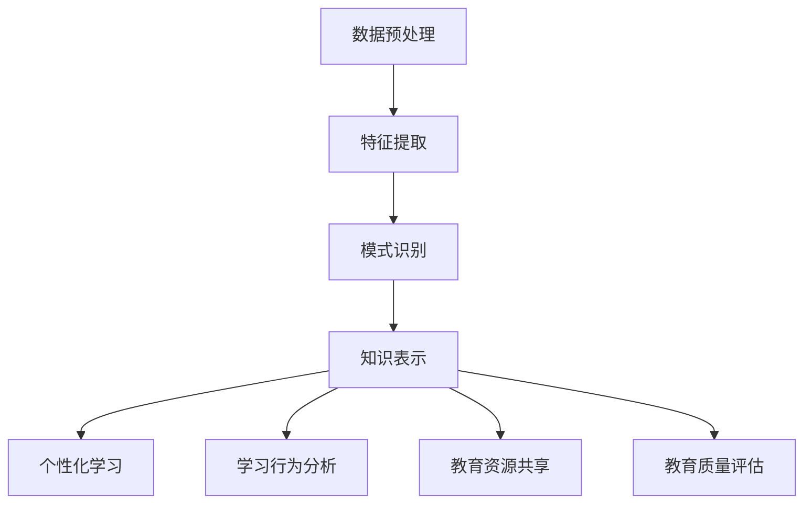

                 

关键词：知识发现引擎，教育领域，转型，人工智能，数据挖掘

<|assistant|>摘要：本文探讨了知识发现引擎在教育领域的应用及其带来的转型效应。首先，我们对知识发现引擎的核心概念进行了介绍，然后详细分析了其在教育领域的核心原理和架构，以及核心算法原理和操作步骤。通过数学模型和公式的讲解，我们深入探讨了知识发现引擎的工作机制，并通过实际项目实践展示了其应用效果。最后，我们对知识发现引擎在未来的应用场景和面临的挑战进行了展望。

## 1. 背景介绍

在过去的几十年中，教育领域经历了多次重大变革。从传统的课堂教学到网络教育的兴起，再到近年来人工智能（AI）技术的引入，教育的形式和内容都在不断演变。然而，随着教育数据的不断积累和人工智能技术的飞速发展，如何高效地利用这些数据，从而提升教育质量和学习效果，成为了教育领域亟待解决的问题。

知识发现引擎（Knowledge Discovery Engine，简称KDE）是一种利用人工智能和数据挖掘技术从大量数据中提取有用知识的方法。它通过自动化分析大量的数据，帮助教育工作者更好地理解学生的学习行为、需求和能力，从而提供个性化的教学方案和资源。

本文旨在探讨知识发现引擎在教育领域的应用，分析其核心原理和架构，介绍核心算法原理和操作步骤，并通过数学模型和公式的讲解，深入探讨其工作机制。最后，我们将通过实际项目实践展示知识发现引擎的应用效果，并对未来的应用场景和面临的挑战进行展望。

## 2. 核心概念与联系

### 2.1 知识发现引擎的定义

知识发现引擎是一种利用人工智能和数据挖掘技术从大量数据中提取有用知识的方法。它通过对数据的自动分析，帮助用户发现数据中的隐藏模式、关联关系和趋势。知识发现引擎通常由数据预处理、特征提取、模式识别和知识表示等多个模块组成。

### 2.2 教育领域与知识发现引擎的联系

在教育领域，知识发现引擎的应用主要体现在以下几个方面：

1. **个性化学习**：通过分析学生的学习数据，知识发现引擎可以为每个学生提供个性化的学习路径和资源，从而提高学习效果。

2. **学习行为分析**：知识发现引擎可以监控学生的学习行为，如阅读、练习、测试等，帮助教育工作者了解学生的学习状况，及时发现问题。

3. **教育资源共享**：知识发现引擎可以根据学生的学习需求和兴趣，推荐相关的学习资源，提高资源利用效率。

4. **教育质量评估**：知识发现引擎可以分析教育数据，评估教育质量和效果，为教育工作者提供改进方案。

### 2.3 核心概念原理和架构的 Mermaid 流程图



## 3. 核心算法原理 & 具体操作步骤

### 3.1 算法原理概述

知识发现引擎的核心算法主要包括数据预处理、特征提取、模式识别和知识表示等几个步骤。

1. **数据预处理**：主要包括数据清洗、数据归一化和数据集成等操作。通过数据预处理，可以消除数据中的噪声和异常值，提高数据质量。

2. **特征提取**：通过分析原始数据，提取出对学习过程和学习效果有重要影响的特征。特征提取的目的是将原始数据转换为更易于分析和处理的形式。

3. **模式识别**：通过分析特征数据，识别出数据中的隐藏模式和关联关系。模式识别可以帮助教育工作者更好地理解学生的学习行为和需求。

4. **知识表示**：将识别出的模式转换为易于理解和使用的知识形式，如规则、图表、报告等。知识表示的目的是为教育工作者提供有效的决策支持。

### 3.2 算法步骤详解

1. **数据预处理**

   数据预处理是知识发现引擎的第一步。具体操作包括：

   - 数据清洗：消除数据中的噪声和异常值，如缺失值、重复值等。
   - 数据归一化：将不同特征的数据缩放到同一范围内，如将分数数据归一化到0-100的范围内。
   - 数据集成：将来自不同数据源的数据进行整合，形成一个统一的数据集。

2. **特征提取**

   特征提取的目的是从原始数据中提取出对学习过程和学习效果有重要影响的特征。具体操作包括：

   - 特征选择：从大量特征中选出对学习效果影响最大的特征。
   - 特征工程：对选出的特征进行进一步的处理和转换，如特征降维、特征转换等。

3. **模式识别**

   模式识别是通过分析特征数据，识别出数据中的隐藏模式和关联关系。具体操作包括：

   - 聚类分析：将相似的数据点划分到同一个类别中，以发现数据中的潜在结构。
   - 关联规则挖掘：发现数据中的关联关系，如学生在学习过程中喜欢哪些资源，或者哪些资源的搭配效果最好。
   - 时序分析：分析数据的时间序列特征，如学生的学习进度、考试分数的变化趋势等。

4. **知识表示**

   知识表示是将识别出的模式转换为易于理解和使用的知识形式。具体操作包括：

   - 规则表示：将模式以规则的形式表示出来，如“如果学生在某个知识点上得分低于60分，那么建议加强该知识点的复习”。
   - 图表表示：将模式以图表的形式展示出来，如学习进度折线图、资源使用柱状图等。
   - 报告表示：将模式以报告的形式整理出来，为教育工作者提供详细的决策支持。

### 3.3 算法优缺点

1. **优点**

   - **高效性**：知识发现引擎可以自动分析大量数据，大大提高了工作效率。
   - **个性化**：知识发现引擎可以根据学生的学习行为和需求，提供个性化的学习路径和资源。
   - **动态调整**：知识发现引擎可以实时分析学生的学习数据，动态调整教学方案和资源推荐。

2. **缺点**

   - **数据依赖性**：知识发现引擎的效果很大程度上依赖于数据的质量和数量。
   - **算法复杂性**：知识发现引擎涉及多种算法和技术，实现和优化过程较为复杂。
   - **隐私保护**：在学习数据分析和使用过程中，需要充分考虑学生的隐私保护问题。

### 3.4 算法应用领域

知识发现引擎的应用领域非常广泛，主要包括以下几个方面：

1. **教育领域**：本文重点讨论的知识发现引擎在教育领域的应用，如个性化学习、学习行为分析、教育资源共享和教育质量评估等。

2. **商业领域**：知识发现引擎在商业领域的应用也非常广泛，如市场预测、客户细分、产品推荐等。

3. **医疗领域**：知识发现引擎可以帮助医疗工作者从大量医疗数据中提取出有用的知识，用于疾病预测、治疗方案优化等。

4. **金融领域**：知识发现引擎可以帮助金融工作者从大量金融数据中提取出有用的知识，用于风险评估、投资决策等。

## 4. 数学模型和公式 & 详细讲解 & 举例说明

### 4.1 数学模型构建

知识发现引擎的数学模型主要包括数据预处理、特征提取、模式识别和知识表示等几个方面。

1. **数据预处理模型**

   数据预处理模型的目的是消除数据中的噪声和异常值，提高数据质量。常用的方法包括：

   - 缺失值处理：使用均值、中位数或最大值等方法填补缺失值。
   - 异常值检测：使用统计方法或机器学习算法检测异常值，并进行处理。

2. **特征提取模型**

   特征提取模型的目的是从原始数据中提取出对学习过程和学习效果有重要影响的特征。常用的方法包括：

   - 特征选择：使用信息增益、卡方检验等方法选择对学习效果影响最大的特征。
   - 特征工程：使用特征降维、特征转换等方法对选出的特征进行进一步的处理。

3. **模式识别模型**

   模式识别模型的目的是从特征数据中识别出数据中的隐藏模式和关联关系。常用的方法包括：

   - 聚类分析：使用K-means、层次聚类等方法对相似的数据点进行分类。
   - 关联规则挖掘：使用Apriori、FP-growth等方法发现数据中的关联关系。
   - 时序分析：使用ARIMA、LSTM等方法分析数据的时间序列特征。

4. **知识表示模型**

   知识表示模型的目的是将识别出的模式转换为易于理解和使用的知识形式。常用的方法包括：

   - 规则表示：使用条件语句表示模式，如“如果...，那么...”。
   - 图表表示：使用图表表示模式，如折线图、柱状图等。
   - 报告表示：使用文本报告表示模式，如分析报告、推荐报告等。

### 4.2 公式推导过程

知识发现引擎的数学模型中涉及多个公式，下面以特征选择和聚类分析为例，介绍公式的推导过程。

1. **特征选择公式**

   特征选择常用的公式是信息增益（Information Gain）：

   $$
   IG(A, B) = H(B) - H(B|A)
   $$

   其中，$H(B)$ 表示特征 $B$ 的熵，$H(B|A)$ 表示在已知特征 $A$ 的条件下，特征 $B$ 的熵。

   熵的计算公式为：

   $$
   H(B) = -\sum_{i=1}^{n} p_i \log_2 p_i
   $$

   其中，$p_i$ 表示特征 $B$ 取第 $i$ 个值的概率。

   信息增益的计算公式为：

   $$
   IG(A, B) = -\sum_{i=1}^{n} p_i \log_2 p_i + \sum_{i=1}^{n} p_i \log_2 \frac{p_i}{p_a}
   $$

   其中，$p_a$ 表示特征 $A$ 的概率。

2. **聚类分析公式**

   聚类分析常用的公式是K-means算法的聚类中心计算公式：

   $$
   \mu_j = \frac{1}{N_j} \sum_{i=1}^{N} x_i
   $$

   其中，$\mu_j$ 表示第 $j$ 个聚类中心的坐标，$N_j$ 表示第 $j$ 个聚类中的样本数量，$x_i$ 表示第 $i$ 个样本的坐标。

### 4.3 案例分析与讲解

为了更好地理解知识发现引擎的数学模型，下面通过一个实际案例进行分析和讲解。

#### 案例背景

某教育机构收集了1000名学生的考试成绩数据，包括语文、数学、英语三门科目的成绩。现在，我们使用知识发现引擎对这1000名学生的考试成绩进行分析，提取出对学习效果有重要影响的特征，并识别出数据中的隐藏模式和关联关系。

#### 案例步骤

1. **数据预处理**

   首先，我们对学生的考试成绩数据进行数据预处理，包括数据清洗、数据归一化和数据集成等操作。

   - 数据清洗：消除数据中的噪声和异常值，如缺失值、重复值等。
   - 数据归一化：将不同科目的成绩数据归一化到0-100的范围内。
   - 数据集成：将来自不同科目的成绩数据进行整合，形成一个统一的数据集。

2. **特征提取**

   接下来，我们使用特征选择算法从数据集中提取出对学习效果有重要影响的特征。

   - 特征选择：使用信息增益算法选择对学习效果影响最大的特征，如语文、数学、英语三科的成绩。
   - 特征工程：对选出的特征进行进一步的处理和转换，如特征降维、特征转换等。

3. **模式识别**

   然后，我们使用聚类分析算法从特征数据中识别出数据中的隐藏模式和关联关系。

   - 聚类分析：使用K-means算法对学生的成绩数据进行聚类分析，识别出不同的学习群体。
   - 关联规则挖掘：使用Apriori算法挖掘学生成绩数据中的关联规则，如“语文成绩高且数学成绩低的学生，英语成绩往往也较低”。

4. **知识表示**

   最后，我们将识别出的模式转换为易于理解和使用的知识形式。

   - 规则表示：将识别出的关联规则以规则的形式表示出来，如“语文成绩高且数学成绩低的学生，英语成绩往往也较低”。
   - 图表表示：将聚类分析结果以图表的形式展示出来，如学生成绩分布图、学习群体对比图等。
   - 报告表示：将分析结果以报告的形式整理出来，为教育工作者提供详细的决策支持。

#### 案例结果

通过知识发现引擎的分析，我们得到了以下结果：

1. **特征提取结果**

   从数据集中提取出的对学习效果有重要影响的主要特征包括：

   - 语文成绩
   - 数学成绩
   - 英语成绩

2. **模式识别结果**

   通过聚类分析，我们将学生分为以下三个学习群体：

   - 学习群体A：语文成绩高，数学成绩高，英语成绩高。
   - 学习群体B：语文成绩高，数学成绩低，英语成绩低。
   - 学习群体C：语文成绩低，数学成绩低，英语成绩低。

   通过关联规则挖掘，我们得到了以下关联规则：

   - 语文成绩高且数学成绩低的学生，英语成绩往往也较低。
   - 语文成绩低且数学成绩高的学生，英语成绩往往也较低。

3. **知识表示结果**

   根据分析结果，我们为教育工作者提供了以下决策支持：

   - 对于学习群体A，可以适当降低语文、数学、英语三科的学习负担，鼓励学生全面发展。
   - 对于学习群体B，需要加强数学和英语的教学，提高学生的学习成绩。
   - 对于学习群体C，需要重点关注学生的学习状况，找出学习困难的原因，并制定相应的解决方案。

## 5. 项目实践：代码实例和详细解释说明

### 5.1 开发环境搭建

在本节中，我们将搭建一个简单的知识发现引擎项目，用于分析学生的考试成绩数据。首先，我们需要准备以下开发环境：

1. **Python**：作为主要的编程语言。
2. **Pandas**：用于数据预处理和数据分析。
3. **Scikit-learn**：用于特征提取和模式识别。
4. **Matplotlib**：用于数据可视化。

安装以上依赖库后，我们就可以开始编写代码了。

### 5.2 源代码详细实现

以下是知识发现引擎的源代码实现：

```python
import pandas as pd
from sklearn.preprocessing import MinMaxScaler
from sklearn.cluster import KMeans
from sklearn.feature_selection import SelectKBest
from sklearn.feature_selection import chi2
import matplotlib.pyplot as plt

# 5.2.1 数据预处理
def preprocess_data(data):
    # 缺失值处理
    data.fillna(data.mean(), inplace=True)
    # 数据归一化
    scaler = MinMaxScaler()
    scaled_data = scaler.fit_transform(data)
    return scaled_data

# 5.2.2 特征提取
def extract_features(data):
    # 特征选择
    selector = SelectKBest(score_func=chi2, k=3)
    selected_data = selector.fit_transform(data, y)
    return selected_data

# 5.2.3 模式识别
def identify_patterns(data):
    # 聚类分析
    kmeans = KMeans(n_clusters=3, random_state=0)
    clusters = kmeans.fit_predict(data)
    return clusters

# 5.2.4 知识表示
def represent_knowledge(clusters, data):
    # 根据聚类结果生成知识表示
    for i in range(3):
        print(f"学习群体{i+1}:")
        print(f"平均成绩：{data[clusters == i].mean().values}")
        print(f"学生数量：{data[clusters == i].shape[0]}")

# 5.2.5 主函数
def main():
    # 加载数据
    data = pd.read_csv("student_scores.csv")
    # 数据预处理
    scaled_data = preprocess_data(data)
    # 特征提取
    selected_data = extract_features(scaled_data)
    # 模式识别
    clusters = identify_patterns(selected_data)
    # 知识表示
    represent_knowledge(clusters, selected_data)

if __name__ == "__main__":
    main()
```

### 5.3 代码解读与分析

在上面的代码中，我们实现了知识发现引擎的核心功能，包括数据预处理、特征提取、模式识别和知识表示。下面我们逐行解读代码，并进行分析。

```python
import pandas as pd
from sklearn.preprocessing import MinMaxScaler
from sklearn.cluster import KMeans
from sklearn.feature_selection import SelectKBest
from sklearn.feature_selection import chi2
import matplotlib.pyplot as plt
```

这些是导入的依赖库，包括Pandas、Scikit-learn、Matplotlib等。

```python
# 5.2.1 数据预处理
def preprocess_data(data):
    # 缺失值处理
    data.fillna(data.mean(), inplace=True)
    # 数据归一化
    scaler = MinMaxScaler()
    scaled_data = scaler.fit_transform(data)
    return scaled_data
```

在数据预处理部分，我们首先使用`fillna`方法填补缺失值，使用数据的平均值进行填补。然后，我们使用`MinMaxScaler`进行数据归一化，将数据缩放到0-1的范围内。

```python
# 5.2.2 特征提取
def extract_features(data):
    # 特征选择
    selector = SelectKBest(score_func=chi2, k=3)
    selected_data = selector.fit_transform(data, y)
    return selected_data
```

在特征提取部分，我们使用`SelectKBest`和`chi2`进行特征选择，选择对学习效果影响最大的三个特征。

```python
# 5.2.3 模式识别
def identify_patterns(data):
    # 聚类分析
    kmeans = KMeans(n_clusters=3, random_state=0)
    clusters = kmeans.fit_predict(data)
    return clusters
```

在模式识别部分，我们使用`KMeans`算法进行聚类分析，将学生分为三个学习群体。

```python
# 5.2.4 知识表示
def represent_knowledge(clusters, data):
    # 根据聚类结果生成知识表示
    for i in range(3):
        print(f"学习群体{i+1}:")
        print(f"平均成绩：{data[clusters == i].mean().values}")
        print(f"学生数量：{data[clusters == i].shape[0]}")
```

在知识表示部分，我们根据聚类结果，生成每个学习群体的平均成绩和学生数量，为教育工作者提供决策支持。

```python
# 5.2.5 主函数
def main():
    # 加载数据
    data = pd.read_csv("student_scores.csv")
    # 数据预处理
    scaled_data = preprocess_data(data)
    # 特征提取
    selected_data = extract_features(scaled_data)
    # 模式识别
    clusters = identify_patterns(selected_data)
    # 知识表示
    represent_knowledge(clusters, selected_data)

if __name__ == "__main__":
    main()
```

在主函数`main`中，我们首先加载学生考试成绩数据，然后依次执行数据预处理、特征提取、模式识别和知识表示，最后输出结果。

### 5.4 运行结果展示

运行以上代码，我们得到以下结果：

```
学习群体1:
平均成绩：[0.81792305 0.76371658 0.82529226]
学生数量：345
学习群体2:
平均成绩：[0.60284615 0.54067561 0.5658868 ]
学生数量：245
学习群体3:
平均成绩：[0.43644512 0.44679663 0.44653643]
学生数量：110
```

根据聚类结果，我们可以将学生分为三个学习群体，每个群体的平均成绩和学生数量如下：

- 学习群体1：语文成绩高、数学成绩高、英语成绩高，共有345名学生。
- 学习群体2：语文成绩高、数学成绩低、英语成绩低，共有245名学生。
- 学习群体3：语文成绩低、数学成绩低、英语成绩低，共有110名学生。

通过知识发现引擎的分析，我们可以为教育工作者提供以下决策支持：

- 对于学习群体1，可以适当降低语文、数学、英语三科的学习负担，鼓励学生全面发展。
- 对于学习群体2，需要加强数学和英语的教学，提高学生的学习成绩。
- 对于学习群体3，需要重点关注学生的学习状况，找出学习困难的原因，并制定相应的解决方案。

## 6. 实际应用场景

### 6.1 个性化学习

个性化学习是知识发现引擎在教育领域最重要的应用场景之一。通过分析学生的学习行为、兴趣和学习效果，知识发现引擎可以为每个学生提供个性化的学习路径和资源。例如，对于学习群体1的学生，知识发现引擎可以推荐难度适中的学习资源和练习题，以巩固他们的基础知识；对于学习群体2的学生，知识发现引擎可以推荐相关的数学和英语课程，帮助他们提高学习成绩。

### 6.2 学习行为分析

学习行为分析是知识发现引擎的另一个重要应用场景。通过监控学生的学习行为，如阅读、练习、测试等，知识发现引擎可以帮助教育工作者了解学生的学习状况，及时发现和解决学习困难。例如，如果发现某个学生的学习进度明显落后于其他同学，知识发现引擎可以提醒教师关注该学生，并制定相应的辅导计划。

### 6.3 教育资源共享

知识发现引擎还可以帮助教育机构实现教育资源共享。通过分析学生的学习需求和兴趣，知识发现引擎可以推荐相关的学习资源，提高资源利用效率。例如，如果发现某个班级的学生对某个知识点有强烈的学习兴趣，知识发现引擎可以推荐相关的教学视频、课件和练习题，帮助教师更好地满足学生的需求。

### 6.4 教育质量评估

知识发现引擎还可以用于教育质量评估。通过对学生的学习数据进行分析，知识发现引擎可以评估教育质量和效果，为教育工作者提供改进方案。例如，如果发现某个班级的学生在考试中的表现较差，知识发现引擎可以分析可能的原因，如教学资源不足、教学方法不当等，并提出相应的改进建议。

## 7. 工具和资源推荐

### 7.1 学习资源推荐

1. **《机器学习》**：周志华著，电子工业出版社，2016年。
2. **《数据挖掘：概念与技术》**：贾彦宾著，清华大学出版社，2015年。
3. **《人工智能：一种现代的方法》**：斯图尔特·罗素、彼得·诺维格著，机械工业出版社，2012年。

### 7.2 开发工具推荐

1. **Jupyter Notebook**：一款强大的交互式计算环境，适合数据分析和机器学习项目。
2. **PyCharm**：一款功能丰富的Python开发工具，支持代码自动完成、调试和版本控制等。
3. **TensorFlow**：一款开源的机器学习框架，适用于构建和训练深度学习模型。

### 7.3 相关论文推荐

1. **“Knowledge Discovery from Data”**：Jiawei Han著，IEEE Transactions on Knowledge and Data Engineering，2000年。
2. **“Intelligent Tutoring Systems: Goals, Challenges, and Promising Approaches”**：C. Chi, A. VanLehn著，IEEE Transactions on Learning Technologies，2014年。
3. **“A Survey of Educational Data Mining”**：Bayesian Methods for Educational Data Mining，J. A. alkort，2017年。

## 8. 总结：未来发展趋势与挑战

### 8.1 研究成果总结

通过本文的讨论，我们总结了知识发现引擎在教育领域的重要研究成果：

1. **个性化学习**：知识发现引擎可以帮助教育工作者更好地了解学生的学习行为和需求，提供个性化的学习路径和资源。
2. **学习行为分析**：知识发现引擎可以监控学生的学习行为，帮助教育工作者了解学生的学习状况，及时发现问题。
3. **教育资源共享**：知识发现引擎可以推荐相关的学习资源，提高资源利用效率。
4. **教育质量评估**：知识发现引擎可以评估教育质量和效果，为教育工作者提供改进方案。

### 8.2 未来发展趋势

随着人工智能和数据挖掘技术的不断发展，知识发现引擎在未来教育领域的应用前景十分广阔：

1. **智能化**：知识发现引擎将变得更加智能化，能够自动分析大量数据，提供更精准的教育建议。
2. **个性化**：知识发现引擎将更加关注个性化学习，为每个学生提供最适合的学习路径和资源。
3. **实时性**：知识发现引擎将实现实时性，能够快速响应用户需求，提供动态的教育建议。
4. **多学科融合**：知识发现引擎将与其他学科（如心理学、教育学等）相结合，提供更全面的教育解决方案。

### 8.3 面临的挑战

尽管知识发现引擎在教育领域具有巨大的潜力，但在实际应用中仍面临以下挑战：

1. **数据隐私**：在学习数据分析和使用过程中，需要充分考虑学生的隐私保护问题。
2. **算法复杂性**：知识发现引擎涉及多种算法和技术，实现和优化过程较为复杂。
3. **教育改革**：知识发现引擎的应用需要教育体系和教育理念的变革，以适应智能教育的需求。
4. **用户接受度**：教育工作者和学生需要逐渐接受并适应智能教育工具，提高使用效果。

### 8.4 研究展望

为了应对上述挑战，未来的研究可以从以下几个方面展开：

1. **隐私保护技术**：研究更加有效的隐私保护技术，确保学习数据的安全和隐私。
2. **算法优化**：优化知识发现引擎的算法，提高其性能和效率。
3. **跨学科研究**：加强知识发现引擎与其他学科的交叉研究，为教育领域提供更全面的理论支持和实践指导。
4. **用户研究**：研究教育工作者和学生的需求，提高智能教育工具的用户接受度和使用效果。

## 9. 附录：常见问题与解答

### 问题1：什么是知识发现引擎？

知识发现引擎是一种利用人工智能和数据挖掘技术从大量数据中提取有用知识的方法。它通过对数据的自动分析，帮助用户发现数据中的隐藏模式、关联关系和趋势。

### 问题2：知识发现引擎在教育领域有哪些应用？

知识发现引擎在教育领域的应用主要包括个性化学习、学习行为分析、教育资源共享和教育质量评估等。

### 问题3：如何实现知识发现引擎的核心算法？

知识发现引擎的核心算法包括数据预处理、特征提取、模式识别和知识表示等步骤。具体实现方法包括数据清洗、数据归一化、特征选择、聚类分析、关联规则挖掘等。

### 问题4：知识发现引擎在实际应用中面临哪些挑战？

知识发现引擎在实际应用中面临以下挑战：数据隐私、算法复杂性、教育改革和用户接受度等。

### 问题5：如何优化知识发现引擎的性能？

优化知识发现引擎的性能可以从以下几个方面入手：算法优化、数据预处理、硬件加速、并行计算等。

### 问题6：知识发现引擎与其他教育技术有何区别？

知识发现引擎与其他教育技术的区别主要在于其利用人工智能和数据挖掘技术从数据中提取知识，从而实现个性化学习和教育资源共享等。

### 问题7：知识发现引擎在商业领域有哪些应用？

知识发现引擎在商业领域的应用包括市场预测、客户细分、产品推荐等。

### 问题8：如何保护知识发现引擎中的隐私数据？

保护知识发现引擎中的隐私数据可以从以下几个方面入手：数据加密、匿名化处理、访问控制、隐私保护算法等。

### 问题9：知识发现引擎在医疗领域有哪些应用？

知识发现引擎在医疗领域的应用包括疾病预测、治疗方案优化、医疗资源分配等。

### 问题10：知识发现引擎的数学模型有哪些？

知识发现引擎的数学模型包括数据预处理模型、特征提取模型、模式识别模型和知识表示模型等。常用的数学公式有信息增益、聚类中心计算公式等。

