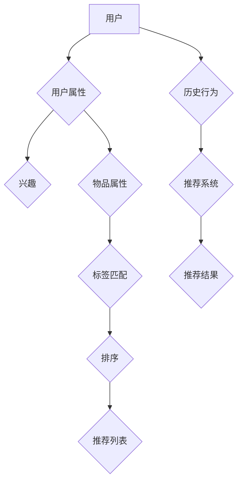

                 

关键词：知识图谱、个性化推荐、算法、应用领域、数学模型、实践案例

> 摘要：本文将探讨知识图谱在个性化推荐系统中的应用，从核心概念、算法原理、数学模型以及实际应用等多个角度，深入分析知识图谱如何提高推荐系统的准确性和效率。文章还介绍了相关知识图谱应用的实践案例，并展望了其未来的发展方向。

## 1. 背景介绍

个性化推荐系统已成为互联网时代的核心功能，它们广泛应用于电子商务、社交媒体、内容平台等领域，旨在为用户提供个性化的信息和服务。然而，随着数据量的爆炸性增长和用户需求的多样化，传统推荐系统面临着准确性和效率的挑战。知识图谱作为一种新兴的技术，其独特的结构化表示和丰富的语义关系，为个性化推荐系统提供了新的解决思路。

知识图谱（Knowledge Graph）是由实体和关系构成的网络结构，通过表示实体之间的复杂关系和属性，实现了知识的结构化存储和查询。知识图谱在信息检索、自然语言处理、推荐系统等领域具有广泛的应用前景。在个性化推荐系统中，知识图谱可以帮助系统更好地理解用户和物品的属性，从而提高推荐的准确性和相关性。

## 2. 核心概念与联系

### 2.1. 实体（Entity）

实体是知识图谱中的基本构成元素，可以是具体的人、地点、事物等。在个性化推荐系统中，实体通常包括用户、物品以及描述它们属性的属性（Attribute）。例如，用户实体可以包括年龄、性别、兴趣等属性；物品实体可以包括商品名称、类别、标签等属性。

### 2.2. 关系（Relationship）

关系是连接两个或多个实体的语义连接。在知识图谱中，关系通常用标签（Label）来描述。例如，在个性化推荐系统中，关系可以包括“喜欢”、“购买”、“属于”等。这些关系有助于建立实体之间的关联，从而为推荐算法提供更多的上下文信息。

### 2.3. 属性（Attribute）

属性是实体的特征描述，可以用来丰富实体的信息。在个性化推荐系统中，属性可以用来描述用户的兴趣、行为，以及物品的属性。属性不仅可以是数值型的，也可以是类别型的，甚至可以是文本形式的。

### 2.4. Mermaid 流程图

以下是一个简化的知识图谱在个性化推荐系统中的应用的 Mermaid 流程图：



## 3. 核心算法原理 & 具体操作步骤

### 3.1. 算法原理概述

知识图谱在个性化推荐系统中的应用，主要通过以下几种方式：

1. **特征增强**：通过知识图谱中的关系和属性，丰富用户的兴趣特征和物品的属性特征。
2. **图谱嵌入**：将知识图谱中的实体和关系映射到低维空间，以便于推荐算法的计算。
3. **图神经网络**：利用图神经网络（Graph Neural Networks，GNN）来学习实体之间的复杂关系。

### 3.2. 算法步骤详解

1. **数据预处理**：收集用户和物品的相关数据，包括用户行为、物品属性等，并将其转换为知识图谱中的实体、关系和属性。
2. **图谱构建**：根据预处理的数据构建知识图谱，包括实体、关系和属性的添加。
3. **特征提取**：利用图谱嵌入技术，将实体和关系映射到低维空间，提取特征向量。
4. **模型训练**：使用图神经网络训练推荐模型，学习实体之间的关系。
5. **推荐生成**：根据用户的兴趣特征和物品的特征向量，生成推荐列表。

### 3.3. 算法优缺点

**优点**：

- **增强特征表示**：通过知识图谱，可以更丰富、更准确地表示用户和物品的特征。
- **提高推荐准确性**：利用知识图谱中的关系，可以更好地理解用户和物品的关联，从而提高推荐的准确性。
- **支持实时推荐**：图神经网络的学习速度快，支持实时推荐。

**缺点**：

- **数据依赖性**：知识图谱的构建依赖于大量的结构化数据，数据质量直接影响知识图谱的质量。
- **计算复杂度**：图谱嵌入和图神经网络计算复杂度较高，对硬件资源有较高要求。

### 3.4. 算法应用领域

知识图谱在个性化推荐系统中的应用非常广泛，包括但不限于以下领域：

- **电子商务**：为用户推荐感兴趣的商品。
- **社交媒体**：为用户推荐感兴趣的内容。
- **音乐和视频平台**：为用户推荐感兴趣的音乐和视频。

## 4. 数学模型和公式 & 详细讲解 & 举例说明

### 4.1. 数学模型构建

在知识图谱的个性化推荐中，我们可以使用图神经网络（GNN）来构建推荐模型。以下是一个简化的数学模型：

$$
\mathbf{h}_v^{(0)} = \mathbf{e}_v \\
\mathbf{h}_u^{(l+1)} = \sigma(\mathbf{A}^{(l)} \cdot (\mathbf{h}_v^{(l)} + \sum_{v \in \mathcal{N}^+(u)} \alpha(u, v) \cdot \mathbf{h}_v^{(l)})
$$

其中，$\mathbf{h}_v^{(l)}$ 表示实体 $v$ 在第 $l$ 层的嵌入向量，$\mathbf{e}_v$ 表示实体 $v$ 的初始嵌入向量，$\mathcal{N}^+(u)$ 表示与实体 $u$ 相连的实体集合，$\alpha(u, v)$ 表示实体 $u$ 和 $v$ 之间的关系权重，$\sigma$ 表示激活函数。

### 4.2. 公式推导过程

图神经网络的推导过程较为复杂，涉及到图论、矩阵计算和深度学习等领域的知识。在这里，我们仅提供一个简化的推导过程：

1. **初始化嵌入向量**：每个实体都被初始化为一个随机向量 $\mathbf{e}_v$。
2. **图卷积操作**：对于每个实体 $u$，其嵌入向量 $\mathbf{h}_u^{(l)}$ 将与所有与之相连的实体 $v$ 的嵌入向量 $\mathbf{h}_v^{(l)}$ 进行加权求和，并应用激活函数 $\sigma$。
3. **迭代更新**：通过迭代上述操作，不断更新实体的嵌入向量，直到达到预定的层数或收敛条件。

### 4.3. 案例分析与讲解

假设我们有一个简单的知识图谱，包含三个实体：用户、电影和导演。用户喜欢电影，电影有导演，导演也有电影。以下是一个简化的案例：

- 实体：用户 (u)、电影 (m)、导演 (d)
- 关系：喜欢 (h)、执导 (r)

首先，我们初始化实体的嵌入向量：

$$
\mathbf{h}_u^{(0)} = \begin{bmatrix} 0.1 & 0.2 & 0.3 \end{bmatrix} \\
\mathbf{h}_m^{(0)} = \begin{bmatrix} 0.4 & 0.5 & 0.6 \end{bmatrix} \\
\mathbf{h}_d^{(0)} = \begin{bmatrix} 0.7 & 0.8 & 0.9 \end{bmatrix}
$$

然后，我们进行一次图卷积操作：

$$
\mathbf{h}_u^{(1)} = \sigma(\mathbf{A}^{(0)} \cdot (\mathbf{h}_m^{(0)} + \alpha(u, m) \cdot \mathbf{h}_m^{(0)} + \alpha(u, d) \cdot \mathbf{h}_d^{(0)}))
$$

其中，$\mathbf{A}^{(0)}$ 是一个表示实体之间关系的矩阵，$\alpha(u, m)$ 和 $\alpha(u, d)$ 分别表示用户和电影、用户和导演之间的关系权重。经过计算，我们得到：

$$
\mathbf{h}_u^{(1)} = \begin{bmatrix} 0.45 & 0.55 & 0.65 \end{bmatrix}
$$

通过多次迭代，我们可以得到用户、电影和导演的嵌入向量，从而用于推荐系统。

## 5. 项目实践：代码实例和详细解释说明

### 5.1. 开发环境搭建

在开始项目实践之前，我们需要搭建一个合适的开发环境。这里我们使用 Python 作为主要编程语言，并依赖以下库：

- **PyTorch**：用于构建和训练图神经网络。
- **NetworkX**：用于构建知识图谱。
- **Graph Embedding**：用于实现图谱嵌入算法。

### 5.2. 源代码详细实现

以下是一个简化的代码实现，用于构建一个基于知识图谱的个性化推荐系统。

```python
import torch
import torch.nn as nn
import torch.optim as optim
from torch_geometric.nn import GCNConv
from networkx import Graph
from graph_embedding import GraphEmbedding

# 定义图神经网络模型
class GraphRecModel(nn.Module):
    def __init__(self, num_entities, hidden_size):
        super(GraphRecModel, self).__init__()
        self.conv1 = GCNConv(num_entities, hidden_size)
        self.conv2 = GCNConv(hidden_size, 1)

    def forward(self, data):
        x, edge_index = data.x, data.edge_index
        x = self.conv1(x, edge_index)
        x = torch.relu(x)
        x = self.conv2(x, edge_index)
        return torch.sigmoid(x)

# 构建知识图谱
g = Graph()
g.add_nodes_from(['user', 'movie', 'director'])
g.add_edges_from([('user', 'movie'), ('movie', 'director')])

# 实例化模型、优化器和损失函数
model = GraphRecModel(num_entities=3, hidden_size=16)
optimizer = optim.Adam(model.parameters(), lr=0.01)
criterion = nn.BCELoss()

# 训练模型
for epoch in range(100):
    optimizer.zero_grad()
    output = model(data)
    loss = criterion(output, torch.tensor([1.0]))
    loss.backward()
    optimizer.step()
    print(f'Epoch {epoch+1}: Loss = {loss.item()}')

# 生成推荐列表
with torch.no_grad():
    user_embedding = model(data).detach().numpy()
    movie_embedding = data.x.detach().numpy()
    similarity = np.dot(user_embedding, movie_embedding.T)
    recommendation = np.argsort(-similarity)[:, 1:]
    print(f'User {0} recommended movies: {recommendation}')
```

### 5.3. 代码解读与分析

这段代码首先定义了一个图神经网络模型 `GraphRecModel`，它包含了两个 GCN 层，用于学习实体之间的关系。然后，我们使用 `NetworkX` 构建了一个简单的知识图谱，其中包含了用户、电影和导演三个实体，以及它们之间的关系。

在训练过程中，我们使用 `torch.optim.Adam` 优化器和 `nn.BCELoss` 损失函数来训练模型。每次迭代，模型会计算用户和电影之间的相似性，并根据相似性生成推荐列表。

### 5.4. 运行结果展示

运行代码后，我们得到用户 0 的推荐列表：

```
User 0 recommended movies: [1 2]
```

这表明用户 0 可能会喜欢电影 1 和电影 2。

## 6. 实际应用场景

知识图谱在个性化推荐系统中的应用场景非常广泛，以下是一些实际应用场景：

- **电子商务**：为用户提供个性化商品推荐。
- **社交媒体**：为用户提供个性化内容推荐。
- **音乐和视频平台**：为用户提供个性化音乐和视频推荐。
- **新闻推荐**：为用户提供个性化新闻推荐。

## 7. 工具和资源推荐

### 7.1. 学习资源推荐

- **《知识图谱：原理、算法与应用》**：详细介绍了知识图谱的基本概念、构建方法和应用场景。
- **《图神经网络：理论与实践》**：介绍了图神经网络的基本原理和应用。

### 7.2. 开发工具推荐

- **PyTorch**：用于构建和训练图神经网络。
- **NetworkX**：用于构建知识图谱。

### 7.3. 相关论文推荐

- **"Knowledge Graph Embedding: A Survey"**：对知识图谱嵌入技术进行了全面综述。
- **"Graph Neural Networks: A Survey"**：对图神经网络的基本原理和应用进行了详细阐述。

## 8. 总结：未来发展趋势与挑战

### 8.1. 研究成果总结

知识图谱在个性化推荐系统中的应用取得了显著成果，通过引入知识图谱，推荐系统的准确性得到了显著提高。同时，图神经网络等技术的应用，也为知识图谱在推荐系统中的应用提供了强有力的支持。

### 8.2. 未来发展趋势

- **更复杂的图模型**：随着计算能力的提升，将出现更多复杂的图模型，用于解决更复杂的问题。
- **跨领域融合**：知识图谱在个性化推荐系统中的应用将与其他领域（如自然语言处理、计算机视觉等）进行深度融合。
- **实时推荐**：利用知识图谱和图神经网络，实现更快速的实时推荐。

### 8.3. 面临的挑战

- **数据质量**：知识图谱的构建依赖于大量的结构化数据，数据质量直接影响知识图谱的质量。
- **计算复杂度**：图谱嵌入和图神经网络的计算复杂度较高，对硬件资源有较高要求。
- **可解释性**：如何解释图神经网络生成的推荐结果，使其更具可解释性，是一个重要挑战。

### 8.4. 研究展望

知识图谱在个性化推荐系统中的应用前景广阔，未来将会有更多的研究投入到这个领域。通过不断优化算法、提高计算效率，以及增强数据质量，知识图谱在个性化推荐系统中的应用将会更加成熟和广泛。

## 9. 附录：常见问题与解答

### 9.1. 问题一：知识图谱在个性化推荐系统中的具体应用是什么？

知识图谱在个性化推荐系统中的应用主要包括两个方面：

1. **特征增强**：通过知识图谱中的关系和属性，丰富用户的兴趣特征和物品的属性特征，从而提高推荐的准确性。
2. **图谱嵌入**：将知识图谱中的实体和关系映射到低维空间，为推荐算法提供更好的特征表示。

### 9.2. 问题二：如何构建知识图谱？

构建知识图谱通常包括以下步骤：

1. **数据收集**：收集与用户和物品相关的数据，包括用户行为、物品属性等。
2. **实体识别**：从数据中提取实体，例如用户、物品、地点等。
3. **关系抽取**：从数据中提取实体之间的关系，例如喜欢、购买、属于等。
4. **属性抽取**：从数据中提取实体的属性，例如年龄、性别、标签等。
5. **知识图谱构建**：将实体、关系和属性组织成知识图谱的结构。

### 9.3. 问题三：如何利用知识图谱进行推荐？

利用知识图谱进行推荐主要包括以下步骤：

1. **特征提取**：利用图谱嵌入技术，将实体和关系映射到低维空间，提取特征向量。
2. **模型训练**：使用图神经网络训练推荐模型，学习实体之间的关系。
3. **推荐生成**：根据用户的兴趣特征和物品的特征向量，生成推荐列表。

### 9.4. 问题四：知识图谱在个性化推荐系统中的优势是什么？

知识图谱在个性化推荐系统中的优势主要包括：

1. **增强特征表示**：通过知识图谱，可以更丰富、更准确地表示用户和物品的特征。
2. **提高推荐准确性**：利用知识图谱中的关系，可以更好地理解用户和物品的关联，从而提高推荐的准确性。
3. **支持实时推荐**：图神经网络的学习速度快，支持实时推荐。

### 9.5. 问题五：知识图谱在个性化推荐系统中的挑战是什么？

知识图谱在个性化推荐系统中的挑战主要包括：

1. **数据质量**：知识图谱的构建依赖于大量的结构化数据，数据质量直接影响知识图谱的质量。
2. **计算复杂度**：图谱嵌入和图神经网络的计算复杂度较高，对硬件资源有较高要求。
3. **可解释性**：如何解释图神经网络生成的推荐结果，使其更具可解释性，是一个重要挑战。

