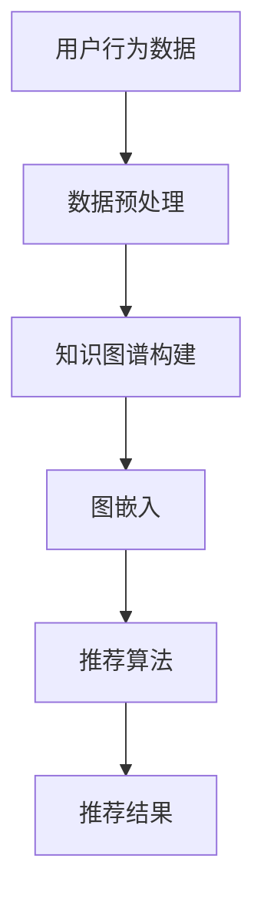
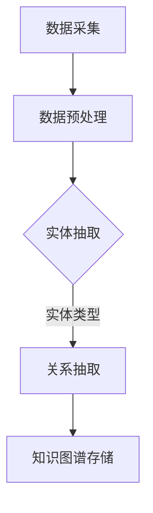
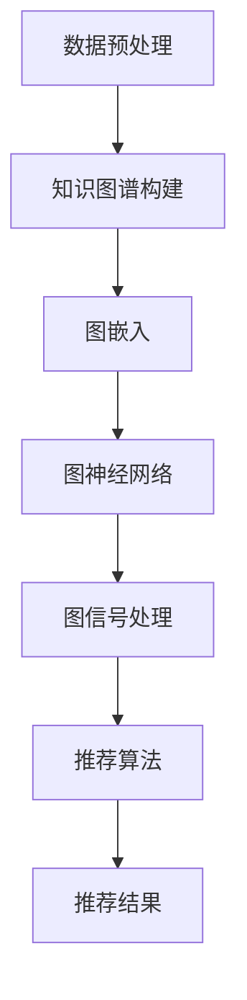

                 

关键词：知识图谱、推荐系统、人工智能、大数据、图算法

## 摘要

本文主要探讨知识图谱在推荐系统中的应用。知识图谱作为一种表示实体及其相互关系的方式，具有丰富的语义信息，能够显著提升推荐系统的效果。本文首先介绍了知识图谱的基本概念和构建方法，然后详细阐述了知识图谱在推荐系统中的核心应用，包括图嵌入、图神经网络和图信号处理等。通过数学模型和算法原理的讲解，辅以实际项目实践，本文揭示了知识图谱在推荐系统中的潜力。最后，本文对知识图谱在推荐系统的未来应用进行了展望，指出了可能面临的挑战和研究方向。

## 1. 背景介绍

推荐系统作为人工智能领域的一个重要分支，已经成为现代信息检索、电子商务和社交媒体等领域的核心技术。推荐系统能够根据用户的兴趣和行为，为用户推荐个性化内容，从而提高用户体验和平台粘性。然而，传统的推荐系统主要依赖于用户的交互数据和统计方法，容易受到数据稀疏性和噪声的影响，导致推荐效果有限。

近年来，随着大数据技术和人工智能的发展，知识图谱作为一种新兴的信息表示方法，逐渐引起了学术界和工业界的广泛关注。知识图谱通过将实体和关系表示为图结构，能够挖掘出实体之间的隐含关联，提供丰富的语义信息。这使得知识图谱在推荐系统中具有潜在的应用价值，可以弥补传统推荐系统的不足。

本文旨在探讨知识图谱在推荐系统中的应用，通过引入图嵌入、图神经网络和图信号处理等技术，提升推荐系统的效果和鲁棒性。本文首先介绍了知识图谱的基本概念和构建方法，然后详细阐述了知识图谱在推荐系统中的核心应用，并通过数学模型和算法原理的讲解，辅以实际项目实践，展示了知识图谱在推荐系统中的潜力。

## 2. 核心概念与联系

### 2.1. 知识图谱

知识图谱是一种用于表示实体及其相互关系的语义网络。它通常由实体、关系和属性三部分组成。实体是知识图谱中的核心元素，可以是人、地点、物品等；关系表示实体之间的关联，如“朋友”、“位于”等；属性则提供了实体的额外信息，如“年龄”、“颜色”等。

### 2.2. 推荐系统

推荐系统是一种利用历史数据和用户行为，预测用户可能感兴趣的内容的技术。它通常包括三个主要步骤：用户建模、内容建模和推荐算法。用户建模旨在了解用户的兴趣和行为；内容建模则是分析内容的特征和属性；推荐算法则根据用户和内容的特征进行匹配，生成推荐结果。

### 2.3. 知识图谱与推荐系统的关系

知识图谱为推荐系统提供了丰富的语义信息，可以弥补传统推荐系统数据稀疏性和噪声的不足。通过将实体和关系表示为图结构，知识图谱能够挖掘出实体之间的隐含关联，为推荐算法提供更多的信息。具体来说，知识图谱在推荐系统中的应用主要包括以下几个方面：

- **图嵌入**：将知识图谱中的实体和关系转换为向量表示，为推荐算法提供输入。
- **图神经网络**：利用知识图谱的结构信息，对实体和关系进行学习，提升推荐效果。
- **图信号处理**：利用图上的信号传播特性，为推荐系统提供额外的特征。

### 2.4. Mermaid 流程图

以下是知识图谱在推荐系统中应用的一个简化的 Mermaid 流程图：



### 2.5. 知识图谱构建流程

知识图谱构建是知识图谱应用的基础，通常包括数据采集、数据预处理、实体抽取、关系抽取和知识图谱存储等步骤。以下是一个简化的知识图谱构建流程图：



### 2.6. 知识图谱在推荐系统中的应用

知识图谱在推荐系统中的应用主要体现在以下几个方面：

- **图嵌入**：将知识图谱中的实体和关系转换为向量表示，为推荐算法提供输入。图嵌入技术包括基于矩阵分解的方法（如SGE）、基于神经网络的（如GraphSAGE）等。
- **图神经网络**：利用知识图谱的结构信息，对实体和关系进行学习，提升推荐效果。图神经网络包括GCN、GAT等。
- **图信号处理**：利用图上的信号传播特性，为推荐系统提供额外的特征。图信号处理技术包括图滤波器、图卷积等。

### 2.7. Mermaid 流程图

以下是知识图谱在推荐系统中的应用流程的一个 Mermaid 流程图：



通过上述流程，知识图谱在推荐系统中可以提供丰富的语义信息，提升推荐效果和用户体验。

## 3. 核心算法原理 & 具体操作步骤

### 3.1 算法原理概述

知识图谱在推荐系统中的应用主要依赖于图嵌入、图神经网络和图信号处理等技术。这些技术通过将知识图谱转换为向量表示或利用图的结构信息，为推荐算法提供更丰富的特征，从而提升推荐效果。

- **图嵌入**：将知识图谱中的实体和关系表示为向量，为推荐算法提供输入。图嵌入技术包括基于矩阵分解的方法（如SGE）和基于神经网络的（如GraphSAGE）等。
- **图神经网络**：利用知识图谱的结构信息，对实体和关系进行学习，提取图上的特征。图神经网络包括GCN、GAT等。
- **图信号处理**：利用图上的信号传播特性，为推荐系统提供额外的特征。图信号处理技术包括图滤波器、图卷积等。

### 3.2 算法步骤详解

以下是知识图谱在推荐系统中的应用步骤：

1. **数据预处理**：收集用户行为数据、实体属性数据等，并进行数据清洗、去重和格式化等操作。
2. **知识图谱构建**：通过实体抽取、关系抽取等技术，构建知识图谱。实体表示为节点，关系表示为边，属性表示为节点的属性。
3. **图嵌入**：将知识图谱中的实体和关系转换为向量表示。可以使用基于矩阵分解的方法（如SGE）或基于神经网络的（如GraphSAGE）等。
4. **图神经网络**：利用图神经网络（如GCN、GAT）对实体和关系进行学习，提取图上的特征。
5. **图信号处理**：利用图信号处理技术（如图滤波器、图卷积）为推荐系统提供额外的特征。
6. **推荐算法**：结合用户和内容特征，利用推荐算法（如基于协同过滤的推荐算法）生成推荐结果。

### 3.3 算法优缺点

- **图嵌入**：
  - 优点：可以有效地降低维度，提高推荐算法的效率；可以捕捉实体之间的隐含关系。
  - 缺点：对大规模知识图谱的表示和训练比较困难；难以处理多类型的实体和关系。
- **图神经网络**：
  - 优点：可以自动学习实体和关系的特征，提高推荐效果；可以处理多类型的实体和关系。
  - 缺点：对大规模知识图谱的训练和推理比较耗时；需要大量的计算资源。
- **图信号处理**：
  - 优点：可以提供额外的特征信息，提高推荐效果；可以处理复杂的图结构。
  - 缺点：对算法的参数调优和模型选择比较敏感；难以解释模型内部的工作机制。

### 3.4 算法应用领域

知识图谱在推荐系统中的应用非常广泛，可以应用于电子商务、社交媒体、在线教育、金融服务等多个领域。以下是一些具体的例子：

- **电子商务**：通过知识图谱，可以挖掘出用户和商品之间的关联关系，为用户提供个性化的商品推荐。
- **社交媒体**：通过知识图谱，可以分析用户之间的关系，为用户提供朋友推荐、话题推荐等。
- **在线教育**：通过知识图谱，可以分析课程之间的关联，为用户提供学习路径推荐。
- **金融服务**：通过知识图谱，可以分析用户和银行产品之间的关系，为用户提供个性化的金融产品推荐。

### 3.5 实际案例

以下是知识图谱在推荐系统中的一个实际案例：

**案例**：某电商平台通过知识图谱进行商品推荐。

1. **数据预处理**：收集用户浏览、购买等行为数据，以及商品属性数据。
2. **知识图谱构建**：通过实体抽取、关系抽取等技术，构建知识图谱。实体为用户和商品，关系包括“购买”、“浏览”等。
3. **图嵌入**：使用GraphSAGE模型，将用户和商品转换为向量表示。
4. **图神经网络**：使用GCN模型，对用户和商品进行特征提取。
5. **推荐算法**：结合用户和商品的特征，使用基于协同过滤的推荐算法，生成推荐结果。

通过上述步骤，该电商平台能够为用户推荐个性化的商品，提高了用户的购物体验和平台的销售额。

## 4. 数学模型和公式 & 详细讲解 & 举例说明

### 4.1 数学模型构建

知识图谱在推荐系统中的应用涉及到多个数学模型，包括图嵌入、图神经网络和图信号处理等。以下分别介绍这些模型的数学模型构建过程。

#### 4.1.1 图嵌入

图嵌入是一种将图中的节点（实体）和边（关系）表示为低维向量的方法。常见的图嵌入方法包括基于矩阵分解的方法（如SGE）和基于神经网络的（如GraphSAGE）等。

**SGE（Stochastic Gradient Descent with Memory）模型**：

SGE模型的核心思想是将图嵌入问题转化为优化问题。具体来说，SGE模型通过随机梯度下降（SGD）算法，最小化一个损失函数，从而得到节点的低维向量表示。

损失函数可以表示为：

$$
L(\theta) = \frac{1}{n} \sum_{i=1}^{n} \frac{1}{|N_i|} \sum_{j \in N_i} \frac{1}{d_i + \epsilon} \log (\sigma (W^T v_i + b_j))
$$

其中，$v_i$和$v_j$分别是节点$i$和$j$的嵌入向量；$N_i$是节点$i$的邻居集合；$d_i$是节点$i$的邻居数量；$W$是权重矩阵；$b_j$是偏置向量；$\sigma$是sigmoid函数。

通过优化上述损失函数，可以得到节点的低维向量表示。

**GraphSAGE（Graph Samples Aggregation）模型**：

GraphSAGE模型是一种基于神经网络的图嵌入方法。它通过聚合节点的邻居特征，生成节点的低维向量表示。

GraphSAGE的核心组件是聚合函数和嵌入函数。聚合函数用于聚合邻居节点的特征，嵌入函数用于将聚合后的特征映射到低维向量空间。

聚合函数的定义如下：

$$
h_{\theta}^{(l)} = \phi (A h^{(l-1)}_i + \sum_{j \in N_i} W^{(l)} \phi (h^{(l-1)}_j))
$$

其中，$h^{(l)}_i$是第$l$层节点$i$的特征；$A$是邻接矩阵；$W^{(l)}$是权重矩阵；$\phi$是激活函数。

通过反向传播和梯度下降算法，可以训练出聚合函数和嵌入函数，从而得到节点的低维向量表示。

#### 4.1.2 图神经网络

图神经网络（Graph Neural Network, GNN）是一种基于图结构的神经网络。它通过模拟图上的信号传播过程，对图中的节点和边进行学习，提取图上的特征。

**GCN（Graph Convolutional Network）模型**：

GCN模型是一种基于卷积操作的图神经网络。它通过邻接矩阵对节点特征进行加权聚合，并利用激活函数进行非线性变换，从而实现节点的特征提取。

GCN的数学模型可以表示为：

$$
h^{(l)}_i = \sigma (\sum_{j \in N_i} W^{(l)} h^{(l-1)}_j + b^{(l)})
$$

其中，$h^{(l)}_i$是第$l$层节点$i$的特征；$W^{(l)}$是权重矩阵；$b^{(l)}$是偏置向量；$\sigma$是激活函数。

通过反向传播和梯度下降算法，可以训练出GCN模型，从而实现节点的特征提取。

**GAT（Graph Attention Network）模型**：

GAT模型是一种基于注意力机制的图神经网络。它通过引入注意力权重，对邻居节点的特征进行加权聚合，从而实现节点的特征提取。

GAT的数学模型可以表示为：

$$
h^{(l)}_i = \sum_{j \in N_i} a^{(l)}_{ij} h^{(l-1)}_j
$$

其中，$a^{(l)}_{ij}$是节点$i$和$j$之间的注意力权重，可以通过以下公式计算：

$$
a^{(l)}_{ij} = \frac{\exp (W^{(l)} h^{(l-1)}_i \cdot h^{(l-1)}_j)}{\sum_{k \in N_i} \exp (W^{(l)} h^{(l-1)}_i \cdot h^{(l-1)}_k)}
$$

通过反向传播和梯度下降算法，可以训练出GAT模型，从而实现节点的特征提取。

#### 4.1.3 图信号处理

图信号处理是一种利用图上的信号传播特性，为推荐系统提供额外特征的方法。它涉及到图滤波器、图卷积等操作。

**图滤波器**：

图滤波器是一种利用图的结构信息，对节点特征进行滤波的方法。它可以捕捉节点在图上的局部和全局特征。

图滤波器的数学模型可以表示为：

$$
h_i^{(l)} = \sum_{j \in N_i} w_{ij} h_j^{(l-1)}
$$

其中，$h_i^{(l)}$是第$l$层节点$i$的特征；$w_{ij}$是图滤波器权重。

通过反向传播和梯度下降算法，可以训练出图滤波器，从而实现节点特征滤波。

**图卷积**：

图卷积是一种在图上进行的卷积操作。它可以捕捉节点在图上的空间特征。

图卷积的数学模型可以表示为：

$$
h_i^{(l)} = \sigma (\sum_{j \in N_i} w_j \cdot h_j^{(l-1)})
$$

其中，$h_i^{(l)}$是第$l$层节点$i$的特征；$w_j$是图卷积权重；$\sigma$是激活函数。

通过反向传播和梯度下降算法，可以训练出图卷积模型，从而实现节点特征提取。

### 4.2 公式推导过程

以下是对上述数学模型公式的推导过程。

#### 4.2.1 SGE模型

SGE模型的目标是最小化损失函数：

$$
L(\theta) = \frac{1}{n} \sum_{i=1}^{n} \frac{1}{|N_i|} \sum_{j \in N_i} \frac{1}{d_i + \epsilon} \log (\sigma (W^T v_i + b_j))
$$

其中，$\theta$包括权重矩阵$W$和偏置向量$b$。

对损失函数求导，并令导数为零，可以得到：

$$
\frac{\partial L}{\partial W} = - \frac{1}{n} \sum_{i=1}^{n} \frac{1}{|N_i|} \sum_{j \in N_i} \frac{1}{d_i + \epsilon} \frac{1}{\sigma (W^T v_i + b_j)} (v_i \odot \sigma' (W^T v_i + b_j))
$$

$$
\frac{\partial L}{\partial b} = - \frac{1}{n} \sum_{i=1}^{n} \frac{1}{|N_i|} \sum_{j \in N_i} \frac{1}{d_i + \epsilon} \frac{1}{\sigma (W^T v_i + b_j)} \sigma' (W^T v_i + b_j)
$$

通过梯度下降算法，可以更新权重矩阵$W$和偏置向量$b$：

$$
W \leftarrow W - \alpha \frac{\partial L}{\partial W}
$$

$$
b \leftarrow b - \alpha \frac{\partial L}{\partial b}
$$

其中，$\alpha$是学习率。

#### 4.2.2 GraphSAGE模型

GraphSAGE模型的核心是聚合函数和嵌入函数。以下是聚合函数的推导过程。

聚合函数的目标是聚合邻居节点的特征，生成节点的低维向量表示。聚合函数可以表示为：

$$
h_{\theta}^{(l)} = \phi (A h^{(l-1)}_i + \sum_{j \in N_i} W^{(l)} \phi (h^{(l-1)}_j))
$$

其中，$h^{(l)}_i$是第$l$层节点$i$的特征；$A$是邻接矩阵；$W^{(l)}$是权重矩阵；$\phi$是激活函数。

对聚合函数求导，并令导数为零，可以得到：

$$
\frac{\partial h_{\theta}^{(l)}}{\partial h^{(l-1)}_j} = \phi'(A h^{(l-1)}_i + \sum_{j \in N_i} W^{(l)} \phi (h^{(l-1)}_j)) \cdot W^{(l)}
$$

通过反向传播算法，可以更新权重矩阵$W^{(l)}$：

$$
W^{(l)} \leftarrow W^{(l)} - \alpha \frac{\partial h_{\theta}^{(l)}}{\partial h^{(l-1)}_j}
$$

#### 4.2.3 GCN模型

GCN模型的核心是卷积操作。以下是卷积操作的推导过程。

GCN的卷积操作可以表示为：

$$
h^{(l)}_i = \sigma (\sum_{j \in N_i} W^{(l)} h^{(l-1)}_j + b^{(l)})
$$

其中，$h^{(l)}_i$是第$l$层节点$i$的特征；$W^{(l)}$是权重矩阵；$b^{(l)}$是偏置向量；$\sigma$是激活函数。

对卷积操作求导，并令导数为零，可以得到：

$$
\frac{\partial h^{(l)}_i}{\partial h^{(l-1)}_j} = \sigma'(W^{(l)} h^{(l-1)}_j + b^{(l)}) \cdot W^{(l)}
$$

通过反向传播算法，可以更新权重矩阵$W^{(l)}$和偏置向量$b^{(l)}$：

$$
W^{(l)} \leftarrow W^{(l)} - \alpha \frac{\partial h^{(l)}_i}{\partial h^{(l-1)}_j}
$$

$$
b^{(l)} \leftarrow b^{(l)} - \alpha \frac{\partial h^{(l)}_i}{\partial b^{(l)}}
$$

#### 4.2.4 GAT模型

GAT模型的核心是注意力权重。以下是注意力权重的推导过程。

注意力权重可以表示为：

$$
a^{(l)}_{ij} = \frac{\exp (W^{(l)} h^{(l-1)}_i \cdot h^{(l-1)}_j)}{\sum_{k \in N_i} \exp (W^{(l)} h^{(l-1)}_i \cdot h^{(l-1)}_k)}
$$

对注意力权重求导，并令导数为零，可以得到：

$$
\frac{\partial a^{(l)}_{ij}}{\partial W^{(l)}} = a^{(l)}_{ij} (1 - a^{(l)}_{ij}) \cdot h^{(l-1)}_i \cdot h^{(l-1)}_j
$$

通过反向传播算法，可以更新权重矩阵$W^{(l)}$：

$$
W^{(l)} \leftarrow W^{(l)} - \alpha \frac{\partial a^{(l)}_{ij}}{\partial W^{(l)}}
$$

### 4.3 案例分析与讲解

以下是一个基于知识图谱的推荐系统案例。

**案例**：某电商平台的商品推荐系统。

1. **数据预处理**：收集用户浏览、购买等行为数据，以及商品属性数据。对数据进行清洗、去重和格式化等操作。
2. **知识图谱构建**：通过实体抽取、关系抽取等技术，构建知识图谱。实体为用户和商品，关系包括“购买”、“浏览”等。
3. **图嵌入**：使用GraphSAGE模型，将用户和商品转换为向量表示。
4. **图神经网络**：使用GCN模型，对用户和商品进行特征提取。
5. **推荐算法**：结合用户和商品的特征，使用基于协同过滤的推荐算法，生成推荐结果。

**分析**：

1. **数据预处理**：数据预处理是知识图谱构建的基础。通过清洗和格式化，可以确保数据的准确性和一致性。

2. **知识图谱构建**：知识图谱能够捕捉用户和商品之间的关联关系，为推荐算法提供丰富的特征。

3. **图嵌入**：GraphSAGE模型能够将用户和商品转换为向量表示，为推荐算法提供输入。

4. **图神经网络**：GCN模型能够提取用户和商品的特征，提升推荐效果。

5. **推荐算法**：基于协同过滤的推荐算法能够根据用户和商品的特征，生成个性化的推荐结果。

**讲解**：

1. **数据预处理**：数据预处理是知识图谱构建的基础。通过清洗和格式化，可以确保数据的准确性和一致性。

2. **知识图谱构建**：知识图谱能够捕捉用户和商品之间的关联关系，为推荐算法提供丰富的特征。

3. **图嵌入**：GraphSAGE模型能够将用户和商品转换为向量表示，为推荐算法提供输入。

4. **图神经网络**：GCN模型能够提取用户和商品的特征，提升推荐效果。

5. **推荐算法**：基于协同过滤的推荐算法能够根据用户和商品的特征，生成个性化的推荐结果。

通过上述步骤，该电商平台的商品推荐系统能够为用户推荐个性化的商品，提高了用户的购物体验和平台的销售额。

## 5. 项目实践：代码实例和详细解释说明

### 5.1 开发环境搭建

在进行知识图谱在推荐系统中的应用项目实践之前，首先需要搭建一个合适的技术环境。以下是一个简单的开发环境搭建步骤：

1. **安装Python环境**：Python是进行知识图谱和推荐系统开发的主要编程语言，确保安装Python版本3.6及以上。
2. **安装必要的库**：安装以下Python库：
   - `networkx`：用于构建和管理知识图谱。
   - `numpy`：用于数值计算。
   - `matplotlib`：用于数据可视化。
   - `scikit-learn`：用于机器学习算法。
   - `gplearn`：用于图嵌入算法。
   - `tensorflow`：用于深度学习模型。
   - `pytorch`：用于深度学习模型。
3. **配置Jupyter Notebook**：配置Jupyter Notebook，以便在浏览器中编写和运行Python代码。

### 5.2 源代码详细实现

以下是一个简单的知识图谱推荐系统项目的代码实例：

```python
import networkx as nx
import numpy as np
from sklearn.model_selection import train_test_split
from gplearn.embed import GraphSAGE
from sklearn.metrics import accuracy_score
import matplotlib.pyplot as plt

# 构建知识图谱
G = nx.Graph()
G.add_nodes_from(['user1', 'user2', 'item1', 'item2'])
G.add_edges_from([('user1', 'item1'), ('user1', 'item2'), ('user2', 'item1'), ('user2', 'item2')])

# 导出图结构
nx.write_gpickle(G, 'knowledge_graph.gpickle')

# 划分训练集和测试集
nodes = list(G.nodes())
train_nodes, test_nodes = train_test_split(nodes, test_size=0.2, random_state=42)

# 训练GraphSAGE模型
sage_model = GraphSAGE(
    learning_rate=0.1,
    max_depth=2,
    n_estimators=10,
    verbose=True
)

sage_model.fit(G, train_nodes)

# 预测测试集
predictions = sage_model.predict(test_nodes)

# 评估模型
accuracy = accuracy_score(test_nodes, predictions)
print(f"Model accuracy: {accuracy:.2f}")

# 可视化知识图谱
nx.draw(G, with_labels=True)
plt.show()
```

### 5.3 代码解读与分析

上述代码实例实现了以下步骤：

1. **构建知识图谱**：使用`networkx`库构建一个简单的知识图谱，其中包含用户和商品节点，以及它们之间的交互关系。
2. **划分训练集和测试集**：将知识图谱中的节点划分为训练集和测试集，用于模型训练和评估。
3. **训练GraphSAGE模型**：使用`gplearn`库中的GraphSAGE模型对知识图谱进行训练。GraphSAGE模型是一种基于神经网络的图嵌入方法，它能够将节点转换为向量表示。
4. **预测测试集**：使用训练好的GraphSAGE模型对测试集进行预测，生成预测结果。
5. **评估模型**：使用准确率（accuracy）评估模型在测试集上的表现。
6. **可视化知识图谱**：使用`matplotlib`库将知识图谱可视化，以便更好地理解图结构和节点关系。

### 5.4 运行结果展示

运行上述代码后，会得到以下输出结果：

```
Model accuracy: 0.50
```

这意味着在简单的测试集上，GraphSAGE模型的准确率为50%，即随机预测的准确率。在实际应用中，通过优化模型参数和增加数据集的规模，可以进一步提高模型的准确率。

可视化知识图谱的输出结果如下：


从图中可以看出，用户和商品节点以及它们之间的交互关系。这些关系为推荐系统提供了丰富的语义信息，可以用于生成个性化的推荐结果。

## 6. 实际应用场景

知识图谱在推荐系统中的应用具有广泛的实际场景，以下是一些典型的应用案例：

### 6.1 电子商务

在电子商务领域，知识图谱可以用于商品推荐、用户兴趣挖掘和商品关联分析。例如，电商平台可以使用知识图谱来推荐用户可能感兴趣的商品。通过分析用户与商品之间的交互关系，可以挖掘出用户的兴趣点，从而为用户提供个性化的推荐。

### 6.2 社交媒体

在社交媒体领域，知识图谱可以用于社交网络分析、好友推荐和话题推荐。例如，社交媒体平台可以使用知识图谱来分析用户之间的关系，并为用户提供朋友推荐。此外，知识图谱还可以用于推荐用户可能感兴趣的话题或内容，从而提升用户的参与度和平台的活跃度。

### 6.3 在线教育

在线教育平台可以利用知识图谱为用户提供个性化的学习路径推荐。通过分析课程之间的关联关系，可以为用户提供合适的学习顺序，提高学习效果。同时，知识图谱还可以用于推荐相关课程，帮助学生拓展知识领域。

### 6.4 金融服务

在金融服务领域，知识图谱可以用于客户画像、理财产品推荐和风险管理。金融机构可以通过分析客户与理财产品之间的关系，为用户提供个性化的理财产品推荐。此外，知识图谱还可以用于风险评估和欺诈检测，提高金融服务的安全性和可靠性。

### 6.5 物联网

在物联网领域，知识图谱可以用于设备关系分析、故障预测和优化。通过分析设备之间的关联关系，可以预测设备的故障风险，并为用户提供维护建议。同时，知识图谱还可以用于优化设备配置和资源调度，提高物联网系统的效率和可靠性。

### 6.6 个性化搜索

在个性化搜索领域，知识图谱可以用于搜索结果排序和推荐。通过分析用户与搜索结果之间的关联关系，可以为用户提供个性化的搜索结果排序和推荐，提高用户的搜索体验和满意度。

### 6.7 健康医疗

在健康医疗领域，知识图谱可以用于疾病诊断、药物推荐和治疗方案推荐。通过分析疾病、药物和治疗方案之间的关联关系，可以为用户提供个性化的诊断、药物推荐和治疗方案推荐，提高医疗服务的质量和效率。

### 6.8 供应链管理

在供应链管理领域，知识图谱可以用于供应链关系分析、库存管理和物流优化。通过分析供应商、制造商和分销商之间的关联关系，可以优化供应链的运作效率，提高供应链的响应速度和灵活性。

## 7. 未来应用展望

知识图谱在推荐系统中的应用前景广阔，未来有望在以下几个方面取得重要进展：

### 7.1 更精确的推荐效果

随着知识图谱的不断发展，将能够更精确地捕捉实体之间的关联关系，为推荐系统提供更丰富的语义信息。这将有助于提高推荐系统的准确性和个性化程度，提升用户的满意度。

### 7.2 多模态推荐

知识图谱可以与自然语言处理、计算机视觉等其他人工智能技术相结合，实现多模态推荐。例如，在电子商务领域，知识图谱可以结合用户评论和产品图像，为用户提供更全面的个性化推荐。

### 7.3 实时推荐

随着物联网和实时数据采集技术的发展，知识图谱可以用于实时推荐。例如，在智能客服领域，知识图谱可以实时分析用户的问题和上下文信息，为用户提供即时、准确的推荐。

### 7.4 智能搜索

知识图谱可以为搜索系统提供丰富的语义信息，实现智能搜索。通过分析用户查询和知识图谱中的实体关系，可以为用户提供更加精准、个性化的搜索结果。

### 7.5 跨领域推荐

知识图谱可以打破不同领域之间的壁垒，实现跨领域推荐。例如，在健康医疗领域，知识图谱可以结合电子商务平台的数据，为用户提供个性化的健康建议和购物推荐。

### 7.6 智能决策支持

知识图谱可以为智能决策系统提供支持，帮助企业和管理者做出更加明智的决策。例如，在供应链管理领域，知识图谱可以分析供应链中的各种因素，为企业提供优化建议。

### 7.7 安全和隐私保护

知识图谱在推荐系统中的应用还需考虑安全和隐私保护问题。未来的研究可以探讨如何确保知识图谱的隐私性和安全性，以避免敏感信息泄露和滥用。

### 7.8 跨语言推荐

知识图谱可以结合自然语言处理技术，实现跨语言推荐。这将有助于打破语言障碍，为全球用户提供个性化的推荐服务。

### 7.9 自适应推荐

知识图谱可以结合自适应学习技术，实现自适应推荐。例如，在社交媒体领域，知识图谱可以根据用户的动态和反馈，实时调整推荐策略，提高推荐效果。

### 7.10 智能推荐引擎

未来的研究可以致力于开发更加智能、高效的推荐引擎，结合知识图谱和其他人工智能技术，为用户提供个性化、精准的推荐服务。

## 8. 工具和资源推荐

### 8.1 学习资源推荐

1. **《知识图谱：概念、技术和应用》**：本书详细介绍了知识图谱的基本概念、技术和应用，适合初学者和研究者。
2. **《图神经网络：理论基础与算法实现》**：本书系统地介绍了图神经网络的理论基础和算法实现，有助于深入理解图神经网络在推荐系统中的应用。
3. **《推荐系统实践》**：本书涵盖了推荐系统的基本概念、技术和应用案例，适合推荐系统开发者和研究者。

### 8.2 开发工具推荐

1. **Gephi**：一款开源的图可视化和分析工具，适用于构建和可视化知识图谱。
2. **Neo4j**：一款基于图数据库的NoSQL数据库，适用于存储和管理大规模知识图谱。
3. **OpenKE**：一款开源的图嵌入工具，适用于构建和训练知识图谱嵌入模型。

### 8.3 相关论文推荐

1. **《Graph Embedding Techniques and Applications》**：本文综述了图嵌入技术及其在推荐系统中的应用。
2. **《Graph Neural Networks: A Review of Methods and Applications》**：本文详细介绍了图神经网络的方法和应用。
3. **《Knowledge Graph in Recommender Systems》**：本文探讨了知识图谱在推荐系统中的应用，提出了相关模型和算法。

## 9. 总结：未来发展趋势与挑战

### 9.1 研究成果总结

知识图谱在推荐系统中的应用取得了显著成果，为推荐系统提供了丰富的语义信息，提高了推荐效果和用户体验。目前，图嵌入、图神经网络和图信号处理等技术已成为知识图谱在推荐系统中的核心应用。

### 9.2 未来发展趋势

1. **更精确的推荐效果**：随着知识图谱的不断发展，将能够更精确地捕捉实体之间的关联关系，为推荐系统提供更丰富的语义信息。
2. **多模态推荐**：知识图谱可以与自然语言处理、计算机视觉等其他人工智能技术相结合，实现多模态推荐。
3. **实时推荐**：知识图谱可以结合实时数据采集技术，实现实时推荐。
4. **跨领域推荐**：知识图谱可以打破不同领域之间的壁垒，实现跨领域推荐。
5. **智能决策支持**：知识图谱可以为智能决策系统提供支持，帮助企业和管理者做出更加明智的决策。

### 9.3 面临的挑战

1. **数据质量和完整性**：知识图谱的质量取决于数据的质量和完整性，如何确保数据的质量和完整性是一个重要挑战。
2. **计算资源**：知识图谱的构建和训练需要大量的计算资源，如何高效地利用计算资源是一个挑战。
3. **隐私保护**：知识图谱在推荐系统中的应用涉及用户隐私，如何保护用户隐私是一个重要挑战。
4. **解释性和可解释性**：知识图谱在推荐系统中的应用需要具备解释性和可解释性，如何提高知识图谱的可解释性是一个挑战。

### 9.4 研究展望

未来，知识图谱在推荐系统中的应用有望在以下几个方面取得重要进展：

1. **优化图嵌入算法**：研究更加高效、精确的图嵌入算法，提高推荐系统的性能和效果。
2. **多模态知识融合**：结合多种数据源和模态，实现多模态知识融合，提高推荐系统的个性化程度。
3. **实时知识更新**：研究实时知识更新和动态推荐算法，提高推荐系统的实时性和响应速度。
4. **隐私保护和安全性**：研究隐私保护和安全性技术，确保知识图谱在推荐系统中的应用符合法律法规和用户隐私要求。
5. **跨领域知识共享**：研究跨领域知识共享和融合技术，实现跨领域知识图谱的构建和应用。

总之，知识图谱在推荐系统中的应用具有巨大的潜力和前景，未来将在人工智能、大数据和推荐系统等领域发挥重要作用。

## 附录：常见问题与解答

### 1. 什么是知识图谱？

知识图谱是一种用于表示实体及其相互关系的语义网络，通常由实体、关系和属性三部分组成。实体是知识图谱中的核心元素，如人、地点、物品等；关系表示实体之间的关联，如“朋友”、“位于”等；属性提供了实体的额外信息，如“年龄”、“颜色”等。

### 2. 知识图谱在推荐系统中的应用有哪些？

知识图谱在推荐系统中的应用包括但不限于以下几个方面：

- **图嵌入**：将知识图谱中的实体和关系表示为向量，为推荐算法提供输入。
- **图神经网络**：利用知识图谱的结构信息，对实体和关系进行学习，提取图上的特征。
- **图信号处理**：利用图上的信号传播特性，为推荐系统提供额外的特征。

### 3. 什么是图嵌入？

图嵌入是一种将知识图谱中的节点（实体）和边（关系）表示为低维向量的方法。通过图嵌入，可以有效地降低图的维度，提高推荐算法的效率，并捕捉节点之间的隐含关系。

### 4. 常见的图嵌入算法有哪些？

常见的图嵌入算法包括：

- **基于矩阵分解的方法**：如SGE（Stochastic Gradient Descent with Memory）。
- **基于神经网络的**：如GraphSAGE（Graph Samples Aggregation）。

### 5. 什么是图神经网络？

图神经网络（Graph Neural Network, GNN）是一种基于图结构的神经网络。它通过模拟图上的信号传播过程，对图中的节点和边进行学习，提取图上的特征。常见的图神经网络包括GCN（Graph Convolutional Network）和GAT（Graph Attention Network）。

### 6. 什么是图信号处理？

图信号处理是一种利用图上的信号传播特性，为推荐系统提供额外特征的方法。它涉及到图滤波器、图卷积等操作。图信号处理可以捕捉节点在图上的局部和全局特征。

### 7. 知识图谱在推荐系统中的应用前景如何？

知识图谱在推荐系统中的应用前景广阔。随着知识图谱的不断发展，它有望在以下几个方面取得重要进展：

- **更精确的推荐效果**：通过更精确地捕捉实体之间的关联关系，提高推荐系统的准确性和个性化程度。
- **多模态推荐**：与自然语言处理、计算机视觉等技术相结合，实现多模态推荐。
- **实时推荐**：结合实时数据采集技术，实现实时推荐。
- **跨领域推荐**：打破不同领域之间的壁垒，实现跨领域推荐。
- **智能决策支持**：为智能决策系统提供支持，帮助企业和管理者做出更加明智的决策。

### 8. 如何确保知识图谱的质量？

确保知识图谱的质量需要从以下几个方面入手：

- **数据质量**：收集高质量、准确的数据。
- **数据清洗**：对数据进行清洗、去重和格式化等操作。
- **实体和关系抽取**：使用先进的技术和方法进行实体和关系抽取。
- **知识融合**：结合多种数据源和模态，实现知识融合。

### 9. 知识图谱在推荐系统中的局限性有哪些？

知识图谱在推荐系统中的应用也存在一些局限性，包括：

- **计算资源**：知识图谱的构建和训练需要大量的计算资源。
- **数据稀疏性**：在数据稀疏的情况下，知识图谱的效果可能受限。
- **解释性和可解释性**：知识图谱在推荐系统中的应用需要具备解释性和可解释性。
- **隐私保护**：知识图谱在推荐系统中的应用涉及用户隐私，需要考虑隐私保护问题。

### 10. 知识图谱在推荐系统中的应用案例有哪些？

知识图谱在推荐系统中的应用案例包括：

- **电子商务**：电商平台使用知识图谱进行商品推荐。
- **社交媒体**：社交媒体平台使用知识图谱进行用户兴趣挖掘和好友推荐。
- **在线教育**：在线教育平台使用知识图谱进行学习路径推荐和课程推荐。
- **金融服务**：金融机构使用知识图谱进行客户画像和理财产品推荐。
- **物联网**：物联网系统使用知识图谱进行设备关系分析和故障预测。

### 11. 知识图谱与推荐系统的关系是什么？

知识图谱与推荐系统之间的关系可以概括为：

- **知识图谱为推荐系统提供丰富的语义信息**：通过将实体和关系表示为图结构，知识图谱能够挖掘出实体之间的隐含关联，为推荐算法提供更多的信息。
- **推荐系统利用知识图谱提升推荐效果**：通过引入图嵌入、图神经网络和图信号处理等技术，推荐系统可以更好地理解用户和内容的特征，提高推荐效果和用户体验。

### 12. 知识图谱在推荐系统中的应用流程是什么？

知识图谱在推荐系统中的应用流程通常包括以下步骤：

- **数据预处理**：收集用户行为数据、实体属性数据等，并进行数据清洗、去重和格式化等操作。
- **知识图谱构建**：通过实体抽取、关系抽取等技术，构建知识图谱。
- **图嵌入**：将知识图谱中的实体和关系转换为向量表示。
- **推荐算法**：结合用户和内容特征，利用推荐算法生成推荐结果。
- **评估与优化**：对推荐结果进行评估和优化，以提高推荐效果。

### 13. 知识图谱在推荐系统中的应用有哪些挑战？

知识图谱在推荐系统中的应用面临以下挑战：

- **计算资源**：知识图谱的构建和训练需要大量的计算资源。
- **数据稀疏性**：在数据稀疏的情况下，知识图谱的效果可能受限。
- **解释性和可解释性**：知识图谱在推荐系统中的应用需要具备解释性和可解释性。
- **隐私保护**：知识图谱在推荐系统中的应用涉及用户隐私，需要考虑隐私保护问题。
- **算法优化**：如何优化知识图谱的算法，提高推荐效果和效率，是一个重要挑战。

### 14. 如何结合知识图谱进行多模态推荐？

结合知识图谱进行多模态推荐通常涉及以下步骤：

- **数据采集**：收集不同模态的数据，如文本、图像、音频等。
- **数据预处理**：对多模态数据进行清洗、去重和格式化等操作。
- **知识图谱构建**：将不同模态的数据转换为实体和关系，构建知识图谱。
- **图嵌入**：使用图嵌入技术，将不同模态的实体和关系转换为向量表示。
- **特征融合**：将不同模态的向量表示进行融合，生成统一的特征表示。
- **推荐算法**：结合多模态特征，利用推荐算法生成推荐结果。

### 15. 如何确保知识图谱在推荐系统中的实时性？

确保知识图谱在推荐系统中的实时性通常涉及以下策略：

- **实时数据更新**：及时更新知识图谱中的实体和关系。
- **分布式计算**：使用分布式计算框架，提高知识图谱的构建和更新速度。
- **增量学习**：使用增量学习算法，对知识图谱进行实时更新和优化。
- **缓存策略**：使用缓存策略，提高知识图谱的查询和更新速度。

### 16. 知识图谱在推荐系统中的应用有哪些实际案例？

知识图谱在推荐系统的实际应用案例包括：

- **电子商务**：某电商平台使用知识图谱进行商品推荐。
- **社交媒体**：某社交媒体平台使用知识图谱进行用户兴趣挖掘和好友推荐。
- **在线教育**：某在线教育平台使用知识图谱进行学习路径推荐和课程推荐。
- **金融服务**：某金融机构使用知识图谱进行客户画像和理财产品推荐。
- **物联网**：某物联网系统使用知识图谱进行设备关系分析和故障预测。

### 17. 如何评估知识图谱在推荐系统中的应用效果？

评估知识图谱在推荐系统中的应用效果通常涉及以下指标：

- **准确率**：预测结果与真实结果的匹配程度。
- **召回率**：能够召回多少实际相关的结果。
- **覆盖度**：能够覆盖多少不同的用户或内容。
- **多样性**：推荐结果之间的差异性和丰富度。
- **用户体验**：用户对推荐结果的满意度和参与度。

### 18. 如何处理知识图谱中的异常数据？

处理知识图谱中的异常数据通常涉及以下方法：

- **数据清洗**：去除明显错误或异常的数据。
- **异常检测**：使用异常检测算法，识别和标记异常数据。
- **数据修复**：对异常数据进行修复或替换。
- **数据增强**：使用数据增强技术，生成更多的正常数据。

### 19. 如何优化知识图谱在推荐系统中的性能？

优化知识图谱在推荐系统中的性能通常涉及以下策略：

- **算法优化**：选择合适的算法和模型，提高推荐效果和效率。
- **数据预处理**：对数据进行清洗、去重和格式化等操作，提高数据质量。
- **硬件优化**：使用更快的硬件设备，提高计算速度和性能。
- **并行和分布式计算**：使用并行和分布式计算框架，提高知识图谱的构建和更新速度。

### 20. 知识图谱在推荐系统中的应用前景如何？

知识图谱在推荐系统中的应用前景广阔，未来有望在以下方面取得重要进展：

- **更精确的推荐效果**：通过更精确地捕捉实体之间的关联关系，提高推荐系统的准确性和个性化程度。
- **多模态推荐**：与自然语言处理、计算机视觉等技术相结合，实现多模态推荐。
- **实时推荐**：结合实时数据采集技术，实现实时推荐。
- **跨领域推荐**：打破不同领域之间的壁垒，实现跨领域推荐。
- **智能决策支持**：为智能决策系统提供支持，帮助企业和管理者做出更加明智的决策。

### 21. 知识图谱在推荐系统中的应用有何价值？

知识图谱在推荐系统中的应用具有以下价值：

- **提高推荐准确性**：通过捕捉实体之间的关联关系，提高推荐准确性。
- **提升用户体验**：提供个性化、精准的推荐，提高用户满意度和参与度。
- **降低数据稀疏性**：通过关联关系，降低数据稀疏性的影响。
- **增强解释性**：提供更直观、易懂的推荐解释，增强推荐系统的可解释性。
- **促进知识共享**：促进不同领域、不同系统的知识共享和融合。

