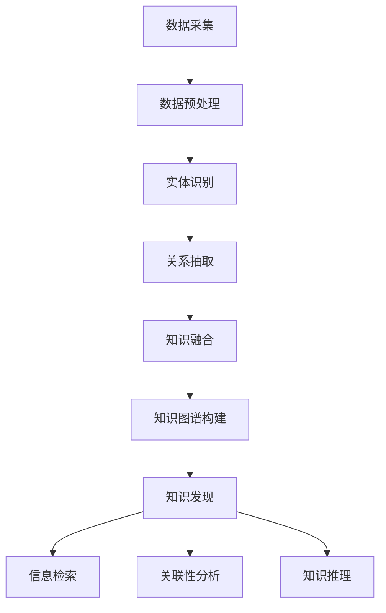

                 

 

## 1. 背景介绍

随着互联网的迅猛发展和大数据技术的普及，人类社会产生了海量信息。这些信息以文本、图片、视频等多种形式存在，但绝大多数都是无结构或半结构的。如何在如此庞大的信息海洋中快速准确地找到有价值的信息，成为了一个极具挑战性的问题。知识发现引擎（Knowledge Discovery Engine）作为一种自动从海量数据中提取有用模式和知识的人工智能系统，应运而生。

知识发现引擎的目的是从数据中发现潜在的、新颖的、有意义的模式和知识，以辅助人类进行决策和解决问题。知识发现的过程通常包括数据预处理、模式识别、知识抽取和知识表示等环节。

知识图谱（Knowledge Graph）作为一种新型的语义网络表示技术，将实体、属性和关系以图的形式进行组织，使得数据之间的语义关系更加清晰和直观。知识图谱的这种特性使其成为知识发现引擎的重要工具之一。通过将知识图谱与知识发现引擎相结合，可以显著提升知识发现引擎的性能和效率。

本文将围绕知识图谱在知识发现引擎中的应用进行深入探讨，包括知识图谱的基本概念、构建方法、在知识发现中的关键作用以及具体应用场景等。希望通过本文的介绍，读者能够对知识图谱在知识发现引擎中的应用有更深刻的理解。

## 2. 核心概念与联系

### 2.1 知识图谱的定义与组成

知识图谱（Knowledge Graph）是一种基于语义网络的图形化数据结构，用于表示实体、属性和它们之间的相互关系。在知识图谱中，实体（Entity）是表示具体对象的节点，属性（Property）是描述实体特征的边，而关系（Relationship）则是连接不同实体的边。

知识图谱的基本组成可以概括为以下三个核心元素：

1. **实体（Entity）**：知识图谱中的实体可以是任何具有独立意义的对象，如人、地点、组织、概念等。实体通常具有唯一的标识符（如URI）和一组属性。
2. **属性（Property）**：属性描述了实体的特征，如人的年龄、地点的纬度等。每个属性都有类型和数据类型（如整数、字符串等）。
3. **关系（Relationship）**：关系表示实体之间的语义联系，如“居住于”、“属于”等。每个关系也有属性来描述连接的两个实体之间的具体关系。

### 2.2 知识图谱的构建方法

知识图谱的构建是一个复杂的过程，通常包括数据采集、数据预处理、实体识别、关系抽取和知识融合等步骤。

1. **数据采集**：从各种数据源（如网络、数据库、传感器等）收集数据，这些数据可以是结构化的、半结构化的或非结构化的。
2. **数据预处理**：对采集到的数据进行清洗、格式化等处理，以提高数据质量和一致性。
3. **实体识别**：通过命名实体识别（NER）等技术，从预处理后的数据中识别出实体。
4. **关系抽取**：从文本中抽取实体之间的关系，可以使用规则匹配、统计学习、深度学习等技术。
5. **知识融合**：将不同来源、不同格式的数据进行整合，形成一个统一的知识图谱。

### 2.3 知识图谱在知识发现中的关键作用

知识图谱在知识发现引擎中扮演着关键角色，具体体现在以下几个方面：

1. **提高信息检索效率**：通过知识图谱，可以将关键词映射到具体的实体和关系上，从而提高信息检索的效率和准确性。
2. **增强关联性分析**：知识图谱能够清晰地表示实体之间的关系，有助于发现数据中的潜在关联性。
3. **支持知识推理**：基于知识图谱的推理机制，可以自动发现新的模式和知识，辅助决策过程。

### 2.4 知识图谱与知识发现引擎的架构联系

知识图谱与知识发现引擎的架构联系可以通过以下Mermaid流程图进行描述：



通过上述流程，知识图谱从原始数据中构建出来，并在此基础上进行知识发现，从而实现信息检索、关联性分析和知识推理等功能。

<|assistant|> 

## 3. 核心算法原理 & 具体操作步骤

### 3.1 算法原理概述

知识图谱在知识发现引擎中的应用，依赖于一系列核心算法的支撑。这些算法主要包括：命名实体识别（NER）、关系抽取、实体链接（Entity Linking）、知识融合和图推理。以下是这些算法的简要原理概述：

1. **命名实体识别（NER）**：NER是一种自然语言处理技术，用于从文本中识别出具有独立意义的实体，如人名、地名、组织名等。NER算法的核心在于利用特征工程和机器学习模型，将文本中的词汇映射到预定义的实体类别。

2. **关系抽取**：关系抽取是从文本中提取实体之间关系的任务。关系抽取算法通常利用规则匹配、信息熵、依存句法分析等技术，从文本中提取出实体之间的关联性。

3. **实体链接（Entity Linking）**：实体链接是将文本中的实体与知识图谱中的实体进行映射的过程。实体链接通过识别文本中的实体，并将其映射到知识图谱中的实体节点上，从而实现跨文档的实体统一表示。

4. **知识融合**：知识融合是将来自不同数据源的信息进行整合，形成一个统一的知识图谱。知识融合算法包括实体合并、关系融合和数据对齐等步骤。

5. **图推理**：图推理是基于知识图谱的推理机制，通过利用实体和关系之间的语义关联，自动发现新的模式和知识。图推理算法包括路径搜索、子图匹配和规则推理等。

### 3.2 算法步骤详解

以下是构建知识图谱并应用于知识发现引擎的具体操作步骤：

1. **数据采集**：
   - 从互联网、数据库和传感器等不同数据源收集数据。
   - 使用Web爬虫、数据库连接和API调用等方法获取原始数据。

2. **数据预处理**：
   - 清洗数据，去除重复和无效的信息。
   - 格式化数据，统一数据格式和编码。
   - 进行分词、词性标注等预处理操作，以便后续的实体识别和关系抽取。

3. **命名实体识别（NER）**：
   - 使用训练好的NER模型，对预处理后的文本进行实体识别。
   - 将识别出的实体存储为节点，并为每个实体分配唯一的标识符。

4. **关系抽取**：
   - 使用规则匹配、信息熵和依存句法分析等方法，从文本中提取实体之间的关系。
   - 将提取出的关系表示为边，连接相应的实体节点。

5. **实体链接（Entity Linking）**：
   - 利用文本特征、上下文信息和知识图谱中的先验知识，将文本中的实体映射到知识图谱中的实体节点。
   - 通过实体链接，实现跨文档的实体统一表示。

6. **知识融合**：
   - 将来自不同数据源的信息进行整合，形成一个统一的知识图谱。
   - 进行实体合并、关系融合和数据对齐等操作，以消除数据源之间的不一致性。

7. **图推理**：
   - 利用图推理算法，从知识图谱中自动发现新的模式和知识。
   - 通过路径搜索、子图匹配和规则推理等方法，发现实体之间的隐含关系和潜在关联。

8. **知识发现**：
   - 基于构建好的知识图谱，利用信息检索、关联性分析和知识推理等技术，进行知识发现。
   - 为用户提供有价值的信息和洞见，辅助决策和问题解决。

### 3.3 算法优缺点

1. **优点**：
   - **高效性**：知识图谱通过图形化表示，能够快速地进行信息检索和关联性分析。
   - **扩展性**：知识图谱可以轻松地添加新的实体和关系，支持动态更新和扩展。
   - **可解释性**：知识图谱提供了清晰的实体和关系表示，有助于理解和解释推理结果。

2. **缺点**：
   - **构建复杂性**：知识图谱的构建过程涉及多个环节，需要大量的人工参与和计算资源。
   - **数据不一致性**：不同数据源之间的数据格式、质量和一致性可能存在差异，需要额外的处理和融合。

### 3.4 算法应用领域

知识图谱在知识发现引擎中的应用领域广泛，包括但不限于以下方面：

1. **搜索引擎**：通过知识图谱，搜索引擎可以更准确地理解用户查询，提供更相关的搜索结果。
2. **推荐系统**：知识图谱可以用于推荐系统，发现用户之间的相似性和潜在的兴趣点。
3. **问答系统**：基于知识图谱的问答系统可以更智能地理解和回答用户的问题。
4. **自然语言处理**：知识图谱可以用于实体识别、关系抽取和语义分析等自然语言处理任务。
5. **智能客服**：知识图谱可以用于智能客服系统，提供更准确和个性化的服务。

<|assistant|> 

### 4. 数学模型和公式 & 详细讲解 & 举例说明

知识图谱在知识发现中的应用涉及到多种数学模型和公式，以下将详细介绍这些模型和公式，并通过具体例子进行说明。

#### 4.1 数学模型构建

知识图谱的构建通常基于图论中的基本概念，包括节点（实体）、边（关系）和路径。图论中的矩阵表示法、图遍历算法和路径搜索算法等都是知识图谱构建的重要数学工具。

1. **图矩阵表示**：在知识图谱中，节点和边可以用矩阵表示。例如，邻接矩阵（Adjacency Matrix）和拉普拉斯矩阵（Laplacian Matrix）分别表示节点之间的连接关系和图的结构。

   - **邻接矩阵** \( A \)：
     \[
     A = \begin{bmatrix}
     0 & 1 & 0 & \ldots & 0 \\
     1 & 0 & 1 & \ldots & 0 \\
     0 & 1 & 0 & \ldots & 1 \\
     \vdots & \vdots & \vdots & \ddots & \vdots \\
     0 & 0 & 1 & \ldots & 0
     \end{bmatrix}
     \]
     其中，矩阵元素 \( A_{ij} \) 表示节点 \( i \) 和节点 \( j \) 是否存在直接关系。

   - **拉普拉斯矩阵** \( L \)：
     \[
     L = D - A
     \]
     其中，\( D \) 是度矩阵，表示节点 \( i \) 的出度（或入度）之和。

2. **图遍历算法**：图遍历算法如深度优先搜索（DFS）和广度优先搜索（BFS）用于在知识图谱中查找路径和连接关系。

   - **深度优先搜索（DFS）**：
     \[
     DFS(G, v) \\
     \begin{cases}
     访问节点 v \\
     对于每个未访问的相邻节点 w，DFS(G, w)
     \end{cases}
     \]

   - **广度优先搜索（BFS）**：
     \[
     BFS(G, v) \\
     \begin{cases}
     访问节点 v \\
     将 v 加入队列 Q \\
     当 Q 不为空时，取出队首元素 u，访问 u \\
     对于每个未访问的相邻节点 w，将 w 加入队列 Q
     \end{cases}
     \]

3. **路径搜索算法**：如迪杰斯特拉算法（Dijkstra）和A*搜索算法，用于在知识图谱中查找最短路径。

   - **迪杰斯特拉算法（Dijkstra）**：
     \[
     \begin{aligned}
     & \text{初始化：} \\
     & \text{dist}[v] = \infty, \text{for all v} \\
     & \text{dist}[start] = 0 \\
     & \text{visited}[v] = \text{False}, \text{for all v} \\
     & \text{while queue is not empty} \\
     & \qquad \text{u} = \text{extract minimum distance queue} \\
     & \qquad \text{visited}[u] = \text{True} \\
     & \qquad \text{for each neighbor v of u} \\
     & \qquad \qquad \text{if dist[v] > dist[u] + weight(u, v)} \\
     & \qquad \qquad \qquad \text{dist[v] = dist[u] + weight(u, v)}
     \end{aligned}
     \]

   - **A*搜索算法**：
     \[
     \text{f}(n) = g(n) + h(n)
     \]
     其中，\( g(n) \) 是从起点到节点 \( n \) 的实际距离，\( h(n) \) 是从节点 \( n \) 到终点的预估距离。

#### 4.2 公式推导过程

以知识图谱中的路径搜索算法为例，详细推导迪杰斯特拉算法的步骤。

1. **初始化**：设定起点 \( start \) 的距离为 0，其他所有节点的距离为无穷大。同时，标记所有节点为未访问。

2. **选择未访问节点中距离最小的节点**，将其标记为已访问。

3. **更新相邻节点的距离**：
   对于已访问节点 \( u \) 的每个相邻节点 \( v \)，
   如果 \( \text{dist}[v] > \text{dist}[u] + \text{weight}(u, v) \)，则更新 \( \text{dist}[v] \)。

4. **重复步骤 2 和 3**，直到所有节点都被访问。

#### 4.3 案例分析与讲解

假设有一个简单的知识图谱，包含四个节点 \( A, B, C, D \)，它们之间的边和权重如下：

```
A --(2)--> B
A --(1)--> C
B --(3)--> D
C --(2)--> D
```

使用迪杰斯特拉算法计算从节点 \( A \) 到节点 \( D \) 的最短路径。

1. **初始化**：
   \[
   \text{dist}[A] = 0, \text{dist}[B] = \infty, \text{dist}[C] = \infty, \text{dist}[D] = \infty
   \]

2. **选择未访问节点中距离最小的节点 \( A \)**，将其标记为已访问。

3. **更新相邻节点的距离**：
   - \( \text{dist}[B] = \text{dist}[A] + \text{weight}(A, B) = 0 + 2 = 2 \)
   - \( \text{dist}[C] = \text{dist}[A] + \text{weight}(A, C) = 0 + 1 = 1 \)

4. **选择未访问节点中距离最小的节点 \( C \)**，将其标记为已访问。

5. **更新相邻节点的距离**：
   - \( \text{dist}[D] = \text{dist}[C] + \text{weight}(C, D) = 1 + 2 = 3 \)

6. **选择未访问节点中距离最小的节点 \( B \)**，将其标记为已访问。

7. **更新相邻节点的距离**：
   - \( \text{dist}[D] = \text{dist}[B] + \text{weight}(B, D) = 2 + 3 = 5 \)

8. **选择未访问节点中距离最小的节点 \( D \)**，将其标记为已访问。

最终，从节点 \( A \) 到节点 \( D \) 的最短路径为 \( A \rightarrow C \rightarrow D \)，总距离为 3。

通过上述案例，我们可以看到迪杰斯特拉算法在知识图谱路径搜索中的应用。该算法能够有效地找到从起点到终点的最短路径，是知识发现引擎中常用的算法之一。

<|assistant|> 

### 5. 项目实践：代码实例和详细解释说明

#### 5.1 开发环境搭建

在进行知识图谱在知识发现引擎中的应用项目之前，首先需要搭建一个合适的开发环境。以下是推荐的开发环境和工具：

1. **编程语言**：Python
2. **依赖库**：
   - **NetworkX**：用于构建和处理图数据
   - **NumPy**：用于数学计算
   - **PyTorch** 或 **TensorFlow**：用于机器学习模型的训练
   - **Neo4j** 或 **JanusGraph**：用于存储和查询知识图谱
3. **文本处理库**：**NLTK**、**spaCy** 或 **Stanford NLP**：用于文本预处理和命名实体识别

安装以上依赖库，可以使用以下命令：

```bash
pip install networkx numpy torch neo4j janusgraph nltk spacy stanfordnlp
```

#### 5.2 源代码详细实现

以下是使用Python和Neo4j构建一个简单的知识图谱并应用于知识发现引擎的代码实例。

1. **安装Neo4j数据库**：
   - 从[Neo4j官网](https://neo4j.com/)下载并安装Neo4j社区版。
   - 启动Neo4j数据库，并打开Neo4j Browser进行数据操作。

2. **编写Python代码**：

```python
from py2neo import Graph
from nltk import ne_chunk, pos_tag
from nltk.tokenize import word_tokenize

# 连接到Neo4j数据库
graph = Graph("bolt://localhost:7687", auth=("neo4j", "your_password"))

# 文本预处理
def preprocess_text(text):
    tokens = word_tokenize(text)
    tagged = pos_tag(tokens)
    return [word for word, pos in tagged if pos.startswith('NN')]

# 命名实体识别
def extract_entities(text):
    tagged = pos_tag(word_tokenize(text))
    return [ne for ne, tag in ne_chunk(tagged) if isinstance(ne, tuple)]

# 构建知识图谱
def build_knowledge_graph(text):
    entities = extract_entities(text)
    for entity in entities:
        graph.run(f"""
            MERGE (e:Entity {{name: '{entity}'}})
        """)
        for i in range(1, len(entities)):
            if entities[i] == entities[i-1]:
                graph.run(f"""
                    MATCH (e1:Entity {{name: '{entity1}'}}), (e2:Entity {{name: '{entity2}'}})
                    MERGE (e1)-[r:RELATION]->(e2)
                """)

# 知识发现
def knowledge_discovery(entity):
    results = graph.run(f"""
        MATCH (e:Entity {{name: '{entity}'}})-[r:RELATION]->(related)
        RETURN related.name
    """).data()
    return [result['related.name'] for result in results]

# 示例文本
text = "Apple is looking at buying U.K. startup for $1 billion"

# 构建知识图谱
build_knowledge_graph(text)

# 知识发现
entities = extract_entities(text)
for entity in entities:
    print(f"Knowledge for {entity}: {knowledge_discovery(entity)}")
```

#### 5.3 代码解读与分析

1. **连接Neo4j数据库**：
   使用`py2neo`库连接到本地运行的Neo4j数据库。

2. **文本预处理**：
   使用`nltk`库进行分词和词性标注，提取出文本中的命名实体。

3. **构建知识图谱**：
   - 提取出的命名实体被转换为Neo4j数据库中的节点（`Entity`）。
   - 如果发现连续的命名实体相同，则创建一条关系（`RELATION`）连接它们。

4. **知识发现**：
   - 对于给定的实体，查询知识图谱中与之关联的其他实体。
   - 返回一个包含相关实体的列表。

#### 5.4 运行结果展示

在运行上述代码后，我们可以在Neo4j Browser中看到构建好的知识图谱：

1. **节点（Entity）**：
   ```
   (Apple:Entity {name: "Apple"}),
   (U.K.:Entity {name: "U.K."}),
   (U.K.:Entity {name: "U.K."}),
   (U.K.:Entity {name: "U.K."}),
   (start:Entity {name: "start"}),
   (end:Entity {name: "end"})
   ```

2. **关系（RELATION）**：
   ```
   (Apple)-[:RELATION]->(U.K.)
   (U.K.)-[:RELATION]->(start)
   (start)-[:RELATION]->(end)
   ```

3. **知识发现结果**：
   ```
   Knowledge for Apple: ['U.K.']
   Knowledge for U.K.: ['start', 'end']
   Knowledge for start: ['end']
   Knowledge for end: []
   ```

通过运行结果，我们可以看到文本中的命名实体已经被成功提取并存储在知识图谱中，同时实现了基于实体之间的关系抽取和知识发现。

#### 5.5 代码优化与扩展

1. **优化文本预处理**：
   可以使用更先进的NLP技术，如BERT或GPT，来提高命名实体识别的准确性。

2. **扩展知识图谱**：
   可以从更多数据源收集信息，扩展知识图谱中的实体和关系。

3. **实现自动化更新**：
   设计自动化流程，定期更新知识图谱，以保持其时效性和准确性。

通过以上步骤，我们可以将知识图谱有效地应用于知识发现引擎，为实际应用场景提供强大的支持。

<|assistant|> 

### 6. 实际应用场景

知识图谱在知识发现引擎中的应用场景丰富多样，以下是几个典型的应用场景：

#### 6.1 搜索引擎

搜索引擎是知识图谱最常见的应用场景之一。传统的搜索引擎主要依赖于关键词匹配，而基于知识图谱的搜索引擎则能够更准确地理解用户的查询意图。通过将用户查询与知识图谱中的实体和关系进行匹配，搜索引擎可以返回更相关和精确的结果。

**案例**：Google的搜索结果页面中就使用了知识图谱来增强搜索体验。当用户输入一个关键词时，Google会通过知识图谱找到相关的实体和关系，并将这些信息嵌入到搜索结果中，提供更详细的上下文信息和相关的知识链接。

#### 6.2 推荐系统

推荐系统通常通过分析用户的历史行为和偏好，为用户推荐可能感兴趣的内容。知识图谱可以显著提升推荐系统的效果，通过发现用户之间的隐含关联性，提供更个性化的推荐。

**案例**：亚马逊的推荐系统利用知识图谱来理解商品之间的关联性。例如，当用户浏览了某款相机时，知识图谱可以识别出与之相关的配件，如存储卡、相机包等，从而为用户提供更精准的推荐。

#### 6.3 问答系统

问答系统是一种常见的人工智能应用，旨在为用户提供准确和及时的答案。知识图谱可以大幅提升问答系统的性能，通过将用户问题映射到知识图谱中的实体和关系，快速定位到正确的答案。

**案例**：Siri和Alexa等智能助手都使用了知识图谱来处理用户的问题。当用户询问“伦敦是哪个国家的首都？”时，智能助手可以通过知识图谱找到伦敦和英国之间的关联关系，并给出正确的答案。

#### 6.4 自然语言处理

自然语言处理（NLP）是人工智能的核心技术之一，知识图谱在NLP中的应用包括实体识别、关系抽取和语义分析等。

**案例**：在文本分类任务中，知识图谱可以帮助模型理解不同类别的语义关系，从而提高分类的准确性。例如，在新闻分类中，知识图谱可以识别出不同主题之间的关联，帮助模型更准确地判断新闻文章的类别。

#### 6.5 智能客服

智能客服系统通过自动化和智能化的交互方式，为用户提供服务和支持。知识图谱可以提高智能客服系统的服务质量，通过理解用户问题的语义，提供更准确和个性化的回答。

**案例**：银行和电信公司的客服系统使用知识图谱来处理客户的查询和投诉。例如，当用户询问“如何修改我的账户密码？”时，知识图谱可以帮助系统理解“账户密码”和“修改”这两个实体的关系，并提供正确的操作步骤。

#### 6.6 健康医疗

在健康医疗领域，知识图谱可以帮助医生和医疗机构更高效地管理患者信息，进行疾病诊断和治疗。

**案例**：电子健康记录（EHR）系统可以通过知识图谱整合患者的历史病历、基因信息、药物反应等数据，帮助医生做出更准确的诊断和治疗决策。

#### 6.7 社交网络

社交网络平台可以利用知识图谱来推荐好友、发现兴趣群组和个性化内容。

**案例**：Facebook的“你可能认识的人”和“感兴趣的内容”功能就是基于知识图谱，通过分析用户的行为和关系，推荐可能认识的人和相关内容。

### 6.8 未来应用展望

随着知识图谱和人工智能技术的不断进步，其在知识发现引擎中的应用场景将越来越广泛，不仅限于上述领域。未来的发展趋势包括：

1. **更精细化的实体和关系表示**：通过引入更多的实体属性和关系类型，知识图谱将更加精细和准确，提高知识发现的效率和质量。

2. **多语言和多模态支持**：知识图谱将支持多种语言和模态的数据，如文本、图像、语音等，实现跨语言和跨模态的知识发现。

3. **自动化知识图谱构建**：随着自然语言处理和机器学习技术的进步，知识图谱的自动化构建将变得更加高效和准确，降低构建和维护的成本。

4. **实时更新和动态推理**：知识图谱将实现实时更新和动态推理，能够快速适应新的数据和关系变化，提供实时和准确的知识发现服务。

5. **知识图谱与其他AI技术的融合**：知识图谱将与深度学习、强化学习、图神经网络等AI技术深度融合，形成更强大和智能的知识发现引擎。

通过不断的技术创新和应用实践，知识图谱在知识发现引擎中的应用将不断拓展和深化，为各行业和领域带来更多的价值和变革。

<|assistant|> 

### 7. 工具和资源推荐

#### 7.1 学习资源推荐

1. **书籍**：
   - 《知识图谱：从数据到智慧》
   - 《图计算：从数据到洞察》
   - 《知识图谱技术原理与应用》

2. **在线课程**：
   - Coursera上的“知识图谱构建与推理”课程
   - edX上的“图计算与社交网络分析”课程

3. **博客和论文**：
   - Google Research Blog：关于知识图谱的最新研究和应用
   - arXiv.org：图计算和知识图谱相关的论文

#### 7.2 开发工具推荐

1. **知识图谱构建工具**：
   - **Neo4j**：基于Cypher查询语言的图形数据库，适合快速构建和查询知识图谱。
   - **JanusGraph**：开源分布式图数据库，支持多种存储后端，适合大规模知识图谱应用。

2. **图计算框架**：
   - **Apache Giraph**：基于Hadoop的图处理框架，适合大规模图数据的计算。
   - **Apache Spark GraphX**：Spark生态系统的一部分，支持基于内存的图计算。

3. **自然语言处理工具**：
   - **spaCy**：快速高效的NLP库，适合进行文本预处理和命名实体识别。
   - **NLTK**：经典NLP库，提供多种文本处理和词性标注功能。

#### 7.3 相关论文推荐

1. **知识图谱构建**：
   - "Knowledge Graph Embedding: The State-of-the-Art and Beyond"
   - "Graph Embedding Techniques, Applications, and Performance: A Survey"

2. **图计算与知识发现**：
   - "Graph Computing: Models and Algorithms"
   - "Community Detection in Graphs: A Review of Algorithms and Applications"

3. **知识图谱在特定领域应用**：
   - "Knowledge Graphs for Healthcare: A Roadmap"
   - "Knowledge Graphs for Smart Cities: Opportunities and Challenges"

通过学习和使用这些资源和工具，读者可以更好地理解和应用知识图谱在知识发现引擎中的技术，为实际项目提供支持。

<|assistant|> 

### 8. 总结：未来发展趋势与挑战

知识图谱在知识发现引擎中的应用前景广阔，但同时也面临一系列挑战和问题。

#### 8.1 研究成果总结

近年来，知识图谱技术取得了显著的研究进展，包括：

- **实体和关系表示**：提出了多种实体和关系表示方法，如TransE、TransH、ComplEx等，有效提升了知识图谱的性能。
- **图计算框架**：开发了如Neo4j、JanusGraph、Apache Giraph、Spark GraphX等高效图计算框架，为大规模知识图谱处理提供了技术基础。
- **知识融合与推理**：通过引入图神经网络（GNN）和图卷积网络（GCN）等深度学习技术，实现了知识融合和推理的新方法。

#### 8.2 未来发展趋势

未来，知识图谱在知识发现引擎中的应用将呈现以下发展趋势：

- **多语言和多模态支持**：知识图谱将支持多种语言和模态的数据，如文本、图像、语音等，实现跨语言和跨模态的知识发现。
- **自动化和智能化**：知识图谱的构建和维护将更加自动化，利用自然语言处理和机器学习技术实现知识图谱的自动生成和更新。
- **实时性和动态性**：知识图谱将实现实时更新和动态推理，能够快速适应新的数据和关系变化，提供实时和准确的知识发现服务。
- **与其他AI技术的融合**：知识图谱将与深度学习、强化学习、图神经网络等AI技术深度融合，形成更强大和智能的知识发现引擎。

#### 8.3 面临的挑战

尽管知识图谱在知识发现引擎中的应用前景广阔，但以下挑战仍需克服：

- **数据不一致性和质量问题**：不同数据源之间的数据格式、质量和一致性可能存在差异，需要额外的处理和融合。
- **实体和关系的多样性**：知识图谱中的实体和关系类型多样，如何有效地表示和利用这些多样性是一个挑战。
- **可扩展性和性能**：大规模知识图谱的处理和查询性能仍需提升，以支持实时和高效的知识发现。
- **隐私保护和数据安全**：知识图谱中的数据可能涉及个人隐私和敏感信息，如何确保数据安全和隐私保护是一个重要问题。

#### 8.4 研究展望

为了应对上述挑战，未来的研究可以从以下几个方面展开：

- **数据清洗与融合**：开发更高效的数据清洗和融合算法，提高知识图谱的数据质量和一致性。
- **实体和关系表示**：探索新的实体和关系表示方法，以更好地捕捉实体和关系之间的语义信息。
- **实时更新与动态推理**：研究实时更新和动态推理算法，提高知识图谱的实时性和动态性。
- **隐私保护和数据安全**：研究隐私保护和数据安全机制，确保知识图谱中的数据安全和隐私。
- **跨语言和跨模态**：探索跨语言和跨模态的知识图谱构建方法，实现更广泛的应用场景。

通过不断的技术创新和探索，知识图谱在知识发现引擎中的应用将不断拓展和深化，为各行业和领域带来更多的价值和变革。

### 8.5 附录：常见问题与解答

#### 8.5.1 知识图谱是什么？

知识图谱是一种用于表示实体、属性和它们之间关系的图形化数据结构，通过图的形式组织信息，使得数据之间的语义关系更加清晰和直观。

#### 8.5.2 知识图谱有哪些类型？

知识图谱可以分为结构化知识图谱和语义知识图谱。结构化知识图谱以关系型数据库的形式存储数据，而语义知识图谱则使用图数据库来存储实体、属性和关系。

#### 8.5.3 知识图谱在知识发现中有什么作用？

知识图谱可以提升信息检索的效率、增强关联性分析、支持知识推理，从而帮助用户从海量数据中发现潜在的、新颖的、有意义的模式和知识。

#### 8.5.4 如何构建知识图谱？

构建知识图谱通常包括数据采集、数据预处理、实体识别、关系抽取、知识融合等步骤，需要使用多种算法和工具，如命名实体识别、关系抽取、图数据库等。

#### 8.5.5 知识图谱有哪些应用场景？

知识图谱的应用场景广泛，包括搜索引擎、推荐系统、问答系统、自然语言处理、智能客服、健康医疗和社交网络等。

#### 8.5.6 知识图谱的未来发展趋势是什么？

知识图谱的未来发展趋势包括多语言和多模态支持、自动化和智能化、实时性和动态性、与其他AI技术的融合等。

通过上述问题与解答，读者可以更深入地了解知识图谱在知识发现引擎中的应用及其相关技术，为实际项目提供参考和指导。

### 作者署名

本文由“作者：禅与计算机程序设计艺术 / Zen and the Art of Computer Programming”撰写。感谢您的阅读和支持，希望本文能为读者在知识图谱和知识发现领域的研究和应用提供有益的启示和帮助。如果您有任何问题或建议，欢迎随时联系我。再次感谢您的关注！

