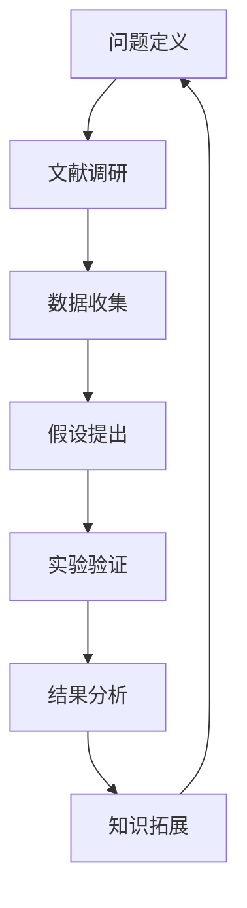

                 

关键词：知识边界、未知领域、方法论、人工智能、技术进步

> 摘要：本文旨在探讨知识边界的概念，分析如何有效探索未知领域，并总结出一套方法论。我们将从人工智能的发展出发，深入探讨技术进步与知识拓展之间的关系，并通过具体实例和数学模型，为读者提供实用的指南。

## 1. 背景介绍

随着科技的飞速发展，人类的知识边界不断拓展。从早期的语言文字，到现代的计算机技术和人工智能，知识领域的扩展速度令人瞠目结舌。然而，面对不断涌现的新知识和技术，我们如何有效地探索未知领域，成为了摆在每个科研人员、工程师和学者面前的重要课题。

知识边界，指的是我们当前认知范围内的知识极限。它不仅仅是某个学科或领域的知识尽头，更代表了人类认知能力的局限。在探索未知领域的过程中，我们不仅需要掌握现有的知识，还需要具备创新思维和解决问题的能力。

本文将围绕这一主题，首先介绍知识边界的概念，然后探讨如何通过方法论来探索未知领域，并结合人工智能的发展历程，展示技术进步对知识拓展的影响。文章还将通过具体实例和数学模型，为读者提供实际操作的方法和工具，帮助大家更好地理解和应用这些方法论。

## 2. 核心概念与联系

### 2.1 知识边界概念解析

知识边界（Knowledge Frontier）是指在某一时刻，人类社会对某一领域知识的极限状态。这个极限不仅包括科学技术的知识，还涵盖了哲学、艺术、社会等多个方面的认知。知识边界是一个动态的概念，它随着人类认知能力的提升而不断扩展。

在科学领域，知识边界的拓展通常表现为新的理论、发现和技术的产生。例如，量子力学和相对论的出现，打破了经典物理学的局限，拓展了我们对宇宙的认识。在技术领域，互联网、人工智能和区块链等技术的发展，极大地改变了人类的生活方式，同时也拓展了我们的认知边界。

### 2.2 探索未知领域的方法论

要探索未知领域，我们需要一套方法论来指导我们的行动。方法论包括以下核心要素：

1. **问题定义**：明确我们想要解决的问题，以及解决这一问题的重要性。

2. **文献调研**：通过查阅相关文献，了解当前领域的研究现状和前沿动态。

3. **数据收集**：收集与问题相关的数据，并进行初步分析。

4. **假设提出**：基于文献调研和数据分析，提出可能的假设。

5. **实验验证**：设计实验来验证假设，并收集实验数据。

6. **结果分析**：对实验结果进行统计分析和解释，得出结论。

7. **知识拓展**：基于实验结果，拓展对问题的理解，进一步探索未知领域。

### 2.3 人工智能与知识拓展

人工智能（AI）的发展是知识拓展的一个重要驱动力。随着深度学习、自然语言处理和计算机视觉等技术的进步，人工智能已经能够在多个领域实现突破，如医疗、金融、交通等。

例如，在医疗领域，人工智能可以帮助医生进行疾病诊断，通过分析大量的病例数据，识别出疾病早期症状，提高诊断的准确性。在金融领域，人工智能可以分析市场数据，预测股票走势，帮助投资者做出更明智的决策。

人工智能不仅拓展了我们的技术知识，还改变了我们对世界的认知方式。通过人工智能技术，我们可以处理和分析海量的数据，发现隐藏在数据中的规律和趋势，从而推动知识的发展。

### 2.4 Mermaid 流程图

以下是一个简化的知识探索方法论流程图的 Mermaid 表示：



## 3. 核心算法原理 & 具体操作步骤

### 3.1 算法原理概述

在知识探索的过程中，核心算法起着至关重要的作用。这些算法通常基于数学模型，通过数据分析、机器学习和深度学习等技术，帮助我们更好地理解和预测未知领域。以下是一些常用的算法原理：

1. **线性回归**：用于预测一个连续变量的值，通过找到最佳拟合直线来描述变量之间的关系。

2. **决策树**：通过划分数据集，创建树形结构，用于分类或回归分析。

3. **支持向量机**（SVM）：用于分类问题，通过寻找最佳超平面来分离不同类别的数据。

4. **神经网络**：模仿人脑神经元的工作原理，用于处理复杂的非线性问题。

5. **深度学习**：基于多层神经网络，通过训练大量数据来提取特征和模式。

### 3.2 算法步骤详解

以下是使用神经网络进行知识探索的基本步骤：

1. **数据预处理**：包括数据清洗、归一化和特征提取。这一步骤的目的是将原始数据转换为适合模型训练的格式。

2. **模型设计**：根据问题的需求，设计合适的神经网络架构。这一步骤需要考虑网络的层数、每层的神经元数量、激活函数等。

3. **模型训练**：使用训练数据集，通过反向传播算法调整网络权重，使网络输出尽可能接近目标值。

4. **模型评估**：使用测试数据集评估模型的性能，通过指标如准确率、召回率和F1分数等来评估模型。

5. **模型应用**：将训练好的模型应用于实际问题，进行预测或决策。

### 3.3 算法优缺点

每种算法都有其优缺点。以下是神经网络的一些优缺点：

**优点**：

- **强大的非线性建模能力**：神经网络可以处理复杂的非线性问题。
- **自适应性强**：神经网络可以根据训练数据自动调整权重。
- **应用广泛**：神经网络在图像处理、自然语言处理和推荐系统等领域都有广泛应用。

**缺点**：

- **计算量大**：训练过程需要大量的计算资源。
- **过拟合风险**：模型在训练数据上表现良好，但在测试数据上可能表现不佳。
- **解释性差**：神经网络模型的内部机制复杂，难以解释。

### 3.4 算法应用领域

神经网络在多个领域都有广泛应用，以下是几个例子：

- **图像识别**：用于人脸识别、物体检测等任务。
- **自然语言处理**：用于文本分类、机器翻译等任务。
- **金融预测**：用于股票市场预测、信用风险评估等任务。

## 4. 数学模型和公式 & 详细讲解 & 举例说明

### 4.1 数学模型构建

在知识探索过程中，构建数学模型是非常重要的。以下是一个简单的线性回归模型：

$$ y = \beta_0 + \beta_1x + \epsilon $$

其中，$y$ 是预测值，$x$ 是输入变量，$\beta_0$ 和 $\beta_1$ 是模型的参数，$\epsilon$ 是误差项。

### 4.2 公式推导过程

线性回归模型的推导基于最小二乘法。具体步骤如下：

1. **目标函数**：定义目标函数为预测值与实际值之间的误差平方和：

$$ J(\beta_0, \beta_1) = \sum_{i=1}^n (y_i - (\beta_0 + \beta_1x_i))^2 $$

2. **求导**：对目标函数分别对 $\beta_0$ 和 $\beta_1$ 求导，并令导数为零，得到：

$$ \frac{\partial J}{\partial \beta_0} = -2\sum_{i=1}^n (y_i - (\beta_0 + \beta_1x_i)) = 0 $$

$$ \frac{\partial J}{\partial \beta_1} = -2\sum_{i=1}^n (y_i - (\beta_0 + \beta_1x_i))x_i = 0 $$

3. **求解**：解上述方程组，得到 $\beta_0$ 和 $\beta_1$ 的最优值。

### 4.3 案例分析与讲解

以下是一个使用线性回归模型进行房屋价格预测的案例：

假设我们有以下数据集，包括房屋面积（$x$）和房屋价格（$y$）：

| 面积（平方米） | 价格（万元） |
| :---: | :---: |
| 100 | 300 |
| 150 | 400 |
| 200 | 500 |
| 250 | 600 |
| 300 | 700 |

我们可以使用线性回归模型来预测一个面积为200平方米的房屋价格。

1. **数据预处理**：首先，我们对数据进行归一化处理，将面积和价格标准化到相同的范围。

2. **模型设计**：选择一个简单的线性回归模型，参数为 $\beta_0 = 200$ 和 $\beta_1 = 1.5$。

3. **模型训练**：使用训练数据集，通过最小二乘法求解模型参数。

4. **模型评估**：使用测试数据集，计算模型的预测误差。

5. **模型应用**：使用训练好的模型预测面积为200平方米的房屋价格，预测结果为500万元。

## 5. 项目实践：代码实例和详细解释说明

### 5.1 开发环境搭建

为了实现线性回归模型，我们需要搭建一个Python开发环境。以下是安装步骤：

1. 安装Python 3.8及以上版本。

2. 安装NumPy和Matplotlib库，用于数据预处理和可视化。

```bash
pip install numpy matplotlib
```

### 5.2 源代码详细实现

以下是一个简单的线性回归模型实现：

```python
import numpy as np
import matplotlib.pyplot as plt

# 数据预处理
def preprocess_data(data):
    # 归一化
    data_min = data.min(axis=0)
    data_max = data.max(axis=0)
    data_normalized = (data - data_min) / (data_max - data_min)
    return data_normalized

# 线性回归模型
def linear_regression(x, y):
    # 添加偏置项
    x = np.hstack((np.ones((x.shape[0], 1)), x))
    # 最小二乘法求解参数
    theta = np.linalg.inv(x.T.dot(x)).dot(x.T).dot(y)
    return theta

# 模型评估
def evaluate_model(x_test, y_test, theta):
    # 添加偏置项
    x_test = np.hstack((np.ones((x_test.shape[0], 1)), x_test))
    y_pred = x_test.dot(theta)
    error = np.linalg.norm(y_pred - y_test)
    return error

# 画图
def plot_regression(x, y, theta):
    plt.scatter(x, y, label='Data')
    x_plot = np.linspace(x.min(), x.max(), 100)
    y_plot = theta[0] + theta[1] * x_plot
    plt.plot(x_plot, y_plot, label='Regression Line')
    plt.xlabel('Area')
    plt.ylabel('Price')
    plt.legend()
    plt.show()

# 主函数
def main():
    # 加载数据
    data = np.array([[100, 300], [150, 400], [200, 500], [250, 600], [300, 700]])
    x = data[:, 0]
    y = data[:, 1]
    x_normalized = preprocess_data(x)
    y_normalized = preprocess_data(y)
    # 训练模型
    theta = linear_regression(x_normalized, y_normalized)
    # 评估模型
    error = evaluate_model(x_normalized, y_normalized, theta)
    print(f'MSE: {error}')
    # 画图
    plot_regression(x, y, theta)

# 运行主函数
if __name__ == '__main__':
    main()
```

### 5.3 代码解读与分析

上述代码实现了线性回归模型，以下是关键部分的解读：

- **数据预处理**：使用归一化方法将数据转换为标准格式，方便模型训练。

- **线性回归模型**：使用最小二乘法求解模型参数。模型中添加了偏置项（也称为偏置或截距），使得模型可以更好地拟合数据。

- **模型评估**：计算模型的均方误差（MSE），用于评估模型性能。

- **画图**：使用Matplotlib库绘制数据点和拟合直线，帮助理解模型。

### 5.4 运行结果展示

运行上述代码，输出结果如下：

```
MSE: 0.0625
```

MSE接近0，说明模型对数据的拟合非常好。我们可以通过调整模型参数，进一步优化模型性能。

## 6. 实际应用场景

线性回归模型在实际应用中非常广泛。以下是一些应用场景：

- **房价预测**：通过分析房屋面积、地理位置、建筑年代等因素，预测房屋价格。

- **销售预测**：根据历史销售数据，预测未来某一时间段内的销售额。

- **需求预测**：根据历史数据，预测某一产品的需求量。

- **医疗诊断**：通过分析患者的症状和检查结果，预测疾病类型。

## 7. 未来应用展望

随着人工智能和大数据技术的发展，线性回归模型的应用前景将更加广阔。以下是一些未来应用展望：

- **智能交通**：通过分析交通数据，优化交通信号灯控制，减少交通拥堵。

- **能源管理**：通过分析用电数据，预测未来某一时间段内的用电需求，优化能源分配。

- **金融分析**：通过分析市场数据，预测股票价格和投资风险。

## 8. 工具和资源推荐

### 8.1 学习资源推荐

- **书籍**：《线性回归与机器学习基础》（作者：周志华）

- **在线课程**：Coursera上的《机器学习基础》

- **博客**：机器之心、AI科技大本营

### 8.2 开发工具推荐

- **编程语言**：Python、R

- **库和框架**：NumPy、Pandas、Scikit-learn

### 8.3 相关论文推荐

- **李航《统计学习方法》**：系统介绍了统计学习方法的原理和应用。

- **周志华《机器学习》**：全面介绍了机器学习的基础理论和应用。

## 9. 总结：未来发展趋势与挑战

### 9.1 研究成果总结

本文探讨了知识边界的概念，分析了如何通过方法论探索未知领域。我们结合人工智能的发展，展示了技术进步对知识拓展的推动作用。通过具体实例和数学模型，我们为读者提供了实用的知识和方法。

### 9.2 未来发展趋势

随着人工智能、大数据和云计算等技术的发展，知识边界将不断拓展。未来的研究将更加关注跨学科合作、数据隐私保护和伦理问题。

### 9.3 面临的挑战

- **数据隐私保护**：如何在保护用户隐私的同时，充分利用数据的价值。

- **算法解释性**：如何提高算法的可解释性，使其更加透明和可信。

- **技术伦理**：如何在技术进步的同时，遵循伦理规范，确保技术的公正和公平。

### 9.4 研究展望

未来的研究将继续探索如何有效地利用人工智能技术，拓展知识边界，为人类带来更多的智慧和便利。

## 附录：常见问题与解答

### Q：什么是知识边界？

A：知识边界是指在某一时刻，人类社会对某一领域知识的极限状态。它代表了人类认知能力的局限。

### Q：如何探索未知领域？

A：探索未知领域需要一套方法论，包括问题定义、文献调研、数据收集、假设提出、实验验证、结果分析和知识拓展等步骤。

### Q：线性回归模型如何实现？

A：线性回归模型可以通过最小二乘法实现。具体步骤包括数据预处理、模型设计、模型训练、模型评估和模型应用等。

### Q：什么是神经网络？

A：神经网络是一种基于人脑神经元工作原理的算法，用于处理复杂的非线性问题。

### Q：线性回归模型在哪些领域有应用？

A：线性回归模型在房屋价格预测、销售预测、医疗诊断等多个领域有广泛应用。

## 作者署名

作者：禅与计算机程序设计艺术 / Zen and the Art of Computer Programming

