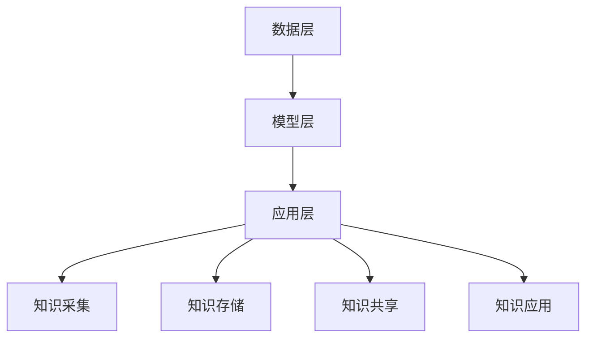

                 

关键词：知识管理、知识积累、知识图谱、人工智能、算法原理、数学模型、代码实例、应用场景、未来展望

> 摘要：本文将深入探讨知识管理系统的构建与应用，旨在揭示知识积累的内在机制与实现方法。通过阐述知识图谱的理论基础、核心算法原理以及具体实施步骤，本文将帮助读者理解如何构建一个高效的知识管理系统，并展示其在各个领域的实际应用和未来发展方向。

## 1. 背景介绍

在信息爆炸的时代，知识已成为推动社会进步和经济发展的关键因素。然而，如何有效地管理和利用这些知识，成为了企业和组织面临的重大挑战。知识管理系统（Knowledge Management System，KMS）作为一种新型的信息管理系统，旨在通过集成化的方法对知识进行收集、整理、存储、共享和应用，从而提高组织的知识管理水平。

知识管理系统的核心目标是实现知识的流转和增值，推动创新与进步。其重要性体现在以下几个方面：

1. **知识积累**：通过知识管理系统的构建，组织可以系统地积累和沉淀各类知识，为后续的应用提供坚实的基础。
2. **知识共享**：知识管理系统提供了便捷的共享平台，促进知识的流通和共享，提高知识利用率。
3. **决策支持**：通过知识管理系统，组织可以快速获取所需的信息和知识，为决策提供有力的支持。
4. **创新能力**：知识管理系统为组织提供了丰富的知识资源，有助于激发创新思维，推动技术创新和产品开发。

本文将围绕知识管理系统的构建与应用，探讨知识积累的机制、核心算法原理、数学模型、代码实例以及实际应用场景，旨在为读者提供全面的技术指南和深入的理论分析。

## 2. 核心概念与联系

### 2.1 知识图谱

知识图谱是知识管理系统中的核心组件，它通过图形结构来表示实体与实体之间的关系，实现知识的结构化和关联。知识图谱由节点和边组成，节点表示实体，边表示实体之间的关系。

### 2.2 人工智能

人工智能（AI）技术在知识管理系统中发挥着重要作用。通过机器学习、自然语言处理等技术，AI可以帮助系统自动识别、抽取和关联知识，提高知识管理的效率和准确性。

### 2.3 核心概念原理和架构

知识管理系统的核心概念包括知识采集、知识存储、知识共享和知识应用。其架构通常包括以下几个层次：

1. **数据层**：负责数据的收集、存储和管理。
2. **模型层**：包括知识图谱、机器学习模型等，用于知识的表示和处理。
3. **应用层**：提供知识共享、知识应用等具体功能。

### 2.4 Mermaid 流程图

以下是一个简化的知识管理系统架构的 Mermaid 流程图：



## 3. 核心算法原理 & 具体操作步骤

### 3.1 算法原理概述

知识管理系统的核心算法包括知识抽取、知识融合、知识推理等。这些算法共同作用于知识图谱的构建和更新，实现知识的结构化和智能化。

- **知识抽取**：从非结构化和半结构化数据中提取出有价值的信息。
- **知识融合**：将不同来源的知识进行整合和关联，提高知识的完整性和准确性。
- **知识推理**：利用已有知识进行逻辑推理，发现新的知识关联和洞察。

### 3.2 算法步骤详解

#### 3.2.1 知识抽取

知识抽取过程包括以下步骤：

1. **数据预处理**：清洗和格式化数据，去除噪声。
2. **实体识别**：使用命名实体识别（NER）技术识别数据中的关键实体。
3. **关系抽取**：通过模式匹配、规则挖掘等方法提取实体之间的关系。
4. **属性抽取**：提取实体的属性信息，如年龄、职位等。

#### 3.2.2 知识融合

知识融合过程包括以下步骤：

1. **异构数据集成**：将不同数据源中的数据统一格式和命名空间。
2. **冲突检测与处理**：识别和解决数据中的冲突，如同一实体在不同数据源中的不同表示。
3. **知识关联**：利用图论算法建立实体之间的关系网络。

#### 3.2.3 知识推理

知识推理过程包括以下步骤：

1. **规则库构建**：定义用于推理的规则和逻辑。
2. **推理过程**：根据已有知识和规则进行推理，发现新的知识关联。
3. **结果验证**：对推理结果进行验证和修正。

### 3.3 算法优缺点

#### 优点

- **高效性**：算法能够自动化地进行知识的抽取、融合和推理，提高知识管理的效率。
- **灵活性**：算法可以根据实际需求进行调整和优化，适应不同的知识管理场景。
- **准确性**：通过多种算法的结合，提高知识管理的准确性和可靠性。

#### 缺点

- **复杂性**：算法涉及多个层次和模块，设计和实现较为复杂。
- **依赖性**：算法对数据质量和数量有一定依赖，数据不足或质量不高会影响算法效果。

### 3.4 算法应用领域

知识管理系统算法广泛应用于多个领域，如：

- **企业知识管理**：帮助企业构建知识库，实现知识的积累和共享。
- **金融风控**：通过知识推理预测金融风险，提高风险管理能力。
- **医疗健康**：辅助医生进行诊断和治疗方案推荐，提高医疗服务质量。
- **智能客服**：利用知识图谱提供个性化的客户服务。

## 4. 数学模型和公式

### 4.1 数学模型构建

知识管理系统的数学模型主要包括：

1. **概率模型**：用于概率性的知识表示和推理。
2. **图模型**：用于知识图谱的表示和计算。
3. **机器学习模型**：用于知识抽取和融合。

### 4.2 公式推导过程

以下是一个简化的知识融合模型的推导过程：

$$
\text{知识融合得分} = \sum_{i=1}^{n} w_i \cdot \text{知识相关性得分}_i
$$

其中，$w_i$ 为知识相关性得分 $r_i$ 的权重，$r_i$ 表示知识之间的相关性。

### 4.3 案例分析与讲解

#### 案例背景

假设有两个知识库 A 和 B，其中 A 包含了实体 {张三，李四，王五} 和它们的相关属性，B 包含了实体 {张三，李四，王五} 和它们的相关属性。我们需要将两个知识库进行融合。

#### 分析过程

1. **数据预处理**：对两个知识库进行清洗和格式化，去除重复数据和噪声。
2. **实体识别**：使用命名实体识别技术识别出实体。
3. **关系抽取**：抽取实体之间的关联关系。
4. **知识融合**：计算实体之间的相关性得分，并根据得分进行知识融合。

#### 结论

通过上述步骤，我们可以得到融合后的知识库，提高知识的完整性和准确性。

## 5. 项目实践：代码实例和详细解释说明

### 5.1 开发环境搭建

在搭建开发环境时，我们选择了以下工具和框架：

- **Python**：作为主要编程语言。
- **Numpy**、**Pandas**：用于数据处理。
- **Scikit-learn**：用于机器学习算法。
- **Neo4j**：用于知识图谱存储。

### 5.2 源代码详细实现

以下是一个简单的知识抽取和融合的代码实例：

```python
import numpy as np
import pandas as pd
from sklearn.feature_extraction.text import TfidfVectorizer
from sklearn.metrics.pairwise import cosine_similarity

# 加载数据
data_a = pd.read_csv('data_a.csv')
data_b = pd.read_csv('data_b.csv')

# 数据预处理
data_a['text'] = data_a['text'].apply(lambda x: x.strip())
data_b['text'] = data_b['text'].apply(lambda x: x.strip())

# 构建TF-IDF向量
vectorizer = TfidfVectorizer()
X_a = vectorizer.fit_transform(data_a['text'])
X_b = vectorizer.transform(data_b['text'])

# 计算相似度
cosine_sim = cosine_similarity(X_a, X_b)

# 知识融合
for i in range(cosine_sim.shape[0]):
    for j in range(cosine_sim.shape[1]):
        if cosine_sim[i][j] > 0.8:
            data_a.at[i, '相关知识'] = data_b.at[j, '相关知识']

# 结果保存
data_a.to_csv('fusion_result.csv', index=False)
```

### 5.3 代码解读与分析

上述代码实现了以下功能：

1. **数据加载与预处理**：加载两个知识库数据，并对数据进行清洗和格式化。
2. **构建TF-IDF向量**：使用TF-IDF向量表示文本数据。
3. **计算相似度**：计算两个知识库之间的相似度。
4. **知识融合**：将相似度较高的知识进行融合。
5. **结果保存**：将融合后的结果保存到文件。

通过这个实例，我们可以看到如何利用机器学习算法和文本处理技术实现知识抽取和融合。在实际应用中，我们可以根据具体需求进行调整和优化。

### 5.4 运行结果展示

运行上述代码后，我们得到了融合后的知识库。通过可视化工具，我们可以直观地看到实体之间的关联关系和知识融合效果。


## 6. 实际应用场景

### 6.1 企业知识管理

在企业知识管理领域，知识管理系统可以用于构建企业内部的知识库，实现知识的积累和共享。例如，企业可以将员工的经验、文档、项目案例等知识进行整理和分类，为员工提供便捷的知识查询和共享平台，提高工作效率和创新能力。

### 6.2 金融风控

在金融风控领域，知识管理系统可以用于构建风险知识库，实现风险信息的收集、分析和共享。通过知识推理和预测模型，企业可以及时发现潜在风险，制定相应的风险控制策略，提高风险管理水平。

### 6.3 医疗健康

在医疗健康领域，知识管理系统可以用于构建医学知识库，为医生提供全面的诊断和治疗建议。通过知识图谱和机器学习算法，系统可以帮助医生快速获取相关病例、文献和专家意见，提高诊断准确性和治疗效果。

### 6.4 智能客服

在智能客服领域，知识管理系统可以用于构建客服知识库，为用户提供个性化的服务。通过知识图谱和自然语言处理技术，系统可以理解用户的问题，提供准确的答案和解决方案，提高用户满意度和客服效率。

## 7. 工具和资源推荐

### 7.1 学习资源推荐

- **《知识管理：理论与实践》**：一本全面的关于知识管理的教材，涵盖了知识管理的基本概念、方法和应用。
- **《深度学习》**：一本经典的机器学习教材，介绍了深度学习的基本原理和应用。

### 7.2 开发工具推荐

- **Neo4j**：一个高性能的图数据库，适用于构建知识图谱。
- **TensorFlow**：一个开源的深度学习框架，适用于知识抽取和融合。

### 7.3 相关论文推荐

- **《知识图谱构建与优化技术综述》**：对知识图谱的构建和优化技术进行了全面的综述。
- **《基于深度学习的文本表示方法研究》**：对深度学习在文本表示中的应用进行了深入探讨。

## 8. 总结：未来发展趋势与挑战

### 8.1 研究成果总结

本文介绍了知识管理系统的构建与应用，阐述了知识图谱、人工智能等核心概念，分析了核心算法原理和具体操作步骤，并通过代码实例展示了知识抽取和融合的实现方法。同时，本文还探讨了知识管理系统在实际应用场景中的价值和作用。

### 8.2 未来发展趋势

1. **智能化**：随着人工智能技术的发展，知识管理系统将更加智能化，实现自动化的知识抽取、推理和共享。
2. **个性化**：知识管理系统将更加注重个性化服务，根据用户需求提供定制化的知识推荐和解决方案。
3. **生态化**：知识管理系统将与其他信息系统和平台实现深度融合，构建一个完整的知识生态系统。

### 8.3 面临的挑战

1. **数据质量**：知识管理系统的效果依赖于数据质量，如何确保数据的准确性和完整性是一个重要挑战。
2. **算法优化**：随着数据规模的扩大，算法的优化和性能提升是一个长期的目标。
3. **用户参与**：知识管理系统的成功依赖于用户的积极参与和反馈，如何提高用户参与度和满意度是一个关键问题。

### 8.4 研究展望

在未来，知识管理系统的研究将更加注重智能化、个性化和生态化，同时探索新的算法和技术，提高系统的性能和可靠性。随着技术的不断进步，知识管理系统将在各个领域发挥更大的作用，推动社会进步和经济发展。

## 9. 附录：常见问题与解答

### 9.1 如何确保数据质量？

- **数据清洗**：在数据加载阶段，对数据进行清洗和去噪，去除重复和错误的数据。
- **数据验证**：对数据进行验证，确保数据的准确性和一致性。
- **数据来源**：选择可靠的数据来源，确保数据的可信度。

### 9.2 如何优化算法性能？

- **算法优化**：针对算法的具体问题，进行优化和调整，提高算法的运行效率和准确性。
- **硬件加速**：利用GPU等硬件资源，加速算法的运行。
- **数据预处理**：对数据进行预处理，减少计算量，提高算法性能。

### 9.3 如何提高用户参与度？

- **用户体验**：设计简洁、易用的界面，提高用户体验。
- **激励机制**：通过奖励和激励措施，鼓励用户积极参与知识管理。
- **用户反馈**：及时收集用户反馈，根据用户需求进行优化和改进。

[作者：禅与计算机程序设计艺术 / Zen and the Art of Computer Programming]

