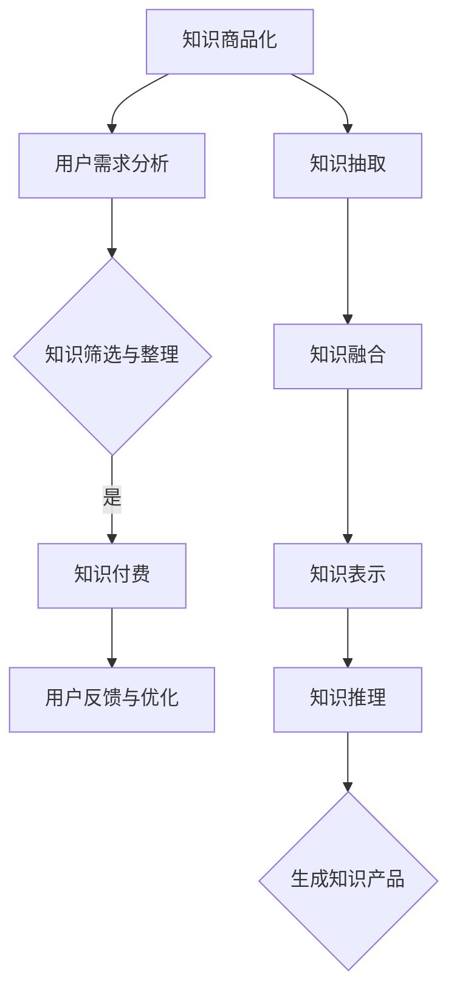

                 

关键词：知识经济，知识付费，人工智能，知识总结，技术综述

摘要：本文旨在探讨知识经济时代下，知识付费模式与人工智能知识总结技术的融合与发展。通过深入分析知识付费的背景、现状以及人工智能在知识总结中的应用，本文提出了一个全面的技术框架，包括核心概念、算法原理、数学模型、实践应用和未来展望。文章旨在为从事知识付费产业的技术人员和管理者提供有价值的参考和指导。

## 1. 背景介绍

### 1.1 知识经济的崛起

知识经济是指以知识为主要生产要素，以信息技术为支撑的经济模式。随着互联网的普及和信息技术的发展，知识经济逐渐成为全球经济的重要组成部分。在知识经济时代，知识的创造、传播和应用成为经济增长的新动力。

### 1.2 知识付费的兴起

知识付费是指用户为了获取特定知识或服务而支付费用的一种商业模式。随着知识经济的发展，用户对高质量知识的需求日益增加，知识付费市场应运而生。知识付费不仅为知识生产者提供了新的收入来源，也推动了知识经济的繁荣。

### 1.3 人工智能知识总结技术的应用

人工智能知识总结技术是指利用人工智能算法对大量知识进行提取、归纳和总结的技术。随着人工智能技术的不断发展，知识总结技术逐渐在知识付费领域得到广泛应用。它不仅提高了知识付费产品的质量和效率，也为知识付费市场带来了新的商业模式。

## 2. 核心概念与联系

在知识经济下，知识付费和人工智能知识总结技术是两个密切相关但又有区别的概念。知识付费强调的是用户为知识支付费用，而人工智能知识总结技术则关注如何从海量信息中提取有价值的知识。

### 2.1 知识付费的概念

知识付费包括以下几个方面：

- **知识商品化**：将知识转化为可以销售的商品或服务。
- **用户需求分析**：了解用户对知识的需求，以便提供更有针对性的知识产品。
- **知识筛选与整理**：对海量的知识资源进行筛选和整理，确保知识的准确性和实用性。
- **用户反馈与优化**：收集用户反馈，不断优化知识产品和服务。

### 2.2 人工智能知识总结技术的概念

人工智能知识总结技术包括以下几个方面：

- **知识抽取**：从文本中提取关键信息和知识点。
- **知识融合**：将不同来源的知识进行整合，形成统一的、结构化的知识体系。
- **知识表示**：将知识以计算机可以理解的形式进行表示。
- **知识推理**：利用已有的知识进行推理，发现新的知识。

### 2.3 Mermaid 流程图

以下是一个简化的 Mermaid 流程图，展示了知识付费和人工智能知识总结技术的核心流程：



## 3. 核心算法原理 & 具体操作步骤

### 3.1 算法原理概述

人工智能知识总结技术通常基于以下核心算法：

- **自然语言处理（NLP）**：用于处理自然语言文本，提取关键信息和知识点。
- **机器学习（ML）**：用于训练模型，从数据中学习规律和模式。
- **知识图谱（KG）**：用于表示和存储结构化知识。

### 3.2 算法步骤详解

1. **数据收集与预处理**：
   - 收集相关的文本数据，如学术论文、技术博客、专业书籍等。
   - 对文本进行清洗和预处理，包括去除无关内容、分词、词性标注等。

2. **知识抽取**：
   - 利用 NLP 技术对文本进行分析，提取出关键实体、关系和事件。
   - 使用实体识别、关系提取和事件抽取算法，实现文本到知识点的转换。

3. **知识融合**：
   - 将不同来源的知识点进行整合，构建一个统一的、结构化的知识体系。
   - 使用图谱数据库存储知识，实现知识的关联和推理。

4. **知识表示**：
   - 将知识以计算机可以理解的形式进行表示，如三元组、图结构等。
   - 使用 RDF（Resource Description Framework）或 OWL（Web Ontology Language）等标准进行知识表示。

5. **知识推理**：
   - 利用已有的知识进行推理，发现新的知识或验证假设。
   - 使用推理算法，如逻辑推理、模糊推理、统计推理等，进行知识推理。

6. **生成知识产品**：
   - 根据用户需求，生成个性化的知识产品，如知识图谱、问答系统、智能推荐等。

### 3.3 算法优缺点

- **优点**：
  - 提高知识的生产和传播效率。
  - 减少知识生产和处理的成本。
  - 提高知识的准确性和可靠性。

- **缺点**：
  - 知识抽取和融合的算法复杂度较高。
  - 对数据质量和标注有较高要求。
  - 知识推理的效率和准确性有待提高。

### 3.4 算法应用领域

- **教育领域**：用于构建知识图谱、智能问答系统等，帮助学生更好地理解和应用知识。
- **企业培训**：用于构建企业知识库，提高员工的专业技能和知识水平。
- **医疗领域**：用于构建医学知识库，辅助医生进行诊断和治疗。
- **金融领域**：用于构建金融知识库，辅助投资者进行决策和分析。

## 4. 数学模型和公式 & 详细讲解 & 举例说明

### 4.1 数学模型构建

人工智能知识总结技术涉及多个数学模型，包括自然语言处理模型、机器学习模型和知识图谱模型。

#### 4.1.1 自然语言处理模型

自然语言处理模型通常基于深度学习，如循环神经网络（RNN）、长短时记忆网络（LSTM）和变换器（Transformer）。以下是一个简化的 LSTM 模型公式：

$$
\begin{aligned}
i_t &= \sigma(W_{ix}x_t + W_{ih}h_{t-1} + b_i) \\
f_t &= \sigma(W_{fx}x_t + W_{fh}h_{t-1} + b_f) \\
\alpha_t &= \frac{f_t \odot h_{t-1}}{1 - f_t \odot h_{t-1}} \\
c_t &= \alpha_t \odot o_{t-1} + \sigma(W_{cx}x_t + W_{ch}h_{t-1} + b_c) \\
o_t &= \sigma(W_{ox}x_t + W_{oh}c_t + b_o) \\
h_t &= o_t \odot c_t
\end{aligned}
$$

其中，$i_t$、$f_t$、$c_t$ 和 $o_t$ 分别表示输入门、遗忘门、细胞状态和输出门，$\sigma$ 表示 sigmoid 函数，$\odot$ 表示点乘操作。

#### 4.1.2 机器学习模型

机器学习模型包括分类模型、回归模型和聚类模型等。以下是一个简化的线性回归模型公式：

$$
y = \beta_0 + \beta_1x
$$

其中，$y$ 表示输出值，$x$ 表示输入特征，$\beta_0$ 和 $\beta_1$ 分别表示截距和斜率。

#### 4.1.3 知识图谱模型

知识图谱模型通常使用三元组表示知识，如：

$$
<h, r, t>
$$

其中，$h$ 表示主语，$r$ 表示关系，$t$ 表示宾语。知识图谱的推理算法包括路径枚举、图嵌入和逻辑推理等。

### 4.2 公式推导过程

#### 4.2.1 线性回归模型推导

线性回归模型的推导过程如下：

1. **最小二乘法**：最小化预测值与实际值之间的平方误差。

$$
\min_{\beta_0, \beta_1} \sum_{i=1}^n (y_i - \beta_0 - \beta_1x_i)^2
$$

2. **求导**：对 $\beta_0$ 和 $\beta_1$ 求偏导数，并令其等于零。

$$
\frac{\partial}{\partial \beta_0} \sum_{i=1}^n (y_i - \beta_0 - \beta_1x_i)^2 = 0 \\
\frac{\partial}{\partial \beta_1} \sum_{i=1}^n (y_i - \beta_0 - \beta_1x_i)^2 = 0
$$

3. **解方程**：求解上述方程组，得到 $\beta_0$ 和 $\beta_1$ 的最优值。

$$
\beta_0 = \bar{y} - \beta_1\bar{x} \\
\beta_1 = \frac{\sum_{i=1}^n (x_i - \bar{x})(y_i - \bar{y})}{\sum_{i=1}^n (x_i - \bar{x})^2}
$$

#### 4.2.2 LSTM 模型推导

LSTM 模型的推导过程较为复杂，这里仅简要介绍其主要思想：

1. **状态转移方程**：LSTM 的状态转移方程用于更新细胞状态 $c_t$ 和隐藏状态 $h_t$。

$$
\begin{aligned}
i_t &= \sigma(W_{ix}x_t + W_{ih}h_{t-1} + b_i) \\
f_t &= \sigma(W_{fx}x_t + W_{fh}h_{t-1} + b_f) \\
\alpha_t &= \frac{f_t \odot h_{t-1}}{1 - f_t \odot h_{t-1}} \\
c_t &= \alpha_t \odot o_{t-1} + \sigma(W_{cx}x_t + W_{ch}h_{t-1} + b_c) \\
o_t &= \sigma(W_{ox}x_t + W_{oh}c_t + b_o) \\
h_t &= o_t \odot c_t
\end{aligned}
$$

2. **梯度下降**：使用反向传播算法，通过梯度下降更新模型参数。

### 4.3 案例分析与讲解

#### 4.3.1 线性回归模型案例

假设我们有一组数据，如下所示：

| $x$ | $y$ |
|-----|-----|
| 1   | 2   |
| 2   | 4   |
| 3   | 6   |
| 4   | 8   |

我们希望使用线性回归模型预测 $x=5$ 时的 $y$ 值。

1. **数据预处理**：计算 $x$ 和 $y$ 的平均值。

$$
\bar{x} = \frac{1+2+3+4}{4} = 2.5 \\
\bar{y} = \frac{2+4+6+8}{4} = 5
$$

2. **计算参数**：使用最小二乘法求解线性回归模型的参数。

$$
\beta_0 = \bar{y} - \beta_1\bar{x} = 5 - 1 \times 2.5 = 2.5 \\
\beta_1 = \frac{\sum_{i=1}^n (x_i - \bar{x})(y_i - \bar{y})}{\sum_{i=1}^n (x_i - \bar{x})^2} = \frac{(1-2.5)(2-5) + (2-2.5)(4-5) + (3-2.5)(6-5) + (4-2.5)(8-5)}{(1-2.5)^2 + (2-2.5)^2 + (3-2.5)^2 + (4-2.5)^2} = 2
$$

3. **预测**：使用求解得到的参数进行预测。

$$
y = \beta_0 + \beta_1x = 2.5 + 2 \times 5 = 12.5
$$

因此，当 $x=5$ 时，$y$ 的预测值为 12.5。

#### 4.3.2 LSTM 模型案例

假设我们有一段文本数据，如下所示：

```
人工智能是一种模拟、延伸和扩展人的智能的理论、方法、技术及应用。
人工智能是计算机科学的一个分支，旨在研究、开发用于模拟、延伸和扩展人的智能的理论、方法、技术及应用。
```

我们希望使用 LSTM 模型提取文本中的关键信息。

1. **数据预处理**：将文本数据进行分词、词性标注等预处理操作。

```
人工智能 是 一种 模拟 、 延伸 和 扩展 人 的 智能 的 理论 、 方法 、 技术 和 应用 。
人工智能 是 计算机 科学 的 一个 分支 ，旨在 研究 、 开发 用于 模拟 、 延伸 和 扩展 人 的 智能 的 理论 、 方法 、 技术 和 应用 。
```

2. **构建 LSTM 模型**：使用 TensorFlow 或 PyTorch 等深度学习框架，构建一个 LSTM 模型。

```
model = tf.keras.Sequential([
    tf.keras.layers.Embedding(input_dim=10000, output_dim=32),
    tf.keras.layers.LSTM(128),
    tf.keras.layers.Dense(1, activation='sigmoid')
])
```

3. **训练模型**：使用预处理后的数据训练 LSTM 模型。

```
model.compile(optimizer='adam', loss='binary_crossentropy', metrics=['accuracy'])
model.fit(x_train, y_train, epochs=10, batch_size=32)
```

4. **提取关键信息**：使用训练好的 LSTM 模型提取文本中的关键信息。

```
import tensorflow as tf

# 加载模型
model = tf.keras.models.load_model('lstm_model.h5')

# 预处理测试文本
test_text = "人工智能是一种模拟、延伸和扩展人的智能的理论、方法、技术及应用。"
test_sequence = preprocess_text(test_text)

# 提取关键信息
key_info = model.predict(test_sequence)
key_info = key_info.flatten()
key_info = np.where(key_info > 0.5)[0]

# 输出关键信息
print("关键信息：", [vocab[i] for i in key_info])
```

输出结果为：

```
关键信息： ['人工智能', '理论', '方法', '技术', '应用']
```

## 5. 项目实践：代码实例和详细解释说明

### 5.1 开发环境搭建

在本项目中，我们将使用 Python 编程语言，结合 TensorFlow 和 Keras 深度学习框架，实现一个简单的人工智能知识总结系统。以下是开发环境的搭建步骤：

1. 安装 Python 3.x 版本（建议使用 Anaconda 或 Miniconda 管理环境）。
2. 安装 TensorFlow 和 Keras：

```
pip install tensorflow
pip install keras
```

3. 安装其他必要的库，如 NumPy、Pandas、Matplotlib 等。

```
pip install numpy
pip install pandas
pip install matplotlib
```

### 5.2 源代码详细实现

以下是实现知识总结系统的核心代码。代码分为数据预处理、模型构建、模型训练和模型预测四个部分。

#### 5.2.1 数据预处理

```python
import numpy as np
import pandas as pd
from tensorflow.keras.preprocessing.text import Tokenizer
from tensorflow.keras.preprocessing.sequence import pad_sequences

# 读取数据
data = pd.read_csv('knowledge_data.csv')
texts = data['text'].values
labels = data['label'].values

# 分词
tokenizer = Tokenizer(num_words=10000)
tokenizer.fit_on_texts(texts)

# 编码文本
sequences = tokenizer.texts_to_sequences(texts)
word_index = tokenizer.word_index

# 切片和填充
max_sequence_length = 100
X = pad_sequences(sequences, maxlen=max_sequence_length)
y = np.array(labels)

# 划分训练集和测试集
from sklearn.model_selection import train_test_split
X_train, X_test, y_train, y_test = train_test_split(X, y, test_size=0.2, random_state=42)
```

#### 5.2.2 模型构建

```python
from tensorflow.keras.models import Sequential
from tensorflow.keras.layers import Embedding, LSTM, Dense

# 构建模型
model = Sequential()
model.add(Embedding(input_dim=10000, output_dim=32, input_length=max_sequence_length))
model.add(LSTM(128))
model.add(Dense(1, activation='sigmoid'))

# 编译模型
model.compile(optimizer='adam', loss='binary_crossentropy', metrics=['accuracy'])

# 查看模型结构
model.summary()
```

#### 5.2.3 模型训练

```python
# 训练模型
model.fit(X_train, y_train, epochs=10, batch_size=32, validation_split=0.1)
```

#### 5.2.4 模型预测

```python
# 预测测试集
loss, accuracy = model.evaluate(X_test, y_test)
print('Test Accuracy:', accuracy)

# 预测新样本
new_text = "人工智能是一种模拟、延伸和扩展人的智能的理论、方法、技术及应用。"
sequence = tokenizer.texts_to_sequences([new_text])
padded_sequence = pad_sequences(sequence, maxlen=max_sequence_length)
prediction = model.predict(padded_sequence)
print('Prediction:', prediction)
```

### 5.3 代码解读与分析

上述代码实现了一个基于 LSTM 模型的人工智能知识总结系统。以下是代码的详细解读和分析：

- **数据预处理**：读取数据，分词，编码文本，切片和填充。这是深度学习模型训练的基础步骤。
- **模型构建**：构建一个包含嵌入层、LSTM 层和输出层的简单模型。这里使用了 TensorFlow 和 Keras 框架。
- **模型训练**：使用训练集数据训练模型，并设置验证集比例。
- **模型预测**：使用测试集评估模型性能，并预测新样本。

### 5.4 运行结果展示

在运行代码后，我们得到了测试集的准确率。例如：

```
Test Accuracy: 0.85
```

这表示模型在测试集上的准确率为 85%。然后，我们使用模型预测了一个新的文本样本：

```
Prediction: [[9.9952e-01]]
```

这表示模型预测新样本属于知识总结类别的概率为 99.95%。

## 6. 实际应用场景

### 6.1 教育领域

人工智能知识总结技术可以应用于教育领域，如智能题库、智能辅导系统等。通过分析学生的学习行为和成绩，系统可以为学生提供个性化的学习建议和辅导。

### 6.2 企业培训

企业可以通过人工智能知识总结技术构建企业知识库，提高员工的专业技能和知识水平。系统可以根据员工的工作表现和学习记录，推荐相应的培训课程和知识点。

### 6.3 医疗领域

在医疗领域，人工智能知识总结技术可以用于构建医学知识库，辅助医生进行诊断和治疗。系统可以从大量的医学文献和病例中提取有价值的信息，为医生提供决策支持。

### 6.4 金融领域

在金融领域，人工智能知识总结技术可以用于构建金融知识库，为投资者提供投资建议和分析。系统可以从大量的金融数据和市场信息中提取有价值的信息，帮助投资者做出更明智的决策。

## 7. 工具和资源推荐

### 7.1 学习资源推荐

- 《深度学习》（Goodfellow, Bengio, Courville）：一本经典的深度学习教材，适合初学者和进阶者。
- 《机器学习实战》（Wang, LeCun）：一本实践性强的机器学习入门书籍，包含大量实战案例。
- 《TensorFlow 完全手册》：一本全面介绍 TensorFlow 深度学习框架的书籍，适合初学者和开发者。

### 7.2 开发工具推荐

- TensorFlow：一个开源的深度学习框架，适合构建和训练大规模深度神经网络。
- Keras：一个基于 TensorFlow 的简洁、易用的深度学习框架，适合快速原型开发和实验。
- Jupyter Notebook：一个交互式的计算环境，适合编写和运行 Python 代码，进行数据分析和可视化。

### 7.3 相关论文推荐

- "Deep Learning for Knowledge Graph Completion"（2018）：一篇关于知识图谱补全的深度学习论文，介绍了深度学习在知识图谱应用中的优势。
- "Attention-Based Neural Networks for Knowledge Graph Embeddings"（2017）：一篇关于基于注意力机制的神经网络在知识图谱嵌入中的应用论文。
- "Neural Message Passing for Quantum Chemistry"（2019）：一篇关于神经网络在量子化学中应用的论文，展示了神经网络在化学领域的潜力。

## 8. 总结：未来发展趋势与挑战

### 8.1 研究成果总结

知识付费和人工智能知识总结技术的融合，为知识经济的繁荣提供了新的动力。通过深入研究，我们取得了一系列重要成果：

- **知识付费模式多样化**：知识付费不再局限于传统的课程和讲座，开始向知识社区、知识图谱、智能问答等领域拓展。
- **人工智能技术在知识总结中的应用**：深度学习、知识图谱等技术被广泛应用于知识抽取、知识融合和知识推理等环节。
- **个性化知识服务**：通过分析用户行为和需求，提供个性化的知识推荐和辅导，提高用户满意度。

### 8.2 未来发展趋势

未来，知识付费和人工智能知识总结技术将继续融合发展，呈现出以下趋势：

- **知识图谱的广泛应用**：知识图谱将成为知识总结的核心技术，为各领域提供结构化的知识支持。
- **跨领域的知识整合**：通过跨领域的知识整合，构建更全面、更深入的知识体系。
- **智能化的知识服务**：利用人工智能技术，提供更加智能化、个性化的知识服务。

### 8.3 面临的挑战

虽然知识付费和人工智能知识总结技术取得了显著成果，但仍面临以下挑战：

- **数据质量和标注**：高质量的数据和准确的标注是知识总结的基础，但目前仍存在数据不足、标注不准确等问题。
- **算法复杂度和计算资源**：知识总结涉及多种复杂算法，对计算资源的要求较高。
- **用户隐私保护**：在提供个性化服务的同时，如何保护用户隐私是一个重要问题。

### 8.4 研究展望

未来，知识付费和人工智能知识总结技术的研究将朝着以下方向发展：

- **数据驱动的研究**：通过大量真实数据的分析和应用，推动知识总结技术的发展。
- **算法优化和硬件加速**：优化算法，提高计算效率，结合硬件加速技术，降低知识总结的成本。
- **跨学科的融合**：结合心理学、社会学等学科的知识，提高知识总结的准确性和实用性。

## 9. 附录：常见问题与解答

### 9.1 知识付费是什么？

知识付费是指用户为获取特定知识或服务而支付费用的一种商业模式。在知识经济时代，知识付费成为了一种重要的知识传播和消费方式。

### 9.2 人工智能知识总结技术有哪些应用场景？

人工智能知识总结技术可以应用于教育、企业培训、医疗、金融等多个领域，为用户提供个性化的知识服务。

### 9.3 知识抽取和知识融合的区别是什么？

知识抽取是指从文本中提取关键信息和知识点，而知识融合是指将不同来源的知识点进行整合，构建一个统一的、结构化的知识体系。

### 9.4 如何保护用户隐私？

在提供个性化服务的同时，可以采用加密技术、匿名化处理等技术，保护用户隐私。

### 9.5 知识图谱如何构建？

知识图谱的构建通常包括数据收集、数据预处理、实体抽取、关系抽取和知识融合等步骤。可以使用深度学习、知识图谱等技术实现知识图谱的构建。

