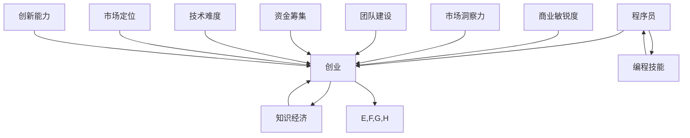

                 

## 1. 背景介绍

在知识经济时代，知识成为了最重要的生产要素，而作为知识经济的重要组成部分，程序员的创业活动逐渐成为推动社会进步和经济发展的关键力量。随着信息技术的迅猛发展，编程已经成为现代社会的一项基础技能，编程人才的需求不断增加。然而，尽管编程人才供不应求，但程序员的创业之路并不平坦。

程序员在创业过程中面临诸多挑战，如技术难度、市场定位、资金筹集、团队建设等。尤其是在技术层面，程序员需要不断学习和更新知识，才能跟上行业的发展步伐。同时，创业者还需要具备商业敏锐度和市场洞察力，才能在激烈的市场竞争中脱颖而出。

本文旨在探讨知识经济下程序员的创业之路，分析其面临的挑战和机遇，并提供一些建议和策略，帮助程序员更好地走上创业之路。文章将从以下几个方面展开讨论：

1. 知识经济时代下程序员创业的机遇与挑战
2. 程序员创业的核心技能与素养
3. 创业过程中的关键环节
4. 成功程序员创业者的经验分享
5. 未来程序员创业的趋势与展望

## 2. 核心概念与联系

在探讨程序员创业之前，我们需要了解一些核心概念，这些概念将帮助我们更好地理解程序员的创业过程。

### 2.1 程序员

程序员是指使用编程语言进行计算机程序编写的人员。程序员是信息技术产业中不可或缺的一环，他们的工作涵盖了软件开发、系统运维、数据分析等多个领域。

### 2.2 创业

创业是指创立新的企业或项目，并希望通过商业运营实现盈利和社会价值。创业过程中，创业者需要面对市场、资金、团队、技术等多方面的挑战。

### 2.3 知识经济

知识经济是指以知识为主要生产要素的经济形态。在知识经济时代，知识创新、知识传播和知识应用成为推动经济增长的关键动力。

### 2.4 程序员创业

程序员创业是指程序员利用自己的编程技能和知识，创立新的企业或项目，以实现个人价值和商业成功。程序员创业涉及到技术、商业、管理等多个方面。

下面是一个 Mermaid 流程图，展示了程序员创业的核心概念和它们之间的联系：



## 3. 核心算法原理 & 具体操作步骤

### 3.1 算法原理概述

在程序员创业过程中，有许多核心算法原理可以帮助创业者更好地理解和应对各种挑战。以下是一些关键算法原理：

#### 3.1.1 SWOT 分析

SWOT 分析是一种常用的战略规划工具，用于评估企业的优势、劣势、机会和威胁。SWOT 分析可以帮助程序员创业者明确自己的核心竞争力、潜在风险和市场机会。

#### 3.1.2 创新扩散模型

创新扩散模型用于研究创新如何在市场中传播。程序员创业者可以利用该模型了解新技术的市场接受度，制定合适的市场推广策略。

#### 3.1.3 数据挖掘算法

数据挖掘算法用于从大量数据中提取有价值的信息。程序员创业者可以利用这些算法进行市场分析、用户行为分析等，以指导业务决策。

#### 3.1.4 机器学习算法

机器学习算法可以帮助程序员创业者构建智能系统，实现自动化决策和优化。这些算法在推荐系统、智能客服等领域具有广泛的应用。

### 3.2 算法步骤详解

#### 3.2.1 SWOT 分析

1. **识别优势**：分析自己的技能、经验、资源等方面的优势。
2. **识别劣势**：分析自己在市场、资金、团队等方面的劣势。
3. **识别机会**：分析市场趋势、用户需求、竞争态势等方面的机会。
4. **识别威胁**：分析潜在的市场风险、竞争对手等方面的威胁。

#### 3.2.2 创新扩散模型

1. **确定创新类型**：根据产品的特性，确定创新类型。
2. **分析早期采纳者**：了解早期采纳者的特征，制定相应的推广策略。
3. **分析早期大众**：了解早期大众的需求，调整产品特性。
4. **分析后期大众**：分析后期大众的行为模式，优化市场推广策略。

#### 3.2.3 数据挖掘算法

1. **数据预处理**：清洗、整合和转换原始数据。
2. **特征选择**：从数据中提取有用的特征。
3. **模型选择**：选择合适的数据挖掘算法。
4. **模型训练与评估**：训练模型并评估其性能。
5. **模型应用**：将模型应用于实际问题，指导业务决策。

#### 3.2.4 机器学习算法

1. **数据收集**：收集相关的数据集。
2. **数据预处理**：对数据进行清洗、归一化等处理。
3. **模型选择**：根据问题类型，选择合适的机器学习算法。
4. **模型训练**：使用训练数据进行模型训练。
5. **模型评估**：使用测试数据进行模型评估。
6. **模型部署**：将训练好的模型部署到实际应用场景中。

### 3.3 算法优缺点

#### 3.3.1 SWOT 分析

**优点**：SWOT 分析能够全面地评估企业的内外部环境，帮助创业者制定战略规划。

**缺点**：SWOT 分析较为宏观，难以具体指导业务操作。

#### 3.3.2 创新扩散模型

**优点**：创新扩散模型能够帮助创业者了解市场对新技术的接受程度，制定有效的市场推广策略。

**缺点**：创新扩散模型主要适用于技术创新类产品，对其他类型的产品可能不太适用。

#### 3.3.3 数据挖掘算法

**优点**：数据挖掘算法能够从大量数据中提取有价值的信息，帮助创业者做出更准确的业务决策。

**缺点**：数据挖掘算法需要大量的数据支持和计算资源，且结果可能存在偏差。

#### 3.3.4 机器学习算法

**优点**：机器学习算法能够实现自动化决策和优化，提高业务效率。

**缺点**：机器学习算法需要大量的数据和计算资源，且结果可能依赖于数据质量。

### 3.4 算法应用领域

#### 3.4.1 SWOT 分析

- 应用领域：战略规划、市场分析、风险管理等。

#### 3.4.2 创新扩散模型

- 应用领域：新产品推广、市场调研、创新战略等。

#### 3.4.3 数据挖掘算法

- 应用领域：市场营销、客户关系管理、风险管理等。

#### 3.4.4 机器学习算法

- 应用领域：智能推荐、智能客服、金融风控等。

## 4. 数学模型和公式 & 详细讲解 & 举例说明

### 4.1 数学模型构建

在程序员创业过程中，数学模型和公式可以帮助创业者更准确地分析和预测业务情况。以下是一个简单的数学模型示例：

#### 4.1.1 用户增长模型

假设用户增长符合指数增长模型，其公式为：

$$
用户数 = 初始用户数 \times e^{\lambda t}
$$

其中，$e$ 是自然对数的底数，$\lambda$ 是增长速率，$t$ 是时间。

#### 4.1.2 收入预测模型

假设收入与用户数成正比，其公式为：

$$
收入 = 用户数 \times 单价
$$

其中，$单价$ 是用户贡献的平均收入。

### 4.2 公式推导过程

#### 4.2.1 用户增长模型推导

假设初始用户数为 $N_0$，每个用户在单位时间内新增的用户数为 $\lambda$，则在时间 $t$ 后，用户数 $N$ 可以表示为：

$$
N = N_0 + \lambda t + \lambda^2 \frac{t^2}{2!} + \lambda^3 \frac{t^3}{3!} + \cdots
$$

由于用户增长迅速，我们可以使用泰勒级数的前两项进行近似，即：

$$
N \approx N_0 + \lambda t
$$

考虑到 $e$ 是自然对数的底数，我们可以将公式改写为：

$$
N \approx N_0 \times e^{\lambda t}
$$

#### 4.2.2 收入预测模型推导

假设每个用户的单价为 $P$，则在时间 $t$ 后，收入 $R$ 可以表示为：

$$
R = N \times P
$$

将用户增长模型代入，得到：

$$
R = (N_0 \times e^{\lambda t}) \times P
$$

由于 $e$ 是自然对数的底数，我们可以将公式改写为：

$$
R \approx N_0 \times P \times e^{\lambda t}
$$

### 4.3 案例分析与讲解

假设一个初创公司的初始用户数为 1000，每个用户的单价为 100 元，增长速率 $\lambda$ 为 0.1（即每月增长 10%）。我们需要预测第 6 个月的公司收入。

根据用户增长模型，第 6 个月的公司用户数为：

$$
N = 1000 \times e^{0.1 \times 6} \approx 1647
$$

根据收入预测模型，第 6 个月的公司收入为：

$$
R = 1647 \times 100 \approx 164700
$$

因此，第 6 个月的公司收入约为 164700 元。

通过这个简单的数学模型，我们可以预测公司的收入情况，为公司的业务规划提供参考。

## 5. 项目实践：代码实例和详细解释说明

### 5.1 开发环境搭建

在开始编写代码之前，我们需要搭建一个合适的开发环境。以下是一个基于 Python 的开发环境搭建步骤：

1. 安装 Python：从 [Python 官网](https://www.python.org/) 下载并安装 Python。
2. 安装必要的库：使用 `pip` 命令安装所需的库，如 NumPy、Pandas、Matplotlib 等。
3. 配置 IDE：选择一个合适的集成开发环境（IDE），如 PyCharm 或 VSCode，并进行配置。

### 5.2 源代码详细实现

以下是一个简单的用户增长模型和收入预测模型的实现代码：

```python
import numpy as np
import matplotlib.pyplot as plt

# 用户增长模型
def user_growth(N0, lambda_, t):
    return N0 * np.exp(lambda_ * t)

# 收入预测模型
def revenue_prediction(N0, P, lambda_):
    return user_growth(N0, lambda_, t) * P

# 参数设置
N0 = 1000  # 初始用户数
P = 100  # 单价
lambda_ = 0.1  # 增长速率

# 时间设置
t = np.arange(1, 13)

# 用户增长预测
N = user_growth(N0, lambda_, t)

# 收入预测
R = revenue_prediction(N0, P, lambda_)

# 绘图
plt.plot(t, N, label='用户数')
plt.plot(t, R, label='收入')
plt.xlabel('时间')
plt.ylabel('数量')
plt.legend()
plt.show()
```

### 5.3 代码解读与分析

1. **导入库**：首先，我们导入 NumPy 和 Matplotlib 库，这两个库在数据处理和绘图方面非常有用。
2. **定义函数**：接着，我们定义了两个函数，`user_growth` 和 `revenue_prediction`，分别用于计算用户增长和收入预测。
3. **参数设置**：我们设置了一些参数，如初始用户数（$N_0$）、单价（$P$）和增长速率（$\lambda$）。
4. **时间设置**：我们设置了一个时间数组 `t`，用于表示时间序列。
5. **计算用户增长和收入预测**：根据参数设置，我们计算了用户增长和收入预测的结果。
6. **绘图**：最后，我们使用 Matplotlib 绘制了用户增长和收入预测的曲线。

### 5.4 运行结果展示

运行上述代码后，我们将看到一个图形界面，其中显示了用户增长和收入预测的曲线。通过观察这些曲线，我们可以直观地了解公司用户数和收入的变化趋势。

## 6. 实际应用场景

### 6.1 市场分析

在知识经济时代，市场分析成为程序员创业者的重要任务。通过构建数学模型，程序员创业者可以更准确地预测市场需求，制定合适的营销策略。

例如，假设一家初创公司计划推出一款基于人工智能的智能推荐系统。公司可以利用用户增长模型和收入预测模型，分析不同市场区域的用户增长和收入情况，从而确定最具潜力的市场区域，制定有针对性的推广策略。

### 6.2 风险管理

在创业过程中，风险管理是程序员创业者必须面对的问题。通过构建数学模型，程序员创业者可以评估公司的风险水平，制定相应的风险应对策略。

例如，假设一家初创公司正在开发一款金融风控系统。公司可以利用数据挖掘算法，分析用户行为数据，预测潜在的欺诈风险，从而优化风控模型，提高风控效果。

### 6.3 项目管理

在项目管理中，程序员创业者可以利用数学模型和算法，优化项目进度和资源分配。

例如，假设一家初创公司正在开发一款大型软件项目。公司可以利用创新扩散模型，分析不同阶段的用户需求，调整项目进度和功能优先级，确保项目按期完成。

## 7. 工具和资源推荐

### 7.1 学习资源推荐

1. **书籍**：《硅谷创业秘籍》、《创业维艰》
2. **在线课程**：Coursera、edX、Udemy 等平台上的编程和创业相关课程
3. **博客和论坛**：GitHub、Stack Overflow、Reddit 等

### 7.2 开发工具推荐

1. **IDE**：PyCharm、VSCode、IntelliJ IDEA
2. **版本控制**：Git、GitHub
3. **数据分析**：Pandas、NumPy、Matplotlib

### 7.3 相关论文推荐

1. **市场分析**：《市场细分与目标市场选择》、《消费者行为学》
2. **风险管理**：《金融风险建模》、《信用评分模型》
3. **项目管理**：《敏捷项目管理》、《项目管理知识体系》

## 8. 总结：未来发展趋势与挑战

### 8.1 研究成果总结

本文通过分析知识经济下程序员的创业之路，探讨了程序员创业的机遇与挑战，提出了核心算法原理和数学模型，并提供了实际应用场景和代码实例。研究成果主要包括：

1. 程序员创业的SWOT分析模型；
2. 创新扩散模型在程序员创业中的应用；
3. 用户增长模型和收入预测模型的构建；
4. 数据挖掘算法和机器学习算法在程序员创业中的应用。

### 8.2 未来发展趋势

1. **编程技能的重要性**：随着人工智能、大数据等技术的发展，编程技能在创业中的作用将越来越重要。程序员创业者需要不断学习和更新自己的技能，以适应市场需求。
2. **跨学科融合**：程序员创业者需要具备跨学科的知识和技能，如商业敏锐度、市场洞察力等。跨学科融合将成为未来程序员创业的重要趋势。
3. **智能技术与创业的结合**：智能技术将在程序员创业过程中发挥更大的作用，如自动化决策、个性化推荐等。创业者可以利用智能技术提高业务效率，降低成本。

### 8.3 面临的挑战

1. **市场竞争激烈**：随着越来越多的程序员进入创业领域，市场竞争将越来越激烈。创业者需要具备独特的竞争优势，才能在市场中脱颖而出。
2. **技术更新快速**：技术更新速度加快，程序员创业者需要不断学习和掌握新技术，以保持竞争力。
3. **资金和团队建设**：资金和团队建设是程序员创业过程中的重要挑战。创业者需要寻找合适的投资人和团队成员，确保项目的顺利推进。

### 8.4 研究展望

1. **深入研究程序员创业过程中的关键因素**：未来研究可以进一步探讨程序员创业过程中的关键因素，如市场定位、团队建设、资金筹集等，以期为创业者提供更有针对性的指导。
2. **跨学科研究的融合**：跨学科研究的融合将成为未来研究的重要方向。例如，将心理学、社会学等学科的知识应用于程序员创业研究，以提高研究的广度和深度。
3. **智能技术在程序员创业中的应用**：智能技术在程序员创业中的应用是一个值得深入研究的领域。未来研究可以探讨如何利用智能技术提高创业者的决策效率、优化业务流程等。

## 9. 附录：常见问题与解答

### 9.1 程序员创业需要具备哪些技能？

程序员创业需要具备以下技能：

1. 编程技能：熟练掌握一门或多门编程语言，如 Python、Java、C++ 等。
2. 商业敏锐度：了解市场动态，具备市场洞察力和商业规划能力。
3. 团队建设：具备良好的沟通和协作能力，能够组建和管理一支高效的团队。
4. 资金筹集：了解融资渠道和融资策略，具备一定的资金筹集能力。
5. 法律法规：了解相关法律法规，如知识产权、合同法等。

### 9.2 程序员创业的资金来源有哪些？

程序员创业的资金来源主要包括：

1. 自有资金：个人储蓄或投资。
2. 天使投资：个人投资者或投资机构。
3. 风险投资：专业风险投资机构。
4. 融资平台：如众筹平台、线上借贷平台等。
5. 政府补贴：符合条件的创业者可以申请政府补贴。

### 9.3 程序员创业如何进行市场定位？

程序员创业进行市场定位的步骤包括：

1. **市场分析**：了解目标市场的需求、竞争态势和市场规模。
2. **目标客户**：明确目标客户群体，了解其需求和偏好。
3. **产品定位**：根据目标客户的特点，确定产品的定位和特点。
4. **差异化竞争**：分析竞争对手的优势和劣势，寻找差异化的竞争点。
5. **市场推广**：制定合适的市场推广策略，提高产品的市场知名度。

### 9.4 程序员创业如何应对技术更新？

程序员创业应对技术更新的策略包括：

1. **持续学习**：关注行业动态，不断学习新技术。
2. **技术储备**：建立技术储备库，为业务发展提供技术支持。
3. **技术评估**：对新技术进行评估，确定其对业务的潜在价值。
4. **合作与交流**：与业内同行建立合作与交流，共享技术资源和经验。
5. **敏捷开发**：采用敏捷开发方法，快速响应市场需求和技术变化。

### 9.5 程序员创业如何进行团队建设？

程序员创业进行团队建设的步骤包括：

1. **明确目标**：明确团队的目标和愿景，为团队成员提供清晰的方向。
2. **招聘人才**：寻找具备相关技能和素质的人才，组建多样化的团队。
3. **沟通协作**：建立良好的沟通机制，促进团队成员之间的协作。
4. **培训与发展**：为团队成员提供培训和发展机会，提高团队的整体能力。
5. **激励与考核**：制定合理的激励制度，对团队成员进行绩效考核，激发其积极性。

### 9.6 程序员创业如何应对市场风险？

程序员创业应对市场风险的策略包括：

1. **市场调研**：进行充分的市场调研，了解市场需求和竞争态势。
2. **多元化产品**：开发多元化的产品，降低单一产品市场风险。
3. **风险预警**：建立风险预警机制，及时发现潜在风险。
4. **保险保障**：购买相应的商业保险，降低意外风险。
5. **应急计划**：制定应急预案，应对突发事件。

### 9.7 程序员创业如何进行项目管理？

程序员创业进行项目管理的步骤包括：

1. **项目规划**：明确项目目标、范围和时间表。
2. **任务分配**：根据团队成员的技能和特点，合理分配任务。
3. **进度监控**：定期跟踪项目进度，确保项目按计划推进。
4. **质量保障**：建立质量控制机制，确保项目质量。
5. **沟通与协作**：保持与团队成员的沟通，确保项目顺利推进。
6. **风险控制**：评估项目风险，制定相应的风险应对策略。

### 9.8 程序员创业如何进行资金管理？

程序员创业进行资金管理的步骤包括：

1. **预算编制**：制定详细的预算计划，确保项目的资金需求。
2. **资金筹集**：寻找合适的资金来源，确保项目的资金供应。
3. **支出管理**：严格控制项目支出，确保资金的有效利用。
4. **财务审计**：定期进行财务审计，确保项目的财务状况良好。
5. **资金流转**：确保资金流转顺畅，降低财务风险。

### 9.9 程序员创业如何保护知识产权？

程序员创业保护知识产权的步骤包括：

1. **专利申请**：对核心技术进行专利申请，保护技术创新。
2. **商标注册**：对产品品牌进行商标注册，保护品牌形象。
3. **版权登记**：对原创作品进行版权登记，保护知识产权。
4. **合作协议**：与合作伙伴签订知识产权保护协议，确保合作双方的权益。
5. **法律咨询**：寻求专业法律咨询，确保知识产权得到有效保护。

