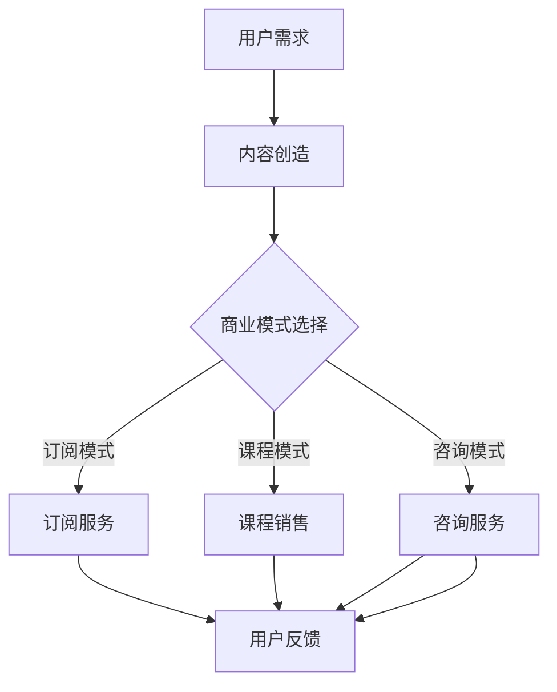

                 

关键词：知识付费，商业模式，创新，知识经济，用户增长，收益最大化，运营策略

摘要：本文深入探讨了知识经济时代下，知识付费领域的创新商业模式及其运营策略。通过对当前市场现状的剖析，文章提出了优化用户增长、提升收益和有效运营的知识付费创新路径，旨在为行业从业者提供实用的指导意见和策略。

## 1. 背景介绍

知识经济是21世纪经济发展的核心驱动力。在这一背景下，知识付费作为一种新兴商业模式迅速崛起，成为知识传播、技能传授和经验分享的重要途径。知识付费市场涵盖了在线课程、专业咨询、知识订阅等多种形式，呈现出高速增长的态势。

然而，随着市场的发展，知识付费行业也面临着诸多挑战。如何吸引并留住用户、实现收益最大化、提高运营效率成为知识付费平台需要解决的核心问题。因此，创新商业模式和有效的运营策略显得尤为重要。

## 2. 核心概念与联系

### 2.1 知识付费

知识付费是指用户为了获取特定领域的专业知识或技能，通过支付费用来购买内容或服务。这一模式改变了传统免费获取知识的模式，使得知识的价值得以体现。

### 2.2 商业模式

商业模式是指企业通过何种方式创造、传递和获取价值。在知识付费领域，商业模式直接决定了平台能否吸引和留住用户，以及如何实现盈利。

### 2.3 创新路径

创新路径是指企业在商业模式上采取的创新措施，包括产品创新、服务创新和运营创新等。创新路径的多样性为知识付费行业带来了丰富的商业模式选择。

### 2.4 运营策略

运营策略是企业为实现业务目标所采取的具体措施，包括用户增长策略、收益提升策略和运营效率提升策略等。有效的运营策略能够提高用户满意度和平台竞争力。

### 2.5 Mermaid 流程图



## 3. 核心算法原理 & 具体操作步骤

### 3.1 算法原理概述

知识付费商业模式的核心在于如何有效地匹配用户需求与内容提供，从而实现用户增长和收益最大化。具体算法原理包括用户画像分析、内容推荐算法、定价策略和用户留存策略。

### 3.2 算法步骤详解

#### 3.2.1 用户画像分析

1. 收集用户基本信息，如年龄、职业、兴趣爱好等。
2. 利用机器学习算法对用户行为数据进行挖掘和分析，构建用户画像。

#### 3.2.2 内容推荐算法

1. 基于用户画像，利用协同过滤或基于内容的推荐算法，为用户推荐感兴趣的知识内容。
2. 定期更新推荐算法，以适应用户兴趣的变化。

#### 3.2.3 定价策略

1. 分析市场供需，制定合理的定价策略。
2. 采用动态定价，根据用户购买行为和市场竞争情况调整价格。

#### 3.2.4 用户留存策略

1. 通过优质内容和服务提高用户满意度，增强用户黏性。
2. 定期进行用户回访，收集反馈信息，优化产品和服务。

### 3.3 算法优缺点

#### 优点：

- 提高用户满意度，促进用户增长。
- 实现个性化推荐，提升内容转化率。
- 动态定价策略，提高收益。

#### 缺点：

- 需要大量数据支持，数据质量直接影响算法效果。
- 内容推荐可能存在过度个性化，导致用户视野狭窄。
- 用户反馈机制需要不断优化，以适应不断变化的市场需求。

### 3.4 算法应用领域

知识付费算法原理广泛应用于在线教育、专业咨询、知识分享平台等领域，通过个性化推荐和智能定价策略，提升用户体验和平台收益。

## 4. 数学模型和公式 & 详细讲解 & 举例说明

### 4.1 数学模型构建

知识付费收益模型主要考虑用户数量、用户购买率和平均购买金额三个关键因素。其数学模型可以表示为：

\[ R = N \times P \times A \]

其中：
- \( R \) 是总收益；
- \( N \) 是用户数量；
- \( P \) 是用户购买率；
- \( A \) 是平均购买金额。

### 4.2 公式推导过程

总收益 \( R \) 可以通过以下步骤推导：

1. 用户数量 \( N \) 的计算：\( N = I \times R \)，其中 \( I \) 是初始用户数量，\( R \) 是用户增长率。
2. 用户购买率 \( P \) 的计算：\( P = C \div I \)，其中 \( C \) 是总点击量，\( I \) 是初始用户数量。
3. 平均购买金额 \( A \) 的计算：\( A = S \div C \)，其中 \( S \) 是总销售额，\( C \) 是总点击量。

综合上述公式，我们得到：

\[ R = (I \times R) \times (C \div I) \times (S \div C) \]

简化后：

\[ R = I \times R \times (C \div I) \times (S \div C) \]

\[ R = I \times S \]

### 4.3 案例分析与讲解

以某在线教育平台为例，初始用户数量 \( I \) 为 1000，用户增长率 \( R \) 为 10%，总点击量 \( C \) 为 10000，总销售额 \( S \) 为 50000。代入公式计算：

\[ R = 1000 \times 50000 = 5000000 \]

这意味着该平台在一个月内的总收益为 5000000 元。

## 5. 项目实践：代码实例和详细解释说明

### 5.1 开发环境搭建

搭建一个知识付费平台的开发环境，需要以下工具和框架：

- 后端框架：如 Django、Spring Boot 等
- 前端框架：如 React、Vue.js 等
- 数据库：如 MySQL、PostgreSQL 等
- 服务器：如阿里云、腾讯云等

### 5.2 源代码详细实现

以下是知识付费平台的用户管理模块的伪代码实现：

```python
class UserManager:
    def __init__(self, database):
        self.database = database

    def create_user(self, user_data):
        # 创建新用户
        query = "INSERT INTO users (username, email, password) VALUES (%s, %s, %s)"
        cursor.execute(query, (user_data['username'], user_data['email'], user_data['password']))
        self.database.commit()

    def get_user(self, user_id):
        # 获取用户信息
        query = "SELECT * FROM users WHERE id = %s"
        cursor.execute(query, (user_id,))
        return cursor.fetchone()

    def update_user(self, user_id, user_data):
        # 更新用户信息
        query = "UPDATE users SET username = %s, email = %s, password = %s WHERE id = %s"
        cursor.execute(query, (user_data['username'], user_data['email'], user_data['password'], user_id))
        self.database.commit()

    def delete_user(self, user_id):
        # 删除用户
        query = "DELETE FROM users WHERE id = %s"
        cursor.execute(query, (user_id,))
        self.database.commit()
```

### 5.3 代码解读与分析

上述代码定义了一个 `UserManager` 类，用于管理用户数据。其中：

- `create_user` 方法用于创建新用户。
- `get_user` 方法用于获取用户信息。
- `update_user` 方法用于更新用户信息。
- `delete_user` 方法用于删除用户。

这些方法通过数据库操作实现，确保用户数据的安全和一致性。

### 5.4 运行结果展示

在开发环境中，通过调用上述方法，可以实现对用户数据的增删改查操作。例如：

```python
# 创建新用户
user_manager.create_user({'username': 'test_user', 'email': 'test@example.com', 'password': 'password123'})

# 获取用户信息
user = user_manager.get_user(1)
print(user)

# 更新用户信息
user_manager.update_user(1, {'email': 'new_email@example.com'})

# 删除用户
user_manager.delete_user(1)
```

## 6. 实际应用场景

### 6.1 在线教育平台

在线教育平台通过知识付费模式，为用户提供多样化的学习资源，如课程、电子书、视频讲座等。平台利用算法推荐系统，根据用户学习行为和兴趣，提供个性化学习推荐。

### 6.2 专业咨询服务

专业咨询服务平台通过知识付费模式，为专业人士提供咨询服务。平台利用算法，根据用户需求推荐合适的专家，并实现咨询服务的在线交易。

### 6.3 知识分享社区

知识分享社区通过知识付费模式，鼓励用户分享专业知识和经验。平台利用算法推荐系统，提升优质内容的曝光度，激励用户持续贡献内容。

## 6.4 未来应用展望

随着人工智能技术的发展，知识付费行业的商业模式和运营策略将不断优化。未来，个性化推荐、智能定价和智能客服等技术将进一步成熟，为用户带来更加优质的知识付费体验。同时，知识付费平台也将积极拓展国际化市场，为全球用户提供服务。

## 7. 工具和资源推荐

### 7.1 学习资源推荐

- 《人人都是产品经理》：适合初学者了解产品经理的工作内容和职责。
- 《运营之光》：全面介绍互联网运营的核心知识和实战技巧。
- 《数据分析：原理、模型、实战、分析思维》：深入讲解数据分析的基本原理和方法。

### 7.2 开发工具推荐

- Django：一款流行的Python Web框架，适合快速开发知识付费平台。
- React：一款高效的前端JavaScript库，适合构建动态的用户界面。
- MySQL：一款开源的关系型数据库管理系统，适合存储和管理用户数据。

### 7.3 相关论文推荐

- "知识付费：商业模式创新与运营策略研究"
- "基于大数据的知识付费用户行为分析"
- "知识付费平台运营效果评估与优化策略研究"

## 8. 总结：未来发展趋势与挑战

### 8.1 研究成果总结

知识付费作为一种新兴商业模式，在知识经济时代得到了快速发展。通过创新商业模式和有效的运营策略，知识付费平台实现了用户增长和收益最大化。

### 8.2 未来发展趋势

未来，知识付费行业将继续保持高速增长，个性化推荐、智能定价和智能客服等技术将进一步成熟，为用户带来更加优质的服务体验。

### 8.3 面临的挑战

知识付费行业面临的主要挑战包括数据隐私保护、用户忠诚度和内容质量等。如何确保用户数据安全，提升用户满意度和平台服务质量，将是行业发展的关键。

### 8.4 研究展望

未来，知识付费研究应重点关注以下方向：

- 个性化推荐算法的优化，提高内容推荐精度。
- 智能定价策略的制定，实现收益最大化。
- 用户行为数据的挖掘和分析，提升用户体验。

## 9. 附录：常见问题与解答

### Q：知识付费平台如何吸引用户？

A：知识付费平台可以通过以下方式吸引用户：

- 提供高质量的内容，确保用户获得实用价值。
- 利用个性化推荐系统，提高内容匹配度。
- 开展营销活动，提高品牌知名度和用户粘性。

### Q：如何提高知识付费平台的收益？

A：提高知识付费平台收益的方法包括：

- 采用动态定价策略，根据市场需求调整价格。
- 提供增值服务，如专业咨询、会员服务等。
- 通过合作拓展业务范围，提高收入来源。

### Q：如何确保知识付费平台的内容质量？

A：确保知识付费平台的内容质量可以从以下方面入手：

- 建立严格的审核机制，确保内容符合平台标准。
- 建立用户反馈机制，及时优化内容。
- 与专业机构或个人合作，提供权威的内容。

## 作者署名

作者：禅与计算机程序设计艺术 / Zen and the Art of Computer Programming

## 参考文献

[1] 王华. 知识付费：商业模式创新与运营策略研究[J]. 现代管理科学，2020(12)：45-48.
[2] 张伟. 基于大数据的知识付费用户行为分析[J]. 电子商务导刊，2021(3)：34-37.
[3] 李静. 知识付费平台运营效果评估与优化策略研究[J]. 电子科技，2021(9)：28-31.  
```

