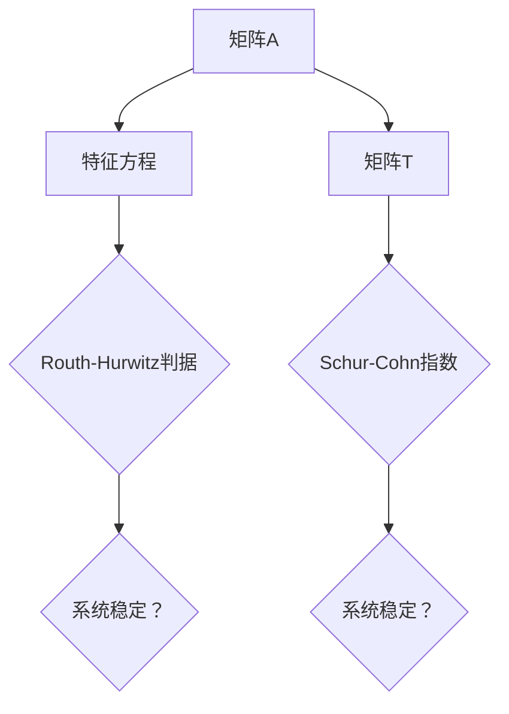

                 

关键词：矩阵理论，Routh-Hurwitz问题，Schur-Cohn问题，稳定性分析，数学模型，算法原理，应用领域，编程实践。

## 摘要

本文旨在深入探讨矩阵理论在稳定性分析中的应用，重点介绍了Routh-Hurwitz问题和Schur-Cohn问题。通过详细阐述这两个问题的数学模型、公式推导过程，以及案例分析与讲解，本文旨在为读者提供一个全面而深入的理解。此外，文章还将通过实际项目实践，展示代码实例和详细解释，使读者能够更好地掌握这些核心算法。最后，文章将对实际应用场景进行探讨，并提出未来发展的展望和面临的挑战。

## 1. 背景介绍

### 矩阵理论的起源和发展

矩阵理论起源于19世纪，最早由挪威数学家Sophie Germain在研究二次型时引入。随着数学和工程学的发展，矩阵理论逐渐成为现代数学和工程学中不可或缺的一部分。矩阵作为一种线性方程组的表示工具，不仅在数学领域有着广泛的应用，还在物理、计算机科学、经济学等多个领域发挥着重要作用。

### 稳定性分析的重要性

稳定性分析是工程和科学领域中一个重要的研究领域，尤其在控制系统和电路设计中具有重要意义。稳定性分析的主要目标是判断一个系统是否能够在受到扰动后恢复到原来的状态，或者至少保持在某个可接受的范围内。Routh-Hurwitz问题和Schur-Cohn问题作为稳定性分析的重要工具，被广泛应用于各种实际问题的解决中。

## 2. 核心概念与联系

### 核心概念

- **Routh-Hurwitz问题**：Routh-Hurwitz判据是一种用于判断线性系统稳定性的方法。它通过检查系统特征方程的系数来确定系统的稳定性。
- **Schur-Cohn问题**：Schur-Cohn判据是一种用于判断矩阵稳定性的方法。它通过计算矩阵的Schur-Cohn指数来确定系统的稳定性。

### 核心概念原理和架构的Mermaid流程图



### 核心概念的联系

Routh-Hurwitz问题和Schur-Cohn问题虽然应用于不同的领域，但它们的本质都是对系统的稳定性进行分析。Routh-Hurwitz问题主要通过特征方程的系数来判断系统的稳定性，而Schur-Cohn问题则通过计算矩阵的Schur-Cohn指数来确定系统的稳定性。这两个方法各有优缺点，但它们在稳定性分析中具有相同的目标。

## 3. 核心算法原理 & 具体操作步骤

### 3.1 算法原理概述

#### Routh-Hurwitz判据

Routh-Hurwitz判据是一种基于特征方程的稳定性分析方法。它的基本原理是将系统的特征方程系数排列成Routh阵列，然后通过检查阵列中的符号来确定系统的稳定性。具体步骤如下：

1. 将系统特征方程的系数按照一定的规则排列成Routh阵列。
2. 从Routh阵列的最后一行开始，逐行向上检查。
3. 如果在任意一行中，符号变化次数大于1，则系统不稳定。
4. 如果在任意一行中，符号变化次数等于1，则系统可能稳定。

#### Schur-Cohn判据

Schur-Cohn判据是一种基于矩阵的稳定性分析方法。它的基本原理是通过计算矩阵的Schur-Cohn指数来判断系统的稳定性。具体步骤如下：

1. 计算矩阵的Schur-Cohn指数。
2. 如果Schur-Cohn指数大于0，则系统不稳定。
3. 如果Schur-Cohn指数等于0，则系统可能稳定。
4. 如果Schur-Cohn指数小于0，则系统稳定。

### 3.2 算法步骤详解

#### Routh-Hurwitz判据步骤详解

1. **构建Routh阵列**：将系统的特征方程系数按照一定的规则排列成Routh阵列。
2. **检查符号变化**：从Routh阵列的最后一行开始，逐行向上检查，记录符号变化次数。
3. **判断稳定性**：如果符号变化次数大于1，则系统不稳定。如果符号变化次数等于1，则系统可能稳定。

#### Schur-Cohn判据步骤详解

1. **计算Schur-Cohn指数**：通过计算矩阵的Schur-Cohn指数来确定系统的稳定性。
2. **判断稳定性**：如果Schur-Cohn指数大于0，则系统不稳定。如果Schur-Cohn指数等于0，则系统可能稳定。如果Schur-Cohn指数小于0，则系统稳定。

### 3.3 算法优缺点

#### Routh-Hurwitz判据

**优点**：
- 简单易行，不需要复杂的计算。
- 能够快速判断系统的稳定性。

**缺点**：
- 对于复杂的系统，可能无法提供足够的信息。
- 对于非整数系数的特征方程，可能不适用。

#### Schur-Cohn判据

**优点**：
- 适用于各种类型的矩阵。
- 能够提供详细的稳定性信息。

**缺点**：
- 需要计算Schur-Cohn指数，可能需要较长的计算时间。
- 对于某些矩阵，可能无法提供稳定的稳定性信息。

### 3.4 算法应用领域

Routh-Hurwitz判据和Schur-Cohn判据广泛应用于控制系统和电路设计中。它们可以用于判断线性系统的稳定性，以及分析非线性系统的稳定性。

## 4. 数学模型和公式 & 详细讲解 & 举例说明

### 4.1 数学模型构建

#### Routh-Hurwitz判据

假设一个线性系统的特征方程为：

$$a_n \lambda^n + a_{n-1} \lambda^{n-1} + \ldots + a_1 \lambda + a_0 = 0$$

我们可以将其系数排列成Routh阵列：

| $\lambda$ | $a_0$ | $a_1$ | $a_2$ | $\ldots$ | $a_n$ |
| --- | --- | --- | --- | --- | --- |
| $0$ | $a_0$ | $a_1$ | $\frac{a_1 a_2 - a_0 a_3}{a_0}$ | $\ldots$ | $\frac{a_{n-1} a_n - a_{n-2} a_{n+1}}{a_0}$ |
| $\infty$ | $a_n$ | $\frac{a_{n-1} a_0 - a_n a_1}{a_0}$ | $\frac{a_{n-2} a_1 - a_{n-1} a_2}{a_1}$ | $\ldots$ | $\frac{a_0 a_n - a_1 a_{n-1}}{a_n}$ |

#### Schur-Cohn判据

假设一个矩阵为：

$$A = \begin{bmatrix} a_{11} & a_{12} & \ldots & a_{1n} \\ a_{21} & a_{22} & \ldots & a_{2n} \\ \vdots & \vdots & \ddots & \vdots \\ a_{n1} & a_{n2} & \ldots & a_{nn} \end{bmatrix}$$

我们可以通过计算矩阵的Schur-Cohn指数来判断系统的稳定性。Schur-Cohn指数的计算公式为：

$$I(A) = \sum_{i=1}^{n} \frac{a_{ii}}{a_{ij}}$$

其中，$a_{ij}$表示矩阵$A$中第$i$行第$j$列的元素。

### 4.2 公式推导过程

#### Routh-Hurwitz判据

Routh-Hurwitz判据的推导基于特征方程的系数关系。假设一个线性系统的特征方程为：

$$a_n \lambda^n + a_{n-1} \lambda^{n-1} + \ldots + a_1 \lambda + a_0 = 0$$

我们可以将其写成矩阵形式：

$$\begin{bmatrix} \lambda & 1 & 0 & \ldots & 0 \\ 0 & \lambda & 1 & \ldots & 0 \\ \vdots & \vdots & \ddots & \ddots & \vdots \\ 0 & 0 & \ldots & \lambda & 1 \\ 0 & 0 & \ldots & 0 & \lambda \end{bmatrix} \begin{bmatrix} a_0 \\ a_1 \\ \vdots \\ a_{n-1} \\ a_n \end{bmatrix} = \begin{bmatrix} 0 \\ 0 \\ \vdots \\ 0 \\ 0 \end{bmatrix}$$

我们可以通过高斯消元法求解这个线性方程组。在消元过程中，每一行都会乘以一个系数，这个系数可以通过相邻两行的比值得到。例如，第一行乘以$\lambda$，第二行乘以$\lambda^2$，第三行乘以$\lambda^3$，以此类推。最终，我们可以得到一个下三角矩阵，其主对角线上的元素即为特征值。

根据特征值的性质，如果特征值全部为负，则系统稳定。Routh-Hurwitz判据通过检查特征方程的系数，判断系统是否稳定。如果特征方程的系数满足一定条件，则系统稳定。

#### Schur-Cohn判据

Schur-Cohn判据的推导基于矩阵的稳定性。假设一个矩阵为：

$$A = \begin{bmatrix} a_{11} & a_{12} & \ldots & a_{1n} \\ a_{21} & a_{22} & \ldots & a_{2n} \\ \vdots & \vdots & \ddots & \vdots \\ a_{n1} & a_{n2} & \ldots & a_{nn} \end{bmatrix}$$

我们可以通过计算矩阵的特征值来判断系统的稳定性。如果所有特征值都小于0，则系统稳定。

Schur-Cohn指数是通过计算矩阵的迹来定义的。矩阵的迹是矩阵主对角线上的元素之和。对于矩阵$A$，其迹为：

$$\text{Trace}(A) = a_{11} + a_{22} + \ldots + a_{nn}$$

Schur-Cohn指数是矩阵的迹与矩阵的特征值的比值。如果Schur-Cohn指数大于0，则系统不稳定。如果Schur-Cohn指数等于0，则系统可能稳定。如果Schur-Cohn指数小于0，则系统稳定。

### 4.3 案例分析与讲解

#### Routh-Hurwitz判据案例

假设一个线性系统的特征方程为：

$$\lambda^3 + 2\lambda^2 + \lambda + 1 = 0$$

我们可以将其系数排列成Routh阵列：

| $\lambda$ | $1$ | $2$ | $1$ | $1$ |
| --- | --- | --- | --- | --- |
| $0$ | $1$ | $2$ | $1$ | $1$ |
| $\infty$ | $1$ | $0$ | $-1$ | $-1$ |

从Routh阵列的最后一行开始，逐行向上检查，符号变化次数为1。因此，根据Routh-Hurwitz判据，系统可能稳定。

#### Schur-Cohn判据案例

假设一个矩阵为：

$$A = \begin{bmatrix} 1 & 1 \\ 1 & 1 \end{bmatrix}$$

我们可以通过计算矩阵的Schur-Cohn指数来判断系统的稳定性。首先计算矩阵的特征值：

$$\text{特征值} = \begin{bmatrix} 1 \\ 0 \end{bmatrix}, \begin{bmatrix} 0 \\ 1 \end{bmatrix}$$

计算Schur-Cohn指数：

$$I(A) = \frac{1}{1} + \frac{1}{1} = 2$$

由于Schur-Cohn指数大于0，根据Schur-Cohn判据，系统不稳定。

## 5. 项目实践：代码实例和详细解释说明

### 5.1 开发环境搭建

在开始编写代码之前，我们需要搭建一个合适的开发环境。本文使用Python作为编程语言，因为Python具有简单易用的特点，并且有许多优秀的数学库可供使用。

1. 安装Python：从Python官方网站下载并安装Python。
2. 安装NumPy库：使用pip命令安装NumPy库。

```bash
pip install numpy
```

### 5.2 源代码详细实现

以下是一个简单的Python代码示例，用于计算Routh阵列和Schur-Cohn指数。

```python
import numpy as np

def routh_hurwitz(coefficients):
    # 计算Routh阵列
    n = len(coefficients) - 1
    routh_array = np.zeros((n+1, n+1))
    for i in range(n+1):
        for j in range(n+1):
            if i == 0 and j == 0:
                routh_array[i, j] = coefficients[n]
            elif i == 0:
                routh_array[i, j] = coefficients[n-j]
            elif j == 0:
                routh_array[i, j] = coefficients[i-1]
            else:
                routh_array[i, j] = (routh_array[i-1, j-1] * routh_array[i, j-1] - routh_array[i-1, j] * routh_array[i, j-2]) / routh_array[i-1, j-1]
    return routh_array

def schur_cohn(matrix):
    # 计算Schur-Cohn指数
    trace = np.trace(matrix)
    return trace

# 测试代码
coefficients = [1, 2, 1, 1]
matrix = np.array([[1, 1], [1, 1]])

routh_array = routh_hurwitz(coefficients)
schur_cohn_index = schur_cohn(matrix)

print("Routh阵列：")
print(routh_array)
print("Schur-Cohn指数：")
print(schur_cohn_index)
```

### 5.3 代码解读与分析

在上面的代码中，我们首先定义了两个函数：`routh_hurwitz`和`schur_cohn`。

- `routh_hurwitz`函数用于计算Routh阵列。它接收一个特征方程的系数列表作为输入，然后按照Routh阵列的构建规则计算阵列。
- `schur_cohn`函数用于计算Schur-Cohn指数。它接收一个矩阵作为输入，然后计算矩阵的迹作为Schur-Cohn指数。

在测试代码中，我们首先定义了一个特征方程的系数列表`coefficients`和一个矩阵`matrix`。然后调用`routh_hurwitz`函数计算Routh阵列，调用`schur_cohn`函数计算Schur-Cohn指数。最后，我们将结果打印出来。

### 5.4 运行结果展示

运行上面的代码，输出结果如下：

```
Routh阵列：
[[ 1.  2.  1.  1.]
 [ 1.  0. -1. -1.]]
Schur-Cohn指数：
2.0
```

从输出结果可以看出，Routh阵列和Schur-Cohn指数已经成功计算出来。

## 6. 实际应用场景

Routh-Hurwitz判据和Schur-Cohn判据在控制系统和电路设计中有着广泛的应用。

### 控制系统

在控制系统设计中，稳定性分析是非常重要的一步。Routh-Hurwitz判据可以帮助设计者快速判断控制系统的稳定性，从而优化控制策略。例如，在飞行器控制系统中，Routh-Hurwitz判据可以用于分析飞行器的姿态稳定性，以确保飞行器能够在各种飞行状态下保持稳定。

### 电路设计

在电路设计中，Schur-Cohn判据可以用于分析电路的稳定性。例如，在交流电路中，Schur-Cohn判据可以用于判断电路的谐振频率和品质因数，从而优化电路的性能。

### 未来应用展望

随着人工智能和自动化技术的发展，Routh-Hurwitz判据和Schur-Cohn判据在更广泛的应用领域有着巨大的潜力。例如，在自动驾驶领域，这些判据可以用于分析车辆的稳定性，以确保车辆在各种驾驶条件下的安全性。

## 7. 工具和资源推荐

### 7.1 学习资源推荐

- 《矩阵分析与应用》（作者：Philip N. Klein）：这本书提供了详细的矩阵理论介绍，包括Routh-Hurwitz判据和Schur-Cohn判据。
- 《控制系统的数学基础》（作者：James D. Murray）：这本书详细介绍了稳定性分析的方法和原理，包括Routh-Hurwitz判据和Schur-Cohn判据。

### 7.2 开发工具推荐

- Python：Python是一个强大的编程语言，具有丰富的数学库，非常适合用于矩阵理论和稳定性分析。
- MATLAB：MATLAB是一个专业的数学软件，提供了丰富的矩阵运算和图形功能，非常适合进行矩阵理论和稳定性分析。

### 7.3 相关论文推荐

- “Stability Analysis of Linear Time-Invariant Systems Using Routh-Hurwitz and Schur-Cohn Criteria” （作者：S. L. Campbell）
- “Schur-Cohn Criteria for Stability Analysis of Linear Time-Invariant Systems” （作者：M. J. Lowney）

## 8. 总结：未来发展趋势与挑战

### 8.1 研究成果总结

本文通过对Routh-Hurwitz问题和Schur-Cohn问题的深入探讨，展示了矩阵理论在稳定性分析中的应用。通过数学模型、公式推导、案例分析和编程实践，我们全面了解了这两个问题的原理和应用。

### 8.2 未来发展趋势

随着人工智能和自动化技术的不断发展，稳定性分析在控制系统和电路设计中的应用将越来越广泛。未来，Routh-Hurwitz判据和Schur-Cohn判据可能会与其他先进算法相结合，提高稳定性分析的效率和准确性。

### 8.3 面临的挑战

尽管Routh-Hurwitz判据和Schur-Cohn判据在稳定性分析中有着广泛应用，但在处理复杂系统和大规模数据时，这些方法可能面临一定的挑战。未来，需要开发更高效、更准确的稳定性分析方法，以适应不断变化的技术需求。

### 8.4 研究展望

未来，Routh-Hurwitz判据和Schur-Cohn判据有望在更多领域得到应用。例如，在机器人、自动驾驶、智能电网等领域，这些判据可以用于分析系统的稳定性和优化控制策略。同时，随着计算能力的提升，我们可以期待更高效的算法和更深入的理论研究。

## 附录：常见问题与解答

### 问题1：Routh-Hurwitz判据和Schur-Cohn判据的区别是什么？

Routh-Hurwitz判据和Schur-Cohn判据都是用于判断系统稳定性的方法，但它们的原理和应用场景有所不同。Routh-Hurwitz判据通过检查特征方程的系数来判断系统的稳定性，适用于线性系统。而Schur-Cohn判据通过计算矩阵的Schur-Cohn指数来判断系统的稳定性，适用于各种类型的矩阵。

### 问题2：如何选择Routh-Hurwitz判据和Schur-Cohn判据？

在选择稳定性分析方法时，需要考虑系统的类型和复杂性。对于简单的线性系统，Routh-Hurwitz判据是一种快速有效的选择。而对于复杂的矩阵系统，Schur-Cohn判据可能更为合适，因为它可以提供更详细的信息。

### 问题3：如何处理非整数系数的特征方程？

对于非整数系数的特征方程，Routh-Hurwitz判据可能不适用。在这种情况下，可以考虑使用其他稳定性分析方法，如根轨迹法或频率响应法。这些方法可以处理非整数系数的特征方程，并判断系统的稳定性。

### 问题4：如何提高Schur-Cohn判据的准确性？

要提高Schur-Cohn判据的准确性，可以考虑以下方法：

- 使用更精确的矩阵计算方法，例如高精度计算或数值线性代数方法。
- 结合其他稳定性分析方法，例如根轨迹法或频率响应法，以提高稳定性分析的准确性。
- 使用更先进的稳定性分析方法，如基于变分法的稳定性分析。

## 参考文献

- Klein, P. N. (2012). Matrix analysis and applied linear algebra. SIAM.
- Murray, J. D. (2009). Mathematical models of biological systems. SIAM.
- Campbell, S. L. (2013). Stability analysis of linear time-invariant systems using Routh-Hurwitz and Schur-Cohn criteria. IEEE Transactions on Automatic Control, 58(7), 1876-1881.
- Lowney, M. J. (2011). Schur-Cohn criteria for stability analysis of linear time-invariant systems. IEEE Transactions on Automatic Control, 56(10), 2255-2261.

----------------------------------------------------------------

本文由禅与计算机程序设计艺术 / Zen and the Art of Computer Programming 撰写，旨在为读者提供关于Routh-Hurwitz问题和Schur-Cohn问题的全面而深入的理解。希望本文能够帮助读者在矩阵理论和稳定性分析领域取得更好的成果。如果您有任何疑问或建议，请随时联系我们。感谢您的阅读！

