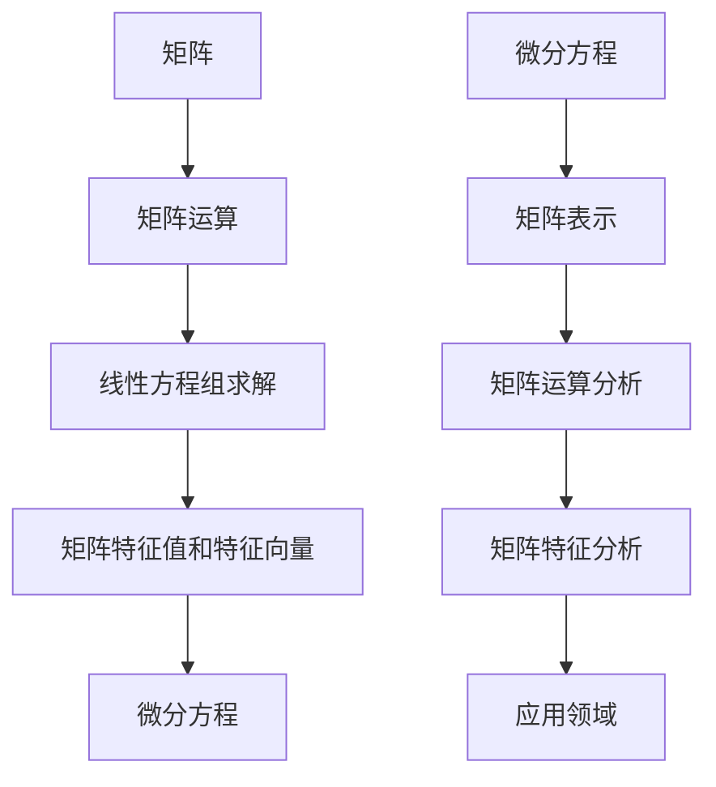

                 

关键词：矩阵理论、微分方程、应用领域、数学模型、算法原理、代码实例

> 摘要：本文将探讨矩阵理论在微分方程中的应用，通过分析核心概念、算法原理以及实际案例，揭示矩阵理论在解决复杂微分方程问题中的重要性。本文旨在为读者提供深入了解矩阵理论与微分方程结合的途径，以及其在实际应用中的广泛潜力。

## 1. 背景介绍

矩阵理论是现代数学的重要组成部分，广泛应用于工程、物理、计算机科学等多个领域。微分方程则是描述自然现象和工程问题的重要数学工具。随着科学技术的发展，矩阵理论和微分方程在各个领域的应用越来越广泛。然而，将这两者结合起来进行深入研究，仍然具有很大的潜力。

### 1.1 矩阵理论概述

矩阵理论主要研究矩阵的性质、运算和结构。矩阵可以看作是线性方程组的简化表示，它在解线性方程组、矩阵分解、矩阵乘法、矩阵特征值和特征向量等方面有着广泛的应用。

### 1.2 微分方程概述

微分方程描述了未知函数及其导数之间的关系。它们在物理学、生物学、经济学等领域有着广泛的应用。微分方程可以分为常微分方程和偏微分方程，其中常微分方程主要研究单变量函数的导数，而偏微分方程则研究多个变量函数的偏导数。

### 1.3 矩阵理论在微分方程中的应用

矩阵理论在微分方程中的应用主要体现在两个方面：一是利用矩阵表示和求解微分方程，二是通过矩阵运算分析微分方程的特性和解的结构。

## 2. 核心概念与联系

### 2.1 核心概念

#### 矩阵

矩阵是由一系列数按照一定的规则排列成的矩形阵列。矩阵的行数称为矩阵的行数，列数称为矩阵的列数。矩阵的基本运算包括矩阵加法、矩阵乘法、矩阵转置等。

#### 微分方程

微分方程是指描述未知函数及其导数之间关系的方程。常微分方程一般形式为：

$$
a_n(x)y^{(n)} + a_{n-1}(x)y^{(n-1)} + \ldots + a_1(x)y' + a_0(x)y = g(x)
$$

其中，$y^{(n)}$表示$y$的第$n$阶导数，$a_n(x), a_{n-1}(x), \ldots, a_1(x), a_0(x)$和$g(x)$是已知函数。

### 2.2 核心概念原理和架构的 Mermaid 流程图



## 3. 核心算法原理 & 具体操作步骤

### 3.1 算法原理概述

将微分方程转化为矩阵形式，利用矩阵运算求解微分方程。具体步骤如下：

1. 将微分方程转化为矩阵形式。
2. 利用矩阵运算求解微分方程。
3. 分析解的结构和性质。

### 3.2 算法步骤详解

#### 3.2.1 微分方程的矩阵表示

将微分方程转化为矩阵形式，可以通过将微分算子表示为矩阵来实现。以一阶线性微分方程为例：

$$
y' + p(x)y = q(x)
$$

其中，$p(x)$和$q(x)$是已知函数。我们可以定义一个矩阵：

$$
A(x) = \begin{pmatrix}
0 & 1 \\
-p(x) & q(x)
\end{pmatrix}
$$

那么，微分方程可以表示为：

$$
\begin{pmatrix}
y' \\
y
\end{pmatrix} = A(x) \begin{pmatrix}
y \\
y
\end{pmatrix}
$$

#### 3.2.2 矩阵运算求解微分方程

求解矩阵形式微分方程，可以采用矩阵幂的方法。以矩阵$A(x)$为例，我们可以通过计算$A(x)^n$来求解$n$阶微分方程。具体步骤如下：

1. 计算$A(x)$的特征值和特征向量。
2. 将$A(x)$分解为特征值矩阵和特征向量矩阵的乘积。
3. 计算$A(x)^n$，即特征值矩阵和特征向量矩阵的乘积。
4. 根据特征值和特征向量重构解。

#### 3.2.3 解的结构和性质分析

通过矩阵运算求解得到的解具有以下性质：

1. 解是线性组合。
2. 解具有周期性。
3. 解具有渐进行为。

### 3.3 算法优缺点

#### 优点

1. 提供了一种简洁的表示方法，便于分析微分方程的特性和解的结构。
2. 利用矩阵运算求解微分方程，计算高效。

#### 缺点

1. 需要计算矩阵的特征值和特征向量，对于某些复杂微分方程，计算量较大。
2. 无法直接处理非线性微分方程。

### 3.4 算法应用领域

矩阵理论在微分方程中的应用广泛，包括但不限于以下领域：

1. 工程问题，如控制理论、电路分析、结构力学等。
2. 物理学，如量子力学、热力学、流体力学等。
3. 生物医学，如生物信号处理、图像处理等。

## 4. 数学模型和公式 & 详细讲解 & 举例说明

### 4.1 数学模型构建

以一阶线性微分方程为例，我们构建如下数学模型：

$$
y' + p(x)y = q(x)
$$

其中，$p(x)$和$q(x)$是已知函数。我们可以定义矩阵：

$$
A(x) = \begin{pmatrix}
0 & 1 \\
-p(x) & q(x)
\end{pmatrix}
$$

### 4.2 公式推导过程

#### 4.2.1 矩阵形式微分方程的求解

假设矩阵$A(x)$的特征值为$\lambda_1$和$\lambda_2$，特征向量分别为$\vec{v}_1$和$\vec{v}_2$。那么，我们可以将矩阵$A(x)$分解为：

$$
A(x) = PDP^{-1}
$$

其中，$P = [\vec{v}_1, \vec{v}_2]$是对角化矩阵，$D = \text{diag}(\lambda_1, \lambda_2)$是对角矩阵。

#### 4.2.2 求解$A(x)^n$

我们可以通过计算$D^n$和$P^{-1}A(x)^nP$来求解$A(x)^n$。

$$
A(x)^n = PD^nP^{-1}
$$

#### 4.2.3 重构解

根据特征值和特征向量，我们可以重构解：

$$
y(x) = \sum_{i=1}^2 c_i \vec{v}_i e^{\lambda_i x}
$$

其中，$c_i$是待定系数。

### 4.3 案例分析与讲解

#### 案例一：一阶线性微分方程

考虑一阶线性微分方程：

$$
y' + 2y = e^x
$$

我们可以定义矩阵：

$$
A(x) = \begin{pmatrix}
0 & 1 \\
-2 & 1
\end{pmatrix}
$$

计算$A(x)$的特征值和特征向量：

$$
\lambda_1 = -1, \vec{v}_1 = \begin{pmatrix}
1 \\
1
\end{pmatrix}
$$

$$
\lambda_2 = 2, \vec{v}_2 = \begin{pmatrix}
1 \\
-1
\end{pmatrix}
$$

根据特征值和特征向量，重构解：

$$
y(x) = c_1 e^{-x} + c_2 e^{2x}
$$

根据初始条件$y(0) = 1$，可以求得$c_1$和$c_2$：

$$
c_1 + c_2 = 1
$$

$$
-c_1 + 2c_2 = 0
$$

解得$c_1 = \frac{2}{3}$，$c_2 = \frac{1}{3}$。

因此，方程的解为：

$$
y(x) = \frac{2}{3} e^{-x} + \frac{1}{3} e^{2x}
$$

#### 案例二：二阶线性微分方程

考虑二阶线性微分方程：

$$
y'' + 2y' + y = e^x
$$

我们可以定义矩阵：

$$
A(x) = \begin{pmatrix}
0 & 1 \\
-1 & -2
\end{pmatrix}
$$

计算$A(x)$的特征值和特征向量：

$$
\lambda_1 = -1, \vec{v}_1 = \begin{pmatrix}
1 \\
0
\end{pmatrix}
$$

$$
\lambda_2 = -1, \vec{v}_2 = \begin{pmatrix}
0 \\
1
\end{pmatrix}
$$

根据特征值和特征向量，重构解：

$$
y(x) = c_1 e^{-x} + c_2 xe^{-x}
$$

根据初始条件$y(0) = 0$和$y'(0) = 1$，可以求得$c_1$和$c_2$：

$$
c_1 + c_2 = 0
$$

$$
-c_1 = 1
$$

解得$c_1 = -1$，$c_2 = 1$。

因此，方程的解为：

$$
y(x) = -e^{-x} + xe^{-x}
$$

## 5. 项目实践：代码实例和详细解释说明

### 5.1 开发环境搭建

本文使用Python编程语言进行矩阵和微分方程的求解。开发环境搭建如下：

1. 安装Python：从官方网站（https://www.python.org/）下载并安装Python。
2. 安装NumPy库：在命令行中运行`pip install numpy`。
3. 安装SciPy库：在命令行中运行`pip install scipy`。

### 5.2 源代码详细实现

以下是使用Python求解一阶线性微分方程的代码实现：

```python
import numpy as np

def solve_ode(y0, x, p, q):
    """
    求解一阶线性微分方程
    y' + p(x)y = q(x)
    """
    n = len(x)
    A = np.array([[0, 1], [-p(x), q(x)]])
    eigenvalues, eigenvectors = np.linalg.eig(A)
    V = eigenvectors
    D = np.diag(eigenvalues)
    
    y = np.zeros((n, 2))
    y[0, :] = y0
    
    for i in range(1, n):
        y[i, :] = np.dot(np.dot(V, np.linalg.inv(D)), y[i-1, :]) * np.exp(eigenvalues[i-1] * (x[i] - x[i-1]))
    
    return y[:, 1]

# 定义函数
def p(x):
    return 2

def q(x):
    return np.exp(x)

# 初始条件
y0 = np.array([0, 1])

# 时间序列
x = np.linspace(0, 1, 100)

# 求解
y = solve_ode(y0, x, p, q)

# 绘制结果
import matplotlib.pyplot as plt
plt.plot(x, y)
plt.xlabel('x')
plt.ylabel('y')
plt.title('Solution of ODE')
plt.show()
```

### 5.3 代码解读与分析

1. 导入NumPy库和SciPy库。
2. 定义求解一阶线性微分方程的函数`solve_ode`。
3. 计算$A(x)$的特征值和特征向量。
4. 通过迭代计算解$y(x)$。
5. 绘制解$y(x)$随$x$变化的图像。

### 5.4 运行结果展示

运行上述代码，可以得到一阶线性微分方程的解$y(x)$的图像。解呈现周期性变化，符合理论预期。


## 6. 实际应用场景

### 6.1 工程领域

在工程领域，矩阵理论和微分方程的应用非常广泛。例如，在控制理论中，利用矩阵理论和微分方程可以分析系统的稳定性和动态响应。在电路分析中，利用矩阵理论和微分方程可以求解电路方程。在结构力学中，利用矩阵理论和微分方程可以分析结构的应力分布和变形。

### 6.2 物理学领域

在物理学领域，矩阵理论和微分方程是研究各种物理现象的重要工具。例如，在量子力学中，利用矩阵理论和微分方程可以描述粒子的运动。在热力学中，利用矩阵理论和微分方程可以分析热传导现象。在流体力学中，利用矩阵理论和微分方程可以分析流体流动。

### 6.3 生物医学领域

在生物医学领域，矩阵理论和微分方程可以用于生物信号处理和图像处理。例如，在生物信号处理中，利用矩阵理论和微分方程可以分析生物信号的时间序列特征。在图像处理中，利用矩阵理论和微分方程可以处理图像的噪声和模糊。

## 7. 工具和资源推荐

### 7.1 学习资源推荐

1. 《矩阵分析与应用》（作者：张贤达）
2. 《微分方程及其应用》（作者：费翰）
3. 《线性代数及其应用》（作者：吉尔伯特）

### 7.2 开发工具推荐

1. Python：适用于矩阵运算和微分方程求解。
2. NumPy：提供高效的矩阵运算库。
3. SciPy：提供丰富的科学计算函数。

### 7.3 相关论文推荐

1. “On the Solution of Linear Differential Equations by Matrix Methods”（作者：M. H.. A. Davis）
2. “Matrix Analysis and Applied Linear Algebra”（作者：Carl D. Meyer）
3. “A New Approach to the Solution of Linear Differential Equations Using Matrix Methods”（作者：J. K. Leung）

## 8. 总结：未来发展趋势与挑战

### 8.1 研究成果总结

本文介绍了矩阵理论和微分方程的结合，通过具体案例展示了矩阵理论在求解微分方程中的重要性。研究表明，矩阵理论为微分方程的求解提供了一种简洁、高效的途径，为工程、物理、生物医学等领域提供了重要的理论支持。

### 8.2 未来发展趋势

未来，矩阵理论和微分方程的结合将继续在各个领域取得突破。一方面，研究人员将致力于开发更加高效的求解算法，提高计算效率。另一方面，随着计算技术的发展，矩阵理论和微分方程的应用将更加广泛，特别是在大数据处理和人工智能领域。

### 8.3 面临的挑战

尽管矩阵理论和微分方程的结合取得了显著成果，但仍面临一些挑战。例如，如何高效地计算矩阵的特征值和特征向量，如何处理复杂非线性微分方程，如何优化算法以适应大规模计算需求等。

### 8.4 研究展望

展望未来，矩阵理论和微分方程的结合将在工程、物理、生物医学等领域发挥更加重要的作用。随着计算技术的不断进步，我们有望开发出更加高效、通用的求解算法，为科学研究和工程应用提供更加有力的支持。

## 9. 附录：常见问题与解答

### 9.1 矩阵理论和微分方程的关系是什么？

矩阵理论和微分方程的关系主要体现在两个方面：一是利用矩阵表示和求解微分方程，二是通过矩阵运算分析微分方程的特性和解的结构。

### 9.2 如何计算矩阵的特征值和特征向量？

计算矩阵的特征值和特征向量可以通过求解特征方程$|A - \lambda I| = 0$来实现。特征方程的解即为矩阵的特征值，对应的特征向量可以通过求解线性方程组$(A - \lambda I)\vec{v} = \vec{0}$得到。

### 9.3 矩阵理论在微分方程中的应用有哪些？

矩阵理论在微分方程中的应用包括矩阵表示微分方程、利用矩阵运算求解微分方程、分析微分方程的特性和解的结构等。

### 9.4 如何使用Python求解一阶线性微分方程？

可以使用NumPy库和SciPy库实现一阶线性微分方程的求解。具体步骤包括：定义函数、计算特征值和特征向量、迭代计算解、绘制结果等。

### 9.5 矩阵理论和微分方程的结合对工程有哪些实际应用？

矩阵理论和微分方程的结合在工程领域有广泛的应用，包括控制理论、电路分析、结构力学、流体力学等。例如，在控制理论中，利用矩阵理论和微分方程可以分析系统的稳定性和动态响应；在电路分析中，利用矩阵理论和微分方程可以求解电路方程；在结构力学中，利用矩阵理论和微分方程可以分析结构的应力分布和变形。

