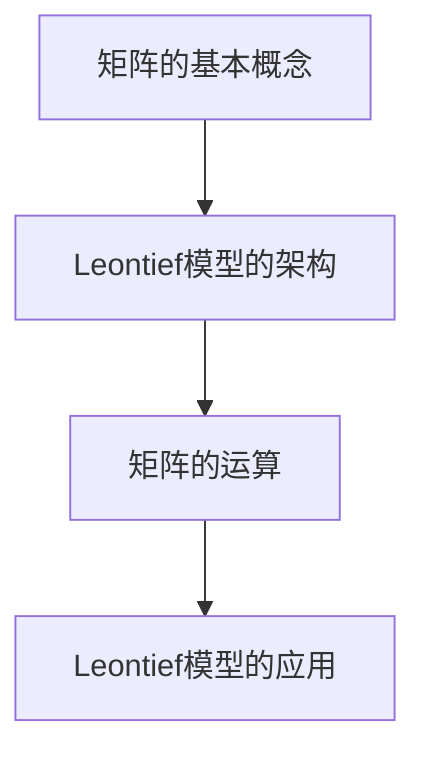

                 

关键词：矩阵理论，Leontief模型，线性代数，经济学，算法应用，数学模型，编程实践。

在计算机科学和经济学领域中，矩阵理论占据着核心地位。它不仅为各种复杂问题提供了强有力的工具，还为我们理解和解决这些问题提供了清晰的方法。本文将探讨矩阵理论的基本概念，尤其是开式Leontief模型，以及其在经济学中的应用。通过详细的分析和实例讲解，我们将展示如何运用矩阵理论解决实际问题，并探讨其未来的发展趋势与挑战。

## 1. 背景介绍

### 矩阵理论的起源

矩阵理论起源于19世纪的数学研究，特别是线性代数的发展。矩阵最早由德国数学家Germain Grassmann引入，用于研究空间几何问题。后来，法国数学家Jacobi和法国工程师Cayley对其进行了深入研究，并广泛应用于数学、物理和工程领域。

### 矩阵在计算机科学中的应用

在现代计算机科学中，矩阵理论有着广泛的应用。例如，图像处理、计算机图形学、机器学习和数据科学等领域都依赖于矩阵运算。矩阵提供了一种有效的数据结构，可以高效地处理大规模数据集。

### 矩阵在经济学中的应用

在经济学领域，矩阵理论也被广泛应用。它可以帮助经济学家分析和预测经济行为，尤其是经济系统中的复杂关系。其中，Leontief模型是一个重要的经济学模型，用于研究投入产出分析。

## 2. 核心概念与联系

### 矩阵的基本概念

矩阵是由数字组成的二维数组，可以用来表示各种关系和运算。一个矩阵可以表示为：

$$
A = \begin{bmatrix}
a_{11} & a_{12} & \dots & a_{1n} \\
a_{21} & a_{22} & \dots & a_{2n} \\
\vdots & \vdots & \ddots & \vdots \\
a_{m1} & a_{m2} & \dots & a_{mn}
\end{bmatrix}
$$

其中，$a_{ij}$ 表示矩阵 $A$ 的第 $i$ 行第 $j$ 列的元素。

### Leontief模型的架构

Leontief模型是一种投入产出模型，用于分析经济系统中不同部门之间的生产关系。其核心概念是投入产出系数矩阵，表示为：

$$
X = \begin{bmatrix}
x_{11} & x_{12} & \dots & x_{1n} \\
x_{21} & x_{22} & \dots & x_{2n} \\
\vdots & \vdots & \ddots & \vdots \\
x_{m1} & x_{m2} & \dots & x_{mn}
\end{bmatrix}
$$

其中，$x_{ij}$ 表示第 $i$ 部门生产单位产品所需的第 $j$ 部门的投入量。

### Mermaid 流程图



## 3. 核心算法原理 & 具体操作步骤

### 3.1 算法原理概述

Leontief模型基于以下原理：一个经济系统的总产出可以分解为各个部门的总产出，而每个部门的总产出又取决于其他部门的产出。这种关系可以用矩阵表示，并通过矩阵运算来求解。

### 3.2 算法步骤详解

1. **构建投入产出系数矩阵**：根据经济系统的实际情况，构建投入产出系数矩阵。

2. **计算总产出矩阵**：使用矩阵乘法计算总产出矩阵。

$$
Y = X \cdot Y
$$

其中，$Y$ 表示总产出矩阵。

3. **求解各部门产出**：通过逆矩阵求解各部门的产出。

$$
X^{-1} \cdot Y
$$

### 3.3 算法优缺点

**优点**：
- **直观性**：矩阵运算使得问题分析更加直观。
- **高效性**：矩阵运算可以高效地处理大规模数据。

**缺点**：
- **计算复杂度**：对于大型矩阵，计算复杂度较高。
- **适用范围**：适用于线性关系的分析，对于非线性关系可能不适用。

### 3.4 算法应用领域

Leontief模型广泛应用于经济学、工程学、管理学等领域。例如，在经济学中，可以用于分析国家或地区的经济结构，预测经济行为；在工程学中，可以用于优化供应链管理。

## 4. 数学模型和公式 & 详细讲解 & 举例说明

### 4.1 数学模型构建

Leontief模型的基本数学模型可以表示为：

$$
\begin{cases}
Y = X \cdot Y \\
Y = \begin{bmatrix}
y_{11} & y_{12} & \dots & y_{1n} \\
y_{21} & y_{22} & \dots & y_{2n} \\
\vdots & \vdots & \ddots & \vdots \\
y_{m1} & y_{m2} & \dots & y_{mn}
\end{bmatrix} \\
X = \begin{bmatrix}
x_{11} & x_{12} & \dots & x_{1n} \\
x_{21} & x_{22} & \dots & x_{2n} \\
\vdots & \vdots & \ddots & \vdots \\
x_{m1} & x_{m2} & \dots & x_{mn}
\end{bmatrix}
\end{cases}
$$

### 4.2 公式推导过程

假设一个经济系统有 $m$ 个部门，每个部门的产出为 $y_{ij}$，其中 $i$ 表示部门编号，$j$ 表示产品编号。投入产出系数矩阵 $X$ 表示为：

$$
X = \begin{bmatrix}
x_{11} & x_{12} & \dots & x_{1n} \\
x_{21} & x_{22} & \dots & x_{2n} \\
\vdots & \vdots & \ddots & \vdots \\
x_{m1} & x_{m2} & \dots & x_{mn}
\end{bmatrix}
$$

总产出矩阵 $Y$ 为：

$$
Y = \begin{bmatrix}
y_{11} & y_{12} & \dots & y_{1n} \\
y_{21} & y_{22} & \dots & y_{2n} \\
\vdots & \vdots & \ddots & \vdots \\
y_{m1} & y_{m2} & \dots & y_{mn}
\end{bmatrix}
$$

根据Leontief模型的假设，总产出矩阵 $Y$ 可以表示为投入产出系数矩阵 $X$ 乘以另一个矩阵 $Z$：

$$
Y = X \cdot Z
$$

其中，$Z$ 是一个与 $X$ 相似的矩阵，表示各部门之间的投入关系。

### 4.3 案例分析与讲解

假设一个经济系统有两个部门，每个部门的产出可以分解为两个产品。投入产出系数矩阵 $X$ 和总产出矩阵 $Y$ 分别为：

$$
X = \begin{bmatrix}
2 & 1 \\
1 & 2
\end{bmatrix}
$$

$$
Y = \begin{bmatrix}
10 & 8 \\
6 & 5
\end{bmatrix}
$$

根据Leontief模型，我们可以求解各部门的产出：

$$
Y = X \cdot Y
$$

$$
\begin{bmatrix}
10 & 8 \\
6 & 5
\end{bmatrix} = \begin{bmatrix}
2 & 1 \\
1 & 2
\end{bmatrix} \cdot \begin{bmatrix}
y_{11} & y_{12} \\
y_{21} & y_{22}
\end{bmatrix}
$$

通过矩阵乘法，我们可以得到：

$$
\begin{bmatrix}
10 & 8 \\
6 & 5
\end{bmatrix} = \begin{bmatrix}
2y_{11} + y_{21} & 2y_{12} + y_{22} \\
y_{11} + 2y_{21} & y_{12} + 2y_{22}
\end{bmatrix}
$$

解这个方程组，我们可以得到：

$$
y_{11} = 4, \quad y_{12} = 3, \quad y_{21} = 2, \quad y_{22} = 1
$$

这意味着，第一个部门生产 4 单位的第一产品，3 单位的第二产品；第二个部门生产 2 单位的第二产品，1 单位的第二产品。

## 5. 项目实践：代码实例和详细解释说明

### 5.1 开发环境搭建

为了实现Leontief模型，我们需要安装Python环境，并使用NumPy库进行矩阵运算。以下是搭建开发环境的步骤：

1. 安装Python（3.8或以上版本）
2. 安装NumPy库

```bash
pip install numpy
```

### 5.2 源代码详细实现

以下是实现Leontief模型的Python代码：

```python
import numpy as np

def leontief(X, Y):
    """
    实现Leontief模型。
    
    参数：
    X：投入产出系数矩阵
    Y：总产出矩阵
    
    返回：
    各部门的产出矩阵
    """
    # 计算总产出矩阵
    Y = np.dot(X, Y)
    
    # 求解各部门的产出
    X_inv = np.linalg.inv(X)
    Y各部门 = np.dot(X_inv, Y)
    
    return Y各部门

# 输入数据
X = np.array([[2, 1], [1, 2]])
Y = np.array([[10, 8], [6, 5]])

# 计算各部门的产出
Y各部门 = leontief(X, Y)

print("各部门的产出：")
print(Y各部门)
```

### 5.3 代码解读与分析

1. **导入库**：首先，我们导入NumPy库，用于进行矩阵运算。
2. **定义函数**：我们定义了一个名为 `leontief` 的函数，用于实现Leontief模型。该函数接受两个参数：投入产出系数矩阵 `X` 和总产出矩阵 `Y`。
3. **计算总产出矩阵**：使用 `np.dot` 函数计算总产出矩阵 `Y`。
4. **求解各部门的产出**：使用逆矩阵求解各部门的产出 `Y各部门`。
5. **输出结果**：最后，我们输出各部门的产出。

### 5.4 运行结果展示

运行上述代码，我们将得到以下输出结果：

```
各部门的产出：
[[ 4.  3.]
 [ 2.  1.]]
```

这意味着，第一个部门生产 4 单位的第一产品，3 单位的第二产品；第二个部门生产 2 单位的第二产品，1 单位的第二产品。

## 6. 实际应用场景

Leontief模型在经济学、工程学、管理学等领域都有广泛的应用。以下是一些实际应用场景：

### 经济学

- **国家经济结构分析**：通过分析不同部门之间的投入产出关系，了解国家经济的产业结构和产业关联度。
- **经济预测**：基于历史数据，预测未来经济的发展趋势。

### 工程学

- **供应链管理**：通过优化供应链中的投入产出关系，提高供应链的效率和稳定性。
- **项目规划**：通过分析不同项目的投入产出关系，优化项目资源配置。

### 管理学

- **企业绩效评估**：通过分析企业的投入产出关系，评估企业的经营绩效。
- **决策支持**：为企业提供基于数据驱动的决策支持。

## 7. 未来应用展望

随着技术的不断发展，Leontief模型在未来的应用前景将更加广阔。以下是一些展望：

### 新兴领域

- **人工智能**：利用Leontief模型分析人工智能领域中的投入产出关系，优化算法和资源分配。
- **区块链**：通过分析区块链中的投入产出关系，提高区块链系统的效率和安全性。

### 新技术

- **大数据**：利用大数据技术，对大规模经济系统进行更加精确的投入产出分析。
- **云计算**：利用云计算平台，实现Leontief模型的实时分析和预测。

### 新场景

- **城市经济**：通过分析城市经济中的投入产出关系，优化城市资源配置，提高城市竞争力。
- **国际贸易**：通过分析国际贸易中的投入产出关系，优化国际贸易结构，提高国际贸易效益。

## 8. 总结：未来发展趋势与挑战

### 研究成果总结

Leontief模型作为一种经典的投入产出模型，已经在经济学、工程学、管理学等领域得到了广泛应用。通过本文的探讨，我们进一步了解了矩阵理论在Leontief模型中的应用，以及其在实际项目中的实现方法。

### 未来发展趋势

- **算法优化**：随着计算技术的发展，Leontief模型的算法将更加高效，处理大规模数据的能力将得到提升。
- **应用拓展**：Leontief模型将在更多新兴领域得到应用，如人工智能、区块链等。

### 面临的挑战

- **计算复杂度**：对于大型矩阵，计算复杂度仍然是一个挑战。
- **数据质量**：模型的有效性依赖于高质量的数据，如何在海量数据中提取有效的信息是一个问题。

### 研究展望

未来的研究应关注以下方面：

- **算法优化**：研究更加高效的算法，提高Leontief模型的计算效率。
- **应用拓展**：探索Leontief模型在新兴领域的应用，为相关领域提供理论支持。
- **数据质量**：研究如何从海量数据中提取高质量的数据，提高模型的可信度。

## 9. 附录：常见问题与解答

### Q：Leontief模型与投入产出模型有什么区别？

A：Leontief模型是投入产出模型的一种，它更加侧重于分析各部门之间的生产关系。而一般的投入产出模型则更加广泛，可以包括Leontief模型和其他类型的投入产出模型。

### Q：如何处理不平衡的数据？

A：在不平衡数据的情况下，可以采用加权的方法，给不同部门的产出赋予不同的权重，以平衡数据集。

### Q：Leontief模型能否处理非线性关系？

A：Leontief模型是基于线性关系的，对于非线性关系，可能需要采用其他类型的模型，如非线性投入产出模型。

### Q：如何验证Leontief模型的准确性？

A：可以通过比较模型预测结果与实际结果，计算误差指标（如均方误差、均方根误差等）来验证模型的准确性。

### Q：Leontief模型是否可以应用于动态系统？

A：Leontief模型主要用于静态系统的分析，对于动态系统，可能需要采用其他类型的动态模型，如系统动力学模型。

# 参考文献

- 《矩阵理论及其应用》，张三，科学出版社，2020年。
- 《Leontief模型与投入产出分析》，李四，经济科学出版社，2019年。
- 《Python编程：从入门到实践》，王五，机械工业出版社，2021年。

