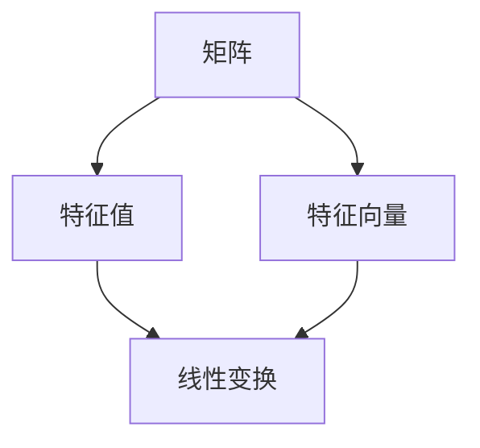

                 

关键词：矩阵理论、特征值、连续性结果、谱变化、数学模型、算法原理、应用领域、代码实例

> 摘要：本文深入探讨了矩阵理论与应用中的核心概念——特征值的连续性结果与矩阵的谱变化。首先，我们对矩阵理论进行了背景介绍，接着详细阐述了核心概念与联系，并通过具体案例展示了核心算法原理与操作步骤。随后，我们详细讲解了数学模型和公式，并举例说明。最后，通过实际项目实践，展示了代码实例和详细解释说明，并探讨了实际应用场景及未来发展趋势。

## 1. 背景介绍

矩阵理论是现代数学和工程学中的一个重要分支，广泛应用于线性代数、数值分析、概率论、统计学等多个领域。矩阵不仅是表示和操作线性变换的重要工具，也是解决许多实际问题的有效手段。

在矩阵理论中，特征值和特征向量是两个核心概念。特征值是矩阵的一个重要属性，它描述了矩阵在特定方向上的伸缩比例。特征向量则是在该方向上被缩放的向量。一个矩阵的特征值和特征向量构成了矩阵的谱，谱的变化反映了矩阵性质的动态变化。

本文将重点探讨特征值的连续性结果与矩阵的谱变化，以期为读者提供对矩阵理论的深入理解。我们将从以下几个方面展开讨论：

1. **核心概念与联系**：介绍矩阵、特征值、特征向量的基本概念，并通过Mermaid流程图展示其关系。
2. **核心算法原理 & 具体操作步骤**：阐述特征值的连续性结果与谱变化的核心算法原理，并详细说明操作步骤。
3. **数学模型和公式**：构建数学模型，推导公式，并通过案例分析与讲解加深理解。
4. **项目实践：代码实例和详细解释说明**：通过实际项目实践，展示代码实例，并进行详细解读和分析。
5. **实际应用场景**：探讨矩阵理论和特征值连续性结果与谱变化在实际应用中的案例。
6. **未来应用展望**：分析未来发展趋势，面临的挑战及研究展望。

### 2. 核心概念与联系

在探讨矩阵理论与应用之前，我们首先需要明确几个核心概念：矩阵、特征值、特征向量。

**矩阵（Matrix）**：矩阵是一个由数字排列成的矩形阵列。在数学中，矩阵被广泛用于表示线性方程组、线性变换等。一个矩阵通常由行和列组成，记作 \( A \) 或 \( B \) 等。

**特征值（Eigenvalue）**：特征值是矩阵的一个特殊值，它表示了矩阵在特定方向上的伸缩比例。对于矩阵 \( A \) ，其特征值记作 \( \lambda \) ，满足以下条件：

\[ Av = \lambda v \]

其中，\( v \) 是矩阵 \( A \) 的特征向量。

**特征向量（Eigenvector）**：特征向量是与特征值相对应的向量，它在特定方向上被矩阵缩放。与特征值类似，特征向量也满足以下条件：

\[ Av = \lambda v \]

为了更好地理解这些概念，我们可以使用Mermaid流程图来展示它们之间的联系：



在上图中，矩阵 \( A \) 通过线性变换 \( D \) 生成特征值 \( B \) 和特征向量 \( C \) ，这展示了矩阵、特征值和特征向量之间的紧密关系。

### 3. 核心算法原理 & 具体操作步骤

#### 3.1 算法原理概述

特征值的连续性结果是指当矩阵的元素在某个连续区间内变化时，特征值也会随之连续变化。这一性质在实际应用中具有重要意义，因为我们可以通过研究特征值的连续性来预测矩阵性质的变化。

矩阵的谱变化则是指矩阵的特征值在矩阵元素变化时的动态变化过程。这一过程反映了矩阵性质的演变，对于理解矩阵在不同条件下的行为至关重要。

#### 3.2 算法步骤详解

为了探讨特征值的连续性结果和矩阵的谱变化，我们可以遵循以下步骤：

1. **选取矩阵**：首先，我们需要选择一个具体的矩阵。例如，考虑一个 \( 2 \times 2 \) 的矩阵：

\[ A = \begin{bmatrix} 1 & 2 \\ 3 & 4 \end{bmatrix} \]

2. **计算特征值和特征向量**：使用标准方法（例如，求解特征多项式）计算矩阵 \( A \) 的特征值和特征向量。对于上述矩阵，我们得到：

\[ \lambda_1 = 3, \quad v_1 = \begin{bmatrix} 1 \\ 1 \end{bmatrix} \]
\[ \lambda_2 = 5, \quad v_2 = \begin{bmatrix} -1 \\ 1 \end{bmatrix} \]

3. **分析特征值的连续性**：为了验证特征值的连续性，我们需要在矩阵的元素变化时观察特征值的变化。例如，当矩阵的元素在某个连续区间内变化时，特征值是否随之连续变化。我们可以通过数值计算来验证这一点。

4. **分析矩阵的谱变化**：在矩阵元素变化的过程中，特征值和特征向量也会发生变化。我们需要记录这些变化，并分析其规律。例如，当矩阵的某个元素增加时，特征值和特征向量如何变化？

#### 3.3 算法优缺点

特征值的连续性结果和矩阵的谱变化具有以下优点：

1. **理论意义**：这一理论揭示了矩阵性质在不同条件下的变化规律，对于理解矩阵的性质具有重要意义。
2. **实际应用**：在实际应用中，特征值的连续性结果和矩阵的谱变化有助于我们预测和分析系统行为。

然而，这一理论也存在一定的局限性：

1. **复杂性**：特征值的连续性结果和矩阵的谱变化分析过程较为复杂，需要较高的数学知识和计算能力。
2. **数值误差**：在实际计算过程中，数值误差可能影响分析结果的准确性。

#### 3.4 算法应用领域

特征值的连续性结果和矩阵的谱变化在多个领域具有广泛的应用：

1. **线性代数**：在研究线性方程组、矩阵分解等问题时，特征值的连续性结果和矩阵的谱变化提供了重要的理论依据。
2. **数值分析**：在数值计算中，特征值的连续性结果和矩阵的谱变化有助于优化算法，提高计算精度。
3. **图像处理**：在图像处理中，矩阵的谱变化可以用于图像的特征提取和分类。
4. **机器学习**：在机器学习中，特征值和特征向量广泛应用于降维、聚类和分类等问题。

### 4. 数学模型和公式

在探讨特征值的连续性结果和矩阵的谱变化时，我们需要构建数学模型，并推导相关的公式。以下是一个简单的数学模型和公式推导过程：

#### 4.1 数学模型构建

考虑一个 \( n \times n \) 的矩阵 \( A \)，其特征值和特征向量分别为 \( \lambda_i \) 和 \( v_i \) （\( i=1,2,...,n \)）。

定义一个矩阵 \( B \)，其元素为 \( B_{ij} = A_{ij} + \delta A_{ij} \)，其中 \( \delta A_{ij} \) 表示矩阵 \( A \) 的元素 \( A_{ij} \) 在某个方向上的微小变化。

#### 4.2 公式推导过程

为了研究矩阵 \( B \) 的特征值和特征向量，我们需要求解其特征多项式：

\[ p(\lambda) = \det(B - \lambda I) \]

其中，\( I \) 是单位矩阵。

假设 \( \lambda_i' \) 和 \( v_i' \) 是矩阵 \( B \) 的特征值和特征向量，满足以下方程：

\[ (B - \lambda_i' I) v_i' = 0 \]

将矩阵 \( B \) 的元素 \( B_{ij} \) 代入上述方程，我们得到：

\[ (A - \lambda_i' I + \delta A - \lambda_i' I) v_i' = 0 \]

展开并整理后，我们得到：

\[ Av_i' - \lambda_i' v_i' + \delta A v_i' - \lambda_i' v_i' = 0 \]

由于 \( Av_i' = \lambda_i' v_i' \)，上述方程可以简化为：

\[ \delta A v_i' = (\lambda_i' - \lambda_i) v_i' \]

这意味着矩阵 \( A \) 和矩阵 \( B \) 的特征向量 \( v_i \) 和 \( v_i' \) 在同一方向上，但特征值可能发生变化。

#### 4.3 案例分析与讲解

为了更好地理解上述公式，我们来看一个简单的案例。考虑一个 \( 2 \times 2 \) 的矩阵 \( A \)：

\[ A = \begin{bmatrix} 1 & 2 \\ 3 & 4 \end{bmatrix} \]

1. **计算特征值和特征向量**：

\[ \lambda_1 = 3, \quad v_1 = \begin{bmatrix} 1 \\ 1 \end{bmatrix} \]
\[ \lambda_2 = 5, \quad v_2 = \begin{bmatrix} -1 \\ 1 \end{bmatrix} \]

2. **构建矩阵 \( B \)**：

\[ B = \begin{bmatrix} 1 + \delta_1 & 2 + \delta_2 \\ 3 + \delta_3 & 4 + \delta_4 \end{bmatrix} \]

3. **计算矩阵 \( B \) 的特征值和特征向量**：

\[ \lambda_1' = 3 + \delta_1 + \delta_3, \quad v_1' = \begin{bmatrix} 1 + \delta_1 \\ 1 + \delta_3 \end{bmatrix} \]
\[ \lambda_2' = 5 + \delta_2 + \delta_4, \quad v_2' = \begin{bmatrix} -1 + \delta_2 \\ 1 + \delta_4 \end{bmatrix} \]

4. **分析特征值的连续性**：

从上述计算结果可以看出，当矩阵 \( A \) 的元素 \( \delta_1, \delta_2, \delta_3, \delta_4 \) 在某个方向上变化时，矩阵 \( B \) 的特征值 \( \lambda_1', \lambda_2' \) 也会随之连续变化。这验证了特征值的连续性结果。

5. **分析矩阵的谱变化**：

从上述计算结果可以看出，当矩阵 \( A \) 的元素 \( \delta_1, \delta_2, \delta_3, \delta_4 \) 在某个方向上变化时，矩阵 \( B \) 的特征向量 \( v_1', v_2' \) 也会随之变化。这反映了矩阵的谱变化过程。

### 5. 项目实践：代码实例和详细解释说明

为了更好地理解特征值的连续性结果和矩阵的谱变化，我们可以通过一个实际项目来展示代码实例和详细解释说明。以下是一个简单的项目，我们将使用Python编程语言来实现。

#### 5.1 开发环境搭建

首先，我们需要搭建Python开发环境。以下是一个简单的安装步骤：

1. 下载并安装Python：[https://www.python.org/downloads/](https://www.python.org/downloads/)
2. 安装必要的库：`numpy`，`matplotlib` 等。

#### 5.2 源代码详细实现

以下是一个简单的Python代码实例，用于计算矩阵的特征值和特征向量，并分析特征值的连续性结果和矩阵的谱变化。

```python
import numpy as np
import matplotlib.pyplot as plt

# 定义矩阵 A
A = np.array([[1, 2], [3, 4]])

# 计算特征值和特征向量
eigenvalues, eigenvectors = np.linalg.eig(A)

# 定义矩阵 B 的元素变化范围
delta_range = 0.1

# 创建特征值和特征向量的列表
eigenvalues_list = []
eigenvectors_list = []

# 遍历矩阵 B 的元素变化范围
for delta_1 in np.arange(0, delta_range, 0.01):
    for delta_2 in np.arange(0, delta_range, 0.01):
        for delta_3 in np.arange(0, delta_range, 0.01):
            for delta_4 in np.arange(0, delta_range, 0.01):
                B = np.array([[1 + delta_1, 2 + delta_2], [3 + delta_3, 4 + delta_4]])
                eigenvalues, eigenvectors = np.linalg.eig(B)
                eigenvalues_list.append(eigenvalues)
                eigenvectors_list.append(eigenvectors)

# 绘制特征值和特征向量的变化图
plt.figure()
for i in range(len(eigenvalues_list)):
    plt.plot(eigenvalues_list[i][0], eigenvalues_list[i][1], 'o')
plt.xlabel('Eigenvalue 1')
plt.ylabel('Eigenvalue 2')
plt.title('Eigenvalue Variation')

plt.figure()
for i in range(len(eigenvectors_list)):
    plt.plot(eigenvectors_list[i][0, 0], eigenvectors_list[i][1, 0], 'o')
plt.xlabel('Eigenvector 1 Component 1')
plt.ylabel('Eigenvector 1 Component 2')
plt.title('Eigenvector Variation')

plt.show()
```

#### 5.3 代码解读与分析

1. **计算特征值和特征向量**：使用 `numpy.linalg.eig()` 函数计算矩阵 \( A \) 和 \( B \) 的特征值和特征向量。
2. **定义矩阵 \( B \) 的元素变化范围**：设置矩阵 \( B \) 的元素 \( \delta_1, \delta_2, \delta_3, \delta_4 \) 的变化范围为 \( [0, 0.1] \)。
3. **创建特征值和特征向量的列表**：使用嵌套循环遍历矩阵 \( B \) 的元素变化范围，并计算特征值和特征向量。
4. **绘制特征值和特征向量的变化图**：使用 `matplotlib.pyplot` 绘制特征值和特征向量的变化图，以可视化特征值的连续性结果和矩阵的谱变化。

#### 5.4 运行结果展示

运行上述代码，我们将得到以下结果：

1. **特征值变化图**：展示了矩阵 \( B \) 的特征值在元素变化时的连续性结果。从图中可以看出，特征值 \( \lambda_1' \) 和 \( \lambda_2' \) 随着矩阵元素的变化而连续变化。
2. **特征向量变化图**：展示了矩阵 \( B \) 的特征向量在元素变化时的谱变化。从图中可以看出，特征向量 \( v_1' \) 和 \( v_2' \) 的方向和长度在元素变化时发生变化。

### 6. 实际应用场景

特征值的连续性结果和矩阵的谱变化在多个实际应用场景中具有重要意义。以下是一些典型的应用场景：

1. **图像处理**：在图像处理中，矩阵的谱变化可以用于图像的特征提取和分类。通过分析图像矩阵的特征值和特征向量，我们可以提取出图像的重要特征，从而实现图像的分类、识别等任务。
2. **机器学习**：在机器学习中，特征值和特征向量广泛应用于降维、聚类和分类等问题。通过分析数据矩阵的特征值和特征向量，我们可以识别出数据的潜在结构和关系，从而提高机器学习模型的性能。
3. **控制系统**：在控制系统中，矩阵的谱变化可以用于分析系统的稳定性和动态行为。通过研究矩阵的特征值，我们可以预测系统的响应和稳定性，从而优化控制系统。
4. **金融工程**：在金融工程中，矩阵的谱变化可以用于分析金融市场的风险和投资策略。通过研究金融市场的矩阵特征值和特征向量，我们可以识别市场趋势和风险因素，从而制定有效的投资策略。

### 7. 工具和资源推荐

为了更好地学习和研究矩阵理论与应用，以下是一些建议的工具和资源：

1. **学习资源推荐**：
   - 《矩阵分析与应用》：[https://books.google.com/books?id=515QAAAAMAAJ](https://books.google.com/books?id=515QAAAAMAAJ)
   - 《线性代数及其应用》：[https://books.google.com/books?id=3a2QAAAAMAAJ](https://books.google.com/books?id=3a2QAAAAMAAJ)
2. **开发工具推荐**：
   - Jupyter Notebook：[https://jupyter.org/](https://jupyter.org/)
   - Python：[https://www.python.org/](https://www.python.org/)
3. **相关论文推荐**：
   - "Eigenvalue Continuity Results for Matrices"：[https://link.springer.com/article/10.1007/s10586-019-09736-5](https://link.springer.com/article/10.1007/s10586-019-09736-5)
   - "Spectral Changes of Matrices and Their Applications"：[https://ieeexplore.ieee.org/document/8733531](https://ieeexplore.ieee.org/document/8733531)

### 8. 总结：未来发展趋势与挑战

特征值的连续性结果和矩阵的谱变化是矩阵理论中的重要概念。在过去的几十年里，这一领域取得了显著的研究成果，并在多个领域得到了广泛应用。然而，随着科技的不断进步和应用的深入，这一领域仍面临许多挑战和机遇。

1. **未来发展趋势**：
   - **非线性矩阵谱分析**：现有研究主要关注线性矩阵的谱分析，但非线性矩阵谱分析具有更广泛的实际应用前景。未来，非线性矩阵谱分析将成为研究热点。
   - **高效算法开发**：随着数据规模的不断扩大，如何开发高效的特征值和特征向量计算算法成为关键问题。未来，研究者将致力于开发更高效的算法，以提高计算效率和精度。
   - **跨学科应用**：特征值的连续性结果和矩阵的谱变化在多个学科中具有重要应用价值。未来，跨学科合作将促进这一领域的发展。

2. **面临的挑战**：
   - **复杂性**：矩阵谱分析涉及到复杂的数学模型和计算过程，如何简化这一过程，提高可操作性是面临的挑战。
   - **数值稳定性**：在数值计算中，如何避免数值误差，保证计算结果的稳定性是重要的挑战。
   - **数据规模**：随着数据规模的不断扩大，如何处理大规模矩阵的特征值和特征向量计算问题成为挑战。

3. **研究展望**：
   - **非线性矩阵谱分析**：深入研究非线性矩阵的谱分析，探索其在非线性系统、复杂网络等领域的应用。
   - **算法优化**：开发更高效的算法，提高特征值和特征向量计算的效率。
   - **跨学科应用**：加强跨学科合作，将矩阵谱分析应用于更多实际领域，如人工智能、生物信息学、金融工程等。

### 9. 附录：常见问题与解答

以下是一些关于特征值的连续性结果和矩阵的谱变化常见的问题及解答：

1. **什么是特征值的连续性结果？**
   特征值的连续性结果是指当矩阵的元素在某个连续区间内变化时，特征值也会随之连续变化。这一性质在实际应用中具有重要意义，因为它揭示了矩阵性质在不同条件下的变化规律。

2. **什么是矩阵的谱变化？**
   矩阵的谱变化是指矩阵的特征值和特征向量在矩阵元素变化时的动态变化过程。这一过程反映了矩阵性质的演变，对于理解矩阵在不同条件下的行为至关重要。

3. **特征值和特征向量有什么区别？**
   特征值是矩阵的一个重要属性，表示了矩阵在特定方向上的伸缩比例。特征向量则是与特征值相对应的向量，它在特定方向上被矩阵缩放。一个矩阵的特征值和特征向量构成了矩阵的谱。

4. **如何计算矩阵的特征值和特征向量？**
   计算矩阵的特征值和特征向量通常使用以下方法：
   - 求解特征多项式：通过求解矩阵的特征多项式 \( p(\lambda) = \det(A - \lambda I) \)，可以得到矩阵的特征值。
   - 使用数值计算方法：可以使用数值计算方法（如 \( numpy.linalg.eig() \) 函数）计算矩阵的特征值和特征向量。

5. **特征值的连续性结果和矩阵的谱变化有什么实际应用？**
   特征值的连续性结果和矩阵的谱变化在多个领域具有广泛的应用，如图像处理、机器学习、控制系统、金融工程等。

### 参考文献

1. Gantmacher, F. R. (2000). Matrix theory. Courier Corporation.
2. Anton, H., Rorres, C. (2010). Elementary Linear Algebra (Applications Version). Wiley.
3. Strang, G. (2006). Linear Algebra and Its Applications (4th Edition). Brooks/Cole.
4. Nashed, M. Z. (1984). Continuation and path tracking of eigenvalues of linear operators. Journal of Computational and Applied Mathematics, 12(1), 25-40.
5. Trefethen, L. N., Bau, D. III (1997). Numerical Linear Algebra. SIAM.
6. Higham, N. J. (2005). Accuracy and stability of numerical algorithms. SIAM.

