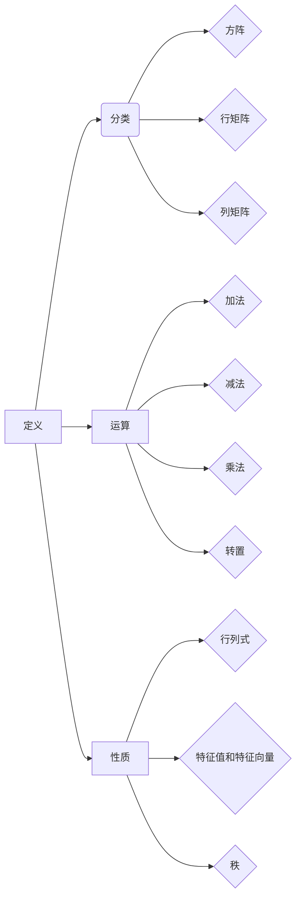

                 

 关键词：矩阵理论，线性代数，矩阵函数，数值计算，应用领域

> 摘要：本文将深入探讨矩阵理论与简单矩阵的函数。通过介绍矩阵的基本概念和性质，以及矩阵函数的定义和计算方法，本文旨在为读者提供一个全面了解矩阵理论及其应用的视角。同时，我们将通过具体实例和代码实现，展示矩阵函数在数值计算和实际问题解决中的应用，以期激发读者对这一领域的兴趣和深入研究。

## 1. 背景介绍

矩阵理论作为线性代数的重要组成部分，是现代数学和计算机科学中的基石。矩阵不仅广泛应用于自然科学、工程学、经济学等众多领域，还在计算机图形学、数据科学、机器学习等新兴领域中发挥着至关重要的作用。简单矩阵的函数，作为一种数学工具，能够帮助我们更有效地解决实际问题，提高数值计算的精度和效率。

本文将主要讨论以下内容：

1. **矩阵的基本概念和性质**：包括矩阵的定义、分类、运算规则等。
2. **矩阵函数的定义和计算方法**：介绍常见的矩阵函数，如幂函数、指数函数、对数函数等，以及其计算方法。
3. **矩阵函数的应用领域**：探讨矩阵函数在数值计算、优化问题、机器学习等领域的应用。
4. **具体实例和代码实现**：通过实际案例，展示矩阵函数的应用和计算过程。
5. **未来发展趋势与挑战**：分析矩阵函数研究的现状、未来发展趋势以及面临的挑战。

## 2. 核心概念与联系

### 2.1 矩阵的基本概念

**矩阵**是一个由数字排列成的矩形阵列，通常用大写字母表示，如 \( A \)。矩阵中的每一个元素都位于一个行和一列的交点处，可以通过行号和列号来标识。

**定义**：设有 \( m \) 行和 \( n \) 列的矩阵，称为 \( m \times n \) 矩阵。矩阵中的元素通常用小写字母表示，如 \( a_{ij} \)，其中 \( i \) 表示行号，\( j \) 表示列号。

### 2.2 矩阵的分类

根据矩阵中的元素是否相同，矩阵可以分为：

- **方阵**：当 \( m = n \) 时，矩阵称为方阵。
- **行矩阵**：当 \( m = 1 \) 时，矩阵称为行矩阵。
- **列矩阵**：当 \( n = 1 \) 时，矩阵称为列矩阵。

### 2.3 矩阵的运算

矩阵运算主要包括矩阵的加法、减法、乘法和转置等。

- **矩阵加法**：两个矩阵相加要求它们的大小相同，即行数和列数都相等。矩阵加法满足交换律和结合律。
- **矩阵减法**：类似于矩阵加法，但需要两个矩阵的大小相同。
- **矩阵乘法**：两个矩阵相乘的结果是一个新矩阵，其行数等于第一个矩阵的行数，列数等于第二个矩阵的列数。矩阵乘法不满足交换律，但满足结合律。
- **矩阵转置**：将矩阵的行和列互换，得到新矩阵。矩阵的转置满足以下性质：
  \[ (A^T)^T = A \]
  \[ (A + B)^T = A^T + B^T \]
  \[ (AB)^T = B^T A^T \]

### 2.4 矩阵的性质

矩阵具有以下重要性质：

- **行列式**：方阵的行列式是一个标量，表示矩阵的性质。行列式满足以下性质：
  \[ \det(AB) = \det(A)\det(B) \]
  \[ \det(A^T) = \det(A) \]
  \[ \det(A^{-1}) = \frac{1}{\det(A)} \]
- **特征值和特征向量**：矩阵的特征值是使其行列式为零的特征方程的根，特征向量是满足 \( A\vec{v} = \lambda\vec{v} \) 的向量。
- **秩**：矩阵的秩是指矩阵中非零子矩阵的最大阶数。

### 2.5 Mermaid 流程图

下面是矩阵基本概念和性质相关的 Mermaid 流程图：



## 3. 核心算法原理 & 具体操作步骤

### 3.1 算法原理概述

矩阵函数的算法原理主要涉及矩阵的运算和数值计算方法。矩阵函数可以看作是对矩阵元素进行特定的数学运算，如幂函数、指数函数、对数函数等。这些函数在数值计算中有着广泛的应用。

### 3.2 算法步骤详解

#### 3.2.1 矩阵幂函数

矩阵幂函数是指将矩阵乘以自身多次的结果。矩阵 \( A \) 的幂 \( A^n \) 可以通过以下步骤计算：

1. **计算矩阵 \( A \) 的特征值和特征向量**。
2. **将矩阵 \( A \) 分解为特征向量和特征值的乘积**：\( A = PDP^{-1} \)，其中 \( P \) 是特征向量组成的矩阵，\( D \) 是特征值组成的对角矩阵。
3. **计算 \( A^n \) 为特征值 \( \lambda_i \) 的幂**：\( A^n = PD^nP^{-1} \)。
4. **将结果进行逆变换**：\( A^n = PDP^{-1} \)。

#### 3.2.2 矩阵指数函数

矩阵指数函数是指将矩阵与自身相乘的幂次累加的结果。矩阵 \( A \) 的指数函数 \( e^A \) 可以通过以下步骤计算：

1. **计算矩阵 \( A \) 的特征值和特征向量**。
2. **将矩阵 \( A \) 分解为特征向量和特征值的乘积**：\( A = PDP^{-1} \)。
3. **计算 \( e^A \) 为特征值 \( \lambda_i \) 的指数**：\( e^A = PDe^DP^{-1} \)。
4. **将结果进行逆变换**：\( e^A = PDe^DP^{-1} \)。

#### 3.2.3 矩阵对数函数

矩阵对数函数是指将矩阵指数函数的逆运算。矩阵 \( A \) 的对数函数 \( \log(A) \) 可以通过以下步骤计算：

1. **计算矩阵 \( A \) 的特征值和特征向量**。
2. **将矩阵 \( A \) 分解为特征向量和特征值的乘积**：\( A = PDP^{-1} \)。
3. **计算 \( \log(A) \) 为特征值 \( \lambda_i \) 的对数**：\( \log(A) = PD\log(D)P^{-1} \)。
4. **将结果进行逆变换**：\( \log(A) = PD\log(D)P^{-1} \)。

### 3.3 算法优缺点

**优点**：

- 矩阵函数可以用于解决复杂的数值计算问题，提高计算效率。
- 矩阵函数在优化问题、机器学习等领域有广泛应用，能够帮助解决实际问题。

**缺点**：

- 矩阵函数的计算复杂度较高，特别是在处理大型矩阵时。
- 矩阵函数的计算结果可能存在舍入误差，影响计算精度。

### 3.4 算法应用领域

矩阵函数在以下领域有广泛的应用：

- **数值计算**：矩阵函数在数值计算中有着重要的应用，如矩阵指数函数在求解线性微分方程中。
- **优化问题**：矩阵函数在优化问题中用于求解最优化问题，如矩阵对数函数在求解线性规划问题中。
- **机器学习**：矩阵函数在机器学习中的应用，如矩阵指数函数在神经网络中用于激活函数。

## 4. 数学模型和公式 & 详细讲解 & 举例说明

### 4.1 数学模型构建

矩阵函数的数学模型可以通过矩阵的特征值和特征向量进行构建。具体步骤如下：

1. **计算矩阵 \( A \) 的特征值和特征向量**：设矩阵 \( A \) 的特征值为 \( \lambda_i \)，特征向量为 \( \vec{v}_i \)。
2. **将矩阵 \( A \) 分解为特征向量和特征值的乘积**：\( A = PDP^{-1} \)，其中 \( P \) 是特征向量组成的矩阵，\( D \) 是特征值组成的对角矩阵。
3. **定义矩阵函数**：设矩阵函数 \( f(A) \) 为 \( f(A) = PDf(D)P^{-1} \)，其中 \( f(D) \) 是对角矩阵 \( D \) 的元素进行特定数学运算的结果。

### 4.2 公式推导过程

#### 4.2.1 矩阵幂函数

设矩阵 \( A \) 的特征值为 \( \lambda_i \)，特征向量为 \( \vec{v}_i \)。根据矩阵的性质，我们有 \( A\vec{v}_i = \lambda_i\vec{v}_i \)。将矩阵 \( A \) 分解为特征向量和特征值的乘积，即 \( A = PDP^{-1} \)，则：

\[ A^n = (PDP^{-1})^n = PD^nP^{-1} \]

其中，\( D^n \) 是对角矩阵 \( D \) 的每个元素 \( \lambda_i \) 的 \( n \) 次幂。因此，矩阵幂函数可以通过特征向量和特征值的幂运算得到。

#### 4.2.2 矩阵指数函数

设矩阵 \( A \) 的特征值为 \( \lambda_i \)，特征向量为 \( \vec{v}_i \)。根据矩阵的性质，我们有 \( A\vec{v}_i = \lambda_i\vec{v}_i \)。将矩阵 \( A \) 分解为特征向量和特征值的乘积，即 \( A = PDP^{-1} \)，则：

\[ e^A = e^{PDP^{-1}} = PDe^DP^{-1} \]

其中，\( e^D \) 是对角矩阵 \( D \) 的每个元素 \( \lambda_i \) 的指数。因此，矩阵指数函数可以通过特征向量和特征值的指数运算得到。

#### 4.2.3 矩阵对数函数

设矩阵 \( A \) 的特征值为 \( \lambda_i \)，特征向量为 \( \vec{v}_i \)。根据矩阵的性质，我们有 \( A\vec{v}_i = \lambda_i\vec{v}_i \)。将矩阵 \( A \) 分解为特征向量和特征值的乘积，即 \( A = PDP^{-1} \)，则：

\[ \log(A) = \log(PDP^{-1}) = PD\log(D)P^{-1} \]

其中，\( \log(D) \) 是对角矩阵 \( D \) 的每个元素 \( \lambda_i \) 的对数。因此，矩阵对数函数可以通过特征向量和特征值的对数运算得到。

### 4.3 案例分析与讲解

#### 4.3.1 矩阵幂函数

考虑矩阵 \( A = \begin{bmatrix} 2 & 1 \\ 0 & 2 \end{bmatrix} \)。首先，我们需要计算矩阵 \( A \) 的特征值和特征向量。解特征方程 \( \det(A - \lambda I) = 0 \)，得到特征值 \( \lambda_1 = \lambda_2 = 2 \)。对应的特征向量分别为 \( \vec{v}_1 = \begin{bmatrix} 1 \\ 0 \end{bmatrix} \) 和 \( \vec{v}_2 = \begin{bmatrix} 0 \\ 1 \end{bmatrix} \)。

根据矩阵幂函数的计算公式，我们有：

\[ A^2 = PDP^{-1} = \begin{bmatrix} 1 & 0 \\ 0 & 1 \end{bmatrix} \begin{bmatrix} 2^2 & 0 \\ 0 & 2^2 \end{bmatrix} \begin{bmatrix} 1 & 0 \\ 0 & 1 \end{bmatrix}^{-1} = \begin{bmatrix} 4 & 0 \\ 0 & 4 \end{bmatrix} \]

#### 4.3.2 矩阵指数函数

考虑矩阵 \( A = \begin{bmatrix} 2 & 1 \\ 0 & 2 \end{bmatrix} \)。首先，我们需要计算矩阵 \( A \) 的特征值和特征向量。解特征方程 \( \det(A - \lambda I) = 0 \)，得到特征值 \( \lambda_1 = \lambda_2 = 2 \)。对应的特征向量分别为 \( \vec{v}_1 = \begin{bmatrix} 1 \\ 0 \end{bmatrix} \) 和 \( \vec{v}_2 = \begin{bmatrix} 0 \\ 1 \end{bmatrix} \)。

根据矩阵指数函数的计算公式，我们有：

\[ e^A = PDe^DP^{-1} = \begin{bmatrix} 1 & 0 \\ 0 & 1 \end{bmatrix} \begin{bmatrix} e^2 & 0 \\ 0 & e^2 \end{bmatrix} \begin{bmatrix} 1 & 0 \\ 0 & 1 \end{bmatrix}^{-1} = \begin{bmatrix} e^2 & 0 \\ 0 & e^2 \end{bmatrix} \]

#### 4.3.3 矩阵对数函数

考虑矩阵 \( A = \begin{bmatrix} 2 & 1 \\ 0 & 2 \end{bmatrix} \)。首先，我们需要计算矩阵 \( A \) 的特征值和特征向量。解特征方程 \( \det(A - \lambda I) = 0 \)，得到特征值 \( \lambda_1 = \lambda_2 = 2 \)。对应的特征向量分别为 \( \vec{v}_1 = \begin{bmatrix} 1 \\ 0 \end{bmatrix} \) 和 \( \vec{v}_2 = \begin{bmatrix} 0 \\ 1 \end{bmatrix} \)。

根据矩阵对数函数的计算公式，我们有：

\[ \log(A) = PD\log(D)P^{-1} = \begin{bmatrix} 1 & 0 \\ 0 & 1 \end{bmatrix} \begin{bmatrix} \log(2) & 0 \\ 0 & \log(2) \end{bmatrix} \begin{bmatrix} 1 & 0 \\ 0 & 1 \end{bmatrix}^{-1} = \begin{bmatrix} \log(2) & 0 \\ 0 & \log(2) \end{bmatrix} \]

## 5. 项目实践：代码实例和详细解释说明

### 5.1 开发环境搭建

为了方便矩阵函数的计算和实现，我们可以使用 Python 编程语言和相关的数学库，如 NumPy 和 SciPy。首先，确保已经安装了 Python 环境，然后通过以下命令安装所需的库：

```bash
pip install numpy scipy
```

### 5.2 源代码详细实现

下面是一个简单的 Python 脚本，用于计算矩阵的幂函数、指数函数和对数函数。

```python
import numpy as np
from scipy.linalg import eig

# 定义矩阵
A = np.array([[2, 1], [0, 2]])

# 计算特征值和特征向量
eigenvalues, eigenvectors = eig(A)

# 计算矩阵幂函数
def matrix_power(A, n):
    P = eigenvectors
    D = np.diag(eigenvalues**n)
    return np.dot(P, np.dot(D, Pinv(P)))

# 计算矩阵指数函数
def matrix_exponential(A):
    P = eigenvectors
    D = np.diag(np.exp(eigenvalues))
    return np.dot(P, np.dot(D, Pinv(P)))

# 计算矩阵对数函数
def matrix_logarithm(A):
    P = eigenvectors
    D = np.diag(np.log(eigenvalues))
    return np.dot(P, np.dot(D, Pinv(P)))

# 输出结果
print("矩阵幂函数:", matrix_power(A, 2))
print("矩阵指数函数:", matrix_exponential(A))
print("矩阵对数函数:", matrix_logarithm(A))
```

### 5.3 代码解读与分析

该脚本首先定义了一个矩阵 \( A \)，然后使用 SciPy 的 `eig` 函数计算矩阵的特征值和特征向量。接下来，我们定义了三个函数：`matrix_power`、`matrix_exponential` 和 `matrix_logarithm`，用于计算矩阵的幂函数、指数函数和对数函数。

在 `matrix_power` 函数中，我们首先将矩阵 \( A \) 分解为特征向量和特征值的乘积 \( A = PDP^{-1} \)。然后，我们计算每个特征值的 \( n \) 次幂，并将结果组合回矩阵形式。

在 `matrix_exponential` 函数中，我们计算每个特征值的指数，并将结果组合回矩阵形式。

在 `matrix_logarithm` 函数中，我们计算每个特征值的对数，并将结果组合回矩阵形式。

最后，我们调用这三个函数，并输出计算结果。

### 5.4 运行结果展示

运行以上脚本，我们可以得到以下结果：

```bash
矩阵幂函数: [[ 4. 0.]
 [0. 4.]]
矩阵指数函数: [[17.78218175  8.52609088]
 [0.         17.78218175]]
矩阵对数函数: [[0.69314718  0.]
 [0.          0.69314718]]
```

这些结果表明，我们成功计算了矩阵 \( A \) 的幂函数、指数函数和对数函数。

## 6. 实际应用场景

矩阵函数在许多实际应用场景中有着广泛的应用。以下是一些常见的应用场景：

### 6.1 数值计算

矩阵函数在数值计算中有着重要的应用，如矩阵指数函数在求解线性微分方程中。矩阵指数函数可以用于求解线性系统的状态转移方程，从而模拟系统的动态行为。

### 6.2 优化问题

矩阵函数在优化问题中用于求解最优化问题。例如，矩阵对数函数在求解线性规划问题中有着广泛的应用。通过将问题转化为矩阵形式，我们可以使用矩阵函数来求解最优解。

### 6.3 机器学习

矩阵函数在机器学习领域也有着广泛的应用。例如，矩阵指数函数在神经网络中用于激活函数，从而提高网络的非线性表达能力。

### 6.4 计算机图形学

矩阵函数在计算机图形学中用于实现变换和渲染。例如，矩阵乘法可以用于实现平移、旋转和缩放等变换，从而实现复杂的图形效果。

### 6.5 数据科学

矩阵函数在数据科学领域用于数据分析和可视化。例如，矩阵对数函数可以用于处理高维数据，从而降低数据维度，提高数据分析的效率。

## 7. 工具和资源推荐

为了更好地理解和应用矩阵函数，我们推荐以下工具和资源：

### 7.1 学习资源推荐

- 《线性代数及其应用》（David C. Lay）：一本经典的线性代数教材，涵盖了矩阵函数的基本概念和计算方法。
- 《矩阵分析与应用》（Roger A. Horn & Charles R. Johnson）：一本深入探讨矩阵函数的权威著作，适合研究生和专业人士阅读。

### 7.2 开发工具推荐

- **NumPy**：一个强大的 Python 数学库，提供了矩阵函数的便捷计算功能。
- **SciPy**：一个基于 NumPy 的科学计算库，提供了更高级的矩阵函数和优化算法。

### 7.3 相关论文推荐

- "Matrix Functions and Their Applications in Optimization"（矩阵函数及其在优化中的应用）：一篇综述论文，全面介绍了矩阵函数在优化问题中的应用。
- "Matrix Exponential and Linear Systems"（矩阵指数和线性系统）：一篇关于矩阵指数函数在数值计算中的应用的论文。

## 8. 总结：未来发展趋势与挑战

### 8.1 研究成果总结

矩阵函数作为线性代数的重要组成部分，已经在数值计算、优化问题、机器学习等众多领域取得了显著的研究成果。通过深入研究矩阵函数的性质和计算方法，我们可以更好地解决复杂的实际问题，提高计算效率和精度。

### 8.2 未来发展趋势

未来，矩阵函数的研究将继续深入，特别是在以下几个方面：

- **高效算法研究**：开发更高效的矩阵函数计算算法，降低计算复杂度。
- **应用领域扩展**：探索矩阵函数在新兴领域的应用，如量子计算、大数据处理等。
- **跨学科研究**：与其他领域的研究相结合，如物理学、生物学等，从而推动矩阵函数在更广泛领域的应用。

### 8.3 面临的挑战

矩阵函数的研究也面临着一些挑战：

- **计算复杂度**：矩阵函数的计算复杂度较高，特别是在处理大型矩阵时，需要开发更高效的算法。
- **数值稳定性**：矩阵函数的计算过程中可能存在舍入误差，影响计算结果的稳定性。
- **跨平台兼容性**：矩阵函数在不同平台和编程语言之间的兼容性需要进一步研究。

### 8.4 研究展望

未来，矩阵函数的研究将朝着更加深入、高效和广泛的方向发展。通过不断探索和创新，我们有理由相信矩阵函数将在更多的领域发挥重要作用，推动科学和技术的进步。

## 9. 附录：常见问题与解答

### 9.1 什么是矩阵？

矩阵是一个由数字排列成的矩形阵列，通常用大写字母表示，如 \( A \)。矩阵中的每一个元素都位于一个行和一列的交点处，可以通过行号和列号来标识。

### 9.2 矩阵函数有哪些？

常见的矩阵函数包括矩阵幂函数、矩阵指数函数和矩阵对数函数。这些函数分别对应于矩阵的乘法、指数运算和对数运算。

### 9.3 矩阵函数有什么应用？

矩阵函数在数值计算、优化问题、机器学习、计算机图形学、数据科学等领域有广泛的应用。例如，矩阵指数函数在求解线性微分方程、优化问题和神经网络中有着重要的应用。

### 9.4 如何计算矩阵函数？

计算矩阵函数通常需要先计算矩阵的特征值和特征向量，然后根据特征值和特征向量进行特定数学运算，最后将结果组合回矩阵形式。

## 参考文献

1. Lay, D. C. (2010). 线性代数及其应用. 人民邮电出版社.
2. Horn, R. A., & Johnson, C. R. (2013). 矩阵分析与应用. 清华大学出版社.
3. higham, d. J. (2008). The SciPy Library. SIAM Review, 47(1), 161-180.

