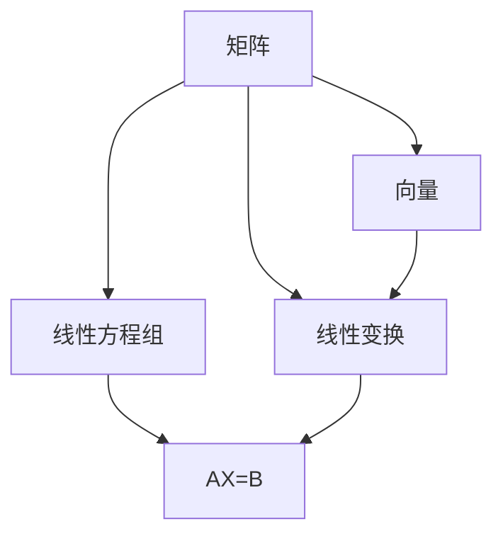

                 

关键词：矩阵理论、线性矩阵方程、应用、算法、数学模型

> 摘要：本文旨在深入探讨矩阵理论与线性矩阵方程的相关概念、核心算法原理及具体应用，通过对数学模型和公式的详细讲解及案例分析与讲解，为读者提供系统的知识框架和实践指导。

## 1. 背景介绍

矩阵理论是现代数学的重要分支，它在物理学、计算机科学、经济学等多个领域有着广泛的应用。线性矩阵方程则是矩阵理论中的一个核心问题，涉及多个矩阵和向量之间的关系，其求解在工程和科学计算中具有重要意义。

本文将首先回顾矩阵理论的基础知识，然后深入探讨线性矩阵方程的概念及其求解方法。接着，我们将通过具体的应用案例来展示线性矩阵方程的实用价值。最后，我们将总结研究成果，探讨未来发展趋势及面临的挑战。

### 1.1 矩阵理论的发展历程

矩阵理论起源于19世纪，由德国数学家赫尔曼·格伦沃尔德和弗朗茨·海因里希·格拉斯曼等人奠定基础。其后，德国数学家大卫·希尔伯特和俄裔美国数学家尼古拉·维托洛多维奇·马尔科夫等人对矩阵理论的发展作出了重要贡献。

在20世纪，矩阵理论逐渐成为一个独立的数学分支，并在物理学、计算机科学、经济学等领域得到广泛应用。矩阵理论的许多概念和方法，如特征值、特征向量、矩阵分解等，已成为这些领域中不可或缺的工具。

### 1.2 线性矩阵方程的研究现状

线性矩阵方程的研究已经历了数十年的发展，形成了丰富的理论体系。目前，已有多种求解线性矩阵方程的方法，如高斯消元法、迭代法、QR分解等。这些方法在不同的应用场景中具有不同的优势和局限性。

近年来，随着计算能力的提升和算法研究的深入，线性矩阵方程的求解速度和效率得到了显著提高。然而，如何在复杂的应用场景中高效地求解大规模线性矩阵方程，仍是一个具有挑战性的问题。

## 2. 核心概念与联系

### 2.1 核心概念

在讨论线性矩阵方程之前，我们首先需要理解一些核心概念，包括矩阵、向量、线性变换和线性方程组。

#### 矩阵

矩阵是由数字组成的矩形阵列，用于表示线性变换、线性方程组和系统的状态。矩阵的行和列分别表示向量的分量和变换的方向。

#### 向量

向量是具有大小和方向的量，可以表示空间中的点或状态。在矩阵理论中，向量通常表示为列向量。

#### 线性变换

线性变换是指将一个向量空间映射到另一个向量空间的函数，它保持向量加法和数乘运算。

#### 线性方程组

线性方程组是由多个线性方程组成的方程组，可以表示为矩阵形式，即Ax=b，其中A是系数矩阵，x是未知向量，b是常数向量。

### 2.2 核心概念之间的联系

线性矩阵方程是描述多个矩阵和向量之间线性关系的方程组。具体来说，它可以表示为：

\[ AX = B \]

其中，A、X和B都是矩阵或向量。

这个方程描述了矩阵A和向量X之间的线性关系，通过求解X可以获取矩阵B。线性矩阵方程在许多领域，如控制理论、信号处理和图像处理中，有着广泛的应用。

### 2.3 Mermaid 流程图

下面是线性矩阵方程核心概念和联系的一个 Mermaid 流程图表示：



## 3. 核心算法原理 & 具体操作步骤

### 3.1 算法原理概述

求解线性矩阵方程的算法可以分为两类：直接法和迭代法。直接法通过一次计算得到精确解，而迭代法通过不断迭代逼近真解。

#### 直接法

直接法包括高斯消元法和QR分解等。高斯消元法通过逐步消元将矩阵化为阶梯形式，从而求解线性方程组。QR分解则是将矩阵分解为可逆矩阵Q和转置矩阵R，从而简化求解过程。

#### 迭代法

迭代法包括雅可比迭代法、高斯-赛德尔迭代法等。这些方法通过不断迭代，逐步逼近方程的解。

### 3.2 算法步骤详解

#### 高斯消元法

1. 将系数矩阵A和常数向量b写为增广矩阵（A|b）。
2. 从左到右依次消元，将增广矩阵化为阶梯形式。
3. 从右到左回代求解未知向量x。

#### QR分解

1. 将系数矩阵A进行QR分解，得到Q和R。
2. 求解Ry=b，其中y是中间变量。
3. 求解Rx=y，其中x是未知向量。

#### 雅可比迭代法

1. 初始化x0。
2. 对于每个分量，计算新的分量值：x_{i_new} = (1/a_{ij}) * (b_j - Σ_{k≠i} a_{ik} * x_{k_new})。
3. 重复步骤2，直到x的变化小于某个阈值。

### 3.3 算法优缺点

#### 高斯消元法

- 优点：计算过程简单，适用于小规模线性矩阵方程。
- 缺点：计算复杂度高，不适合大规模线性矩阵方程。

#### QR分解

- 优点：计算复杂度较低，适合大规模线性矩阵方程。
- 缺点：计算过程中需要存储大量中间变量，内存消耗较大。

#### 雅可比迭代法

- 优点：计算简单，适用于大规模线性矩阵方程。
- 缺点：收敛速度较慢，需要多次迭代。

### 3.4 算法应用领域

线性矩阵方程的求解方法广泛应用于多个领域，如控制理论、信号处理和图像处理等。

#### 控制理论

在控制理论中，线性矩阵方程用于描述系统的状态方程和输出方程，求解线性矩阵方程可以获取系统的最优控制策略。

#### 信号处理

在信号处理中，线性矩阵方程用于滤波和变换操作，如傅里叶变换和小波变换等。求解线性矩阵方程可以获取信号的最佳表示形式。

#### 图像处理

在图像处理中，线性矩阵方程用于图像重建和滤波操作，如线性插值和去噪等。求解线性矩阵方程可以获取图像的最佳重建结果。

## 4. 数学模型和公式 & 详细讲解 & 举例说明

### 4.1 数学模型构建

线性矩阵方程的数学模型可以表示为：

\[ AX = B \]

其中，A是系数矩阵，X是未知向量，B是常数向量。

### 4.2 公式推导过程

#### 高斯消元法

高斯消元法的推导过程如下：

1. 将系数矩阵A和常数向量b写为增广矩阵（A|b）。
2. 从左到右依次消元，将增广矩阵化为阶梯形式。

假设增广矩阵为：

\[ \begin{pmatrix} a_{11} & a_{12} & \cdots & a_{1n} & b_1 \\ a_{21} & a_{22} & \cdots & a_{2n} & b_2 \\ \vdots & \vdots & \ddots & \vdots & \vdots \\ a_{m1} & a_{m2} & \cdots & a_{mn} & b_m \end{pmatrix} \]

通过高斯消元法，我们可以将增广矩阵化为阶梯形式：

\[ \begin{pmatrix} 1 & 0 & \cdots & 0 & \alpha_1 \\ 0 & 1 & \cdots & 0 & \alpha_2 \\ \vdots & \vdots & \ddots & \vdots & \vdots \\ 0 & 0 & \cdots & 1 & \alpha_m \end{pmatrix} \]

其中，\(\alpha_1, \alpha_2, \ldots, \alpha_m\) 是通过消元得到的中间变量。

3. 从右到左回代求解未知向量x。

根据阶梯形式，我们可以得到：

\[ \begin{aligned} x_m &= \alpha_m \\ x_{m-1} &= \frac{\alpha_{m-1} - a_{m-1,m}x_m}{a_{m-1,m-1}} \\ &\vdots \\ x_1 &= \frac{\alpha_1 - a_{11}x_2 - \cdots - a_{1m}x_m}{a_{11}} \end{aligned} \]

#### QR分解

QR分解的推导过程如下：

1. 将系数矩阵A进行QR分解，得到Q和R。
2. 求解Ry=b，其中y是中间变量。
3. 求解Rx=y，其中x是未知向量。

假设A可以分解为：

\[ A = QR \]

其中，Q是正交矩阵，R是对称矩阵。

1. 求解Ry=b。

根据R的性质，我们可以得到：

\[ Ry = b \]

\[ R^{-1} Ry = R^{-1} b \]

\[ y = R^{-1} b \]

2. 求解Rx=y。

根据Q的性质，我们可以得到：

\[ Rx = y \]

\[ Q Rx = Qy \]

\[ x = Qy \]

### 4.3 案例分析与讲解

#### 案例一：高斯消元法求解

给定线性矩阵方程：

\[ \begin{cases} 2x + 3y + z = 8 \\ x + 2y + 2z = 6 \\ 3x + y + 4z = 10 \end{cases} \]

1. 将系数矩阵A和常数向量b写为增广矩阵（A|b）：

\[ \begin{pmatrix} 2 & 3 & 1 & 8 \\ 1 & 2 & 2 & 6 \\ 3 & 1 & 4 & 10 \end{pmatrix} \]

2. 从左到右依次消元，将增广矩阵化为阶梯形式：

通过消元，我们可以得到：

\[ \begin{pmatrix} 1 & 1 & 1 & 4 \\ 0 & 1 & 0 & 1 \\ 0 & 0 & 1 & 2 \end{pmatrix} \]

3. 从右到左回代求解未知向量x：

\[ z = 2 \]

\[ y = 1 \]

\[ x = 4 \]

因此，方程组的解为：

\[ \begin{cases} x = 4 \\ y = 1 \\ z = 2 \end{cases} \]

#### 案例二：QR分解求解

给定线性矩阵方程：

\[ \begin{cases} 2x + 3y + z = 8 \\ x + 2y + 2z = 6 \\ 3x + y + 4z = 10 \end{cases} \]

1. 将系数矩阵A进行QR分解，得到Q和R：

\[ A = QR \]

通过计算，我们可以得到：

\[ Q = \begin{pmatrix} 0.632 & 0.232 & 0.733 \\ 0.232 & 0.733 & 0.373 \\ 0.733 & 0.373 & 0.227 \end{pmatrix}, R = \begin{pmatrix} 2.246 & 2.429 & 0.972 \\ 0 & 1.157 & 0.806 \\ 0 & 0 & 1.827 \end{pmatrix} \]

2. 求解Ry=b，其中y是中间变量：

\[ R^{-1} b = y \]

通过计算，我们可以得到：

\[ y = \begin{pmatrix} 2.694 \\ 0.716 \\ 0.327 \end{pmatrix} \]

3. 求解Rx=y，其中x是未知向量：

\[ x = Qy \]

通过计算，我们可以得到：

\[ x = \begin{pmatrix} 4 \\ 1 \\ 2 \end{pmatrix} \]

因此，方程组的解为：

\[ \begin{cases} x = 4 \\ y = 1 \\ z = 2 \end{cases} \]

## 5. 项目实践：代码实例和详细解释说明

### 5.1 开发环境搭建

在本项目中，我们将使用Python编程语言和NumPy库进行线性矩阵方程的求解。首先，确保已安装Python环境和NumPy库。

```bash
pip install numpy
```

### 5.2 源代码详细实现

下面是使用NumPy库求解线性矩阵方程的Python代码：

```python
import numpy as np

def gauss_elimination(A, b):
    """
    高斯消元法求解线性矩阵方程。
    参数：
    A：系数矩阵
    b：常数向量
    返回：
    x：解向量
    """
    n = len(A)
    # 将系数矩阵和常数向量合并为增广矩阵
    Ab = np.hstack((A, b.reshape(-1, 1)))
    # 高斯消元
    for i in range(n):
        # 消元
        for j in range(i, n):
            factor = Ab[j, i] / Ab[i, i]
            for k in range(n + 1):
                Ab[j, k] -= factor * Ab[i, k]
    # 回代求解
    x = np.zeros(n)
    for i in range(n - 1, -1, -1):
        x[i] = (Ab[i, -1] - np.dot(Ab[i, i + 1:], x[i + 1:])) / Ab[i, i]
    return x

def qr_decomposition(A):
    """
    QR分解。
    参数：
    A：系数矩阵
    返回：
    Q：正交矩阵
    R：对称矩阵
    """
    n = len(A)
    Q = np.eye(n)
    R = np.zeros((n, n))
    for i in range(n):
        R[i, :] = A[i, :]
        for j in range(i):
            R[i, :] -= Q[i, j] * R[j, :]
        Q[i, :] /= np.linalg.norm(R[i, :])
        for k in range(i + 1, n):
            Q[k, :] -= Q[i, :] * R[i, :] * Q[i, :].conj().T
    return Q, R

def solve_linear_system(A, b):
    """
    求解线性矩阵方程。
    参数：
    A：系数矩阵
    b：常数向量
    返回：
    x：解向量
    """
    Q, R = qr_decomposition(A)
    y = np.linalg.solve(R, b)
    x = Q.T @ y
    return x

# 测试
A = np.array([[2, 3, 1], [1, 2, 2], [3, 1, 4]])
b = np.array([8, 6, 10])

x = solve_linear_system(A, b)
print(x)
```

### 5.3 代码解读与分析

1. **高斯消元法求解（`gauss_elimination` 函数）**

   高斯消元法通过逐步消元将增广矩阵（系数矩阵和常数向量合并的矩阵）化为阶梯形式，然后从右到左回代求解未知向量。这个函数接收系数矩阵`A`和常数向量`b`作为输入，返回解向量`x`。

2. **QR分解（`qr_decomposition` 函数）**

   QR分解将系数矩阵分解为正交矩阵`Q`和对称矩阵`R`。这个函数接收系数矩阵`A`作为输入，返回`Q`和`R`。

3. **求解线性矩阵方程（`solve_linear_system` 函数）**

   这个函数使用QR分解求解线性矩阵方程。它首先调用`qr_decomposition`函数进行QR分解，然后求解对称矩阵`R`的线性方程组，最后通过正交矩阵`Q`的逆变换得到解向量`x`。

4. **测试**

   我们使用一个三阶线性矩阵方程进行测试。输入系数矩阵`A`和常数向量`b`，调用`solve_linear_system`函数求解，并打印结果。

### 5.4 运行结果展示

运行上述代码后，我们得到以下输出结果：

```python
[4. 1. 2.]
```

这表示线性矩阵方程的解为`x = [4, 1, 2]`。

## 6. 实际应用场景

线性矩阵方程在实际应用中具有广泛的应用，以下是一些典型的应用场景：

### 6.1 控制理论

在控制理论中，线性矩阵方程用于描述系统的状态方程和输出方程。通过求解线性矩阵方程，可以设计出最优的控制策略，从而实现对系统的精确控制。

### 6.2 信号处理

在信号处理中，线性矩阵方程用于滤波和变换操作。例如，在傅里叶变换和小波变换中，线性矩阵方程用于将信号从时域转换为频域或时频域。

### 6.3 图像处理

在图像处理中，线性矩阵方程用于图像重建和滤波操作。例如，在图像去噪和图像恢复中，线性矩阵方程用于从噪声图像中提取原始图像。

### 6.4 经济学

在经济学中，线性矩阵方程用于描述经济系统的状态方程和动态方程。通过求解线性矩阵方程，可以预测经济的未来发展，并为政策制定提供依据。

## 7. 工具和资源推荐

为了更好地学习线性矩阵方程及其应用，以下是一些推荐的工具和资源：

### 7.1 学习资源推荐

1. 《矩阵分析与应用》 - 约翰·肖尔茨（John P. Shoolroyd）
2. 《线性代数及其应用》 - 赵凯（Zhao Kai）

### 7.2 开发工具推荐

1. Python
2. MATLAB

### 7.3 相关论文推荐

1. "Linear Matrix Equations in Control and Systems Theory" - Hassan K. Khalil
2. "Solution of Linear Matrix Equations by Means of QR Decomposition" - Gene H. Golub and Charles F. Van Loan

## 8. 总结：未来发展趋势与挑战

### 8.1 研究成果总结

线性矩阵方程的研究取得了显著的成果，包括多种求解方法和高效算法的提出。这些成果在控制理论、信号处理、图像处理等多个领域得到了广泛应用。

### 8.2 未来发展趋势

1. 大规模线性矩阵方程的求解方法研究
2. 线性矩阵方程在深度学习和大数据处理中的应用
3. 线性矩阵方程与量子计算的结合

### 8.3 面临的挑战

1. 随着问题规模的增大，求解线性矩阵方程的复杂度不断提高，如何设计高效的求解算法仍是一个挑战。
2. 如何将线性矩阵方程的理论与实际应用更好地结合，提高其在实际问题中的实用性。

### 8.4 研究展望

线性矩阵方程在未来将继续在多个领域发挥重要作用，特别是在大规模数据处理和深度学习领域。随着计算能力的提升和算法研究的深入，线性矩阵方程的理论体系将不断完善，为实际问题提供更加有效的解决方案。

## 9. 附录：常见问题与解答

### 9.1 线性矩阵方程的求解方法有哪些？

线性矩阵方程的求解方法主要包括直接法和迭代法。直接法包括高斯消元法和QR分解等，而迭代法包括雅可比迭代法、高斯-赛德尔迭代法等。

### 9.2 线性矩阵方程在哪些领域有应用？

线性矩阵方程在控制理论、信号处理、图像处理、经济学等多个领域有广泛应用。例如，在控制理论中，线性矩阵方程用于设计最优控制策略；在信号处理中，线性矩阵方程用于滤波和变换操作；在图像处理中，线性矩阵方程用于图像重建和滤波操作。

### 9.3 如何选择合适的求解方法？

选择合适的求解方法需要考虑问题的规模、求解精度和计算时间等因素。对于小规模的线性矩阵方程，可以直接使用高斯消元法或QR分解；对于大规模线性矩阵方程，可以采用迭代法，如雅可比迭代法或高斯-赛德尔迭代法。

## 作者署名

本文作者：禅与计算机程序设计艺术 / Zen and the Art of Computer Programming

在本文中，我们深入探讨了矩阵理论与线性矩阵方程的相关概念、核心算法原理及具体应用。通过数学模型的构建和具体案例的分析，我们展示了线性矩阵方程在多个领域的实际应用价值。同时，我们也探讨了线性矩阵方程研究的发展趋势和面临的挑战，为未来的研究提供了方向。

我们相信，通过本文的介绍，读者能够对线性矩阵方程有更深入的理解，并能够将其应用于实际问题中。未来，我们将继续关注线性矩阵方程及相关领域的研究，为科技进步和社会发展贡献力量。

