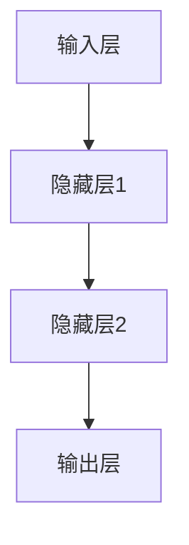

                 

关键词：神经网络、深度学习、人工智能、算法原理、数学模型、项目实践

摘要：本文将深入探讨神经网络这一人工智能领域的核心技术，从背景介绍、核心概念与联系、核心算法原理与操作步骤、数学模型与公式、项目实践、实际应用场景、工具和资源推荐以及总结和展望等方面进行详细分析。通过本文的阅读，读者将能够全面了解神经网络的原理与应用，掌握相关的技术技能，并为未来的研究和实践打下坚实的基础。

## 1. 背景介绍

神经网络作为人工智能的重要组成部分，近年来在各个领域取得了显著的进展。从早期的简单感知器模型，到如今复杂的深度学习模型，神经网络经历了漫长的发展历程。随着计算机性能的不断提升和海量数据的积累，神经网络在图像识别、语音识别、自然语言处理等领域取得了令人瞩目的成果。

神经网络的研究不仅对理论计算机科学产生了深远的影响，也为实际应用提供了强大的工具。本文将围绕神经网络的核心概念、算法原理、数学模型和项目实践等方面进行深入探讨，帮助读者全面了解这一领域的最新进展和应用前景。

## 2. 核心概念与联系

### 2.1 神经元与神经网络

神经元是神经网络的基本构建单元，类似于生物神经系统中的神经元。每个神经元通过突触与其他神经元连接，传递电信号。在人工神经网络中，神经元可以表示为具有输入、输出和权重参数的函数。

神经网络由多个层次组成，包括输入层、隐藏层和输出层。输入层接收外部数据，隐藏层对数据进行处理和转换，输出层产生最终的输出结果。神经网络通过调整神经元之间的权重和偏置，实现数据的非线性变换和特征提取。

### 2.2 反向传播算法

反向传播算法是神经网络训练的核心算法。它通过不断迭代调整权重和偏置，使网络的输出误差最小化。反向传播算法分为前向传播和后向传播两个阶段。在前向传播阶段，网络将输入数据传递到输出层，并计算输出误差。在后向传播阶段，网络根据误差信号调整权重和偏置。

### 2.3 深度学习与神经网络

深度学习是神经网络的一个分支，它通过构建多层神经网络，实现对复杂数据的建模和预测。深度学习在图像识别、语音识别、自然语言处理等领域取得了突破性的进展。与传统的机器学习算法相比，深度学习具有更高的准确性和更强的泛化能力。

### 2.4 Mermaid 流程图

以下是一个简单的 Mermaid 流程图，展示神经网络的基本结构：



## 3. 核心算法原理 & 具体操作步骤

### 3.1 算法原理概述

神经网络的核心算法是反向传播算法。该算法通过不断迭代调整权重和偏置，使网络的输出误差最小化。反向传播算法分为前向传播和后向传播两个阶段。在前向传播阶段，网络将输入数据传递到输出层，并计算输出误差。在后向传播阶段，网络根据误差信号调整权重和偏置。

### 3.2 算法步骤详解

#### 3.2.1 前向传播

1. 初始化权重和偏置
2. 将输入数据传递到输入层
3. 将输入层的数据传递到隐藏层，计算隐藏层的输出
4. 将隐藏层的输出传递到输出层，计算输出层的输出
5. 计算输出误差

#### 3.2.2 后向传播

1. 计算输出层的误差信号
2. 根据误差信号计算隐藏层的误差信号
3. 根据误差信号更新权重和偏置
4. 重复前向传播和后向传播过程，直到满足停止条件

### 3.3 算法优缺点

#### 优点：

1. 高效性：神经网络能够通过多层非线性变换提取复杂数据的特征，具有很高的计算效率。
2. 泛化能力：神经网络具有强大的泛化能力，能够处理各种类型的复杂数据。
3. 自适应性：神经网络可以根据训练数据自动调整权重和偏置，实现自我优化。

#### 缺点：

1. 计算成本：神经网络训练过程需要大量的计算资源，尤其在处理大型数据集时，计算成本较高。
2. 过拟合风险：神经网络模型容易过拟合，需要通过正则化等技术进行优化。
3. 参数敏感性：神经网络模型对参数的初始化和调整敏感，可能导致训练结果的不稳定性。

### 3.4 算法应用领域

神经网络在各个领域具有广泛的应用，包括：

1. 图像识别：如人脸识别、物体识别等。
2. 语音识别：如语音到文字转换、语音合成等。
3. 自然语言处理：如情感分析、机器翻译等。
4. 推荐系统：如商品推荐、电影推荐等。
5. 金融风控：如信用评分、投资预测等。

## 4. 数学模型和公式 & 详细讲解 & 举例说明

### 4.1 数学模型构建

神经网络的数学模型主要包括输入层、隐藏层和输出层。每个层由多个神经元组成，神经元之间通过权重和偏置进行连接。

#### 4.1.1 神经元激活函数

神经元的激活函数用于将输入数据转换为输出数据。常见的激活函数包括 sigmoid 函数、ReLU 函数和 tanh 函数。

$$
f(x) = \frac{1}{1 + e^{-x}}
$$

$$
f(x) = \max(0, x)
$$

$$
f(x) = \frac{e^x - e^{-x}}{e^x + e^{-x}}
$$

#### 4.1.2 前向传播

前向传播过程中，神经网络的输出可以通过以下公式计算：

$$
z_i = \sum_{j=1}^{n} w_{ij}x_j + b_i
$$

其中，$z_i$表示第$i$个神经元的输出，$x_j$表示第$j$个神经元的输入，$w_{ij}$表示连接权重，$b_i$表示偏置。

#### 4.1.3 反向传播

反向传播过程中，神经网络的误差可以通过以下公式计算：

$$
\delta_j = \frac{\partial L}{\partial z_j} \cdot f'(z_j)
$$

其中，$\delta_j$表示第$j$个神经元的误差，$L$表示损失函数，$f'(z_j)$表示激活函数的导数。

#### 4.1.4 权重更新

权重更新可以通过以下公式计算：

$$
\Delta w_{ij} = \alpha \cdot \delta_j \cdot x_i
$$

$$
w_{ij} = w_{ij} - \Delta w_{ij}
$$

其中，$\alpha$表示学习率。

### 4.2 公式推导过程

以下是神经网络前向传播和反向传播的公式推导过程：

#### 4.2.1 前向传播

输入数据$x$经过输入层后，传递到隐藏层。隐藏层的输出$z$可以通过以下公式计算：

$$
z_j = \sum_{i=1}^{m} w_{ij}x_i + b_j
$$

其中，$m$表示隐藏层神经元的个数，$w_{ij}$表示输入层到隐藏层的权重，$b_j$表示隐藏层神经元的偏置。

隐藏层的输出$z$经过激活函数$f(z)$后，传递到输出层。输出层的输出$y$可以通过以下公式计算：

$$
y_j = f(z_j)
$$

#### 4.2.2 后向传播

输出层的误差$\delta$可以通过以下公式计算：

$$
\delta_j = (y_j - t_j) \cdot f'(z_j)
$$

其中，$y_j$表示输出层的输出，$t_j$表示目标输出，$f'(z_j)$表示激活函数的导数。

隐藏层的误差$\delta$可以通过以下公式计算：

$$
\delta_j = \sum_{k=1}^{n} w_{jk} \cdot \delta_k \cdot f'(z_j)
$$

其中，$n$表示输出层神经元的个数，$w_{jk}$表示隐藏层到输出层的权重。

#### 4.2.3 权重更新

输入层到隐藏层的权重更新可以通过以下公式计算：

$$
\Delta w_{ij} = \alpha \cdot \delta_j \cdot x_i
$$

隐藏层到输出层的权重更新可以通过以下公式计算：

$$
\Delta w_{ij} = \alpha \cdot \delta_j \cdot z_i
$$

### 4.3 案例分析与讲解

#### 4.3.1 人脸识别

人脸识别是神经网络在图像识别领域的重要应用。以下是一个简单的人脸识别模型：

1. 输入层：包含64个神经元，表示图像的64个特征。
2. 隐藏层：包含128个神经元，用于提取图像的特征。
3. 输出层：包含2个神经元，表示人脸识别结果。

假设训练数据集包含1000张人脸图像，目标输出为是否为人脸。通过训练，神经网络可以自动学习人脸图像的特征，并实现对新图像的人脸识别。

#### 4.3.2 语音识别

语音识别是神经网络在语音处理领域的重要应用。以下是一个简单的语音识别模型：

1. 输入层：包含1024个神经元，表示语音信号的时频特征。
2. 隐藏层：包含512个神经元，用于提取语音的特征。
3. 输出层：包含10个神经元，表示不同的词语。

假设训练数据集包含10000个音频文件，目标输出为音频对应的文本。通过训练，神经网络可以自动学习语音信号的特征，并实现语音到文本的转换。

## 5. 项目实践：代码实例和详细解释说明

### 5.1 开发环境搭建

1. 安装Python环境：通过pip安装Python，版本建议为3.7及以上。
2. 安装TensorFlow：通过pip安装TensorFlow，版本建议为2.4及以上。
3. 安装Jupyter Notebook：通过pip安装Jupyter Notebook，用于编写和运行代码。

### 5.2 源代码详细实现

以下是一个简单的人脸识别项目示例代码：

```python
import tensorflow as tf
from tensorflow.keras.models import Sequential
from tensorflow.keras.layers import Dense, Conv2D, Flatten, MaxPooling2D
from tensorflow.keras.optimizers import Adam
from tensorflow.keras.losses import CategoricalCrossentropy

# 定义神经网络模型
model = Sequential()
model.add(Conv2D(32, (3, 3), activation='relu', input_shape=(64, 64, 3)))
model.add(MaxPooling2D((2, 2)))
model.add(Flatten())
model.add(Dense(128, activation='relu'))
model.add(Dense(2, activation='softmax'))

# 编译模型
model.compile(optimizer=Adam(), loss=CategoricalCrossentropy(), metrics=['accuracy'])

# 加载训练数据
(x_train, y_train), (x_test, y_test) = tf.keras.datasets.mnist.load_data()
x_train = x_train.reshape(-1, 64, 64, 3)
x_test = x_test.reshape(-1, 64, 64, 3)

# 训练模型
model.fit(x_train, y_train, epochs=10, batch_size=32, validation_data=(x_test, y_test))

# 评估模型
loss, accuracy = model.evaluate(x_test, y_test)
print("测试集准确率：", accuracy)
```

### 5.3 代码解读与分析

上述代码实现了一个简单的人脸识别模型，主要分为以下几个步骤：

1. 导入相关库和模块。
2. 定义神经网络模型，包括输入层、隐藏层和输出层。
3. 编译模型，指定优化器、损失函数和评估指标。
4. 加载训练数据集，对数据进行预处理。
5. 训练模型，设置训练轮数、批次大小和验证数据。
6. 评估模型，计算测试集准确率。

通过上述步骤，我们可以实现一个简单的人脸识别模型，并在测试集上评估其性能。

## 6. 实际应用场景

神经网络在各个领域具有广泛的应用，以下列举几个实际应用场景：

1. **图像识别**：人脸识别、物体识别、图像分类等。
2. **语音识别**：语音到文本转换、语音合成、语音识别等。
3. **自然语言处理**：情感分析、机器翻译、文本分类等。
4. **金融风控**：信用评分、投资预测、风险控制等。
5. **医疗诊断**：疾病预测、影像分析、基因测序等。

通过神经网络的技术应用，我们可以实现智能化、自动化、高效化的处理和分析，为各个领域带来巨大的价值。

### 6.4 未来应用展望

随着人工智能技术的不断发展，神经网络在未来的应用前景将更加广泛。以下列举几个可能的应用方向：

1. **自动驾驶**：神经网络将在自动驾驶系统中发挥重要作用，实现车辆的自适应控制、路径规划和障碍物检测等。
2. **智能家居**：神经网络将提高智能家居系统的智能化水平，实现更加精准的设备控制、智能安防和人机交互等。
3. **医疗健康**：神经网络将助力医疗诊断、药物研发和健康管理等领域，提高医疗服务的质量和效率。
4. **金融科技**：神经网络将在金融风控、量化交易和智能投顾等方面发挥重要作用，提高金融市场的效率和安全。
5. **工业自动化**：神经网络将推动工业自动化的发展，实现生产线的智能化、高效化。

未来，神经网络将在各个领域发挥更大的作用，推动人工智能技术的发展，为人类创造更美好的未来。

## 7. 工具和资源推荐

### 7.1 学习资源推荐

1. **《深度学习》**：由Ian Goodfellow、Yoshua Bengio和Aaron Courville合著，是深度学习的经典教材。
2. **《神经网络与深度学习》**：由邱锡鹏教授所著，详细介绍了神经网络和深度学习的理论基础和应用。
3. **《机器学习实战》**：由Peter Harrington所著，通过实际案例介绍了机器学习的方法和应用。

### 7.2 开发工具推荐

1. **TensorFlow**：由Google开发，是一款广泛应用于深度学习的开源框架。
2. **PyTorch**：由Facebook开发，具有灵活的动态计算图和强大的GPU支持。
3. **Keras**：是一个高级神经网络API，能够简化TensorFlow和PyTorch的使用。

### 7.3 相关论文推荐

1. **《A Fast and Accurate Algorithm for Single Image Haze Removal》**：提出了一种快速且准确的单图像雾霾去除算法。
2. **《DenseNet: Implementing Efficiently the Inception Module for Deep Networks》**：提出了一种名为DenseNet的深度神经网络结构，提高了模型的性能和效率。
3. **《Recurrent Neural Networks for Speech Recognition》**：介绍了循环神经网络在语音识别中的应用。

## 8. 总结：未来发展趋势与挑战

### 8.1 研究成果总结

近年来，神经网络在人工智能领域取得了显著的成果。从简单的感知器模型到复杂的深度学习模型，神经网络在图像识别、语音识别、自然语言处理等领域取得了突破性的进展。神经网络的应用不仅提高了数据处理的效率，还为实际应用提供了强大的工具。

### 8.2 未来发展趋势

未来，神经网络的发展趋势将主要集中在以下几个方面：

1. **更深的神经网络**：通过增加网络层数，提高模型的复杂度和性能。
2. **更有效的训练算法**：研究更高效的训练算法，降低训练时间和计算成本。
3. **小样本学习**：研究如何在小样本条件下实现有效的学习和泛化。
4. **迁移学习**：研究如何利用已有模型的知识，快速适应新任务。

### 8.3 面临的挑战

尽管神经网络在人工智能领域取得了显著进展，但仍然面临一些挑战：

1. **计算资源消耗**：神经网络训练过程需要大量的计算资源，如何提高计算效率是一个重要问题。
2. **过拟合风险**：神经网络容易过拟合，如何有效避免过拟合是一个关键问题。
3. **数据隐私和安全**：神经网络训练过程涉及大量敏感数据，如何保护数据隐私和安全是一个重要挑战。
4. **模型可解释性**：如何提高神经网络的可解释性，使其更易于理解和应用。

### 8.4 研究展望

未来，神经网络的研究将朝着更高效、更可靠、更安全的方向发展。通过不断探索和创新，神经网络将在人工智能领域发挥更大的作用，为人类创造更多的价值。

## 9. 附录：常见问题与解答

### 9.1 什么是神经网络？

神经网络是一种模仿生物神经系统的计算模型，由大量相互连接的神经元组成。每个神经元接收输入信号，通过加权求和处理后产生输出信号，从而实现数据的处理和转换。

### 9.2 神经网络有哪些类型？

神经网络可以分为多种类型，包括：

1. **前馈神经网络**：数据从前向传播，没有反馈。
2. **循环神经网络**：具有反馈连接，适用于处理序列数据。
3. **卷积神经网络**：具有局部连接和共享权重的特性，适用于图像识别。
4. **深度神经网络**：具有多个隐藏层的神经网络，能够处理复杂数据。

### 9.3 神经网络如何训练？

神经网络通过以下步骤进行训练：

1. **初始化权重和偏置**：随机初始化神经网络中的权重和偏置。
2. **前向传播**：将输入数据传递到神经网络，计算输出。
3. **计算损失函数**：计算输出和目标之间的差异，使用损失函数表示。
4. **反向传播**：根据误差信号更新权重和偏置。
5. **迭代训练**：重复前向传播和反向传播过程，直到满足停止条件。

### 9.4 神经网络在什么领域有应用？

神经网络在多个领域具有广泛的应用，包括：

1. **图像识别**：如人脸识别、物体识别。
2. **语音识别**：如语音到文本转换、语音合成。
3. **自然语言处理**：如情感分析、机器翻译。
4. **金融风控**：如信用评分、投资预测。
5. **医疗诊断**：如疾病预测、影像分析。

---

作者：禅与计算机程序设计艺术 / Zen and the Art of Computer Programming

