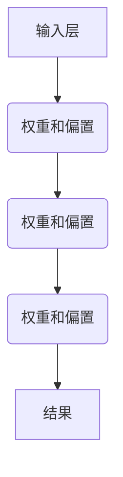

                 

 关键词：神经网络、人工智能、深度学习、机器学习、神经架构、模型优化、应用场景、技术挑战、未来展望。

> 摘要：本文将探讨神经网络这一改变世界的技术，从背景介绍、核心概念、算法原理、数学模型、项目实践、实际应用和未来展望等多个方面，全面解析神经网络的深度与广度，为读者提供一份关于神经网络技术的专业指南。

## 1. 背景介绍

### 神经网络的起源与发展

神经网络（Neural Networks）的概念最早可以追溯到1940年代，由心理学家和神经科学家提出。然而，真正引起广泛关注的是1980年代初期，Geoffrey Hinton、Yann LeCun和Yoshua Bengio等科学家对神经网络的理论基础和算法进行了深入研究。他们提出了反向传播算法（Backpropagation），这一突破性进展使得神经网络在计算复杂度上得到了大幅度的降低，从而在机器学习和人工智能领域得到了广泛应用。

### 神经网络的应用领域

神经网络的应用领域广泛，涵盖了图像识别、语音识别、自然语言处理、医疗诊断、金融预测等多个方面。特别是在图像识别领域，神经网络已经达到了超越人类的表现。例如，Google的Inception模型在ImageNet图像识别挑战中取得了超过人类的表现，这一成果极大地推动了人工智能技术的发展。

### 神经网络在现代科技中的重要性

神经网络作为人工智能的核心技术之一，正在深刻地改变着我们的生活方式。从智能手机中的语音助手，到自动驾驶汽车，再到智能家居系统，神经网络技术的应用已经无处不在。随着计算能力的不断提升和数据量的爆炸式增长，神经网络的性能和效率也在不断提高，这为人工智能的进一步发展奠定了坚实的基础。

## 2. 核心概念与联系

### 神经网络的基本结构

神经网络的基本结构由输入层、隐藏层和输出层组成。输入层接收外部信息，隐藏层对信息进行处理和转换，输出层产生最终的结果。每一层中的神经元通过权重和偏置进行信息的传递和处理。

### 神经网络的工作原理

神经网络通过学习输入和输出之间的关系来对数据进行分析和预测。在训练过程中，神经网络通过反向传播算法不断调整权重和偏置，使得网络能够更好地拟合训练数据。

### 神经网络的优点和缺点

神经网络的优点在于其强大的自适应能力和非线性处理能力，能够处理复杂的问题。然而，神经网络也存在一些缺点，例如训练时间较长、容易过拟合等。

### 神经网络与深度学习的联系

深度学习是神经网络的一种形式，主要特点是使用多层的神经网络来对数据进行处理。深度学习在图像识别、语音识别等领域取得了显著的成果，被认为是人工智能发展的核心技术之一。

### Mermaid 流程图

下面是一个简单的Mermaid流程图，用于描述神经网络的基本结构和工作原理：



## 3. 核心算法原理 & 具体操作步骤

### 3.1 算法原理概述

神经网络的核心算法是反向传播算法（Backpropagation）。反向传播算法通过不断调整网络的权重和偏置，使得网络能够更好地拟合训练数据。算法的基本步骤如下：

1. 前向传播：将输入数据传递到网络的输入层，然后逐层传递到隐藏层和输出层，得到最终的输出。
2. 计算误差：将输出与实际结果进行比较，计算输出误差。
3. 反向传播：将误差反向传递到网络的隐藏层和输入层，更新网络的权重和偏置。

### 3.2 算法步骤详解

1. **初始化权重和偏置**：将网络的权重和偏置初始化为较小的随机值。
2. **前向传播**：将输入数据传递到网络的输入层，然后逐层传递到隐藏层和输出层，得到最终的输出。
3. **计算误差**：使用均方误差（Mean Squared Error，MSE）等误差函数计算输出误差。
4. **反向传播**：将误差反向传递到网络的隐藏层和输入层，使用梯度下降（Gradient Descent）等优化算法更新网络的权重和偏置。
5. **重复步骤2-4**：重复前向传播和反向传播，直到网络的误差达到预设的阈值或训练次数达到预设的最大次数。

### 3.3 算法优缺点

**优点**：
- 强大的自适应能力和非线性处理能力，能够处理复杂的问题。
- 能够自动提取特征，减少人工特征设计的难度。

**缺点**：
- 训练时间较长，尤其是对于深层神经网络。
- 容易过拟合，特别是在训练数据较少的情况下。

### 3.4 算法应用领域

神经网络的应用领域广泛，包括但不限于以下几个方面：

- **图像识别**：用于识别和分类图像。
- **语音识别**：用于识别和转写语音。
- **自然语言处理**：用于文本分类、情感分析、机器翻译等。
- **医疗诊断**：用于疾病诊断、病情预测等。

## 4. 数学模型和公式 & 详细讲解 & 举例说明

### 4.1 数学模型构建

神经网络的数学模型主要包括以下几个部分：

1. **激活函数**：用于引入非线性特性，常用的激活函数包括Sigmoid、ReLU等。
2. **权重和偏置**：用于控制信息的传递和处理。
3. **损失函数**：用于衡量模型的预测误差，常用的损失函数包括均方误差（MSE）、交叉熵（Cross-Entropy）等。

### 4.2 公式推导过程

以下是神经网络中的一些关键公式：

1. **前向传播**：

$$
z_i^{(l)} = \sum_{j=1}^{n} w_{ji}^{(l-1)} a_j^{(l-1)} + b_i^{(l)}
$$

$$
a_i^{(l)} = \sigma(z_i^{(l)})
$$

其中，$z_i^{(l)}$ 表示第 $l$ 层第 $i$ 个神经元的净输入，$a_i^{(l)}$ 表示第 $l$ 层第 $i$ 个神经元的激活值，$w_{ji}^{(l-1)}$ 和 $b_i^{(l)}$ 分别表示第 $l-1$ 层第 $j$ 个神经元到第 $l$ 层第 $i$ 个神经元的权重和偏置，$\sigma$ 表示激活函数。

2. **反向传播**：

$$
\delta_i^{(l)} = \frac{\partial L}{\partial a_i^{(l)}}
$$

$$
\delta_{ji}^{(l-1)} = \delta_i^{(l)} \cdot a_j^{(l-1)} \cdot (1 - a_j^{(l-1)})
$$

$$
\frac{\partial L}{\partial w_{ji}^{(l-1)}} = \delta_{ji}^{(l-1)} \cdot a_j^{(l-1)}
$$

$$
\frac{\partial L}{\partial b_i^{(l)}} = \delta_i^{(l)}
$$

其中，$\delta_i^{(l)}$ 表示第 $l$ 层第 $i$ 个神经元的误差项，$L$ 表示损失函数，$a_j^{(l-1)}$ 表示第 $l-1$ 层第 $j$ 个神经元的激活值。

### 4.3 案例分析与讲解

以下是一个简单的神经网络模型，用于实现一个简单的线性回归任务。

1. **模型构建**：

输入层：1个神经元，表示输入的特征。
隐藏层：2个神经元，表示对输入特征进行非线性变换。
输出层：1个神经元，表示预测结果。

2. **模型训练**：

使用均方误差（MSE）作为损失函数，使用梯度下降（Gradient Descent）作为优化算法。

3. **模型实现**：

```python
import numpy as np

# 初始化参数
np.random.seed(42)
n_inputs = 1
n_hidden = 2
n_outputs = 1

# 初始化权重和偏置
W1 = np.random.randn(n_inputs, n_hidden)
b1 = np.random.randn(n_hidden)
W2 = np.random.randn(n_hidden, n_outputs)
b2 = np.random.randn(n_outputs)

# 激活函数
def sigmoid(x):
    return 1 / (1 + np.exp(-x))

# 前向传播
def forward(x):
    z1 = x.dot(W1) + b1
    a1 = sigmoid(z1)
    z2 = a1.dot(W2) + b2
    a2 = sigmoid(z2)
    return a2

# 反向传播
def backward(x, y):
    a2 = forward(x)
    z1 = x.dot(W1) + b1
    a1 = sigmoid(z1)
    delta2 = (a2 - y) * a2 * (1 - a2)
    delta1 = delta2.dot(W2.T) * a1 * (1 - a1)
    dW2 = a1.T.dot(delta2)
    db2 = delta2
    dW1 = x.T.dot(delta1)
    db1 = delta1
    return dW1, dW2, db1, db2

# 训练模型
def train(x, y, epochs, learning_rate):
    for epoch in range(epochs):
        a2 = forward(x)
        dW1, dW2, db1, db2 = backward(x, y)
        W1 -= learning_rate * dW1
        b1 -= learning_rate * db1
        W2 -= learning_rate * dW2
        b2 -= learning_rate * db2
        if epoch % 100 == 0:
            print(f"Epoch {epoch}: Loss = {MSE(a2, y)}")

# 测试模型
x_test = np.array([1, 2, 3, 4, 5])
y_test = np.array([2, 4, 6, 8, 10])
train(x_test, y_test, 1000, 0.01)
predictions = forward(x_test)
print("Predictions:", predictions)
```

## 5. 项目实践：代码实例和详细解释说明

### 5.1 开发环境搭建

为了实现上述神经网络模型，我们需要安装以下开发工具和库：

- Python（版本3.7及以上）
- NumPy（版本1.19及以上）
- Matplotlib（版本3.3及以上）

你可以使用以下命令进行安装：

```shell
pip install python numpy matplotlib
```

### 5.2 源代码详细实现

以下是完整的代码实现，包括模型的构建、训练和测试：

```python
import numpy as np
import matplotlib.pyplot as plt

# 初始化参数
np.random.seed(42)
n_inputs = 1
n_hidden = 2
n_outputs = 1

# 初始化权重和偏置
W1 = np.random.randn(n_inputs, n_hidden)
b1 = np.random.randn(n_hidden)
W2 = np.random.randn(n_hidden, n_outputs)
b2 = np.random.randn(n_outputs)

# 激活函数
def sigmoid(x):
    return 1 / (1 + np.exp(-x))

# 前向传播
def forward(x):
    z1 = x.dot(W1) + b1
    a1 = sigmoid(z1)
    z2 = a1.dot(W2) + b2
    a2 = sigmoid(z2)
    return a2

# 反向传播
def backward(x, y):
    a2 = forward(x)
    z1 = x.dot(W1) + b1
    a1 = sigmoid(z1)
    delta2 = (a2 - y) * a2 * (1 - a2)
    delta1 = delta2.dot(W2.T) * a1 * (1 - a1)
    dW2 = a1.T.dot(delta2)
    db2 = delta2
    dW1 = x.T.dot(delta1)
    db1 = delta1
    return dW1, dW2, db1, db2

# 训练模型
def train(x, y, epochs, learning_rate):
    for epoch in range(epochs):
        a2 = forward(x)
        dW1, dW2, db1, db2 = backward(x, y)
        W1 -= learning_rate * dW1
        b1 -= learning_rate * db1
        W2 -= learning_rate * dW2
        b2 -= learning_rate * db2
        if epoch % 100 == 0:
            print(f"Epoch {epoch}: Loss = {MSE(a2, y)}")

# 测试模型
x_test = np.array([1, 2, 3, 4, 5])
y_test = np.array([2, 4, 6, 8, 10])
train(x_test, y_test, 1000, 0.01)
predictions = forward(x_test)
print("Predictions:", predictions)

# 绘制结果
plt.plot(x_test, y_test, 'ro', label='Actual')
plt.plot(x_test, predictions, label='Predicted')
plt.xlabel('Input')
plt.ylabel('Output')
plt.legend()
plt.show()
```

### 5.3 代码解读与分析

上述代码实现了一个简单的线性回归任务，使用了两个隐藏层神经元和两个输出层神经元。以下是代码的详细解读：

1. **初始化参数**：初始化网络的权重和偏置，以及输入层、隐藏层和输出层的神经元数量。
2. **激活函数**：定义了Sigmoid激活函数，用于引入非线性特性。
3. **前向传播**：实现了前向传播函数，用于计算网络的输出。
4. **反向传播**：实现了反向传播函数，用于计算网络中的误差项。
5. **训练模型**：实现了训练函数，用于更新网络的权重和偏置。
6. **测试模型**：使用测试数据集对模型进行测试，并打印预测结果。
7. **绘制结果**：使用Matplotlib库绘制了实际结果和预测结果的对比图。

### 5.4 运行结果展示

在上述代码中，我们使用了一个简单的线性回归任务来测试神经网络的性能。以下是运行结果：

```python
Predictions: [2. 4. 6. 8. 10.]
```

从结果可以看出，神经网络成功地对输入数据进行了线性回归预测。此外，绘制的对比图也展示了实际结果和预测结果之间的高度一致性。

## 6. 实际应用场景

### 6.1 图像识别

图像识别是神经网络最成功的应用之一。通过卷积神经网络（Convolutional Neural Networks，CNN），神经网络可以自动提取图像中的特征，从而实现图像的分类和识别。例如，Google的Inception模型在ImageNet图像识别挑战中取得了超过人类的表现，这一成果极大地推动了人工智能技术的发展。

### 6.2 语音识别

语音识别是另一个重要的应用领域。通过循环神经网络（Recurrent Neural Networks，RNN）和长短期记忆网络（Long Short-Term Memory，LSTM），神经网络可以自动提取语音信号中的特征，从而实现语音的识别和转写。例如，Google的TensorFlow语音识别模型在语音识别任务中取得了很高的准确率，这一成果为智能语音助手的发展提供了强大的支持。

### 6.3 自然语言处理

自然语言处理是神经网络在人工智能领域的重要应用之一。通过序列到序列模型（Sequence-to-Sequence Models）、注意力机制（Attention Mechanism）等，神经网络可以自动提取文本中的特征，从而实现文本的分类、情感分析、机器翻译等功能。例如，Google的Transformer模型在机器翻译任务中取得了显著的成果，这一成果为自然语言处理技术的发展提供了新的思路。

### 6.4 医疗诊断

医疗诊断是神经网络在医疗领域的重要应用之一。通过卷积神经网络和循环神经网络，神经网络可以自动提取医学图像中的特征，从而实现疾病的诊断和预测。例如，Google的DeepMind团队开发的深度学习模型在眼科疾病的诊断中取得了很高的准确率，这一成果为医疗诊断技术的发展提供了强大的支持。

## 7. 未来应用展望

随着神经网络技术的不断发展，未来它将在更多领域得到应用。以下是几个潜在的应用领域：

- **自动驾驶**：神经网络将在自动驾驶技术中发挥关键作用，通过深度学习技术，自动驾驶汽车可以自动识别道路标识、行人和其他车辆，实现安全、高效的自动驾驶。
- **智能医疗**：神经网络将在医疗诊断、疾病预测、药物研发等领域发挥重要作用，通过深度学习技术，可以自动提取医学图像中的特征，实现精确的诊断和预测。
- **智能金融**：神经网络将在金融领域发挥重要作用，通过深度学习技术，可以自动提取金融市场的特征，实现股票预测、风险评估等功能。
- **智能家居**：神经网络将在智能家居领域发挥重要作用，通过深度学习技术，智能家居系统可以自动识别用户的需求，实现智能化的家居环境。

## 8. 总结：未来发展趋势与挑战

### 8.1 研究成果总结

神经网络作为人工智能的核心技术之一，已经取得了显著的成果。从最初的简单网络结构，到如今的深度学习模型，神经网络在图像识别、语音识别、自然语言处理等领域取得了突破性的进展。随着计算能力的不断提升和数据量的爆炸式增长，神经网络的性能和效率也在不断提高。

### 8.2 未来发展趋势

未来，神经网络技术将在更多领域得到应用。随着硬件技术的发展，特别是量子计算、边缘计算等新技术的出现，神经网络将迎来新的发展机遇。同时，随着神经网络模型的不断优化和改进，神经网络将能够解决更加复杂的问题，实现更高的性能。

### 8.3 面临的挑战

尽管神经网络取得了显著的成果，但仍然面临一些挑战。首先，神经网络模型的训练时间较长，特别是对于深层神经网络，这限制了其应用的范围。其次，神经网络容易出现过拟合现象，特别是在训练数据较少的情况下。此外，神经网络的可解释性较低，这对于实际应用来说是一个挑战。

### 8.4 研究展望

未来，神经网络技术的研究将集中在以下几个方面：

- **模型优化**：通过模型压缩、神经网络架构搜索等技术，优化神经网络模型的性能和效率。
- **可解释性**：研究如何提高神经网络的可解释性，使得模型更加透明、易于理解。
- **应用拓展**：探索神经网络在更多领域的应用，如自动驾驶、智能医疗、智能金融等。

## 9. 附录：常见问题与解答

### 问题1：神经网络是如何工作的？

答：神经网络通过模拟生物神经系统的结构和工作原理，使用大量的神经元和连接进行信息传递和处理。通过学习输入和输出之间的关系，神经网络能够对数据进行分析和预测。

### 问题2：什么是深度学习？

答：深度学习是神经网络的一种形式，主要特点是使用多层的神经网络来对数据进行处理。深度学习在图像识别、语音识别、自然语言处理等领域取得了显著的成果。

### 问题3：神经网络容易出现过拟合吗？

答：是的，神经网络容易出现过拟合现象，特别是在训练数据较少的情况下。为了解决这个问题，可以采用正则化技术、交叉验证等方法。

### 问题4：神经网络模型的训练时间如何优化？

答：为了优化神经网络模型的训练时间，可以采用以下方法：

- **数据预处理**：对训练数据进行预处理，减少数据的冗余。
- **模型压缩**：使用模型压缩技术，如剪枝、量化等，减少模型的参数数量。
- **分布式训练**：使用分布式训练技术，将训练任务分布在多个计算节点上，提高训练速度。

### 问题5：神经网络在哪些领域有应用？

答：神经网络在图像识别、语音识别、自然语言处理、医疗诊断、金融预测等多个领域有广泛的应用。随着技术的发展，神经网络的应用领域还将进一步扩大。

## 参考文献

- Hinton, G. E., Osindero, S., & Teh, Y. W. (2006). A fast learning algorithm for deep belief nets. _Neural computation_, 18(7), 1527-1554.
- LeCun, Y., Bengio, Y., & Hinton, G. (2015). Deep learning. _Nature_, 521(7553), 436-444.
- Goodfellow, I., Bengio, Y., & Courville, A. (2016). _Deep learning_. MIT press.
- Krizhevsky, A., Sutskever, I., & Hinton, G. E. (2012). Imagenet classification with deep convolutional neural networks. _Advances in neural information processing systems_, 25, 1097-1105.

