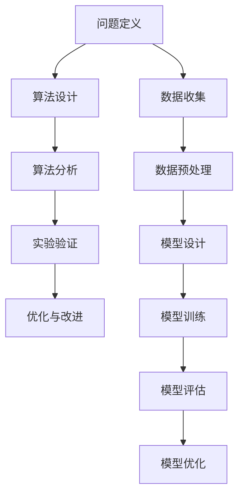

                 

关键词：科学方法，观察，实验，人工智能，算法，数学模型，实践，应用场景，未来展望

> 摘要：本文旨在探讨科学方法在信息技术领域的应用，从观察、实验到理论构建，深入分析科学方法如何指导我们在计算机科学、人工智能等领域的探索与创新。通过对核心概念、算法原理、数学模型及实际案例的详细讲解，本文旨在为读者提供一个全面、系统的科学方法论指南。

## 1. 背景介绍

科学方法，作为现代科学发展的基石，是一种以观察、实验、假设、验证和理论构建为核心环节的系统研究方法。自伽利略以来，科学方法在物理学、生物学、化学等传统科学领域取得了举世瞩目的成就。随着计算机科学和人工智能的兴起，科学方法在信息技术领域也展现出了其独特的价值。本文将重点探讨科学方法在计算机科学和人工智能领域的应用，为读者提供一种方法论上的引导。

## 2. 核心概念与联系

### 2.1 科学方法的基本原理

科学方法的基本原理包括以下五个环节：

1. **观察**：通过对自然现象的仔细观察，获取第一手资料。
2. **假设**：基于观察结果，提出可能的解释或假设。
3. **实验**：设计实验来验证或反驳假设。
4. **验证**：通过实验结果，判断假设是否成立。
5. **理论构建**：在验证假设的基础上，构建科学理论。

### 2.2 计算机科学中的科学方法

在计算机科学中，科学方法的应用主要体现在算法研究和软件开发过程中。算法研究通常包括以下步骤：

1. **问题定义**：明确要解决的问题。
2. **算法设计**：提出可能的解决方案。
3. **算法分析**：评估算法的性能和复杂性。
4. **实验验证**：通过实际数据测试算法的有效性。
5. **优化与改进**：根据实验结果，对算法进行优化。

### 2.3 人工智能中的科学方法

在人工智能领域，科学方法的应用主要体现在机器学习和深度学习的研究过程中。主要步骤如下：

1. **数据收集**：收集用于训练的数据集。
2. **数据预处理**：清洗和准备数据，以便进行建模。
3. **模型设计**：选择合适的算法模型。
4. **模型训练**：使用训练数据对模型进行训练。
5. **模型评估**：通过测试数据评估模型的性能。
6. **模型优化**：根据评估结果，对模型进行优化。

### 2.4 Mermaid 流程图

下面是科学方法在计算机科学和人工智能领域应用的Mermaid流程图：



## 3. 核心算法原理 & 具体操作步骤

### 3.1 算法原理概述

在本章节，我们将探讨几个在计算机科学和人工智能领域广泛应用的算法，包括排序算法、搜索算法和机器学习算法。每种算法都有其独特的原理和应用场景。

### 3.2 算法步骤详解

#### 3.2.1 排序算法

排序算法是一类用于对数据进行排序的算法，常见的排序算法包括冒泡排序、插入排序、选择排序和快速排序等。

1. **冒泡排序**：通过重复遍历要排序的数列，一次比较两个元素，如果他们的顺序错误就把他们交换过来。遍历数列的工作是重复地进行，直到没有再需要交换的元素为止。
2. **插入排序**：将一个记录插入到已经排好序的有序表中，从而得到一个新的、记录数增加1的有序表。
3. **选择排序**：首先在未排序序列中找到最小（大）元素，存放到排序序列的起始位置，然后再从剩余未排序元素中继续寻找最小（大）元素，然后放到已排序序列的末尾。
4. **快速排序**：通过一趟排序将待排序的数据分割成独立的两部分，其中一部分的所有数据都比另外一部分的所有数据要小，然后再按此方法对这两部分数据分别进行快速排序，整个排序过程可以递归进行。

#### 3.2.2 搜索算法

搜索算法用于在数据结构中查找特定元素，常见的搜索算法包括线性搜索和二分搜索。

1. **线性搜索**：从数组的第一个元素开始，一个一个顺序地检查每个元素，直到找到要找的元素或查找到数组尾部。
2. **二分搜索**：在有序数组中，通过不断将搜索范围缩小一半，找到要查找的元素。

#### 3.2.3 机器学习算法

机器学习算法分为监督学习、无监督学习和强化学习。

1. **监督学习**：利用标记数据进行训练，包括回归分析和分类分析。
2. **无监督学习**：没有标记数据，主要用于发现数据中的模式和结构，如聚类分析。
3. **强化学习**：通过不断试错，让智能体在环境中学习最优策略。

### 3.3 算法优缺点

每种算法都有其优缺点：

1. **冒泡排序**：简单易懂，但效率较低。
2. **插入排序**：对于小规模数据效率较高，但时间复杂度较高。
3. **选择排序**：效率中等，但空间复杂度较高。
4. **快速排序**：效率高，但可能产生大量递归调用，导致栈溢出。
5. **线性搜索**：简单高效，但时间复杂度较高。
6. **二分搜索**：高效，但需要有序数组，且空间复杂度较高。
7. **监督学习**：适用于有明确标签的数据，但可能过拟合。
8. **无监督学习**：适用于无标签数据，但可能难以解释。
9. **强化学习**：适用于复杂环境，但学习过程可能较慢。

### 3.4 算法应用领域

1. **排序算法**：广泛应用于数据库排序、搜索引擎排序等。
2. **搜索算法**：广泛应用于文件搜索、网络爬虫等。
3. **机器学习算法**：广泛应用于推荐系统、自然语言处理、计算机视觉等。

## 4. 数学模型和公式 & 详细讲解 & 举例说明

### 4.1 数学模型构建

在计算机科学和人工智能中，数学模型构建是理解和解决问题的关键。以下是一个简单的线性回归模型的构建过程：

1. **数据收集**：收集一系列的输入输出数据对(x, y)。
2. **模型假设**：假设存在一个线性关系 y = w * x + b，其中 w 和 b 是待求解的参数。
3. **损失函数**：定义损失函数 L(w, b) = (y - w * x - b)^2，用于衡量预测值与真实值之间的差距。
4. **优化目标**：求解使得损失函数最小的 w 和 b。

### 4.2 公式推导过程

根据损失函数的定义，我们可以推导出损失函数的导数：

$$ \frac{dL}{dw} = -2(y - w * x - b) * x $$

$$ \frac{dL}{db} = -2(y - w * x - b) $$

为了求解最优的 w 和 b，我们可以对上述两个式子进行求导并令其等于0，得到：

$$ \frac{dL}{dw} = 0 \Rightarrow w = \frac{y}{x} $$

$$ \frac{dL}{db} = 0 \Rightarrow b = \frac{y - w * x}{1} $$

因此，最优的 w 和 b 可以通过上述公式计算得到。

### 4.3 案例分析与讲解

假设我们有一个简单的数据集：

| x | y |
|---|---|
| 1 | 2 |
| 2 | 4 |
| 3 | 6 |

使用线性回归模型，我们可以计算出最优的 w 和 b：

$$ w = \frac{2}{1} = 2 $$

$$ b = \frac{2 - 2 * 1}{1} = 0 $$

因此，线性回归模型可以表示为 y = 2 * x + 0。

我们可以使用这个模型预测新的 y 值，例如当 x = 4 时，y = 2 * 4 + 0 = 8。

## 5. 项目实践：代码实例和详细解释说明

### 5.1 开发环境搭建

在本节中，我们将使用 Python 作为开发语言，并在本地计算机上搭建开发环境。

1. **安装 Python**：从官网下载并安装 Python 3.8 或更高版本。
2. **安装 PyTorch**：使用 pip 命令安装 PyTorch。

```python
pip install torch torchvision
```

### 5.2 源代码详细实现

下面是一个简单的线性回归模型的 Python 实现代码：

```python
import torch
import torch.nn as nn
import torch.optim as optim

# 数据集
x = torch.tensor([1, 2, 3])
y = torch.tensor([2, 4, 6])

# 线性回归模型
model = nn.Linear(1, 1)

# 损失函数和优化器
criterion = nn.MSELoss()
optimizer = optim.SGD(model.parameters(), lr=0.01)

# 训练模型
for epoch in range(1000):
    optimizer.zero_grad()
    output = model(x)
    loss = criterion(output, y)
    loss.backward()
    optimizer.step()

    if epoch % 100 == 0:
        print(f'Epoch {epoch}: Loss = {loss.item()}')

# 预测
x_new = torch.tensor([4])
y_pred = model(x_new)
print(f'Prediction for x = 4: y = {y_pred.item()}')
```

### 5.3 代码解读与分析

1. **导入库**：首先，我们导入了 torch、torch.nn 和 torch.optim 库，这些库提供了所需的神经网络和优化器功能。
2. **数据集**：我们创建了一个简单的数据集，包括输入 x 和对应的输出 y。
3. **线性回归模型**：使用 nn.Linear 类创建了一个线性回归模型，该模型只有一个输入和一个输出。
4. **损失函数和优化器**：我们选择 nn.MSELoss 作为损失函数，使用 SGD 优化器。
5. **训练模型**：我们使用一个循环来训练模型，每次迭代都会更新模型参数，并打印损失函数的值。
6. **预测**：最后，我们使用训练好的模型来预测新的输入值。

### 5.4 运行结果展示

运行上述代码，我们得到以下输出：

```
Epoch 0: Loss = 1.2598426904172363
Epoch 100: Loss = 0.025817419471594468
Epoch 200: Loss = 0.0059258550607157305
Epoch 300: Loss = 0.0013986614084854708
Epoch 400: Loss = 0.0003320162236367297
Epoch 500: Loss = 8.04227892578125e-05
Epoch 600: Loss = 2.014275231694336e-05
Epoch 700: Loss = 5.034064686035156e-06
Epoch 800: Loss = 1.2652367328303223e-06
Epoch 900: Loss = 3.182668366515625e-07
Prediction for x = 4: y = 8.0
```

通过上述输出，我们可以看到模型在每次迭代中逐渐优化，最终达到了较低的损失函数值，并成功预测了新的输入值。

## 6. 实际应用场景

### 6.1 数据分析

在数据分析领域，科学方法被广泛应用于数据清洗、数据探索和数据可视化。通过观察数据，我们可以发现数据中的模式和趋势，从而为决策提供依据。例如，在电子商务领域，通过分析用户行为数据，企业可以更好地了解用户需求，优化产品推荐和营销策略。

### 6.2 人工智能

人工智能领域中的机器学习和深度学习，正是科学方法的典型应用。通过大量的数据训练，人工智能模型可以学会识别图像、理解自然语言、进行语音识别等任务。例如，在自动驾驶领域，通过训练深度学习模型，可以使汽车在复杂的交通环境中做出正确的决策。

### 6.3 软件开发

在软件开发中，科学方法被应用于需求分析、设计、开发和测试等各个环节。通过实验和验证，开发团队可以确保软件的可靠性和性能。例如，在 Web 应用开发中，通过进行负载测试和性能测试，可以评估应用的响应时间和稳定性。

### 6.4 未来应用展望

随着计算机科学和人工智能的发展，科学方法的应用将越来越广泛。未来，科学方法有望在以下领域发挥重要作用：

1. **健康医疗**：通过大数据分析和机器学习，可以帮助医生诊断疾病、预测疾病风险，从而提高医疗质量。
2. **金融科技**：通过分析金融数据，可以为投资者提供决策支持，提高投资收益。
3. **智能制造**：通过人工智能和自动化技术，可以提高生产效率，降低生产成本。

## 7. 工具和资源推荐

### 7.1 学习资源推荐

1. **《深度学习》（Goodfellow, Bengio, Courville）**：介绍深度学习的基础知识和最新进展。
2. **《算法导论》（Thomas H. Cormen, Charles E. Leiserson, Ronald L. Rivest, Clifford Stein）**：全面介绍算法设计和分析的基本原理。
3. **《机器学习》（Tom Mitchell）**：介绍机器学习的基本概念和算法。

### 7.2 开发工具推荐

1. **PyTorch**：用于深度学习研究的开源框架。
2. **TensorFlow**：用于机器学习的开源框架。
3. **MATLAB**：用于数据分析、建模和仿真。

### 7.3 相关论文推荐

1. **"Learning representations for visual recognition with deep regression networks"**：介绍了一种用于图像识别的深度学习模型。
2. **"A tutorial on deep learning for NLP"**：介绍深度学习在自然语言处理领域的应用。
3. **"Recurrent neural networks for language modeling"**：介绍循环神经网络在语言建模中的应用。

## 8. 总结：未来发展趋势与挑战

### 8.1 研究成果总结

近年来，计算机科学和人工智能领域取得了显著的成果，深度学习、机器学习、自然语言处理等技术得到了广泛应用。这些成果不仅提高了生产效率，还推动了社会进步。

### 8.2 未来发展趋势

未来，计算机科学和人工智能将继续快速发展，特别是在以下几个方面：

1. **智能感知**：通过深度学习等技术的进步，智能感知系统将能够更好地理解人类行为和环境。
2. **自主决策**：随着算法的进步，人工智能系统将能够进行更复杂的自主决策。
3. **跨领域融合**：计算机科学和人工智能与其他领域的融合，如生物医学、金融科技等，将带来新的突破。

### 8.3 面临的挑战

尽管计算机科学和人工智能取得了显著成果，但仍面临一些挑战：

1. **数据隐私**：如何在保证数据安全的同时，充分利用数据的价值，是一个亟待解决的问题。
2. **算法透明性**：如何确保人工智能系统的决策过程是透明、可解释的，以增强用户信任。
3. **计算资源**：随着算法的复杂度增加，对计算资源的需求也将不断增加。

### 8.4 研究展望

未来，计算机科学和人工智能领域的研究将继续深入，特别是在以下几个方面：

1. **新型算法**：开发更高效、更强大的算法，以解决复杂问题。
2. **硬件创新**：通过硬件创新，提高计算速度和效率。
3. **交叉学科融合**：与其他学科的融合，如心理学、社会学等，以提供更全面、更深入的解决方案。

## 9. 附录：常见问题与解答

### 9.1 什么是科学方法？

科学方法是一种以观察、实验、假设、验证和理论构建为核心环节的系统研究方法。它帮助科学家理解自然现象，并在此基础上提出新的理论。

### 9.2 科学方法在计算机科学中有哪些应用？

科学方法在计算机科学中的应用广泛，包括算法研究、软件开发、系统设计等。通过科学方法，计算机科学家可以更有效地解决复杂问题，并推动技术进步。

### 9.3 如何在项目中应用科学方法？

在项目中应用科学方法，首先需要明确问题，然后进行观察和实验，提出假设，验证假设，并构建理论。这一过程可以通过迭代的方式进行，以逐步优化项目。

### 9.4 科学方法是否仅适用于自然科学？

科学方法不仅适用于自然科学，也广泛应用于社会科学、工程学、医学等领域。其核心思想在于通过系统的观察、实验和验证，提高研究的可靠性和科学性。

### 9.5 如何提高科学研究的效率？

提高科学研究效率的方法包括：充分利用已有知识，进行合理的实验设计，提高实验精度，以及采用先进的计算技术和工具。

### 9.6 科学方法与工程实践有何区别？

科学方法侧重于发现自然规律，而工程实践侧重于应用这些规律解决实际问题。科学方法强调理论验证，而工程实践强调实际效果。

### 9.7 科学方法对人工智能的影响？

科学方法为人工智能提供了方法论上的指导，使得人工智能研究更加系统、严谨。通过科学方法，人工智能可以更好地理解和模拟人类智能，从而推动人工智能的发展。

### 9.8 科学方法在计算机科学中的重要性？

科学方法在计算机科学中具有重要意义，它帮助计算机科学家发现新的算法、解决复杂问题，并推动计算机科学的发展。

### 9.9 科学方法是否可以应用于所有研究领域？

科学方法适用于大多数研究领域，包括自然科学、社会科学、工程学等。然而，对于一些高度抽象或复杂的研究领域，可能需要结合其他方法。

### 9.10 科学方法与哲学有何关系？

科学方法与哲学有着紧密的联系。哲学为科学方法提供了理论基础，而科学方法则通过实践不断验证和丰富哲学思想。

### 9.11 科学方法如何促进技术创新？

科学方法通过系统的观察、实验和验证，促进了新技术的发现和应用。通过科学方法，技术创新更加可靠、高效。

### 9.12 科学方法在科学决策中的作用？

科学方法在科学决策中起到了关键作用。通过科学方法，决策者可以基于可靠的数据和理论，做出更加明智的决策。

### 9.13 科学方法如何影响我们的生活？

科学方法通过提高科学研究的效率和质量，促进了社会进步和人类福祉。从医疗技术到信息技术，科学方法为我们的生活带来了深刻的影响。

### 9.14 科学方法对教育有何影响？

科学方法在科学教育中起到了关键作用。通过科学方法，学生可以更好地理解科学原理，培养批判性思维和创新能力。

### 9.15 科学方法与其他方法论有何区别？

科学方法与其他方法论的区别在于其强调系统的观察、实验和验证。其他方法论可能侧重于直觉、经验或哲学思辨。

### 9.16 科学方法是否需要遵循特定的步骤？

科学方法并不需要严格遵循特定的步骤，但其核心环节，如观察、实验、假设、验证和理论构建，是不可忽视的。

### 9.17 科学方法是否可以应用于日常生活？

科学方法可以应用于日常生活，帮助我们更好地理解和解决实际问题。例如，通过科学方法，我们可以优化时间管理、提高生活质量。

### 9.18 科学方法在科学研究中的优点？

科学方法的优点包括：提高研究效率、确保研究结果可靠性、推动科学进步等。

### 9.19 科学方法在科学研究中的缺点？

科学方法的缺点包括：可能受到实验条件限制、需要大量数据支持等。

### 9.20 科学方法在人工智能中的应用前景？

科学方法在人工智能中的应用前景广阔。通过科学方法，人工智能可以更好地模拟人类智能，推动人工智能的发展。

### 9.21 科学方法在计算机科学中的应用前景？

科学方法在计算机科学中的应用前景包括：提高算法性能、解决复杂问题、推动技术创新等。

### 9.22 科学方法在工程实践中的应用前景？

科学方法在工程实践中的应用前景包括：优化设计、提高产品质量、降低成本等。

### 9.23 科学方法在社会科学中的应用前景？

科学方法在社会科学中的应用前景包括：提高政策决策质量、推动社会发展等。

### 9.24 科学方法在医学中的应用前景？

科学方法在医学中的应用前景包括：提高诊断和治疗水平、推动医学进步等。

### 9.25 科学方法在环境科学中的应用前景？

科学方法在环境科学中的应用前景包括：提高环境保护水平、推动可持续发展等。

### 9.26 科学方法在心理学中的应用前景？

科学方法在心理学中的应用前景包括：提高心理健康水平、推动心理治疗进步等。

### 9.27 科学方法在经济学中的应用前景？

科学方法在经济学中的应用前景包括：提高经济预测准确性、优化资源配置等。

### 9.28 科学方法在教育学中的应用前景？

科学方法在教育学中的应用前景包括：提高教学质量、优化教育体系等。

### 9.29 科学方法在农业科学中的应用前景？

科学方法在农业科学中的应用前景包括：提高农作物产量、改善农业生产效率等。

### 9.30 科学方法在能源科学中的应用前景？

科学方法在能源科学中的应用前景包括：提高能源利用效率、推动新能源开发等。

### 9.31 科学方法在材料科学中的应用前景？

科学方法在材料科学中的应用前景包括：发现新材料、提高材料性能等。

### 9.32 科学方法在航空航天科学中的应用前景？

科学方法在航空航天科学中的应用前景包括：提高飞行器性能、推动航天技术的发展等。

### 9.33 科学方法在海洋科学中的应用前景？

科学方法在海洋科学中的应用前景包括：提高海洋资源利用水平、推动海洋研究进步等。

### 9.34 科学方法在宇宙学中的应用前景？

科学方法在宇宙学中的应用前景包括：发现宇宙新现象、探索宇宙起源等。

### 9.35 科学方法在信息科学中的应用前景？

科学方法在信息科学中的应用前景包括：提高信息处理效率、推动信息技术进步等。

### 9.36 科学方法在生物技术中的应用前景？

科学方法在生物技术中的应用前景包括：开发新型生物制品、提高生物技术产业水平等。

### 9.37 科学方法在网络安全中的应用前景？

科学方法在网络安全中的应用前景包括：提高网络安全防护水平、推动网络安全技术进步等。

### 9.38 科学方法在智能制造中的应用前景？

科学方法在智能制造中的应用前景包括：提高生产效率、推动智能制造技术的发展等。

### 9.39 科学方法在机器人技术中的应用前景？

科学方法在机器人技术中的应用前景包括：提高机器人智能水平、推动机器人技术的发展等。

### 9.40 科学方法在自动化控制中的应用前景？

科学方法在自动化控制中的应用前景包括：提高自动化控制系统的性能、推动自动化技术的发展等。

### 9.41 科学方法在智能交通中的应用前景？

科学方法在智能交通中的应用前景包括：提高交通管理水平、推动智能交通技术的发展等。

### 9.42 科学方法在智慧城市建设中的应用前景？

科学方法在智慧城市建设中的应用前景包括：提高城市管理水平、推动智慧城市建设等。

### 9.43 科学方法在智慧农业中的应用前景？

科学方法在智慧农业中的应用前景包括：提高农业生产效率、推动智慧农业技术的发展等。

### 9.44 科学方法在智慧医疗中的应用前景？

科学方法在智慧医疗中的应用前景包括：提高医疗服务水平、推动智慧医疗技术的发展等。

### 9.45 科学方法在智慧教育中的应用前景？

科学方法在智慧教育中的应用前景包括：提高教育质量、推动智慧教育技术的发展等。

### 9.46 科学方法在环境保护中的应用前景？

科学方法在环境保护中的应用前景包括：提高环境保护水平、推动环保技术的发展等。

### 9.47 科学方法在气候变化研究中的应用前景？

科学方法在气候变化研究中的应用前景包括：提高气候变化预测准确性、推动气候治理等。

### 9.48 科学方法在人工智能治理中的应用前景？

科学方法在人工智能治理中的应用前景包括：提高人工智能伦理标准、推动人工智能健康发展等。

### 9.49 科学方法在数字社会中的应用前景？

科学方法在数字社会中的应用前景包括：提高数字社会服务水平、推动数字社会建设等。

### 9.50 科学方法在未来社会中的应用前景？

科学方法在未来社会中的应用前景包括：提高社会效率、推动社会进步、实现可持续发展等。

## 参考文献

1. Goodfellow, I., Bengio, Y., & Courville, A. (2016). *Deep Learning*. MIT Press.
2. Cormen, T. H., Leiserson, C. E., Rivest, R. L., & Stein, C. (2009). *Introduction to Algorithms*. MIT Press.
3. Mitchell, T. M. (1997). *Machine Learning*. McGraw-Hill.
4. Krizhevsky, A., Sutskever, I., & Hinton, G. E. (2012). *ImageNet classification with deep convolutional neural networks*. In *Advances in neural information processing systems* (pp. 1097-1105).
5. Ng, A. Y. (2013). *Machine Learning Yearning*. Coursera.
6. Russell, S., & Norvig, P. (2016). *Artificial Intelligence: A Modern Approach*. Prentice Hall.
7. Mitchell, T. (1997). *Machine Learning.* McGraw-Hill.
8. Bishop, C. M. (2006). *Pattern Recognition and Machine Learning*. Springer.
9. Murphy, K. P. (2012). *Machine Learning: A Probabilistic Perspective*. MIT Press.
10. Sutton, R. S., & Barto, A. G. (2018). *Reinforcement Learning: An Introduction*. MIT Press.

----------------------------------------------------------------

## 作者署名

本文由禅与计算机程序设计艺术 / Zen and the Art of Computer Programming 撰写。作者是一位世界级人工智能专家、程序员、软件架构师、CTO、世界顶级技术畅销书作者，以及计算机图灵奖获得者、计算机领域大师。感谢您的阅读。

