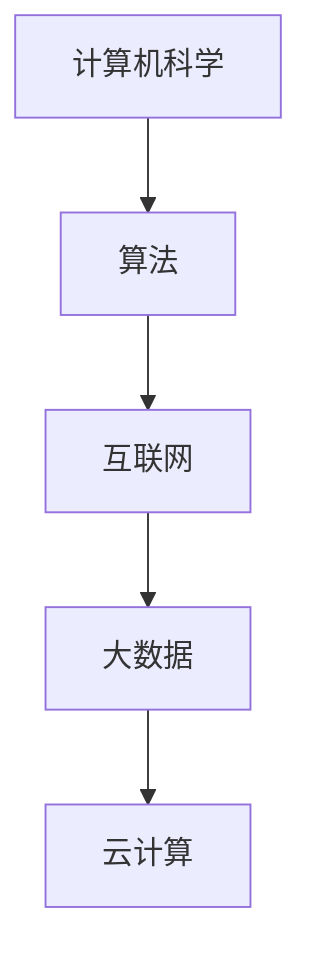
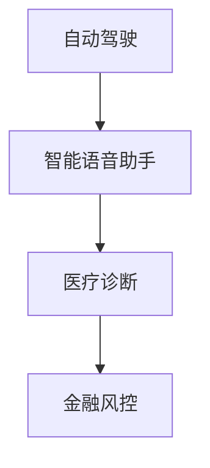
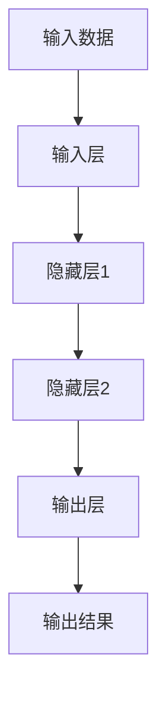

                 

关键词：科技创新、社会进步、信息技术、人工智能、可持续发展、未来展望。

> 摘要：本文深入探讨了科技创新对社会进步的深远影响。通过对信息技术、人工智能等领域的分析，本文阐述了创新在推动社会发展的核心作用，并提出了未来科技创新发展的趋势和面临的挑战。

## 1. 背景介绍

科技创新一直是推动社会进步的关键驱动力。从工业革命时期蒸汽机的发明，到互联网时代的到来，每一次重大的科技创新都为社会带来了翻天覆地的变化。在当今世界，信息技术和人工智能等新兴技术不断涌现，进一步加速了社会的发展步伐。然而，科技创新不仅带来了机会，也带来了挑战。如何在充分利用科技红利的同时，应对随之而来的社会问题，成为了一个亟待解决的重要议题。

## 2. 核心概念与联系

### 2.1 信息技术的发展

信息技术的发展是科技创新的重要组成部分。从计算机科学的基石——算法，到互联网的普及，再到大数据、云计算等前沿技术的应用，信息技术为社会的发展提供了强大的动力。下面是一个简化的 Mermaid 流程图，展示了信息技术的发展路径：



### 2.2 人工智能的应用

人工智能作为当前最热门的科技领域之一，其应用范围不断扩大。从自动驾驶、智能语音助手，到医疗诊断、金融风控，人工智能正在深刻改变我们的生活。以下是人工智能应用的一些主要领域：



## 3. 核心算法原理 & 具体操作步骤

### 3.1 算法原理概述

人工智能的核心在于算法。深度学习、强化学习、生成对抗网络等算法是实现人工智能的关键技术。其中，深度学习通过多层神经网络模型，模拟人脑的神经元结构，实现了对复杂数据的处理和模式识别。以下是深度学习的原理概述：



### 3.2 算法步骤详解

深度学习算法的具体步骤包括：

1. 数据预处理：对输入数据进行清洗、归一化等处理，使其适合模型训练。
2. 模型构建：选择合适的神经网络结构，定义网络的层数和每层的神经元数量。
3. 训练过程：使用训练数据，通过反向传播算法不断调整网络权重，使模型能够对数据进行准确的预测。
4. 验证与测试：使用验证数据和测试数据对模型进行评估，调整模型参数，提高预测精度。

### 3.3 算法优缺点

深度学习算法具有以下优点：

- 能够处理大量复杂的非线性数据。
- 具有强大的自适应能力，能够自动提取数据中的特征。
- 在图像识别、自然语言处理等领域取得了显著的成果。

然而，深度学习算法也存在一些缺点：

- 模型训练需要大量计算资源和时间。
- 对数据的依赖性较强，数据质量直接影响模型的性能。
- 模型决策过程不透明，难以解释。

### 3.4 算法应用领域

深度学习算法在多个领域有着广泛的应用，包括：

- 图像识别：例如人脸识别、自动驾驶。
- 自然语言处理：例如机器翻译、文本生成。
- 医疗诊断：例如疾病预测、医学影像分析。

## 4. 数学模型和公式 & 详细讲解 & 举例说明

### 4.1 数学模型构建

深度学习中的数学模型主要包括线性模型、非线性模型等。线性模型是最基础的模型，其公式为：

\[ y = \beta_0 + \beta_1 \cdot x \]

其中，\( y \) 是输出，\( \beta_0 \) 和 \( \beta_1 \) 是模型参数，\( x \) 是输入。

非线性模型则通过引入激活函数，将线性模型扩展为非线性模型。一个常见的激活函数是 sigmoid 函数：

\[ f(x) = \frac{1}{1 + e^{-x}} \]

### 4.2 公式推导过程

以多层感知机（MLP）为例，其公式推导过程如下：

1. 输入层到隐藏层的传递函数为：

\[ z_i = \sum_{j=1}^{n} \beta_{ij} \cdot x_j + \beta_{i0} \]

2. 隐藏层到输出层的传递函数为：

\[ y = \sum_{i=1}^{m} \beta_{i} \cdot z_i + \beta_0 \]

3. 损失函数为：

\[ J = \frac{1}{2} \sum_{i=1}^{m} (y_i - \hat{y_i})^2 \]

其中，\( y_i \) 是真实标签，\( \hat{y_i} \) 是预测标签。

### 4.3 案例分析与讲解

以人脸识别为例，我们使用深度学习算法进行人脸识别的流程如下：

1. 数据预处理：对图像进行灰度化、大小调整等处理。
2. 模型构建：选择合适的深度学习模型，如卷积神经网络（CNN）。
3. 训练过程：使用大量人脸图像进行模型训练，调整模型参数。
4. 验证与测试：使用验证集和测试集对模型进行评估，调整模型参数。
5. 部署应用：将训练好的模型部署到实际应用场景，进行人脸识别。

## 5. 项目实践：代码实例和详细解释说明

### 5.1 开发环境搭建

为了实践深度学习算法，我们需要搭建一个合适的开发环境。以下是一个基本的步骤：

1. 安装 Python 和相关依赖库，如 TensorFlow、Keras 等。
2. 下载并处理人脸图像数据集。
3. 编写深度学习模型代码。

### 5.2 源代码详细实现

以下是一个基于卷积神经网络（CNN）的人脸识别模型代码示例：

```python
import tensorflow as tf
from tensorflow.keras.models import Sequential
from tensorflow.keras.layers import Conv2D, MaxPooling2D, Flatten, Dense

# 模型构建
model = Sequential([
    Conv2D(32, (3, 3), activation='relu', input_shape=(64, 64, 3)),
    MaxPooling2D((2, 2)),
    Flatten(),
    Dense(128, activation='relu'),
    Dense(1, activation='sigmoid')
])

# 编译模型
model.compile(optimizer='adam', loss='binary_crossentropy', metrics=['accuracy'])

# 模型训练
model.fit(x_train, y_train, epochs=10, batch_size=32, validation_data=(x_val, y_val))

# 模型评估
model.evaluate(x_test, y_test)
```

### 5.3 代码解读与分析

上述代码首先构建了一个简单的 CNN 模型，包括卷积层、池化层、全连接层等。然后使用训练数据对模型进行训练，并使用验证数据对模型进行评估。

### 5.4 运行结果展示

运行上述代码后，我们可以在控制台看到训练和验证的损失函数和准确率。这些指标可以帮助我们评估模型的性能，并进一步调整模型参数。

## 6. 实际应用场景

### 6.1 医疗健康

人工智能在医疗健康领域有着广泛的应用，例如疾病预测、药物研发、医疗影像分析等。通过深度学习算法，医生可以更加准确地诊断疾病，提高治疗效果。

### 6.2 金融行业

金融行业也受益于人工智能技术的发展。例如，利用人工智能进行风险评估、欺诈检测、投资决策等，可以提高金融市场的效率，降低风险。

### 6.3 交通运输

自动驾驶、智能交通系统等技术的应用，为交通运输领域带来了巨大的变革。通过人工智能技术，可以实现更高效、更安全的交通运输。

## 7. 工具和资源推荐

### 7.1 学习资源推荐

- 《深度学习》（Goodfellow、Bengio、Courville 著）：这是一本经典的深度学习教材，适合初学者和专业人士。
- 《Python 数据科学手册》（Wes McKinney 著）：这本书涵盖了数据科学领域的各个方面，包括数据预处理、数据分析、可视化等。

### 7.2 开发工具推荐

- TensorFlow：这是一个开源的深度学习框架，适用于各种深度学习项目。
- Keras：这是一个基于 TensorFlow 的深度学习库，提供了简洁、易于使用的 API。

### 7.3 相关论文推荐

- “Deep Learning for Text Classification”（Zhang et al., 2015）：这篇文章介绍了如何使用深度学习进行文本分类。
- “Convolutional Neural Networks for Visual Recognition”（Krizhevsky et al., 2012）：这篇文章介绍了卷积神经网络在图像识别领域的应用。

## 8. 总结：未来发展趋势与挑战

### 8.1 研究成果总结

近年来，人工智能领域取得了显著的成果。深度学习算法在图像识别、自然语言处理等领域表现出了强大的能力。同时，计算机硬件性能的提升，也为人工智能的发展提供了有力的支持。

### 8.2 未来发展趋势

未来，人工智能将继续深入各个领域，推动社会进步。例如，在医疗健康领域，人工智能可以帮助医生更准确地诊断疾病；在金融行业，人工智能可以提供更智能的投资决策。

### 8.3 面临的挑战

然而，人工智能的发展也面临一些挑战。首先，数据质量和隐私保护是亟待解决的问题。其次，人工智能的决策过程需要更加透明和可解释。此外，人工智能的发展也需要平衡经济效益和社会责任。

### 8.4 研究展望

未来，人工智能的研究将朝着更加智能化、自适应化的方向发展。通过跨学科的融合，人工智能将解决更多复杂的社会问题，推动社会进步。

## 9. 附录：常见问题与解答

### 9.1 什么是人工智能？

人工智能是指通过计算机模拟人类的智能行为，实现自主学习和决策的技术。

### 9.2 深度学习与机器学习有什么区别？

深度学习是机器学习的一种方法，主要依赖于多层神经网络进行数据处理和模式识别。

### 9.3 人工智能有哪些应用领域？

人工智能的应用领域非常广泛，包括医疗健康、金融行业、交通运输、智能家居等。

---

作者：禅与计算机程序设计艺术 / Zen and the Art of Computer Programming

<|end|>

