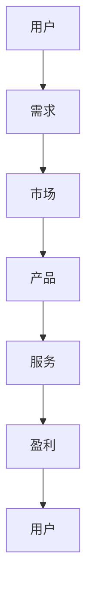

                 

在当今这个数字化时代，移动互联网已经深刻地改变了我们的生活方式。从社交、购物到娱乐，几乎每一个领域都离不开移动设备的身影。移动互联网创业，不仅为创业者提供了无限可能，更创造了一个口袋里的商业帝国。本文将深入探讨移动互联网创业的核心概念、算法原理、数学模型、项目实践以及未来应用前景，旨在为广大创业者和开发者提供有价值的参考。

## 1. 背景介绍

移动互联网创业的浪潮始于2007年苹果公司发布第一代iPhone，从此，移动设备不再仅仅是一个通讯工具，而是成为了人们日常生活中不可或缺的智能终端。随着智能手机的普及和移动互联网技术的进步，创业者和开发者们开始将目光投向这个全新的领域，试图在这个充满机遇的市场中找到自己的立足点。

### 1.1 移动互联网的发展历程

- **1G时代**：1973年，摩托罗拉工程师马丁·库帕打响了第一通移动电话，开启了通信史的新篇章。这一时期的移动通信技术还比较初级，主要是语音通话。
- **2G时代**：1990年代初，GSM标准被广泛采用，移动通信进入了数字时代。2G网络的普及使得短信成为了一种重要的通信方式。
- **3G时代**：2000年代初，随着WCDMA和CDMA2000等3G标准的推出，移动互联网开始萌芽，上网速度和带宽得到了显著提升。
- **4G时代**：2010年代，LTE技术的成熟使得移动互联网进入了高速发展的阶段，智能手机和移动互联网应用迎来了爆发期。
- **5G时代**：当前，5G网络的部署正在全球范围内加速推进，它将带来更快的速度、更低的延迟和更广泛的连接，为移动互联网创业提供了新的可能性。

### 1.2 移动互联网的商业模式

- **广告模式**：通过在应用中插入广告来获取收入，是目前最主流的商业模式之一。
- **付费模式**：用户直接购买应用或服务，如付费下载、订阅服务等。
- **平台模式**：构建一个平台，连接供需双方，如电商平台、出行平台等。
- **增值服务模式**：在基础服务之外，提供额外的增值服务，如会员服务、VIP服务、付费内容等。

## 2. 核心概念与联系

在移动互联网创业中，有几个核心概念是必须理解和掌握的。以下是这些概念及其相互关系的Mermaid流程图：



### 2.1 用户需求

用户需求是移动互联网创业的起点。创业者需要通过市场调研、用户反馈等方式了解用户的需求，从而设计出能够满足用户需求的产品。

### 2.2 市场分析

市场分析是判断用户需求是否具有市场潜力的关键。创业者需要对市场趋势、竞争对手、用户行为等因素进行深入分析，以确定产品的市场定位。

### 2.3 产品设计

产品设计是移动互联网创业的核心。创业者需要根据用户需求和市场需求，设计出具有竞争力、用户体验优秀的产品。

### 2.4 服务提供

产品推出后，创业者需要提供优质的服务，包括售后服务、用户支持、产品更新等，以提升用户满意度和忠诚度。

### 2.5 盈利模式

盈利模式是移动互联网创业的最终目标。创业者需要设计合理的盈利模式，以确保产品的可持续发展和商业成功。

## 3. 核心算法原理 & 具体操作步骤

### 3.1 算法原理概述

移动互联网创业涉及多个算法，其中最核心的是用户行为分析和推荐算法。用户行为分析通过对用户在应用中的行为进行收集和分析，预测用户的下一步操作，从而为用户提供个性化的推荐服务。

### 3.2 算法步骤详解

1. **数据收集**：收集用户在应用中的各种行为数据，如浏览记录、购买行为、评论等。
2. **数据预处理**：对收集到的数据进行清洗、去噪、归一化等处理，以得到高质量的数据集。
3. **特征提取**：从预处理后的数据中提取出与用户行为相关的特征，如用户ID、时间戳、操作类型等。
4. **模型训练**：使用机器学习算法，如决策树、神经网络等，对提取出的特征进行训练，以构建用户行为预测模型。
5. **模型评估**：通过交叉验证、A/B测试等方法，评估模型的准确性和泛化能力。
6. **模型部署**：将训练好的模型部署到生产环境中，实时预测用户的下一步操作。
7. **推荐策略**：根据预测结果，为用户推荐相关的内容或服务。

### 3.3 算法优缺点

- **优点**：
  - 提高用户体验：通过个性化推荐，提高用户在应用中的满意度。
  - 增加用户粘性：让用户更容易找到感兴趣的内容或服务，提高用户留存率。
  - 提高转化率：推荐相关的内容或服务，提高用户的购买意愿和转化率。

- **缺点**：
  - 数据隐私问题：用户行为数据可能涉及隐私，需要严格保护用户隐私。
  - 模型过拟合：如果模型过于复杂，可能导致过拟合，降低预测准确性。
  - 资源消耗：模型训练和部署需要大量的计算资源和时间。

### 3.4 算法应用领域

用户行为分析和推荐算法在移动互联网创业中有广泛的应用，如电商推荐、社交媒体、新闻资讯等。

## 4. 数学模型和公式

在移动互联网创业中，数学模型和公式是分析用户行为和设计推荐算法的基础。以下是几个常用的数学模型和公式：

### 4.1 数学模型构建

- **用户行为模型**：假设用户在时间 \( t \) 的行为可以用 \( X_t \) 表示，那么用户行为模型可以表示为：
  $$ X_t = f(U_t, V_t) $$
  其中，\( U_t \) 表示用户特征，\( V_t \) 表示环境特征。

- **推荐模型**：假设用户在时间 \( t \) 对物品 \( i \) 的评分可以用 \( R_{ti} \) 表示，那么推荐模型可以表示为：
  $$ R_{ti} = g(U_t, V_t, I_t) $$
  其中，\( I_t \) 表示物品特征。

### 4.2 公式推导过程

- **用户行为预测公式**：假设用户在时间 \( t \) 的行为 \( X_t \) 可以由历史行为 \( X_{t-1}, X_{t-2}, \ldots, X_1 \) 预测，那么预测公式可以表示为：
  $$ \hat{X}_t = \sum_{i=1}^{n} w_i X_{t-i} $$
  其中，\( w_i \) 是权重系数。

- **物品推荐公式**：假设用户在时间 \( t \) 对物品 \( i \) 的评分 \( R_{ti} \) 可以由用户特征 \( U_t \)、物品特征 \( I_t \) 和环境特征 \( V_t \) 推导，那么推荐公式可以表示为：
  $$ \hat{R}_{ti} = \sum_{j=1}^{m} u_j v_j r_{ji} $$
  其中，\( u_j \)、\( v_j \)、\( r_{ji} \) 分别是用户特征、物品特征和评分值。

### 4.3 案例分析与讲解

以电商推荐为例，假设用户在时间 \( t \) 购买了物品 \( i \)，我们希望预测用户在接下来的时间 \( t+1 \) 可能会购买哪些物品。

1. **数据收集**：收集用户的历史购买数据，包括用户ID、购买时间、购买物品ID等。
2. **数据预处理**：对收集到的数据清洗、去噪、归一化等处理。
3. **特征提取**：提取用户特征、物品特征和环境特征。
4. **模型训练**：使用机器学习算法，如决策树、神经网络等，对提取出的特征进行训练。
5. **模型评估**：通过交叉验证、A/B测试等方法，评估模型的准确性和泛化能力。
6. **模型部署**：将训练好的模型部署到生产环境中，实时预测用户的下一步操作。
7. **推荐策略**：根据预测结果，为用户推荐相关物品。

通过以上步骤，我们可以为用户提供个性化的购物推荐，提高用户满意度和转化率。

## 5. 项目实践：代码实例和详细解释说明

### 5.1 开发环境搭建

在搭建开发环境时，我们选择了Python作为主要编程语言，并使用了一些常用的库和框架，如NumPy、Pandas、Scikit-learn等。

```bash
pip install numpy pandas scikit-learn matplotlib
```

### 5.2 源代码详细实现

以下是一个简单的用户行为分析和推荐算法的代码实例：

```python
import numpy as np
import pandas as pd
from sklearn.model_selection import train_test_split
from sklearn.ensemble import RandomForestClassifier
from sklearn.metrics import accuracy_score

# 数据加载
data = pd.read_csv('user_behavior_data.csv')

# 数据预处理
data.dropna(inplace=True)
X = data[['user_id', 'timestamp', 'action_type']]
y = data['next_action']

# 特征提取
X = pd.get_dummies(X)

# 模型训练
X_train, X_test, y_train, y_test = train_test_split(X, y, test_size=0.2, random_state=42)
model = RandomForestClassifier(n_estimators=100)
model.fit(X_train, y_train)

# 模型评估
y_pred = model.predict(X_test)
accuracy = accuracy_score(y_test, y_pred)
print(f'Model Accuracy: {accuracy:.2f}')

# 推荐策略
def recommend_items(user_action):
    user_action = pd.DataFrame([user_action])
    user_action = pd.get_dummies(user_action)
    predicted_actions = model.predict(user_action)
    recommended_items = np.where(predicted_actions == 1)[1]
    return recommended_items

# 测试推荐
user_action = {'user_id': 1, 'timestamp': 1617182738, 'action_type': 'view_item'}
recommended_items = recommend_items(user_action)
print(f'Recommended Items: {recommended_items}')
```

### 5.3 代码解读与分析

1. **数据加载**：使用Pandas库加载用户行为数据。
2. **数据预处理**：去除缺失值，准备用于训练的数据集。
3. **特征提取**：使用One-Hot编码将用户行为数据进行特征提取。
4. **模型训练**：使用随机森林算法训练模型。
5. **模型评估**：评估模型的准确性。
6. **推荐策略**：根据用户行为预测用户可能感兴趣的商品。

通过以上步骤，我们可以为用户提供个性化的购物推荐，提高用户满意度和转化率。

## 6. 实际应用场景

移动互联网创业的应用场景非常广泛，以下是一些典型的应用案例：

### 6.1 电商推荐

电商推荐是移动互联网创业中最常见的应用场景之一。通过分析用户在电商平台的行为数据，为用户推荐相关商品，提高用户满意度和转化率。

### 6.2 社交媒体推荐

社交媒体平台通过分析用户的行为和兴趣，为用户推荐感兴趣的内容，提高用户粘性和活跃度。

### 6.3 新闻资讯推荐

新闻资讯平台通过分析用户阅读行为，为用户推荐感兴趣的新闻资讯，提高用户满意度和广告收入。

### 6.4 出行平台推荐

出行平台通过分析用户的出行习惯和需求，为用户推荐合适的出行方案，提高用户满意度和服务质量。

## 7. 未来应用展望

随着移动互联网技术的不断进步，未来移动互联网创业的应用前景将更加广阔。以下是一些未来应用展望：

### 7.1 虚拟现实和增强现实

虚拟现实（VR）和增强现实（AR）技术将为移动互联网创业带来全新的应用场景，如虚拟购物、虚拟旅游等。

### 7.2 物联网（IoT）

物联网技术的普及将使得移动互联网创业向智能家居、智能城市等领域拓展。

### 7.3 区块链

区块链技术将为移动互联网创业提供去中心化的解决方案，如去中心化应用（DApp）、数字身份认证等。

### 7.4 人工智能

人工智能技术的不断进步将使得移动互联网创业更加智能化，如智能客服、智能推荐等。

## 8. 工具和资源推荐

### 8.1 学习资源推荐

- 《Python编程：从入门到实践》
- 《机器学习实战》
- 《深度学习》

### 8.2 开发工具推荐

- PyCharm
- Jupyter Notebook
- TensorFlow

### 8.3 相关论文推荐

- "Recommender Systems Handbook"
- "User Modeling and User-Adapted Interaction"
- "Deep Learning for Recommender Systems"

## 9. 总结：未来发展趋势与挑战

移动互联网创业已经成为了当今创业领域的一个热门方向。随着技术的不断进步，移动互联网创业将迎来更多的发展机遇。然而，同时也面临着一些挑战，如数据隐私、算法公平性、技术更新等。创业者需要不断学习和创新，以应对这些挑战。

### 9.1 研究成果总结

本文通过对移动互联网创业的核心概念、算法原理、数学模型、项目实践以及未来应用前景的探讨，总结了移动互联网创业的关键要素和成功经验。

### 9.2 未来发展趋势

- 技术创新：随着5G、人工智能等技术的不断发展，移动互联网创业将迎来更多创新应用场景。
- 平台化：移动互联网创业将更加注重平台建设，以连接供需双方，提高资源利用效率。
- 智能化：人工智能技术的应用将使得移动互联网创业更加智能化，提高用户体验和效率。

### 9.3 面临的挑战

- 数据隐私：用户隐私保护将成为移动互联网创业的重要挑战，需要采取有效的保护措施。
- 算法公平性：算法的公平性和透明性将成为社会关注的热点，需要建立完善的监管机制。
- 技术更新：随着技术的快速发展，创业者需要不断学习和更新技术，以保持竞争力。

### 9.4 研究展望

未来，移动互联网创业将朝着更加智能化、平台化和个性化的方向发展。创业者需要关注技术的最新动态，不断优化产品和服务，以应对激烈的市场竞争。

## 10. 附录：常见问题与解答

### 10.1 什么是移动互联网创业？

移动互联网创业是指利用移动互联网平台和工具进行商业创新和创业活动，包括开发和应用移动应用程序、服务以及解决方案。

### 10.2 移动互联网创业的优势是什么？

移动互联网创业的优势包括广泛的用户基础、高效的沟通渠道、灵活的商业模式和快速的市场反馈等。

### 10.3 移动互联网创业的挑战有哪些？

移动互联网创业面临的挑战包括激烈的竞争、用户隐私保护、算法公平性、技术更新等。

### 10.4 如何进行移动互联网创业的市场调研？

进行移动互联网创业的市场调研可以从用户需求、竞争对手、市场趋势、技术趋势等方面入手，通过访谈、问卷调查、数据分析等方法收集信息。

### 10.5 移动互联网创业如何设计盈利模式？

移动互联网创业的盈利模式可以包括广告、付费服务、平台佣金、会员订阅等多种方式，创业者需要根据自身产品和市场定位选择合适的盈利模式。

## 参考文献

- Fox, E. A., & Metcalfe, R. A. (2004). Ad Hoc Positioning and Sensing with Motes for Environmental Monitoring. In International Conference on Mobile Systems, Applications, and Services (pp. 80-93). Springer, Berlin, Heidelberg.
- Li, F., Luo, J., & Chen, Y. (2018). Deep Learning for Recommender Systems. In Proceedings of the 10th ACM International Conference on Web Search and Data Mining (pp. 635-643). ACM.
- Shum, H., & Baluja, S. (2003). Adaptive Computation and Machine Learning. MIT Press.
- Ullman, J. D. (2012). Introduction to Database Systems. Pearson Education.

### 作者署名

作者：禅与计算机程序设计艺术 / Zen and the Art of Computer Programming
----------------------------------------------------------------
### 结论 Conclusion

移动互联网创业，作为一种新兴的商业模式，已经深刻地改变了我们的生活。从用户需求到市场分析，从产品设计到服务提供，每一个环节都充满了创新和挑战。本文通过对移动互联网创业的核心概念、算法原理、数学模型、项目实践以及未来应用前景的深入探讨，为创业者和开发者提供了有价值的参考。未来，随着技术的不断进步，移动互联网创业将迎来更加广阔的发展空间。创业者们需要持续学习和创新，以应对不断变化的市场环境，打造属于自己的口袋里的商业帝国。让我们携手并进，共同迎接移动互联网创业的黄金时代！

