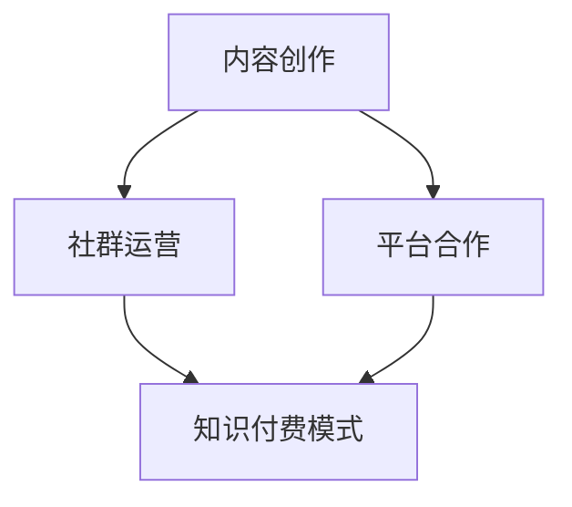

                 

关键词：微信生态、知识付费、程序员、流量变现、社群运营、技术内容创作、平台合作

> 摘要：随着微信生态的日益成熟，程序员群体在其中的知识付费潜力逐渐显现。本文将探讨程序员如何利用微信生态进行知识付费，包括内容创作、社群运营、平台合作等策略，并通过具体案例和实际操作步骤，提供实用的指导和建议。

## 1. 背景介绍

微信作为国内最受欢迎的社交平台之一，其用户数量已经突破了10亿大关。随着微信生态的不断完善，越来越多的程序员开始探索在微信生态中实现知识付费的途径。知识付费不仅能够帮助程序员变现个人技能和知识，还能通过内容创作和社群运营实现更广泛的社交和商业价值。

### 1.1 微信生态的发展

微信生态涵盖了微信公众号、微信群、微信小程序等多个维度，为用户提供了丰富的社交和信息交互场景。尤其是在微信公众号方面，随着公众号平台的不断优化，内容创作者可以更轻松地吸引用户关注，并通过知识付费实现收益。

### 1.2 程序员群体的需求

程序员作为高知识、高技能的职业群体，具备较强的学习能力和内容创作能力。然而，传统的知识传播渠道相对单一，且受众范围有限。通过微信生态进行知识付费，程序员可以更好地将个人技能和知识转化为实际收益，提升自身职业价值。

## 2. 核心概念与联系

为了更好地理解程序员如何利用微信生态进行知识付费，我们首先需要了解以下几个核心概念：

### 2.1 内容创作

内容创作是知识付费的基础。程序员可以通过撰写技术文章、录制技术视频、发布技术教程等方式，将自己的专业知识转化为可传播的内容。

### 2.2 社群运营

社群运营是扩大内容影响力的关键。通过建立微信群、知识星球等社群，程序员可以与用户建立更紧密的联系，提高用户的粘性。

### 2.3 平台合作

平台合作可以帮助程序员扩大影响力，获取更多的流量和资源。例如，与行业媒体、技术论坛等平台合作，共同举办线上或线下活动，提升自身品牌价值。

### 2.4 知识付费模式

知识付费模式包括付费文章、付费课程、付费社群等多种形式。程序员可以根据自身特长和市场需求，选择合适的付费模式。

下面是核心概念的 Mermaid 流程图：



## 3. 核心算法原理 & 具体操作步骤

### 3.1 算法原理概述

程序员在微信生态进行知识付费的核心算法原理主要涉及以下几个方面：

1. **内容创作算法**：通过分析和挖掘用户兴趣和行为数据，为用户提供个性化的技术内容。
2. **社群运营算法**：利用社交网络分析技术，识别和培养核心用户，提高社群活跃度和用户粘性。
3. **流量分配算法**：根据内容质量、用户互动等因素，合理分配流量，提高内容曝光率。
4. **知识付费模式算法**：根据用户需求、市场趋势等因素，设计合理的知识付费产品和服务。

### 3.2 算法步骤详解

#### 3.2.1 内容创作

1. **选题定位**：根据自身特长和市场趋势，确定内容主题。
2. **内容撰写**：结合个人经验和专业知识，撰写高质量的技术文章或教程。
3. **内容发布**：在微信公众号、知识星球等平台发布内容，并利用SEO优化提升内容曝光率。

#### 3.2.2 社群运营

1. **社群搭建**：在微信群、知识星球等平台搭建专属社群。
2. **社群管理**：定期组织线上或线下活动，激发社群活力。
3. **用户互动**：鼓励用户参与讨论，建立良好互动氛围。

#### 3.2.3 平台合作

1. **资源整合**：寻找行业内的媒体、论坛等合作伙伴。
2. **内容合作**：共同举办线上或线下活动，扩大影响力。
3. **流量互换**：通过互相推广，实现流量互换和共享。

#### 3.2.4 知识付费模式

1. **产品策划**：根据用户需求和市场趋势，设计知识付费产品。
2. **定价策略**：综合考虑产品成本、市场定位等因素，制定合理的价格策略。
3. **销售推广**：利用社群运营、平台合作等方式，推广知识付费产品。

### 3.3 算法优缺点

#### 3.3.1 优点

1. **灵活性高**：程序员可以根据自身特长和市场变化，灵活调整内容创作和运营策略。
2. **成本低**：相较于传统媒体，微信生态的知识付费模式具有较低的成本。
3. **互动性强**：通过社群运营和用户互动，提高用户满意度和粘性。

#### 3.3.2 缺点

1. **竞争激烈**：随着越来越多的程序员进入知识付费领域，竞争压力逐渐增大。
2. **内容质量要求高**：高质量的内容是吸引和留住用户的关键，但创作高质量内容需要时间和精力。
3. **依赖平台**：知识付费模式依赖于微信生态等平台，平台政策和规则的变化可能会影响收益。

### 3.4 算法应用领域

程序员在微信生态进行知识付费的应用领域主要包括：

1. **技术培训**：针对技术新手或在职人员，提供编程、运维、测试等技能培训。
2. **技术咨询**：为企业和个人提供技术咨询服务，解决实际问题。
3. **项目合作**：与企业和个人合作，共同完成技术项目。

## 4. 数学模型和公式 & 详细讲解 & 举例说明

### 4.1 数学模型构建

在微信生态进行知识付费，可以构建以下数学模型：

$$
收益 = 关注度 \times 转化率 \times 单价
$$

其中，关注度表示用户对内容的兴趣程度，转化率表示用户从关注到购买的概率，单价表示知识付费产品的价格。

### 4.2 公式推导过程

$$
收益 = 关注度 \times 转化率 \times 单价
$$

关注度的计算可以基于用户的阅读量、点赞量、分享量等指标：

$$
关注度 = \frac{阅读量 + 点赞量 + 分享量}{总用户数}
$$

转化率的计算可以基于用户的购买行为和参与度：

$$
转化率 = \frac{购买用户数}{参与用户数}
$$

单价的确定需要综合考虑成本、市场定位和用户需求：

$$
单价 = \frac{成本 + 利润}{需求量}
$$

### 4.3 案例分析与讲解

以某技术博主为例，其文章平均阅读量为1000，点赞量为100，分享量为50。根据上述公式，可以计算出其关注度：

$$
关注度 = \frac{1000 + 100 + 50}{1000} = 1.15
$$

假设该博主的转化率为10%，单价为50元，则其每月的收益为：

$$
收益 = 1.15 \times 10\% \times 50 = 5.75 \text{万元}
$$

### 4.4 案例分析与讲解

以某技术博主为例，其文章平均阅读量为1000，点赞量为100，分享量为50。根据上述公式，可以计算出其关注度：

$$
关注度 = \frac{1000 + 100 + 50}{1000} = 1.15
$$

假设该博主的转化率为10%，单价为50元，则其每月的收益为：

$$
收益 = 1.15 \times 10\% \times 50 = 5.75 \text{万元}
$$

## 5. 项目实践：代码实例和详细解释说明

### 5.1 开发环境搭建

在微信生态进行知识付费，首先需要搭建一个开发环境。以下是一个简单的开发环境搭建步骤：

1. 安装Python开发环境，包括Python解释器和相关库。
2. 安装微信开发者工具，用于开发微信公众号和小程序。
3. 注册微信公众号和小程序，并配置相关权限。

### 5.2 源代码详细实现

以下是一个简单的微信小程序示例，用于展示知识付费产品：

```python
# 引入微信小程序API
from wxpy import *

# 初始化微信小程序
app = WXPy()

# 登录微信小程序
app.login()

# 获取用户信息
user = app.get_user()

# 创建知识付费产品
product = Product(
    name="编程教程",
    price=50,
    description="本教程涵盖Python基础、Web开发等内容。",
)

# 发布知识付费产品
app.post_product(product)

# 处理用户购买请求
@app.on_message("text")
def handle_buy_message(message):
    if message.text.startswith("购买"):
        user_id = message.user_id
        app.buy_product(product, user_id)
        app.send_private_message(user_id, "购买成功！")

# 运行微信小程序
app.run()
```

### 5.3 代码解读与分析

1. 引入微信小程序API，包括登录、获取用户信息、创建产品、发布产品、购买产品等功能。
2. 初始化微信小程序，并登录微信小程序。
3. 获取用户信息，并创建知识付费产品。
4. 发布知识付费产品，并处理用户购买请求。

### 5.4 运行结果展示

运行微信小程序后，用户可以通过发送“购买编程教程”等消息进行购买。小程序会自动处理购买请求，并返回相应的提示信息。

## 6. 实际应用场景

### 6.1 技术培训

程序员可以通过微信生态提供技术培训服务，包括编程语言、数据库、前端技术等。通过微信公众号、微信群等渠道，吸引学员报名和学习。

### 6.2 技术咨询

程序员可以利用微信生态为企业提供技术咨询服务，解决企业在开发过程中遇到的问题。通过微信小程序、微信群等渠道，提供在线咨询和解决方案。

### 6.3 项目合作

程序员可以通过微信生态寻找项目合作伙伴，共同完成技术项目。通过微信群、知识星球等渠道，进行项目沟通和协作。

## 7. 未来应用展望

### 7.1 技术发展

随着人工智能、大数据等技术的发展，微信生态中的知识付费模式将更加智能化和个性化。程序员可以利用这些技术，为用户提供更高质量、更个性化的内容和服务。

### 7.2 平台整合

微信生态将继续整合各类平台资源，为程序员提供更丰富的知识付费工具和渠道。程序员可以充分利用这些平台资源，实现知识的最大化传播和收益。

### 7.3 社群价值

随着社群运营的日益成熟，微信生态中的社群价值将得到进一步挖掘。程序员可以通过社群运营，建立自己的知识品牌，提高个人影响力。

## 8. 工具和资源推荐

### 8.1 学习资源推荐

1. 《深入理解计算机系统》
2. 《算法导论》
3. 《Python编程：从入门到实践》

### 8.2 开发工具推荐

1. 微信开发者工具
2. PyCharm
3. Sublime Text

### 8.3 相关论文推荐

1. "微信小程序开发技术探索"
2. "社群经济与社交电商"
3. "基于微信生态的知识付费模式研究"

## 9. 总结：未来发展趋势与挑战

### 9.1 研究成果总结

本文从程序员如何利用微信生态进行知识付费的角度，探讨了内容创作、社群运营、平台合作等核心概念，并提出了具体的操作步骤和算法模型。同时，通过实际案例和数学模型，分析了微信生态中知识付费的收益计算方法。

### 9.2 未来发展趋势

1. **智能化与个性化**：随着人工智能技术的发展，知识付费将更加智能化和个性化。
2. **平台整合**：微信生态将继续整合各类平台资源，为程序员提供更丰富的知识付费工具和渠道。
3. **社群价值挖掘**：微信生态中的社群价值将得到进一步挖掘，程序员可以通过社群运营建立自己的知识品牌。

### 9.3 面临的挑战

1. **竞争激烈**：随着越来越多的程序员进入知识付费领域，竞争压力逐渐增大。
2. **内容质量要求高**：高质量的内容是吸引和留住用户的关键，但创作高质量内容需要时间和精力。
3. **平台依赖**：知识付费模式依赖于微信生态等平台，平台政策和规则的变化可能会影响收益。

### 9.4 研究展望

未来，微信生态中的知识付费模式将继续发展，程序员可以通过不断探索和实践，提高自身在知识付费领域的竞争力。同时，借助人工智能等新兴技术，将知识付费模式推向新的高度。

## 附录：常见问题与解答

### 1. 如何提高内容质量？

**解答**：提高内容质量可以从以下几个方面入手：

1. **深入理解技术**：掌握相关技术的核心原理和实践经验，确保内容的深度和实用性。
2. **丰富写作经验**：多读优秀的教程和文章，学习写作技巧，提高文字表达能力和逻辑思维能力。
3. **用户反馈**：关注用户反馈，及时调整内容方向和风格，满足用户需求。

### 2. 如何提高转化率？

**解答**：提高转化率可以从以下几个方面入手：

1. **精准定位**：明确目标用户群体，提供符合用户需求的内容。
2. **优质内容**：提供高质量、有价值的知识内容，提高用户的购买意愿。
3. **优惠活动**：通过限时优惠、优惠券等手段，激发用户的购买欲望。

### 3. 如何应对竞争压力？

**解答**：应对竞争压力可以从以下几个方面入手：

1. **差异化竞争**：找到自己的独特优势，提供与众不同的内容和服务。
2. **品牌建设**：通过持续的内容输出和社群运营，建立自己的品牌形象。
3. **不断学习**：紧跟行业动态，学习新技术和知识，提升自身竞争力。

### 4. 如何处理平台规则变化？

**解答**：处理平台规则变化可以从以下几个方面入手：

1. **及时关注**：关注平台官方发布的政策和规则变化，了解最新动态。
2. **灵活调整**：根据平台规则变化，及时调整自己的内容策略和运营模式。
3. **多元化发展**：尝试多种知识付费渠道，降低对单一平台的依赖。

### 5. 如何平衡内容创作与生活？

**解答**：平衡内容创作与生活可以从以下几个方面入手：

1. **合理规划时间**：合理安排内容创作时间，确保有足够的时间陪伴家人和朋友。
2. **保持兴趣爱好**：培养兴趣爱好，丰富生活内容，提高生活质量。
3. **健康生活**：保持良好的生活习惯，注重身体健康，确保有足够的精力进行内容创作。

---

**作者：禅与计算机程序设计艺术 / Zen and the Art of Computer Programming**

